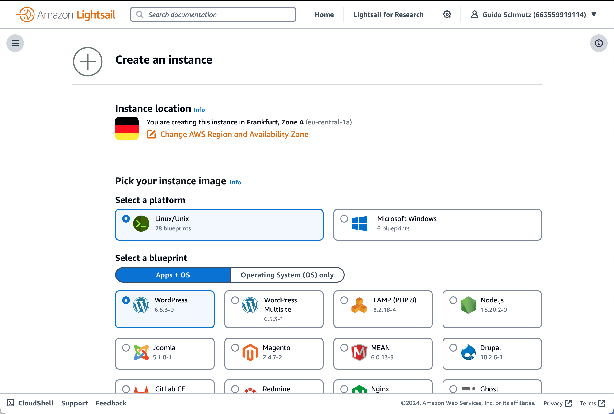
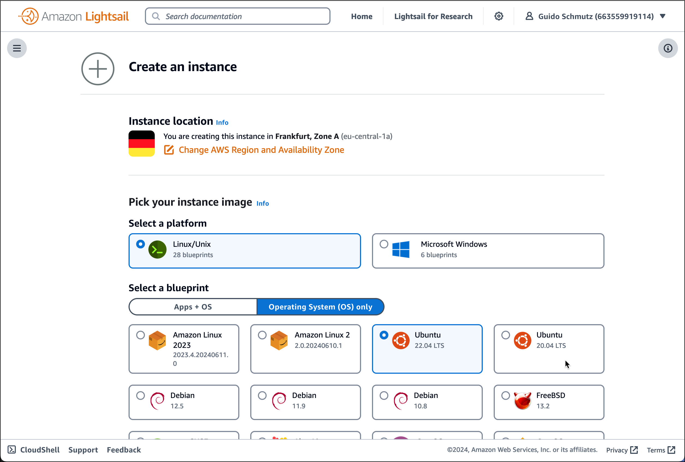
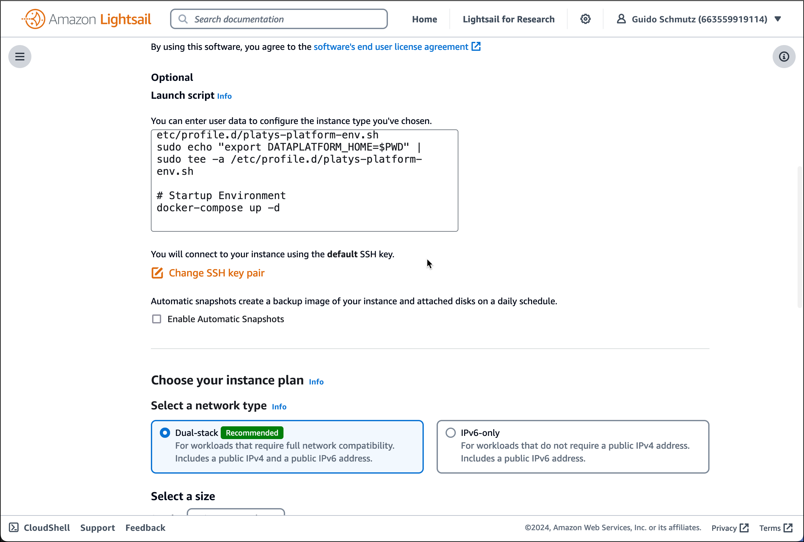
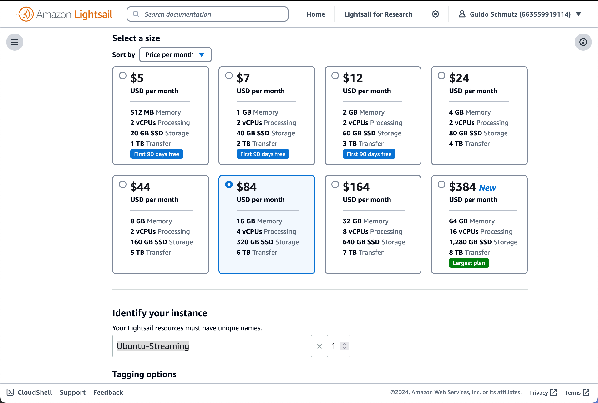
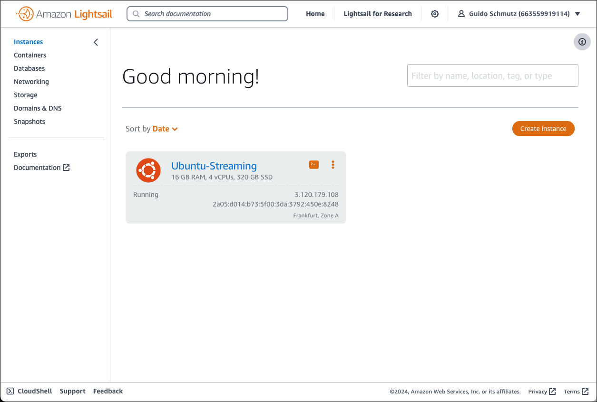
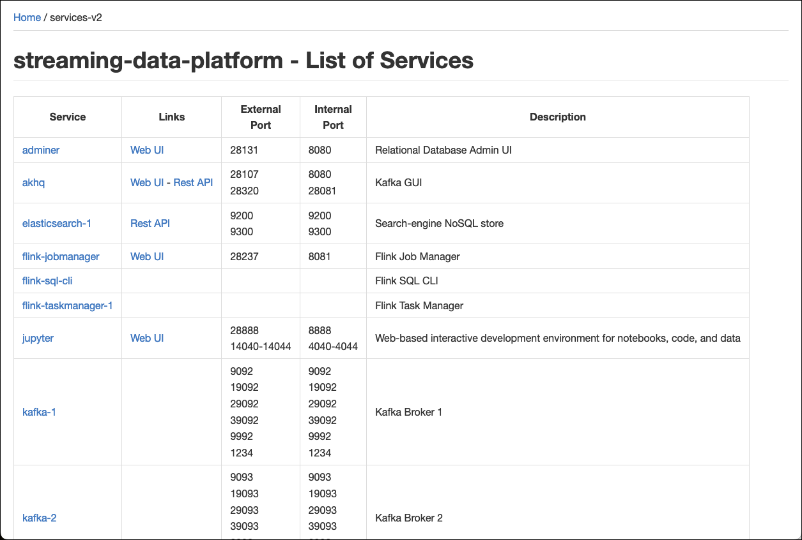
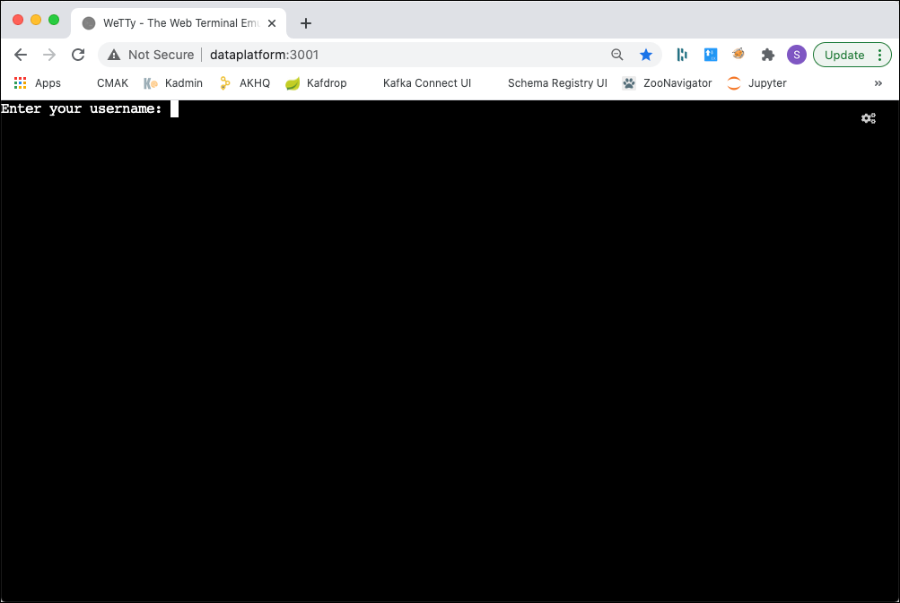
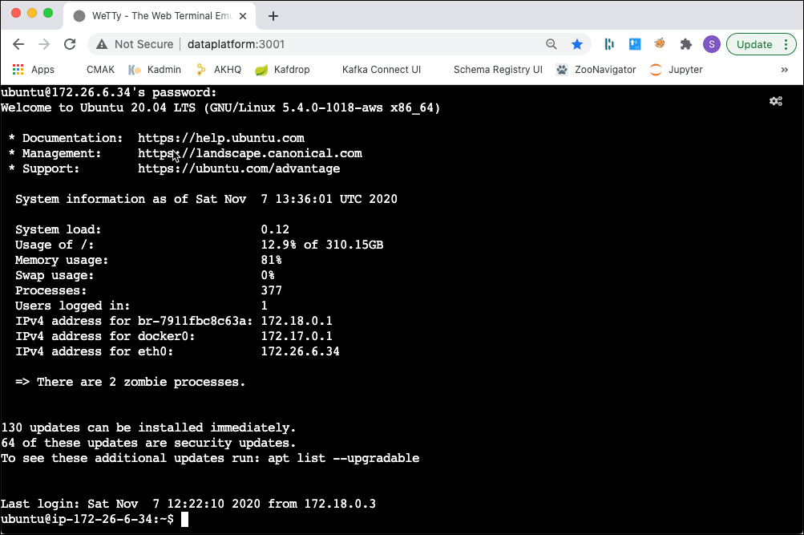

# AWS Lightsail

Navigate to the [AWS Console](http://console.aws.amazon.com) and login with your user. Click on the [Lightsail service](https://lightsail.aws.amazon.com/ls/webapp/home/instances).


## Provision instance

Click **Create instance** to navigate to the **Create an instance** dialog.



Optionally change the **Instance Location** to a AWS region of your liking.
Keep **Linux/Unix** for the **Select a platform** and click on **OS Only** and select **Ubuntu 22.04 LTS** for the **Select a blueprint**.



Scroll down to **Launch script** and add the following script

```
export GITHUB_PROJECT=stream-processing-workshop
export GITHUB_OWNER=gschmutz
export NETWORK_NAME=eth0
export USERNAME=ubuntu
export PASSWORD=abc123!

# Prepare Environment Variables 
export PUBLIC_IP=$(curl ipinfo.io/ip)
export DOCKER_HOST_IP=$(ip addr show ${NETWORK_NAME} | grep "inet\b" | awk '{print $2}' | cut -d/ -f1)

# allow login by password
sudo sed -i "s/.*PasswordAuthentication.*/PasswordAuthentication yes/g" /etc/ssh/sshd_config
echo "${USERNAME}:${PASSWORD}"|chpasswd
sudo service sshd restart

# add alias "dataplatform" to /etc/hosts
echo "$DOCKER_HOST_IP     dataplatform" | sudo tee -a /etc/hosts

# Install Docker
sudo apt-get update
sudo apt-get install \
    ca-certificates \
    curl \
    gnupg \
    lsb-release
sudo mkdir -p /etc/apt/keyrings    
curl -fsSL https://download.docker.com/linux/ubuntu/gpg | sudo gpg --dearmor -o /etc/apt/keyrings/docker.gpg
echo \
  "deb [arch=$(dpkg --print-architecture) signed-by=/etc/apt/keyrings/docker.gpg] https://download.docker.com/linux/ubuntu \
  $(lsb_release -cs) stable" | sudo tee /etc/apt/sources.list.d/docker.list > /dev/null

sudo apt-get update
sudo apt-get install -y docker-ce docker-ce-cli containerd.io docker-compose-plugin
sudo usermod -aG docker $USERNAME

# Install Docker Compose Switch
sudo curl -fL https://github.com/docker/compose-switch/releases/latest/download/docker-compose-linux-amd64 -o /usr/local/bin/compose-switch
chmod +x /usr/local/bin/compose-switch
sudo update-alternatives --install /usr/local/bin/docker-compose docker-compose /usr/local/bin/compose-switch 99

# Install Platys
sudo curl -L "https://github.com/TrivadisPF/platys/releases/download/${PLATYS_VERSION}/platys_${PLATYS_VERSION}_linux_x86_64.tar.gz" -o /tmp/platys.tar.gz
tar zvxf /tmp/platys.tar.gz 
sudo mv platys /usr/local/bin/
sudo chown root:root /usr/local/bin/platys
sudo rm /tmp/platys.tar.gz 

# Install various Utilities
sudo apt-get install -y curl jq kafkacat tmux

# needed for elasticsearch
sudo sysctl -w vm.max_map_count=262144   

# Get the project
cd /home/${USERNAME} 
git clone https://github.com/${GITHUB_OWNER}/${GITHUB_PROJECT}
chown -R ${USERNAME}:${PASSWORD} ${GITHUB_PROJECT}

cd /home/${USERNAME}/${GITHUB_PROJECT}/01-environment/docker

# Make Environment Variables persistent
sudo echo "export PUBLIC_IP=$PUBLIC_IP" | sudo tee -a /etc/profile.d/platys-platform-env.sh
sudo echo "export DOCKER_HOST_IP=$DOCKER_HOST_IP" | sudo tee -a /etc/profile.d/platys-platform-env.sh
sudo echo "export DATAPLATFORM_HOME=$PWD" | sudo tee -a /etc/profile.d/platys-platform-env.sh

# Startup Environment
docker-compose up -d
```

into the **Launch Script** edit field



Under **Choose your instance plan** click on the arrow on the right and select the **16 GB** instance.  

Under **Identify your istance** enter **Ubuntu-NoSQL-1** into the edit field.



Click on **Create Instance** to start provisioning the instance.

The new instance will show up in the Instances list on the Lightsail homepage.



Click on the instance to navigate to the image details page. On the right you can find the Public IP address of the newly created instance, which is **18.196.124.212** in this example, of course your Public IP will be different.


Click **Connect using SSH** to open the console and enter the following command to watch the log file of the init script.

```
tail -f /var/log/cloud-init-output.log --lines 1000
```

The initialisation is finished when you see the `Creating xxxxx .... done` lines after all the docker images have been downloaded, which takes a couple of minutes.


## View Platform Documentation

The platform contains some web-based documentation, which can be accessed once the platform is running. In a web browser, navigate to the public IP <http://18.196.124.212> (replace the IP address by your Public IP address) and you should see a page similar to the one shown here


If you click on the "A list of available services is available here" a page with the list of available services and their IP address will appear



So with all services running, there is one last step to do. We have to configure the Firewall to allow traffic into the Lightsail instance.

## Open Network Firewall

For accessing the services running in the cloud from our machine, we have two options:

1. Open the ports on the firewall (this is what we do here)
2. Create an SSH Tunnel

Because the Lightsail instance is exposed to the public internet, generally opening the ports is not the best idea. But if you open it to accept only traffic from your own IP address, the risk can be minimised. Using an SSH tunnel is more secure, but also more difficult to setup.

So let see how we can open the ports on the firewall. Click on the **Networking** tab/link to navigate to the network settings.


Click on **Add rule** to add a new Firewall rule.

For simplicity reasons, we allow all TCP traffic by selecting **All TCP** on port range **0 - 65535**.
To increase security, you should restrict incoming traffic to one or more IP addresses by selecting the option **Restrict to IP address** and adding the IP address of your client as the **Source IP address**.


To find out your IP address, browse to <https://www.whatismyip.com/> and use the `XXX.XXX.XXX.XXX` value shown right to **My Public IPv4 is:** to replace the `188.60.35.196` value in the image above.

Click on **Create** to save this new Firewall rule and it should be added to the list of rules.


Your instance is now ready to use. Complete the post installation steps documented the [here](README.md).


## Using the Web-Terminal

Before you can use this option, you either have to open the ports on the Firewall documented under **Open Network Firewall**.

After the stack is started, you can use your web browser (best is Chrome) to access the terminal in the ligthsail environment. Navigate to <http://18.196.124.212:3001> (replace the IP address by the IP address your IP address and you should see a back terminal window asking to enter the username to connect:



Enter `ubuntu` for the **username** and enter value you have chosen as your password when creating the lightsail environment (when specifying the **Launch Script**) for the **password** and you should be able to connect.



This finishes the setup of the Platform. You are now ready to start working on the various workshops!


## Stop an Instance

To stop the instance, navigate to the instance overview and click on the drop-down menu and select **Stop**.


Click on **Stop** to confirm stopping the instance.


A stopped instance will still incur charges, you have to delete the instance completely to stop charges.

## Delete an Instance

t.b.d.

## Create a snapshot of an Instance

When an instance is stopped, you can create a snapshot, which you can keep, even if later drop the instance to reduce costs.


You can always recreate an instance based on a snapshot.

# De-provision the environment

To stop the environment, execute the following command:

```
docker-compose stop
```

after that it can be re-started using `docker-compose start`.

To stop and remove all running container, execute the following command:

```
docker-compose down
```
