# Getting started with Apache Kafka

Apache Kafka is a distributed event streaming platform built for high-throughput, fault-tolerant, and real-time data pipelines. Unlike traditional message queues, Kafka persists messages on disk and lets multiple consumers read the same data independently — making it the backbone of modern event-driven architectures.

The two core abstractions are **topics** and **messages**. A topic is a named, ordered log of messages that producers write to and consumers read from. Topics are split into **partitions**, which allow Kafka to scale horizontally and process messages in parallel across a cluster of brokers.

In this workshop you will get hands-on experience with a real multi-broker Kafka cluster: creating topics, producing and consuming messages, working with consumer groups, and using both built-in CLI tools and third-party utilities.

## Table of Contents

- [What you will learn](#what-you-will-learn)
- [Prerequisites](#prerequisites)
- [Using built-in Command Line Utilities](#using-built-in-command-line-utilities)
- [Standalone Tools for working with Kafka](#standalone-tools-for-working-with-kafka)
- [Working with Consumer Groups](#working-with-consumer-groups)
- [Retention and Log Compaction](#retention-and-log-compaction)
- [Publishing a more realistic data stream to Kafka](#publishing-a-more-realistic-data-stream-to-kafka)

## What you will learn

- How to connect to a Kafka broker using the built-in command line utilities
- How to create, describe, and delete Kafka topics
- How to produce and consume messages using `kafka-console-producer` and `kafka-console-consumer`
- How to work with keyed messages in Kafka
- How consumer groups distribute partitions across multiple consumers and how to monitor lag
- How to reset consumer group offsets to re-process messages from the beginning
- How to use `kcat` as a powerful alternative CLI for producing and consuming messages
- How to stream realistic test data into Kafka using a sales data simulator
- How topic retention controls how long data is kept, and how log compaction keeps only the latest value per key
- How to delete a record from a compacted topic using a tombstone message
- How to inspect and manage your Kafka cluster using the AKHQ and Kafbat UI web interfaces

## Prerequisites

- The **Data Platform** described [here](../00-environment/README.md) is running and accessible
- Basic familiarity with the Linux command line

## Using built-in Command Line Utilities

Kafka ships with a set of shell scripts that wrap the underlying Java tools. On a running broker you will find them in `/usr/bin` (or on the `$PATH`). The most commonly used ones are:

| Utility | Purpose |
|---|---|
| `kafka-topics` | Create, list, describe, and delete topics |
| `kafka-console-producer` | Publish messages to a topic from stdin |
| `kafka-console-consumer` | Read messages from a topic to stdout |
| `kafka-consumer-groups` | List consumer groups and inspect/reset offsets |
| `kafka-broker-api-versions` | Discover all brokers and the API versions they support |
| `kafka-metadata-quorum` | Inspect KRaft controller state and replication lag |
| `kafka-configs` | Get and set dynamic broker and topic configuration |

All of these tools accept a `--bootstrap-server` flag to locate the cluster — you only need to supply one or two broker addresses; Kafka discovers the rest automatically.

### Connect to a Kafka Broker

The CLI utilities listed above are installed inside the broker containers, not on the Docker host, so all commands in this section must be run inside one of the broker containers.

In the terminal window, run a `docker exec` command to open an interactive shell in the `kafka-1` container:

```bash
docker exec -ti kafka-1 bash
```

You should see the prompt change to:

```bash
[appuser@kafka-1 ~]$
```

This confirms that you are inside the `kafka-1` broker container. You can now run the CLI commands shown below.

Alternatively, you can run any CLI command directly from the Docker host without opening a shell, by passing it after the container name:

```bash
docker exec -ti kafka-1 kafka-topics --list --bootstrap-server kafka-1:19092,kafka-2:19093
```

Both approaches work — the interactive shell is more convenient when running several commands in a row, while the direct form is handy for one-off commands or scripting.

### Describe the Cluster

Before exploring topics, it is useful to confirm which version of Kafka is running and how many brokers are in the cluster.

Run the following to print the Kafka version:

```bash
kafka-broker-api-versions --bootstrap-server kafka-1:19092 --version
```

You should see something like:

```
8.1.3-ccs
```

Use `kafka-broker-api-versions` to see every broker that is currently part of the cluster:

```bash
kafka-broker-api-versions --bootstrap-server kafka-1:19092,kafka-2:19093 \
  | grep "id:"
```

You should see one line per broker, for example:

```
kafka-1:19092 (id: 1 rack: null) -> (
kafka-2:19093 (id: 2 rack: null) -> (
kafka-3:19094 (id: 3 rack: null) -> (
```

The environment contains a Kafka cluster with 3 brokers, all running on the Docker host. It is not designed for production fault tolerance, but it gives you a realistic multi-broker environment to work with.

For a more detailed view of the cluster metadata — including the current controller and all broker addresses — use `kafka-metadata-quorum` (available in KRaft-mode clusters):

```bash
kafka-metadata-quorum --bootstrap-server kafka-1:19092,kafka-2:19093 describe --status
```

You should see something like:

```bash
ClusterId:              y4vRIwfDT0SkZ65tD7Ey2A
LeaderId:               2
LeaderEpoch:            9
HighWatermark:          25266
MaxFollowerLag:         0
MaxFollowerLagTimeMs:   389
CurrentVoters:          [{"id": 1, "endpoints": ["CONTROLLER://kafka-1:49092"]}, {"id": 2, "endpoints": ["CONTROLLER://kafka-2:49093"]}, {"id": 3, "endpoints": ["CONTROLLER://kafka-3:49094"]}]
CurrentObservers:       []
```

> **What you should see:** A summary showing the current leader (controller), the cluster ID, and how far each broker's log is from being fully caught up.

> **What just happened?** Both commands connect to the bootstrap server and ask for cluster metadata. The bootstrap server responds with the full broker list, so it does not matter which of the three brokers you list in `--bootstrap-server` — Kafka discovers the rest automatically.

### List Topics

Running `kafka-topics` without any options prints the help page:

```bash
root@kafka-1:/# kafka-topics
Create, delete, describe, or change a topic.
Option                                   Description
------                                   -----------
--alter                                  Alter the number of partitions and
                                           replica assignment. (To alter topic
                                           configurations, the kafka-configs
                                           tool can be used.)
--at-min-isr-partitions                  If set when describing topics, only
                                           show partitions whose isr count is
                                           equal to the configured minimum.
--bootstrap-server <String: server to    REQUIRED: The Kafka server to connect
  connect to>                              to.
--command-config <String: command        Property file containing configs to be
  config property file>                    passed to Admin Client.
--config <String: name=value>            A topic configuration override for the
                                           topic being created. The following
                                           is a list of valid configurations:
                                         	cleanup.policy
                                         	compression.gzip.level
                                         	compression.lz4.level
                                         	compression.type
                                         	compression.zstd.level
                                         	delete.retention.ms
                                         	file.delete.delay.ms
                                         	flush.messages
                                         	flush.ms
                                         	follower.replication.throttled.
                                           replicas
                                         	index.interval.bytes
                                         	leader.replication.throttled.replicas
                                         	local.retention.bytes
                                         	local.retention.ms
                                         	max.compaction.lag.ms
                                         	max.message.bytes
                                         	message.timestamp.after.max.ms
                                         	message.timestamp.before.max.ms
                                         	message.timestamp.type
                                         	min.cleanable.dirty.ratio
                                         	min.compaction.lag.ms
                                         	min.insync.replicas
                                         	preallocate
                                         	remote.log.copy.disable
                                         	remote.log.delete.on.disable
                                         	remote.storage.enable
                                         	retention.bytes
                                         	retention.ms
                                         	segment.bytes
                                         	segment.index.bytes
                                         	segment.jitter.ms
                                         	segment.ms
                                         	unclean.leader.election.enable
                                         See the Kafka documentation for full
                                           details on the topic configs. It is
                                           supported only in combination with --
                                           create. (To alter topic
                                           configurations, the kafka-configs
                                           tool can be used.)
--create                                 Create a new topic.
--delete                                 Delete a topic.
--delete-config <String: name>           This option is no longer supported and
                                           has been deprecated since 4.0
--describe                               List details for the given topics.
--exclude-internal                       Exclude internal topics when listing
                                           or describing topics. By default,
                                           the internal topics are included.
--help                                   Print usage information.
--if-exists                              If set when altering or deleting or
                                           describing topics, the action will
                                           only execute if the topic exists.
--if-not-exists                          If set when creating topics, the
                                           action will only execute if the
                                           topic does not already exist.
--list                                   List all available topics.
--partition-size-limit-per-response      The maximum partition size to be
  <Integer: maximum number of              included in one
  partitions per response>                 DescribeTopicPartitions response.
--partitions <Integer: # of partitions>  The number of partitions for the topic
                                           being created or altered. If not
                                           supplied with --create, the topic
                                           uses the cluster default. (WARNING:
                                           If partitions are increased for a
                                           topic that has a key, the partition
                                           logic or ordering of the messages
                                           will be affected).
--replica-assignment <String:            A list of manual partition-to-broker
  broker_id_for_part1_replica1 :           assignments for the topic being
  broker_id_for_part1_replica2 ,           created or altered.
  broker_id_for_part2_replica1 :
  broker_id_for_part2_replica2 , ...>
--replication-factor <Integer:           The replication factor for each
  replication factor>                      partition in the topic being
                                           created. If not supplied, the topic
                                           uses the cluster default.
--topic <String: topic>                  The topic to create, alter, describe
                                           or delete. It also accepts a regular
                                           expression, except for --create
                                           option. Put topic name in double
                                           quotes and use the '\' prefix to
                                           escape regular expression symbols; e.
                                           g. "test\.topic".
--topic-id <String: topic-id>            The topic-id to describe.
--topics-with-overrides                  If set when describing topics, only
                                           show topics that have overridden
                                           configs.
--unavailable-partitions                 If set when describing topics, only
                                           show partitions whose leader is not
                                           available.
--under-min-isr-partitions               If set when describing topics, only
                                           show partitions whose isr count is
                                           less than the configured minimum.
--under-replicated-partitions            If set when describing topics, only
                                           show under-replicated partitions.
--version                                Display Kafka version.
```

### List topics in Kafka

List the topics currently on the cluster using the `--list` option:

```bash
kafka-topics --list --bootstrap-server kafka-1:19092,kafka-2:19093
```

> **What you should see:** A list of topic names. Even on a fresh cluster you will see at least one internal topic — `_schemas` — which is where the Confluent Schema Registry stores its schemas. Later you will see `__consumer_offsets` appear once consumers start committing offsets.

> **What just happened?** `kafka-topics --list` sends a metadata request to the broker and returns the names of all topics known to the cluster. 

### Creating a topic in Kafka

Create a new topic using the `--create` option. We will create a test topic with 6 partitions and a replication factor of 2. The `--if-not-exists` option suppresses errors if the topic already exists.

```bash
kafka-topics --create \
             --if-not-exists \
             --bootstrap-server kafka-1:19092,kafka-2:19093 \
             --topic test-topic \
             --partitions 6 \
             --replication-factor 2
```

> **What you should see:** The command completes silently (no output means success). Re-run `kafka-topics --list` and you will see `test-topic` alongside the internal topics.

> **What just happened?** Kafka registered the new topic in its internal metadata log and instructed the brokers to create the required partition replicas. With 6 partitions and a replication factor of 2, Kafka created 12 replica logs spread across the 3 brokers (4 per broker). One replica per partition is elected **Leader** and handles all reads and writes; the others are **Followers** that stay in sync.

### Describe a Topic

Use `--describe` to see the details of a topic:

```bash
kafka-topics --describe --bootstrap-server kafka-1:19092,kafka-2:19093 --topic test-topic
```

```
Topic: test-topic	TopicId: SfunpJNjT7yZv_mWpb3YLg	PartitionCount: 6	ReplicationFactor: 2	Configs: min.insync.replicas=1
	Topic: test-topic	Partition: 0	Leader: 1	Replicas: 1,2	Isr: 2,1	Elr: 	LastKnownElr:
	Topic: test-topic	Partition: 1	Leader: 2	Replicas: 2,3	Isr: 2,3	Elr: 	LastKnownElr:
	Topic: test-topic	Partition: 2	Leader: 3	Replicas: 3,1	Isr: 3,1	Elr: 	LastKnownElr:
	Topic: test-topic	Partition: 3	Leader: 3	Replicas: 3,2	Isr: 2,3	Elr: 	LastKnownElr:
	Topic: test-topic	Partition: 4	Leader: 2	Replicas: 2,1	Isr: 2,1	Elr: 	LastKnownElr:
	Topic: test-topic	Partition: 5	Leader: 1	Replicas: 1,3	Isr: 3,1	Elr: 	LastKnownElr:
```

> **What you should see:** Six rows, one per partition. Each row shows which broker is the current **Leader**, which brokers hold **Replicas**, and which replicas are in the **In-Sync Replica (ISR)** set — the replicas that are fully caught up with the leader. You will also see two newer KRaft fields: **Elr** (Eligible Leader Replicas) lists replicas that are allowed to be elected leader even if they have fallen slightly behind the ISR; **LastKnownElr** records the last known set of eligible replicas before a controller failover. Both fields are empty on a healthy cluster.

> **What just happened?** Kafka distributed the 6 partition leaders evenly across the 3 brokers. If a leader broker goes down, Kafka automatically elects a new leader from the ISR set — this is how the cluster stays available without losing data.

### Producing and Consuming Messages

Kafka provides two command line utilities for testing: `kafka-console-producer` and `kafka-console-consumer`.

In a new terminal window, start the consumer on `test-topic`:

```bash
kafka-console-consumer --bootstrap-server kafka-1:19092,kafka-2:19093 \
                       --topic test-topic
```

Once started, the consumer waits for incoming messages.

In another terminal, connect to `kafka-1`:

```bash
docker exec -ti kafka-1 bash
```

Then start the producer:

```bash
kafka-console-producer --bootstrap-server kafka-1:19092,kafka-2:19093 --topic test-topic
```

By default, the console producer batches messages for up to **1,000 ms** or until the batch reaches **16,384 bytes**. These limits are controlled by the `--timeout` and `--max-partition-memory-bytes` options respectively.

> **Note:** Even if you specify `linger.ms` and `batch.size` via `--producer-property` or `--producer.config`, they will always be overridden by the above options.

At the `>` prompt, type a few messages and press **Enter** after each one:

```
>aaa
>bbb
>ccc
>ddd
>eee
```

> **What you should see:** The messages appear in the consumer terminal in the same order they were typed.

```
aaa
bbb
ccc
ddd
eee
```

> **What just happened?** The producer wrote each message to one of the 6 partitions (chosen by the default round-robin partitioner). The consumer subscribed to all 6 partitions and displayed messages as they arrived. Because you typed slowly enough that each message was sent and consumed before the next, they appear in order — but this ordering is only guaranteed *within a single partition*, not across partitions.

You can stop the consumer with **Ctrl-C**. To replay all messages from the beginning, use the `--from-beginning` option.

You can also pipe a message directly into the producer:

```bash
echo "This is my first message!" | kafka-console-producer \
                         --bootstrap-server kafka-1:19092,kafka-2:19093 \
                         --topic test-topic
```

Or send multiple messages using a bash for loop:

```bash
for i in 1 2 3 4 5 6 7 8 9 10
do
   echo "This is message $i" | kafka-console-producer \
          --bootstrap-server kafka-1:19092,kafka-2:19093 \
          --topic test-topic \
          --batch-size 1 &
done
```

The trailing `&` runs each producer in the background in parallel.

> **What you should see:** The messages arrive at the consumer out of order, because they are published in parallel to multiple partitions.

> **What just happened?** Each of the 10 producer processes ran independently and wrote its message to a different partition. Because messages in different partitions are consumed independently, the consumer sees them interleaved in delivery order — not the order they were sent.

### Working with Keyed Messages

A Kafka message consists of a key and a value. The value carries the event payload; the key is optional but controls which partition the message is routed to. When no key is provided, Kafka sets it to `null` and distributes messages across partitions using round-robin.

We can verify this by consuming with `--from-beginning` and enabling partition and key display. Stop the existing consumer and restart it:

```bash
kafka-console-consumer --bootstrap-server kafka-1:19092,kafka-2:19093 \
                      --topic test-topic \
                      --property print.partition=true \
                      --property print.key=true \
                      --property key.separator=, \
                      --from-beginning
```

> **What you should see:** Every message is printed as `Partition:N	null,aaa` — the partition number, followed by the `null` key and the value separated by a comma. This confirms that all messages produced so far had no key, and lets you see which partition each message was routed to.

> **What just happened?** Kafka stores a key field alongside every message. When the producer sends no key, it stores `null`. The consumer's `print.key=true` property makes this visible at consumption time.

To produce messages with a key, add the `parse.key` and `key.separator` properties:

```bash
kafka-console-producer  --bootstrap-server kafka-1:19092,kafka-2:19093 \
                        --topic test-topic \
                        --property parse.key=true \
                        --property key.separator=,
```

Type a few messages in `key,value` format, e.g. `key1,value1`, and verify they appear in the consumer window with both key and value printed.

> **What you should see:** The consumer now displays `key1,value1` — the key and value separated by the configured comma. Produce multiple messages with the same key and they will always land on the same partition.

> **What just happened?** Kafka hashes the key using the murmur2 algorithm and maps the result to a partition number. Any two messages with the same key always hash to the same partition, guaranteeing that a consumer reading that partition sees those messages in the exact order they were written.

### Deleting a Kafka topic

Let's first create a new topic and add some messages.

```bash
kafka-topics --create \
             --if-not-exists \
             --bootstrap-server kafka-1:19092,kafka-2:19093 \
             --topic test-delete-topic \
             --partitions 6 \
             --replication-factor 2

for i in 1 2 3 4 5 6 7 8 9 10 11 12 13 14 15 16 17 18 19 20
do
   echo "This is message $i" | kafka-console-producer \
          --bootstrap-server kafka-1:19092,kafka-2:19093 \
          --topic test-delete-topic \
          --batch-size 1 &
done
```             

Now let's delete this topic using the `--delete` option:

```bash
kafka-topics  --bootstrap-server kafka-1:19092,kafka-2:19093 --delete --topic test-delete-topic
```

> **What you should see:** The command completes silently. Re-run `kafka-topics --list` and `test-topic` will no longer appear.

> **What just happened?** Kafka queued the topic for deletion. With `delete.topic.enable=true` (configured in the platform), the broker asynchronously removes the underlying partition log files. The topic disappears from the metadata immediately, even before the file cleanup completes.


## Standalone Tools for working with Kafka

In addition to the built-in CLI utilities, several third-party tools make it easier to produce, consume, and inspect Kafka data. In this section we will look at **kcat**, a lightweight native command-line client, and two web UIs — **AKHQ** and **Kafbat UI** — that let you browse topics, monitor consumer groups, and manage your cluster from a browser.

### `kcat`

[kcat](https://github.com/edenhill/kcat) is a command line utility for testing and debugging Apache Kafka. Described as "netcat for Kafka", it is a lightweight, native alternative to `kafka-console-producer` and `kafka-console-consumer` for producing, consuming, and inspecting messages.

> **Note:** `kcat` is a producer/consumer tool only — it cannot create, delete, or configure topics. Use `kafka-topics` and `kafka-configs` (the built-in CLI utilities covered earlier) for all topic management tasks.

`kcat` is available as a container in the Data Platform (enabled via `KCAT_enable: true`). You can also install it locally on any **Linux** or **Mac** computer to connect to a remote Kafka cluster.

#### Installing `kcat` locally

In all workshops we assume that `kcat` is installed locally on the Docker host and that the `dataplatform` alias has been added to `/etc/hosts`.

> **Note:** `kcat` used to be `kafkacat` before version 1.7. If you have an older installation, replace `kcat` with `kafkacat` in the commands below, or define an alias: `alias kcat=kafkacat`.

**_Ubuntu > 23.04_**

```bash
sudo apt-get install kcat
```

Verify the installation:

```bash
$ kcat -V
kcat - Apache Kafka producer and consumer tool
https://github.com/edenhill/kcat
Copyright (c) 2014-2021, Magnus Edenhill
Version 1.7.1 (JSON, Transactions, IncrementalAssign, librdkafka 2.0.2 builtin.features=gzip,snappy,ssl,sasl,regex,lz4,sasl_gssapi,sasl_plain,sasl_scram,plugins,zstd,sasl_oauthbearer)
```

**_macOS_**

```bash
brew install kcat
```

Verify the installation:

```bash
% kcat -V
kcat - Apache Kafka producer and consumer tool
https://github.com/edenhill/kcat
Copyright (c) 2014-2021, Magnus Edenhill
Version 1.7.0 (JSON, Avro, Transactions, IncrementalAssign, librdkafka 2.0.2 builtin.features=gzip,snappy,ssl,sasl,regex,lz4,sasl_gssapi,sasl_plain,sasl_scram,plugins,zstd,sasl_oauthbearer,http,oidc)
```

**_Docker_**

You can also run `kcat` as a Docker container:

```bash
docker exec -ti kcat kcat
```

Set an alias to use the containerized version transparently:

```bash
alias kcat='docker exec -ti kcat kcat'
```

See [Running in Docker](https://github.com/edenhill/kcat#running-in-docker) for more options.

**_Windows_**

There is no official Windows build. You can try the unofficial build at <https://ci.appveyor.com/project/edenhill/kafkacat/builds/23675338/artifacts>, or run `kcat` as a Docker container as shown above.

#### Display `kcat` options

Running `kcat` without arguments prints the full option list:

```bash
> kcat
Error: -b <broker,..> missing

Usage: kcat <options> [file1 file2 .. | topic1 topic2 ..]]
kcat - Apache Kafka producer and consumer tool
https://github.com/edenhill/kcat
Copyright (c) 2014-2021, Magnus Edenhill
Version 1.7.1 (JSON, Transactions, IncrementalAssign, librdkafka 2.3.0 builtin.features=gzip,snappy,ssl,sasl,regex,lz4,sasl_gssapi,sasl_plain,sasl_scram,plugins,zstd,sasl_oauthbearer)


General options:
  -C | -P | -L | -Q  Mode: Consume, Produce, Metadata List, Query mode
  -G <group-id>      Mode: High-level KafkaConsumer (Kafka >=0.9 balanced consumer groups)
                     Expects a list of topics to subscribe to
  -t <topic>         Topic to consume from, produce to, or list
  -p <partition>     Partition
  -b <brokers,..>    Bootstrap broker(s) (host[:port])
  -D <delim>         Message delimiter string:
                     a-z | \r | \n | \t | \xNN ..
                     Default: \n
  -K <delim>         Key delimiter (same format as -D)
  -c <cnt>           Limit message count
  -m <seconds>       Metadata (et.al.) request timeout.
                     This limits how long kcat will block
                     while waiting for initial metadata to be
                     retrieved from the Kafka cluster.
                     It also sets the timeout for the producer's
                     transaction commits, init, aborts, etc.
                     Default: 5 seconds.
  -F <config-file>   Read configuration properties from file,
                     file format is "property=value".
                     The KCAT_CONFIG=path environment can also be used, but -F takes precedence.
                     The default configuration file is $HOME/.config/kcat.conf
  -X list            List available librdkafka configuration properties
  -X prop=val        Set librdkafka configuration property.
                     Properties prefixed with "topic." are
                     applied as topic properties.
  -X dump            Dump configuration and exit.
  -d <dbg1,...>      Enable librdkafka debugging:
                     all,generic,broker,topic,metadata,feature,queue,msg,protocol,cgrp,security,fetch,interceptor,plugin,consumer,admin,eos,mock,assignor,conf
  -q                 Be quiet (verbosity set to 0)
  -v                 Increase verbosity
  -E                 Do not exit on non-fatal error
  -V                 Print version
  -h                 Print usage help

Producer options:
  -z snappy|gzip|lz4 Message compression. Default: none
  -p -1              Use random partitioner
  -D <delim>         Delimiter to split input into messages
  -K <delim>         Delimiter to split input key and message
  -k <str>           Use a fixed key for all messages.
                     If combined with -K, per-message keys
                     takes precendence.
  -H <header=value>  Add Message Headers (may be specified multiple times)
  -l                 Send messages from a file separated by
                     delimiter, as with stdin.
                     (only one file allowed)
  -T                 Output sent messages to stdout, acting like tee.
  -c <cnt>           Exit after producing this number of messages
  -Z                 Send empty messages as NULL messages
  file1 file2..      Read messages from files.
                     With -l, only one file permitted.
                     Otherwise, the entire file contents will
                     be sent as one single message.
  -X transactional.id=.. Enable transactions and send all
                     messages in a single transaction which
                     is committed when stdin is closed or the
                     input file(s) are fully read.
                     If kcat is terminated through Ctrl-C
                     (et.al) the transaction will be aborted.

Consumer options:
  -o <offset>        Offset to start consuming from:
                     beginning | end | stored |
                     <value>  (absolute offset) |
                     -<value> (relative offset from end)
                     s@<value> (timestamp in ms to start at)
                     e@<value> (timestamp in ms to stop at (not included))
  -e                 Exit successfully when last message received
  -f <fmt..>         Output formatting string, see below.
                     Takes precedence over -D and -K.
  -J                 Output with JSON envelope
  -s key=<serdes>    Deserialize non-NULL keys using <serdes>.
  -s value=<serdes>  Deserialize non-NULL values using <serdes>.
  -s <serdes>        Deserialize non-NULL keys and values using <serdes>.
                     Available deserializers (<serdes>):
                       <pack-str> - A combination of:
                                    <: little-endian,
                                    >: big-endian (recommended),
                                    b: signed 8-bit integer
                                    B: unsigned 8-bit integer
                                    h: signed 16-bit integer
                                    H: unsigned 16-bit integer
                                    i: signed 32-bit integer
                                    I: unsigned 32-bit integer
                                    q: signed 64-bit integer
                                    Q: unsigned 64-bit integer
                                    c: ASCII character
                                    s: remaining data is string
                                    $: match end-of-input (no more bytes remaining or a parse error is raised).
                                       Not including this token skips any
                                       remaining data after the pack-str is
                                       exhausted.
  -D <delim>         Delimiter to separate messages on output
  -K <delim>         Print message keys prefixing the message
                     with specified delimiter.
  -O                 Print message offset using -K delimiter
  -c <cnt>           Exit after consuming this number of messages
  -Z                 Print NULL values and keys as "NULL" instead of empty.
                     For JSON (-J) the nullstr is always null.
  -u                 Unbuffered output

Metadata options (-L):
  -t <topic>         Topic to query (optional)

Query options (-Q):
  -t <t>:<p>:<ts>    Get offset for topic <t>,
                     partition <p>, timestamp <ts>.
                     Timestamp is the number of milliseconds
                     since epoch UTC.
                     Requires broker >= 0.10.0.0 and librdkafka >= 0.9.3.
                     Multiple -t .. are allowed but a partition
                     must only occur once.

Format string tokens:
  %s                 Message payload
  %S                 Message payload length (or -1 for NULL)
  %R                 Message payload length (or -1 for NULL) serialized
                     as a binary big endian 32-bit signed integer
  %k                 Message key
  %K                 Message key length (or -1 for NULL)
  %T                 Message timestamp (milliseconds since epoch UTC)
  %h                 Message headers (n=v CSV)
  %t                 Topic
  %p                 Partition
  %o                 Message offset
  \n \r \t           Newlines, tab
  \xXX \xNNN         Any ASCII character
 Example:
  -f 'Topic %t [%p] at offset %o: key %k: %s\n'

JSON message envelope (on one line) when consuming with -J:
 { "topic": str, "partition": int, "offset": int,
   "tstype": "create|logappend|unknown", "ts": int, // timestamp in milliseconds since epoch
   "broker": int,
   "headers": { "<name>": str, .. }, // optional
   "key": str|json, "payload": str|json,
   "key_error": str, "payload_error": str, //optional
   "key_schema_id": int, "value_schema_id": int //optional
 }
 notes:
   - key_error and payload_error are only included if deserialization fails.
   - key_schema_id and value_schema_id are included for successfully deserialized Avro messages.

Consumer mode (writes messages to stdout):
  kcat -b <broker> -t <topic> -p <partition>
 or:
  kcat -C -b ...

High-level KafkaConsumer mode:
  kcat -b <broker> -G <group-id> topic1 top2 ^aregex\d+

Producer mode (reads messages from stdin):
  ... | kcat -b <broker> -t <topic> -p <partition>
 or:
  kcat -P -b ...

Metadata listing:
  kcat -L -b <broker> [-t <topic>]

Query offset by timestamp:
  kcat -Q -b broker -t <topic>:<partition>:<timestamp>
```

#### Consuming messages using `kcat`

All examples below use `kcat`. Replace with `kafkacat` if you are on a pre-1.7 installation.

The simplest invocation consumes all messages from the beginning of the topic:

```bash
kcat -b dataplatform:9092 -t test-topic
```

To start at the end of the topic and only receive new messages, use the `-o end` option:

```bash
kcat -b dataplatform:9092 -t test-topic -o end
```

To show only the last message per partition, set `-o -1`. `-o -2` would show the last two per partition:

```bash
kcat -b dataplatform:9092 -t test-topic -o -1
```

To show only the last message from a single partition, add the `-p` option:

```bash
kcat -b dataplatform:9092 -t test-topic -p1 -o -1
```

Use the `-f` format string to print the partition, key, and value alongside each message:

```bash
kcat -b dataplatform:9092 -t test-topic -f 'Part-%p => %k:%s\n'
```

> **What you should see:** Each message printed as `Part-3 => :aaa`, showing the source partition. Messages from the same partition appear in offset order; messages from different partitions are interleaved in the order they were fetched.

> **What just happened?** Unlike `kafka-console-consumer`, `kcat` is a lightweight native client that connects directly to the broker without Java consumer group overhead. The `-f` format string is evaluated per message and gives you full control over what metadata is printed — useful for debugging partition routing and key distribution.

To display `null` keys explicitly, add the `-Z` flag:

```bash
kcat -b dataplatform:9092 -t test-topic -f 'Part-%p => %k:%s\n' -Z
```

To emit each message as a JSON envelope, use `-J`:

```bash
kcat -b dataplatform:9092 -t test-topic -J
```

#### Producing messages using `kcat`

Switch to producer mode with the `-P` flag:

```bash
kcat -b dataplatform:9092 -t test-topic -P
```

To produce messages with a key, use `-K` to specify the key/value delimiter:

```bash
kcat -b dataplatform:9092 -t test-topic -P -K , -X topic.partitioner=murmur2_random
```

#### Listing cluster metadata using `kcat`

Use the `-L` flag to list all topics and their partition details without connecting to a broker container:

```bash
kcat -b dataplatform:9092 -L
```

To limit the output to a single topic:

```bash
kcat -b dataplatform:9092 -L -t test-topic
```

> **What you should see:** For each topic, a block showing the partition count, the leader broker for each partition, and the replica and ISR sets — equivalent to `kafka-topics --describe` but runnable directly from the Docker host without `docker exec`.

#### Querying offsets by timestamp

Use the `-Q` flag to find the offset at a specific point in time. The timestamp is in milliseconds since epoch UTC:

```bash
kcat -b dataplatform:9092 -Q -t test-topic:0:1700000000000
```

You can query multiple partitions in one command:

```bash
kcat -b dataplatform:9092 -Q -t test-topic:0:1700000000000 -t test-topic:1:1700000000000
```

> **What you should see:** The offset of the first message in each partition whose timestamp is greater than or equal to the given value. Take the returned offset and pass it to a consumer with `-o <offset>` to replay events from a known point in time.

#### Consuming as a consumer group

Use the `-G` flag to consume as a named high-level consumer group. `kcat` will join the group and be assigned partitions just like any other consumer:

```bash
kcat -b dataplatform:9092 -G my-kcat-group test-topic
```

> **What you should see:** Messages from the partitions assigned to this consumer. If you run a second `kcat -G` command with the same group ID in another terminal, Kafka will rebalance and split the partitions between the two instances.

> **Note:** Offsets committed by `kcat -G` are visible in `kafka-consumer-groups --describe` just like any other consumer group.

#### Producing from a file or pipe

Produce the contents of a file, sending each line as a separate message:

```bash
kcat -b dataplatform:9092 -t test-topic -P -l data.txt
```

Or pipe the output of another command directly into `kcat`:

```bash
echo "hello from pipe" | kcat -b dataplatform:9092 -t test-topic -P
```

To send an entire file as a single message (not line-by-line), omit the `-l` flag:

```bash
kcat -b dataplatform:9092 -t test-topic -P data.txt
```

> **What just happened?** Without `-l`, `kcat` reads the whole file and sends it as one message payload. With `-l`, `kcat` splits on the delimiter (default: newline) and sends each line as an individual message — useful for bulk-loading test data.

#### Producing messages with headers

Use `-H` to attach one or more headers to every produced message:

```bash
kcat -b dataplatform:9092 -t test-topic -P \
  -H source=workshop \
  -H environment=dev
```

Consume with `-f '%h'` to verify the headers were attached:

```bash
kcat -b dataplatform:9092 -t test-topic -o end -f 'Headers: %h | Value: %s\n'
```

> **What you should see:** Each message printed with its headers in `name=value` CSV format alongside the payload. Message headers are useful for routing metadata, tracing IDs, or schema hints without embedding that information in the message value itself.

Find more examples on the [kcat GitHub project](https://github.com/edenhill/kcat) or in the [Confluent Documentation](https://docs.confluent.io/platform/current/tools/kafkacat-usage.html).

### Using AKHQ

[AKHQ](https://akhq.io/) is an open-source web UI for managing Kafka topics, consumer groups, the schema registry, connectors, and more. It runs as part of the **Data Platform** and is accessible at <http://dataplatform:28107/>.

By default you will land on the topics overview page.

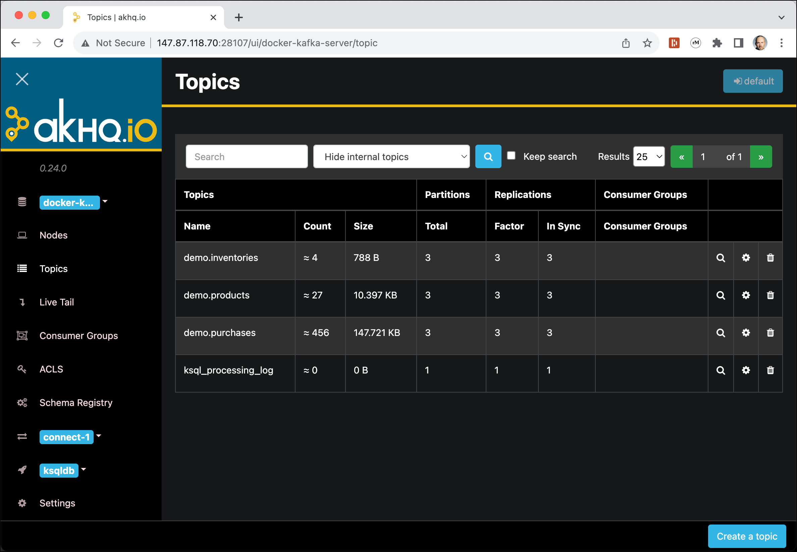

Navigate to **Nodes** in the left menu to see the Kafka cluster and its 3 brokers.

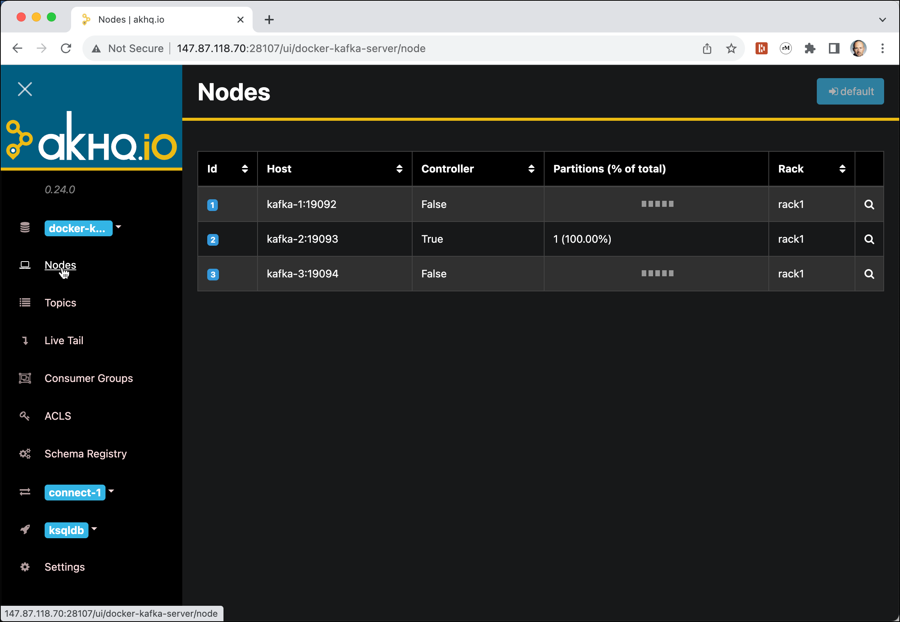

Click on **Topics** in the menu to return to the topics view.

By default only user-created topics are shown. Select **Show all topics** from the dropdown to also display internal topics such as `__consumer_offsets`.

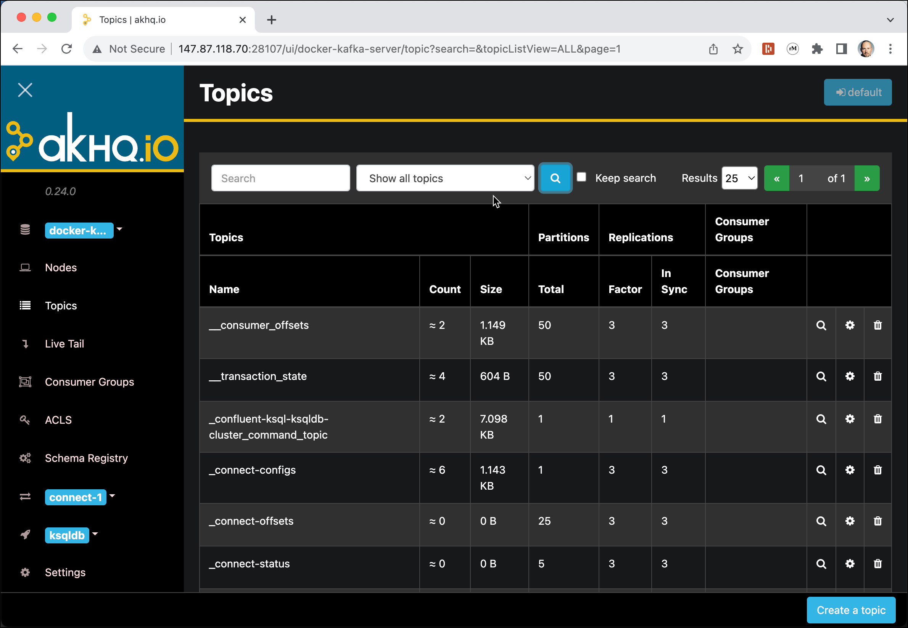

To browse the messages stored in a topic, click the **magnifying glass** icon on the right side of any topic row.

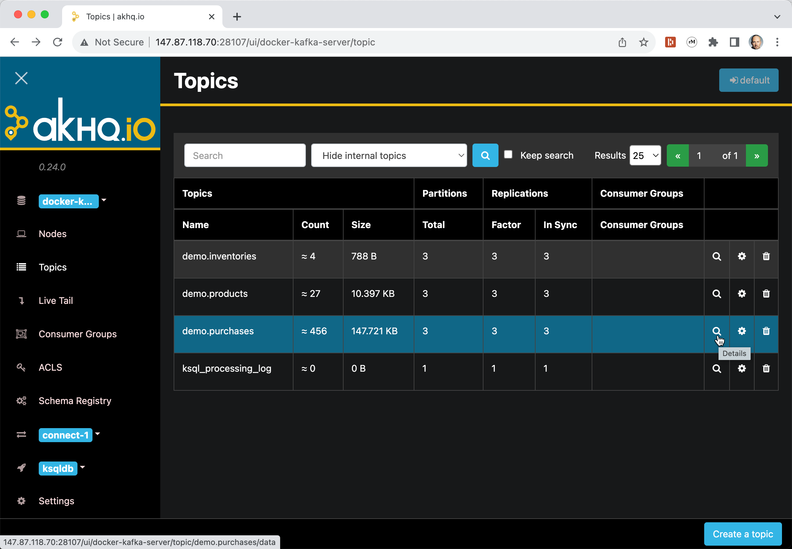

> **What you should see:** The first page of messages for that topic, displayed in a table with offset, partition, timestamp, key, and value columns.

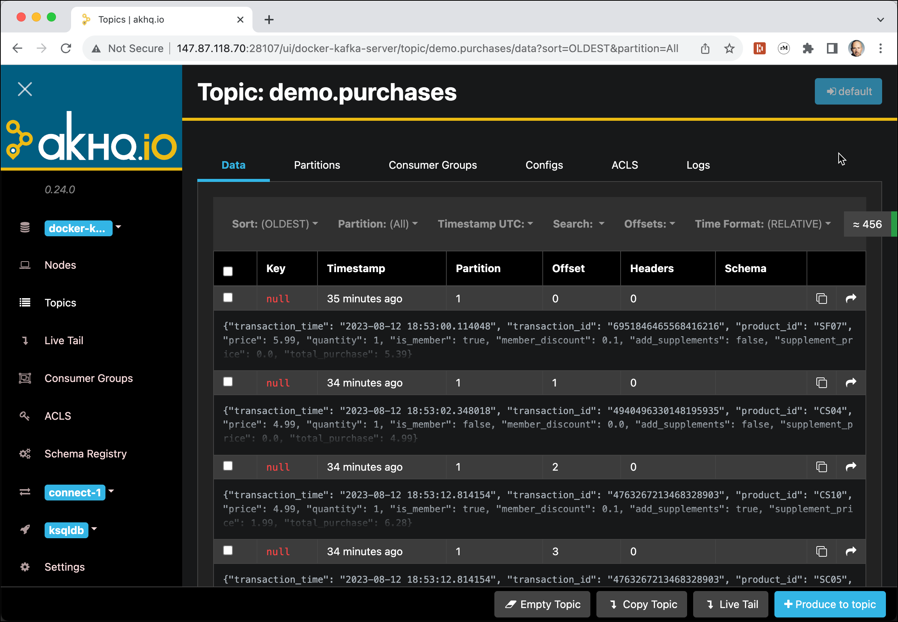

To watch live data arriving in a topic, navigate to **Live Tail** in the left menu. If the sales simulator is no longer running, restart it first.

Select one or more topics to tail:

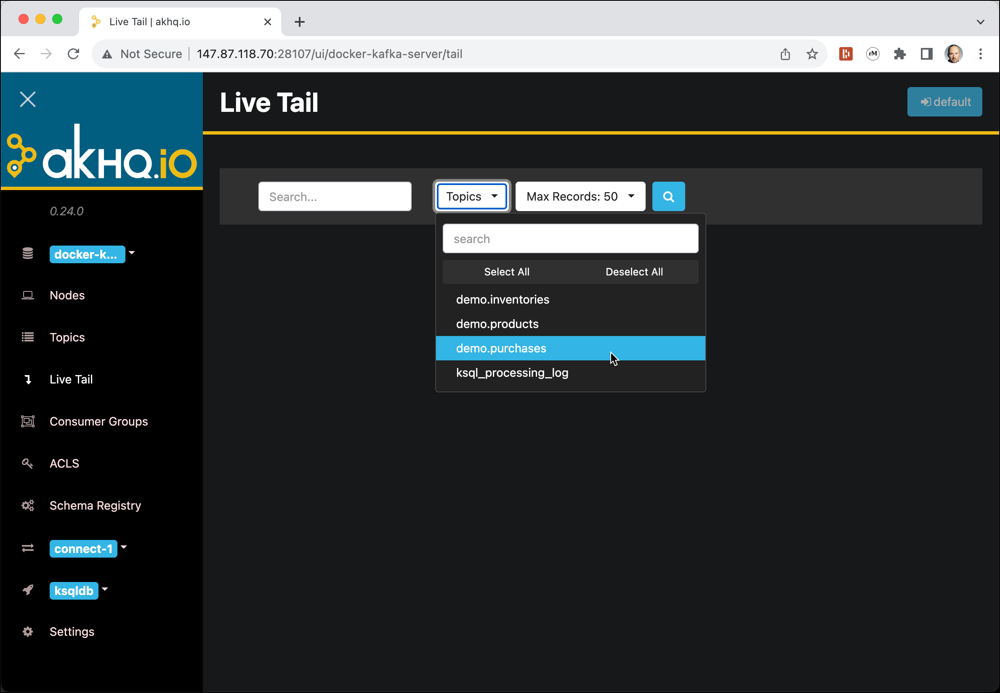

Click the **magnifying glass** icon to start the live tail — messages will appear as they arrive.

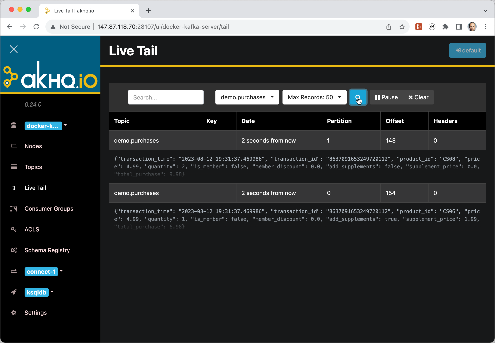

To empty a topic, click its **magnifying glass** icon on the Topics page and then click **Empty Topic**.

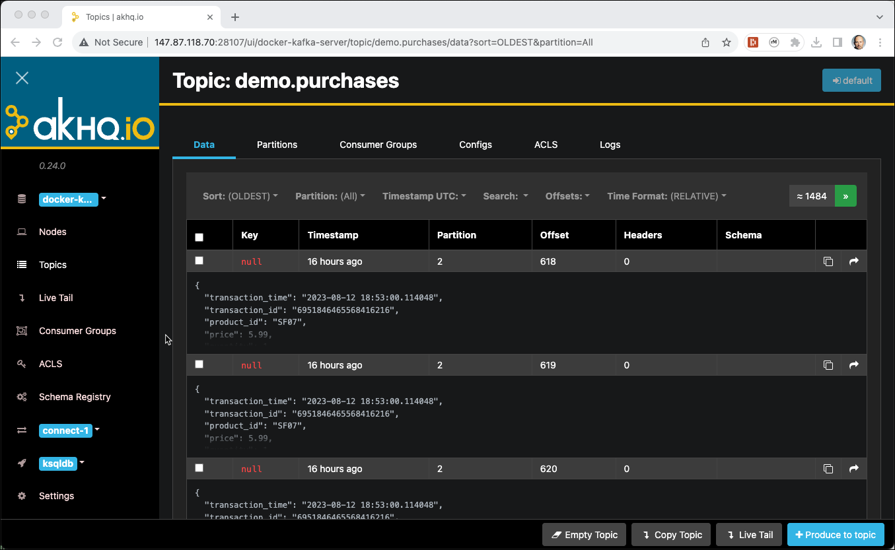

AKHQ also supports copying data between topics (**Copy Topic**) and producing individual test messages (**Produce to topic**). The left menu provides access to the **Schema Registry**, Kafka Connect clusters, and ksqlDB clusters.

### Using Kafbat UI

[Kafbat UI](https://github.com/kafbat/kafka-ui) is an open-source web UI for Apache Kafka, originally forked from the Provectus Kafka UI project and now actively maintained by the Kafbat community. It provides a clean, modern interface for browsing topics, inspecting messages, monitoring consumer groups, and managing your cluster. It runs as part of the **Data Platform** and is accessible at <http://dataplatform:28136/>.

By default you will land on the **Dashboard**, which gives a high-level overview of the cluster — number of brokers, topics, and active consumer groups.

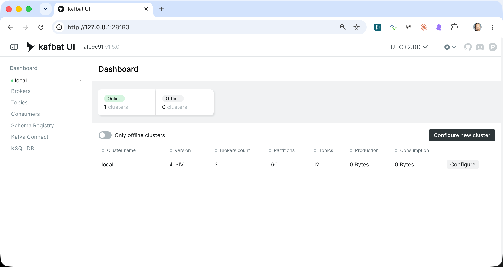

Navigate to **Brokers** in the left menu to see the three brokers in the cluster, along with their host, port, and partition leadership counts.

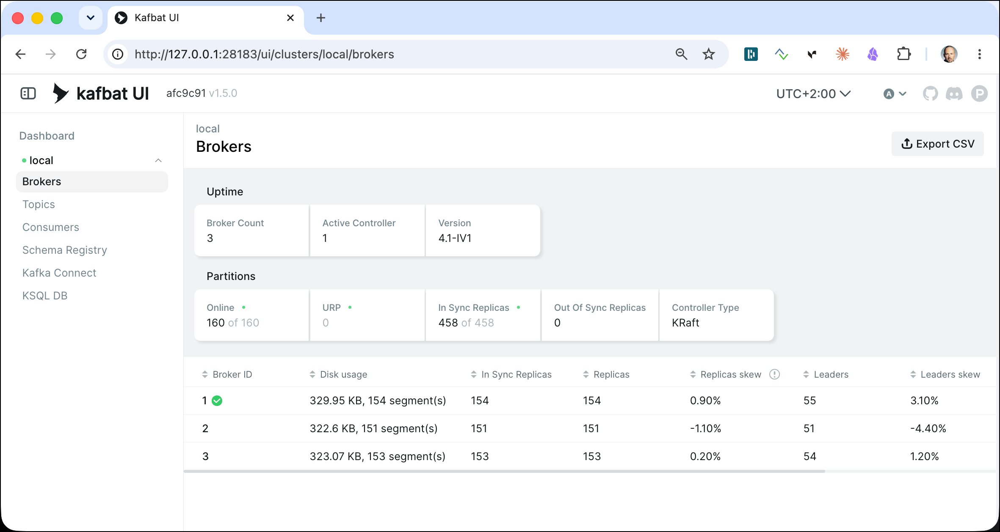

Click on **Topics** in the left menu to see all topics. By default, internal topics are hidden. Toggle **Show Internal Topics** to also display `__consumer_offsets` and other internal topics.

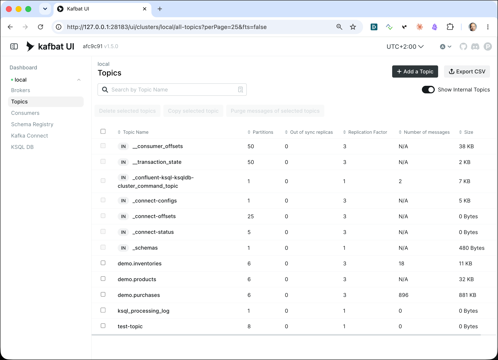

Click on any topic name to open its detail view. The **Messages** tab lets you browse messages with filtering by partition, offset, or timestamp.

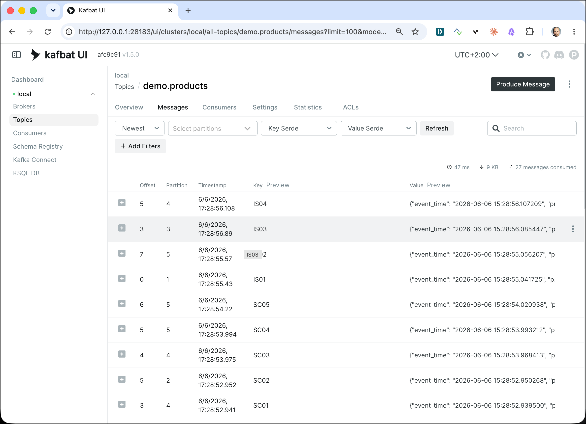

> **What you should see:** A paginated table of messages showing offset, partition, timestamp, key, and value. You can search or filter messages directly in the UI without a consumer client.

The **Overview** tab shows partition count, replication factor, and the ISR status for each partition — useful for spotting under-replicated partitions at a glance.

Navigate to **Consumers** in the left menu to see all active consumer groups, their assigned topics, and the current lag per partition.

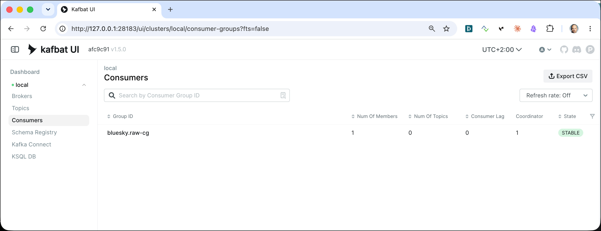

> **What you should see:** Each consumer group listed with its state (Stable, Empty, or Dead), the topics it is consuming, and the total lag across all partitions. Click a group name to drill into per-partition lag details.

To produce a test message directly from the UI, open a topic and click **Produce Message**. You can set the key, value, partition, and any custom headers without needing a command line client.

Kafbat UI also provides access to the **Schema Registry** and **Kafka Connect** clusters via the left menu, making it a convenient all-in-one management console alternative to AKHQ.

## Working with Consumer Groups

A **consumer group** is a set of consumers that cooperate to consume messages from a set of topics. Kafka automatically assigns each partition to exactly one consumer within the group, so messages within a partition are processed in order, while different partitions can be processed in parallel.

When consumers join or leave a group, Kafka triggers a **rebalance** to redistribute partitions evenly. This is the mechanism that lets you scale consumption horizontally by simply starting additional consumers.

### Setting Log Level to Info for Consumer Coordinator classes

By default, the Kafka CLI tools are configured to use a `WARN`-level root logger, which suppresses the rebalance and partition-assignment log lines emitted by the consumer coordinator classes. Raising those two classes to `INFO` makes it possible to see exactly when a rebalance is triggered, which consumer joined or left, and which partitions were assigned — directly in the terminal output of `kafka-console-consumer`.

The log configuration for CLI tools lives in `tools-log4j2.yaml` inside the broker container. The steps below copy it out, add the two extra loggers, and copy the modified file back so it is picked up the next time you run a consumer.

Copy the original file out of the container onto the Docker host:

```bash
docker cp kafka-1:/etc/kafka/tools-log4j2.yaml tools-log4j2.yaml
```

Keep the original as a backup you can later revert to:

```bash
cp tools-log4j2.yaml tools-log4j2.yaml.backup
```

Open the file for editing:

```bash
nano tools-log4j2.yaml
```

Add the following two loggers to the `Loggers` block:

```bash
Configuration:
  name: "Log4j2"

  Appenders:
    Console:
      name: STDERR
      target: SYSTEM_ERR
      PatternLayout:
        Pattern: "[%d] %p %m (%c)%n"

  Loggers:
    Logger:
      - name: "org.apache.kafka.clients.consumer.internals.ConsumerCoordinator"
        level: "INFO"
        additivity: false
        AppenderRef:
          - ref: STDERR
      - name: "org.apache.kafka.clients.consumer.internals.AbstractCoordinator"
        level: "INFO"
        additivity: false
        AppenderRef:
          - ref: STDERR

    Root:
      level: "WARN"
      AppenderRef:
        - ref: STDERR
```

Copy the modified file back into the container:

```bash
docker cp ./tools-log4j2.yaml.cg kafka-1:/etc/kafka
```

> **What just happened?** `ConsumerCoordinator` logs the partition assignment each consumer receives after a rebalance, and `AbstractCoordinator` logs the join-group and sync-group protocol steps. With both at `INFO`, you will see lines like `Setting newly assigned partitions` and `Successfully joined group` in the consumer terminal — making rebalances visible rather than silent.

### Create a topic for the consumer group demo

Create a fresh topic with 6 partitions for this section:

```bash
docker exec -ti kafka-1 kafka-topics --create \
             --if-not-exists \
             --bootstrap-server kafka-1:19092 \
             --topic cg-test-topic \
             --partitions 6 \
             --replication-factor 3
```

### Start consumers in the same group

Open **three separate terminal windows** and connect to `kafka-1` in each one:

```bash
docker exec -ti kafka-1 bash
```

In the first terminal, start a consumer on the `cg-test-topic` that joins the **consumer group** `my-consumer-group`:

```bash
kafka-console-consumer --bootstrap-server kafka-1:19092 \
                       --topic cg-test-topic \
                       --group my-consumer-group
```

You should see log output similar to:

```
[2026-06-07 06:40:51,840] INFO [Consumer clientId=console-consumer, groupId=my-consumer-group] Discovered group coordinator kafka-3:19094 (id: 2147483644 rack: null isFenced: false) (org.apache.kafka.clients.consumer.internals.ConsumerCoordinator)
[2026-06-07 06:40:51,847] INFO [Consumer clientId=console-consumer, groupId=my-consumer-group] (Re-)joining group (org.apache.kafka.clients.consumer.internals.ConsumerCoordinator)
[2026-06-07 06:40:51,871] INFO [Consumer clientId=console-consumer, groupId=my-consumer-group] Request joining group due to: need to re-join with the given member-id: console-consumer-a6fea06b-5fbb-44a0-8785-39fa8dec3cb3 (org.apache.kafka.clients.consumer.internals.ConsumerCoordinator)
[2026-06-07 06:40:51,872] INFO [Consumer clientId=console-consumer, groupId=my-consumer-group] (Re-)joining group (org.apache.kafka.clients.consumer.internals.ConsumerCoordinator)
[2026-06-07 06:40:51,979] INFO [Consumer clientId=console-consumer, groupId=my-consumer-group] Successfully joined group with generation Generation{generationId=50, memberId='console-consumer-a6fea06b-5fbb-44a0-8785-39fa8dec3cb3', protocol='range'} (org.apache.kafka.clients.consumer.internals.ConsumerCoordinator)
[2026-06-07 06:40:51,990] INFO [Consumer clientId=console-consumer, groupId=my-consumer-group] Finished assignment for group at generation 50: {console-consumer-a6fea06b-5fbb-44a0-8785-39fa8dec3cb3=Assignment(partitions=[cg-test-topic-0, cg-test-topic-1, cg-test-topic-2, cg-test-topic-3, cg-test-topic-4, cg-test-topic-5])} (org.apache.kafka.clients.consumer.internals.ConsumerCoordinator)
```

Now start two more consumers on the `cg-test-topic` that join the **same consumer group** `my-consumer-group`:

```bash
kafka-console-consumer --bootstrap-server kafka-1:19092 \
                       --topic cg-test-topic \
                       --group my-consumer-group
```

> **What you should see:** Each consumer starts and waits for messages. With 6 partitions and 3 consumers, each consumer is assigned 2 partitions. Each terminal prints a log line showing its assigned partitions, such as `Assigned partitions: [cg-test-topic-0, cg-test-topic-1]`.

> **What just happened?** When the first consumer joined the group, it was assigned all 6 partitions. When the second joined, Kafka triggered a **rebalance** and redistributed the partitions — 3 to each consumer. When the third joined, another rebalance gave each consumer exactly 2 partitions. The **group coordinator** broker manages this process using the consumers' heartbeats to track who is alive in the group.

### Produce messages and observe distribution

Open a **fourth terminal**, connect to `kafka-1`, and produce 30 messages in a loop:

```bash
docker exec -ti kafka-1 bash
```

```bash
for i in $(seq 1 30)
do
   echo "message-$i" | kafka-console-producer \
          --bootstrap-server kafka-1:19092 \
          --topic cg-test-topic \
          --batch-size 1
done
```

> **What you should see:** The 30 messages are spread across the three consumer terminals. Each consumer only receives messages from the partitions it owns — the same message will never appear in two consumers.

> **What just happened?** Kafka used the default round-robin partitioner (no key was set) to distribute messages across the 6 partitions. Since each consumer owns 2 partitions, each received roughly 10 of the 30 messages. The fundamental guarantee is **exclusive partition ownership**: within a consumer group, each partition is consumed by exactly one consumer at a time.

### Observe a rebalance

Stop one of the three consumers with **Ctrl-C**. After a few seconds the two surviving consumers will each take on 3 partitions instead of 2.

Restart the stopped consumer. A second rebalance fires and all three consumers return to 2 partitions each.

> **What you should see:** When you stop a consumer, the other two each print a new partition assignment showing they now own 3 partitions. When you restart, a third rebalance returns all three consumers to 2 partitions each.

> **What just happened?** Each consumer sends periodic **heartbeats** to the group coordinator. When a consumer stops, its heartbeats cease. After `session.timeout.ms` (default 45 seconds for the console consumer), the coordinator declares it dead and triggers a rebalance. The surviving consumers re-join the group and the coordinator uses the configured assignment strategy (range or round-robin) to redistribute all partitions evenly.

### List and describe consumer groups

The `kafka-consumer-groups` utility lets you inspect all active consumer groups and see how far behind each consumer is.

List all consumer groups:

```bash
kafka-consumer-groups --bootstrap-server kafka-1:19092 --list
```

Describe the group to see partition assignments and **lag** (the number of messages produced but not yet consumed):

```bash
kafka-consumer-groups --bootstrap-server kafka-1:19092 \
                      --describe \
                      --group my-consumer-group
```

```
GROUP              TOPIC          PARTITION  CURRENT-OFFSET  LOG-END-OFFSET  LAG  CONSUMER-ID                          HOST
my-consumer-group  cg-test-topic  0          5               5               0    consumer-1-...                       /172.x.x.x
my-consumer-group  cg-test-topic  1          5               5               0    consumer-1-...                       /172.x.x.x
my-consumer-group  cg-test-topic  2          5               5               0    consumer-2-...                       /172.x.x.x
my-consumer-group  cg-test-topic  3          5               5               0    consumer-2-...                       /172.x.x.x
my-consumer-group  cg-test-topic  4          5               5               0    consumer-3-...                       /172.x.x.x
my-consumer-group  cg-test-topic  5          5               5               0    consumer-3-...                       /172.x.x.x
```

Stop all three consumers and produce a few more messages — then re-run `--describe` to see the lag grow.

> **What you should see:** Six rows, one per partition. Each row shows the consumer's ID, its `CURRENT-OFFSET` (the last committed offset), the `LOG-END-OFFSET` (the highest offset written to that partition), and the `LAG` (the difference). When all consumers are running and caught up, lag is 0. After stopping all consumers and producing more messages, the lag will grow to match the number of new unread messages.

> **What just happened?** Consumers periodically **commit** their current offset back to Kafka (stored in the internal `__consumer_offsets` topic). `CURRENT-OFFSET` is the last committed position — the offset the consumer will resume from on restart. `LOG-END-OFFSET` is the next offset the broker will assign to an incoming message. The difference between the two is the **consumer lag**, which is the primary operational metric for knowing whether your consumers are keeping up with producers.

### Reset consumer group offsets

To re-process messages from the beginning, reset the group's offsets. All consumers in the group must be stopped first:

```bash
kafka-consumer-groups --bootstrap-server kafka-1:19092 \
                      --group my-consumer-group \
                      --topic cg-test-topic \
                      --reset-offsets \
                      --to-earliest \
                      --execute
```

Restart the consumers and they will replay all messages from the start of each partition.

> **What you should see:** Each partition's `CURRENT-OFFSET` is reset to 0. When you restart the consumers, the lag briefly spikes to the total message count before dropping back to 0 as they catch up.

> **What just happened?** `--reset-offsets --to-earliest` overwrote the committed offsets in `__consumer_offsets` for every partition in the group. The next time a consumer starts, it reads this stored offset and resumes from that position — in this case, offset 0 (the beginning of each partition).

### Revert Log Level

Finally, let's revert the log level:

```bash
docker cp tools-log4j2.yaml.backup kafka-1:/etc/kafka/tools-log4j2.yaml
```

## Retention and Log Compaction

Kafka provides two strategies for controlling how long data is kept in a topic:

- **Time-based / size-based retention** (default) — messages are deleted after a configurable time period (default: 7 days) or when the total log size exceeds a limit. This is the right model for event streams where you only need a recent window.
- **Log compaction** — Kafka keeps only the **latest message per key**, discarding older records with the same key. The compacted topic always contains a full snapshot of the current state for every key. This is the right model for change-log or lookup data (e.g., a product catalogue). Note that the log cleaner only operates on **closed (inactive) segments** — the segment currently being written to is never touched. A segment is closed once it rolls over, which is controlled by `segment.ms` or `segment.bytes`.

### Viewing and changing retention on a topic

Use `kafka-configs` to inspect the current configuration of a topic:

```bash
kafka-configs --bootstrap-server kafka-1:19092 \
              --entity-type topics \
              --entity-name test-topic \
              --describe
```

> **What you should see:** All topic-level configuration overrides. On a freshly created topic with no overrides, the output will read `Default configs for topic test-topic are:` followed by an empty list, meaning all values inherit the broker defaults.

> **What just happened?** `kafka-configs --describe` reads the dynamic configuration entries stored in Kafka's internal metadata for the given topic. These overrides take precedence over the broker-wide defaults in `server.properties`, letting you tune individual topics without restarting or touching the broker configuration.

To change the retention time to 1 hour (3,600,000 ms) on an existing topic:

```bash
kafka-configs --bootstrap-server kafka-1:19092 \
              --entity-type topics \
              --entity-name test-topic \
              --alter \
              --add-config retention.ms=3600000
```

> **What just happened?** Kafka wrote the `retention.ms=3600000` override into its internal configuration store. The change takes effect immediately — the log cleaner enforces the new limit on the next cleanup cycle. No broker restart is required.k

Check that the new setting was applied:

```bash
kafka-configs --bootstrap-server kafka-1:19092 \
              --entity-type topics \
              --entity-name test-topic \
              --describe
```

You should no longer get an empty list, but this instead:

```bash
Dynamic configs for topic test-topic are:
  retention.ms=3600000 sensitive=false synonyms={DYNAMIC_TOPIC_CONFIG:retention.ms=3600000}
```

To remove the override and fall back to the broker default:

```bash
kafka-configs --bootstrap-server kafka-1:19092 \
              --entity-type topics \
              --entity-name test-topic \
              --alter \
              --delete-config retention.ms
```

### Demonstrating compaction of updated keys

Create a dedicated topic with log compaction enabled and aggressive settings so the effect is visible within seconds:

```bash
kafka-topics --create \
             --if-not-exists \
             --bootstrap-server kafka-1:19092 \
             --topic compaction-test \
             --partitions 1 \
             --replication-factor 1 \
             --config cleanup.policy=compact \
             --config segment.ms=100 \
             --config delete.retention.ms=100 \
             --config min.cleanable.dirty.ratio=0.001
```

These three config values together force compaction to run almost immediately:

| Config | Value used | Production default | Why it matters |
|---|---|---|---|
| `segment.ms` | `100` ms | `604800000` (7 days) | A segment is closed after this time. The cleaner can only compact **closed** segments, so a very short roll time means the active segment is closed almost immediately after writing. |
| `min.cleanable.dirty.ratio` | `0.001` (0.1 %) | `0.5` (50 %) | The cleaner waits until the ratio of dirty (uncompacted) data to total log size exceeds this threshold before it runs. Setting it near zero means the cleaner triggers after even a single new message. |
| `delete.retention.ms` | `100` ms | `86400000` (24 hours) | After a key is tombstoned (deleted by producing a `null` value), Kafka retains the tombstone for this duration so downstream consumers can observe the deletion before it is purged. `100` ms makes tombstones disappear almost instantly in the demo. |

In production you would keep these at their defaults to balance compaction overhead against write throughput.

Start the producer with key parsing enabled:

```bash
kafka-console-producer --bootstrap-server kafka-1:19092 \
                       --topic compaction-test \
                       --property parse.key=true \
                       --property key.separator=:
```

> **Important:** Log compaction operates on a per-key basis — it keeps only the latest message for each unique key and discards all earlier messages with the same key. This means **every message you produce to a compacted topic must have a key**. Messages without a key (`null` key) are never compacted and will accumulate indefinitely, defeating the purpose of the policy.

Enter the following messages one by one, pressing **Enter** after each line. Notice that `user-1` is updated three times and `user-2` is updated twice:

```
user-1:{"name":"Alice","city":"Zurich"}
user-2:{"name":"Bob","city":"London"}
user-1:{"name":"Alice","city":"Bern"}
user-3:{"name":"Charlie","city":"Paris"}
user-2:{"name":"Bob","city":"Amsterdam"}
user-1:{"name":"Alice","city":"Basel"}
user-4:{"name":"Peter","city":"Berlin"}
```

Stop the producer with **Ctrl-C**.

Consume all messages immediately — compaction has not run yet, so all 6 records are visible:

```bash
kafka-console-consumer --bootstrap-server kafka-1:19092 \
                       --topic compaction-test \
                       --property print.key=true \
                       --property key.separator=: \
                       --from-beginning \
                       --timeout-ms 10000
```

> **What you should see:** All 6 messages in the order they were written, including the intermediate values for `user-1` (Zurich, Bern) and `user-2` (London).

> **What just happened?** Compaction has not run yet. The log still contains all original segments, so consuming `--from-beginning` returns every offset in order.

Wait a few seconds, then consume again:

```bash
kafka-console-consumer --bootstrap-server kafka-1:19092 \
                       --topic compaction-test \
                       --property print.key=true \
                       --property key.separator=: \
                       --from-beginning \
                       --timeout-ms 5000
```

> **What you should see:** Only the latest value for each key — one record each for `user-1` (Basel), `user-2` (Amsterdam), and `user-3` (Paris). The earlier values for `user-1` and `user-2` have been removed by the compactor.

> **What just happened?** Kafka's **log cleaner** thread scanned the log segments and built an offset map of the highest offset seen for each key. It then rewrote the segments, keeping only the message at the highest offset per key and discarding all earlier duplicates. The aggressive settings (`segment.ms=100`, `min.cleanable.dirty.ratio=0.001`) forced this to happen within a few seconds rather than the hours it would take with production defaults.

### Deleting a record with a tombstone

In a compacted topic you cannot delete a key by simply not writing to it — the compactor will keep the latest value forever. To signal that a key should be removed, produce a **tombstone**: a message with the target key and a `null` value. The compactor treats a tombstone as "delete this key" and, after retaining it for `delete.retention.ms` so downstream consumers can observe the deletion, removes both the tombstone and all earlier records for that key.

The `kafka-console-producer` does not support sending a null value directly, so use `kcat` with the `-Z` flag, which converts an empty input string to a null payload:

```bash
echo "user-2:" | kcat -b dataplatform:9092 -t compaction-test -P -K : -Z
```

Consume all messages before compaction runs to confirm the tombstone is present:

```bash
kcat -b dataplatform:9092 -t compaction-test \
     -C -f 'key=%k value=%s\n' -Z \
     -o beginning -e
```

> **What you should see:** All three keys are visible, but `user-2` now has `value=NULL` — the tombstone — as its latest record. The previous Amsterdam entry has already been superseded by the tombstone.

The log cleaner only operates on **closed** segments — the segment currently being written to is never touched. To force the active segment to roll and give the cleaner something to compact, produce a few more messages after the tombstone:

```bash
echo "user-6:{"name":"Scott","city":"Paris"}" | kcat -b dataplatform:9092 -t compaction-test -P -K :
```

Wait a few seconds for the segment to roll and then produce another message

```bash
echo "user-7:{"name":"Julie","city":"Rome"}" | kcat -b dataplatform:9092 -t compaction-test -P -K :
```

Wait another few seconds for the log cleaner to run, then consume again:

```bash
kcat -b dataplatform:9092 -t compaction-test \
     -C -f 'key=%k value=%s\n' -Z \
     -o beginning -e
```

> **What you should see:** Only `user-1` (Basel), `user-3` (Paris), `user-4` (Berlin) and the two new users remain. `user-2` has been fully purged — the tombstone and all its earlier values are gone.

> **What just happened?** The log cleaner found the tombstone for `user-2` and discarded every record with that key, including the tombstone itself. The `delete.retention.ms=100` setting on this topic made the tombstone disappear almost immediately. In production (default 24 hours) the tombstone is kept long enough for any downstream consumers — such as a Kafka Streams state store or a Debezium sink — to observe the deletion and remove the key from their own state before the tombstone is purged.


## Publishing a more realistic data stream to Kafka

Next we will see a more realistic example using the [Streaming Synthetic Sales Data Simulator](https://github.com/TrivadisPF/various-bigdata-prototypes/tree/master/streaming-sources/sales-simulator), available as a [Docker image](https://hub.docker.com/repository/docker/trivadis/sales-simulator).

This moves us beyond manually typed messages and lets us see how Kafka handles a continuous, unbounded stream of data.

First, create the three topics the simulator will publish to:

```bash
docker exec -ti kafka-1 kafka-topics --create \
    --bootstrap-server kafka-1:19092 \
    --topic demo.products \
    --replication-factor 3 --partitions 6 \
    --config cleanup.policy=compact \
    --config segment.ms=100 \
    --config delete.retention.ms=100 \
    --config min.cleanable.dirty.ratio=0.001 \
    --if-not-exists

docker exec -ti kafka-1 kafka-topics --create \
    --bootstrap-server kafka-1:19092 \
    --topic demo.purchases \
    --replication-factor 3 --partitions 6 \
    --if-not-exists

docker exec -ti kafka-1 kafka-topics --create \
    --bootstrap-server kafka-1:19092 \
    --topic demo.inventories \
    --replication-factor 3 --partitions 6 \
    --if-not-exists
```

`demo.purchases` and `demo.inventories` use the default 7-day time-based retention. `demo.products` uses log compaction with aggressive settings (`segment.ms=100`, `min.cleanable.dirty.ratio=0.001`) to compact quickly for demo purposes — see the [Retention and Log Compaction](#retention-and-log-compaction) section above for details.

The simulator container must join the same Docker network as the Kafka cluster. List available networks with:

```bash
docker network list
```

For this workshop environment the network is `streaming-data-platform`. Start the simulator with:

```bash
docker run -ti --rm --network streaming-data-platform \
    -e KAFKA_BOOTSTRAP_SERVERS=kafka-1:19092,kafka-2:19093 \
    trivadis/sales-simulator:latest
```

Because the container joins the broker's network, it can address brokers by service name (`kafka-1`) and internal port (`19092`).

Alternatively, if you want to run the simulator locally against a remote Docker stack, use the IP address of the dataplatform and the external ports:

```bash
docker run -ti --rm \
    -e KAFKA_BOOTSTRAP_SERVERS=nnn.nnn.nnn.nnn:9092,nnn.nnn.nnn.nnn:9093 \
    trivadis/sales-simulator:latest
```

In another terminal, use `kcat` to watch data streaming into the `demo.purchases` topic:

```bash
kcat -b dataplatform:9092 -t demo.purchases -q -f 'Part-%p => %k:%s\n'
```

You can also use the **Live Tail** option of **AKHQ**. In the menu on the left, navigate to **Live Tail** and in the **Topics** drop-down select the `demo.purchases` topic and click on the **Lenses** icon:

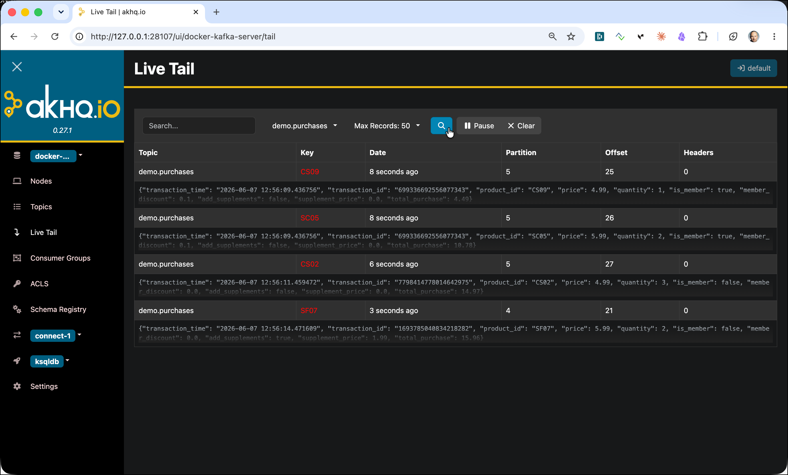

We will use the [Streaming Synthetic Sales Data Simulator](https://github.com/TrivadisPF/various-bigdata-prototypes/tree/master/streaming-sources/sales-simulator) again in the next workshop.