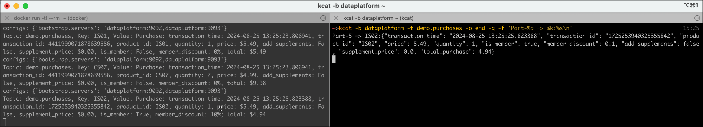
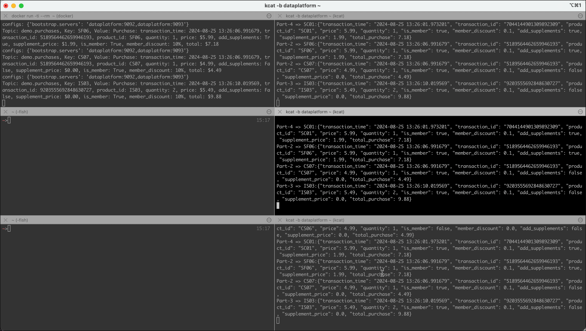
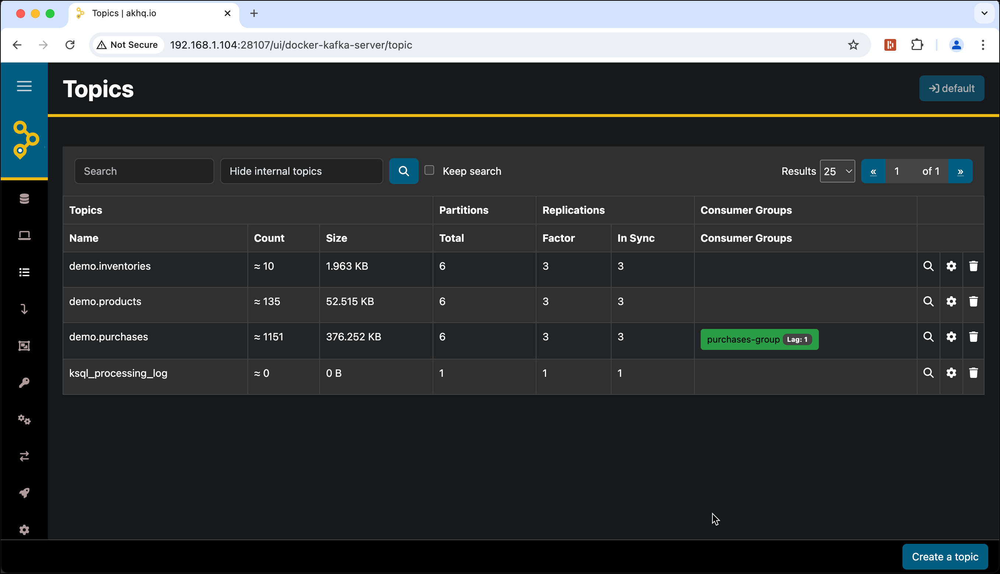
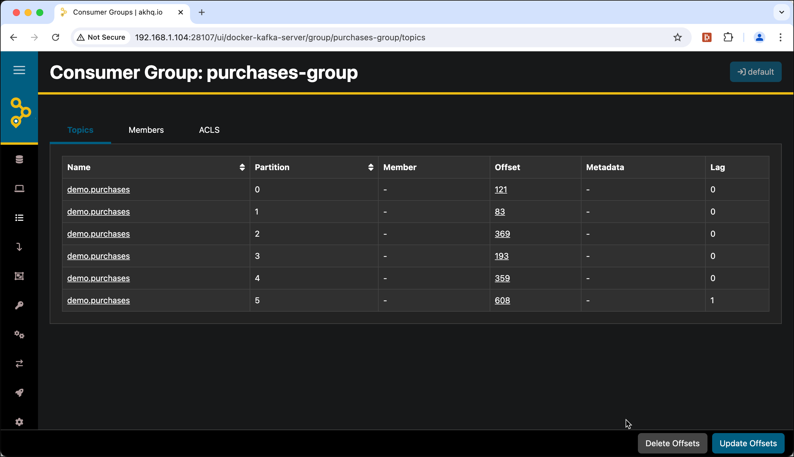
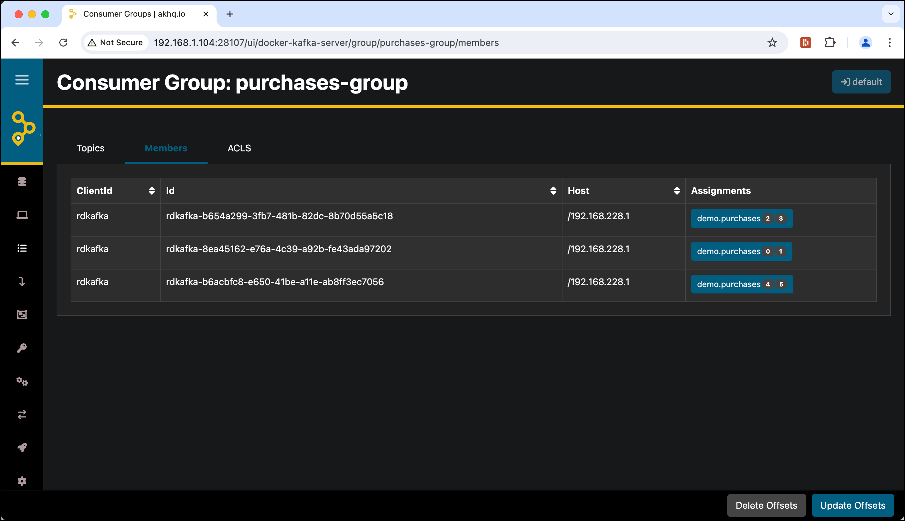
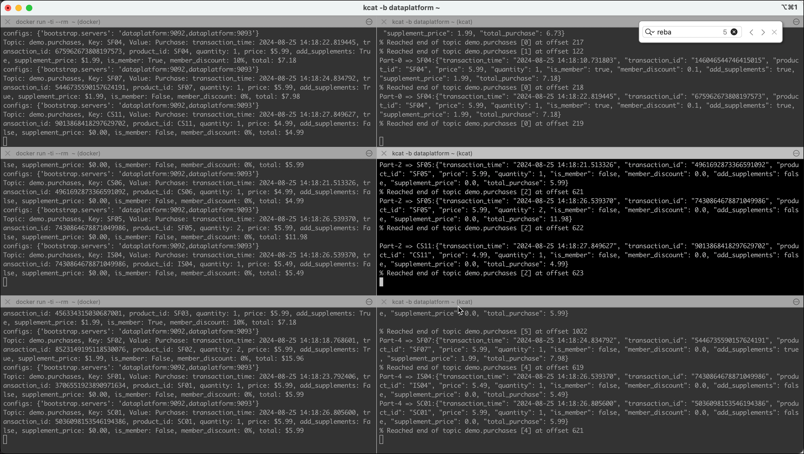
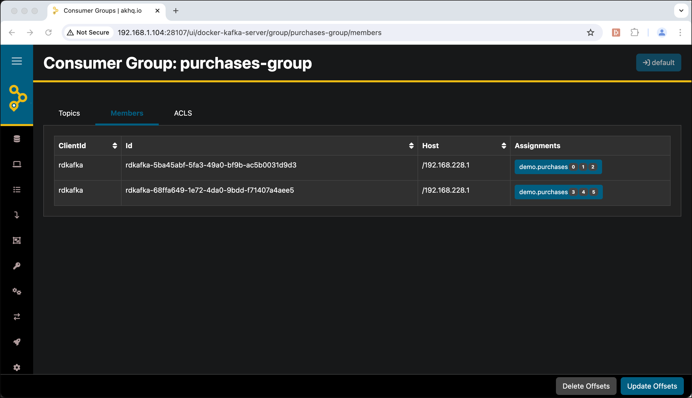
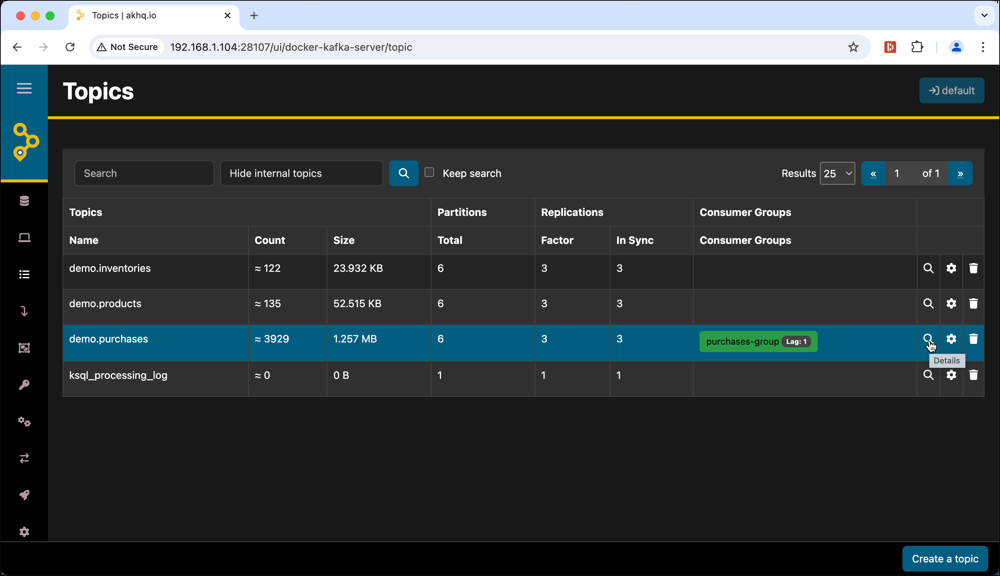
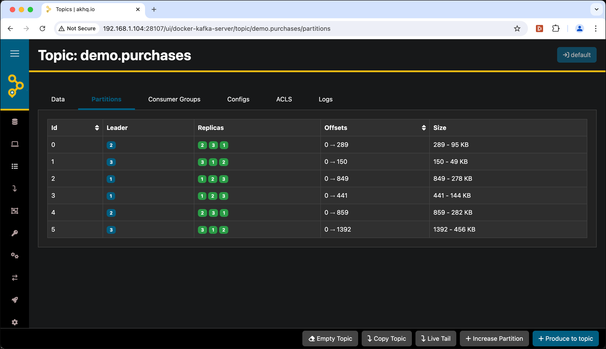

# Understanding Kafka Scalability and Failover

Apache Kafka is designed to scale horizontally on both the producer and consumer side. Producers can be multiplied to increase throughput, while consumers can be grouped to share the work of processing partitions. Kafka's replication model also ensures that the cluster continues operating even when a broker fails.

In this workshop you will see these properties in action. You will start a realistic stream of sales data using the Sales Simulator, then scale up consumers and producers while observing how Kafka balances the load. You will then deliberately kill a consumer and a broker and watch Kafka recover automatically.

## Table of Contents

- [What you will learn](#what-you-will-learn)
- [Prerequisites](#prerequisites)
- [Create the necessary Kafka topics](#create-the-necessary-kafka-topics)
- [Kafka Scalability](#kafka-scalability)
- [Kafka Consumer Failover](#kafka-consumer-failover)
- [Kafka Broker Failover](#kafka-broker-failover)

## What you will learn

- How multiple consumers reading from the same topic without a consumer group each receive all messages (Publish/Subscribe pattern)
- How adding consumers to the same consumer group causes Kafka to distribute partitions among them (load-sharing / scalability)
- How Kafka triggers a rebalance when a consumer joins or leaves a group
- How to observe consumer group partition assignments and lag using `kcat` and AKHQ
- How starting additional producer instances increases the overall message rate
- How Kafka automatically reassigns partitions to surviving consumers when one consumer fails (consumer failover)
- How Kafka elects new partition leaders when a broker is stopped (broker failover)
- How to verify broker and partition state using `kafka-topics --describe` and AKHQ before and after a failure

## Prerequisites

- The **Data Platform** described [here](../00-environment/README.md) is running and accessible
- The `kcat` utility is installed locally or available as a Docker container — see the [Working with Apache Kafka Broker](../01-working-with-kafka-broker/README.md) workshop for installation instructions
- Basic familiarity with the Linux command line

## Create the necessary Kafka topics

First let's (re-)create the topics we will use throughout this workshop. We will delete the ones from the previous workshop if they already exist, and then create them fresh:

```bash
docker exec -ti kafka-1 kafka-topics --delete --bootstrap-server kafka-1:19092 --topic demo.products --if-exists

docker exec -ti kafka-1 kafka-topics --delete --bootstrap-server kafka-1:19092 --topic demo.purchases --if-exists

docker exec -ti kafka-1 kafka-topics --delete --bootstrap-server kafka-1:19092 --topic demo.inventories --if-exists


docker exec -ti kafka-1 kafka-topics --create --bootstrap-server kafka-1:19092 --topic demo.products --replication-factor 3 --partitions 6 --config cleanup.policy=compact --config segment.ms=100 --config delete.retention.ms=100 --config min.cleanable.dirty.ratio=0.001 --if-not-exists

docker exec -ti kafka-1 kafka-topics --create --bootstrap-server kafka-1:19092 --topic demo.purchases --replication-factor 3 --partitions 6 --if-not-exists

docker exec -ti kafka-1 kafka-topics --create --bootstrap-server kafka-1:19092 --topic demo.inventories --replication-factor 3 --partitions 6 --if-not-exists
```

Note that the replication factor is set to `3` for all three topics, which gives us the headroom needed to demonstrate broker failover later.

## Kafka Scalability

Kafka achieves consumer-side scalability through **consumer groups**. If you worked through [Workshop 1](../01-working-with-kafka-broker/README.md) you already created a consumer group, observed rebalances, and inspected lag with `kafka-consumer-groups`. Here we build on that foundation and see the same mechanics at a larger scale: multiple consumers competing for partitions, real message throughput, and live rebalancing as members join and leave. When multiple consumers share the same group ID, Kafka assigns each partition to exactly one consumer in the group — so the work is divided, not duplicated. Adding more consumers increases throughput linearly, up to the number of partitions.

We will first observe the default behavior without a group (every consumer receives every message), then switch to a shared group to see the load distributed. Finally, we will scale the producer side by running multiple simulator instances in parallel.

### Start a Kafka Consumer on the `demo.purchases` Topic

Open a terminal and start a `kcat` consumer on `demo.purchases`. The `-o end` flag means it will only read messages that arrive from now on, not replay history:

```bash
kcat -b dataplatform -t demo.purchases -o end -q -f 'Part-%p => %k:%s\n'
```

If you prefer to run `kcat` as a Docker container, use:

```bash
docker exec -ti kcat kcat -b kafka-1:19092 -t demo.purchases -o end -q -f 'Part-%p => %k:%s\n'
```

The consumer will sit silently until messages start arriving.

### Start the Producer using the Sales Simulator

In a new terminal, start the [Streaming Synthetic Sales Data Simulator](https://github.com/TrivadisPF/various-bigdata-prototypes/tree/master/streaming-sources/sales-simulator) — the same simulator used in the [previous workshop](../01-working-with-kafka-broker/README.md).

If you are running the simulator as part of the same Docker stack (same network):

```bash
docker run -ti --rm --network streaming-data-platform \
    -e KAFKA_BOOTSTRAP_SERVERS=kafka-1:19092,kafka-2:19093 \
    trivadis/sales-simulator:latest
```

Or, if you are connecting to a remote Docker stack from your local machine (replace `nnn.nnn.nnn.nnn` by the IP address of the node where the dataplatform is running):

```bash
docker run -ti --rm \
    -e KAFKA_BOOTSTRAP_SERVERS=nnn.nnn.nnn.nnn:9092,datnnn.nnn.nnn.nnn:9093 \
    trivadis/sales-simulator:latest
```

> **What you should see:** Messages begin appearing in the consumer terminal, one per line, formatted as `Part-N => <key>:<json-value>`, for example:
>
> ```
> Part-2 => SF05:{"transaction_time": "2024-08-25 13:22:16.794118", "transaction_id": "1987412758660499919", "product_id": "SF05", "price": 5.99, "quantity": 3, "is_member": false, "member_discount": 0.0, "add_supplements": true, "supplement_price": 1.99, "total_purchase": 23.94}
> Part-5 => IS02:{"transaction_time": "2024-08-25 13:22:19.816755", "transaction_id": "8854751676730657335", "product_id": "IS02", "price": 5.49, "quantity": 1, "is_member": true, "member_discount": 0.1, "add_supplements": false, "supplement_price": 0.0, "total_purchase": 4.94}
> ```

> **What just happened?** The simulator is publishing purchase transactions to all 6 partitions of `demo.purchases`. The single `kcat` consumer is subscribed without a consumer group, so it receives every message from every partition — the classic Publish/Subscribe pattern.



### Start Two More Consumers

Open **two more terminal windows** and start the same `kcat` consumer command in each:

```bash
kcat -b dataplatform:9092 -t demo.purchases -o end -q -f 'Part-%p => %k:%s\n'
```

> **What you should see:** All three consumer terminals receive the **same messages** simultaneously. Every purchase event from the simulator appears in all three terminals.

> **What just happened?** By default, `kcat` uses the low-level consumer API with no `group.id`. Without a consumer group, Kafka treats each consumer independently — every consumer gets its own independent view of all partitions, so all messages are delivered to all consumers. This is Kafka's Publish/Subscribe mode.



### Change the Consumers to All Be in One Consumer Group

Stop all three `kcat` consumers with **Ctrl-C** and restart each one using the `-G` flag to join a named consumer group. We also add a second broker address to the broker list to prepare for the broker failover test later:

```bash
kcat -b dataplatform:9092,dataplatform:9093 -o end -f 'Part-%p => %k:%s\n' -G purchases-group demo.purchases
```

> **Note:** We drop the `-q` (quiet) flag so that rebalance log lines are visible in the terminal.

Start this command in all three terminals, one at a time. As each consumer joins, you will see a rebalance log line showing the new partition assignment.

**Consumer 1** (after all three have joined):

```
% Waiting for group rebalance
% Group purchases-group rebalanced (memberid rdkafka-5ba45abf-5fa3-49a0-bf9b-ac5b0031d9d3): assigned: demo.purchases [0], demo.purchases [1], demo.purchases [2], demo.purchases [3], demo.purchases [4], demo.purchases [5]
Part-4 => SC01:{"transaction_time": "2024-08-25 14:15:49.757828", ...}
```

**Consumer 2:**

```
% Waiting for group rebalance
% Group purchases-group rebalanced (memberid rdkafka-68ffa649-1e72-4da0-9bdd-f71407a4aee5): assigned: demo.purchases [2], demo.purchases [3]
Part-2 => SF06:{"transaction_time": "2024-08-25 14:15:55.814680", ...}
```

**Consumer 3:**

```
% Waiting for group rebalance
% Group purchases-group rebalanced (memberid rdkafka-d195775c-43cd-49cb-8448-617b9b91dcb1): assigned: demo.purchases [4], demo.purchases [5]
Part-5 => CS08:{"transaction_time": "2024-08-25 14:15:56.642312", ...}
```

> **What you should see:** Each consumer terminal now receives only a subset of the messages — roughly one third each. No message appears in more than one terminal.

> **What just happened?** By joining the same consumer group (`purchases-group`), the three `kcat` processes participated in Kafka's group protocol. The group coordinator assigned 2 of the 6 partitions to each consumer. Each partition is now exclusively owned by one consumer — messages in that partition only go to the consumer that owns it. This is Kafka's load-sharing (scalability) mode.

You can also see the consumer group in [AKHQ](http://dataplatform:28107). In the topic list the group is shown in the **Consumer Groups** column:



It appears green because the consumers are keeping up and lag is near zero. Click on the **purchases-group** link to see per-partition lag:



Navigate to the **Members** tab to confirm the partition-to-consumer assignments:



Partitions `2` and `3` are assigned to the first member, `0` and `1` to the second, and `4` and `5` to the third.

### Scale the Producer Side — Start Two More Simulator Instances

Now let's scale the producer side by starting two additional simulator instances in two new terminal windows:

```bash
docker run -ti --rm --network streaming-data-platform \
    -e KAFKA_BOOTSTRAP_SERVERS=kafka-1:19092,kafka-2:19093 \
    trivadis/sales-simulator:latest
```

You should now have **6 terminals** in total: 3 running the simulator and 3 running `kcat` consumers.



> **What you should see:** The rate of messages appearing in each consumer terminal increases noticeably. Each consumer is now processing roughly three times as many messages per second as before.

> **What just happened?** Three independent simulator instances are publishing to the same topic in parallel. Because the topic has 6 partitions, all three producers can write simultaneously without interfering with each other. The three consumers continue to share the load — each still owns 2 partitions, but those partitions now receive a higher volume of messages.

## Kafka Consumer Failover

With the 3 simulators and 3 consumers running, let's demonstrate consumer failover by stopping one consumer. Kafka will automatically redistribute its partitions to the surviving consumers.

Kill the **third consumer** by pressing **Ctrl-C** in its terminal.

After a few seconds (within the session timeout), the two remaining consumers will each print a rebalance message showing they have taken on additional partitions. For example, consumer 1 might show:

```
% Group purchases-group rebalanced (memberid rdkafka-5ba45abf-5fa3-49a0-bf9b-ac5b0031d9d3):
    revoked: demo.purchases [0], demo.purchases [1]
% Group purchases-group rebalanced (memberid rdkafka-5ba45abf-5fa3-49a0-bf9b-ac5b0031d9d3):
    assigned: demo.purchases [0], demo.purchases [1], demo.purchases [2]
% Reached end of topic demo.purchases [2] at offset 665
% Reached end of topic demo.purchases [0] at offset 235
% Reached end of topic demo.purchases [1] at offset 125
Part-2 => SF05:{"transaction_time": "2024-08-25 14:20:49.773818", ...}
```

> **What you should see:** The two remaining consumer terminals each show a new partition assignment — now 3 partitions each instead of 2. Messages continue to flow without interruption.

If you refresh the **Members** tab of the consumer group in AKHQ, you will see only two members, each owning 3 partitions:



> **What just happened?** Each consumer sends periodic heartbeats to the group coordinator. When the third consumer was killed, its heartbeats stopped. After the session timeout expired, the coordinator declared it dead and triggered a rebalance. The two surviving consumers re-joined the group and the coordinator redistributed all 6 partitions evenly between them — 3 each. No messages were lost; Kafka resumed from the last committed offset for each partition.

Restart the third consumer:

```bash
kcat -b dataplatform:9092,dataplatform:9093 -o end -f 'Part-%p => %k:%s\n' -G purchases-group demo.purchases
```

Kafka will trigger another rebalance and return to 2 partitions per consumer.

## Kafka Broker Failover

Before demonstrating a broker failure, let's examine how the 6 partitions of `demo.purchases` are distributed and replicated across the 3 brokers.

### Describe the Topic

Run `kafka-topics --describe` to see the current leader and replica set for each partition:

```bash
docker exec -ti kafka-1 kafka-topics --describe \
    --topic demo.purchases \
    --bootstrap-server kafka-1:19092
```

```
Topic: demo.purchases	TopicId: Dp17WmpQQU6BtrfZ1Q8b1w	PartitionCount: 6	ReplicationFactor: 3	Configs: min.insync.replicas=1
	Topic: demo.purchases	Partition: 0	Leader: 2	Replicas: 2,3,1	Isr: 2,3,1
	Topic: demo.purchases	Partition: 1	Leader: 3	Replicas: 3,1,2	Isr: 3,1,2
	Topic: demo.purchases	Partition: 2	Leader: 1	Replicas: 1,2,3	Isr: 1,2,3
	Topic: demo.purchases	Partition: 3	Leader: 1	Replicas: 1,2,3	Isr: 1,2,3
	Topic: demo.purchases	Partition: 4	Leader: 2	Replicas: 2,3,1	Isr: 2,3,1
	Topic: demo.purchases	Partition: 5	Leader: 3	Replicas: 3,1,2	Isr: 3,1,2
```

> **What you should see:** Each broker acts as leader for 2 partitions, and every partition is replicated across all 3 brokers. The `Isr` (In-Sync Replicas) set contains all 3 brokers for every partition — meaning all replicas are fully caught up.

> **What just happened?** Kafka distributed partition leadership evenly across the cluster when the topic was created. With a replication factor of 3, every message written to a partition is copied to 2 additional brokers before being acknowledged. This means the cluster can tolerate the loss of any one broker without losing data or availability.

You can also view the partition distribution in [AKHQ](http://dataplatform:28107). Navigate to the Topics view, click the magnifying glass icon on the `demo.purchases` row:



Then open the **Partitions** tab:



### Stop the Second Kafka Broker

Make sure you still have the 3 simulator instances and 3 consumer (`kcat`) instances running in their terminals. Now stop `kafka-2`:

```bash
docker stop kafka-2
```

Immediately run `kafka-topics --describe` again to see the new leader assignments:

```bash
docker exec -ti kafka-1 kafka-topics --describe \
    --topic demo.purchases \
    --bootstrap-server kafka-1:19092
```

```
Topic: demo.purchases	TopicId: Dp17WmpQQU6BtrfZ1Q8b1w	PartitionCount: 6	ReplicationFactor: 3	Configs: min.insync.replicas=1
	Topic: demo.purchases	Partition: 0	Leader: 3	Replicas: 2,3,1	Isr: 3,1
	Topic: demo.purchases	Partition: 1	Leader: 3	Replicas: 3,1,2	Isr: 3,1
	Topic: demo.purchases	Partition: 2	Leader: 1	Replicas: 1,2,3	Isr: 1,3
	Topic: demo.purchases	Partition: 3	Leader: 1	Replicas: 1,2,3	Isr: 1,3
	Topic: demo.purchases	Partition: 4	Leader: 3	Replicas: 2,3,1	Isr: 3,1
	Topic: demo.purchases	Partition: 5	Leader: 3	Replicas: 3,1,2	Isr: 3,1
```

> **What you should see:** `kafka-2` is no longer listed as leader for any partition. The partitions it previously led (0 and 4) have been taken over by `kafka-3`. The `Isr` sets now contain only 2 entries — `kafka-2` has been removed from the ISR because it is offline. Producers and consumers may log a brief connection error to port `9093`, but they continue sending and receiving messages without interruption.

> **What just happened?** When `kafka-2` stopped, the KRaft controller detected the loss of heartbeats and removed it from the cluster. For each partition where `kafka-2` was the leader, the controller elected a new leader from the remaining ISR members. The failover is automatic and typically completes within a few seconds. Because all replicas were in sync before the failure, no data was lost.

In AKHQ, the missing replicas on `kafka-2` are shown in red:


### Restart the Second Kafka Broker

Bring `kafka-2` back:

```bash
docker start kafka-2
```

After a few seconds, `kafka-2` will catch up with the current leaders and rejoin the ISR for all partitions. AKHQ will return to all-green:


> **What you should see:** All ISR sets are back to 3 members. However, `kafka-2` is not yet the leader for partitions 0 and 4 — those are still being led by `kafka-3`.

> **What just happened?** When a broker restarts it begins replicating the partitions it holds as a follower, catching up from where it left off. Once a follower is fully caught up, it rejoins the ISR. At this point the cluster is fully redundant again, but leadership has not yet shifted back.

Kafka automatically runs a **preferred leader election** in the background. After a short while, `kafka-2` will be re-elected as leader for the two partitions it originally led. You can confirm this by refreshing the Partitions tab in AKHQ:


