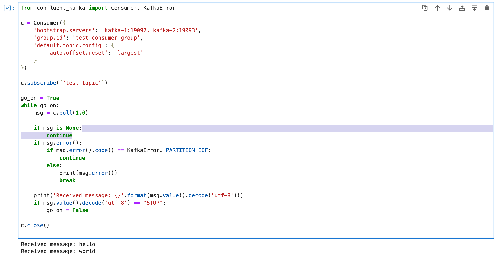
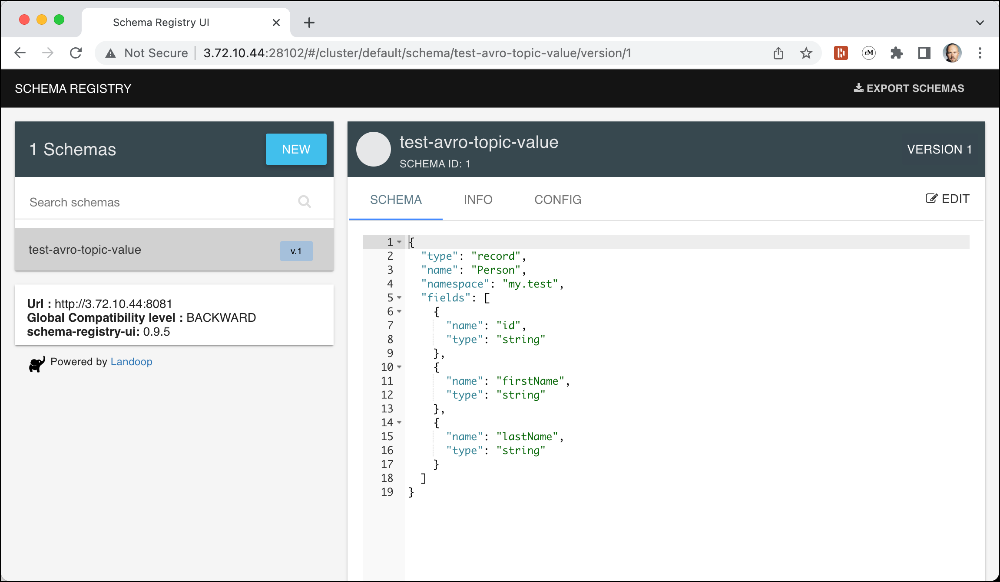

# Using Confluent's Python client for Apache Kafka

## Introduction

In this workshop we will learn how to use the [Confluent Python client for Apache Kafka](https://github.com/confluentinc/confluent-kafka-python) to produce and consume message from Kafka.

You can perform this part of the workshop using either the Python installation of the Virtual Machine on the Docker Host or use the Python as part of the [Apache Zeppelin](http://dataplatform:28080) (User `admin` and password `abc123!`) or [Jupyter](http://dataplatform:28888) (token `abc123!`) container, running as part of the Data Platform. 

## Installing the Confluent Python Client

If you are using the Python environment on the virtual machine, you first have to install [`pip`](https://pip.pypa.io/en/stable/installation/).  This is not needed when using Zeppelin or Jupyter and you can directly do the `pip install` of the Python client.

```bash
sudo apt install python-pip
```

After that you can install the self-contained binaries of the Confluent Python client using 

```bash
pip install confluent-kafka
```

You can work with scripts and store each code block in a file. You can then execute it using `python script-name.py`. Or you can use the Apache Zeppelin or Jupyter notebook-based environment and just add each code block as a paragraph into a notebook and execute it from there.

## Working with Text Messages

Now let's write a simple program in Python which produces a message to the Kafka topic `test-python-topic`. This topic has been created in [Getting started with Apache Kafka](../02-working-with-kafka-broker/README.md).

First we will produce messages. Let's create the topic to use for that

```bash
docker exec -ti kafka-1 kafka-topics --create --bootstrap-server kafka-1:19092 --topic test-python-topic --replication-factor 3 --partitions 6
```

In order to see the results, run `kafkacat` in a separate terminal window and print the partition, key and value of each message:

```bash
kafkacat -b dataplatform -t test-python-topic -f "P-%p: %k=%s\n" -Z 
``` 

or to use the dockerized `kcat` instead use

```bash
docker exec -ti kcat kcat -b kafka-1:19092 -t test-python-topic  -f "P-%p: %k=%s\n" -Z 
```


The following code segments assume that they are run inside the Zeppelin or Jupyter docker container. If you want to run them from the Docker Host, you have to replace `kafka-1:19092` and `kafka-2:19093` by the IP Address of the Docker Host and use port `9092` instead.

### Producing messages with an empty key

The following code block will generate a message with a NULL key. The messages are part 

```python
from confluent_kafka import Producer

p = Producer({'bootstrap.servers': 'kafka-1:19092,kafka-2:19093'})
messages = ["message1","message2","message3"]
topic_name = "test-python-topic"

def delivery_report(err, msg):
    """ Called once for each message produced to indicate delivery result.
        Triggered by poll() or flush(). """
    if err is not None:
        print('Message delivery failed: {}'.format(err))
    else:
        print('Message delivered to {} [{}]'.format(msg.topic(), msg.partition()))

for data in messages:
    # Trigger any available delivery report callbacks from previous produce() calls
    p.poll(0)

    # Asynchronously produce a message, the delivery report callback
    # will be triggered from poll() above, or flush() below, when the message has
    # been successfully delivered or failed permanently.
    p.produce(topic_name, data.encode('utf-8'), callback=delivery_report)

# Wait for any outstanding messages to be delivered and delivery report
# callbacks to be triggered.
p.flush()
```

and you should see the following 3 messages on the `kcat` output

```bash
docker exec -ti kcat kcat -b kafka-1:19092 -t test-topic  -f "P-%p: %k=%s\n" -Z 
% Auto-selecting Consumer mode (use -P or -C to override)
% Reached end of topic test-topic [0] at offset 0
% Reached end of topic test-topic [1] at offset 0
% Reached end of topic test-topic [2] at offset 0
% Reached end of topic test-topic [5] at offset 4
% Reached end of topic test-topic [4] at offset 1
% Reached end of topic test-topic [3] at offset 1
P-3: NULL=message1
P-3: NULL=message3
P-4: NULL=message2
```

Remember, you can use the `-q` option to enter quiet mode where the `% Reached end of topic .... ` will not be shown. 

### Producing messages with a key and value

To also produce a key, you have to also use the parameter `key` together with the parameter `value`.

```python
from confluent_kafka import Producer

p = Producer({'bootstrap.servers': 'kafka-1:19092,kafka-2:19093'})
messages = ["message1","message2","message3"]
topic_name = "test-python-topic"

def delivery_report(err, msg):
    """ Called once for each message produced to indicate delivery result.
        Triggered by poll() or flush(). """
    if err is not None:
        print('Message delivery failed: {}'.format(err))
    else:
        print('Message delivered to {} [{}]'.format(msg.topic(), msg.partition()))

for data in messages:
    # Trigger any available delivery report callbacks from previous produce() calls
    p.poll(0)

    # Asynchronously produce a message, the delivery report callback
    # will be triggered from poll() above, or flush() below, when the message has
    # been successfully delivered or failed permanently.
    p.produce(topic_name, key='1', value=data.encode('utf-8'), callback=delivery_report)

# Wait for any outstanding messages to be delivered and delivery report
# callbacks to be triggered.
p.flush()
```

and you should see 3 additional messages on the `kcat` output now all in the same partition and with a key (`1`)

```bash
ubuntu@ip-172-26-15-121:~$ docker exec -ti kcat kcat -b kafka-1:19092 -t test-topic  -f "P-%p: %k=%s\n" -Z 
% Auto-selecting Consumer mode (use -P or -C to override)
% Reached end of topic test-topic [0] at offset 0
% Reached end of topic test-topic [1] at offset 0
% Reached end of topic test-topic [2] at offset 0
% Reached end of topic test-topic [5] at offset 4
% Reached end of topic test-topic [4] at offset 1
% Reached end of topic test-topic [3] at offset 1
P-3: NULL=message1
P-3: NULL=message3
P-4: NULL=message2
% Reached end of topic test-topic [3] at offset 3
% Reached end of topic test-topic [4] at offset 2
P-5: 1=message1
P-5: 1=message2
P-5: 1=message3
% Reached end of topic test-topic [5] at offset 7
```

### Consuming messages

To consume text messages through python, use the following code snippet. Make sure that you use a unique `group.id`. 

```python
from confluent_kafka import Consumer, KafkaError

topic_name = "test-python-topic"

c = Consumer({
    'bootstrap.servers': 'kafka-1:19092, kafka-2:19093',
    'group.id': 'test-consumer-group',
    'default.topic.config': {
        'auto.offset.reset': 'largest'
    }
})

c.subscribe([topic_name])

go_on = True
while go_on:
    msg = c.poll(1.0)

    if msg is None:
        continue
    if msg.error():
        if msg.error().code() == KafkaError._PARTITION_EOF:
            continue
        else:
            print(msg.error())
            break

    print('Received message: {}'.format(msg.value().decode('utf-8')))
    if msg.value().decode('utf-8') == "STOP":
        go_on = False
        
c.close()
```

When started, this code block will consume messages in an endless loop, so if you use it in the same Zeppelin notebook, you will have to run the producer externally, i.e. using `kafkacat` or `kcat` as shown before but this time with the `-P` option to run it as a producer. 

```bash
docker exec -ti kcat kcat -P -b kafka-1:19092 -t test-python-topic 
```

Add a few messages and then enter `ctrl-D` to send the messages

```bash
ubuntu@ip-172-26-15-121:~$ docker exec -ti kcat kcat -P -b  kafka-1:19092 -t test-topic 
hello
world!
```

you should see the 2 messages appear in the python consumer.



Send another message with the value of `STOP` to terminate the consumer. 

## Working with Avro Messages

The Confluent Python client also supports working with Avro formatted messages. It works together with the [Confluent Schema Registry](https://docs.confluent.io/current/schema-registry/docs/index.html). 

To install support for Avro, perform the following step:

```bash
pip install confluent-kafka[avro]
``` 

### Produce Avro Messages

In order to separate the Avro tests from the other tests, lets create a new topic `test-python-avro-topic`:

```bash
docker exec -ti kafka-1 kafka-topics --create \
             --if-not-exists \
             --bootstrap-server kafka-1:19092 \
             --topic test-python-avro-topic \
             --partitions 8 \
             --replication-factor 3
```

Make sure that you change the **kcat** command to consume from the new topic.

```bash
kafkacat -b dataplatform -t test-python-avro-topic -f "P-%p: %k=%s\n" -Z 
``` 

or to use the dockerized `kcat` instead use

```bash
docker exec -ti kcat kcat -b kafka-1:19092 -t test-python-avro-topic  -f "P-%p: %k=%s\n" -Z 
```

The following Python code produces an Avro message 

```python
import os
from uuid import uuid4

from confluent_kafka import Producer
from confluent_kafka.serialization import StringSerializer, SerializationContext, MessageField
from confluent_kafka.schema_registry import SchemaRegistryClient
from confluent_kafka.schema_registry.avro import AvroSerializer

topic_name = "test-python-avro-topic"

value_schema_str = """
{
   "namespace": "my.test",
   "name": "Person",
   "type": "record",
   "fields" : [
     {
       "name" : "id",
       "type" : "string"
     },
     {
       "name" : "firstName",
       "type" : "string"
     },
     {
       "name" : "lastName",
       "type" : "string"
     }
   ]
}
"""

class Person(object):
    """
    Person record

    Args:
        id (str): Person's id

        firstName (str): Person's firstname
        
        lastName (str): Person's lastname
    """

    def __init__(self, id, firstName, lastName):
        self.id = id
        self.firstName = firstName
        self.lastName = lastName

def person_to_dict(person, ctx):
    """
    Returns a dict representation of a Person instance for serialization.

    Args:
        person (Person): Person instance.

        ctx (SerializationContext): Metadata pertaining to the serialization
            operation.

    Returns:
        dict: Dict populated with person attributes to be serialized.
    """

    return dict(id=person.id,
                firstName=person.firstName,
                lastName=person.lastName)

def delivery_report(err, msg):
    """
    Reports the failure or success of a message delivery.

    Args:
        err (KafkaError): The error that occurred on None on success.

        msg (Message): The message that was produced or failed.

    Note:
        In the delivery report callback the Message.key() and Message.value()
        will be the binary format as encoded by any configured Serializers and
        not the same object that was passed to produce().
        If you wish to pass the original object(s) for key and value to delivery
        report callback we recommend a bound callback or lambda where you pass
        the objects along.
    """

    if err is not None:
        print("Delivery failed for User record {}: {}".format(msg.key(), err))
        return
    print('User record {} successfully produced to {} [{}] at offset {}'.format(
        msg.key(), msg.topic(), msg.partition(), msg.offset()))


schema_registry_conf = {'url': 'http://schema-registry-1:8081'}
schema_registry_client = SchemaRegistryClient(schema_registry_conf)

avro_serializer = AvroSerializer(schema_registry_client,
                                     value_schema_str,
                                     person_to_dict)
string_serializer = StringSerializer('utf_8')

person = Person(id='1001',
                        firstName='Peter',
                        lastName='Muster')

producer_conf = {'bootstrap.servers': 'kafka-1:19092'}
producer = Producer(producer_conf)

producer.produce(topic=topic_name,
                             key=string_serializer(str(person.id)),
                             value=avro_serializer(person, SerializationContext(topic_name, MessageField.VALUE)),
                             on_delivery=delivery_report)
producer.flush()                     
```

You should get the following message showing successful publish of the Avro message:

`User record b'1001' successfully produced to test-python-avro-topic [1] at offset 2`

When producing an Avro message, the library will check if the Avro Schema is already registered and if it is, it will check if the one provided has a change. If yes, it will check if the change is compatible to the previous version and only allow it it it is. 

If a schema does not exist at all, then it is registered. You can check the registry through the REST API or the Schema Registry UI which we will see in the next two sections.

### View schemas using REST API

The Schema Registry provides a REST API which is documented in the [Confluent documentation](https://docs.confluent.io/current/schema-registry/develop/api.html).

To list all the schemas which are registered through the REST API, perform the following command 

```bash
curl http://dataplatform:8081/subjects
```

You should get back one subject:

```bash
$ curl http://dataplatform:8081/subjects
["test-python-avro-topic-value"]~
```

You can ask for the versions available for a given subject by using the following command

```bash
curl http://dataplatform:8081/subjects/test-python-avro-topic-value/versions
```

and you should see that there is currently just one version available

```bash
$ curl http://dataplatform:8081/subjects/test-python-avro-topic-value/versions
[1]
```

To get the schema definition for that schema, use the following command

```bash
curl http://dataplatform:8081/subjects/test-python-avro-topic-value/versions/1
```

and the schema is returned as shown below

```bash
$ curl http://dataplatform:8081/subjects/test-python-avro-topic-value/versions/1

{"subject":"test-python-avro-topic-value","version":1,"id":1,"schema":"{\"type\":\"record\",
\"name\":\"Person\",\"namespace\":\"my.test\",\"fields\":[{\"name\":\"id\",\"type\":
\"string\"},{\"name\":\"firstName\",\"type\":\"string\"},{\"name\":\"lastName\",
\"type\":\"string\"}]}"}
```

### View schemas using Schema Registry UI

To browse the Schema Registry using the browser-based [Landoop Schema Registry UI](http://www.landoop.com/blog/2016/08/schema-registry-ui/), navigate to the following URL: <http://dataplatform:28102>.

You should see the two schemas registered. If you click on one of them, the Avro Schema will be displayed on the right side:



### Consuming Avro Messages using `kcat` 

But what about the output of `kcat`? We can see that the message is shown, although not very readable. 

```bash
> docker exec -ti kcat kcat -b kafka-1:19092 -t test-avro-topic  -f "P-%p: %k=%s\n" -Z 
> % Auto-selecting Consumer mode (use -P or -C to override)
P-5:10011001
Peter
     Muster
```     

This is even more problematic if the Avro message is more complex and with much more properties. To work with more visible Avro messages from `kcat` you have to add some additional parameters:

```bash
docker exec -ti kcat kcat -b kafka-1:19092 -t test-python-avro-topic  -f "P-%p: %k=%s\n" -Z -s value=avro -r http://schema-registry-1:8081
```

and you should see the avro message formatted as a JSON string

```
ubuntu@ip-172-26-15-121:~$ docker exec -ti kcat kcat -b kafka-1:19092 -t test-python-avro-topic  -f "P-%p: %k=%s\n" -Z -s value=avro -r http://schema-registry-1:8081
% Auto-selecting Consumer mode (use -P or -C to override)
P-1: 1001={"id": "1001", "firstName": "Peter", "lastName": "Muster"}
```

### Consuming Messages using `kafka-avro-console-consumer`

Instead of using `kcat` to consume Avro messages, there is also a `kafka-avro-console-consumer`. On the Data Platform, this is part of the schema registry docker container. Let's connect to the docker container:

```bash
docker exec -ti schema-registry-1 bash
```

and run the `kafka-avro-console-consumer`

```bash
kafka-avro-console-consumer --bootstrap-server kafka-1:19092,kafka-2:19093 --topic test-python-avro-topic
```

If you re-run the Avro producer python snippet, then you should see the Avro message in a readable JSON formatted document.

```
{"id":"1001","firstName":"Peter","lastName":"Muster"}
```

### Consuming Avro Messages from Python

Now let's write a python script to consume the Avro messages as well.

```python
import os
from uuid import uuid4

from confluent_kafka import Consumer
from confluent_kafka.serialization import SerializationContext, MessageField
from confluent_kafka.schema_registry import SchemaRegistryClient
from confluent_kafka.schema_registry.avro import AvroDeserializer

topic_name = "test-python-avro-topic"

value_schema_str = """
{
   "namespace": "my.test",
   "name": "Person",
   "type": "record",
   "fields" : [
     {
       "name" : "id",
       "type" : "string"
     },
     {
       "name" : "firstName",
       "type" : "string"
     },
     {
       "name" : "lastName",
       "type" : "string"
     }
   ]
}
"""

class Person(object):
    """
    Person record

    Args:
        id (str): Person's id

        firstName (str): Person's firstname
        
        lastName (str): Person's lastname
    """

    def __init__(self, id, firstName, lastName):
        self.id = id
        self.firstName = firstName
        self.lastName = lastName

def dict_to_person(obj, ctx):
    """
    Converts object literal(dict) to a Person instance.

    Args:
        obj (dict): Object literal(dict)

        ctx (SerializationContext): Metadata pertaining to the serialization
            operation.

    Returns:
        dict: Dict populated with person attributes to be serialiszed.
    """

    if obj is None:
        return None

    return Person(id=obj['id'],
                firstName=obj['firstName'],
                lastName=obj['lastName'])


schema_registry_conf = {'url': 'http://schema-registry-1:8081'}
schema_registry_client = SchemaRegistryClient(schema_registry_conf)

avro_deserializer = AvroDeserializer(schema_registry_client,
                                         value_schema_str,
                                         dict_to_person)

consumer_conf = {'bootstrap.servers': 'kafka-1:19092',
                     'group.id': 'test-python-avro-topic-cg',
                     'auto.offset.reset': "earliest"}
consumer = Consumer(consumer_conf)

consumer.subscribe([topic_name])

while True:
    try:
         # SIGINT can't be handled when polling, limit timeout to 1 second.
         msg = consumer.poll(1.0)
         if msg is None:
             continue

         perosn = avro_deserializer(msg.value(), SerializationContext(msg.topic(), MessageField.VALUE))
         if person is not None:
             print("Person record {}: id: {}\n"
                      "\tfirstName: {}\n"
                      "\tlastName: {}\n"
                      .format(msg.key(), person.id,
                              person.firstName,
                              person.lastName))
    except KeyboardInterrupt:
         break

consumer.close()
```

We set the `auto.offset.reset` option to `earliest` to consume from the beginning of the topic.
