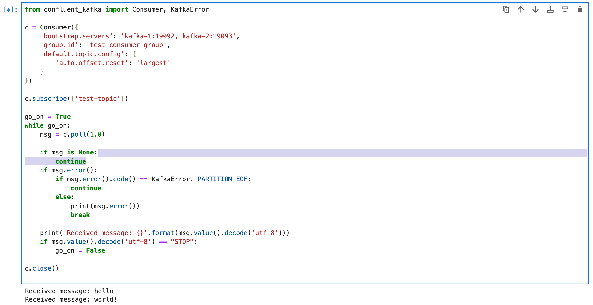
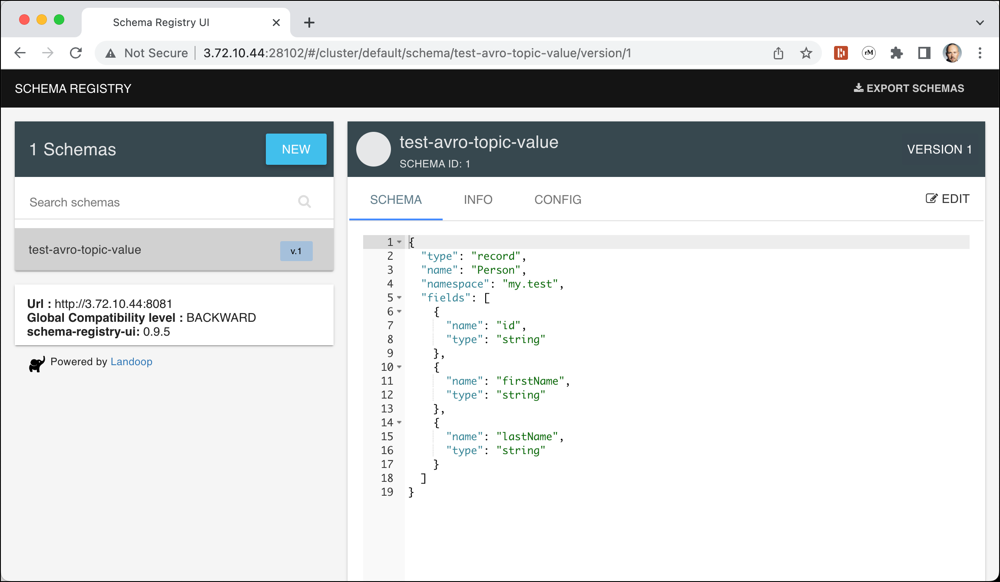

# Producing and Consuming Kafka Messages with Python

While Kafka's built-in CLI tools are useful for exploration and testing, real applications interact with Kafka through client libraries. The [Confluent Python client for Apache Kafka](https://github.com/confluentinc/confluent-kafka-python) is a high-performance Python wrapper around the native `librdkafka` library, giving you a production-grade producer and consumer with full support for consumer groups, schema serialization, and transactional semantics.

In this workshop you will write Python scripts that produce and consume messages against the same multi-broker cluster used in the previous workshops. You will start with plain string messages to understand the producer and consumer APIs, then move on to Avro-serialized messages — where the Schema Registry enforces a shared schema between producers and consumers and handles schema evolution automatically.

## Table of Contents

- [What you will learn](#what-you-will-learn)
- [Prerequisites](#prerequisites)
- [Installing the Confluent Python Client](#installing-the-confluent-python-client)
- [Working with Text Messages](#working-with-text-messages)
- [Working with Avro Messages and the Schema Registry](#working-with-avro-messages-and-the-schema-registry)
- [Browsing the Schema Registry](#browsing-the-schema-registry)
- [Schema Evolution with Forward Compatibility](#schema-evolution-with-forward-compatibility)
- [Deleting schemas from the Schema Registry](#deleting-schemas-from-the-schema-registry)

## What you will learn

- How to install and configure the Confluent Python client for Apache Kafka
- How to produce messages without a key and with a key from Python
- How to consume messages from a Kafka topic using a Python consumer
- How to produce Avro-serialized messages using the Schema Registry
- How to inspect registered schemas via the Schema Registry REST API and UI
- How to consume Avro messages using `kcat`, `kafka-avro-console-consumer`, and Python

## Prerequisites

- The **Data Platform** described [here](../00-environment/README.md) is running and accessible
- Familiarity with [Working with Apache Kafka](../01-working-with-kafka-broker/README.md) (Workshop 1) — in particular topics, producers, consumers, and `kcat`
- Python 3.7 or later installed, or access to the Jupyter container at <http://dataplatform:28888> (authentication token `abc123!`)
- Basic familiarity with the Linux command line

## Installing the Confluent Python Client

You can run the code in this workshop in two ways:

- **Locally on the Docker host** — install Python and the client library on your machine
- **Inside the Jupyter container** — the container is already running as part of the Data Platform and Python is pre-installed; navigate to <http://dataplatform:28888> (token `abc123!`)

> **Note:** The code examples below use the internal broker address `kafka-1:19092`. If you run them from outside the Docker network (e.g., directly on the Docker host), replace `kafka-1:19092` with `nnn.nnn.nnn.nnn:9092` and `kafka-2:19093` with `nnn.nnn.nnn.nnn:9093` (`nnn.nnn.nnn.nnn` being the IP address of the node where the dataplatform runs on).

Install the Confluent Python client:

```bash
pip install confluent-kafka
```

You can run each code block as a standalone script (`python script.py`) or paste it into a Jupyter notebook cell and execute it there.

## Working with Text Messages

### Create the topic

You can create the topic using the `kafka-topics` CLI as in the previous workshops:

```bash
docker exec -ti kafka-1 kafka-topics --create \
    --if-not-exists \
    --bootstrap-server kafka-1:19092 \
    --topic test-python-topic \
    --replication-factor 3 \
    --partitions 6
```

Alternatively, you can create the topic directly from Python using the `AdminClient`:

```python
from confluent_kafka.admin import AdminClient, NewTopic

admin = AdminClient({'bootstrap.servers': 'kafka-1:19092,kafka-2:19093'})

new_topic = NewTopic(
    topic='test-python-topic',
    num_partitions=6,
    replication_factor=3
)

futures = admin.create_topics([new_topic])

for topic, future in futures.items():
    try:
        future.result()
        print(f"Topic '{topic}' created successfully")
    except Exception as e:
        print(f"Failed to create topic '{topic}': {e}")
```

> **What you should see:** `Topic 'test-python-topic' created successfully`. If the topic already exists, the exception message will say so — you can suppress that case by checking `e.args[0].code() == KafkaError.TOPIC_ALREADY_EXISTS`.

> **What just happened?** `AdminClient.create_topics()` sends a `CreateTopics` request to the broker and returns a dictionary of `{topic_name: Future}`. Each future resolves when the broker confirms the topic has been created (or raises an exception on failure). The `AdminClient` uses the same bootstrap mechanism as producers and consumers — you only need to list one or two brokers; Kafka discovers the rest automatically.

### Monitor the topic with `kcat`

Open a separate terminal and start `kcat` to watch messages arrive in real time. The `-f` format string prints the partition, key, and value of each message:

```bash
kcat -b dataplatform:9092 -t test-python-topic -f "P-%p: %k=%s\n" -Z -q
```

If you are using the `kcat` container that ships with the Data Platform, use:

```bash
docker exec -ti kcat kcat -b kafka-1:19092 -t test-python-topic -f "P-%p: %k=%s\n" -Z -q
```

Leave this running in the background as you work through the sections below.

### Producing messages without a key

The following script produces six messages with a `null` key. With no key, the producer distributes messages across partitions using round-robin:

```python
import time
from confluent_kafka import Producer

topic_name = "test-python-topic"

p = Producer({'bootstrap.servers': 'kafka-1:19092,kafka-2:19093'})

def delivery_report(err, msg):
    if err is not None:
        print('Message delivery failed: {}'.format(err))
    else:
        print('Message delivered to {} [{}]'.format(msg.topic(), msg.partition()))

for data in ["message1", "message2", "message3", "message4", "message5", "message6"]:
    p.poll(0)
    p.produce(topic_name, data.encode('utf-8'), callback=delivery_report)
    time.sleep(0.5)

p.flush()
```

> **What you should see:** Six delivery confirmation lines from the `delivery_report` callback, and six new messages in the `kcat` terminal with `NULL` as the key:

```
P-1: NULL=message1
P-5: NULL=message2
P-1: NULL=message3
P-4: NULL=message4
P-1: NULL=message5
P-3: NULL=message6
```

> **What just happened?** `p.produce()` enqueues the message in the internal librdkafka buffer. `p.poll(0)` gives the library a chance to trigger delivery callbacks for previously sent messages. `p.flush()` blocks until all enqueued messages have been delivered and all callbacks have fired. Because no key was specified, the producer used round-robin partitioning, so the messages landed on different partitions.

### Producing messages with a key

To route all messages for the same entity to the same partition, pass a `key` to `produce()`:

```python
import time
from confluent_kafka import Producer

topic_name = "test-python-topic"

p = Producer({'bootstrap.servers': 'kafka-1:19092,kafka-2:19093'})

def delivery_report(err, msg):
    if err is not None:
        print('Message delivery failed: {}'.format(err))
    else:
        print('Message delivered to {} [{}]'.format(msg.topic(), msg.partition()))

for data in ["message1", "message2", "message3", "message4", "message5", "message6"]:
    p.poll(0)
    p.produce(topic_name, key='1', value=data.encode('utf-8'), callback=delivery_report)
    time.sleep(0.5)

p.flush()
```

> **What you should see:** Six more messages in the `kcat` terminal, all in the same partition and all carrying the key `1`:

```
P-5: 1=message1
P-5: 1=message2
P-5: 1=message3
P-5: 1=message4
P-5: 1=message5
P-5: 1=message6
```

> **What just happened?** The producer hashed the key `'1'` using the murmur2 algorithm and mapped it deterministically to a single partition. Every future message with key `'1'` will always land on partition 5, guaranteeing that a consumer of that partition sees all six messages in the order they were sent.

### Consuming messages

The following script subscribes to the topic and prints each message it receives. It exits cleanly when it receives a message with the value `STOP`:

```python
from confluent_kafka import Consumer

topic_name = "test-python-topic"

c = Consumer({
    'bootstrap.servers': 'kafka-1:19092,kafka-2:19093',
    'group.id': 'test-consumer-group',
    'auto.offset.reset': 'earliest'
})

c.subscribe([topic_name])

go_on = True
while go_on:
    msg = c.poll(1.0)

    if msg is None:
        continue
    if msg.error():
        print(msg.error())
        break

    print('Received message: {}'.format(msg.value().decode('utf-8')))
    if msg.value().decode('utf-8') == 'STOP':
        go_on = False

c.close()
```

> **What you should see:** The consumer starts and immediately replays all messages already in the topic (because `auto.offset.reset` is set to `earliest`), then waits for new ones.

```
Received message: message1
Received message: message2
Received message: message3
...
```

> **What just happened?** `c.subscribe()` registers the consumer with the group coordinator broker, which assigns partitions to it. `c.poll(1.0)` fetches the next batch of messages, blocking for up to 1 second if none are available. `'auto.offset.reset': 'earliest'` tells Kafka to start from the beginning of each partition the first time this `group.id` subscribes — subsequent runs resume from the last committed offset.

To send a new message while the consumer is running, open a second terminal and use `kcat` as a producer:

```bash
docker exec -ti kcat kcat -P -b kafka-1:19092 -t test-python-topic
```

Type a few messages and press **Ctrl-D** to send them. Send a final message with the value `STOP` to terminate the consumer.



### Producer reliability settings

By default the producer uses `acks=all` (all in-sync replicas must acknowledge the write before the leader responds) — this is the default since `librdkafka` 2.x, aligning with the Apache Kafka Java client change in Kafka 3.0. For production workloads you should also enable retries and idempotence:

| Config key | Recommended value | What it does |
|---|---|---|
| `acks` | `all` (or `-1`) | The leader waits for all in-sync replicas to acknowledge before responding — prevents data loss if the leader crashes immediately after the write |
| `retries` | `5` (or higher) | Automatically retry on retriable errors (network glitches, leader elections) |
| `enable.idempotence` | `true` | Guarantees exactly-once delivery to the broker even when retries cause duplicate network requests — requires `acks=all` |

```python
import time
from confluent_kafka import Producer

topic_name = "test-python-topic"

p = Producer({
    'bootstrap.servers': 'kafka-1:19092,kafka-2:19093',
    'acks': 'all',
    'retries': 5,
    'enable.idempotence': True,
})

def delivery_report(err, msg):
    if err is not None:
        print('Message delivery failed: {}'.format(err))
    else:
        print('Message delivered to {} [{}] at offset {}'.format(
            msg.topic(), msg.partition(), msg.offset()))

for data in ["message1", "message2", "message3", "message4", "message5", "message6"]:
    p.poll(0)
    p.produce(topic_name, key='1', value=data.encode('utf-8'), callback=delivery_report)
    time.sleep(0.5)

p.flush()
```

> **What just happened?** With `acks=all` the broker only acknowledges once every in-sync replica has written the message to its log, so a broker crash immediately after the write cannot cause loss. `enable.idempotence=True` assigns each message a sequence number; if a retry re-sends a message the broker silently discards the duplicate, giving you exactly-once producer semantics without any code changes. `p.flush()` still blocks until the delivery callback has fired for every enqueued message, so any delivery failure surfaces as an error in `delivery_report`.

### Manual offset commits

By default the consumer automatically commits the current offset back to Kafka. This behavior is controlled by two settings: `enable.auto.commit=True` (on by default) and `auto.commit.interval.ms=5000`. `librdkafka` does not commit on a background timer — the commit is evaluated and triggered at the start of the next `poll()` call once the interval has elapsed. This gives **at-least-once** delivery: if your process crashes while processing message N, the next `poll()` has not been called yet, so N's offset has not been committed and Kafka will redeliver it on restart.

With auto-commit you cannot control the exact moment the commit fires. Disabling auto-commit and committing manually after each successful processing step gives you full control.

```python
from confluent_kafka import Consumer, KafkaError

topic_name = "test-python-topic"

c = Consumer({
    'bootstrap.servers': 'kafka-1:19092,kafka-2:19093',
    'group.id': 'test-consumer-group-manual',
    'auto.offset.reset': 'earliest',
    'enable.auto.commit': False,
})

c.subscribe([topic_name])

try:
    while True:
        msg = c.poll(1.0)

        if msg is None:
            continue
        if msg.error():
            print('Consumer error: {}'.format(msg.error()))
            continue

        value = msg.value().decode('utf-8')
        print('Received message: {}'.format(value))

        # commit only after successful processing
        c.commit(msg)

        if value == 'STOP':
            break
finally:
    c.close()
```

> **What just happened?** `enable.auto.commit=False` tells the client library never to commit on its own. After each message is processed, `c.commit(msg)` synchronously commits that message's offset back to Kafka. If the process crashes before `commit()` is called, the broker has no record of the offset advance — the next consumer in the group will re-read from the last committed position and reprocess the message. `c.close()` in the `finally` block commits any pending offsets and sends a leave-group request so the rebalance happens immediately rather than waiting for a session timeout.

> **Tip:** `c.commit(msg)` performs a synchronous commit, which adds a small round-trip per message. For high-throughput consumers, call `c.commit(asynchronous=True)` to fire-and-forget and batch messages and commit once per batch.

So far all the messages we produced contained a single plain string — `"message1"`, `"message2"`, and so on. In real applications, a message payload is almost never a single string. You could serialize a structured object as JSON or CSV and produce it as a string value, and that works — but it has significant drawbacks:

- **No schema enforcement.** Nothing stops a producer from changing a field name or dropping a field. A consumer that expects `firstName` will silently break if a new producer starts sending `first_name`.
- **No schema evolution.** Adding a new optional field requires coordinating every producer and consumer simultaneously, or writing brittle version-detection code.
- **Wasted bytes.** JSON repeats field names in every message. At high throughput this adds up.

In the next section we will see a better approach using a **schema-based serialization format** paired with a **Schema Registry**.

## Working with Avro Messages and the Schema Registry

When using a **schema-based serialization format** paired with the **Schema Registry**, the producer registers a schema once; every message carries only a compact schema ID (4 bytes) rather than the full field names. The consumer fetches the schema by ID and deserializes the payload. The registry enforces compatibility rules so that schema changes are always backward- or forward-compatible with existing consumers.

[Apache Avro](https://avro.apache.org/) is the most widely used format in the Kafka ecosystem for exactly this reason. The Confluent Python client supports Avro-serialized messages via the [Confluent Schema Registry](https://docs.confluent.io/current/schema-registry/docs/index.html). 

The Schema Registry manages Avro schemas centrally and enforces schema compatibility rules so producers and consumers stay in sync. It exposes a REST API documented in the [Confluent documentation](https://docs.confluent.io/current/schema-registry/develop/api.html) and available at <http://dataplatform:8081>.

Install the Avro extras:

```bash
pip install confluent-kafka[avro]
```

### Create the topic

Create a dedicated topic for the Avro examples:

```bash
docker exec -ti kafka-1 kafka-topics --create \
    --if-not-exists \
    --bootstrap-server kafka-1:19092 \
    --topic test-python-avro-topic \
    --partitions 8 \
    --replication-factor 3
```

Monitor the new topic with `kcat` in a separate terminal:

```bash
kcat -b dataplatform:9092 -t test-python-avro-topic -f "P-%p: %k=%s\n" -Z -q
```

### Producing Avro messages

The following script defines a `Person` Avro schema, registers it with the Schema Registry, and produces one message:

```python
import datetime
from confluent_kafka import Producer
from confluent_kafka.serialization import StringSerializer, SerializationContext, MessageField
from confluent_kafka.schema_registry import SchemaRegistryClient
from confluent_kafka.schema_registry.avro import AvroSerializer

topic_name = "test-python-avro-topic"

value_schema_str = """
{
  "namespace": "my.test",
  "name": "Person",
  "type": "record",
  "fields": [
    {"name": "id",          "type": "long"},
    {"name": "firstName",   "type": "string"},
    {"name": "lastName",    "type": "string"},
    {"name": "dateOfBirth", "type": {"type": "int", "logicalType": "date"}},
    {"name": "email",       "type": ["null", "string"], "default": null},
    {"name": "address", "type": {
      "type": "record",
      "name": "Address",
      "fields": [
        {"name": "street",  "type": "string"},
        {"name": "city",    "type": "string"},
        {"name": "zipCode", "type": "string"},
        {"name": "country", "type": "string"}
      ]
    }}
  ]
}
"""

class Address(object):
    def __init__(self, street, city, zipCode, country):
        self.street = street
        self.city = city
        self.zipCode = zipCode
        self.country = country

class Person(object):
    def __init__(self, id, firstName, lastName, dateOfBirth, email, address):
        self.id = id
        self.firstName = firstName
        self.lastName = lastName
        self.dateOfBirth = dateOfBirth
        self.email = email
        self.address = address

def person_to_dict(person, ctx):
    return dict(
        id=person.id,
        firstName=person.firstName,
        lastName=person.lastName,
        dateOfBirth=person.dateOfBirth,
        email=person.email,
        address=dict(
            street=person.address.street,
            city=person.address.city,
            zipCode=person.address.zipCode,
            country=person.address.country
        )
    )

def delivery_report(err, msg):
    if err is not None:
        print("Delivery failed for record {}: {}".format(msg.key(), err))
        return
    print('Record {} successfully produced to {} [{}] at offset {}'.format(
        msg.key(), msg.topic(), msg.partition(), msg.offset()))

schema_registry_client = SchemaRegistryClient({'url': 'http://schema-registry-1:8081'})

avro_serializer = AvroSerializer(schema_registry_client, value_schema_str, person_to_dict)
string_serializer = StringSerializer('utf_8')

person = Person(
    id=1001,
    firstName='Peter',
    lastName='Muster',
    dateOfBirth=datetime.date(1985, 3, 15),
    email='peter.muster@example.com',
    address=Address(street='Bahnhofstrasse 1', city='Zurich', zipCode='8001', country='CH')
)

producer = Producer({'bootstrap.servers': 'kafka-1:19092'})
producer.produce(
    topic=topic_name,
    key=string_serializer(str(person.id)),
    value=avro_serializer(person, SerializationContext(topic_name, MessageField.VALUE)),
    on_delivery=delivery_report
)
producer.flush()
```

> **What you should see:** A delivery confirmation line confirming the message was produced:

```
Record b'1001' successfully produced to test-python-avro-topic [1] at offset 0
```

> **What just happened?** On the first run, the `AvroSerializer` checked whether the `Person` schema already exists in the Schema Registry. Since it did not, it registered it automatically. It then serialized the `Person` object into Avro binary format and prepended a 5-byte Confluent wire format header — 1 magic byte (`0x00`) followed by a 4-byte schema ID — before handing the payload to the producer. The Schema Registry enforces the configured compatibility level on subsequent schema changes — by default `BACKWARD`, meaning new schemas must be able to read data written with the previous schema.

### Producing Avro messages using a schema looked up from the Schema Registry

Embedding the schema string in the producer works, but couples the code to the schema definition. A better approach is to pre-register the schema in the Schema Registry via its REST API before running any producer code, and then have the producer fetch it at startup. This way the schema is owned by the registry, not the application — any producer can pick it up without embedding or duplicating the definition, and if the schema evolves the code requires no changes.

#### Register the schema via the API first

Pre-register the schema by POSTing it to the Schema Registry. Save the Avro schema to a file:

```bash
cat > person.avsc << 'EOF'
{
  "namespace": "my.test",
  "name": "Person",
  "type": "record",
  "fields": [
    {"name": "id",          "type": "long"},
    {"name": "firstName",   "type": "string"},
    {"name": "lastName",    "type": "string"},
    {"name": "dateOfBirth", "type": {"type": "int", "logicalType": "date"}},
    {"name": "email",       "type": ["null", "string"], "default": null},
    {"name": "address", "type": {
      "type": "record",
      "name": "Address",
      "fields": [
        {"name": "street",  "type": "string"},
        {"name": "city",    "type": "string"},
        {"name": "zipCode", "type": "string"},
        {"name": "country", "type": "string"}
      ]
    }}
  ]
}
EOF
```

Before continuing, delete the Avro schema you might have previously registered in Python:

```bash
curl -s -X DELETE http://dataplatform:8081/subjects/test-python-avro-topic-value
```

Before registering the schema, set the compatibility level for the subject. The default is `BACKWARD` (new schema can read data written with the previous schema), but you can choose the level that fits your evolution strategy:

```bash
curl -s -X PUT http://dataplatform:8081/config/test-python-avro-topic-value \
    -H "Content-Type: application/vnd.schemaregistry.v1+json" \
    -d '{"compatibility": "BACKWARD"}'
```

> **What you should see:** The registry echoing back the configured level:

```json
{"compatibility":"BACKWARD"}
```

> Available levels are `BACKWARD`, `BACKWARD_TRANSITIVE`, `FORWARD`, `FORWARD_TRANSITIVE`, `FULL`, `FULL_TRANSITIVE`, and `NONE`. Transitive variants check compatibility against all previous versions, not just the latest one.

Then register the schema using `jq` to produce the correctly escaped request body:

```bash
jq -n --arg schema "$(cat person.avsc)" '{"schema": $schema}' | \
  curl -s -X POST http://dataplatform:8081/subjects/test-python-avro-topic-value/versions \
    -H "Content-Type: application/vnd.schemaregistry.v1+json" \
    -d @-
```

> **What you should see:** The schema ID assigned by the registry:

```json
{"id":1}
```

> **What just happened?** The Schema Registry validated the schema against the configured compatibility level, stored it under the subject `test-python-avro-topic-value`, and assigned it a globally unique schema ID. Any producer or consumer that references this ID in the Confluent wire format header can use this exact definition to serialize or deserialize messages — even before the first message has been produced to the topic.

#### Fetch the schema and produce messages

With the schema registered, the producer fetches it at startup by subject name and uses it to serialize messages:

```python
import datetime
from confluent_kafka import Producer
from confluent_kafka.serialization import StringSerializer, SerializationContext, MessageField
from confluent_kafka.schema_registry import SchemaRegistryClient
from confluent_kafka.schema_registry.avro import AvroSerializer

topic_name = "test-python-avro-topic"
subject_name = f"{topic_name}-value"

class Address(object):
    def __init__(self, street, city, zipCode, country):
        self.street = street
        self.city = city
        self.zipCode = zipCode
        self.country = country

class Person(object):
    def __init__(self, id, firstName, lastName, dateOfBirth, email, address):
        self.id = id
        self.firstName = firstName
        self.lastName = lastName
        self.dateOfBirth = dateOfBirth
        self.email = email
        self.address = address

def person_to_dict(person, ctx):
    return dict(
        id=person.id,
        firstName=person.firstName,
        lastName=person.lastName,
        dateOfBirth=person.dateOfBirth,
        email=person.email,
        address=dict(
            street=person.address.street,
            city=person.address.city,
            zipCode=person.address.zipCode,
            country=person.address.country
        )
    )

def delivery_report(err, msg):
    if err is not None:
        print("Delivery failed for record {}: {}".format(msg.key(), err))
        return
    print('Record {} successfully produced to {} [{}] at offset {}'.format(
        msg.key(), msg.topic(), msg.partition(), msg.offset()))

schema_registry_client = SchemaRegistryClient({'url': 'http://schema-registry-1:8081'})

# Fetch the latest registered schema for this subject instead of embedding it
registered_schema = schema_registry_client.get_latest_version(subject_name)
schema_str = registered_schema.schema.schema_str

avro_serializer = AvroSerializer(schema_registry_client, schema_str, person_to_dict)
string_serializer = StringSerializer('utf_8')

person = Person(
    id=1002,
    firstName='Anna',
    lastName='Muster',
    dateOfBirth=datetime.date(1990, 7, 22),
    email='anna.muster@example.com',
    address=Address(street='Seestrasse 42', city='Zurich', zipCode='8002', country='CH')
)

producer = Producer({'bootstrap.servers': 'kafka-1:19092'})
producer.produce(
    topic=topic_name,
    key=string_serializer(str(person.id)),
    value=avro_serializer(person, SerializationContext(topic_name, MessageField.VALUE)),
    on_delivery=delivery_report
)
producer.flush()
```

> **What you should see:** The same delivery confirmation as before, but now the schema was fetched from the registry rather than defined in the code:

```
Record b'1002' successfully produced to test-python-avro-topic [1] at offset 1
```

> **What just happened?** `SchemaRegistryClient.get_latest_version(subject_name)` retrieves the most recently registered schema version for the subject `test-python-avro-topic-value`. The schema string is then passed to `AvroSerializer` exactly as before. If the schema has been updated in the registry (e.g., a new optional field was added), the producer picks it up automatically on the next restart — no code change required. The subject name follows the default Confluent naming convention: `<topic>-value` for value schemas and `<topic>-key` for key schemas.

### Consuming Avro messages with `kcat`

Consuming Avro messages with `kcat` without extra flags shows the raw binary payload, which is not human-readable:

```bash
docker exec -ti kcat kcat -b kafka-1:19092 -t test-python-avro-topic -f "P-%p: %k=%s\n" -Z -q
```

```
P-5: 10011001
Peter
     Muster
P-5: 1001=�
Peter
     Muster�V0peter.muster@example.com Bahnhofstrasse 1
                                                       Zuric8001CH
P-3: 1002=Anna
              Muster�u.anna.muster@example.comSeestrasse 42
                                                           Zuric8002CH
```

To have `kcat` decode the Avro payload using the Schema Registry, add the `-s value=avro` and `-r` flags:

```bash
docker exec -ti kcat kcat -b kafka-1:19092 -t test-python-avro-topic \
    -f "P-%p: %k=%s\n" -Z -q \
    -s value=avro \
    -r http://schema-registry-1:8081
```

> **What you should see:** The Avro payload is decoded and displayed as a JSON string:

```
P-1: 1001={"id": 1001, "firstName": "Peter", "lastName": "Muster", "dateOfBirth": "1985-03-15", "email": "peter.muster@example.com", "address": {"street": "Bahnhofstrasse 1", "city": "Zurich", "zipCode": "8001", "country": "CH"}}
```

> **What just happened?** `kcat` read the 5-byte Confluent wire format prefix from each message, extracted the schema ID, fetched the corresponding Avro schema from the Schema Registry at `-r`, and used it to deserialize the binary payload into a human-readable JSON representation.

### Consuming Avro messages with `kafka-avro-console-consumer`

The `kafka-avro-console-consumer` tool is included in the Schema Registry container and provides a quick way to inspect Avro topics from the command line.

Connect to the Schema Registry container:

```bash
docker exec -ti schema-registry-1 bash
```

Then run the consumer:

```bash
kafka-avro-console-consumer \
    --bootstrap-server kafka-1:19092,kafka-2:19093 \
    --topic test-python-avro-topic
```

> **What you should see:** Each Avro message printed as a readable JSON document:

```json
{"id":1001,"firstName":"Peter","lastName":"Muster","dateOfBirth":"1985-03-15","email":"peter.muster@example.com","address":{"street":"Bahnhofstrasse 1","city":"Zurich","zipCode":"8001","country":"CH"}}
```

> **What just happened?** `kafka-avro-console-consumer` automatically fetches the schema from the Schema Registry and deserializes the Avro binary payload to JSON before printing it, in the same way `kcat` does with the `-s avro` flag — but it is pre-configured to talk to the Schema Registry running alongside it in the container.

### Consuming Avro messages from Python

The following script consumes Avro messages and deserializes each one into a `Person` object. Rather than embedding the schema string, it fetches the reader schema from the Schema Registry by a pinned schema ID at startup. Using a fixed ID keeps the consumer stable — it always deserializes against the exact schema version it was built for, regardless of what gets registered later.

```python
from confluent_kafka import Consumer
from confluent_kafka.serialization import SerializationContext, MessageField
from confluent_kafka.schema_registry import SchemaRegistryClient
from confluent_kafka.schema_registry.avro import AvroDeserializer

topic_name = "test-python-avro-topic"
schema_id = 1  # pin to a specific registered schema version

class Address(object):
    def __init__(self, street, city, zipCode, country):
        self.street = street
        self.city = city
        self.zipCode = zipCode
        self.country = country

class Person(object):
    def __init__(self, id, firstName, lastName, dateOfBirth, email, address):
        self.id = id
        self.firstName = firstName
        self.lastName = lastName
        self.dateOfBirth = dateOfBirth
        self.email = email
        self.address = address

def dict_to_person(obj, ctx):
    if obj is None:
        return None
    addr = obj['address']
    return Person(
        id=obj['id'],
        firstName=obj['firstName'],
        lastName=obj['lastName'],
        dateOfBirth=obj['dateOfBirth'],
        email=obj['email'],
        address=Address(
            street=addr['street'],
            city=addr['city'],
            zipCode=addr['zipCode'],
            country=addr['country']
        )
    )

schema_registry_client = SchemaRegistryClient({'url': 'http://schema-registry-1:8081'})

# Fetch the reader schema by ID so the consumer is pinned to a known version
registered_schema = schema_registry_client.get_schema(schema_id)
avro_deserializer = AvroDeserializer(schema_registry_client, registered_schema.schema_str, dict_to_person)

consumer = Consumer({
    'bootstrap.servers': 'kafka-1:19092',
    'group.id': 'test-python-avro-topic-cg',
    'auto.offset.reset': 'earliest'
})
consumer.subscribe([topic_name])

try:
    while True:
        msg = consumer.poll(20.0)
        if msg is None:
            break

        person = avro_deserializer(msg.value(), SerializationContext(msg.topic(), MessageField.VALUE))
        if person is not None:
            print("Person record {}: id: {}\n"
                  "\tfirstName:   {}\n"
                  "\tlastName:    {}\n"
                  "\tdateOfBirth: {}\n"
                  "\temail:       {}\n"
                  "\taddress:     {}, {} {}, {}\n"
                  .format(msg.key(), person.id,
                          person.firstName, person.lastName,
                          person.dateOfBirth, person.email,
                          person.address.street, person.address.zipCode,
                          person.address.city, person.address.country))
except KeyboardInterrupt:
    pass
finally:
    consumer.close()
```

> **What you should see:** Each consumed Avro message deserialized and printed as a `Person` record:

```
Person record b'1001': id: 1001
	firstName:   Peter
	lastName:    Muster
	dateOfBirth: 1985-03-15
	email:       peter.muster@example.com
	address:     Bahnhofstrasse 1, 8001 Zurich, CH
```

> **What just happened?** `SchemaRegistryClient.get_schema(schema_id)` fetches the exact schema version registered under that ID and uses it as the reader schema for `AvroDeserializer`. For each message, the deserializer reads the 5-byte Confluent wire format header to get the writer's schema ID, resolves any differences between writer and reader schemas using Avro's schema resolution rules, and deserializes the payload into a Python dict. The `dict_to_person` callback then converts that dict into a `Person` instance. The consumer loop runs until interrupted with **Ctrl-C**, at which point the `finally` block calls `consumer.close()` to commit offsets and cleanly leave the consumer group.

## Browsing the Schema Registry

Once schemas are registered, the Schema Registry gives you two ways to inspect them: a REST API for scripting and automation, and a web UI for interactive exploration. Both show the same data — subjects, version history, schema definitions, and compatibility settings — so you can use whichever fits your workflow.

### Viewing schemas via the REST API

The Schema Registry exposes a REST API documented in the [Confluent documentation](https://docs.confluent.io/current/schema-registry/develop/api.html).

#### List all registered subjects

List all registered subjects:

```bash
curl http://dataplatform:8081/subjects
```

> **What you should see:** The subject created by the Avro producer:

```json
["test-python-avro-topic-value"]
```

List the available versions for the subject:

```bash
curl http://dataplatform:8081/subjects/test-python-avro-topic-value/versions
```

> **What you should see:** A single version, since we have only registered the schema once:

```json
[1]
```

Retrieve the full schema definition:

```bash
curl http://dataplatform:8081/subjects/test-python-avro-topic-value/versions/1
```

> **What you should see:** The schema object containing the subject name, version number, schema ID, and the Avro schema JSON:

```json
{"subject":"test-python-avro-topic-value","version":1,"id":1,"schema":"{\"type\":\"record\",\"name\":\"Person\",\"namespace\":\"my.test\",\"fields\":[{\"name\":\"id\",\"type\":\"long\"},{\"name\":\"firstName\",\"type\":\"string\"},{\"name\":\"lastName\",\"type\":\"string\"},{\"name\":\"dateOfBirth\",\"type\":{\"type\":\"int\",\"logicalType\":\"date\"}},{\"name\":\"email\",\"type\":[\"null\",\"string\"],\"default\":null},{\"name\":\"address\",\"type\":{\"type\":\"record\",\"name\":\"Address\",\"fields\":[{\"name\":\"street\",\"type\":\"string\"},{\"name\":\"city\",\"type\":\"string\"},{\"name\":\"zipCode\",\"type\":\"string\"},{\"name\":\"country\",\"type\":\"string\"}]}}]}"}
```

> **What just happened?** The Schema Registry stored the schema under the subject name `<topic>-value` (the default naming strategy). The REST API lets you inspect, compare, and manage versions without any Kafka tooling — useful for auditing schema evolution in a pipeline.

### Viewing schemas in the Schema Registry UI

Navigate to the Schema Registry UI at <http://dataplatform:28102>.

> **What you should see:** The `test-python-avro-topic-value` subject listed. Clicking on it displays the full Avro schema on the right side.



### Viewing schemas using AKHQ

[AKHQ](https://akhq.io) is a full-featured Kafka management UI that also surfaces Schema Registry data. Navigate to <http://dataplatform:28107> and select the **Schema Registry** section in the left sidebar.

> **What you should see:** A list of all registered subjects. Clicking on `test-python-avro-topic-value` shows the schema definition, its version history, and the configured compatibility level. You can compare versions side by side and delete individual versions or entire subjects from the same view.

### Viewing schemas using kafbat UI

[kafbat UI](https://github.com/kafbat/kafka-ui) is a lightweight, open-source Kafka management console. Navigate to <http://dataplatform:28183> and open the **Schema Registry** tab in the top navigation.

> **What you should see:** All registered subjects listed by name. Selecting `test-python-avro-topic-value` displays the full Avro schema, the assigned schema ID, the version number, and the compatibility level. The UI also lets you register new schemas and update compatibility settings directly from the browser.

## Schema Evolution with Forward Compatibility

Schemas rarely stay static. As requirements change, new fields are added — and you need a strategy that lets producers and consumers evolve independently without coordinated downtime. This section demonstrates a **FULL-compatible** schema change: a new optional field is added to the schema and the producer is updated to write it, while the existing consumer continues to work unchanged.

**FULL** compatibility means both BACKWARD and FORWARD at the same time. The new schema can read old data (the missing field falls back to its default), and the old schema can read new data (the unknown field is silently skipped). Adding a nullable field with `default: null` is the most common way to achieve this.

### Update the compatibility level

The subject was previously configured as `BACKWARD`. Change it to `FULL` before registering the new schema version:

```bash
curl -s -X PUT http://dataplatform:8081/config/test-python-avro-topic-value \
    -H "Content-Type: application/vnd.schemaregistry.v1+json" \
    -d '{"compatibility": "FULL"}'
```

> **What you should see:**

```json
{"compatibility":"FULL"}
```

### Register the evolved schema

The new schema adds an optional `phoneNumber` field as a nullable union with `default: null`. The default satisfies the BACKWARD requirement (new consumers reading old messages that lack the field receive `null`), and the fact that old consumers simply skip unknown fields satisfies the FORWARD requirement. Save the updated schema:

```bash
cat > person-v2.avsc << 'EOF'
{
  "namespace": "my.test",
  "name": "Person",
  "type": "record",
  "fields": [
    {"name": "id",          "type": "long"},
    {"name": "firstName",   "type": "string"},
    {"name": "lastName",    "type": "string"},
    {"name": "dateOfBirth", "type": {"type": "int", "logicalType": "date"}},
    {"name": "email",       "type": ["null", "string"], "default": null},
    {"name": "phoneNumber", "type": ["null", "string"], "default": null},
    {"name": "address", "type": {
      "type": "record",
      "name": "Address",
      "fields": [
        {"name": "street",  "type": "string"},
        {"name": "city",    "type": "string"},
        {"name": "zipCode", "type": "string"},
        {"name": "country", "type": "string"}
      ]
    }}
  ]
}
EOF
```

Register it as version 2 of the same subject:

```bash
jq -n --arg schema "$(cat person-v2.avsc)" '{"schema": $schema}' | \
  curl -s -X POST http://dataplatform:8081/subjects/test-python-avro-topic-value/versions \
    -H "Content-Type: application/vnd.schemaregistry.v1+json" \
    -d @-
```

> **What you should see:** A new schema ID (2) assigned by the registry:

```json
{"id":2}
```

### Produce messages with the new schema

The updated producer fetches the latest schema version (v2) from the registry and includes `phoneNumber` in each message:

```python
import datetime
from confluent_kafka import Producer
from confluent_kafka.serialization import StringSerializer, SerializationContext, MessageField
from confluent_kafka.schema_registry import SchemaRegistryClient
from confluent_kafka.schema_registry.avro import AvroSerializer

topic_name = "test-python-avro-topic"
subject_name = f"{topic_name}-value"

class Address(object):
    def __init__(self, street, city, zipCode, country):
        self.street = street
        self.city = city
        self.zipCode = zipCode
        self.country = country

class Person(object):
    def __init__(self, id, firstName, lastName, dateOfBirth, email, phoneNumber, address):
        self.id = id
        self.firstName = firstName
        self.lastName = lastName
        self.dateOfBirth = dateOfBirth
        self.email = email
        self.phoneNumber = phoneNumber
        self.address = address

def person_to_dict(person, ctx):
    return dict(
        id=person.id,
        firstName=person.firstName,
        lastName=person.lastName,
        dateOfBirth=person.dateOfBirth,
        email=person.email,
        phoneNumber=person.phoneNumber,
        address=dict(
            street=person.address.street,
            city=person.address.city,
            zipCode=person.address.zipCode,
            country=person.address.country
        )
    )

def delivery_report(err, msg):
    if err is not None:
        print("Delivery failed for record {}: {}".format(msg.key(), err))
        return
    print('Record {} successfully produced to {} [{}] at offset {}'.format(
        msg.key(), msg.topic(), msg.partition(), msg.offset()))

schema_registry_client = SchemaRegistryClient({'url': 'http://schema-registry-1:8081'})

registered_schema = schema_registry_client.get_latest_version(subject_name)
schema_str = registered_schema.schema.schema_str

avro_serializer = AvroSerializer(schema_registry_client, schema_str, person_to_dict)
string_serializer = StringSerializer('utf_8')

person = Person(
    id=1003,
    firstName='Hans',
    lastName='Muster',
    dateOfBirth=datetime.date(1978, 11, 3),
    email='hans.muster@example.com',
    phoneNumber='+41 44 123 45 67',
    address=Address(street='Rathausstrasse 10', city='Zurich', zipCode='8001', country='CH')
)

producer = Producer({'bootstrap.servers': 'kafka-1:19092'})
producer.produce(
    topic=topic_name,
    key=string_serializer(str(person.id)),
    value=avro_serializer(person, SerializationContext(topic_name, MessageField.VALUE)),
    on_delivery=delivery_report
)
producer.flush()
```

> **What you should see:**

```
Record b'1003' successfully produced to test-python-avro-topic [1] at offset 2
```

> **What just happened?** `get_latest_version` now returns schema v2, which includes `phoneNumber` as a nullable field with `default: null`. The `AvroSerializer` embeds schema ID 2 in the Confluent wire format header of the message, so any consumer that reads the header knows it was written with the new schema.

### Consume with the unchanged consumer

Run the original consumer script — the one pinned to `schema_id = 1` — against the topic that now contains the new v2 message. Paste the script into a new Jupyter cell (or re-run it as a standalone script) and execute it:

```bash
python avro_consumer.py
```

> **What you should see:** All three messages consumed correctly, including the new one produced with schema v2. The `phoneNumber` field is absent from the output because the reader schema (v1) does not include it:

```
Person record b'1001': id: 1001
	firstName:   Peter
	lastName:    Muster
	dateOfBirth: 1985-03-15
	email:       peter.muster@example.com
	address:     Bahnhofstrasse 1, 8001 Zurich, CH

Person record b'1002': id: 1002
	firstName:   Anna
	lastName:    Muster
	dateOfBirth: 1990-07-22
	email:       anna.muster@example.com
	address:     Seestrasse 42, 8002 Zurich, CH

Person record b'1003': id: 1003
	firstName:   Hans
	lastName:    Muster
	dateOfBirth: 1978-11-03
	email:       hans.muster@example.com
	address:     Rathausstrasse 10, 8001 Zurich, CH
```

> **What just happened?** The consumer fetched schema v1 (its pinned reader schema) at startup. When it received the message for `1003`, the `AvroDeserializer` detected that the writer schema (ID 2, from the wire header) differs from the reader schema (ID 1). Avro's schema resolution rules kicked in: `phoneNumber` exists in the writer schema but not in the reader schema, so it was silently skipped. This is the FULL-compatibility guarantee in action — the `default: null` on the new field means a new consumer could also read old messages safely, while the old consumer reads new messages by simply ignoring the unknown field. Neither side required a code change or restart.

## Deleting schemas from the Schema Registry

To delete a specific version of a registered schema:

```bash
curl -s -X DELETE http://dataplatform:8081/subjects/test-python-avro-topic-value/versions/1
```

> **What you should see:** The version number that was deleted:

```json
1
```

To delete all versions of a subject at once (removes the entire subject):

```bash
curl -s -X DELETE http://dataplatform:8081/subjects/test-python-avro-topic-value
```

> **What you should see:** The list of version numbers that were deleted:

```json
[1]
```

Both calls above perform a **soft delete** — the schema is marked as deleted and excluded from normal lookups, but the data is retained internally. This lets the registry continue serving deserialization requests for any messages already in Kafka that reference the deleted schema ID.

To permanently remove the schema data, append `?permanent=true`. A permanent delete must be preceded by a soft delete:

```bash
curl -s -X DELETE "http://dataplatform:8081/subjects/test-python-avro-topic-value/versions/1?permanent=true"
```

> **Warning:** A permanent delete is irreversible. Any consumer that tries to deserialize a Kafka message whose wire-format header references the deleted schema ID will fail with a schema-not-found error.