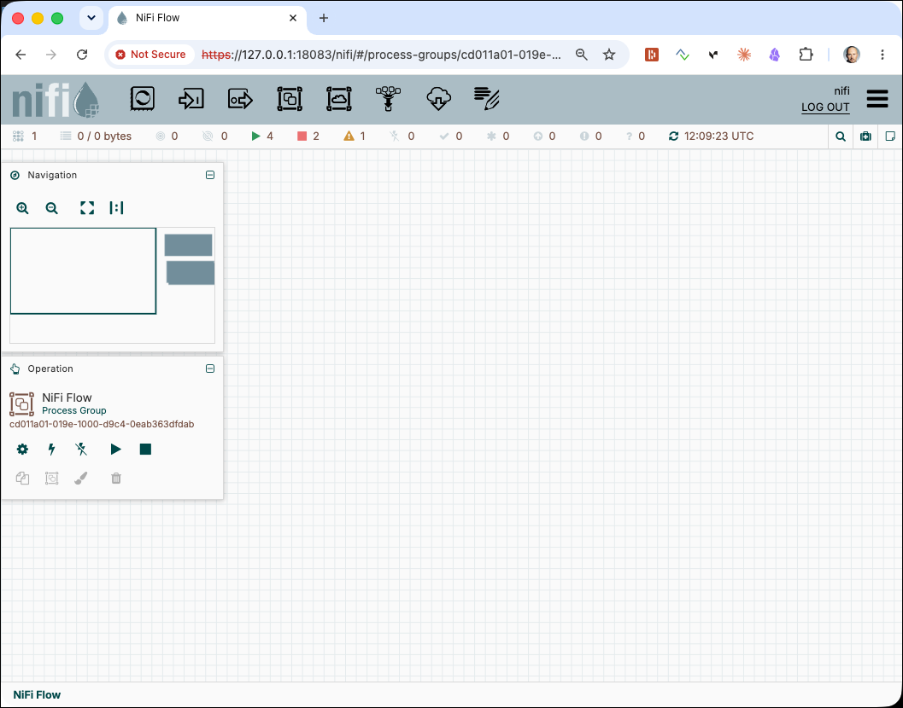
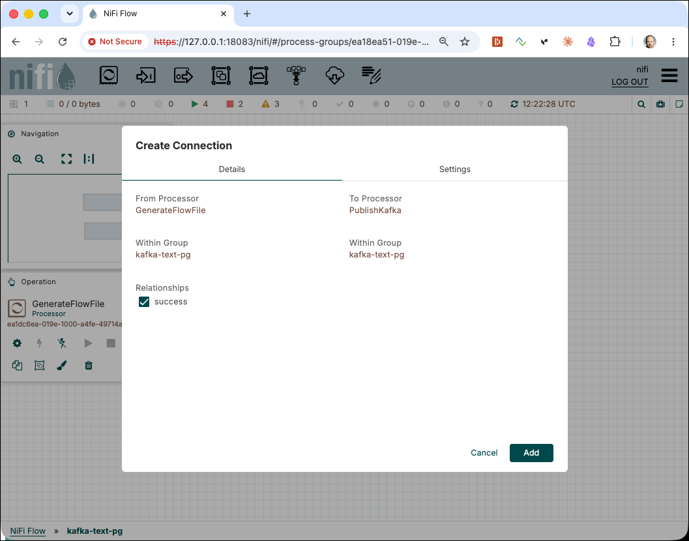
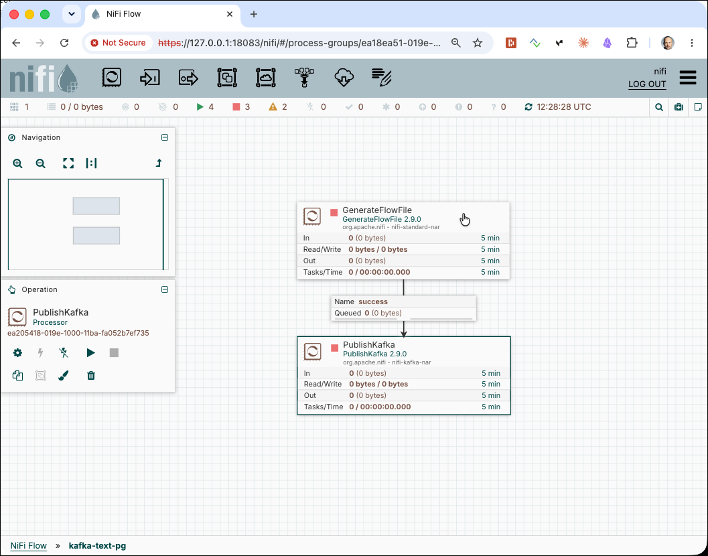
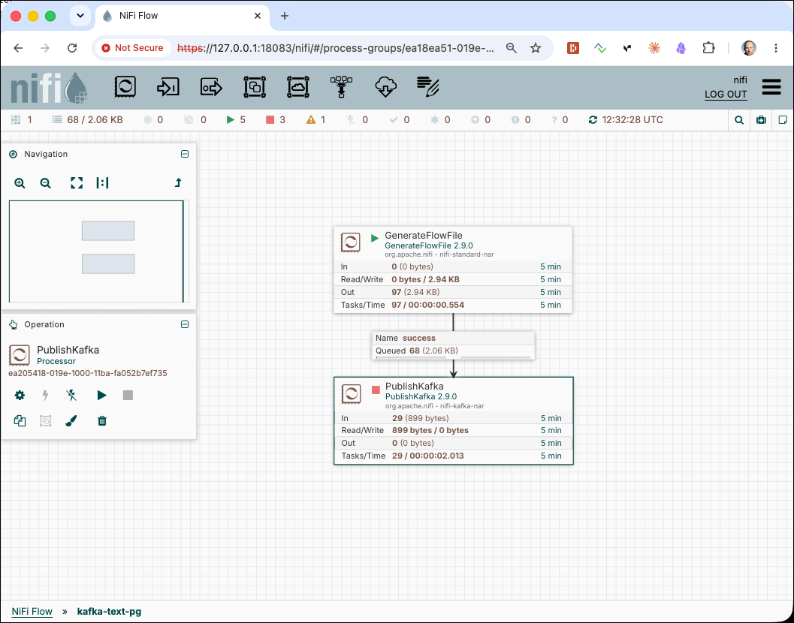
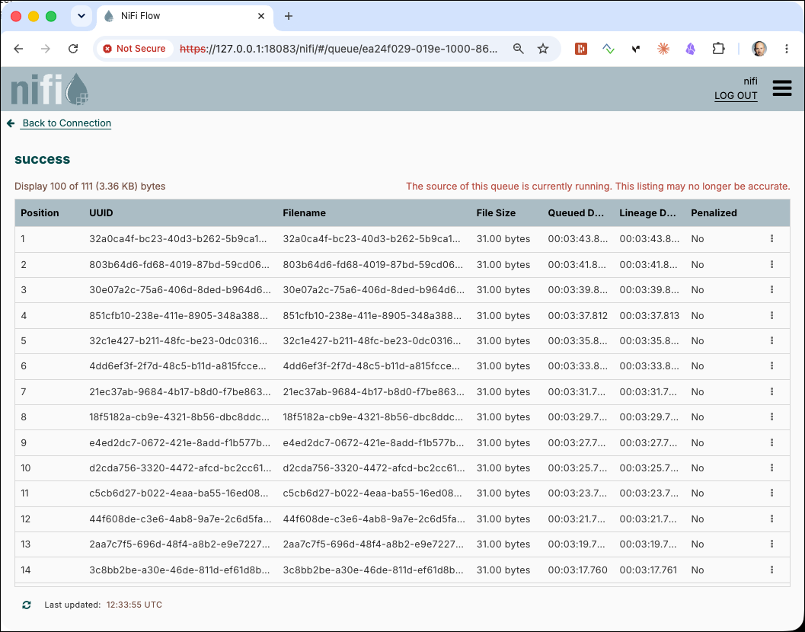
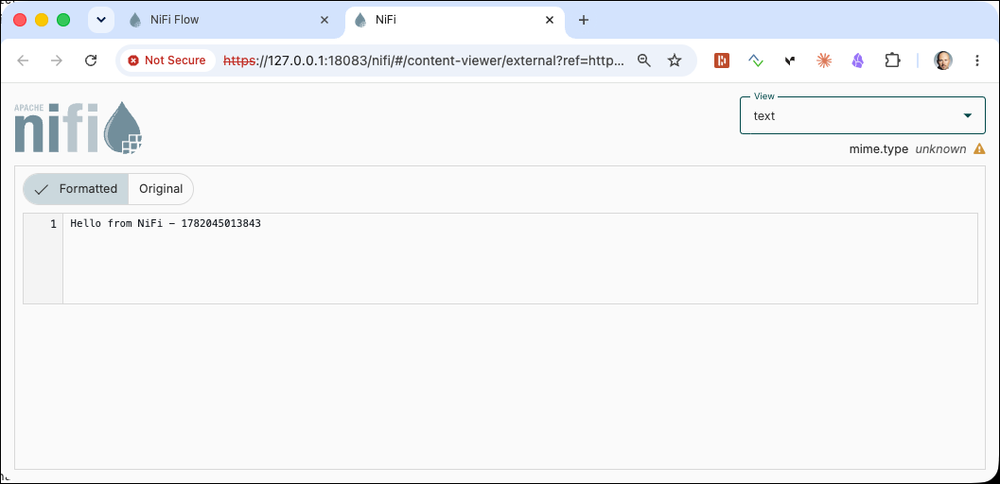
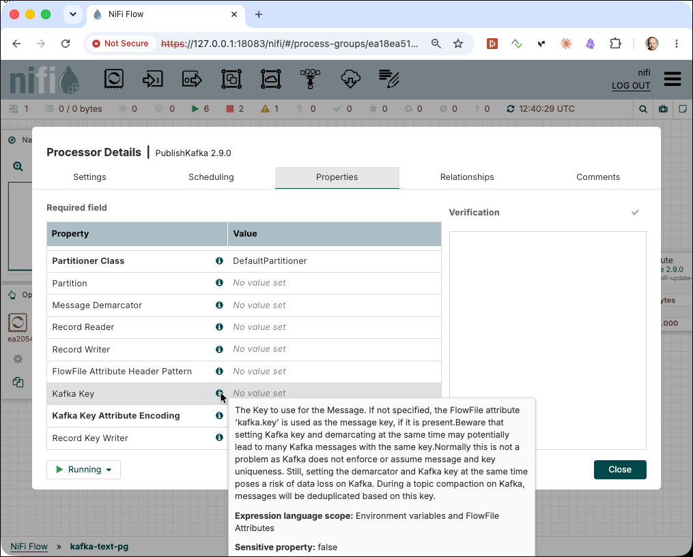
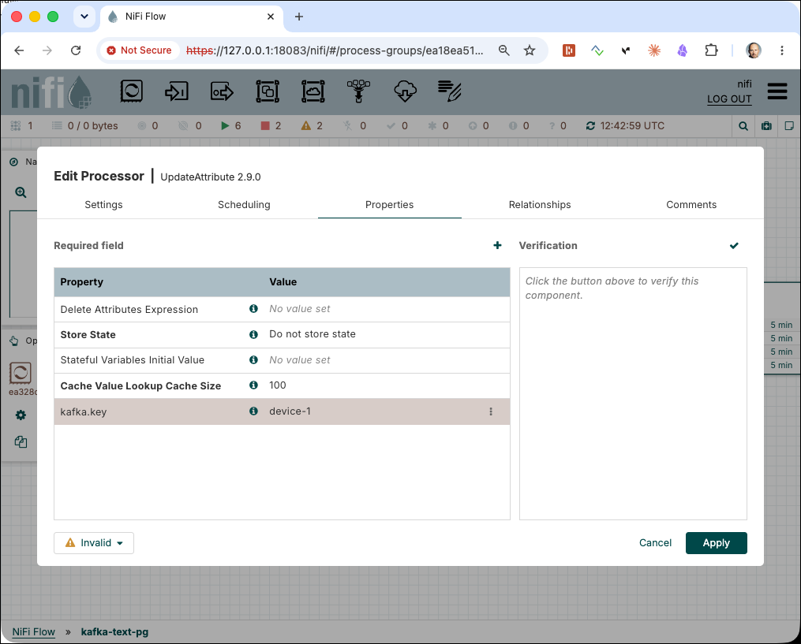
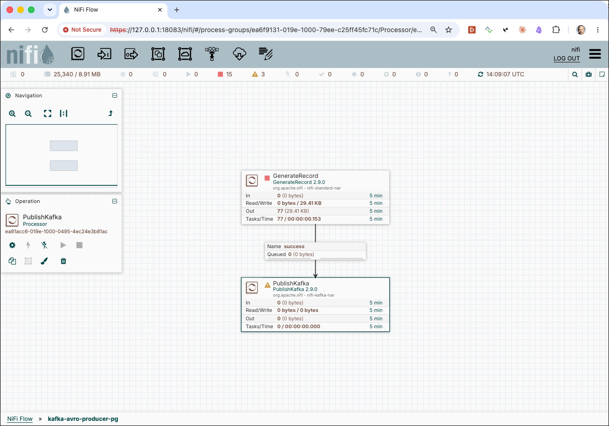
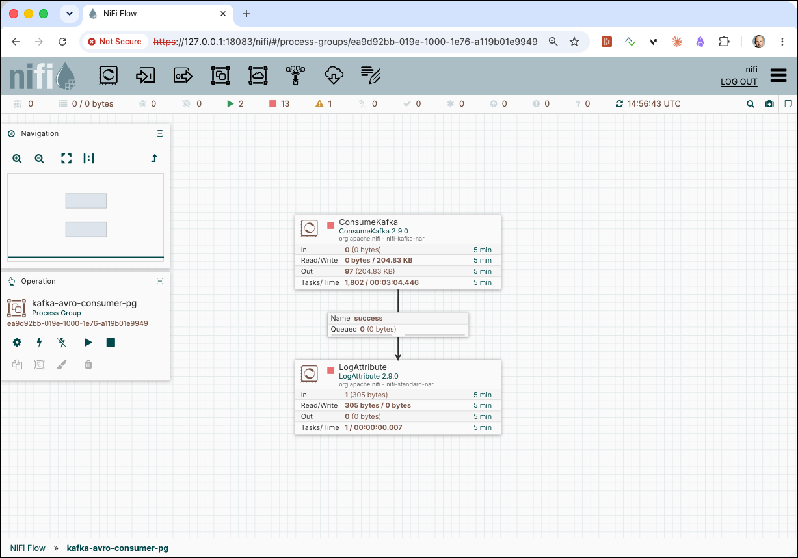

# Producing and Consuming Kafka Messages with Apache NiFi

While Kafka's CLI tools are useful for quick checks, most real-world pipelines are built on visual or declarative tooling. [Apache NiFi](https://nifi.apache.org) is a browser-based data flow platform that lets you build, monitor, and operate data pipelines through a drag-and-drop canvas. Rather than writing producer or consumer code, you configure processors — small, reusable units of work — and wire them together with connections that act as bounded queues.

In this workshop you will build NiFi flows that produce and consume messages against the same multi-broker Kafka cluster used in the previous workshops. You will start with plain text messages to understand how `GenerateFlowFile`, `PublishKafka`, and `ConsumeKafka` fit together, then move on to Avro-serialized messages — where the Schema Registry enforces a shared schema between producers and consumers and handles schema evolution automatically.

## Table of Contents

- [What you will learn](#what-you-will-learn)
- [Prerequisites](#prerequisites)
- [Opening Apache NiFi](#opening-apache-nifi)
- [Working with Text Messages](#working-with-text-messages)
- [Working with Avro Messages and the Schema Registry](#working-with-avro-messages-and-the-schema-registry)

## What you will learn

- How to open Apache NiFi and navigate the canvas
- How to create and configure a `Kafka3ConnectionService` controller service
- How to generate synthetic FlowFiles with `GenerateFlowFile`
- How to produce messages to a Kafka topic using `PublishKafka`
- How to consume messages from a Kafka topic using `ConsumeKafka`
- How to register an Avro schema in the Confluent Schema Registry
- How to produce Avro-serialized records using `PublishKafkaRecord` with a `ConfluentSchemaRegistry` controller service
- How to verify Avro messages using `kcat` and `kafka-avro-console-consumer`
- How to consume Avro messages in NiFi using `ConsumeKafkaRecord`

## Prerequisites

- The **Data Platform** described [here](../00-environment/README.md) is running and accessible
- Familiarity with [Working with Apache Kafka](../01-working-with-kafka-broker/README.md) (Workshop 1) — in particular topics, producers, consumers, and `kcat`
- Basic familiarity with the Linux command line

## Opening Apache NiFi

In a browser navigate to <https://dataplatform:18083/nifi>. NiFi uses a self-signed TLS certificate, so confirm the browser security warning before proceeding.

Enter `nifi` into the **User** field and `1234567890ACD` into the **Password** field and click **LOG IN**.

> **What you should see:** The NiFi canvas — a large empty workspace with a toolbar along the top. This is where you will drag processors and wire them into data flows.



Throughout this workshop, all flows are built inside a **Process Group** to keep things tidy and to make it easy to start or stop an entire pipeline at once. The steps below walk you through creating a process group for each section.

## Working with Text Messages

### Create the Kafka topic

First create the target Kafka topic. The Kafka cluster is configured with `auto.create.topics.enable` set to `false`, so topics must be created explicitly:

```bash
docker exec -ti kafka-1 kafka-topics \
  --bootstrap-server kafka-1:19092 \
  --create \
  --if-not-exists \
  --topic test-nifi-topic \
  --partitions 6 \
  --replication-factor 3
```

> **What you should see:** `Created topic test-nifi-topic.`

### Create a Process Group

Drag the **Process Group** icon from the toolbar onto the canvas.


On the **Add Process Group** dialog, enter `kafka-text-pg` into the **Process Group Name** field and click **Add**.

Double-click on the new **kafka-text-pg** group to navigate into it.

### Set up the Kafka Connection Service

All Kafka processors in NiFi share a `Kafka3ConnectionService` controller service that holds the broker address and common settings. You only need to create this once per process group.

1. Right-click anywhere on the canvas and select **Controller Services**.
3. Click the **+** button to add a new service.
4. Search for `Kafka3ConnectionService`, select it, and click **Add**.
5. Click the three dots icon next to the new service, click **Edit** and navigate to **Properties**.
6. Set **Bootstrap Servers** to `kafka-1:19092,kafka-2:19093`.
7. Click **Apply**, then enable the service by clicking on the 3 dots icon and clicking **Enable**.

> **What you should see:** The `Kafka3ConnectionService` is showing in state **Enabled**.

Click **Back to Process Group** to navigate back to the canvas.

### Add the `GenerateFlowFile` processor

Drag the **Processor** icon from the toolbar onto the canvas.


The processor chooser dialog opens. Type **GenerateF** into the filter box and select **GenerateFlowFile**, then click **Add**.

Double-click the processor to open its configuration and navigate to the **Properties** tab. Configure the following properties:

| Property | Value | Why |
|---|---|---|
| **Custom Text** | `Hello from NiFi - ${now():toNumber()}` | The expression `${now():toNumber()}` embeds the current timestamp in milliseconds so every message is unique |
| **Batch Size** | `1` | Generate one FlowFile per trigger |
| **Data Format** | `Text` | Treat the Custom Text as UTF-8 text |
| **Unique FlowFiles** | `false` | Append a UUID attribute to each FlowFile |

Navigate to the **Scheduling** tab and set:

| Property | Value |
|---|---|
| **Scheduling Strategy** | `Timer Driven` |
| **Run Schedule** | `2 sec` |

This will generate one FlowFile every 2 seconds.

Click **Apply** to save.

### Add the `PublishKafka` processor

Drag another processor onto the canvas, search for **PublishKafka**, and click **Add**.

Double-click the processor and configure the following **Properties**:

| Property | Value |
|---|---|
| **Kafka Connection Service** | Select `Kafka3ConnectionService` from the drop-down |
| **Topic Name** | `test-nifi-topic` |
| **Failure Strategy** | `Route to Failure` |

Navigate to the **Relationships** tab and terminate both the `terminate` and `success` relationship (tick the **Terminate** checkbox) — the message is successfully delivered to Kafka and no further processing is needed downstream.

Click **Apply**.

### Connect the processors

Hover over the `GenerateFlowFile` processor until a small arrow icon appears at its edge, then drag from that arrow to the `PublishKafka` processor. A **Create Connection** dialog opens. 



Select the `success` relationship and click **Add**.

The canvas should now show `GenerateFlowFile → PublishKafka` connected with a queue.



### Start the flow

Right-click on an empty area of the canvas and select **Start**. Both processors will start running.

> **What you should see:** A green play icon on each processor. The queue between them should stay near zero — messages are generated and published fast enough that they do not queue up.

### Monitor with `kcat`

Open a separate terminal and consume from the topic to confirm messages are arriving:

```bash
docker exec -ti kcat kcat -b kafka-1:19092 -t test-nifi-topic -f "P-%p O-%o: %s\n" -q
```

> **What you should see:** One new line every 2 seconds, each containing the FlowFile content with the embedded timestamp:

```
P-3 O-0: Hello from NiFi - 1781291723724
P-1 O-0: Hello from NiFi - 1781291725748
P-5 O-0: Hello from NiFi - 1781291727791
```

Press **Ctrl-C** to stop `kcat`.

> **What just happened?** `GenerateFlowFile` creates a FlowFile — NiFi's unit of data, which carries both a content body and a set of key/value attributes — every 2 seconds. The content is the text string with the evaluated expression. `PublishKafka` reads the FlowFile's content body and sends it as the Kafka message value. Because no message key was configured, the producer assigns messages to partitions using round-robin, which is why you see different partition numbers above.

### Stop PublishKafka to see queuing inside NiFi

To pause the pipeline momentarily and observe FlowFiles in the queue, stop only the **`PublishKafka`** processor (right-click → **Stop**) while leaving `GenerateFlowFile` running. After a few seconds the queue connection label will show a non-zero count — the number of FlowFiles waiting to be sent to Kafka.



#### Inspecting queued FlowFiles

Right-click on the connection between the two processors and select **List Queue**. A table appears listing all FlowFiles currently held in the queue, with their UUID, filename, size, and enqueue time.



Click the **three dots** icon → **View content** on any row to open the content viewer. The content viewer opens in another tab and shows the raw FlowFile body — in this case the text string with the embedded timestamp.



> **What you should see:** The FlowFile content displayed as text: `Hello from NiFi - 1781291723724`. You can switch between the **hex** and **text** views using the drop-down in the top-right corner.

Close the tab and click **Back to Connection**. Restart the **`PublishKafka`** processor to drain the queue and resume normal operation.

### Produce messages with a key

To route all messages to the same partition, configure `PublishKafka` to use a key. Double-click the `PublishKafka` processor and set:

| Property | Value |
|---|---|
| **Kafka Key** | leave empty — we will set the key via an attribute |



Instead, add an `UpdateAttribute` processor between `GenerateFlowFile` and `PublishKafka`. It will stamp a `kafka.key` attribute onto every FlowFile before it reaches `PublishKafka`:

1. Drag an **UpdateAttribute** processor onto the canvas.
2. Double-click it and navigate to **Properties**.
3. Click the **+** button to add a new property. Name it `kafka.key` and set its value to `device-1`.



4. Click **Apply**.


Now re-wire:
- Stop all running processors by right-clicking on canvas an select **Stop**
- Delete the existing `GenerateFlowFile → PublishKafka` connection (right-click → **Delete**).
- Draw `GenerateFlowFile → UpdateAttribute` (select `success`).
- Draw `UpdateAttribute → PublishKafka` (select `success`).

Restart the flow and consume with `kcat` to see the key in action:

```bash
docker exec -ti kcat kcat -b kafka-1:19092 -t test-nifi-topic -f "P-%p %k=%s\n" -Z -q
```

> **What you should see:** All messages landing on the same partition, each carrying `device-1` as the key:

```
P-5 device-1=Hello from NiFi - 1781291730001
P-5 device-1=Hello from NiFi - 1781291732045
P-5 device-1=Hello from NiFi - 1781291734099
```

> **What just happened?** `UpdateAttribute` sets the FlowFile attribute `kafka.key` to the literal string `device-1`. `PublishKafka` reads that attribute, hashes it with murmur2, and sends the message to the deterministic partition for that hash. Every message with the same key always lands on the same partition, preserving ordering per key.

Stop the flow before continuing.

### Consume messages with `ConsumeKafka`

Now build the consuming side of the pipeline.

Navigate back to the top-level canvas (click on **NiFi Flow** of the breadcrumb **NiFi Flow >> kafka-text-pg** at the bottom-left) and create a new process group called `kafka-consumer-pg`. Double-click into it.

Add a **`ConsumeKafka`** processor and configure the following **Properties**:

| Property | Value |
|---|---|
| **Kafka Connection Service** | `Kafka3ConnectionService` (create a new instance as before, pointing to `kafka-1:19092,kafka-2:19093` and enable it) |
| **Group ID** | `test-nifi-consumer-cg` |
| **Topics** | `test-nifi-topic` |
| **Auto Offset Reset** | `earliest` |
| **Processing Strategy** | `FLOW_FILE` |

Click **Apply**.

Add a **`LogAttribute`** processor and configure:

| Property | Value |
|---|---|
| **Log Level** | `info` |
| **Log Payload** | `true` |
| **Attributes to Log** | `kafka.topic, kafka.partition, kafka.offset, kafka.key` |

Terminate the `success` relationship on `LogAttribute`.

Connect **`ConsumeKafka`** → **`LogAttribute`** on the `success` relationship. Terminate the `success` relationship on `LogAttribute`.

Start the process group. Check the NiFi application log to see the consumed messages:

```bash
docker compose logs -f nifi2-1 
```

> **What you should see:** Log lines like:

```
2026-06-21 13:01:20,271 INFO [Timer-Driven Process Thread-6] o.a.n.processors.standard.LogAttribute LogAttribute[id=ea404c30-019e-1000-9b98-b82327ccbc48] logging for FlowFile StandardFlowFileRecord[uuid=751ff7a2-f939-4a15-bacd-ef0ff17fd3ac,claim=StandardContentClaim [resourceClaim=StandardResourceClaim[id=1782044955508-1, container=default, section=1], offset=35123, length=31],offset=0,name=751ff7a2-f939-4a15-bacd-ef0ff17fd3ac,size=31]
--------------------------------------------------
FlowFile Properties
Key: 'entryDate'
	Value: 'Sun Jun 21 13:01:20 UTC 2026'
Key: 'lineageStartDate'
	Value: 'Sun Jun 21 13:01:20 UTC 2026'
Key: 'fileSize'
	Value: '31'
FlowFile Attribute Map Content
Key: 'kafka.key'
	Value: 'device-1'
Key: 'kafka.offset'
	Value: '362'
Key: 'kafka.partition'
	Value: '4'
Key: 'kafka.topic'
	Value: 'test-nifi-topic'
--------------------------------------------------
Hello from NiFi - 1782046879978
```

> **What just happened?** `ConsumeKafka` subscribes to `test-nifi-topic` using the group ID `test-nifi-consumer-cg`. It polls the broker and, for each Kafka record, creates a NiFi FlowFile whose content body is the record's value bytes and whose attributes include the Kafka topic, partition, offset, and key. `LogAttribute` then logs those attributes and the content to the NiFi application log.

## Working with Avro Messages and the Schema Registry

So far all messages contained a single text string. In real pipelines a message payload is almost never unstructured — you need a schema to enforce field types, handle evolution, and allow consumers to be built independently of producers. The approach here mirrors the one used in the Python workshop: register a schema once in the Schema Registry, then use it in both producer and consumer flows.

### Create the Kafka topic

First create the target Kafka topic. The Kafka cluster is configured with auto.create.topics.enable set to false, so topics must be created explicitly: 

```bash
docker exec -ti kafka-1 kafka-topics \
  --bootstrap-server kafka-1:19092 \
  --create \
  --if-not-exists \
  --topic test-nifi-avro-topic \
  --partitions 8 \
  --replication-factor 3
```

### Create the producer process group

Navigate back to the top-level canvas and create a new process group called `kafka-avro-producer-pg`. Double-click into it.

#### Set up controller services

This flow requires three controller services. Right-click the canvas → **Controller Services** → **+** and add the following (in any order):

**1. `Kafka3ConnectionService`**

| Property | Value |
|---|---|
| **Bootstrap Servers** | `kafka-1:19092,kafka-2:19093` |

Enable it.

**2. `JsonRecordSetWriter`**

Leave all properties at their defaults. This reader parses a JSON object from the FlowFile content into a NiFi record.

**3. `JsonTreeReader`**

Leave all properties at their defaults. This reader parses a JSON object from the FlowFile content into a NiFi record.

Enable it.

**4. `AvroRecordSetWriter`**

| Property | Value |
|---|---|
| **Schema Write Strategy** | `Schema Reference Writer` |
| **Schema Reference Writer** | Create a new `ConfluentEncodedSchemaReferenceWriter` service (see below) |
| **Schema Access Strategy** | `Use 'Schema Name' Property` |
| **Schema Name** | `test-nifi-avro-topic-value` |
| **Schema Registry** | Create a new `ConfluentSchemaRegistry` service and click on **Go To Service** and click **Edit** (see below) |

For the **`ConfluentEncodedSchemaReferenceWriter`**: no additional properties are needed — enable it.

For the **`ConfluentSchemaRegistry`**:

| Property | Value |
|---|---|
| **Schema Registry URLs** | `http://schema-registry-1:8081` |

Enable it, then enable `AvroRecordSetWriter`.

> **What you should see:** All six controller services (Kafka3ConnectionService, JsonRecordSetWriter, JsonTreeReader, AvroRecordSetWriter, ConfluentEncodedSchemaReferenceWriter, ConfluentSchemaRegistry) showing the enabled status indicator.

#### Add the `GenerateRecord` processor

Drag a **`GenerateRecord`** processor onto the canvas and configure:

| Property | Value |
|---|---|
| **RecordWriter** | chose the `JsonRecordSetWriter` configured above |
| **Number of Records** | `1` |
| **Predefined Schema** | select `Sensor` |

On the **Scheduling** tab, set **Run Schedule** to `2 sec`.

Click **Apply**.

#### Add the `PublishKafkaRecord` processor

Drag a **`PublishKafkaRecord`** processor onto the canvas. We will configure it later and first only use it so that we can run the `GenerateRecord` processor. 

Connect **`GenerateFlowFile`** → **`PublishKafkaRecord`** on the `success` relationship. Terminate `failure` on `PublishKafkaRecord`.



#### Start the `GenerateRecord` processor

Right-click on `GenerateRecord` and click **Start** to start it. After a view seconds, new flow files should start appearing in the queue before the `PublishKafka` processor. 

#### Inspecting one of the flow files

Right-click on the connection between the two processors and select **List Queue**. A table appears listing all FlowFiles currently held in the queue, with their UUID, filename, size, and enqueue time.

Click the **three dots** icon → **View content** on any row to open the content viewer and you should see a message similar to the one below. 

```json
[ {
  "identifier" : "_usDGH^%'4dSYvUtH39qu3*hbi3V+z",
  "additionalType" : "Windows RT",
  "manufacturer" : "Lenovo",
  "dateCreated" : 1782048599527,
  "temperature" : 19.84,
  "humidity" : 6.7,
  "pressure" : 1044.9,
  "batteryLevel" : 84,
  "signalStrength" : -73,
  "isActive" : true,
  "geo" : {
    "latitude" : 73.994166,
    "longitude" : -130.674956,
    "elevation" : 1361.54
  }
} ]
```

This is the sensor data the `GenerateRecord` processor produces.

### Create and Register the Avro schema

The Avro schema representing such a `Sensor` record is shown below. Write it to a file so we can use it for the registration in the schema registry:

```bash
cat > sensor.avsc << 'EOF'
{
  "type": "record",
  "name": "SensorReading",
  "namespace": "com.example.iot",
  "doc": "IoT sensor reading with device metadata and environmental measurements",
  "fields": [
    {
      "name": "identifier",
      "type": "string",
      "doc": "Unique device identifier"
    },
    {
      "name": "additionalType",
      "type": ["null", "string"],
      "default": null,
      "doc": "Device type or OS descriptor"
    },
    {
      "name": "manufacturer",
      "type": ["null", "string"],
      "default": null,
      "doc": "Device manufacturer name"
    },
    {
      "name": "dateCreated",
      "type": {
        "type": "long",
        "logicalType": "timestamp-millis"
      },
      "doc": "Event timestamp in epoch milliseconds"
    },
    {
      "name": "temperature",
      "type": ["null", "double"],
      "default": null,
      "doc": "Temperature reading in degrees Celsius"
    },
    {
      "name": "humidity",
      "type": ["null", "double"],
      "default": null,
      "doc": "Relative humidity in percent"
    },
    {
      "name": "pressure",
      "type": ["null", "double"],
      "default": null,
      "doc": "Atmospheric pressure in hPa"
    },
    {
      "name": "batteryLevel",
      "type": ["null", "int"],
      "default": null,
      "doc": "Battery level in percent (0–100)"
    },
    {
      "name": "signalStrength",
      "type": ["null", "int"],
      "default": null,
      "doc": "Signal strength in dBm (typically negative)"
    },
    {
      "name": "isActive",
      "type": "boolean",
      "default": false,
      "doc": "Whether the device is currently active"
    },
    {
      "name": "geo",
      "type": [
        "null",
        {
          "type": "record",
          "name": "GeoLocation",
          "doc": "Geographic coordinates of the device",
          "fields": [
            {
              "name": "latitude",
              "type": "double",
              "doc": "Latitude in decimal degrees (WGS84)"
            },
            {
              "name": "longitude",
              "type": "double",
              "doc": "Longitude in decimal degrees (WGS84)"
            },
            {
              "name": "elevation",
              "type": ["null", "double"],
              "default": null,
              "doc": "Elevation in meters above sea level"
            }
          ]
        }
      ],
      "default": null
    }
  ]
}
EOF
```

Set the compatibility level for the new subject:

```bash
curl -s -X PUT http://dataplatform:8081/config/test-nifi-avro-topic-value \
    -H "Content-Type: application/vnd.schemaregistry.v1+json" \
    -d '{"compatibility": "BACKWARD"}'
```

> **What you should see:**

```json
{"compatibility":"BACKWARD"}
```

Register the schema:

```bash
jq -n --arg schema "$(cat sensor.avsc)" '{"schema": $schema}' | \
  curl -s -X POST http://dataplatform:8081/subjects/test-nifi-avro-topic-value/versions \
    -H "Content-Type: application/vnd.schemaregistry.v1+json" \
    -d @-
```

Check that the registration was successful by listing the subjects of the schema registry

```bash
curl http://localhost:8081/subjects | jq
```

> **What you should see:** an array with the new subject

```json
[
  "test-nifi-avro-topic-value"
]
```

With our contract (the avro schema) ready and available in the Schema Registry, we can now configure the `PublishKafka` processor. 

#### Configure `PublishKafkaRecord` processor

Double click on the **`PublishKafkaRecord`** processor, navigate to **Properties** and configure:

| Property | Value |
|---|---|
| **Kafka Connection Service** | chose the `Kafka3ConnectionService` |
| **Topic Name** | `test-nifi-avro-topic` |
| **Failure Strategy** | `Route to Failure` |
| **Compression Type** | `zstd` |
| **Record Reader** | `JsonTreeReader` |
| **Record Writer** | `AvroRecordSetWriter` |

On the **Relationships** tab, terminate both `failure` and `success`.

Click **Apply**.

#### Start

Right-click the canvas and select **Start**.

### Verify Avro messages with `kcat`

Consuming the topic with `kcat` without schema flags shows binary Avro data:

```bash
docker exec -ti kcat kcat -b kafka-1:19092 -t test-nifi-avro-topic -q
```

Add the `-s value=avro` and `-r` flags to have `kcat` decode the payload using the Schema Registry:

```bash
docker exec -ti kcat kcat -b kafka-1:19092 -t test-nifi-avro-topic \
    -f "P-%p O-%o: %s\n" -q \
    -s value=avro \
    -r http://schema-registry-1:8081
```

> **What you should see:** Each message decoded and printed as JSON:

```
P-1 O-68: {"identifier": "9vxM9fCsG9nXg8EjTN5ygV2LvaDZdG", "additionalType": {"string": "Android OS"}, "manufacturer": {"string": "Lenovo"}, "dateCreated": 1782049553595, "temperature": {"double": 32.020000000000003}, "humidity": {"double": 64.939999999999998}, "pressure": {"double": 1016.35}, "batteryLevel": {"int": 66}, "signalStrength": {"int": -58}, "isActive": true, "geo": {"GeoLocation": {"latitude": -49.025863999999999, "longitude": 94.877656000000002, "elevation": {"double": 2458.71}}}}
P-1 O-70: {"identifier": "05skEogwZlX7j6twhhXX", "additionalType": {"string": "BlackBerry"}, "manufacturer": {"string": "Philips"}, "dateCreated": 1782049222997, "temperature": {"double": 7.7699999999999996}, "humidity": {"double": 65.409999999999997}, "pressure": {"double": 986.35000000000002}, "batteryLevel": {"int": 48}, "signalStrength": {"int": -96}, "isActive": true, "geo": {"GeoLocation": {"latitude": -44.206642000000002, "longitude": -30.736663, "elevation": {"double": 1216.76}}}}
P-0 O-18: {"identifier": "SJMZOmtU0csrv4R", "additionalType": {"string": "Windows 10"}, "manufacturer": {"string": "T-Mobile"}, "dateCreated": 1782049097892, "temperature": {"double": 34.600000000000001}, "humidity": {"double": 81.150000000000006}, "pressure": {"double": 1034.6800000000001}, "batteryLevel": {"int": 76}, "signalStrength": {"int": -56}, "isActive": true, "geo": {"GeoLocation": {"latitude": 15.922347, "longitude": -160.025194, "elevation": {"double": 355.75}}}}
P-0 O-20: {"identifier": "SJMZOmtU0csrv4R", "additionalType": {"string": "Windows 8.1"}, "manufacturer": {"string": "Acer"}, "dateCreated": 1782051154053, "temperature": {"double": 10.460000000000001}, "humidity": {"double": 70.629999999999995}, "pressure": {"double": 1009.29}, "batteryLevel": {"int": 8}, "signalStrength": {"int": -99}, "isActive": true, "geo": {"GeoLocation": {"latitude": 2.395079, "longitude": -78.044281999999995, "elevation": {"double": 181.09}}}}
P-0 O-22: {"identifier": "05skEogwZlX7j6twhhXX", "additionalType": {"string": "iOS"}, "manufacturer": {"string": "HTC"}, "dateCreated": 1782051173187, "temperature": {"double": 42.539999999999999}, "humidity": {"double": 84.280000000000001}, "pressure": {"double": 1047.6300000000001}, "batteryLevel": {"int": 96}, "signalStrength": {"int": -67}, "isActive": false, "geo": {"GeoLocation": {"latitude": 3.6516989999999998, "longitude": -123.635863, "elevation": {"double": 1818.9200000000001}}}}
```

> **What just happened?** `GenerateRecord` creates a FlowFile containing the raw JSON text. `PublishKafkaRecord` reads the FlowFile using `JsonTreeReader`, which parses the JSON into a NiFi record. `AvroRecordSetWriter` then looks up the schema `test-nifi-avro-topic-value` from the `ConfluentSchemaRegistry`, serializes the record into binary Avro format, and prepends the 5-byte Confluent wire format header (1 magic byte + 4-byte schema ID). The resulting byte array is sent as the Kafka message value. `kcat` reads the header, fetches the schema from the registry, and deserializes the payload back to JSON for display.

### Consume Avro messages in NiFi

Navigate back to the top-level canvas and create a new process group called `kafka-avro-consumer-pg`. Double-click into it.

#### Set up controller services

This flow requires again some controller services. Right-click the canvas → **Controller Services** → **+** and add the following:

**1. `Kafka3ConnectionService`**

| Property | Value |
|---|---|
| **Bootstrap Servers** | `kafka-1:19092,kafka-2:19093` |

Enable it.

#### Add a `ConsumeKafka` processor to consume Avro messages

Actually, for consuming Avro the simplest approach is to use `ConsumeKafka` (raw bytes), but if we want to use the data, we have to parse it as Avro using the schema.

Add a **`ConsumeKafka`** processor and configure:

| Property | Value |
|---|---|
| **Kafka Connection Service** | `Kafka3ConnectionService` |
| **Group ID** | `test-nifi-avro-cg` |
| **Topics** | `test-nifi-avro-topic` |
| **Auto Offset Reset** | `earliest` |
| **Processing Strategy** | `RECORD`|
| **Record Reader** | Create a new `AvroReader` service |
| **Record Writer** | Create a new `JsonRecordSetWriter` service |

Configure the **`AvroReader`** controller service as follows:

| Property | Value |
|---|---|
| **Schema Access Strategy** | chose `Schema Reference Reader` so the schema is referenced from the schema registry  |
| **Schema Reference Reader** | Create a new `ConfluentEncodedSchemaReferenceReader` service |
| **Schema Registry** | Create a new `ConfluentSchemaRegistry` service pointing to `http://schema-registry-1:8081` |

Enable all controller services (starting from the innermost: `ConfluentSchemaRegistry` → `ConfluentEncodedSchemaReferenceReader` → `AvroReader` → `JsonRecordSetWriter` → `Kafka3ConnectionService`).

#### Add a `LogAttribute` processor

Add a **`LogAttribute`** processor and configure:

| Property | Value |
|---|---|
| **Log Level** | `info` |
| **Log Payload** | `true` |
| **Attributes to Log** | `kafka.topic, kafka.partition, kafka.offset, kafka.key` |

Terminate the `success` relationship on `LogMessage`.

Connect **`ConsumeKafka`** → **`LogAttribute`** on the `success` relationship. Terminate `parse.failure` on `ConsumeKafkaRecord` and `success` on `LogAttribute` processor.

The flow should look like shown below:



#### Start the flow

Start the process group. Check the NiFi application log to see the consumed messages:

```bash
docker compose logs -f nifi2-1 
```

> **What you should see:** Log lines like:

```bash
2026-06-21 14:55:08,707 INFO [Timer-Driven Process Thread-10] o.a.n.processors.standard.LogAttribute LogAttribute[id=eaad1914-019e-1000-9537-dc8385984163] logging for FlowFile StandardFlowFileRecord[uuid=b0e2880a-2d8c-4363-a5e6-5de5617295a2,claim=StandardContentClaim [resourceClaim=StandardResourceClaim[id=1782053615293-11447, container=default, section=183], offset=40471, length=305],offset=0,name=b0e2880a-2d8c-4363-a5e6-5de5617295a2,size=305]
--------------------------------------------------
FlowFile Properties
Key: 'entryDate'
	Value: 'Sun Jun 21 14:53:44 UTC 2026'
Key: 'lineageStartDate'
	Value: 'Sun Jun 21 14:53:44 UTC 2026'
Key: 'fileSize'
	Value: '305'
FlowFile Attribute Map Content
Key: 'filename'
	Value: 'b0e2880a-2d8c-4363-a5e6-5de5617295a2'
Key: 'kafka.consumer.offsets.committed'
	Value: 'true'
Key: 'kafka.count'
	Value: '1'
Key: 'kafka.max.offset'
	Value: '456'
Key: 'kafka.offset'
	Value: '456'
Key: 'kafka.partition'
	Value: '3'
Key: 'kafka.timestamp'
	Value: '1782053624603'
Key: 'kafka.topic'
	Value: 'test-nifi-avro-topic'
Key: 'mime.type'
	Value: 'application/json'
Key: 'path'
	Value: './'
Key: 'record.count'
	Value: '1'
Key: 'uuid'
	Value: 'b0e2880a-2d8c-4363-a5e6-5de5617295a2'
--------------------------------------------------
[{"identifier":"Kl2ZroV9a","additionalType":"Windows 10 Mobile","manufacturer":"BlackBerry","dateCreated":1782050349704,"temperature":-16.02,"humidity":26.44,"pressure":985.73,"batteryLevel":23,"signalStrength":-31,"isActive":true,"geo":{"latitude":-58.025729,"longitude":176.157141,"elevation":2939.79}}]
```

> **What you should see:** Log entries showing the deserialized Sensor record content alongside the Kafka partition and offset attributes.

> **What just happened?** `ConsumeKafkaRecord` reads bytes from the Kafka topic. The `AvroReader` strips the 5-byte Confluent wire format prefix, extracts the schema ID, fetches the schema from the `ConfluentSchemaRegistry`, and deserializes the Avro binary payload into a NiFi record. `JsonRecordSetWriter` converts that record back to a JSON representation in the FlowFile content body. `LogAttribute` then logs the attributes and content.


