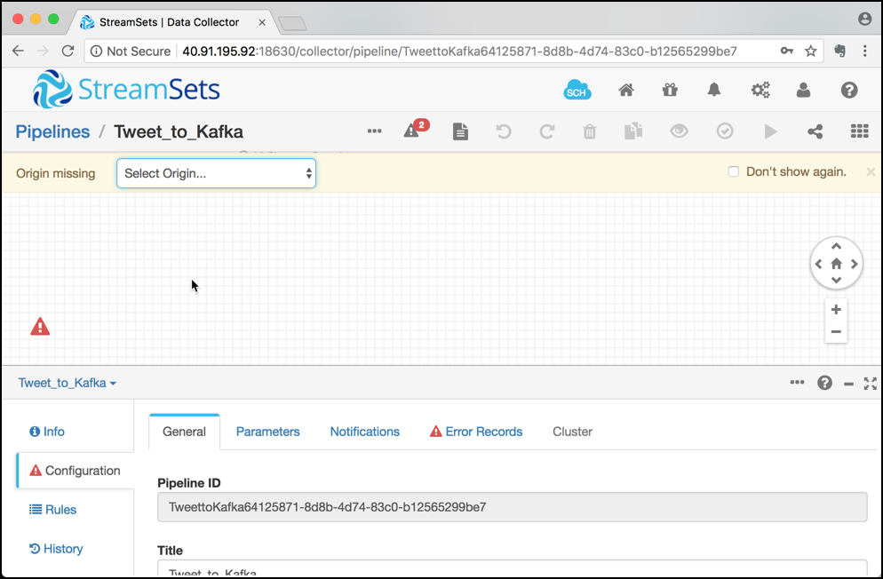
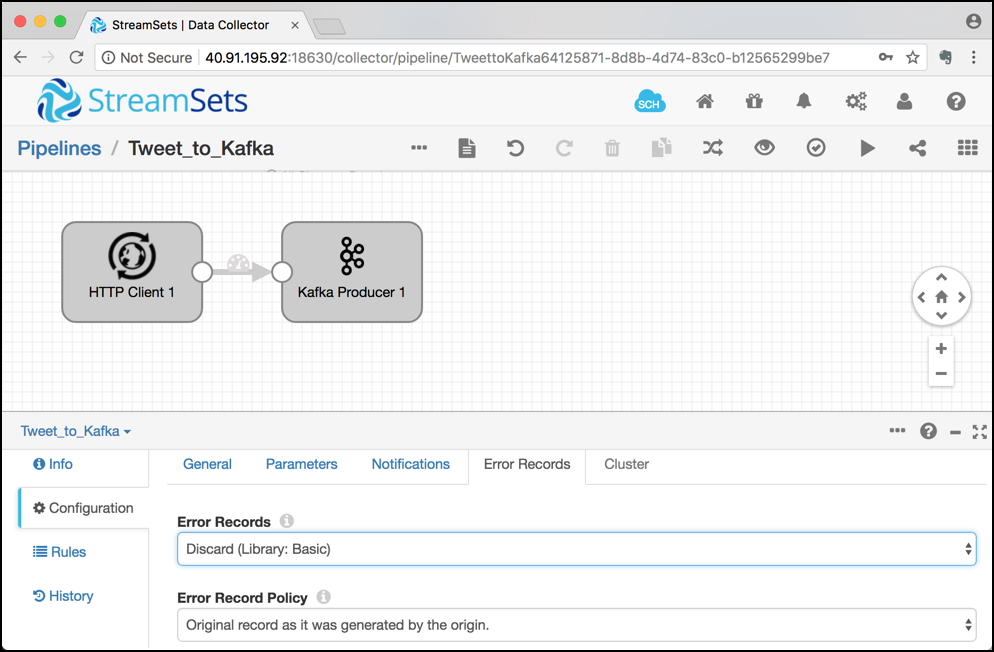
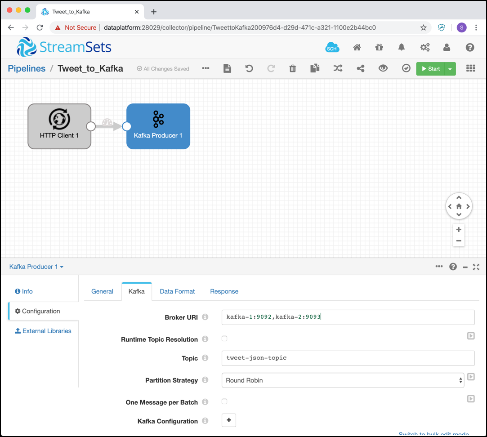
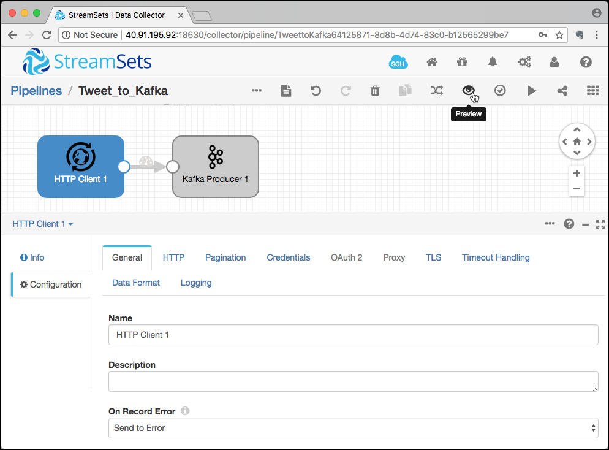

# Data Ingestion with StreamSets Data Collector

### Create a new pipeline

In a browser navigate to <http://streamingplatform:18630>. The **StreamSets Data Collector** authentication page should be shown.


Enter **admin** for username and also for the password.

On the **Get Started** screen, click on **Create New Pipeline**.


On the **New Pipeline** pop up, enter `Tweet_to_Kafka` for the **Title** field and a Description about the purpose of the new pipeline.


An empty canvas for the new pipeline is shown. 



### Design the pipeline

Select **HTTP Client - Basic** from the **Select Origin...** drop-down. 


Select **Kafka Producer - Apache Kafka 1.0.0** from the **Select Desitination to connect...** drop-down. 


The pipeline will be displayed with the Origin and Destination being connected. 


You can see by the red explanation icons, that the pipeline has errors. They first have to be fixed, otherwise we cannot run the pipeline. 

Click on the red icon on the lower left corner and select **Discard (Library: Basic)** for the **Error Records** drop-down.



### Configure the HTTP Client
Now let's configure the HTTP Client first. Click on the **HTTP Client 1** component on the canvas, it will change its colour to blue. 

Click on the **HTTP** tab and enter `https://stream.twitter.com/1.1/statuses/filter.json?track=trump` into the **Resource URL** edit field. Also change the **Authentication Type** to `OAuth`. 


Now click on **Credentials** tab and enter the values for the Twitter application into the **Consumer Key**, **Consumer Secret**, **Token** and **Token Secret**. You can find the steps for creating a new Twitter Application [here](../99-misc/99-twitter-app/README.md). 


Click on the **Data Format** tab and make sure that `JSON` is selected for the **Data Format** drop down. 
Increase the value of **Max Object Length (chars)** to `409600`.


### Configure the Kafka Producer
Now let's configure the Kafka Producer. Click on the **Kafka Producer 1** component on the canvas and select the **Kafka** tab. 

Enter `broker-1:9092,broker-2:9093` into the **Broker URI** edit field and `tweet-json-topic` into the **Topic** field.


Click on the **Data Format** tab and make sure that `JSON` is selected for the **Data Format**. 

### Create the topic in Kafka

Create the topic using the `kafka-topics` command. 

```
kafka-topics --create \
			--if-not-exists \
			--zookeeper zookeeper:2181 \
			--topic tweet-json-topic \
			--partitions 6 \
			--replication-factor 2
```

Now let's start a `kafkacat` consumer on the new topic:

```
kafkacat -b 10.0.1.4:9092 -t tweet-json-topic
```
Now let's run the pipeline. There are two ways you can run a pipeline in StreamSets, either in **Preview** mode with no/minimal side-effects or in **Execution** mode, where the pipeline runs until stopped. 
 
### Preview the pipeline
The Preview mode allows you to check your pipeline before executing it. 

Click on the **Preview** icon on the menu-bar, as shown on the following screenshot:
 


On the **Preview Configuration** pop-up window you can configure how side-effect free your preview should be (option **Write to Destinations and Executors** and **Execute pipeline lifecylce events**). Additionally you define from where the source should read the events for the preview. From **Configured Source** will use "live" data but you could also take data from a snapshot captured in an earlier run. 

Click on **Run Preview**.


The Preview mode will get the configured number of events (**Preview Batch Size** setting on previous screen) from the source or stop after the timeout (**Preview Timeout** setting on previous screen). 

You can see that the component **HTTP Client 1** is selected and you can see both the input and the output of that component below. 


You can drill-down into each record as shown below.


Preview mode will be even more helpful if a Processor component is used between an Origin and a Destination, and you will be able to view the change between the Input Data and the Output Data done by the Processor.

### Run the pipeline 
Now let's run the pipeline. Click on the Start icon in the menu bar in the top right corner. 


The pipeline should change in the **RUNNING** state and the tweets should start to show up on the kafkacat terminal. You can see the that StreamSets also switches into the monitoring view, where you can find statistics about the data flow you run (such as number of rows processed, bot successfully and error as well as throughput). 


You can drill down to each component, by just selecting one of the components. 

### Stop the pipeline 

To stop a running pipeline, click on the stop button on the top right. 