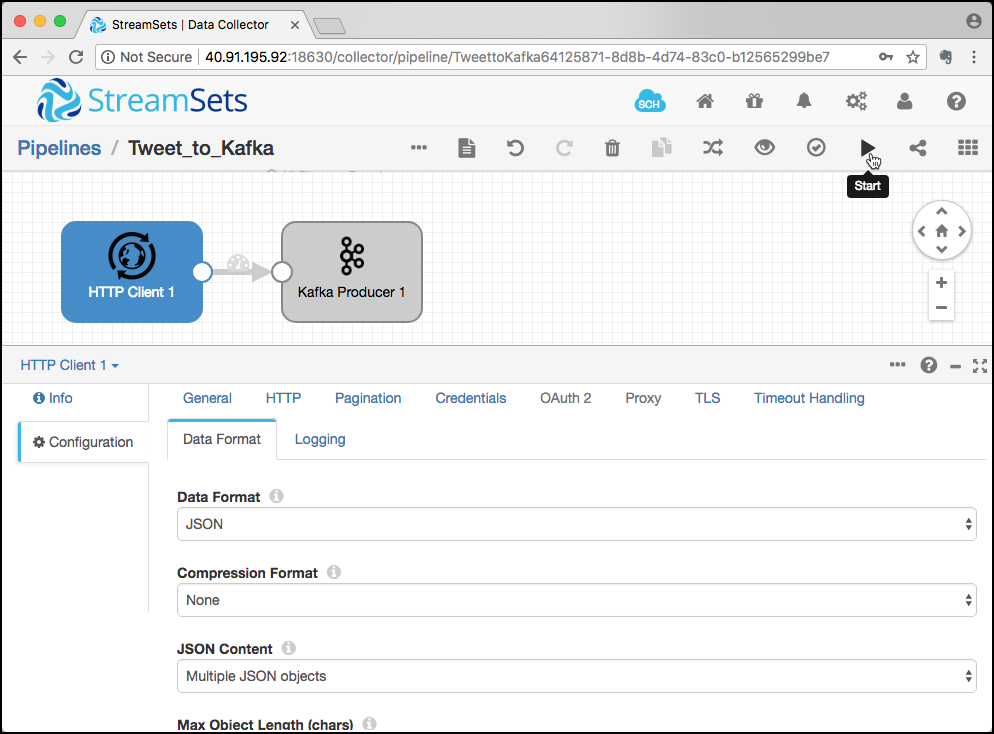
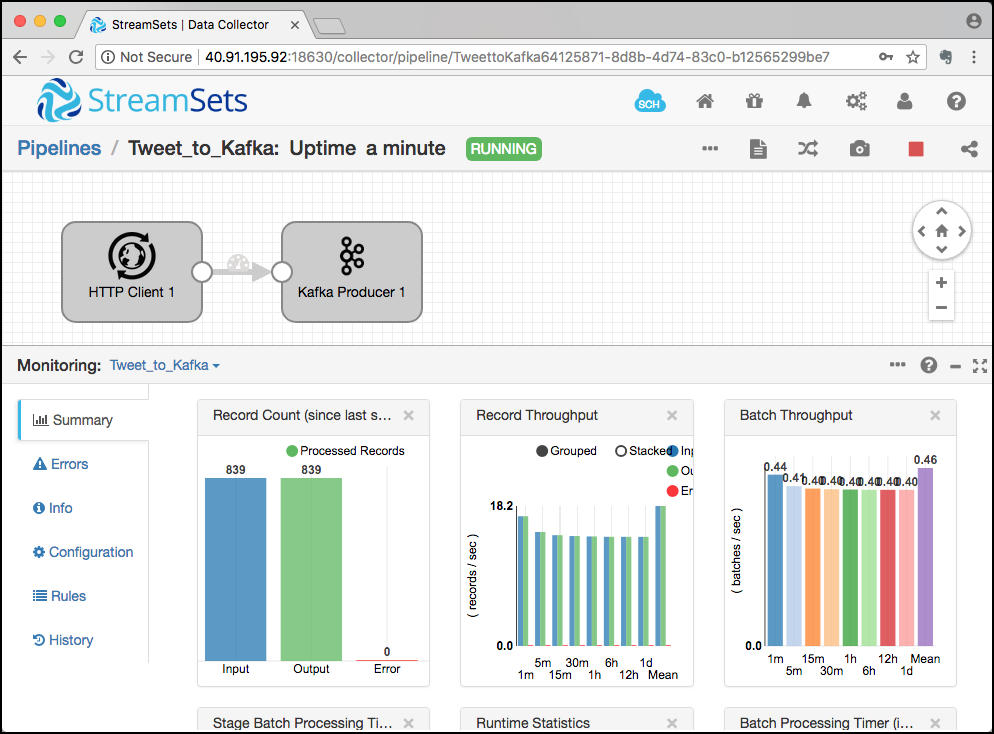

# Data Ingestion with StreamSets Data Collector

### Create a new pipeline
In a browser, navigate to <http://streamingplatform:18630>. The Streamsets authentication page should be shown.


Enter **admin** for username and also for the password.

On the **Get Started** screen, click on **Create New Pipeline**.


On the **New Pipeline** pop up, enter `Tweet_to_Kafka` for the **Title** field and a Description about the purpose of the new pipeline.


An empty canvas for the new pipeline is shown. 


### Design the pipeline

Select **HTTP Client - Basic** from the **Select Origin...** drop-down. 


Select **Kafka Producer - Apache Kafka 1.0.0** from the **Select Desitination to connect...** drop-down. 


The pipeline will be displayed with the Origin and Destination being connected. 


You can see by the red explanation icons, that the pipeline has errors. They first have to be fixed, otherwise we can not run the pipeline. 

Click on the red icon on the lower left corner and select **Discard (Library: Basic)** for the **Error Records** drop-down.


### Configure the HTTP Client
Now let's configure the HTTP Client first. Click on the **HTTP Client 1** component on the canvas, it will change its colour to blue. 

Click on the **HTTP** tab and enter `https://stream.twitter.com/1.1/statuses/filter.json?track=trump` into the **Resource URL** edit field. Also change the **Authentication Type** to `OAuth`. 


Now click on **Credentials** tab and enter the values fro the Twitter application into the **Consumer Key**, **Consumer Secret**, **Token** and **Token Secret**.


Click on the **Data Format** tab and make sure that `JSON` is selected for the **Data Format** drop down. 
Increase the value of **Max Object Length (chars)** to `409600`.


### Configure the Kafka Producer
Now let's configure the Kafka Producer. Click on the **Kafka Producer 1** component on the canvas and select the **Kafka** tab. 

Enter `broker-1:9092,broker-2:9093` into the **Broker URI** edit field and `tweet-json-topic` into the **Topic** field.


Click on the **Data Format** tab and make sure that `JSON` is selected for the **Data Format**. 

### Create the topic in Kafka

Create the topic using the `kafka-topics` command. 

```
kafka-topics --create \
			--if-not-exists \
			--zookeeper zookeeper:2181 \
			--topic tweet-json-topic \
			--partitions 6 \
			--replication-factor 2
```

Now let's start a `kafkacat` consumer on the new topic:

```
kafkacat -b 10.0.1.4:9092 -t tweet-json-topic
```

### Run the pipeline in StreamSets
Now let's run the pipeline. Click on the Start icon in the menu bar in the top right corner. 



The pipeline should change in the **RUNNING** state and the tweets should start to show up on the kafkacat terminal. You can see the that StreamSets also switches into the montioring view, where you can find statistics about the data flow you run (such as number of rows processed, bot successfullly and error as well as throughput). 


You can drill down to each component, by just selecting one of the components. 