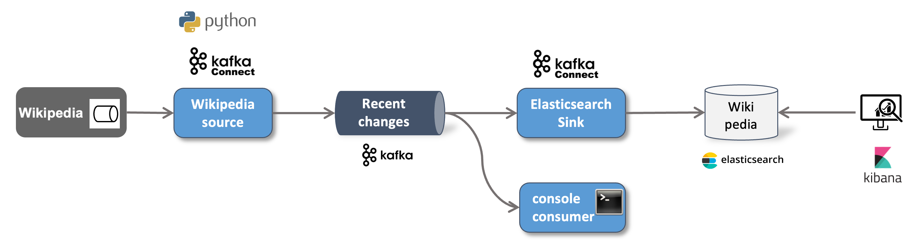

# Wikipedia Workshop 

In this workshop we will implement a streaming pipeline which gets live data from Wikipedia and sends it through a Kafka topic to an Elasticsearch database for later retrieval. The solution architecture is shown in the diagram below.

We will show the same implementation using different alternative technologies.

Wikipedia EventStreams is a web service that exposes continuous streams of structured event data. It does so over HTTP using chunked transfer encoding following the Server-Sent Events protocol (SSE). EventStreams can be consumed directly via HTTP, but is more commonly used via a client library. 

For the Ingestion part we have 2 different solutions:

* [Ingesting Wikipedia Recent Changes into Kafka using Python](../04a-wikipedia-data-ingestion-with-python/README.md)
* [Ingesting Wikipedia Recent Changes into Kafka using Kafka Connect](../04b-wikipedia-data-ingestion-with-kafka-connect/README.md)

For storing the Wikipedia events into Elasticsearch we only have one solution:

* [Storing Wikipedia Recent Changes into Elasticsearch using Kafka Connect](../04c-stream-data-integration-with-elasticsearch/README.md)
