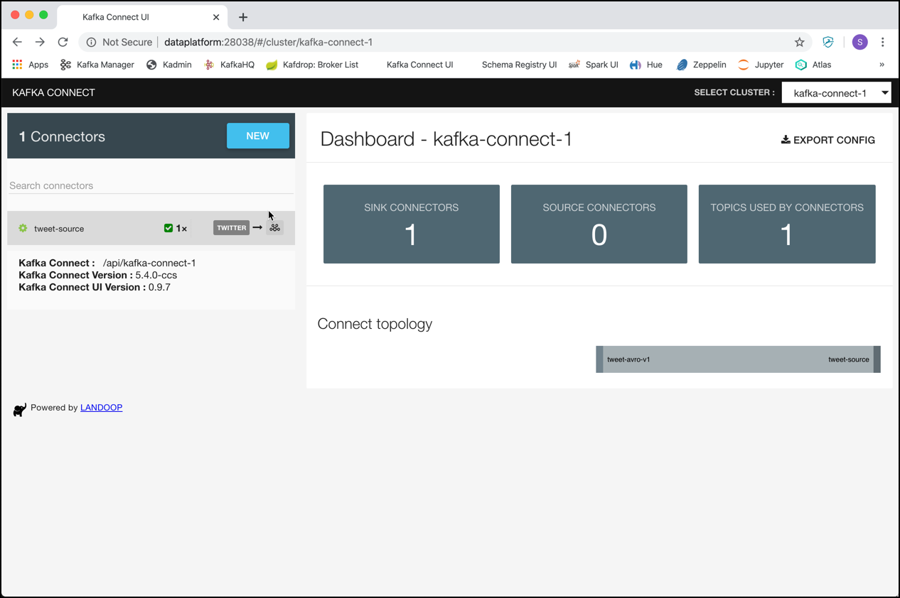
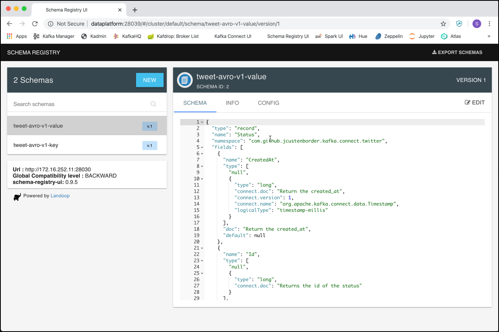

# Wikipedia Data Ingestion with Kafka Connect

In this workshop we will be using Kafka Connect to get the data from the Wikipedia Recent Changes stream into Kafka. 

Luckily, there is a [Kafka Connector](https://github.com/jcustenborder/kafka-connect-twitter) available for retrieving live Tweets. So all we have to do here is configure it and bring it to action!

There are two instances of the Kafka Connect service instance running as part of the Data Platform, `kafka-connect-1` and `kafka-connect-2`. 

## Wikipedia Kafka Connector 

The [Twitter Source Connector](https://www.confluent.io/hub/jcustenborder/kafka-connect-twitter) has already been installed as part of the setup of the platform. 

## Configure the Twitter Connector

For creating an instance of the Twitter connector you can either use a REST client or the Linux `curl` command line utility, which should be available on the Docker host. Curl is what we are going to use here. 

Create a folder `scripts` if it does not yet exists and navigate into the folder. 

```
mkdir scripts
cd scripts
```

In the `scripts` folder, create a file `start-twitter.sh` and add the code below.  

```
#!/bin/bash

echo "removing Twitter Source Connector"

curl -X "DELETE" http://dataplatform:28013/connectors/tweet-source"

echo "creating Twitter Source Connector"

curl -X "POST" http://dataplatform:8083/connectors \
  -H 'Content-Type: application/json' \
  -d '{
  "name": "wikipedia-source",
  "config": {
    "connector.class": "de.codecentric.kafka.playground.connect.source.ServerSentEventSourceConnector",
    "topic": "wikipedia-via-connect",
    "sse.uri": "https://stream.wikimedia.org/v2/stream/recentchange",
    "tasks.max": "1"
  }
}' 
```
Make sure that you replace the `oauth.xxxxx` settings with the value of your Twittter application (created [here](https://developer.twitter.com/en/apps)).

Also create a separate script `stop-twitter.sh` for just stopping the connector and add the following code:

```
#!/bin/bash

echo "removing Twitter Source Connector"

curl -X "DELETE" http://dataplatform:28013/connectors/tweet-source"
```

Make sure that the both scripts are executable

```
sudo chmod +x start-mqtt.sh
sudo chmod +x stop-mqtt.sh
```

Before we can run the pipeline, we have to create the Kafka topic.

## Create the topic in Kafka

Create the topic in Kafka, if it does not yet exist, using the `kafka-topics` command. 
```
kafka-topics --create --if-not-exists --bootstrap-server kafka-1:19092 --topic tweet-avro-v1 --partitions 8 --replication-factor 3
```

Alternatively you can also use KafkaHQ or Conduktor to create a topic. 

Now we are ready to run the Twitter Connector. 


## Start the Twitter connector

Finally let's start the connector by running the `start-twitter` script.

```
./scripts/start-twitter.sh
```

You can use [Kafka Connect UI](http://dataplatform:28038/) to check if the connector runs sucessfully.

 

The connector uses Avro for the serialization of the messages. The necessary Avro schemas (for key and for the value) are registered in the Schema Registry When starting the connector for the first time. Navigte to the [Schema Registry UI](http://dataplatform:28039/) to see these Avro schemas. 

 

## Use kafkacat to see the mssage on the console

Now let's start a `kafkacat` consumer on the new topic:

```
kafkacat -b dataplatform:9092 -t tweet-avro-v1
```

This is not very readable, as the Twitter Connector is using Avro for the serializer. But we can tell `kafkacat` to do the same for serialization, using the `-s` together with the `-r` option:

```
kafkacat -b dataplatform:9092 -t tweet-avro-v1 -s avro -r http://dataplatform:8081
```

