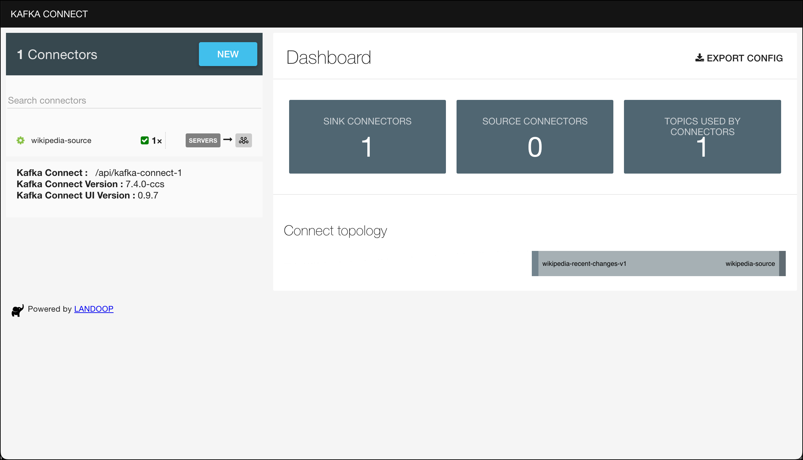

# Wikipedia Data Ingestion with Kafka Connect

In this workshop we will be using Kafka Connect to get the data from the [Wikipedia Recent Changes stream](https://wikitech.wikimedia.org/wiki/Event_Platform/EventStreams) into Kafka. 

Wikipedia EventStreams is a web service that exposes continuous streams of structured event data. It does so over HTTP using chunked transfer encoding following the Server-Sent Events protocol (SSE). 

Luckily, there is a [Kafka Connector](https://github.com/codecentric/streaming-wikipedia-with-kafka/tree/main/kafka-playground-connect) available for retrieving live Wikipedia Recent Changes. But it is not available as a downloadable resource from [Confluent Hub](https://www.confluent.io/hub/), so we have to build it first and provide it as a Java archive to Kafka connect. This has been done in the setup of the Dataplatform. 

So all we have to do here is configure it and bring it to action!

There is another option using the Kafka Connect SSE Connector which we will use in Workshop [04c - Wikipedia Data Ingestion with Kafka Connect SSE Connector](../04c-wikipedia-data-ingestion-with-kafka-connect-sse/README.md).

## Kafka Connect Cluster

There is one instance of the Kafka Connect service running as part of the Data Platform called `kafka-connect-1`. 

You can use the Kafka Connect UI (<http://dataplatform:28103>) to view and work with the connector instances running on the Kafka connect cluster.

## Wikipedia Kafka Connector 

The [Wikipedia Source Connector](https://github.com/codecentric/streaming-wikipedia-with-kafka/tree/main/kafka-playground-connect) has already been installed as part of the setup of the platform. 

### Configure the Wikipedia Connector

For creating an instance of the Wikipedia connector you can either use a REST client or the Linux `curl` command line utility, which should be available on the Docker host. Curl is what we are going to use here. 

Create a folder `scripts` if it does not yet exists and navigate into the folder. 

```
mkdir scripts
cd scripts
```

In the `scripts` folder, create a file `start-wikipedia.sh` and add the code below.  

```bash
#!/bin/bash

echo "removing Wikipedia Source Connector"

curl -X "DELETE" http://dataplatform:8083/connectors/wikipedia-source

echo "creating Wikipedia Source Connector"

curl -X "POST" http://dataplatform:8083/connectors \
  -H 'Content-Type: application/json' \
  -d '{
  "name": "wikipedia-source",
  "config": {
    "connector.class": "de.codecentric.kafka.playground.connect.source.ServerSentEventSourceConnector",
    "topic": "wikipedia-recent-changes-v1",
    "sse.uri": "https://stream.wikimedia.org/v2/stream/recentchange",
    "tasks.max": "1"
  }
}' 
```

Also create a separate script `stop-wikipedia.sh` for just stopping the connector and add the following code:

```
#!/bin/bash

echo "removing Wikipedia Source Connector"

curl -X "DELETE" http://dataplatform:8083/connectors/wikipedia-source
```

Make sure that the both scripts are executable

```
sudo chmod +x start-wikipedia.sh
sudo chmod +x stop-wikipedia.sh
```

Before we can run the pipeline, we have to create the Kafka topic.

### Create the topic in Kafka

Create the topic in Kafka, if it does not yet exist, using the `kafka-topics` command. 

```bash
docker exec -ti kafka-1 kafka-topics --create --if-not-exists --bootstrap-server kafka-1:19092 --topic wikipedia-recent-changes-v1 --partitions 8 --replication-factor 3
```

Alternatively you can also use AKHQ to create a topic. 

Now we are ready to run the Wikipedia Connector. 

### Start the Wikipedia connector

Finally let's start the connector by running the `start-wikipedia` script.

```bash
./scripts/start-wikipedia.sh
```

You can use [Kafka Connect UI](http://dataplatform:28038/) to check if the connector runs successfully.

 

### Use kafkacat to show the messages on the console

Now let's start a `kafkacat` consumer on the new topic:

```bash
docker exec -ti kcat kcat -b kafka-1:19092 -t wikipedia-recent-changes-v1
```


