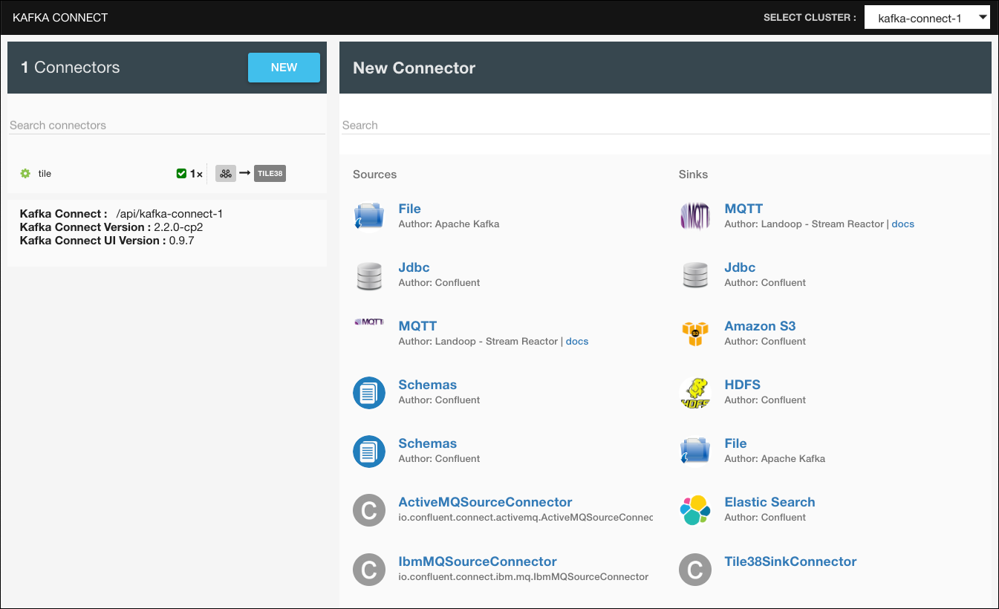
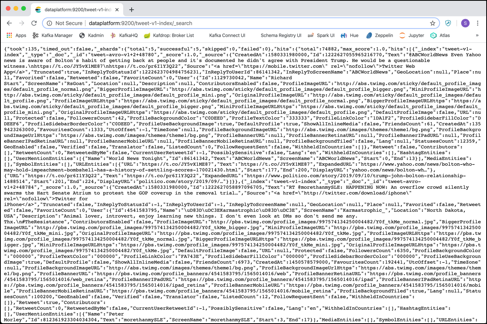
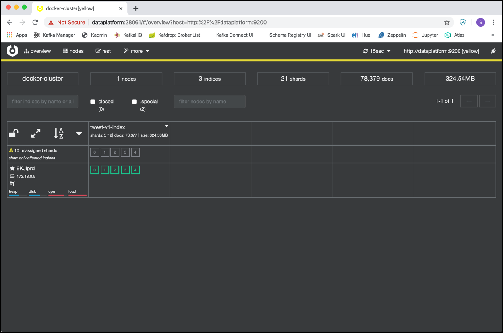

# Storing Tweets into Elasticsearch using Kafka Connect

In this workshop we will see how we can use Kafka Connect to move data from a Kafka topic to an [Elasticserach NoSQL datastore](https://www.elastic.co/products/elastic-stack). 

We will implement it using Kafka Connect and use Kibana for the visualization of the data. 

In order to do this workshop, you will have to first finish [Data Ingestion with Kafka Connect](../04c-twitter-data-ingestion-with-kafka-connect/README.md). This workshop will only work with the Kafka Connect solution on the input side, and not with the NiFi and/or StreamSets solution. 

## Configure the Elasticsearch Connector

The connector in Kafka Connect to work with Elasticsearch is the [Confluent Eleasticserach Sink Connector for Confluent Platform](https://docs.confluent.io/current/connect/kafka-connect-elasticsearch/index.html). 

It is part of the Confluent Platform and pre-loaded with the Kafka cluster. We can easily test that using the REST API 

```
curl -X "GET" "$DOCKER_HOST_IP:8083/connectors" -H "Content-Type: application/json" -H "Accept: application/json"
```

or use the [Kafka Connect UI](http://dataplatform:28001/#/cluster/kafka-connect-1). If you click on **New** then on the page you should see the 

 

You can see the **Elastic Search** Sink connector, ready to be used. 

So all we have to do is create a script with the REST call to setup the connector. 

You can either create an instance throught the Kafka Connect UI by clicking on **New** or by using the REST API of Kafka Connect. For this workshop we will use the REST API.

In the `scripts` folder, create a file `start-elasticsearch.sh` and add the code below.  

```
#!/bin/bash

echo "removing Elasticsearch Sink Connector"

curl -X "DELETE" http://dataplatform:28013/connectors/elasticsearch-sink

echo "creating Elasticsearch Sink Connector"

curl -X PUT \
  http://dataplatform:28013/connectors/elasticsearch-sink/config \
  -H 'Content-Type: application/json' \
  -H 'Accept: application/json' \
  -d '{
  "connector.class": "io.confluent.connect.elasticsearch.ElasticsearchSinkConnector",
  "type.name": "_doc",
  "tasks.max": "1",
  "topics": "tweet-avro-v1",
  "topic.index.map": "tweet-avro-v1:tweet-v1-index",
  "connection.url": "http://elasticsearch:9200",
  "key.ignore": "true",
  "key.converter": "org.apache.kafka.connect.storage.StringConverter",
  "schema.ignore": "false"
}'
```

We configure the connector to read the topic `tweet-avro-v1` and write messages to the Elasticserach datastore. 

Also create a separate script `stop-elasticsearch.sh` for just stopping the connector and add the following code:

```
#!/bin/bash

echo "removing Elasticsearch Sink Connector"

curl -X "DELETE" http://dataplatform:28013/connectors/elasticsearch-sink
```

Make sure that the both scripts are executable

```
sudo chmod +x start-elasticsearch.sh
sudo chmod +x stop-elasticsearch.sh
```

## Start the Elasticsearch connector

Finally let's start the connector by running the `start-elasticsearch` script.

```
./scripts/start-elasticsearch.sh
```

The connector will consume the Avro serialized messages, automtically create an Elasticsearch Index, register the Index Mapping, which is based on the Avro schema and stores the tweets as documents into the Elasticsearch datastore.

We can see that documents have been added by navigating to the Elasticsearch API in a broser to <http://dataplatform:9200/tweet-v1-index/_search>:

 

We can see the first few documents which are stored by Elasticserach, in a not very user-friendly way, Elasticsearch API returns the data as JSON and this would be the interface you use to integrate with a custom application. Later we will use Kibana, a nice UI for working with Elasticsearch. 

### Elasticsearch Mapping

You can check the index and the registered mapping by navigating to the [Cerebro Elasticsearch UI](http://dataplatform:28061/). On the Connect page enter `http://dataplatform:9200` into the **Node address** field and click on **Connect**. The **Overview** page is shown, where you can find the newly created index `tweet-v1-index`:

 

Click on the drop-down arrow on the index name and from the drop-down menue select **show mappings**.

 

The mapping describes how a document, and the fields it contains, are stored and indexed in Elsticsearch. For instance it defines which string fields should be treated as full text fields, which fields contain numbers or dates and the format of date values. 
It has been created based on the Avro Schema for the Twitter message.

The generated mapping is very usable, but there is a problem with the mapping of the `CreatedAt` property:
 
```
{ - 
  "tweet-v1-index": { - 
    "mappings": { - 
      "_doc": { - 
        "properties": { - 
          "CreatedAt": { - 
            "type": "long"
          },
```

It is mapped as a long, because the Avro serializes the timestap into a long field. But for Elasticsearch and specifically the visualization through Kibana it is important to have a date field. Therefore we have to manually adapt the mapping to specify the `CreatedAt` field to be a field of type `date`.

We cannot change the mapping of an existing index. Therefore we have to stop the Elasticsearch connector and drop the index and then create the mapping manually before adding documents. 

So first stop the connector

```
./scripts/stop-elasticsearch.sh
```

Remove the Elasicserach index using the following REST API call:

```
curl -X "DELETE" http://dataplatform:9200/tweet-v1-index
```

Alternatively you can also delete the index using the Cerebro UI. 

Now create the new index with the mapping using the following REST API call:

```
curl -XPUT 'http://dataplatform:9200/tweet-raw-v1-index' -H 'Content-Type: application/json' -d '{
 "mappings": {
  "tweets": {
   "properties": {
    "CreatedAt": {
     "type": "date"
    },
    "CurrentUserRetweetId": {
     "type": "long"
    },
    "FavoriteCount": {
     "type": "long"
    },
    "Favorited": {
     "type": "boolean"
    },
    "HashtagEntities": {
     "properties": {
      "End": {
       "type": "long"
      },
      "Start": {
       "type": "long"
      },
      "Text": {
       "type": "text",
       "fields": {
        "keyword": {
         "type": "keyword",
         "ignore_above": 256
        }
       }
      }
     }
    },
    "Id": {
     "type": "long"
    },
    "InReplyToScreenName": {
     "type": "text",
     "fields": {
      "keyword": {
       "type": "keyword",
       "ignore_above": 256
      }
     }
    },
    "InReplyToStatusId": {
     "type": "long"
    },
    "InReplyToUserId": {
     "type": "long"
    },
    "Lang": {
     "type": "text",
     "fields": {
      "keyword": {
       "type": "keyword",
       "ignore_above": 256
      }
     }
    },
    "MediaEntities": {
     "properties": {
      "DisplayURL": {
       "type": "text",
       "fields": {
        "keyword": {
         "type": "keyword",
         "ignore_above": 256
        }
       }
      },
      "End": {
       "type": "long"
      },
      "ExpandedURL": {
       "type": "text",
       "fields": {
        "keyword": {
         "type": "keyword",
         "ignore_above": 256
        }
       }
      },
      "Id": {
       "type": "long"
      },
      "MediaURL": {
       "type": "text",
       "fields": {
        "keyword": {
         "type": "keyword",
         "ignore_above": 256
        }
       }
      },
      "MediaURLHttps": {
       "type": "text",
       "fields": {
        "keyword": {
         "type": "keyword",
         "ignore_above": 256
        }
       }
      },
      "Sizes": {
       "properties": {
        "key": {
         "type": "long"
        },
        "value": {
         "properties": {
          "Height": {
           "type": "long"
          },
          "Resize": {
           "type": "long"
          },
          "Width": {
           "type": "long"
          }
         }
        }
       }
      },
      "Start": {
       "type": "long"
      },
      "Text": {
       "type": "text",
       "fields": {
        "keyword": {
         "type": "keyword",
         "ignore_above": 256
        }
       }
      },
      "Type": {
       "type": "text",
       "fields": {
        "keyword": {
         "type": "keyword",
         "ignore_above": 256
        }
       }
      },
      "URL": {
       "type": "text",
       "fields": {
        "keyword": {
         "type": "keyword",
         "ignore_above": 256
        }
       }
      },
      "VideoAspectRatioHeight": {
       "type": "long"
      },
      "VideoAspectRatioWidth": {
       "type": "long"
      },
      "VideoDurationMillis": {
       "type": "long"
      },
      "VideoVariants": {
       "properties": {
        "Bitrate": {
         "type": "long"
        },
        "ContentType": {
         "type": "text",
         "fields": {
          "keyword": {
           "type": "keyword",
           "ignore_above": 256
          }
         }
        },
        "Url": {
         "type": "text",
         "fields": {
          "keyword": {
           "type": "keyword",
           "ignore_above": 256
          }
         }
        }
       }
      }
     }
    },
    "Place": {
     "properties": {
      "Country": {
       "type": "text",
       "fields": {
        "keyword": {
         "type": "keyword",
         "ignore_above": 256
        }
       }
      },
      "CountryCode": {
       "type": "text",
       "fields": {
        "keyword": {
         "type": "keyword",
         "ignore_above": 256
        }
       }
      },
      "FullName": {
       "type": "text",
       "fields": {
        "keyword": {
         "type": "keyword",
         "ignore_above": 256
        }
       }
      },
      "Id": {
       "type": "text",
       "fields": {
        "keyword": {
         "type": "keyword",
         "ignore_above": 256
        }
       }
      },
      "Name": {
       "type": "text",
       "fields": {
        "keyword": {
         "type": "keyword",
         "ignore_above": 256
        }
       }
      },
      "PlaceType": {
       "type": "text",
       "fields": {
        "keyword": {
         "type": "keyword",
         "ignore_above": 256
        }
       }
      },
      "URL": {
       "type": "text",
       "fields": {
        "keyword": {
         "type": "keyword",
         "ignore_above": 256
        }
       }
      }
     }
    },
    "PossiblySensitive": {
     "type": "boolean"
    },
    "Retweet": {
     "type": "boolean"
    },
    "RetweetCount": {
     "type": "long"
    },
    "Retweeted": {
     "type": "boolean"
    },
    "RetweetedByMe": {
     "type": "boolean"
    },
    "Source": {
     "type": "text",
     "fields": {
      "keyword": {
       "type": "keyword",
       "ignore_above": 256
      }
     }
    },
    "SymbolEntities": {
     "properties": {
      "End": {
       "type": "long"
      },
      "Start": {
       "type": "long"
      },
      "Text": {
       "type": "text",
       "fields": {
        "keyword": {
         "type": "keyword",
         "ignore_above": 256
        }
       }
      }
     }
    },
    "Text": {
     "type": "text",
     "fields": {
      "keyword": {
       "type": "text"
      }
     }
    },
    "Truncated": {
     "type": "boolean"
    },
    "URLEntities": {
     "properties": {
      "DisplayURL": {
       "type": "text",
       "fields": {
        "keyword": {
         "type": "keyword",
         "ignore_above": 256
        }
       }
      },
      "End": {
       "type": "long"
      },
      "ExpandedURL": {
       "type": "text",
       "fields": {
        "keyword": {
         "type": "keyword",
         "ignore_above": 256
        }
       }
      },
      "Start": {
       "type": "long"
      },
      "Text": {
       "type": "text",
       "fields": {
        "keyword": {
         "type": "keyword",
         "ignore_above": 256
        }
       }
      },
      "URL": {
       "type": "text",
       "fields": {
        "keyword": {
         "type": "keyword",
         "ignore_above": 256
        }
       }
      }
     }
    },
    "User": {
     "properties": {
      "BiggerProfileImageURL": {
       "type": "text",
       "fields": {
        "keyword": {
         "type": "keyword",
         "ignore_above": 256
        }
       }
      },
      "BiggerProfileImageURLHttps": {
       "type": "text",
       "fields": {
        "keyword": {
         "type": "keyword",
         "ignore_above": 256
        }
       }
      },
      "ContributorsEnabled": {
       "type": "boolean"
      },
      "CreatedAt": {
       "type": "long"
      },
      "DefaultProfile": {
       "type": "boolean"
      },
      "DefaultProfileImage": {
       "type": "boolean"
      },
      "Description": {
       "type": "text",
       "fields": {
        "keyword": {
         "type": "keyword",
         "ignore_above": 256
        }
       }
      },
      "FavouritesCount": {
       "type": "long"
      },
      "FollowRequestSent": {
       "type": "boolean"
      },
      "FollowersCount": {
       "type": "long"
      },
      "FriendsCount": {
       "type": "long"
      },
      "GeoEnabled": {
       "type": "boolean"
      },
      "Id": {
       "type": "long"
      },
      "ListedCount": {
       "type": "long"
      },
      "Location": {
       "type": "text",
       "fields": {
        "keyword": {
         "type": "keyword",
         "ignore_above": 256
        }
       }
      },
      "MiniProfileImageURL": {
       "type": "text",
       "fields": {
        "keyword": {
         "type": "keyword",
         "ignore_above": 256
        }
       }
      },
      "MiniProfileImageURLHttps": {
       "type": "text",
       "fields": {
        "keyword": {
         "type": "keyword",
         "ignore_above": 256
        }
       }
      },
      "Name": {
       "type": "text",
       "fields": {
        "keyword": {
         "type": "keyword",
         "ignore_above": 256
        }
       }
      },
      "OriginalProfileImageURL": {
       "type": "text",
       "fields": {
        "keyword": {
         "type": "keyword",
         "ignore_above": 256
        }
       }
      },
      "OriginalProfileImageURLHttps": {
       "type": "text",
       "fields": {
        "keyword": {
         "type": "keyword",
         "ignore_above": 256
        }
       }
      },
      "ProfileBackgroundColor": {
       "type": "text",
       "fields": {
        "keyword": {
         "type": "keyword",
         "ignore_above": 256
        }
       }
      },
      "ProfileBackgroundImageURL": {
       "type": "text",
       "fields": {
        "keyword": {
         "type": "keyword",
         "ignore_above": 256
        }
       }
      },
      "ProfileBackgroundImageUrlHttps": {
       "type": "text",
       "fields": {
        "keyword": {
         "type": "keyword",
         "ignore_above": 256
        }
       }
      },
      "ProfileBackgroundTiled": {
       "type": "boolean"
      },
      "ProfileBannerIPadRetinaURL": {
       "type": "text",
       "fields": {
        "keyword": {
         "type": "keyword",
         "ignore_above": 256
        }
       }
      },
      "ProfileBannerIPadURL": {
       "type": "text",
       "fields": {
        "keyword": {
         "type": "keyword",
         "ignore_above": 256
        }
       }
      },
      "ProfileBannerMobileRetinaURL": {
       "type": "text",
       "fields": {
        "keyword": {
         "type": "keyword",
         "ignore_above": 256
        }
       }
      },
      "ProfileBannerMobileURL": {
       "type": "text",
       "fields": {
        "keyword": {
         "type": "keyword",
         "ignore_above": 256
        }
       }
      },
      "ProfileBannerRetinaURL": {
       "type": "text",
       "fields": {
        "keyword": {
         "type": "keyword",
         "ignore_above": 256
        }
       }
      },
      "ProfileBannerURL": {
       "type": "text",
       "fields": {
        "keyword": {
         "type": "keyword",
         "ignore_above": 256
        }
       }
      },
      "ProfileImageURL": {
       "type": "text",
       "fields": {
        "keyword": {
         "type": "keyword",
         "ignore_above": 256
        }
       }
      },
      "ProfileImageURLHttps": {
       "type": "text",
       "fields": {
        "keyword": {
         "type": "keyword",
         "ignore_above": 256
        }
       }
      },
      "ProfileLinkColor": {
       "type": "text",
       "fields": {
        "keyword": {
         "type": "keyword",
         "ignore_above": 256
        }
       }
      },
      "ProfileSidebarBorderColor": {
       "type": "text",
       "fields": {
        "keyword": {
         "type": "keyword",
         "ignore_above": 256
        }
       }
      },
      "ProfileSidebarFillColor": {
       "type": "text",
       "fields": {
        "keyword": {
         "type": "keyword",
         "ignore_above": 256
        }
       }
      },
      "ProfileTextColor": {
       "type": "text",
       "fields": {
        "keyword": {
         "type": "keyword",
         "ignore_above": 256
        }
       }
      },
      "ProfileUseBackgroundImage": {
       "type": "boolean"
      },
      "Protected": {
       "type": "boolean"
      },
      "ScreenName": {
       "type": "text",
       "fields": {
        "keyword": {
         "type": "keyword",
         "ignore_above": 256
        }
       }
      },
      "ShowAllInlineMedia": {
       "type": "boolean"
      },
      "StatusesCount": {
       "type": "long"
      },
      "Translator": {
       "type": "boolean"
      },
      "URL": {
       "type": "text",
       "fields": {
        "keyword": {
         "type": "keyword",
         "ignore_above": 256
        }
       }
      },
      "UtcOffset": {
       "type": "long"
      },
      "Verified": {
       "type": "boolean"
      }
     }
    },
    "UserMentionEntities": {
     "properties": {
      "End": {
       "type": "long"
      },
      "Id": {
       "type": "long"
      },
      "Name": {
       "type": "text",
       "fields": {
        "keyword": {
         "type": "keyword",
         "ignore_above": 256
        }
       }
      },
      "ScreenName": {
       "type": "text",
       "fields": {
        "keyword": {
         "type": "keyword",
         "ignore_above": 256
        }
       }
      },
      "Start": {
       "type": "long"
      },
      "Text": {
       "type": "text",
       "fields": {
        "keyword": {
         "type": "keyword",
         "ignore_above": 256
        }
       }
      }
     }
    },
    "WithheldInCountries": {
     "type": "text",
     "fields": {
      "keyword": {
       "type": "keyword",
       "ignore_above": 256
      }
     }
    }
   }
  }
 }
}'
```

With the new index in place, restart the Elasticsearch connector using the `start-elasticsearch.sh` script:

```
./scripts/start-elasticsearch.sh
```

Now with the data propertly indexed, let's see how we can visualize it using Kibana.

## Visualize Tweets using Kibana

[Kibana](https://www.elastic.co/kibana) is part of the so called [ELK-Stack](https://www.elastic.co/elastic-stack) and can be used to visualize the data stored in Elasticsearch. 

In a browser, naviate to <http://dataplatform:28006>:

 

Click on the link **Connect to your Elasticsearch index** just below **Use Elasticsearch data**. The **Create Index Pattern** page is shown where you can create a index pattern. 

Enter `tweet-v1-index*` into the **Index pattern** field and you should see the **Sucess! Your index pattern matches 1 index**:

 

Click **> Next step** to navigate to the 2nd step of the index pattern. Here can specify the field name for the time filter. Select `CreatedAt` from the drop-down list

and click on **Create index pattern**.

 

The index pattern has been registered in Kibana and the index is marked as the default.

 
 
On the left side menu, click on **Discover** to navigate to the **Discover** screen.
 

 
 
[Discover](https://www.elastic.co/guide/en/kibana/current/discover.html) enables you to explore your data, find hidden insights and relationships, and get answers to your questions.


