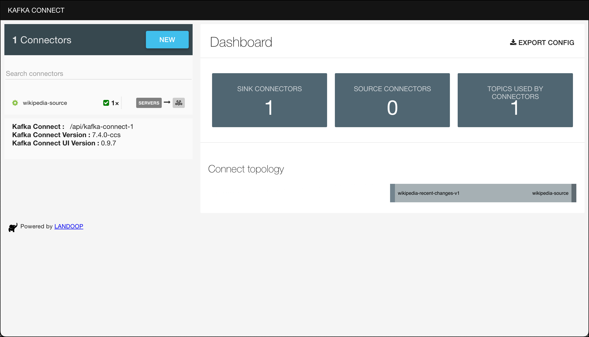
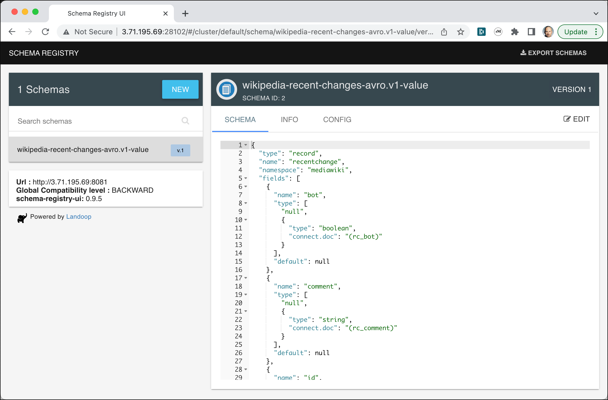

# Wikipedia Data Ingestion with Kafka Connect SSE Connector

In this workshop we will be using Kafka Connect to get the data from the [Wikipedia Recent Changes stream](https://wikitech.wikimedia.org/wiki/Event_Platform/EventStreams) into Kafka. Wikipedia EventStreams is a web service that exposes continuous streams of structured event data. It does so over HTTP using chunked transfer encoding following the Server-Sent Events protocol (SSE). 

In this workshop we are going to use the [Kafka Connector](https://www.confluent.io/hub/cjmatta/kafka-connect-sse) available for retrieving Server Sent Events (SSE). It is available from confluent hub and therefore downloadable using the `confluent-hub install` command. This has been done when bootstrapping the Data Platform. 

So all we have to do here is configure it and bring it to action!

## Kafka Connect Cluster

There is one instance of the Kafka Connect service running as part of the Data Platform called `kafka-connect-1`. 

You can use the Kafka Connect UI (<http://dataplatform:28103>) to view and work with the connector instances running on the Kafka connect cluster.

## Wikipedia Kafka Connector 

The [Server Sent Events Source Connector](com.github.cjmatta.kafka.connect.sse.ServerSentEventsSourceConnector) has already been installed as part of the setup of the platform. 

### Configure the Wikipedia Connector

For creating an instance of the Wikipedia connector you can either use a REST client or the Linux `curl` command line utility, which should be available on the Docker host. Curl is what we are going to use here. 

Create a folder `scripts` if it does not yet exists and navigate into the folder. 

```
mkdir scripts
cd scripts
```

In the `scripts` folder, create a file `start-wikipedia.sh` and add the code below.  

```bash
#!/bin/bash

echo "removing Wikipedia Source Connector"

curl -X "DELETE" http://dataplatform:8083/connectors/wikipedia-source

echo "creating Wikipedia Source Connector"

curl -X "POST" http://dataplatform:8083/connectors \
  -H 'Content-Type: application/json' \
  -d '{
  "name": "wikipedia-source",
  "config": {
    "connector.class": "com.github.cjmatta.kafka.connect.sse.ServerSentEventsSourceConnector",
    "tasks.max": "1",
    "sse.uri": "https://stream.wikimedia.org/v2/stream/recentchange",
    "topic": "wikipedia-recent-changes-avro.v1",
    "transforms": "extractData, fromJson",
    "transforms.extractData.type": "org.apache.kafka.connect.transforms.ExtractField$Value", 
    "transforms.extractData.field": "data",
    "transforms.fromJson.type": "com.github.jcustenborder.kafka.connect.json.FromJson$Value",
    "transforms.fromJson.json.exclude.locations": "#/properties/server_script_path,#/properties/log_params,#/properties/log_action,#/properties/log_action_comment,#/properties/log_id,#/properties/log_type,#/properties/$schema,#/$schema",
    "transforms.fromJson.json.schema.url": "https://raw.githubusercontent.com/wikimedia/mediawiki-event-schemas/master/jsonschema/mediawiki/recentchange/1.0.0.json",
    "transforms.fromJson.schema.validation.enabled": "false",
    "value.converter.schemas.enable": "true",
    "value.converter": "io.confluent.connect.avro.AvroConverter",
    "value.converter.schema.registry.url": "http://schema-registry-1:8081"
  }
}' 
```

Also create a separate script `stop-wikipedia.sh` for just stopping the connector and add the following code:

```
#!/bin/bash

echo "removing Wikipedia Source Connector"

curl -X "DELETE" http://dataplatform:8083/connectors/wikipedia-source
```

Make sure that the both scripts are executable

```
sudo chmod +x start-wikipedia.sh
sudo chmod +x stop-wikipedia.sh
```

Before we can run the pipeline, we have to create the Kafka topic.

### Create the topic in Kafka

Create the topic in Kafka, if it does not yet exist, using the `kafka-topics` command. 

```bash
docker exec -ti kafka-1 kafka-topics --create --if-not-exists --bootstrap-server kafka-1:19092 --topic wikipedia-recent-changes-avro.v1 --partitions 8 --replication-factor 3
```

Alternatively you can also use AKHQ to create a topic. 

Now we are ready to run the Wikipedia Connector. 

### Start the Wikipedia connector

Finally let's start the connector by running the `start-wikipedia` script.

```bash
./scripts/start-wikipedia.sh
```

You can use [Kafka Connect UI](http://dataplatform:28038/) to check if the connector runs sucessfully.

 

The connector uses Avro for the serialization of the messages. The necessary Avro schemas (for key and for the value) are registered in the Schema Registry When starting the connector for the first time. Navigte to the [Schema Registry UI](http://dataplatform:28102) to see these Avro schemas. 

 

### Use kafkacat to show the messages on the console

Now let's start a `kafkacat` consumer on the new topic:

```bash
docker exec -ti kcat kcat -b kafka-1:19092 -t wikipedia-recent-changes-avro.v1
```

This is not very readable, as the ServerSentEventsSourceConnector is using Avro for the serializer. But we can tell `kcat` to do the same for serialization, using the `-s` together with the `-r` option:

```
docker exec -ti kcat kcat -b kafka-1:19092 -t wikipedia-recent-changes-avro.v1 -s avro -r http://schema-registry-1:8081
```

we can see that a [Wikipedia Recent Change](https://stream.wikimedia.org/?doc#/) message looks as follows:

```json
{
  "bot": false,
  "comment": "[[:File:Mr. Duck.jpg]] added to category",
  "id": 2229019642,
  "meta": {
    "domain": "commons.wikimedia.org",
    "dt": "2023-06-25T09:16:47Z",
    "id": "a3ebfdac-df9b-4239-a22e-f46623e84b4e",
    "request_id": "d9c1fcd4-0424-4cd5-b8c4-d62d9f60d2f6",
    "stream": "mediawiki.recentchange",
    "uri": "https://commons.wikimedia.org/wiki/Category:Images_from_Wiki_Loves_Earth_missing_SDC_participant_in"
  },
  "namespace": 14,
  "parsedcomment": "<a href=\"/wiki/File:Mr._Duck.jpg\" title=\"File:Mr. Duck.jpg\">File:Mr. Duck.jpg</a> added to category",
  "server_name": "commons.wikimedia.org",
  "server_url": "https://commons.wikimedia.org",
  "timestamp": 1687684607,
  "title": "Category:Images from Wiki Loves Earth missing SDC participant in",
  "type": "categorize",
  "user": "Vanja Kovac",
  "wiki": "commonswiki"
}
```
