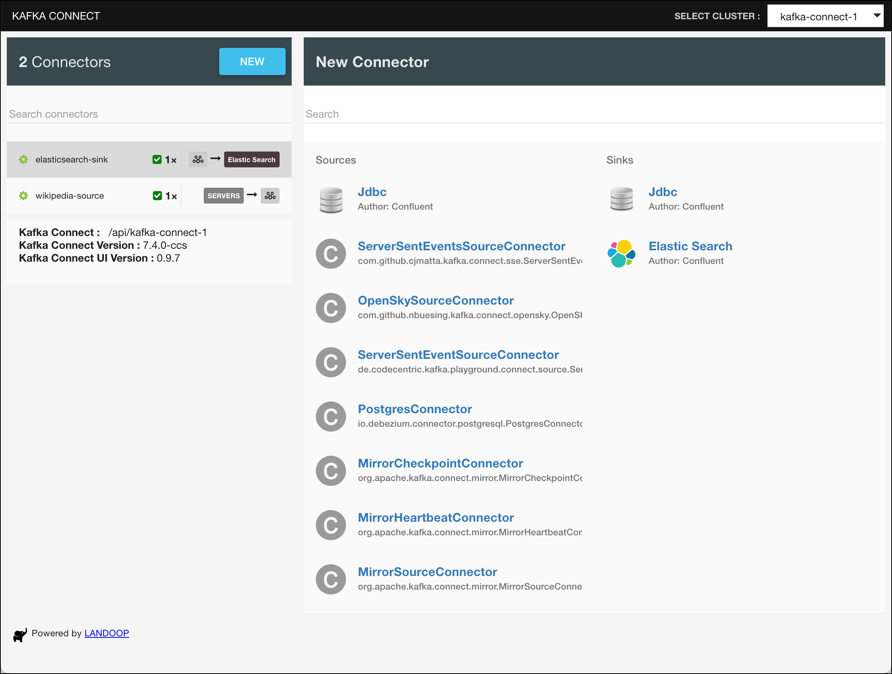
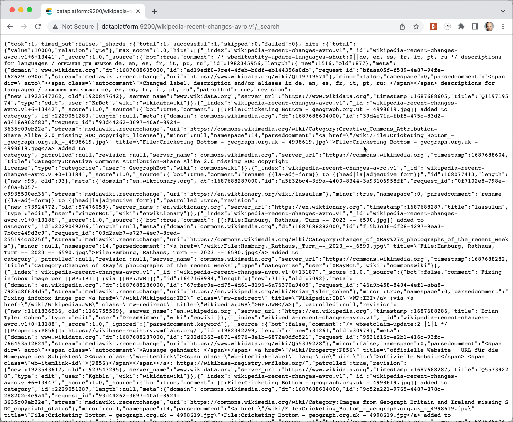
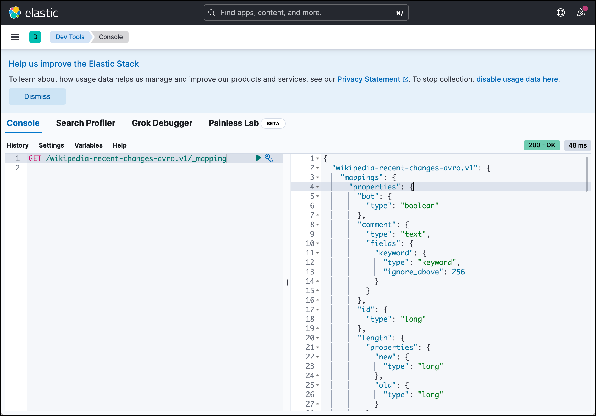

# Storing Wikipedia Recent Changes into Elasticsearch using Kafka Connect

In this workshop we will see how we can use Kafka Connect to move data from a Kafka topic to an [Elasticsearch NoSQL datastore](https://www.elastic.co/products/elastic-stack). 

We will implement it using Kafka Connect and use Kibana for the visualization of the data. 

In order to do this workshop, you will have to first finish [Data Ingestion with Kafka Connect](../04c-wikipedia-data-ingestion-with-kafka-connect-sse/README.md). 

This workshop will only work with the Kafka Connect solution over the SSE connector. 

The messages in Kafka which we want to store in Elasticsearch look like the following example:

```json
{
  "bot": false,
  "comment": "[[:File:Mr. Duck.jpg]] added to category",
  "id": 2229019642,
  "meta": {
    "domain": "commons.wikimedia.org",
    "dt": "2023-06-25T09:16:47Z",
    "id": "a3ebfdac-df9b-4239-a22e-f46623e84b4e",
    "request_id": "d9c1fcd4-0424-4cd5-b8c4-d62d9f60d2f6",
    "stream": "mediawiki.recentchange",
    "uri": "https://commons.wikimedia.org/wiki/Category:Images_from_Wiki_Loves_Earth_missing_SDC_participant_in"
  },
  "namespace": 14,
  "parsedcomment": "<a href=\"/wiki/File:Mr._Duck.jpg\" title=\"File:Mr. Duck.jpg\">File:Mr. Duck.jpg</a> added to category",
  "server_name": "commons.wikimedia.org",
  "server_url": "https://commons.wikimedia.org",
  "timestamp": 1687684607,
  "title": "Category:Images from Wiki Loves Earth missing SDC participant in",
  "type": "categorize",
  "user": "Vanja Kovac",
  "wiki": "commonswiki"
}
```

## Configure the Elasticsearch Connector

The connector in Kafka Connect to work with Elasticsearch is the [Confluent Elasticsearch Sink Connector for Confluent Platform](https://docs.confluent.io/current/connect/kafka-connect-elasticsearch/index.html). 

It is part of the Confluent Platform and pre-loaded with the Kafka Connect cluster of the Data Platform. We can easily list all available connectors using the REST API 

```
curl -XGET http://dataplatform:8083/connector-plugins | jq
```

or use the [Kafka Connect UI](http://dataplatform:28103/#/cluster/kafka-connect-1). If you click on **New** then on the page you should see the 

 

You can see the **Elasticsearch** Sink connector, ready to be used. 

So all we have to do is create a script with the REST call to setup the connector.

You can either create an instance through the Kafka Connect UI by clicking on **New** or by using the REST API of Kafka Connect. For this workshop we will use the REST API.

In the `scripts` folder, create a file `start-elasticsearch.sh` and add the code below.  

```
#!/bin/bash

echo "removing Elasticsearch Sink Connector"

curl -X "DELETE" http://dataplatform:8083/connectors/elasticsearch-sink

echo "creating Elasticsearch Sink Connector"

curl -X PUT \
  http://dataplatform:8083/connectors/elasticsearch-sink/config \
  -H 'Content-Type: application/json' \
  -H 'Accept: application/json' \
  -d '{
  "connector.class": "io.confluent.connect.elasticsearch.ElasticsearchSinkConnector",
  "type.name": "_doc",
  "tasks.max": "1",
  "topics": "wikipedia-recent-changes-avro.v1",
  "connection.url": "http://elasticsearch-1:9200",
  "key.ignore": "true",
  "key.converter": "org.apache.kafka.connect.storage.StringConverter",
  "schema.ignore": "true",
  "type.name": "kafkaconnect",
  "value.converter ": "io.confluent.connect.avro.AvroConverter",
  "value.converter.schema.registry.url": "http://schema-registry-1:8081"
}'
```

We configure the connector to read the topic `wikipedia-recent-changes-avro.v1` and write messages to the Elasticsearch datastore. 

Also create a separate script `stop-elasticsearch.sh` for just stopping the connector and add the following code:

```
#!/bin/bash

echo "removing Elasticsearch Sink Connector"

curl -X "DELETE" http://dataplatform:8083/connectors/elasticsearch-sink
```

Make sure that the both scripts are executable

```
sudo chmod +x start-elasticsearch.sh
sudo chmod +x stop-elasticsearch.sh
```

## Start the Elasticsearch connector

Finally let's start the connector by running the `start-elasticsearch` script.

```
./scripts/start-elasticsearch.sh
```

The connector will consume the Avro serialized messages, automatically create an Elasticsearch Index, register the Index Mapping, which is based on the Avro schema and stores the tweets as documents into the Elasticsearch datastore.

We can see that documents have been added by navigating to the Elasticsearch API in a browser to <http://dataplatform:9200/tweet-v1-index/_search>:

 

We can see the first few documents which are stored by Elasticsearch, in a not very user-friendly way, Elasticsearch API returns the data as JSON and this would be the interface you use to integrate with a custom application. Later we will use Kibana, a nice UI for working with Elasticsearch. 

### Elasticsearch Mapping

You can check the index and the registered mapping by navigating to the [Kibana Dev Tools UI](http://192.168.1.120:5601/app/dev_tools#/console). In the console enter `GET /wikipedia-recent-changes-avro.v1/_mapping` and execute it. 

 

The mapping describes how a document, and the fields it contains, are stored and indexed in Elasticsearch. For instance it defines which string fields should be treated as full text fields, which fields contain numbers or dates and the format of date values. 
It has been created based on the Avro Schema for the Wikipedia Recent Change message.

The generated mapping is very usable, but there is a problem with the mapping of the `timestamp` property:
 
```
{
  "wikipedia-recent-changes-avro.v1": {
    "mappings": {
      "properties": {
        ...
        "timestamp": {
          "type": "long"
        },
        ...
```

It is mapped as a `long`, because Avro serializes the `timestamp` into a field of type `long`. But for Elasticsearch and specifically the visualization through Kibana it is important to have a `date` field. Therefore we have to manually add a mapping first to specify the `timestamp` field to be a field of type `date`.

We cannot change the mapping of an existing index. Therefore we have to stop the Elasticsearch connector and drop the index and then create the mapping manually before adding documents. 

So first stop the connector

```
./scripts/stop-elasticsearch.sh
```

Remove the Elasticsearch index using the following REST API call:

```
curl -X "DELETE" http://dataplatform:9200/wikipedia-recent-changes-avro.v1
```

Alternatively you can also delete the index using the Kibana DevTools UI using this command:

```
DELETE /wikipedia-recent-changes-avro.v1
```

Now create the new index with the mapping using the following REST API call:

```bash
curl -H "Content-Type: application/json" -XPUT http://dataplatform:9200/wikipedia-recent-changes-avro.v1 -d '
{
    "mappings": {
        "properties": {
            "timestamp": { "type": "date",
            					 "format": "epoch_second" }
        }
    }
}' 
```

With the new index in place, restart the Elasticsearch connector using the `start-elasticsearch.sh` script:

```
./scripts/start-elasticsearch.sh
```

if you re-check the index, it should now show the following for the `timestamp` field

{
  "wikipedia-recent-changes-avro.v1": {
    "mappings": {
      "properties": {
        ...
        "timestamp": {
          "type": "date",
          "format": "epoch_second"
        },
```

Now with the data properly indexed, let's see how we can visualize it using Kibana.

## Visualize Tweets using Kibana

[Kibana](https://www.elastic.co/kibana) is part of the so called [ELK-Stack](https://www.elastic.co/elastic-stack) and can be used to visualize the data stored in Elasticsearch. 

In a browser, navigate to <http://dataplatform:5601>:

 

Click on the **Analytics** tile to navigate to the Analytics view.

 

You should get a message saying that there is data in Elasticsearch ready to be explored. Click **Create data view** to create an index pattern.

Enter `wiki*` into the **Index pattern** field and `Wikipedia Recent Changes` **Name** field. Navigate to the **Timestamp field** drop-down list and select `timestamp`. 

 
 
Click **Save data view to Kibana**. 

 

Click on the **Discover** tile and you will see the data over the last 15 minutes

 
 
[Discover](https://www.elastic.co/guide/en/kibana/current/discover.html) enables you to explore your data, find hidden insights and relationships, and get answers to your questions.

Click on the calendar icon to change the date range and to enable automatic refresh to see the live data "arriving". 

 

let's switch to automatic refresh and select a refresh rate of 10 **Seconds**. 

 

Click **Apply** and you should see the data update every 10 seconds.

