# Bluesky Data Ingestion

In this workshop we will implement a streaming pipeline that ingests live data from **Bluesky** and routes it through Apache Kafka into Elasticsearch for search and visualisation. The solution architecture is shown in the diagram below.

[Bluesky](https://bsky.app) is a decentralised social network built on the [AT Protocol](https://atproto.com/) — an open standard for federated social applications. Unlike traditional social platforms, AT Protocol is fully open: every post, like, repost, and follow is publicly readable through a real-time event stream called the **firehose**. The firehose delivers a continuous, unfiltered stream of all activity across the network — typically thousands of events per second — making it an excellent real-world source for streaming data workshops.

The pipeline we build follows a classic **ingest → route → index → visualise** pattern:

1. **BlueBird** connects to the Bluesky firehose and publishes every event to a single raw Kafka topic
2. **Apache NiFi** reads from that topic and routes each message to a type-specific topic based on the Bluesky collection type
3. **Kafka Connect** reads from the posts topic and sinks the data into an Elasticsearch index
4. **Kibana** queries Elasticsearch and renders the results as a searchable, auto-refreshing dashboard

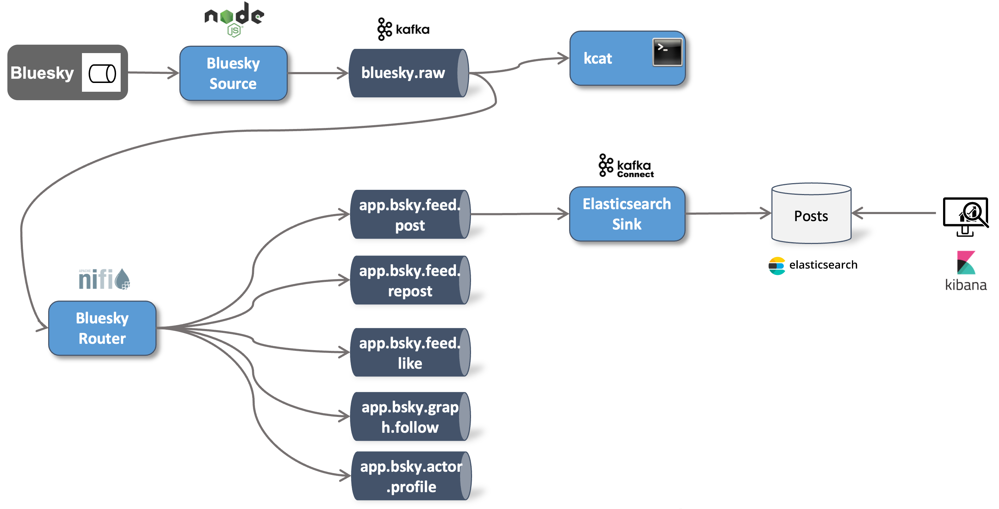

## Table of Contents

- [What you will learn](#what-you-will-learn)
- [Prerequisites](#prerequisites)
- [Run the Bluesky sensor](#run-the-bluesky-sensor)
- [Use NiFi to route messages by type to dedicated Kafka topics](#use-nifi-to-route-messages-by-type-to-dedicated-kafka-topics)
- [Using Kafka Connect to send data to Elasticsearch](#using-kafka-connect-to-send-data-to-elasticsearch)
- [Visualize Posts using Kibana](#visualize-posts-using-kibana)

## What you will learn

- How to consume the Bluesky firehose and publish it to a Kafka topic using BlueBird
- How to inspect live Kafka messages using `kcat` and `jq`
- How to filter and extract specific fields from nested JSON messages on the command line
- How to build a NiFi data flow to route messages by Bluesky collection type to dedicated Kafka topics
- How to create an Elasticsearch index mapping for deeply nested JSON documents
- How to configure a Kafka Connect Elasticsearch Sink connector
- How to visualise a live Bluesky data stream in Kibana Discover

## Prerequisites

- The **Data Platform** described [here](../00-environment/README.md) is running and accessible
- Workshop 1 ([Getting started with Apache Kafka](../01-working-with-kafka-broker/README.md)) completed
- Basic familiarity with the Linux command line and JSON

## Run the Bluesky sensor

To consume from Bluesky, we use [BlueBird](https://github.com/sdairs/bluebird), a CLI that consumes the Bluesky firehose and forwards it to a downstream destination. A Docker version is available at <https://github.com/gschmutz/bluebird>.

### About the Bluesky firehose

The firehose is a WebSocket stream that delivers every event on the network in real time. Each event is called a **commit** and belongs to a **collection** — the AT Protocol's name for a record type. The five collections we work with in this workshop are:

| Collection | Description |
|---|---|
| `app.bsky.feed.post` | A new post (text, optional images, links, or quoted posts) |
| `app.bsky.feed.repost` | A user reposting someone else's content |
| `app.bsky.feed.like` | A like on a post |
| `app.bsky.graph.follow` | A user following another account |
| `app.bsky.actor.profile` | A profile creation or update |

There are additional collection types in the firehose (e.g. block, mute, list operations), but we ignore them in this workshop. Each event carries the raw record payload plus metadata such as the author's DID (Decentralised Identifier), a microsecond timestamp (`time_us`), a revision hash, and the operation type (`create`, `update`, or `delete`).

### Create the raw topic

Create the Kafka topic where all raw Bluesky messages will be stored:

```bash
docker exec -ti kafka-1 kafka-topics \
    --bootstrap-server kafka-1:19092 \
    --create \
    --if-not-exists \
    --topic bluesky.raw \
    --replication-factor 3 \
    --partitions 8
```

### Start the BlueBird sensor

Start the BlueBird container and point it at the `bluesky.raw` topic. The container must join the same Docker network as the Kafka cluster:

```bash
docker run --rm -d \
    --name bsky-sensor \
    --network streaming-data-platform \
    -e DESTINATION=kafka \
    -e KAFKA_BROKERS=kafka-1:19092 \
    -e KAFKA_TOPIC=bluesky.raw \
    ghcr.io/gschmutz/bluebird:latest
```

> **What just happened?** BlueBird connected to the Bluesky AT Protocol firehose and began forwarding every event — posts, reposts, likes, follows, and more — as a JSON message to the `bluesky.raw` Kafka topic. The container runs detached (`-d`) and will continue streaming until stopped.

### Inspect messages with `kcat`

Use `kcat` to watch incoming messages:

```bash
kcat -q -b dataplatform:9092 -t bluesky.raw
```

> **What you should see:** A continuous stream of single-line JSON objects, one per message:

```json
{"capture_time":"2025-06-21T13:22:46.129Z","collection":"commit","record":{"did":"did:plc:zcst3...","time_us":1750512166085866,"kind":"commit","commit":{"rev":"3ls4njxa3fe2h","operation":"create","collection":"app.bsky.feed.like","rkey":"3ls4njx7tle2h","record":{"$type":"app.bsky.feed.like","createdAt":"2025-06-21T13:22:43.960Z","subject":{"cid":"bafyreift5...","uri":"at://did:plc:..."}}}}}
```

> **What just happened?** `kcat` subscribed to `bluesky.raw` from the latest offset and is printing each Avro-free JSON payload to stdout as it arrives. The firehose volume is high — you will typically see hundreds of messages per second.

Pipe through `jq` to pretty-print the JSON:

```bash
kcat -q -b dataplatform:9092 -t bluesky.raw | jq
```

> **What you should see:** Each message formatted across multiple lines, making the nested structure visible:

```json
{
  "capture_time": "2025-06-21T13:22:39.851Z",
  "collection": "commit",
  "record": {
    "did": "did:plc:gjukhfoiduwko2gnhz2wak5a",
    "time_us": 1750512159808091,
    "kind": "commit",
    "commit": {
      "rev": "3ls4njrbimr27",
      "operation": "create",
      "collection": "app.bsky.feed.like",
      "rkey": "3ls4njrav3r27",
      "record": {
        "$type": "app.bsky.feed.like",
        "createdAt": "2025-06-21T13:22:38.492Z",
        "subject": {
          "cid": "bafyreiawaxbpvs25ebodxceew3pbitspa4b4qbli2zfigpiajqffexve3e",
          "uri": "at://did:plc:xnqnvmwuju4ipj7dehiuxonh/app.bsky.feed.post/3lrszdqh7es2r"
        }
      },
      "cid": "bafyreicgffww5agjqjtshxcpzdaei63mqywjo5kqt37dxuiv3pkuvij7ni"
    }
  }
}
```

Each message contains an event payload plus metadata. The field `/record/commit/collection` identifies the event type.

### Filter messages by collection type

Extract just the collection type from each message:

```bash
kcat -q -b dataplatform:9092 -t bluesky.raw | jq .record.commit.collection
```

> **What you should see:** A stream of collection type strings:

```
"app.bsky.feed.post"
"app.bsky.feed.like"
"app.bsky.feed.repost"
"app.bsky.feed.repost"
"app.bsky.graph.follow"
"app.bsky.feed.like"
"app.bsky.feed.like"
```

> **What just happened?** `jq` extracted the `.record.commit.collection` field from each JSON object on stdin. The firehose contains at least five distinct collection types — posts, reposts, likes, follows, and profile updates — as well as less common ones.

Use `jq`'s `select` filter to show only post text:

```bash
kcat -q -b dataplatform:9092 -t bluesky.raw \
    | jq 'select(.record.commit.collection == "app.bsky.feed.post") | .record.commit.record.text'
```

> **What you should see:** A live stream of post text from around the world:

```
"DOGE + PALANTIR"
"I've been doing this ridiculous thing that I do where I read out of several books at the same time..."
"365 days of movie via Tubi\nDay168: Big Trouble in Little China (1986)"
"Good morning it's going into the 90's here. New Jersey."
```

> **What just happened?** `jq select()` acts as a filter gate — only messages whose `collection` field equals `app.bsky.feed.post` pass through, and for those the inner text field is extracted. Everything else is silently discarded.

## Use NiFi to route messages by type to dedicated Kafka topics

With raw Bluesky messages flowing into the `bluesky.raw` topic, we now use [Apache NiFi](http://nifi.apache.org) to fan them out into five type-specific topics based on the `collection` field.

### Why route by collection type?

Keeping all event types in a single topic works for exploration (we did it with `kcat` and `jq` earlier), but it creates problems for downstream consumers:

- A consumer that only cares about posts must deserialise every message — likes, follows, reposts — just to discard it
- Different event types have different schemas, so an Elasticsearch index or a database table that expects a post schema will reject or mangle a like record
- Topic partitioning is most effective when all messages in a topic have the same key domain (e.g. all keyed by post ID); mixing types makes that impossible

By routing each collection type to its own topic, each consumer subscribes only to what it needs, schemas stay homogeneous per topic, and the pipeline remains easy to extend — adding a new consumer for `app.bsky.feed.like` does not require touching any existing flow.

### Why Apache NiFi?

[Apache NiFi](https://nifi.apache.org) is a visual data flow tool designed for routing, transforming, and mediating data between systems. It is a natural fit here because the routing logic — extract a field, match it against a list, publish to a dynamic topic name — is exactly the kind of stateless per-message transformation NiFi handles without writing any code. NiFi also provides a live monitoring view of throughput and backpressure on every connection, which makes it easy to observe the data flow during the workshop.

### Open NiFi

In a browser navigate to <https://dataplatform:18083/nifi>. NiFi uses a self-signed certificate, so confirm the browser security warning before proceeding.


Enter `nifi` into the **User** field and `1234567890ACD` into the **Password** field and click **LOG IN**.

> **What you should see:** The NiFi canvas — an empty white workspace where you will build the data flow.

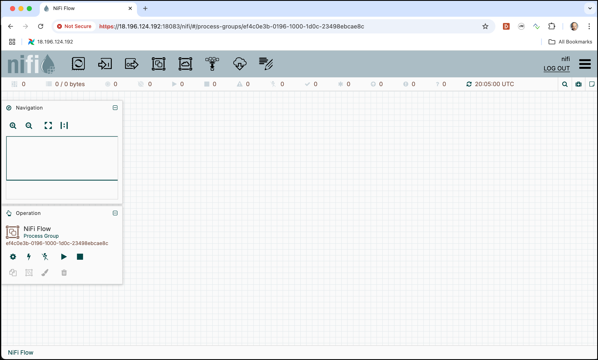

### Adding a `ConsumeKafka` processor

Drag the **Processor** icon from the top-left toolbar onto the canvas.

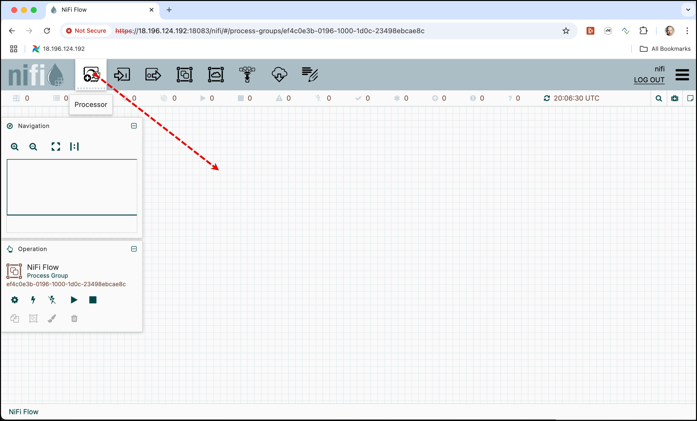

The processor chooser dialog opens. Type **ConsumeK** into the filter box and select **ConsumeKafka**, then click **Add**.

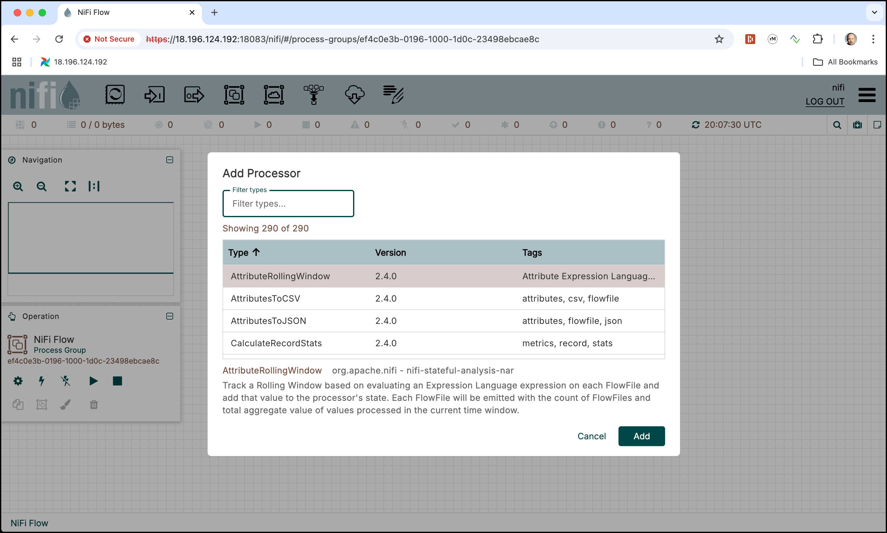

> **What you should see:** A `ConsumeKafka` processor on the canvas with a yellow warning marker, indicating it is not yet configured.

Double-click the processor and click the **Properties** tab. Configure the following properties:

- **Kafka Connection Service**: click the three dots, select **+ Create new service**, choose **Kafka3ConnectionService**, and click **Add**. Click the three dots again and select **Go To Service**. In the service list click the three dots and select **Edit**, navigate to **Properties**, and set:
  - **Bootstrap Servers**: `kafka-1:19092`

  Click **Apply**, then enable the service by clicking the three dots and selecting **Enable**. Click **Close** and **Back to Processor**.
- **Group ID**: `bluesky.raw-cg`
- **Topics**: `bluesky.raw`
- **Processing Strategy**: `RECORD`
- **Record Reader**: click the three dots, select **+ Create new service**, choose **JsonTreeReader**, and click **Add**. Click the three dots again and select **Go To Service**. Enable the service via its three-dot menu. Click **Close** and **Back to Processor**.
- **Record Writer**: click the three dots, select **+ Create new service**, choose **JsonRecordSetWriter**, and click **Add**. Click the three dots again and select **Go To Service**. In the service list click the three dots and select **Edit**, navigate to **Properties** and set:
  - **Output Grouping**: `One Line per Object`

  Click **Apply** and enable the service. Click **Close** and **Back to Processor**.

The configured processor should look as shown below:

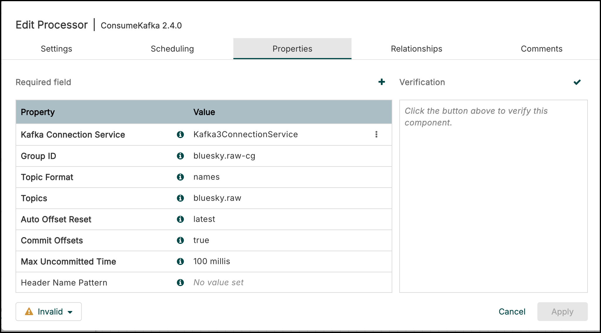

Click **Apply** to close the dialog.

### Adding two `ReplaceText` processors

The Bluesky JSON contains fields named `$type` and `$link`. The leading `$` character causes problems in three places downstream:

- **NiFi Expression Language** — `$` is the delimiter that opens an expression (`${...}`), so a field name containing `$` is misinterpreted as an incomplete expression and causes a parse error
- **Elasticsearch dynamic mapping** — field names beginning with `$` are not valid in Elasticsearch's dot-notation and trigger a mapping exception when the connector tries to index the document
- **jq** — while jq can handle `$`-prefixed keys with quoted syntax (`.["$type"]`), it makes ad-hoc queries awkward and easy to get wrong

We strip the `$` prefix from both field names before any downstream processing sees the data. This is a purely cosmetic rename — the field values and structure are unchanged.

Drag a **ReplaceText** processor onto the canvas. Double-click it and navigate to **Properties**. Set:

- **Search Value**: `\$type`
- **Replacement Value**: `type`
- **Evaluation Mode**: `Entire Text`

Click **Apply**.

Drag a second **ReplaceText** processor onto the canvas (or alternatively copy/paste the first one). 

Configure it with:

- **Search Value**: `\$link`
- **Replacement Value**: `link`
- **Evaluation Mode**: `Entire Text`

Click **Apply**.

### Adding an `EvaluateJsonPath` processor

Drag an **EvaluateJsonPath** processor onto the canvas. Double-click it and navigate to **Properties**. Set **Destination** to `flowfile-attribute`. Click **+** in the upper right, enter `topicName` as the property name, and set its value to `$.record.commit.collection`. Click **OK** and then **Apply**.

> **What just happened?** This processor reads the `collection` field from each JSON message and stores its value in the NiFi FlowFile attribute `topicName`. Downstream processors can then reference `${topicName}` as a variable.

### Adding a `RouteOnAttribute` processor

Drag a **RouteOnAttribute** processor onto the canvas. Double-click it and navigate to **Properties**. Click **+**, enter `passOn` as the property name, and set its value to:

```
${topicName:in("app.bsky.feed.post","app.bsky.feed.repost","app.bsky.feed.like","app.bsky.graph.follow","app.bsky.actor.profile")}
```

Click **Apply**.

> **What just happened?** `RouteOnAttribute` evaluates the NiFi Expression Language expression against each FlowFile. Messages whose `topicName` attribute matches one of the five known collection types are routed through the `passOn` relationship; all others exit through `unmatched` and will be terminated.

### Adding a `PublishKafka` processor

Drag a **PublishKafka** processor onto the canvas. Double-click it and navigate to **Properties**. Set:

- **Kafka Connection Service**: select `Kafka3ConnectionService` from the drop-down
- **Topic Name**: `${topicName}`
- **Record Reader**: select `JsonTreeReader`
- **Record Writer**: select `JsonRecordSetWriter`

Click **Apply**.

> **What just happened?** The `${topicName}` expression makes the destination topic dynamic — each FlowFile is published to the Kafka topic whose name matches the Bluesky collection type extracted earlier.

### Connecting the processors

Wire up the processors in order: **ConsumeKafka → ReplaceText ($type) → ReplaceText ($link) → EvaluateJsonPath → RouteOnAttribute → PublishKafka**.

For each connection, drag from the source processor's edge to the destination and select the appropriate relationship in the dialog and terminate unused relationships on each processor:

- **ConsumeKafka**: link `success`, terminate `parse.failure`
- **ReplaceText** (both): link `success`, terminate `failure`
- **EvaluateJsonPath**: link `matched`, terminate `failure` and `unmatched`
- **RouteOnAttribute**: link `passOn`, terminate `unmatched`
- **PublishKafka**: terminate `failure` and `success`

After that the data flow should look as follows:

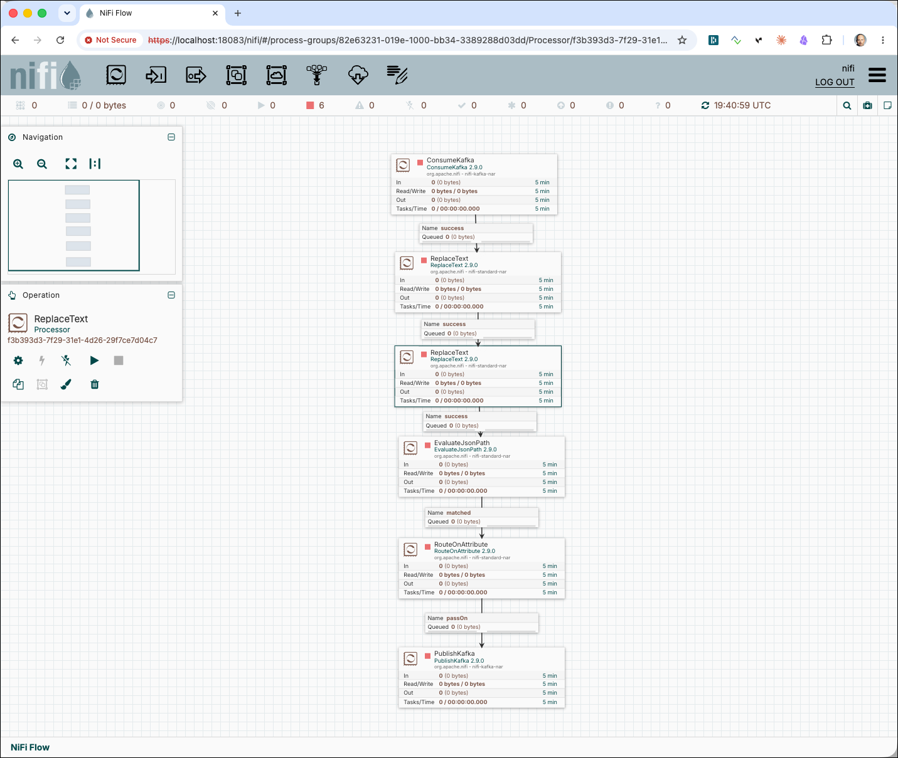

### Create the target Kafka topics

Before starting the flow, create the five destination topics:

```bash
docker exec -ti kafka-1 kafka-topics --bootstrap-server kafka-1:19092 --create --if-not-exists --topic app.bsky.feed.post     --replication-factor 3 --partitions 8
docker exec -ti kafka-1 kafka-topics --bootstrap-server kafka-1:19092 --create --if-not-exists --topic app.bsky.feed.repost   --replication-factor 3 --partitions 8
docker exec -ti kafka-1 kafka-topics --bootstrap-server kafka-1:19092 --create --if-not-exists --topic app.bsky.feed.like     --replication-factor 3 --partitions 8
docker exec -ti kafka-1 kafka-topics --bootstrap-server kafka-1:19092 --create --if-not-exists --topic app.bsky.graph.follow  --replication-factor 3 --partitions 8
docker exec -ti kafka-1 kafka-topics --bootstrap-server kafka-1:19092 --create --if-not-exists --topic app.bsky.actor.profile --replication-factor 3 --partitions 8
```

### Group and start the data flow

Select all processors with **Ctrl-A**, right-click one of them, and choose **Group**. Enter `bluesky` as the name and click **Add**.

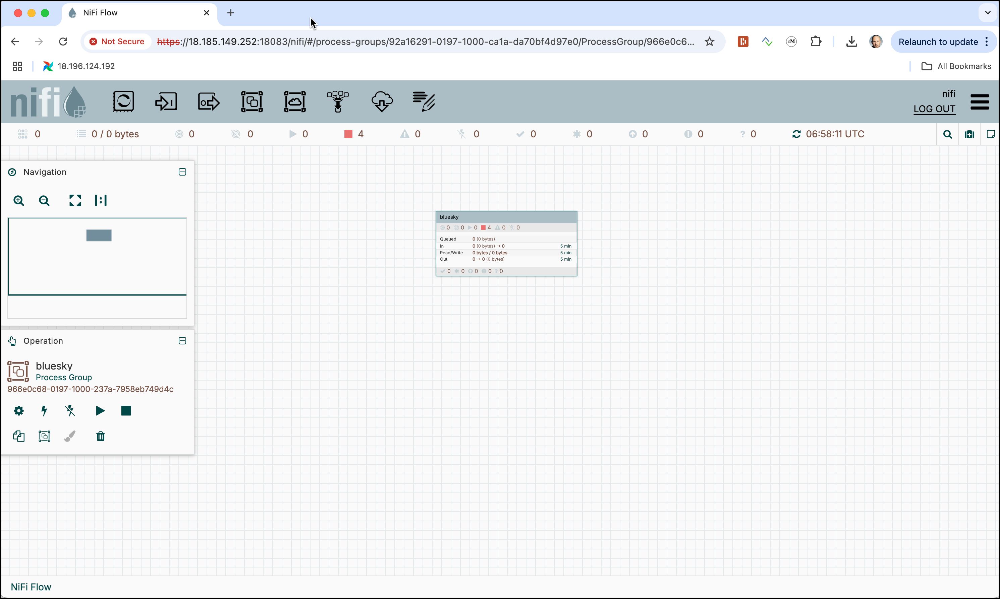

> **What just happened?** NiFi grouped all five processors into a single process group. This gives you unified start/stop control and keeps the canvas clean when you add more flows later.

Double-click the process group to enter it, select all processors with **Ctrl-A**, and click the **Start** button.

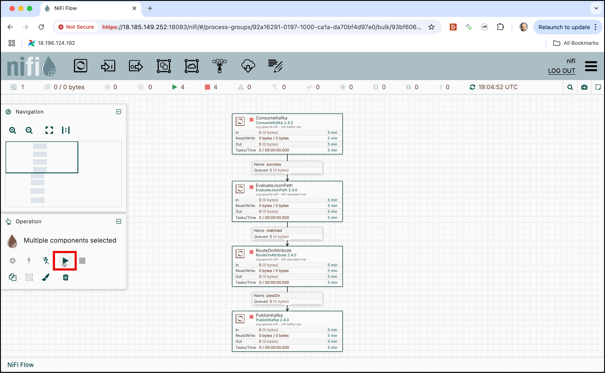

Verify that messages are arriving in the `app.bsky.feed.post` topic:

```bash
kcat -q -b dataplatform:9092 -t app.bsky.feed.post | jq '.record.commit.record.text'
```

> **What you should see:** A live stream of post text from the type-specific topic — identical to the filtered output you saw earlier, but now sourced from its own dedicated topic.

## Using Kafka Connect to send data to Elasticsearch

[Elasticsearch](https://www.elastic.co/elasticsearch) is a distributed search and analytics engine built on Apache Lucene. It stores documents as JSON, indexes every field by default, and answers full-text and structured queries in milliseconds even over billions of documents. Paired with Kibana it provides the search, filtering, and visualisation layer of the pipeline.

### Why Elasticsearch needs an explicit mapping

By default Elasticsearch uses **dynamic mapping**: when the first document arrives it inspects each field value and infers a type (`text`, `long`, `date`, etc.). This works well for simple, uniform schemas but breaks for the Bluesky post schema for two reasons:

- **Mixed-type fields** — several fields in the Bluesky schema can appear as either a simple string or a nested object depending on the post content. Elasticsearch detects the type from the first document it sees; when a subsequent document sends the same field with a different shape, indexing fails with a `mapper_parsing_exception`.
- **The `embed` subtree** — the `embed` field has radically different structures depending on whether the post embeds an image, an external link, a quoted post, or a video. Dynamic mapping cannot handle a field being sometimes an object with `images` and sometimes an object with `external`.

We therefore create an explicit mapping before starting the connector. The mapping we use takes a permissive approach: all string fields are mapped as `text` with a `keyword` sub-field (enabling both full-text search and exact aggregations), numeric fields are `long`, date fields are `date`, and the most variable sub-trees are mapped as `object` with `"enabled": false` to store them without indexing.

The messages in `app.bsky.feed.post` look like the following example:

```json
{
  "capture_time": "2026-06-05T19:48:45.564Z",
  "collection": "commit",
  "record": {
    "did": "did:plc:4muclvmhoko3nqttzc25ftbd",
    "time_us": 1780688925780291,
    "kind": "commit",
    "commit": {
      "rev": "3mnkvthdrsa2c",
      "operation": "create",
      "collection": "app.bsky.feed.post",
      "rkey": "3mnkvtgimnk2z",
      "record": {
        "type": "app.bsky.feed.post",
        "createdAt": "2026-06-05T19:48:44.135Z",
        "embed": {
          "type": "app.bsky.embed.external",
          "external": {
            "description": "Department of Justice lawyers made the bizarre argument while defending Donald Trump’s ballroom.",
            "thumb": {
              "type": "blob",
              "ref": {
                "link": "bafkreicfgsijijyjygl7nvm5zxn3r7mlwncwzca6fucvhaab44b57yv2wq"
              },
              "mimeType": "image/jpeg",
              "size": 332850
            },
            "title": "DOJ Declares Trump Has Right to Bulldoze Statue of Liberty — The New Republic",
            "uri": "https://apple.news/AICAEt0M3SBKNFOTdXwvG8Q"
          }
        },
        "facets": [
          {
            "features": [
              {
                "type": "app.bsky.richtext.facet#tag",
                "tag": "8647NOW"
              }
            ],
            "index": {
              "byteEnd": 263,
              "byteStart": 255
            }
          },
          {
            "features": [
              {
                "type": "app.bsky.richtext.facet#link",
                "uri": "https://apple.news/AICAEt0M3SBKNFOTdXwvG8Q"
              }
            ],
            "index": {
              "byteEnd": 292,
              "byteStart": 266
            }
          }
        ],
        "langs": [
          "en"
        ],
        "text": "These scumbags think they can do whatever they want. What is it going to take before we the people have to step in and take back the peoples house? This criminal administration is not for the people and apparently think Trump is king. Thus needs to end!  #8647NOW \n\napple.news/AICAEt0M3SBK..."
      },
      "cid": "bafyreiacqxqq5htxzdy6gaolmv5fnsw67nda7iwxyqwr2iurizyrjb4w6e"
    }
  }
}
```

### Create the Elasticsearch mapping

Elasticsearch's automatic mapping cannot handle fields that appear as both primitive and complex types across different messages, which is common in the Bluesky schema. We must define the mapping explicitly before indexing any data.

Navigate to the Kibana Dev Tools console at <http://dataplatform:5601/app/dev_tools#/console/shell> and paste the following mapping:

```bash
PUT /app.bsky.feed.post
{
  "mappings": {
    "properties": {
      "capture_time": {
        "type": "date"
      },
      "collection": {
        "type": "text",
        "fields": {
          "keyword": {
            "type": "keyword",
            "ignore_above": 256
          }
        }
      },
      "record": {
        "properties": {
          "commit": {
            "properties": {
              "cid": {
                "type": "text",
                "fields": {
                  "keyword": {
                    "type": "keyword",
                    "ignore_above": 256
                  }
                }
              },
              "collection": {
                "type": "text",
                "fields": {
                  "keyword": {
                    "type": "keyword",
                    "ignore_above": 256
                  }
                }
              },
              "operation": {
                "type": "text",
                "fields": {
                  "keyword": {
                    "type": "keyword",
                    "ignore_above": 256
                  }
                }
              },
              "record": {
                "properties": {
                  "actor": {
                    "type": "text",
                    "fields": {
                      "keyword": {
                        "type": "keyword",
                        "ignore_above": 256
                      }
                    }
                  },
                  "alt": {
                    "type": "text",
                    "fields": {
                      "keyword": {
                        "type": "keyword",
                        "ignore_above": 256
                      }
                    }
                  },
                  "bridgyOriginalText": {
                    "type": "text",
                    "fields": {
                      "keyword": {
                        "type": "keyword",
                        "ignore_above": 256
                      }
                    }
                  },
                  "bridgyOriginalUrl": {
                    "type": "text",
                    "fields": {
                      "keyword": {
                        "type": "keyword",
                        "ignore_above": 256
                      }
                    }
                  },
                  "community": {
                    "type": "text",
                    "fields": {
                      "keyword": {
                        "type": "keyword",
                        "ignore_above": 256
                      }
                    }
                  },
                  "createdAt": {
                    "type": "date"
                  },
                  "embed": {
                    "properties": {
                      "alt": {
                        "type": "text",
                        "fields": {
                          "keyword": {
                            "type": "keyword",
                            "ignore_above": 256
                          }
                        }
                      },
                      "alttext": {
                        "type": "text",
                        "fields": {
                          "keyword": {
                            "type": "keyword",
                            "ignore_above": 256
                          }
                        }
                      },
                      "aspectRatio": {
                        "properties": {
                          "height": {
                            "type": "long"
                          },
                          "width": {
                            "type": "long"
                          }
                        }
                      },
                      "external": {
                        "properties": {
                          "aspectRatio": {
                            "properties": {
                              "height": {
                                "type": "long"
                              },
                              "width": {
                                "type": "long"
                              }
                            }
                          },
                          "description": {
                            "type": "text",
                            "fields": {
                              "keyword": {
                                "type": "keyword",
                                "ignore_above": 256
                              }
                            }
                          },
                          "preview": {
                            "type": "text",
                            "fields": {
                              "keyword": {
                                "type": "keyword",
                                "ignore_above": 256
                              }
                            }
                          },
                          "thumb": {
                            "properties": {
                              "mimeType": {
                                "type": "text",
                                "fields": {
                                  "keyword": {
                                    "type": "keyword",
                                    "ignore_above": 256
                                  }
                                }
                              },
                              "ref": {
                                "properties": {
                                  "link": {
                                    "type": "text",
                                    "fields": {
                                      "keyword": {
                                        "type": "keyword",
                                        "ignore_above": 256
                                      }
                                    }
                                  }
                                }
                              },
                              "size": {
                                "type": "long"
                              }
                            }
                          },
                          "title": {
                            "type": "text",
                            "fields": {
                              "keyword": {
                                "type": "keyword",
                                "ignore_above": 256
                              }
                            }
                          },
                          "uri": {
                            "type": "text",
                            "fields": {
                              "keyword": {
                                "type": "keyword",
                                "ignore_above": 256
                              }
                            }
                          }
                        }
                      },
                      "images": {
                        "properties": {
                          "alt": {
                            "type": "text",
                            "fields": {
                              "keyword": {
                                "type": "keyword",
                                "ignore_above": 256
                              }
                            }
                          },
                          "aspectRatio": {
                            "properties": {
                              "height": {
                                "type": "long"
                              },
                              "width": {
                                "type": "long"
                              }
                            }
                          },
                          "aspect_ratio": {
                            "properties": {
                              "height": {
                                "type": "long"
                              },
                              "width": {
                                "type": "long"
                              }
                            }
                          },
                          "data": {
                            "type": "object",
                            "enabled": false
                          },
                          "image": {
                            "properties": {
                              "mimeType": {
                                "type": "text",
                                "fields": {
                                  "keyword": {
                                    "type": "keyword",
                                    "ignore_above": 256
                                  }
                                }
                              },
                              "ref": {
                                "properties": {
                                  "link": {
                                    "type": "text",
                                    "fields": {
                                      "keyword": {
                                        "type": "keyword",
                                        "ignore_above": 256
                                      }
                                    }
                                  }
                                }
                              },
                              "size": {
                                "type": "long"
                              }
                            }
                          }
                        }
                      },
                      "media": {
                        "properties": {
                          "aspectRatio": {
                            "properties": {
                              "height": {
                                "type": "long"
                              },
                              "width": {
                                "type": "long"
                              }
                            }
                          },
                          "external": {
                            "properties": {
                              "description": {
                                "type": "text",
                                "fields": {
                                  "keyword": {
                                    "type": "keyword",
                                    "ignore_above": 256
                                  }
                                }
                              },
                              "thumb": {
                                "properties": {
                                  "mimeType": {
                                    "type": "text",
                                    "fields": {
                                      "keyword": {
                                        "type": "keyword",
                                        "ignore_above": 256
                                      }
                                    }
                                  },
                                  "ref": {
                                    "properties": {
                                      "link": {
                                        "type": "text",
                                        "fields": {
                                          "keyword": {
                                            "type": "keyword",
                                            "ignore_above": 256
                                          }
                                        }
                                      }
                                    }
                                  },
                                  "size": {
                                    "type": "long"
                                  }
                                }
                              },
                              "title": {
                                "type": "text",
                                "fields": {
                                  "keyword": {
                                    "type": "keyword",
                                    "ignore_above": 256
                                  }
                                }
                              },
                              "uri": {
                                "type": "text",
                                "fields": {
                                  "keyword": {
                                    "type": "keyword",
                                    "ignore_above": 256
                                  }
                                }
                              }
                            }
                          },
                          "images": {
                            "properties": {
                              "alt": {
                                "type": "text",
                                "fields": {
                                  "keyword": {
                                    "type": "keyword",
                                    "ignore_above": 256
                                  }
                                }
                              },
                              "aspectRatio": {
                                "properties": {
                                  "height": {
                                    "type": "long"
                                  },
                                  "width": {
                                    "type": "long"
                                  }
                                }
                              },
                              "image": {
                                "properties": {
                                  "mimeType": {
                                    "type": "text",
                                    "fields": {
                                      "keyword": {
                                        "type": "keyword",
                                        "ignore_above": 256
                                      }
                                    }
                                  },
                                  "ref": {
                                    "properties": {
                                      "link": {
                                        "type": "text",
                                        "fields": {
                                          "keyword": {
                                            "type": "keyword",
                                            "ignore_above": 256
                                          }
                                        }
                                      }
                                    }
                                  },
                                  "size": {
                                    "type": "long"
                                  }
                                }
                              }
                            }
                          },
                          "video": {
                            "properties": {
                              "mimeType": {
                                "type": "text",
                                "fields": {
                                  "keyword": {
                                    "type": "keyword",
                                    "ignore_above": 256
                                  }
                                }
                              },
                              "ref": {
                                "properties": {
                                  "link": {
                                    "type": "text",
                                    "fields": {
                                      "keyword": {
                                        "type": "keyword",
                                        "ignore_above": 256
                                      }
                                    }
                                  }
                                }
                              },
                              "size": {
                                "type": "long"
                              }
                            }
                          }
                        }
                      },
                      "record": {
                        "properties": {
                          "cid": {
                            "type": "text",
                            "fields": {
                              "keyword": {
                                "type": "keyword",
                                "ignore_above": 256
                              }
                            }
                          },
                          "record": {
                            "properties": {
                              "cid": {
                                "type": "text",
                                "fields": {
                                  "keyword": {
                                    "type": "keyword",
                                    "ignore_above": 256
                                  }
                                }
                              },
                              "uri": {
                                "type": "text",
                                "fields": {
                                  "keyword": {
                                    "type": "keyword",
                                    "ignore_above": 256
                                  }
                                }
                              }
                            }
                          },
                          "uri": {
                            "type": "text",
                            "fields": {
                              "keyword": {
                                "type": "keyword",
                                "ignore_above": 256
                              }
                            }
                          }
                        }
                      },
                      "uri": {
                        "type": "text",
                        "fields": {
                          "keyword": {
                            "type": "keyword",
                            "ignore_above": 256
                          }
                        }
                      },
                      "video": {
                        "properties": {
                          "mimeType": {
                            "type": "text",
                            "fields": {
                              "keyword": {
                                "type": "keyword",
                                "ignore_above": 256
                              }
                            }
                          },
                          "ref": {
                            "properties": {
                              "link": {
                                "type": "text",
                                "fields": {
                                  "keyword": {
                                    "type": "keyword",
                                    "ignore_above": 256
                                  }
                                }
                              }
                            }
                          },
                          "size": {
                            "type": "long"
                          }
                        }
                      }
                    }
                  },
                  "entities": {
                    "properties": {
                      "index": {
                        "properties": {
                          "end": {
                            "type": "long"
                          },
                          "start": {
                            "type": "long"
                          }
                        }
                      },
                      "type": {
                        "type": "text",
                        "fields": {
                          "keyword": {
                            "type": "keyword",
                            "ignore_above": 256
                          }
                        }
                      },
                      "value": {
                        "type": "text",
                        "fields": {
                          "keyword": {
                            "type": "keyword",
                            "ignore_above": 256
                          }
                        }
                      }
                    }
                  },
                  "external": {
                    "properties": {
                      "description": {
                        "type": "text",
                        "fields": {
                          "keyword": {
                            "type": "keyword",
                            "ignore_above": 256
                          }
                        }
                      },
                      "thumb": {
                        "properties": {
                          "mimeType": {
                            "type": "text",
                            "fields": {
                              "keyword": {
                                "type": "keyword",
                                "ignore_above": 256
                              }
                            }
                          },
                          "ref": {
                            "properties": {
                              "link": {
                                "type": "text",
                                "fields": {
                                  "keyword": {
                                    "type": "keyword",
                                    "ignore_above": 256
                                  }
                                }
                              }
                            }
                          },
                          "size": {
                            "type": "long"
                          }
                        }
                      },
                      "title": {
                        "type": "text",
                        "fields": {
                          "keyword": {
                            "type": "keyword",
                            "ignore_above": 256
                          }
                        }
                      },
                      "uri": {
                        "type": "text",
                        "fields": {
                          "keyword": {
                            "type": "keyword",
                            "ignore_above": 256
                          }
                        }
                      }
                    }
                  },
                  "facets": {
                    "properties": {
                      "features": {
                        "properties": {
                          "did": {
                            "type": "text",
                            "fields": {
                              "keyword": {
                                "type": "keyword",
                                "ignore_above": 256
                              }
                            }
                          },
                          "tag": {
                            "type": "text",
                            "fields": {
                              "keyword": {
                                "type": "keyword",
                                "ignore_above": 256
                              }
                            }
                          },
                          "uri": {
                            "type": "text",
                            "fields": {
                              "keyword": {
                                "type": "keyword",
                                "ignore_above": 256
                              }
                            }
                          }
                        }
                      },
                      "index": {
                        "properties": {
                          "byteEnd": {
                            "type": "long"
                          },
                          "byteStart": {
                            "type": "long"
                          }
                        }
                      }
                    }
                  },
                  "image": {
                    "type": "text",
                    "fields": {
                      "keyword": {
                        "type": "keyword",
                        "ignore_above": 256
                      }
                    }
                  },
                  "images": {
                    "properties": {
                      "alt": {
                        "type": "text",
                        "fields": {
                          "keyword": {
                            "type": "keyword",
                            "ignore_above": 256
                          }
                        }
                      },
                      "image": {
                        "properties": {
                          "mimeType": {
                            "type": "text",
                            "fields": {
                              "keyword": {
                                "type": "keyword",
                                "ignore_above": 256
                              }
                            }
                          },
                          "ref": {
                            "properties": {
                              "link": {
                                "type": "text",
                                "fields": {
                                  "keyword": {
                                    "type": "keyword",
                                    "ignore_above": 256
                                  }
                                }
                              }
                            }
                          },
                          "size": {
                            "type": "long"
                          }
                        }
                      }
                    }
                  },
                  "labels": {
                    "properties": {
                      "values": {
                        "properties": {
                          "val": {
                            "type": "text",
                            "fields": {
                              "keyword": {
                                "type": "keyword",
                                "ignore_above": 256
                              }
                            }
                          }
                        }
                      }
                    }
                  },
                  "lang": {
                    "type": "text",
                    "fields": {
                      "keyword": {
                        "type": "keyword",
                        "ignore_above": 256
                      }
                    }
                  },
                  "langs": {
                    "type": "text",
                    "fields": {
                      "keyword": {
                        "type": "keyword",
                        "ignore_above": 256
                      }
                    }
                  },
                  "reply": {
                    "properties": {
                      "parent": {
                        "properties": {
                          "cid": {
                            "type": "text",
                            "fields": {
                              "keyword": {
                                "type": "keyword",
                                "ignore_above": 256
                              }
                            }
                          },
                          "uri": {
                            "type": "text",
                            "fields": {
                              "keyword": {
                                "type": "keyword",
                                "ignore_above": 256
                              }
                            }
                          },
                          "validationStatus": {
                            "type": "text",
                            "fields": {
                              "keyword": {
                                "type": "keyword",
                                "ignore_above": 256
                              }
                            }
                          }
                        }
                      },
                      "root": {
                        "properties": {
                          "cid": {
                            "type": "text",
                            "fields": {
                              "keyword": {
                                "type": "keyword",
                                "ignore_above": 256
                              }
                            }
                          },
                          "uri": {
                            "type": "text",
                            "fields": {
                              "keyword": {
                                "type": "keyword",
                                "ignore_above": 256
                              }
                            }
                          },
                          "validationStatus": {
                            "type": "text",
                            "fields": {
                              "keyword": {
                                "type": "keyword",
                                "ignore_above": 256
                              }
                            }
                          }
                        }
                      }
                    }
                  },
                  "tags": {
                    "type": "text",
                    "fields": {
                      "keyword": {
                        "type": "keyword",
                        "ignore_above": 256
                      }
                    }
                  },
                  "text": {
                    "type": "text",
                    "fields": {
                      "keyword": {
                        "type": "keyword",
                        "ignore_above": 256
                      }
                    }
                  },
                  "title": {
                    "type": "text",
                    "fields": {
                      "keyword": {
                        "type": "keyword",
                        "ignore_above": 256
                      }
                    }
                  },
                  "type": {
                    "type": "text",
                    "fields": {
                      "keyword": {
                        "type": "keyword",
                        "ignore_above": 256
                      }
                    }
                  },
                  "via": {
                    "type": "text",
                    "fields": {
                      "keyword": {
                        "type": "keyword",
                        "ignore_above": 256
                      }
                    }
                  }
                }
              },
              "rev": {
                "type": "text",
                "fields": {
                  "keyword": {
                    "type": "keyword",
                    "ignore_above": 256
                  }
                }
              },
              "rkey": {
                "type": "text",
                "fields": {
                  "keyword": {
                    "type": "keyword",
                    "ignore_above": 256
                  }
                }
              }
            }
          },
          "did": {
            "type": "text",
            "fields": {
              "keyword": {
                "type": "keyword",
                "ignore_above": 256
              }
            }
          },
          "kind": {
            "type": "text",
            "fields": {
              "keyword": {
                "type": "keyword",
                "ignore_above": 256
              }
            }
          },
          "time_us": {
            "type": "long"
          }
        }
      }
    }
  }
}
```

Click on the command to select it and click the **play** icon (**Send request**) to create the index in Elasticsearch.

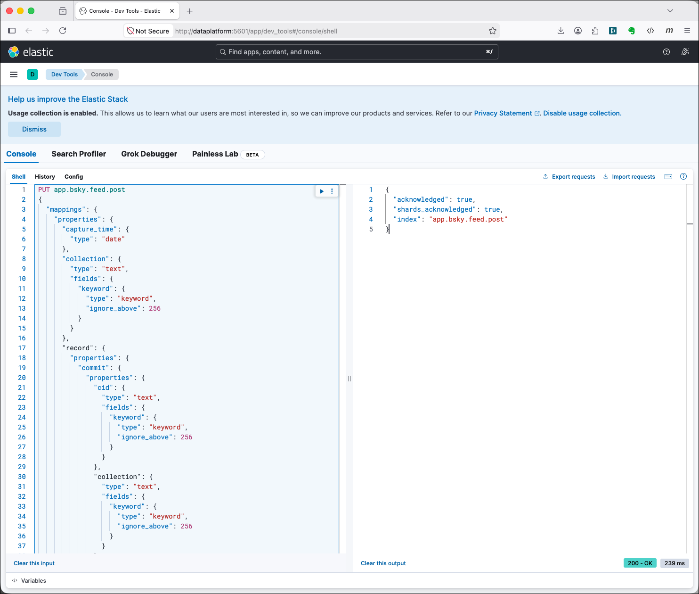

> **What you should see:** A `200 OK` response with `{"acknowledged": true, "shards_acknowledged": true, "index": "app.bsky.feed.post"}`.

> **What just happened?** Elasticsearch created the index with the explicit field mapping you supplied. From this point on, any document written to this index will be validated against the mapping — fields outside the defined schema are still indexed under dynamic mapping, but the key nested fields (text, dates, numbers) are typed correctly, which enables full-text search and date-range queries.

> **Note:** If you need to delete the index and start over, use `DELETE /app.bsky.feed.post` in the Dev Tools console.

### Run the Elasticsearch connector

The [Confluent Elasticsearch Sink Connector](https://docs.confluent.io/current/connect/kafka-connect-elasticsearch/index.html) is pre-loaded in the Kafka Connect cluster. Verify it is available:

```bash
curl -XGET http://dataplatform:8083/connector-plugins | jq '.[].class' | grep -i elastic
```

> **What you should see:** The connector class name printed, confirming it is installed:

```
"io.confluent.connect.elasticsearch.ElasticsearchSinkConnector"
```

In the `scripts` folder, create a file `start-elasticsearch.sh` with the following content:

```bash
#!/bin/bash

echo "removing Elasticsearch Sink Connector"
curl -X "DELETE" http://dataplatform:8083/connectors/elasticsearch-bluesky-sink

echo "creating Elasticsearch Sink Connector"
curl -X PUT \
  http://dataplatform:8083/connectors/elasticsearch-bluesky-sink/config \
  -H 'Content-Type: application/json' \
  -H 'Accept: application/json' \
  -d '{
  "connector.class": "io.confluent.connect.elasticsearch.ElasticsearchSinkConnector",
  "tasks.max": "1",
  "topics": "app.bsky.feed.post",
  "connection.url": "http://elasticsearch-1:9200",
  "key.ignore": "true",
  "key.converter": "org.apache.kafka.connect.storage.StringConverter",
  "schema.ignore": "true",
  "type.name": "kafkaconnect",
  "value.converter": "org.apache.kafka.connect.json.JsonConverter",
  "value.converter.schemas.enable": "false",
  "errors.tolerance": "all",
  "errors.log.enable": "false",
  "errors.log.include.messages": "true",
  "errors.deadletterqueue.topic.name": "es-sink.bluesky.dlq",
  "behavior.on.malformed.documents": "ignore",
  "drop.invalid.message": "true",
  "behavior.on.null.values": "IGNORE"
}'
```

Also create `stop-elasticsearch.sh`:

```bash
#!/bin/bash

echo "removing Elasticsearch Sink Connector"
curl -X "DELETE" http://dataplatform:8083/connectors/elasticsearch-bluesky-sink
```

Make both scripts executable:

```bash
chmod +x scripts/start-elasticsearch.sh
chmod +x scripts/stop-elasticsearch.sh
```

Start the connector:

```bash
./scripts/start-elasticsearch.sh
```

> **What you should see:** The DELETE call returns a 404 (expected on first run) and the PUT call returns the connector configuration as JSON.

> **What just happened?** Kafka Connect started a connector task that reads from `app.bsky.feed.post` and writes each message as a document into the `app.bsky.feed.post` Elasticsearch index. The `key.ignore=true` setting lets Elasticsearch generate its own document IDs. `behavior.on.malformed.documents=ignore` ensures that a single document that violates the mapping does not stop the connector — such messages are forwarded to the dead-letter topic `es-sink.bluesky.dlq` instead.

Verify documents are arriving in Elasticsearch:

```bash
curl -s dataplatform:9200/app.bsky.feed.post/_count | jq .count
```

> **What you should see:** A growing document count, confirming that posts are being indexed.

### Inspect the Elasticsearch mapping

You can confirm the registered mapping at any time from the Kibana Dev Tools console at <http://dataplatform:5601/app/dev_tools#/console>. Run:

```
GET /app.bsky.feed.post/_mapping
```

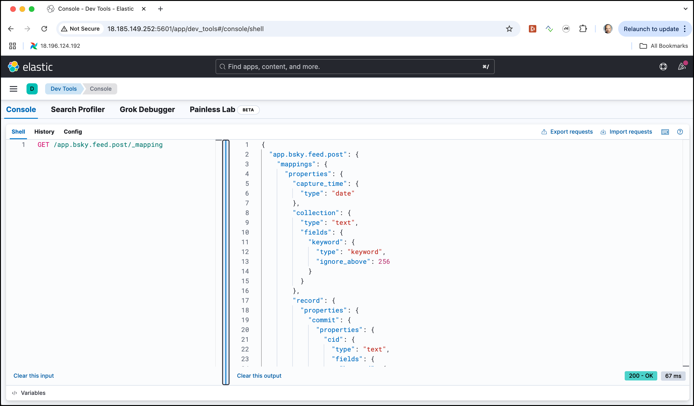

> **What you should see:** The full field mapping for the index, showing every field name, its data type, and any `keyword` sub-fields.

> **What just happened?** Elasticsearch stored the mapping you defined earlier. Text fields have both a `text` version for full-text search (analysed, tokenised) and a `keyword` sub-field for exact-match filters and aggregations. Date fields (`capture_time`, `createdAt`) enable time-range queries in Kibana. The `time_us` field is a `long` to store the microsecond-precision timestamp from the AT Protocol.

## Visualize Posts using Kibana

[Kibana](https://www.elastic.co/kibana) is the visualisation layer of the [Elastic Stack](https://www.elastic.co/elastic-stack). Navigate to <http://dataplatform:5601>.

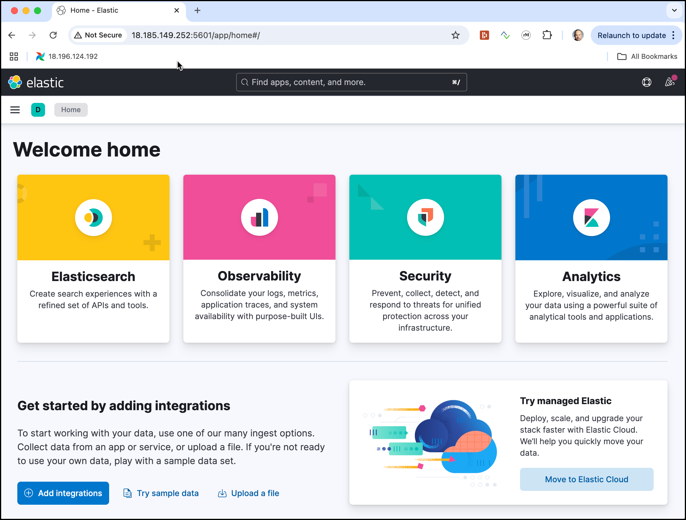

Click the **Analytics** tile.

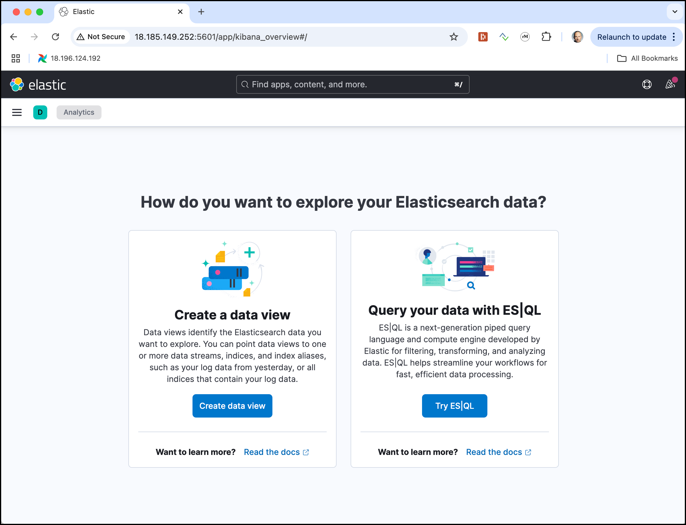

Click **Create data view**.

### Create a data view

Enter `Bluesky Posts` in the **Name** field and `app.bsky*` in the **Index pattern** field. Select `capture_time` from the **Timestamp field** drop-down.

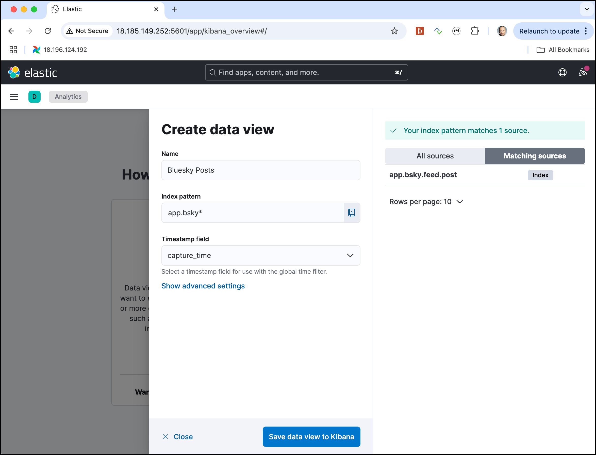

Click **Save data view to Kibana**.

### Explore live data in Discover

Click on the **Hamburger** icon to show the left-side menu and click on **Discover**.

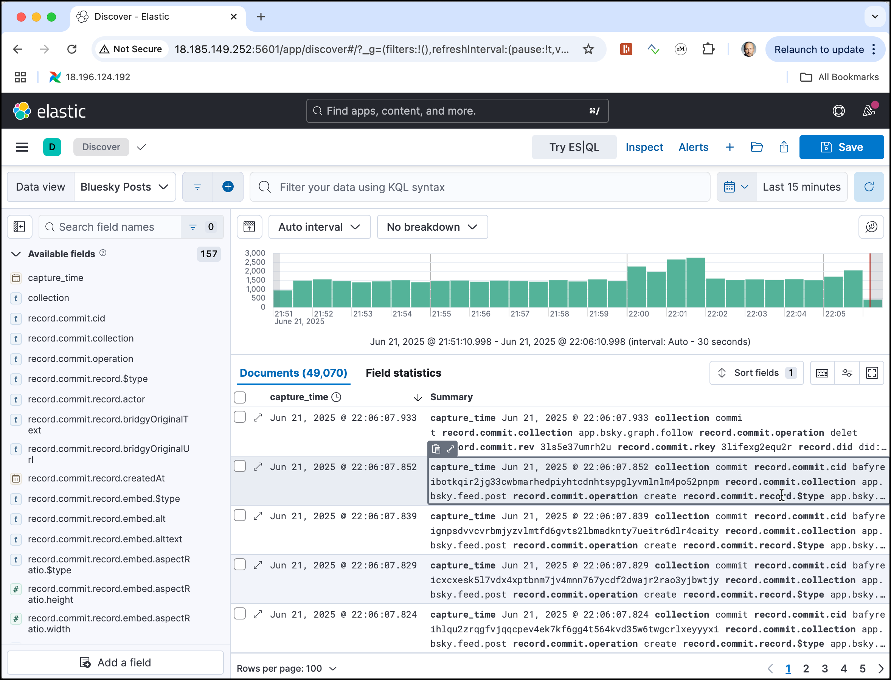

> **What you should see:** A histogram of message volume over the last 15 minutes and a table of individual documents below it.

> **What just happened?** Kibana queried Elasticsearch for all documents in the `app.bsky*` index pattern with a `capture_time` within the selected time range and rendered the results. Each row is one Bluesky post. You can expand a row to see all indexed fields, add columns to the table, and apply filters.

### Enable live refresh

Click the calendar icon to change the date range. Set the range to **Last 1 hour**. Again click on the calendar icon and now enable the **Refresh every** option and in the drop down choose **10** and **Seconds**.

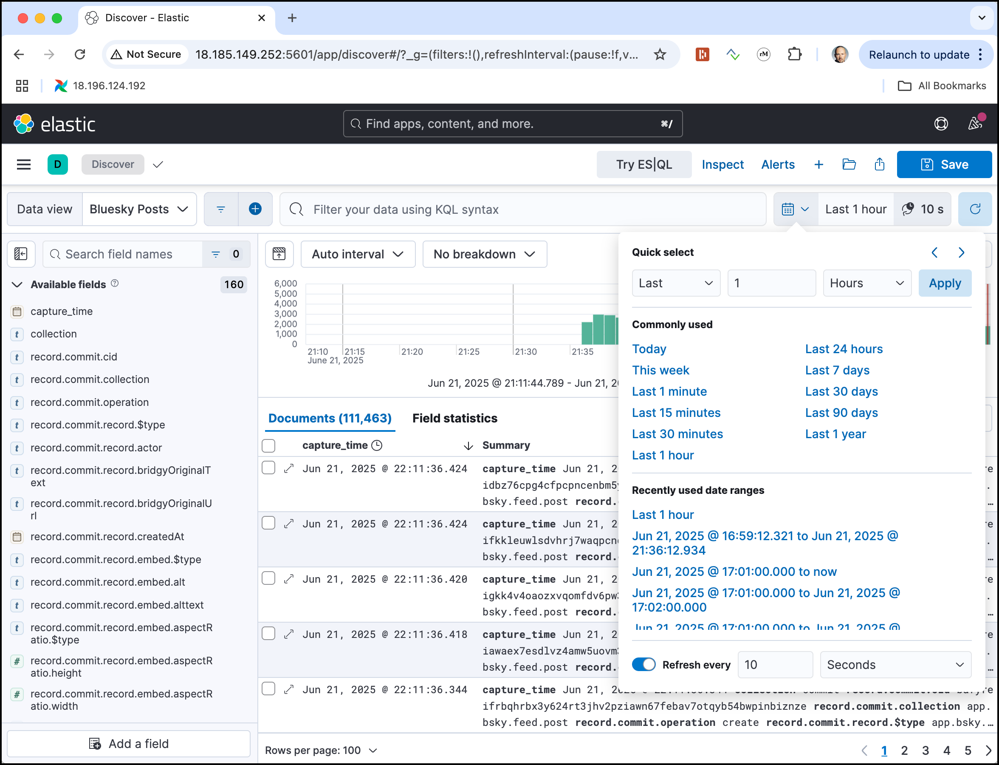

Click **Apply**.

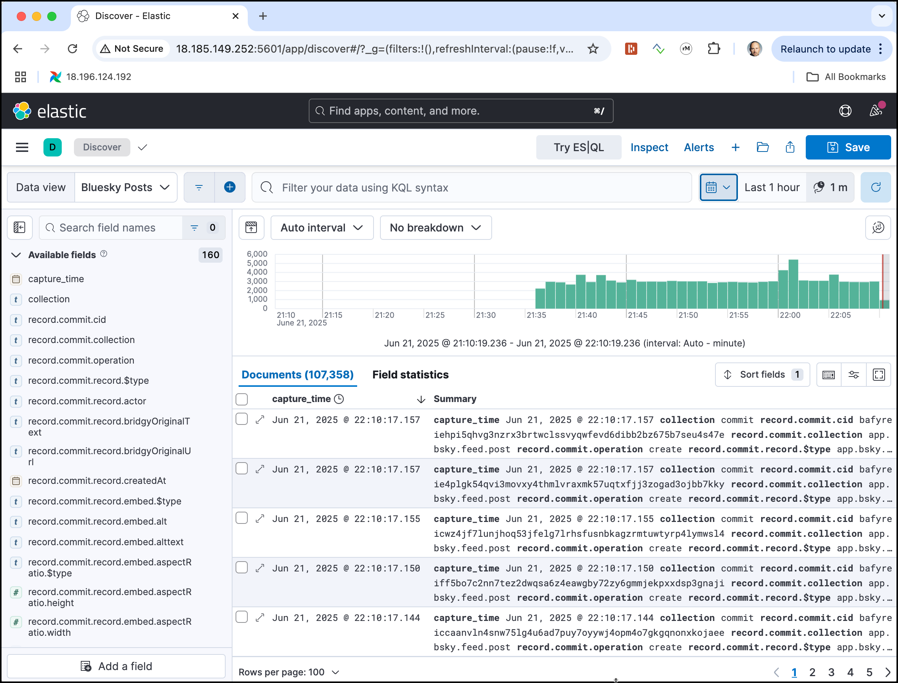

> **What you should see:** The histogram and document table refreshing every 10 seconds as new Bluesky posts flow through the pipeline and into Elasticsearch.

> **What just happened?** The full pipeline is now running end-to-end: BlueBird streams the Bluesky firehose into Kafka → NiFi routes posts to `app.bsky.feed.post` → Kafka Connect indexes each post in Elasticsearch → Kibana renders the data in near real time.
