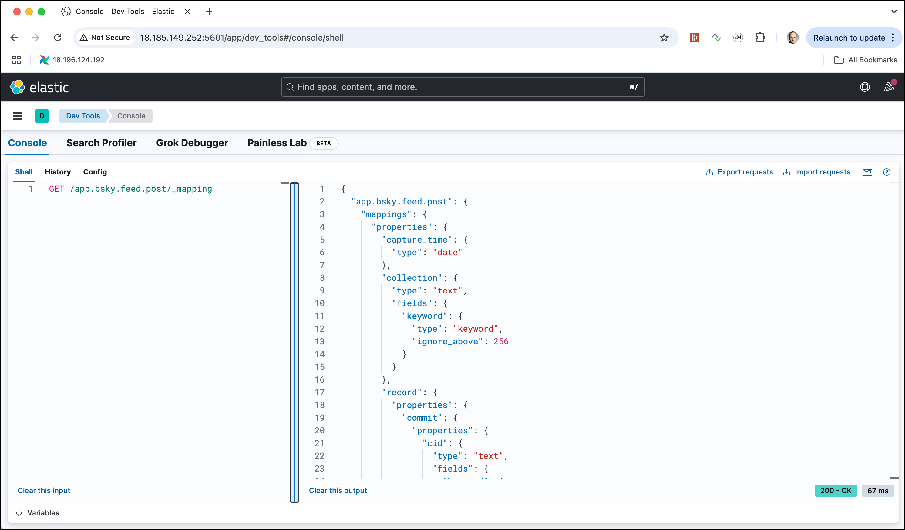

# Bluesky Workshop

In this workshop we will implement a streaming pipeline which gets live data from **Bluesky** and sends it through a Kafka topic to an Elasticsearch database for later retrieval. The solution architecture is shown in the diagram below.


## Run the Bluesky sensor

To consume from Bluesky, we are using [BlueBird](https://github.com/sdairs/bluebird), a CLI that consumes the Bluesky firehose and sends it to a downstream destination. A docker version is currently available here: <https://github.com/gschmutz/bluebird>. 

First let's create a Kafka topic, where the messages are stored

```bash
docker exec -ti kafka-1 kafka-topics --bootstrap-server kafka-1:19092 --create --topic bluesky.raw --replication-factor 3 --partitions 8
```

Now start it an use the Kafka connector to send the data to the the `bluesky.raw` topic. 

```bash
docker run --rm -e DESTINATION=kafka -e KAFKA_BROKERS=${PUBLIC_IP}:9092 -e KAFKA_TOPIC=bluesky.raw ghcr.io/gschmutz/bluebird:latest
```

If you use `kcat` to consume the message, you will see all the messages, posts, re-post as well as likes.

```bash
kcat -q -b ${PUBLIC_IP}:9092 -t bluesky.raw
```

and you will see each message is returned in JSON format on one line

```json
{"capture_time":"2025-06-21T13:22:46.129Z","collection":"commit","record":{"did":"did:plc:zcst3onihjpnxpyf4rjsh3qt","time_us":1750512166085866,"kind":"commit","commit":{"rev":"3ls4njxa3fe2h","operation":"create","collection":"app.bsky.feed.like","rkey":"3ls4njx7tle2h","record":{"$type":"app.bsky.feed.like","createdAt":"2025-06-21T13:22:43.960Z","subject":{"cid":"bafyreift5xmqtosgvuxguido5ewxpwhzityu6fuxp7trqmpx3zkhbqs7ta","uri":"at://did:plc:zlpy5nyw4b5zegs5pwjnnugo/app.bsky.feed.post/3ls4foifkck26"}},"cid":"bafyreiaqzqvwca3oecjcsbwejtmz5ekmzjqnf4wdb5xrjsffpv427qlzyi"}}}
{"capture_time":"2025-06-21T13:22:46.136Z","collection":"commit","record":{"did":"did:plc:5ocmuyqukecauelp3hq36vms","time_us":1750512166093217,"kind":"commit","commit":{"rev":"3ls4njx4tej2d","operation":"create","collection":"app.bsky.feed.like","rkey":"3ls4njx4hnj2d","record":{"$type":"app.bsky.feed.like","createdAt":"2025-06-21T13:22:45.753Z","subject":{"cid":"bafyreid7ld2afzkphbe75teeft73dcegcc7dhumdkyfvz4qptzbik5lx6i","uri":"at://did:plc:j5hrotody26iqi24hcusufxu/app.bsky.feed.post/3ls2z63to4k2f"}},"cid":"bafyreidtvt3vxlbo6ssfspw4em64x3uacvkomycgc3ahmvlpniwycv6okq"}}}
{"capture_time":"2025-06-21T13:22:46.142Z","collection":"commit","record":{"did":"did:plc:mluqrioua7nhafdiywhagfad","time_us":1750512166099415,"kind":"commit","commit":{"rev":"3ls4njxbz3e2w","operation":"create","collection":"app.bsky.feed.l^Cf24bw6sbnlbpnbjjmje2vdfsdjcdylbmtzubufdganq"}}}
```

We can pipe the result into `jq` to format the JSON

```bash
kcat -q -b ${PUBLIC_IP}:9092 -t bluesky.raw | jq
```

and you should see a result similar to the one shown below

```json
{
  "capture_time": "2025-06-21T13:22:39.851Z",
  "collection": "commit",
  "record": {
    "did": "did:plc:gjukhfoiduwko2gnhz2wak5a",
    "time_us": 1750512159808091,
    "kind": "commit",
    "commit": {
      "rev": "3ls4njrbimr27",
      "operation": "create",
      "collection": "app.bsky.feed.like",
      "rkey": "3ls4njrav3r27",
      "record": {
        "$type": "app.bsky.feed.like",
        "createdAt": "2025-06-21T13:22:38.492Z",
        "subject": {
          "cid": "bafyreiawaxbpvs25ebodxceew3pbitspa4b4qbli2zfigpiajqffexve3e",
          "uri": "at://did:plc:xnqnvmwuju4ipj7dehiuxonh/app.bsky.feed.post/3lrszdqh7es2r"
        }
      },
      "cid": "bafyreicgffww5agjqjtshxcpzdaei63mqywjo5kqt37dxuiv3pkuvij7ni"
    }
  }
}
{
  "capture_time": "2025-06-21T13:22:39.858Z",
  "collection": "commit",
  "record": {
    "did": "did:plc:6la2xxelm7jkxnd7zxrpjoj6",
    "time_us": 1750512159813319,
    "kind": "commit",
    "commit": {
      "rev": "3ls4njqdrxf2j",
      "operation": "create",
      "collection": "app.bsky.feed.post",
      "rkey": "3ls4nkl5gws2f",
      "record": {
        "$type": "app.bsky.feed.post",
        "createdAt": "2025-06-21T13:23:06.785Z",
        "embed": {
          "$type": "app.bsky.embed.images",
          "images": [
            {
              "alt": "",
              "aspectRatio": {
                "height": 720,
                "width": 1280
              },
              "image": {
                "$type": "blob",
                "ref": {
                  "$link": "bafkreiasfrbccsofoh4lofwqkegvknav24fft2zej5lk4ss64av7acsevu"
                },
                "mimeType": "image/jpeg",
                "size": 577634
              }
            },
            {
              "alt": "",
              "aspectRatio": {
                "height": 720,
                "width": 1280
              },
              "image": {
                "$type": "blob",
                "ref": {
                  "$link": "bafkreib2qwm2luzn4ch67wf4r6gfiukmknng6nkiso2yjevaxx3tmb6ghy"
                },
                "mimeType": "image/jpeg",
                "size": 769885
              }
            },
            {
              "alt": "",
              "aspectRatio": {
                "height": 720,
                "width": 1280
              },
              "image": {
                "$type": "blob",
                "ref": {
                  "$link": "bafkreie4oeae5abfx7duv2ri4ytbgsqfmk4u2tq6buv6xz6bhvsamqywlm"
                },
                "mimeType": "image/jpeg",
                "size": 305488
              }
            },
            {
              "alt": "",
              "aspectRatio": {
                "height": 720,
                "width": 1280
              },
              "image": {
                "$type": "blob",
                "ref": {
                  "$link": "bafkreiexsycpngm5uvbgh3ybygv3bupqdzob4eutvf3xjsen74vtuisvpm"
                },
                "mimeType": "image/jpeg",
                "size": 306416
              }
            }
          ]
        },
        "facets": [
          {
            "features": [
              {
                "$type": "app.bsky.richtext.facet#tag",
                "tag": "ポケモンSV"
              }
            ],
            "index": {
              "byteEnd": 38,
              "byteStart": 21
            }
          },
          {
            "features": [
              {
                "$type": "app.bsky.richtext.facet#tag",
                "tag": "テラレイドバトル"
              }
            ],
            "index": {
              "byteEnd": 69,
              "byteStart": 42
            }
          }
        ],
        "langs": [
          "ja"
        ],
        "text": "やっつけた。　＃ポケモンSV 　＃テラレイドバトル"
      },
      "cid": "bafyreiechola24vc7wcaznhmr6mymz2gxazorrylodwz6hc5aygvn2dhi4"
    }
  }
}
```

Each message contains not only the text but also some meta data.

The field `/record/commit/collection` contains the type of the message. Let's only select the value of this field

```bash
kcat -q -b ${PUBLIC_IP}:9092 -t bluesky.raw | jq .record.commit.collection
```

And we can see that we have seen `post`, `repost`, `like` and `follow` messages:

```
"app.bsky.feed.post"
"app.bsky.feed.like"
"app.bsky.feed.repost"
"app.bsky.feed.repost"
"app.bsky.graph.follow"
"app.bsky.feed.like"
"app.bsky.feed.like"
```

These are not all the types, there a few more. 

Let's use `jq` to `select` only the `app.bsky.feed.post` messages and now display only the `record/commit/record/text` field.

```bash
kcat -q -b ${PUBLIC_IP}:9092 -t bluesky.raw | jq 'select(.record.commit.collection == "app.bsky.feed.post") | .record.commit.record.text'
```

and we can see the post made in real-time

```
"DOGE + PALANTIR"
"I've been doing this ridiculous thing that I do where I read out of several books at the same time and it takes longer to finish them than if I just read one or two at a time. Although I'm making good progress on two of them."
"I cook them in Hong Kong regularly regardless of the temperature outside. Some things are just more important than climate, diet or life itself."
"365 days of movie via Tubi\nDay168: Big Trouble in Little China (1986)"
"Good morning it’s going into the 90’s here. New Jersey."
"And we're about to get another whole project of talks like this with Banjo-Tooie starting *today.*"
"Bin 100 pro bei euch."
"ADS will face significant budget cuts under the proposed NASA budget scixplorer.org/scixblog/ads..."
"6 years late but I have 2 flights today and I'm looking forward to my first read!\n@dan.nerdcubed.co.uk #fuckyeahvideogames"
"Iirc it didn't get much traction as the toys of it didn't sell well"
```

With the bluesky messages in Kafka, let's create the connector to store them in Elasticsearch. 

## Use NiFi to route message by type (collection) to dedicated Kafka topic

For the routing of the bluesky messages by type (collection) to a dedicated kafka topic we will be using [Apache NiFi](http://nifi.apache.org).

In a browser navigate to <https://dataplatform:18083/nifi> (make sure to replace `dataplatform` by the IP address of the machine where docker runs on). The dataplatform enabled authentication for NiFi, therefore you have to use https to access it. Due to the use of a self-signed certificate, you have to initially confirm that the page is safe and you want to access the page.


Enter `nifi` into the **User** field and `1234567890ACD` into the **Password** field and click **LOG IN**.

This should bring up the NiFi User Interface, which at this point is a blank canvas for orchestrating a data flow.


Now you can add **Processor**s to create the pipeline. 

Let's start with the Kafka consumer. 

### Adding a `ConsumeKafka` Processor

We can now begin creating our data flow by adding a Processor to our canvas. To do this, drag the Processor icon from the top-left of the screen into the middle of the canvas and drop it there. 


This will give us a dialog that allows us to choose which **Processor** we want to add. We can see that there are a total of 290 processors currently available. We can browse through the list or use **filter types** box to filter-down to one or more processors.


Enter **ConsumeK** into the search field and the list will be reduced to 3 processors, the **ConsumeKafka** the **ConsumeKinesisStream** and the **PublishKafka** processor. As the name implies, the first one can be used to consume messages from a Kafka cluster. Navigate to the **ConsumeKafka** and click **Add**.

You should now see the canvas with the **ConsumeKafka** processor. A yellow marker is shown on the processor, telling that the processor is not yet configured properly. 

Double-click on the **ConsumeKafka** processor and the **Settings** page of the processor appears. Here you can change the name of the processor among other general properties.

Click on **Properties** tab to switch to the properties page.

On the properties page, we configure the properties for consuming messages from Kafka.  

Set the properties as follows:

  * **Kafka Connection Service**: click on the 3 points, select **+ Create new service** and select **Kafka3ConnectionService** and click **Add**. Click again on the 3 points and select **Go To Service**. On the newly created service in the list, click on the 3 points and select **Edit** and fill out the details of the connection service
  	* **Bootstrap Servers**: `kafka-1:19092`

  Click **Apply** and click on the 3 points right to the service and select **Enable** to enable the new service. Click on **Close** and **Back to Service**.
  * **Group ID**: `bluesky.raw-cg`
  * **Topics**: `bluesky.raw`
  * **Processing Strategy**: `RECORD`
  * **Record Reader**: click on the 3 points, select **+ Create new service** and select **JsonTreeReader** and click **Add**. Click again on the 3 points and select **Go To Service**. On the newly created service in the list, click on the 3 points and select **Enable**. Click on **Close** and **Back to Service**.
  * **Record Writer**: click on the 3 points, select **+ Create new service** and select **JsonRecordSetWriter** and click **Add**. Click again on the 3 points and select **Go To Service**. On the newly created service in the list, click on the 3 points and select **Edit** and fill out the details of the record writer service
  	* **Output Grouping**: `One Line per Object`
  Click **Apply** and click on the 3 points right to the service and select **Enable** to enable the new service. Click on **Close** and **Back to Service**.
  
The **Configure Processor** should look as shown below


Click **Apply** to close the window.

The `ConsumeKafka` processor still shows the yellow marker, this is because the out-going relationship is neither used nor terminated. Of course we want to use it, but for that we first need another Processor to publish the messages to the Kafka topics. 

### Adding a `PublishKafka` Processor

Drag a new Processor onto the Canvas, just below the **ConsumeKafka** processor. 

Enter **PublishK** into the **Filter types** field on top left. The `PublishKafka` will be shown as ell as the **ConsumeKafka**.

Select the **PublishKafka** processor and click on **Add** to add it to the canvas as well. The canvas should now look like shown below. You can drag around the processor to organize them in the right order. It is recommended to organize the in main flow direction, either top-to-bottom or left-to-right. 


Let's configure the new processor. Double-click on the `PublishKafka` and navigate to **Properties**. Enter the following values:

  * **Kafka Connection Service**: click on the value and from the drop-down listbox select `Kafka3ConnectionService` and click **Ok**
  * **Topic Name**: `${topicName}` (this is an expression and refers to the variable `topicName`, which we will set with another processor)
  * **Record Reader**: click on the value and from the drop-down listbox select `JsonTreeReader` and click **Ok**
  * **Record Writer**: click on the value and from the drop-down listbox select `JsonRecordSetWriter` and click **Ok**

Click **Apply** to leave the configuration settings.

We will use the value of the `/record/commit/collection` as the target topic name. Let's use an `EvaluateJsonPath` processor to get this value and store it in the `topicName` variable.

### Set Variable using `EvaluateJsonPath` processor

Drag a `EvaluateJsonPath` processor onto the Canvas, in between the **ConsumeKafka** and **PublishKafka** processor. 

Double click on the processor and navigate to the **Properties** tab. This time we don't have to update existing properties. Rather we will create a new property by clicking on the **+** in the upper right corner of the properties. In the pop-up dialog window, enter `topicName` into the **Property Name** field and click **Ok**. Enter `$.record.commit.collection` into the edit field and click **Ok**. Click **Apply** to close the processor. 

### Connecting the first two Processors

Drag a connection from the **ConsumeKafka** processor to the **EvaluateJsonPath** and drop it. 


Make sure that the `success` **Relationship** is enabled and click **Add**. The **ConsumeKafka** still has an warning marker, because the **parse failure** relationship is not used. Double click on the **ConsumeKafka** processor, navigate to **Relationships** and click **terminate** on the **parse failure** relationship. Click **Apply** and now the marker is replaced by a red stopped icon. 

We can not directly connnect to the **PublishKafka**, as we only want to route the messages for this 5 collections: `app.bsky.feed.post`, `app.bsky.feed.repost`, `app.bsky.feed.like`, `app.bsky.graph.follow` and `app.bsky.actor.profile`. All the others should be ignored. 

We can use a `RouteOnAttribute` processor for that. 

### Adding a `RouteOnAttribute` Processor

Drag a new Processor onto the Canvas, just below the **EvaluateJsonPath** processor. 

Enter **RouteOn** into the **Filter types** field on top left and select the **RouteOnAttribute** processor. Click **Add** to place it on the canvas.

Double-click and naviagate to the **Properties** tab. Again we don't have to update existing properties. Rather we will create a new property by clicking on the **+** in the upper right corner of the properties. In the pop-up dialog window, enter `passOn` into the **Property Name** field and click **Ok**. Enter `${topicName:in("app.bsky.feed.post","app.bsky.feed.repost","app.bsky.feed.like", "app.bsky.graph.follow", "app.bsky.actor.profile")}` into the edit field and click **Ok**. Click **Apply** to close the processor. 

Now we have all the processors in place, all which is left to do is connect them together. 

Drag a connection from **EvaluateJsonPath** to **RouteOnAttribute** and select the **matched** relationship and click **Add**. The other 2 relationship we have to terminate on that processor. Double click on the **EvaluateJsonPath** processor, navigate to **Relationships** and click on **terminate** for the **failure** and **unmatche** relationship. Click **Apply** and now the marker on the processor is replaced by a red stopped icon. 

Last but not least, Drag a connection from **RouteOnAttribute** to **PublishKafka** and select the **passOn** relationship and click **Add**. This relationship exists because we added it when we defined the **RouteOnAttribute** processor above. Double click on the **RouteOnAttribute** processor, navigate to **Relationships** and click on **terminate** for the **unmatche** relationship. Click **Apply** and now the marker on the processor is replaced by a red stopped icon. Let's also terminate all the relationship of the **PublishKafka** processor, by double clicking on the **PublishKafka** processor, navigate to **Relationships** and click on **terminate** for the **failure** and **success** relationship. Click **Apply**. 

Now our data flow is ready, so let's run it. 

But before we can do that, we have to create the 5 target Kafka topics

```bash
docker exec -ti kafka-1 kafka-topics --bootstrap-server kafka-1:19092 --create --topic app.bsky.feed.post
 --replication-factor 3 --partitions 8
 
docker exec -ti kafka-1 kafka-topics --bootstrap-server kafka-1:19092 --create --topic app.bsky.feed.repost
 --replication-factor 3 --partitions 8
 
docker exec -ti kafka-1 kafka-topics --bootstrap-server kafka-1:19092 --create --topic app.bsky.feed.like
 --replication-factor 3 --partitions 8 
 
docker exec -ti kafka-1 kafka-topics --bootstrap-server kafka-1:19092 --create --topic app.bsky.graph.follow
 --replication-factor 3 --partitions 8 
 
docker exec -ti kafka-1 kafka-topics --bootstrap-server kafka-1:19092 --create --topic app.bsky.actor.profile
 --replication-factor 3 --partitions 8   
```

### Starting the Data Flow 

Select all 4 processors (click ctrl-A) and navigate to the start arrow and click on it


Let's check if the messages arrive in one of the topics. Let's try the one with the **Posts**:

we can either pretty print the whole json using `jq`

```bash
kcat -q -b ${PUBLIC_IP}:9092 -t app.bsky.feed.post | jq
```

or only display the `text` field with

```bash
kcat -q -b ${PUBLIC_IP}:9092 -t app.bsky.feed.post | jq '.record.commit.record.text'
```

In both cases you should see the new posts being published.

Now let's use Kafka Connect to store the bluesky posts in Elasticsearch so that they can be visualized using Kibana.

## Using Kafka Connect to send data to Elasticsearch

The messages in Kafka topic `app.bsky.feed.post` for the bluesky posts look similar to the example shown below

```json
{
  "capture_time": "2025-06-21T13:23:10.874Z",
  "collection": "commit",
  "record": {
    "did": "did:plc:yz42tmpgmr67472ropqltass",
    "time_us": 1750512190830536,
    "kind": "commit",
    "commit": {
      "rev": "3ls4nko6eqp2f",
      "operation": "create",
      "collection": "app.bsky.feed.post",
      "rkey": "3ls4nkn2h3k2k",
      "record": {
        "$type": "app.bsky.feed.post",
        "createdAt": "2025-06-21T13:23:08.798Z",
        "embed": {
          "$type": "app.bsky.embed.external",
          "external": {
            "description": "The president has repeatedly touted actions and decisions that are coming \"in two weeks\" since his first term in office. Some never materialized.",
            "thumb": {
              "$type": "blob",
              "ref": {
                "$link": "bafkreihmrhcgbzng3naakbequladvr6rqlcdrhq533c7ay4ajzoreqkcym"
              },
              "mimeType": "image/jpeg",
              "size": 705040
            },
            "title": "Two weeks' notice: Trump's deadline on Iran is a familiar one",
            "uri": "https://www.nbcnews.com/politics/donald-trump/two-weeks-notice-trumps-deadline-iran-familiar-one-rcna214089"
          }
        },
        "facets": [
          {
            "features": [
              {
                "$type": "app.bsky.richtext.facet#tag",
                "tag": "TACODon"
              }
            ],
            "index": {
              "byteEnd": 44,
              "byteStart": 36
            }
          },
          {
            "features": [
              {
                "$type": "app.bsky.richtext.facet#tag",
                "tag": "Trump"
              }
            ],
            "index": {
              "byteEnd": 116,
              "byteStart": 110
            }
          },
          {
            "features": [
              {
                "$type": "app.bsky.richtext.facet#tag",
                "tag": "TheIrresoluteDesk"
              }
            ],
            "index": {
              "byteEnd": 135,
              "byteStart": 117
            }
          },
          {
            "features": [
              {
                "$type": "app.bsky.richtext.facet#tag",
                "tag": "Iran"
              }
            ],
            "index": {
              "byteEnd": 141,
              "byteStart": 136
            }
          }
        ],
        "langs": [
          "en"
        ],
        "text": "👇🇺🇸Everything Is Two Weeks #TACODon \n\"Two weeks' notice: Trump's deadline on Iran is a familiar one\" #Trump #TheIrresoluteDesk #Iran"
      },
      "cid": "bafyreigybdeaegvkt6b3xo4vukq7e373hgd242dk7netzgqlea6pqh6qzu"
    }
  }
}
```

The Kafka Connect connector for working with Elasticsearch is the [Confluent Elasticsearch Sink Connector for Confluent Platform](https://docs.confluent.io/current/connect/kafka-connect-elasticsearch/index.html). 

It is available under the **Confluent Community License Agreement** and pre-loaded with the Kafka Connect cluster of the Data Platform. 

Let's confirm that by using the Kafka Connect REST API

```
curl -XGET http://dataplatform:8083/connector-plugins | jq
```

We can also view the avaialble connectors using the [Kafka Connect UI](http://dataplatform:28103/#/cluster/kafka-connect-1). If you click on **New** then on the page you should see the 

 

You can see the **Elasticsearch** Sink connector, ready to be used. 

We can either start it through the Kafka Connect UI by clicking on **New** or by using the REST API of Kafka Connect. For this workshop we will use the REST API.

In the `scripts` folder, create a file `start-elasticsearch.sh` and add the code below.  

```
#!/bin/bash

echo "removing Elasticsearch Sink Connector"

curl -X "DELETE" http://dataplatform:8083/connectors/elasticsearch-bluesky-sink

echo "creating Elasticsearch Sink Connector"

curl -X PUT \
  http://dataplatform:8083/connectors/elasticsearch-bluesky-sink/config \
  -H 'Content-Type: application/json' \
  -H 'Accept: application/json' \
  -d '{
  "connector.class": "io.confluent.connect.elasticsearch.ElasticsearchSinkConnector",
  "type.name": "_doc",
  "tasks.max": "1",
  "topics": "app.bsky.feed.post",
  "connection.url": "http://elasticsearch-1:9200",
  "key.ignore": "true",
  "key.converter": "org.apache.kafka.connect.storage.StringConverter",
  "schema.ignore": "true",
  "type.name": "kafkaconnect",
  "value.converter": "org.apache.kafka.connect.json.JsonConverter",
  "value.converter.schemas.enable": "false",
  "value.converter.schema.registry.url": "http://schema-registry-1:8081",
  "errors.tolerance": "all",
  "errors.log.include.messages": "true",
  "errors.deadletterqueue.topic.name": "es-sink.bluesky.dlq",
  "errors.log.enable": "false",
  "behavior.on.malformed.documents": "ignore",
  "drop.invalid.message": "true",
  "behavior.on.null.values": "IGNORE"
}'
```

We configure the connector to read from the topic `app.bsky.feed.post` and write messages to the Elasticsearch datastore. 

Also create a separate script `stop-elasticsearch.sh` for just stopping the connector and add the following code:

```
#!/bin/bash

echo "removing Elasticsearch Sink Connector"

curl -X "DELETE" http://dataplatform:8083/connectors/elasticsearch-sink
```

Make sure that the both scripts are executable

```
sudo chmod +x start-elasticsearch.sh
sudo chmod +x stop-elasticsearch.sh
```

### Start the Elasticsearch connector

Finally let's start the connector by running the `start-elasticsearch` script.

```bash
./start-elasticsearch.sh
```

The connector will consume the JSON messages, automatically create an Elasticsearch Index, register the Index Mapping (which is based on the JSON structure) and stores the bluesky posts as documents into the Elasticsearch datastore.

We can see that documents have been added by using the Elasticsearch API 

```bash
curl ${PUBLIC_IP}:9200/app.bsky.feed.post/_search
```

and you should see a result similar to the one below

```
{"took":2,"timed_out":false,"_shards":{"total":1,"successful":1,"skipped":0,"failed":0},"hits":{"total":{"value":10000,"relation":"gte"},"max_score":1.0,"hits":[{"_index":"app.bsky.feed.post","_id":"app.bsky.feed.post+0+73579","_score":1.0,"_ignored":["record.commit.record.text.keyword"],"_source":{"record":{"kind":"commit","commit":{"rev":"3ls4w46437p26","record":{"createdAt":"2025-06-21T15:56:07.666Z","langs":["en"],"embed":{"record":{"uri":"at://did:plc:fjhfhnkmshnyqbjjaqwcgnd4/app.bsky.feed.post/3lrfqm56uzk2k","cid":"bafyreibxlkz3bzjofvierrtgyuezceadlblnk52n5emtsixedfb5v32dmy"},"$type":"app.bsky.embed.record"},"text":"@dbarba77.bsky.social\nMy children are asking if we'll eat today, and I have no answer; we have no food, no shelter, no medicine, and with no money, we are living in real misery. Please, any help would be a glimmer of hope for us in these difficult circumstances.\nbsky.app/profile/help...","$type":"app.bsky.feed.post","facets":[{"features":[{"did":"did:plc:3qrjvgkhzt6vd7disghmyuzc","$type":"app.bsky.richtext.facet#mention"}],"index":{"byteEnd":21,"byteStart":0},"$type":"app.bsky.richtext.facet"},{"features":[{"uri":"https://bsky.app/profile/helpmykids2.bsky.social/post/3lrfqm56uzk2k","$type":"app.bsky.richtext.facet#link"}],"index":{"byteEnd":287,"byteStart":263}}]},"rkey":"3ls4w46pafc27","collection":"app.bsky.feed.post","operation":"create","cid":"bafyreigylu7bpmosxffgctjvscm6puyyug2r3dypp7cxbl55twlhlejve4"},"did":"did:plc:cdrqrnvlxhtzrvjgbftpcpmb","time_us":1750521367720208},"collection":"commit","capture_time":"2025-06-21T15:56:07.766Z"}},{"_index":"app.bsky.feed.post","_id":"app.bsky.feed.post+0+73662","_score":1.0,"_source":{"record":{"kind":"commit","commit":{"rev":"3ls4w4g5eeo2d","record":{"createdAt":"2025-06-21T15:56:16.530Z","langs":["de"],"embed":{"external":{"description":"","title":"Nachttische, Gehilfen und andere Gegenstände für das Altenheim Vradiyivka – Ukrainehilfe Hamburg","uri":"https://ukrainehilfe-hamburg.de/2025/2025-ankunft-der-spenden-in-der-ukraine/nachttische-gehilfen-und-andere-gegenstaende-fuer-das-altenheim-vradiyivka"},"$type":"app.bsky.embed.external"},"text":"Nachttische, Gehilfen und andere Gegenstände für das Altenheim Vradiyivka\n\nukrainehilfe-hamburg.de/2025/2025-an...","$type":"app.bsky.feed.post","facets":[{"features":[{"uri":"https://ukrainehilfe-hamburg.de/2025/2025-ankunft-der-spenden-in-der-ukraine/nachttische-gehilfen-und-andere-gegenstaende-fuer-das-altenheim-vradiyivka","$type":"app.bsky.richtext.facet#link"}],"index":{"byteEnd":116,"byteStart":77}}]},"rkey":"3ls4w4h5qnc2m","collection":"app.bsky.feed.post","operation":"create","cid":"bafyreigq7lfw25zxly3brtpa7arzoe5zqcb72gumbevvo47ajcspie3qjy"},"did":"did:plc:q6o2msn6axynyhgllv5sd5j5","time_us":1750521375644236},"collection":"commit","capture_time":"2025-06-21T15:56:15.688Z"}},{"_index":"app.bsky.feed.post","_id":"app.bsky.feed.post+0+73663","_score":1.0,"_source":{"record":{"kind":"commit","commit":{"rev":"3ls4w4cg2tj2a","record":{"createdAt":"2025-06-21T15:56:06.621Z","langs":["en"],"text":"Affe acordei muito tarde hoje e não consegui ver o volei","$type":"app.bsky.feed.post","facets":[],"tags":[]},"rkey":"3ls4w4cfm6r2a","collection":"app.bsky.feed.post","operation":"create","cid":"bafyreihgfp6jlyhj46hh53uzir5nmjvwtcmy7gk5twyyglgh3nxrddofzq"},"did":"did:plc:wpjcjplyd3asxr4ssckkuaq5","time_us":1750521371715244},"collection":"commit","capture_time":"2025-06-21T15:56:11.760Z"}},{"_index":"app.bsky.feed.post","_id":"app.bsky.feed.post+0+73582","_score":1.0,"_source":{"record":{"kind":"commit","commit":{"rev":"3ls4w464j5n27","record":{"createdAt":"2025-06-21T15:56:06Z","embed":{"external":{"thumb":{"ref":{"$link":"bafkreiahlmshufppeq5l42n6h7smtdlrhdtpelx3om3nzwodee3qoudr44"},"size":76237,"mimeType":"image/jpeg","$type":"blob"},"description":"90.00 USD\n\nVintage Chess Piece Horse Clip On Earrings, 1950's 1960's Jewelry\n\nMeasurements\nLength - 3/4 inch\nWidth - 7/8 inch\n\nIn very good vintage condition.\nGold tone metal.\nA nice addition to any collection.\n\nD186","title":"Vintage Chess Piece Horse Clip On Earrings, 1950's 1960's Jewelry by MartiniMermaid","uri":"http://dlvr.it/TLTkht"},"$type":"app.bsky.embed.external"},"text":"","$type":"app.bsky.feed.post"},"rkey":"3ls4w4644hf27","collection":"app.bsky.feed.post","operation":"create","cid":"bafyreiceq4nskjopsh3u3akdfbj7tl7al45xpcgypzgquinit4q2wos5p4"},"did":"did:plc:ngxcyqf3f2o6y5fnd3tudfc6","time_us":1750521369075477},"collection":"commit","capture_time":"2025-06-21T15:56:09.119Z"}},{"_index":"app.bsky.feed.post","_id":"app.bsky.feed.post+0+73583","_score":1.0,"_source":{"record":{"kind":"commit","commit":{"rev":"3ls4w47i7zo2c","record":{"createdAt":"2025-06-21T15:56:08.000Z","langs":["en"],"text":"Hobbit ass names","reply":{"parent":{"uri":"at://did:plc:6yhcuwmohgsz7hbshjtmnb6t/app.bsky.feed.post/3ls4vyiflrc2t","cid":"bafyreignhrg5ob5o4viiwe76jiiore2rm52xicvmlhpdq4oaxt4u44xyju"},"root":{"uri":"at://did:plc:6yhcuwmohgsz7hbshjtmnb6t/app.bsky.feed.post/3ls4vyiflrc2t","cid":"bafyreignhrg5ob5o4viiwe76jiiore2rm52xicvmlhpdq4oaxt4u44xyju"}},"$type":"app.bsky.feed.post","facets":[]},"rkey":"3ls4w47hjqcpb","collection":"app.bsky.feed.post","operation":"create","cid":"bafyreifq6mbr6u2oailr5up2zuuwaizdzhqsl5nw735s5nievn4ydlyhqi"},"did":"did:plc:ivl4btgba324e2vqqprwcxhf","time_us":1750521368620860},"collection":"commit","capture_time":"2025-06-21T15:56:08.665Z"}},{"_index":"app.bsky.feed.post","_id":"app.bsky.feed.post+0+73584","_score":1.0,"_source":{"record":{"kind":"commit","commit":{"rev":"3ls4w47ayvd27","record":{"createdAt":"2025-06-21T15:56:09.306Z","langs":["de"],"embed":{"external":{"description":"","title":"Kosiv Zentral-Bezirkskrankenhaus erhielt Desinfektionsmittel – Ukrainehilfe Hamburg","uri":"https://ukrainehilfe-hamburg.de/2025/2025-ankunft-der-spenden-in-der-ukraine/kosiv-zentral-bezirkskrankenhaus-erhielt-Desinfektionsmittel"},"$type":"app.bsky.embed.external"},"text":"Kosiv Zentral-Bezirkskrankenhaus erhielt Desinfektionsmittel\n\nukrainehilfe-hamburg.de/2025/2025-an...","$type":"app.bsky.feed.post","facets":[{"features":[{"uri":"https://ukrainehilfe-hamburg.de/2025/2025-ankunft-der-spenden-in-der-ukraine/kosiv-zentral-bezirkskrankenhaus-erhielt-Desinfektionsmittel","$type":"app.bsky.richtext.facet#link"}],"index":{"byteEnd":101,"byteStart":62}}]},"rkey":"3ls4w4abbxc2m","collection":"app.bsky.feed.post","operation":"create","cid":"bafyreigof2zal6yq7totdhpfagnleuniflwgbacgc3dp5m5nyf3aappkti"},"did":"did:plc:q6o2msn6axynyhgllv5sd5j5","time_us":1750521368402786},"collection":"commit","capture_time":"2025-06-21T15:56:08.448Z"}},{"_index":"app.bsky.feed.post","_id":"app.bsky.feed.post+0+73585","_score":1.0,"_source":{"record":{"kind":"commit","commit":{"rev":"3ls4w464llg25","record":{"createdAt":"2025-06-21T15:56:06.149Z","langs":["en"],"embed":{"record":{"uri":"at://did:plc:osevlq4avqaxvyyvb7hzckml/app.bsky.feed.post/3ls3tqaqlfs2z","cid":"bafyreif6v7aectqsj6zqdxrbngciynfnfv62ozd2e6uys4fby7f6i6taau"},"$type":"app.bsky.embed.record"},"text":"THIS RIGHT HERE‼️\uD83C\uDFAF","$type":"app.bsky.feed.post"},"rkey":"3ls4w45axwc2c","collection":"app.bsky.feed.post","operation":"create","cid":"bafyreibkv4bxp4art4csdp67kknutqdv45gvrgsb3bnxgx346piygowxsu"},"did":"did:plc:goe7jlyabuakr7zd473vmfr4","time_us":1750521367642454},"collection":"commit","capture_time":"2025-06-21T15:56:07.686Z"}},{"_index":"app.bsky.feed.post","_id":"app.bsky.feed.post+0+73547","_score":1.0,"_source":{"record":{"kind":"commit","commit":{"rev":"3ls4w3yuf5k2j","record":{"createdAt":"2025-06-21T15:56:01.178Z","text":"どぎち","$type":"app.bsky.feed.post"},"rkey":"3ls4w3yu5dk2j","collection":"app.bsky.feed.post","operation":"create","cid":"bafyreibx7v3xtsfvft5jhcezaoi5ezpldzr2vmvvg54c3izwmvyf4n3fe4"},"did":"did:plc:mbz7u54y4mfoz4fjymh4gyqb","time_us":1750521361777742},"collection":"commit","capture_time":"2025-06-21T15:56:01.822Z"}},{"_index":"app.bsky.feed.post","_id":"app.bsky.feed.post+0+73548","_score":1.0,"_source":{"record":{"kind":"commit","commit":{"rev":"3ls4w3z3kfc2p","record":{"createdAt":"2025-06-21T15:56:01.581Z","text":"Fail status check.\nName:本番API\nStatus:Too Many Requests","$type":"app.bsky.feed.post"},"rkey":"3ls4w3z33qk2p","collection":"app.bsky.feed.post","operation":"create","cid":"bafyreihsmsi63y27mjuc5fle7ya2fgyra27w4uqe5yfpdrfpigwzxnjjhq"},"did":"did:plc:klqa33aduuwtf5lsvco77gnt","time_us":1750521362180631},"collection":"commit","capture_time":"2025-06-21T15:56:02.224Z"}},{"_index":"app.bsky.feed.post","_id":"app.bsky.feed.post+0+73712","_score":1.0,"_source":{"record":{"kind":"commit","commit":{"rev":"3ls4w4ejzw52c","record":{"createdAt":"2025-06-21T15:56:12.989Z","langs":["en"],"text":"\uD83E\uDD72","$type":"app.bsky.feed.post"},"rkey":"3ls4w4dron22t","collection":"app.bsky.feed.post","operation":"create","cid":"bafyreidaqx6lnlsllkkisk2z7257iw7jrkidz52y6qw54ym5fkyb35rbv4"},"did":"did:plc:f7b6r344hpvh5bdqil7vykhe","time_us":1750521374019215},"collection":"commit","capture_time":"2025-06-21T15:56:14.063Z"}}]}}ubuntu@ip-172-26-6-222:~$
```

We can see the first few documents which are stored by Elasticsearch, in a not very user-friendly way, Elasticsearch API returns the data as JSON and this would be the interface you use to integrate with a custom application. Later we will use Kibana, a nice UI for working with Elasticsearch. 

### Elasticsearch Mapping

You can check the index and the registered mapping by navigating to the [Kibana Dev Tools UI](http://dataplatform:5601/app/dev_tools#/console). In the console enter `GET /app.bsky.feed.post/_mapping` and execute it. 

 

The mapping describes how a document, and the fields it contains, are stored and indexed in Elasticsearch. For instance it defines which string fields should be treated as full text fields, which fields contain numbers or dates and the format of date values. 
It has been created based on the Json structure for the Bluesky post message.

With the data properly indexed in Elasticsearch, let's see how we can visualize it using Kibana.

## Visualize Posts using Kibana

[Kibana](https://www.elastic.co/kibana) is part of the so called [ELK-Stack](https://www.elastic.co/elastic-stack) and can be used to visualize the data stored in Elasticsearch. 

In a browser, navigate to <http://dataplatform:5601>

 

Click on the **Analytics** tile to navigate to the Analytics view.

 

You should get a message saying that there is data in Elasticsearch ready to be explored. Click **Create data view** to create an index pattern.

Enter `Bluesky Posts` **Name** field and `app.bsky*` into the **Index pattern** field. Navigate to the **Timestamp field** drop-down list and select `capture_time`. 

 
 
Click **Save data view to Kibana**. 

 

Click on the **Discover** tile and you will see the data over the last 15 minutes

 
 
[Discover](https://www.elastic.co/guide/en/kibana/current/discover.html) enables you to explore your data, find hidden insights and relationships, and get answers to your questions.

Click on the calendar icon to change the date range and to enable automatic refresh to see the live data "arriving". Let's set the range to **1 hour** and switch to automatic refresh and select a refresh rate of 10 **Seconds**.

 

Click **Apply** and you should see the data update every 10 seconds.


