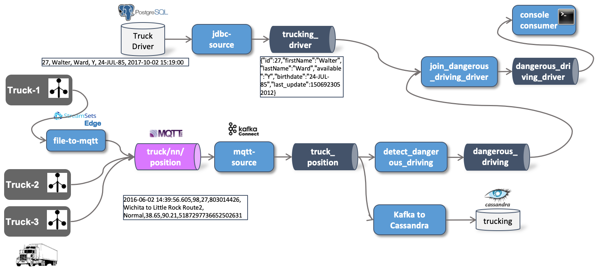

# IoT Data Ingestion and Analytics

In this workshop we will be ingesting IoT data into a Kafka topic from which it will be analyzed using Stream Analytics. To make it a bit more realistic, the data is not directly sent to Kafka from the IoT devices (vehicles) but first sent through an MQTT broker (IoT gateway). 

The following diagram shows the setup of the data flow we will be implementing. Of course we will not be using real-life data, but have a program simulating trucks and their driving behviour.

We will implement this end-to-end demo case step by step using different technologies. The links to the separate documents can be found as follows:

1. [Ingesting IoT Datastream into MQTT](../05a-iot-data-ingestion-into-mqtt/README.md)
2. [Moving Data from MQTT into Kafka](../05b-iot-data-ingestion-mqtt-to-kafka/README.md)
3. [Stream Processing using ksqlDB](../05c-stream-processing-using-ksql/README.md)
4. [Ingesting and Joining Static Data to Stream](../05d-static-data-ingestion/README.md)
