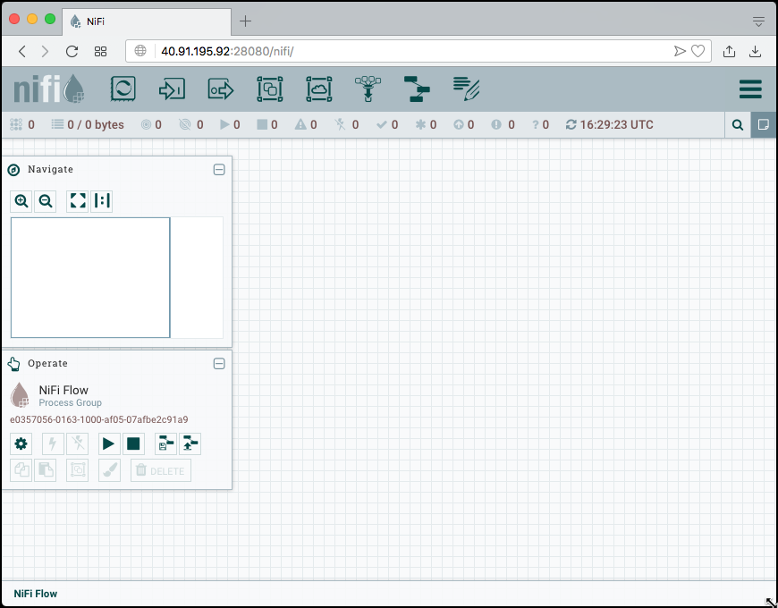
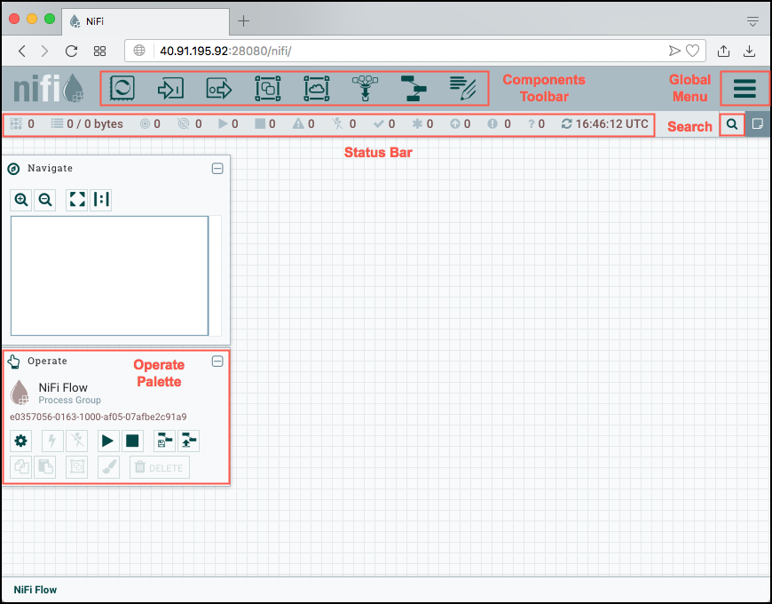
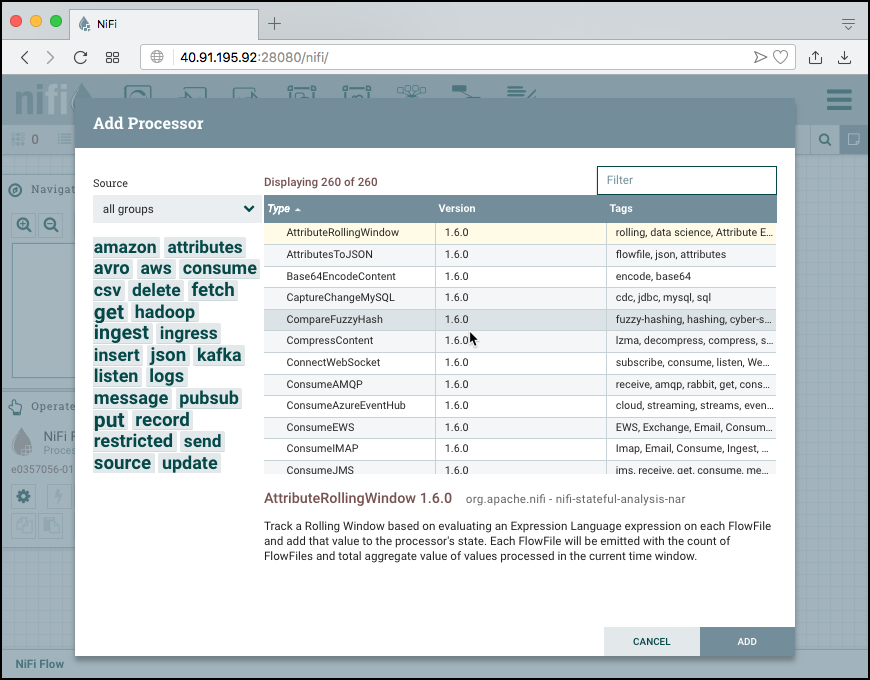
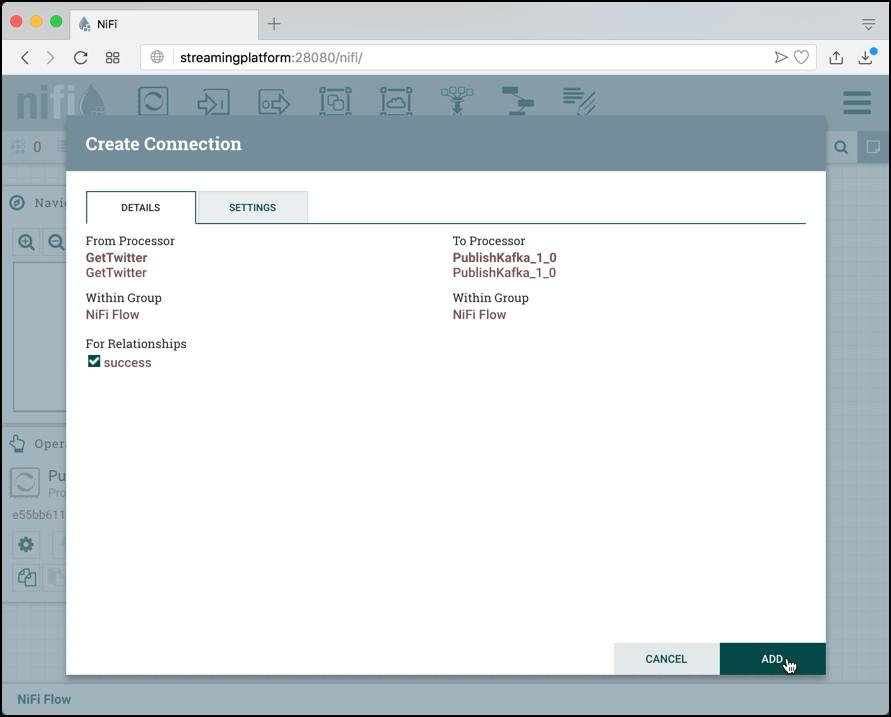
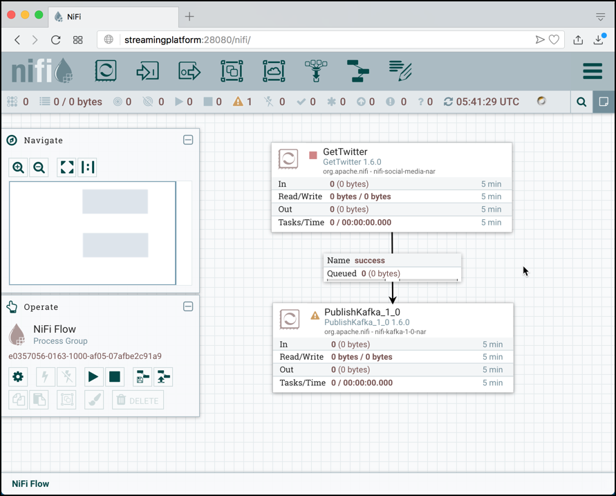
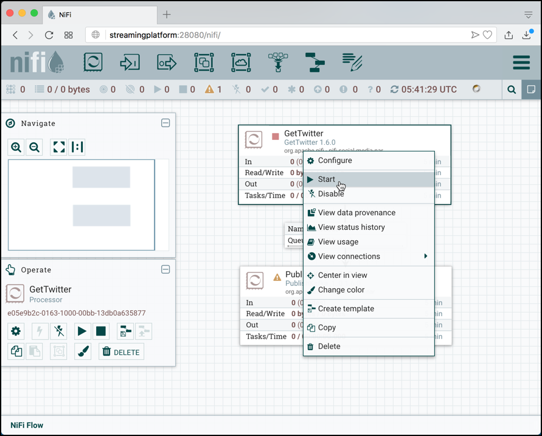
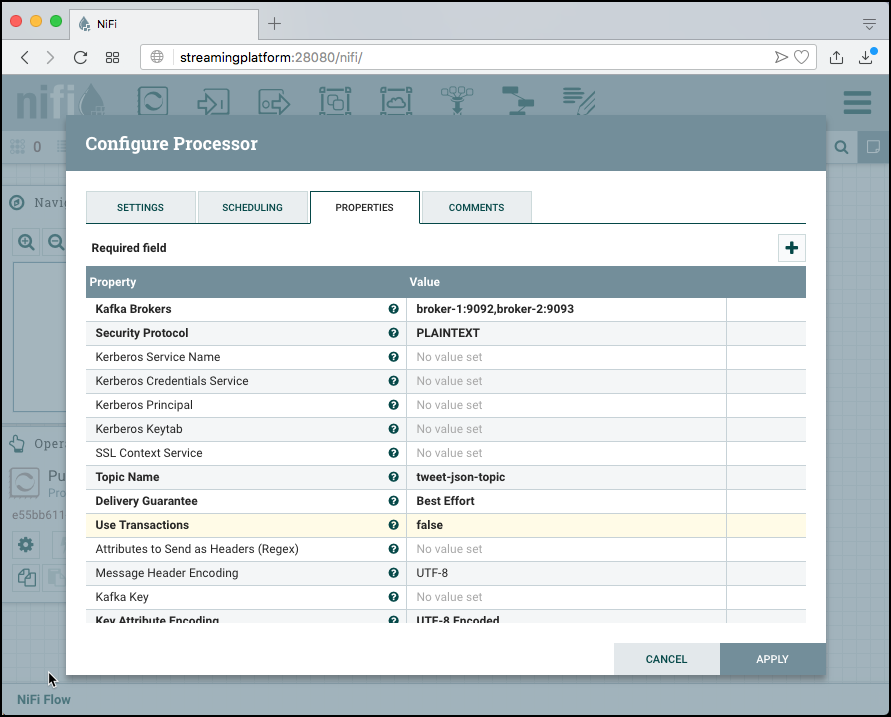

# Data Ingestion with Apache NiFi
### Create a new pipeline
In a browser navigate to <http://dataplatform:28080/nifi>. This should bring up the NiFi User Interface, which at this point is a blank canvas for orchestrating a data flow.



The UI has multiple tools to create and manage your first dataflow:



### Adding a Twitter Processor
We can now begin creating our data flow by adding a Processor to our canvas. To do this, drag the Processor icon from the top-left of the screen into the middle of the canvas and drop it there. 


This will give us a dialog that allows us to choose which Processor we want to add. We can see that there are a total of 260 processors currently available. We can browse through the list or use the tag cloud on the left to filter the processors by type.



Enter **twitter** into the search field and the list will be reduced to just one processor, the GetTwitter processor which can be used t pull status changes from the [Twitter Streaming API](https://developer.twitter.com/en/docs/tweets/filter-realtime/overview). Click on **Add** to add it to the canvas.


You can see the canvas with the **GetTwitter** processor. You can see a yellow marker, telling that the processor is not yet configured properly. 


Double-click on the **GetTwitter** processor and the properties page of the processor appears. Here you can change the name of Twitter processor among other general properties.

Click on **PROPERTIES** tab to switch to the properties page.


On the properties page, we configure the properties for getting data from twitter.  


Change the **Twitter Endpoint** to **Filter Endpoint** and configure the **Consumer Key**, **Consumer Secret**, **Access Token** and **Access Token Secret** with the settings from the Twitter Application. 

You can find the steps for creating a new Twitter Application [here](../99-misc/99-twitter-app/README.md). 

Set the **Terms to Filter On** with the terms you want to filter on. 


Click on **Apply** to close the properties of the **GetTwitter** processor.

The processor still shows the yellow marker, this is because the out-going relationship is neither used nor terminated. Of course we want to use it, but for that we first need the Kafka Processor to send the message onwards. 

### Adding a Kafka Processor
Drag a new Processor into the Canvas, just below the **GetTwitter** processor. 

Enter **kafka** into the Filter field on top right. Only the processors related to Kafka will be shown (16 out of 260). 16 seems to be a lot, they are both for publishing as well as consuming and additionally there a different processors for different Kafka versions.

Scroll down to **PublishKafka\_1\_0** and select it. Click on **Add** to add the **PublishKafka\_1\_0** processor. 
	


Click **Add** to finish creating the connection. 









Double-click on the **PublishKafka\_1\_0** processor to configure the Kafka processor. Click on the **PROPERTIES** tab to switch to the Kafka consumer settings. 


You can see the various settings you can tweak for this processor. 


Click on the value of the **Kafka Brokers** Property and a pop-up window will open.  Enter `broker-1:9092,broker-2:9093` into the edit field and click **OK** to close the window. 


Do the same for **Topic Name** and enter `tweet-json-topic` into the edit field. Click on **Use Transactions** and change the value in the drop-down to `false`. Leave all other values on the defaults. The **Configure Processor** should look like the screenshot below. 



Click on the **SETTINGS** tab to switch back to the generic settings and set both outgoing relationship to "terminating" by selecting the two check-boxes for **failure** and **success**. 


Click on **APPLY** to close the window. 

Both processors are now ready to be started, which you can see on the red stop icon in the top left corner of each processor.


### Create the topic in Kafka

Create the topic in Kafka, if it does not yet exist, using the `kafka-topics` command. 

```
kafka-topics --create \
			--if-not-exists \
			--zookeeper zookeeper:2181 \
			--topic tweet-json-topic \
			--partitions 6 \
			--replication-factor 2
```

Now let's start a `kafkacat` consumer on the new topic:

```
kafkacat -b 10.0.1.4:9092 -t tweet-json-topic
```

Now we are ready to run the completed flow. 

### Run the pipeline 

Click on the start arrow 


to run the pipeline 


