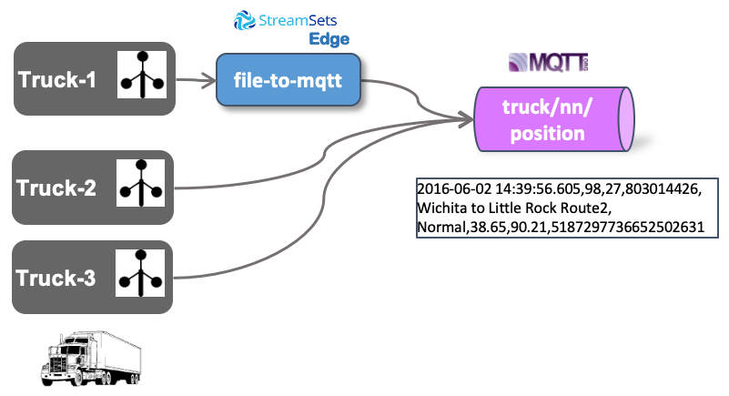
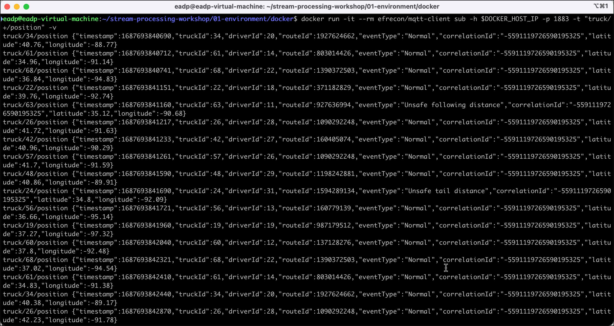
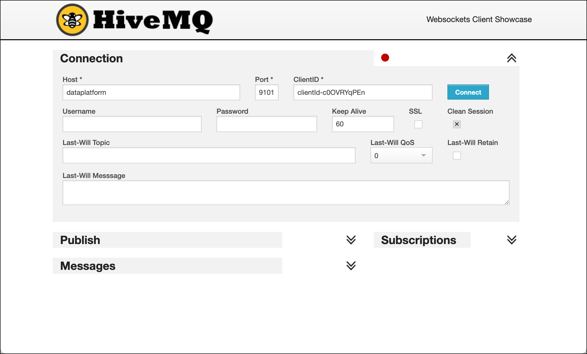
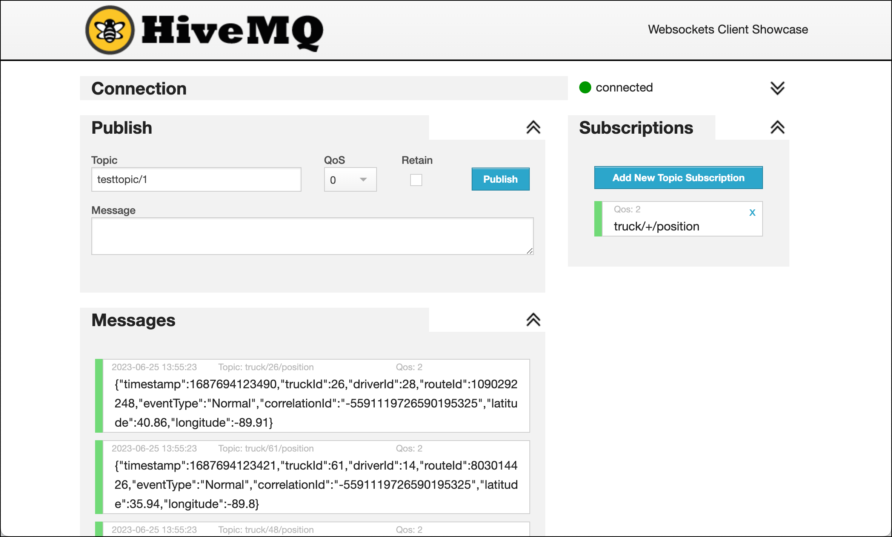

# IoT Data Ingestion and Analytics - Sending to MQTT

In this part we will be ingesting the IoT data stream into MQTT first, so that it can be later consumed and moved to a central Kafka topic. The MQTT brokers would act as IoT Gateways, implemented decentrally, whereas the Kafka Topic later will be a central deployment. This is a scenario which makes a lot of sense in real-live for various reasons such as security, connectivity, more lightweight connections and others. 

We will be using a fictitious Trucking company with a fleet of trucks constantly providing some data about the moving vehicles. Of course we will not be using real-life data, but have a program simulating trucks and their driving behaviour.

The following diagram shows the setup of the data flow we will be implementing. 



As you can see there are Trucks (2 and 3) which sent their data directly to MQTT whereas Truck-1 stores it to a file. We will be using a "local" pipeline on the truck to get the data from the file and send it to MQTT.

## MQTT Broker part of the Data Platform

The data platform we use for our workshop already runs a MQTT service.

We are using [Mosquitto](https://mosquitto.org/), an easy to use MQTT broker, belonging to the Eclipse project. Additionally also a browser-based UI is available, which we see in action later and which allows for consuming messages sent to the MQTT broker.

## Simulating Truck-10, sending data to a file

For simulating truck data, we are going to use a Java program (adapted from Hortonworks) and maintained in this [GitHub project](https://github.com/TrivadisBDS/various-bigdata-prototypes/tree/master/streaming-sources/iot-truck-simulator/impl). It can be started either using Maven or Docker. We will be using it as a Docker container.

The simulator can produce data to various data sinks, such as **File**, **MQTT** or event **Kafka**. For our workshop here, we will be using **File** and **MQTT** as the target, but first let's use it in **File** mode. 

First make sure that you are located in the `docker` folder of the dataplatform, where the `docker-compose.yml` can be found. You can easily navigate to the right place by using the `$DATAPLATFORM_HOME` environment variable (if set).

```
cd $DATAPLATFORM_HOME
```

Now running the simulator is a simle as starting the `trivadis/iot-truck-simulator` docker image, providing some parameters.

```
docker run -d -v "${PWD}/data-transfer/logs:/out" trivadis/iot-truck-simulator "-s" "FILE" "-f" "CSV" "-d" "2000" "-fs" "25" "-vf" "10" "-fpv"
```

**Note:** if you are running docker on windows, you have to replace the `${PWD}` by the absolute path to the `data-transfer` folder.  

We only generate data for vehicle with id `10` into a file in the `/data-transfer/logs` folder using the **CSV** format. The flag `-fpv` specifies to write one file per vehicle. 

You should see an output similar to the one below, signalling that messages are produced to MQTT. 

```
/app/resources/routes/midwest
com.hortonworks.labutils.SensorEventsParam@6acbcfc0
log4j:WARN No appenders could be found for logger (com.hortonworks.simulator.impl.domain.transport.route.TruckRoutesParser).
log4j:WARN Please initialize the log4j system properly.
log4j:WARN See http://logging.apache.org/log4j/1.2/faq.html#noconfig for more info.
Number of Emitters is .....23
akka://EventSimulator/user/eventCollector
```

In another terminal window, again navigate to the `docker` folder and perform a tail on the file being generated / added to: 

```
tail -f data-transfer/logs/TruckData-10.dat
```

You should see a new record being added every one second. The output should look similar to the one below:

```
1592245443725,10,15,1565885487,Normal,35.19,-90.04,2450627533207974154
1592245444665,10,15,1565885487,Normal,35.21,-90.37,2450627533207974154
1592245445655,10,15,1565885487,Normal,35.12,-90.68,2450627533207974154
1592245446525,10,15,1565885487,Normal,35.03,-90.94,2450627533207974154
1592245447475,10,15,1565885487,Normal,34.96,-91.14,2450627533207974154
1592245448445,10,15,1565885487,Normal,34.83,-91.38,2450627533207974154
1592245449295,10,15,1565885487,Normal,34.89,-91.74,2450627533207974154
...
```

## Creating a StreamSets DataCollector Edge pipeline

Now let's create a StreamSets DataCollector pipeline, which retrieves the data from the File, using a tail operation similar to the one shown from the console and send the data to an MQTT Topic. We will use Streamsets Data Collector Edge, as this pipeline would run directly on the truck, where the file is being created.

In a browser window, navigate to <http://analyticsplatform:18630/> to open StreamSets Data Collector UI. 

Click on **Create New Pipeline** button to create a new empty pipeline. Set the **Title** field to `File_to_MQTT` and select the **Data Collector Edge Pipeline** option. 


Click on **Save** and an empty Pipeline should appear. 

From the **Select Origin ...** drop-down list select `File Tail` to read from a local file. 

From the **Select Destination to connect...** drop-down list select `MQTT Publisher` to produce the message to the MQTT broker. So far the pipeline should look as shown in the diagram below. 


The **File Tail** origin has a second stream, which we have to connect to something as well. This stream is producing meta information on the file being read. Agin select from **Select Destination to connect...** drop-down list and chose **Trash** this time. This will result in the meta-information being discarded. 


Now click on the error icon on pipeline level (bottom left corner) and on the **Error Records** tab select `Discard (Library: Basic` for the **Error Records** drop-down and the error will disappear. 


Now last but not least we have to configure the `File Tail 1` origin and the `MQTT Publisher 1` destination.

Let's start with the origin. Click on the `File Tail 1` origin and navigate to the **Files** tab. Set the **Maximum Batch Size** to `1` and in the **File to Tail** section set the **Path** to `/data-transfer/logs/TruckData-10.dat`, the file being generated. 


Navigate to the **Data Format** tab and set the **Data Format** to `Text`.


Next let's configure the `MQTT Publisher 1'. Click on the destination and navigate to the **MQTT** tab. Enter `tcp://mosquitto-1:1883` into the **Broker URL** field and `truck/10/position` into the **Topic** field. We are hardcoding the driver id in the Topic hierarchy, in real-life this would have to be taken from either the message or the file name. 


Navigate to the **Data Format** tab and set the **Data Format** to `Text`.


Now the pipeline is ready to be run in preview mode. Because it is an Edge Pipeline, we also have to configure the URL of a StreamSets Data Collector Edge engine. The Data Platform runs one on port `18633`. To configure the Data Collector Edge URL, click on the canvas outside of any of the components to navigate to pipeline level and then select the **General** tab. Enter `http://streamsets-edge-1:18633` into the ** Data Collector Edge URL** field. 


Now let's run the pipeline in preview mode by clicking on the **Preview** icon


On the **Preview Configuration** select the **Show Record/Field Header** option and click **Run Preview**. You should see one record as it has been retrieved from the file. The Record Header shows the **filename** which has been retrieved. From here we could easily get the truck id for the MQTT topic dynamically. 


So everything looks good. So let's stop the preview and run the pipeline on the Data Collector Edge by clicking on green **Start** button in the upper right corner. 


## Using an MQTT Client to view messages

For viewing the messages in MQTT, we need something similar to the `kafkacat` and `kafka-console-consumer` utilities. There are multiple options available. 

In this workshop we will present two alternative options for consuming from MQTT
 
 * use dockerized MQTT client in the terminal
 * use browser-based HiveMQ Web UI

### Using dockerized MQTT Client

To start consuming using through a command line, perform the following docker command:

```
docker run -it --rm efrecon/mqtt-client sub -h $DOCKER_HOST_IP -p 1883 -t "truck/+/position" -v
```

The consumed messages will show up on the terminal window as shown below.



### Using HiveMQ Web UI  

To start consuming using the MQTT UI ([HiveMQ Web UI](https://www.hivemq.com/docs/3.4/web-ui/introduction.html)), navigate to <http://dataplatform:28136> and connect using `dataplatform` for the **Host** field, `9001` for the **Port** field and then click on **Connect**: 


	
When successfully connected, click on Add New Topic Subscription and enter `truck/+/position` into **Topic** field and click **Subscribe**:
	


You should again see the messages as they are being sent to MQTT.



Alternatively you can also use the [MQTT.fx](https://mqttfx.jensd.de/) or the [MQTT Explorer](https://mqtt-explorer.com/) applications to browse for the messages on the MQTT broker. They are both available for installation on Mac or Windows. 

In the subscription pattern of we have used `truck/+/position`, where the `+` sign acts as a placeholder for all the various truck ids. But so far we only have one truck. Let's add some other trucks by starting another simulator, which will send directly to MQTT. 


## Running the Truck Simulator to publish directly to MQTT

Now let's run the simulator for trucks with id 11 - 70. 

The MQTT broker is exposed on port `1883`. So let's run the following docker command in a new terminal window.

```
docker run -d trivadis/iot-truck-simulator "-s" "MQTT" "-h" $DOCKER_HOST_IP "-p" "1883" "-f" "CSV" "-d" "2000" "-fs" "25" "-vf" "11-70"
```

We are also producing the data in **CSV** format to the broker running on the docker host on port 1883. 

You should see an output similar to the one below, signalling that messages are produced to MQTT. 

```
Number of Emitters is .....23
akka://EventSimulator/user/eventCollector
Connecting to MQTT broker: tcp://172.16.252.11:28100
```

Let's check in the MQTT client that you now get messages for other trucks as well. 


----
[top](../05-iot-data-ingestion-and-analytics/README.md) 	| 	[next part](../05b-iot-data-ingestion-mqtt-to-kafka/README.md)
