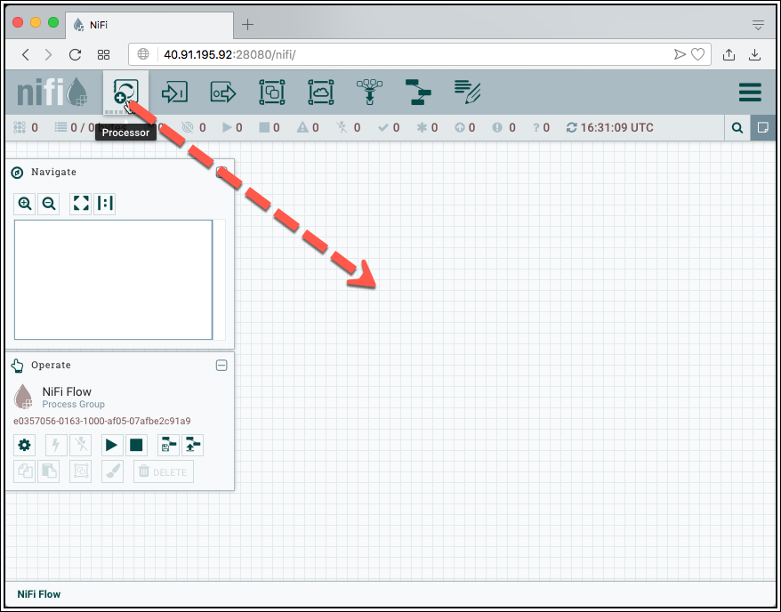

# Ingest IoT Vehicle Data - Moving Data from MQTT to Kafka using Kafka Connect or Apache NiFi

In this part of the workshop we we will be moving the data from MQTT into Kafka, so that it can be consumed using the Kafka console consumer, as a preparation for stream analytics to be done in a later part. The data has been sent to MQTT in an earlier part of this workshop. 

The following diagram shows the setup of the data flow we will be implementing. 


With the data successfully published into MQTT in the first part, we can take it from there and implement a bridge between MQTT and Apache Kafka. For that we will be using the Kafka Connect framework. 

## Creating necessary Kafka Topic

The Kafka cluster is configured with `auto.topic.create.enable` set to `false`. Therefore we first have to create all the necessary topics, using the `kafka-topics` command line utility of Apache Kafka. 

We can easily get access to the `kafka-topics` CLI by navigating into one of the containers for the 3 Kafka Brokers. Let's use `kafka-1`

As we have learned in a previous workshop, we can list all existing topics using `kafka-topics`. 

```
docker exec -ti kafka-1 kafka-topics --bootstrap-server kafka-1:19092 --list
```

Now let's create the `vehicle_tracking_sysA` topic, which should hold the messages from all the different MQTT topics (remember, there is one MQTT topic by vehicle). 

```
docker exec -ti kafka-1 kafka-topics --bootstrap-server kafka-1:19092 --create --topic vehicle_tracking_sysA --partitions 8 --replication-factor 3
```

If you don't want to work with the CLI, you can also create the Kafka topics using the [Cluster Manager for Apache Kafka (CMAK) GUI](http://dataplatform:28104) browser-based application. 

After successful creation, start a `kafka-console-consumer` 

```
docker exec -ti kafka-1 kafka-console-consumer --bootstrap-server kafka-1:19092 --topic vehicle_tracking_sysA
```

or `kafkacat` using docker

```
docker exec -ti kcat kcat -b kafka-1:19092 -t vehicle_tracking_sysA
```

to start consuming messages from the newly created `vehicle_tracking_sysA` topic. There is of course nothing to see (consume) yet, as we don't yet produce any messages to that topic. We have to bridge the gap between MQTT and Kafka. 

## Using Kafka Connect to bridge between MQTT and Kafka

For transporting messages from MQTT to Kafka, in this workshop we will be using Kafka Connect. We could also use StreamSets or Apache NiFi to achieve the same result. 

Luckily, there are multiple Kafka Source Connectors available for consuming from MQTT. We can either use the one provided by [Confluent Inc.](https://www.confluent.io/connector/kafka-connect-mqtt/) (which is part of Confluent Enterprise but available as evaluation license on Confluent Hub) or the one provided as part of the [Landoop Stream-Reactor Project](https://github.com/Landoop/stream-reactor/tree/master/kafka-connect-mqtt) available on GitHub. We will be using the later one here. 

Check-out the [IoT Truck Demo Tutorial](https://github.com/gschmutz/iot-truck-demo) to see the Confluent MQTT Connector in Action. 

### Adding the MQTT Kafka Connector 

There are two instances of the Kafka Connect service instance running as part of the Modern Data Platform, `kafka-connect-1` and `kafka-connect-2`. 

To add the connector implementations, without having to copy them into the docker container (or even create a dedicated docker image holding the jar), both connect services are configured to use additional connector implementations from the local folder `/etc/kafka-connect/custom-plugins` inside the docker container. This folder is mapped as a volume to the `plugins/kafka-connect` folder outside of the container on to the docker host. 

So into this folder we have to copy the artefacts of the Kafka connectors we want to use. 

Navigate into the `plugins/kafka-connect` folder (which is a sub-folder of the `docker` folder with the `docker-compose.yml` file.

```
cd $DATAPLATFORM_HOME/plugins/kafka-connect/connectors
```

and download the `kafka-connect-mqtt-1.2.6-2.1.0-all.tar.gz` file from the [Landoop Stream-Reactor Project](https://github.com/Landoop/stream-reactor/tree/master/kafka-connect-mqtt) project.

```
wget https://github.com/Landoop/stream-reactor/releases/download/2.1.3/kafka-connect-mqtt-2.1.3-2.5.0-all.tar.gz
```

Once it is successfully downloaded, uncompress it using this `tar` command and remove the file. 

```
mkdir kafka-connect-mqtt-2.1.3-2.5.0-all && tar xvf kafka-connect-mqtt-2.1.3-2.5.0-all.tar.gz -C kafka-connect-mqtt-2.1.3-2.5.0-all
rm kafka-connect-mqtt-2.1.3-2.5.0-all.tar.gz
```

Now let's restart Kafka connect in order to pick up the new connector (Make sure to navigate back to the docker folder first, either using `cd $DATAPLATFORM_HOME` or `cd ../..`)

```
cd $DATAPLATFORM_HOME
docker-compose restart kafka-connect-1 kafka-connect-2
```

The connector should now be added to the Kafka cluster. You can confirm that by watching the log file of the two containers

```
docker-compose logs -f kafka-connect-1 kafka-connect-2
```

After a while you should see an output similar to the one below with a message that the MQTT connector was added and later that the connector finished starting ...

```
...
kafka-connect-2             | [2019-06-08 18:01:02,590] INFO Registered loader: PluginClassLoader{pluginLocation=file:/etc/kafka-connect/custom-plugins/kafka-connect-mqtt-1.2.1-2.1.0-all/} (org.apache.kafka.connect.runtime.isolation.DelegatingClassLoader)
kafka-connect-2             | [2019-06-08 18:01:02,591] INFO Added plugin 'com.datamountaineer.streamreactor.connect.mqtt.source.MqttSourceConnector' (org.apache.kafka.connect.runtime.isolation.DelegatingClassLoader)
kafka-connect-2             | [2019-06-08 18:01:02,591] INFO Added plugin 'com.datamountaineer.streamreactor.connect.mqtt.sink.MqttSinkConnector' (org.apache.kafka.connect.runtime.isolation.DelegatingClassLoader)
kafka-connect-2             | [2019-06-08 18:01:02,592] INFO Added plugin 'com.datamountaineer.streamreactor.connect.converters.source.JsonResilientConverter' (org.apache.kafka.connect.runtime.isolation.DelegatingClassLoader)
kafka-connect-2             | [2019-06-08 18:01:02,592] INFO Added plugin 'com.landoop.connect.sql.Transformation' (org.apache.kafka.connect.runtime.isolation.DelegatingClassLoader)
...
kafka-connect-2             | [2019-06-08 18:01:11,520] INFO Starting connectors and tasks using config offset -1 (org.apache.kafka.connect.runtime.distributed.DistributedHerder)
kafka-connect-2             | [2019-06-08 18:01:11,520] INFO Finished starting connectors and tasks (org.apache.kafka.connect.runtime.distributed.DistributedHerder)

```

Now the connector is ready to be used. Let's configure it.

### Configure the MQTT Connector

For creating an instance of the connector over the API, you can either use a REST client or the Linux `curl` command line utility, which should be available on the Docker host. Curl is what we are going to use here. 

Create a folder scripts (if it does not yet exist) and navigate into the folder. 

```
mkdir scripts
cd scripts
```

In the `scripts` folder, create a file `start-mqtt.sh` and add the code below.  

```
#!/bin/bash

echo "removing MQTT Source Connector"

curl -X "DELETE" "http://dataplatform:8083/connectors/mqtt-source"

echo "creating MQTT Source Connector"

curl -X PUT \
  http://dataplatform:8083/connectors/mqtt-source/config \
  -H 'Content-Type: application/json' \
  -H 'Accept: application/json' \
  -d '{
    "connector.class": "com.datamountaineer.streamreactor.connect.mqtt.source.MqttSourceConnector",
    "connect.mqtt.connection.timeout": "1000",
    "tasks.max": "1",
    "connect.mqtt.kcql": "INSERT INTO vehicle_tracking_sysA SELECT * FROM truck/+/position",
    "connect.mqtt.connection.clean": "true",
    "connect.mqtt.service.quality": "0",
    "connect.mqtt.connection.keep.alive": "1000",
    "connect.mqtt.client.id": "tm-mqtt-connect-01",
    "connect.mqtt.converter.throw.on.error": "true",
    "connect.mqtt.hosts": "tcp://mosquitto-1:1883"
}'
```

The script first removes the MQTT connector, if it does exists already and then creates it from scratch. 

Also create a separate script `stop-mqtt.sh` for stopping the connector with the following script:

```
#!/bin/bash

echo "removing MQTT Source Connector"

curl -X "DELETE" "http://dataplatform:8083/connectors/mqtt-source"
```

Make sure that the both scripts are executable

```
sudo chmod +x start-mqtt.sh
sudo chmod +x stop-mqtt.sh
```

### Start the MQTT connector

Finally let's start the connector by running the `start-mqtt` script.

```
./scripts/start-mqtt.sh
```

A soon as the connector starts getting the messages from MQTT, they should start appearing on the console where the Kafka consumer is running, either using `kafkacat` or `kafka-console-consumer` 

```
eadp@eadp-virtual-machine:~$ docker exec -ti kcat kcat -b kafka-1:19092 -t vehicle_tracking_sysA
% Auto-selecting Consumer mode (use -P or -C to override)
% Reached end of topic vehicle_tracking_sysA [2] at offset 0
% Reached end of topic vehicle_tracking_sysA [1] at offset 0
% Reached end of topic vehicle_tracking_sysA [0] at offset 0
% Reached end of topic vehicle_tracking_sysA [5] at offset 0
% Reached end of topic vehicle_tracking_sysA [4] at offset 0
% Reached end of topic vehicle_tracking_sysA [7] at offset 0
% Reached end of topic vehicle_tracking_sysA [3] at offset 0
% Reached end of topic vehicle_tracking_sysA [6] at offset 0
{"timestamp":1687809609215,"truckId":11,"driverId":12,"routeId":1961634315,"eventType":"Normal","correlationId":"3316586084104411283","latitude":38.99,"longitude":-94.38}
{"timestamp":1687809609335,"truckId":22,"driverId":16,"routeId":160779139,"eventType":"Normal","correlationId":"3316586084104411283","latitude":34.92,"longitude":-92.25}
{"timestamp":1687809609585,"truckId":42,"driverId":11,"routeId":1962261785,"eventType":"Normal","correlationId":"3316586084104411283","latitude":34.78,"longitude":-92.31}
{"timestamp":1687809609965,"truckId":40,"driverId":20,"routeId":137128276,"eventType":"Normal","correlationId":"3316586084104411283","latitude":41.75,"longitude":-92.74}
% Reached end of topic vehicle_tracking_sysA [1] at offset 1
{"timestamp":1687809610234,"truckId":34,"driverId":18,"routeId":1565885487,"eventType":"Normal","correlationId":"3316586084104411283","latitude":39.74,"longitude":-89.96}
{"timestamp":1687809610635,"truckId":10,"driverId":23,"routeId":1090292248,"eventType":"Normal","correlationId":"3316586084104411283","latitude":41.71,"longitude":-91.94}
```

### Monitor connector in Kafka Connect UI

Navigate to the [Kafka Connect UI](http://dataplatform:28103) to see the connector running.


## Using Apache NiFi to bridge between MQTT and Kafka

Instead of using Kafka Connect, the bridge can also be built using Apache NiFi.

In a browser navigate to <https://dataplatform:18080/nifi> (make sure to replace `dataplatform` by the IP address of the machine where docker runs on,). We have enabled authentication for NiFi, therefore you have to use https to access it. Due to the use of a self-signed certificate, you have to initially confirm that the page is safe and you want to access the page.

Enter `nifi` into the **User** field and `1234567890ACD` into the **Password** field and click **LOG IN**.

This should bring up the NiFi User Interface, which at this point is a blank canvas for orchestrating a data flow.

### Adding a `ConsumeMQTT` Processor

We can now begin creating our data flow by adding a Processor to our canvas. To do this, drag the Processor icon from the top-left of the screen into the middle of the canvas and drop it there. 



This will give us a dialog that allows us to choose which Processor we want to add. We can see that there are a total of 345 processors currently available. We can browse through the list or use the tag cloud on the left to filter the processors by type.


Enter **mqtt** into the search field and the list will be reduced to only two processors, the **ConsumeMQTT** and the **PublishMQTT** processor. Select **ConsumeMQTT** and click **ADD** to add the **ConsumeMQTT** processor to the canvas.

You should now see the canvas with the **ConsumeMQTT** processor. A yellow marker is shown on the processor, telling that the processor is not yet configured properly. 


Double-click on the **ConsumeMQTT** processor and the properties page of the processor appears. Here you can change the name of the processor among other general properties.

Click on **PROPERTIES** tab to switch to the properties page.

On the properties page, we configure the properties for reading the data from the local file system.  

Set the properties as follows:

  * **Broker URI**: `tcp://mosquitto-1`
  * **Topic Filter**: `truck/+/position`

The **Configure Processor** should look as shown below


Click **APPLY** to close the window.

The `TailFile` processor still shows the yellow marker, this is because the out-going relationship is neither used nor terminated. Of course we want to use it, but for that we first need another Processor to publish the data to a Kafka topic. 

### Adding a `PublishKafka` Processor

Drag a new Processor onto the Canvas, just below the **PublishKafka** processor. 

Enter **PublishKafka** into the Filter field on top right. Only a single processor, the `PublishKafka` is shown.


Select the **PublishKafka\_2\_6** and click on **ADD** to add it to the canvas as well. The canvas should now look like shown below. You can drag around the processor to organise them in the right order. It is recommended to organise the in main flow direction, either top-to-bottom or left-to-right. 

Let's configure the new processor. Double-click on the `PublishKafka_2_6` and navigate to **PROPERTIES**. Configure the properties for publishing to Kafka.

  * **Kafka Brokers**: `kafka-1:19092`
  * **Topic Name**: `vehicle_tracking_sysA`

The **Configure Processor** should look as shown below. 


Click **APPLY** to close the window.

### Connecting the 2 Processors

Drag a connection from the **ConsumeMQTT** processor to the **PublishKafka\_2\_6** and drop it. 
Make sure that **For Relationship** is enabled for the `Message` relationship and click **ADD**. Navigate to **RELATIONSHIPS** and enable **terminate** for the **parse.failure**.


Click **APPLY**. The data flow on the canvas should now look as shown below


The first processor no longer hold the yellow marker, but now show the red stop marker, meaning that this processors can be started. But what about the last one, the **PublishKafka\_2\_6** processor?

If you navigate to the marker, a tool-tip will show the errors. 


We can see that the processor has two outgoing relationships, which are not "used". We have to terminate them, if we have no use for it. 
Double-click on the **PublishKafka\_2\_6** processor and navigate to **RELATIONSHIPS** and set the check-boxes for both relationships to **terminate**. 


Click **APPLY** to save the settings.

Now our data flow is ready, so let's run it. 

### Starting the Data Flow 

Select the 2 processor and click on the start arrow to run the data flow. All three processors now show the green "started" or "running" marker. 

### Checking the data in `kcat`

if you check for the output in `kcat` where we output both the key and the value of the Kafka message

```
docker exec -ti kcat kcat -b kafka-1 -t vehicle_tracking_sysA -f "%k - %s\n" -q
```

we can see that the key part is empty and that we have more than one message in the value

```bash
 - {"timestamp":1687815661835,"truckId":21,"driverId":30,"routeId":803014426,"eventType":"Normal","correlationId":"-1928220346492852690","latitude":41.92,"longitude":-89.03}
 - {"timestamp":1687815661854,"truckId":30,"driverId":14,"routeId":160779139,"eventType":"Normal","correlationId":"-1928220346492852690","latitude":38.67,"longitude":-94.38}
 - {"timestamp":1687815661884,"truckId":15,"driverId":21,"routeId":137128276,"eventType":"Normal","correlationId":"-1928220346492852690","latitude":38.65,"longitude":-90.2}
 - {"timestamp":1687815681324,"truckId":23,"driverId":23,"routeId":1325712174,"eventType":"Normal","correlationId":"-1928220346492852690","latitude":38.0,"longitude":-90.24}
 - {"timestamp":1687815682014,"truckId":44,"driverId":22,"routeId":1090292248,"eventType":"Normal","correlationId":"-1928220346492852690","latitude":42.21,"longitude":-88.64}
 - {"timestamp":1687815689555,"truckId":44,"driverId":22,"routeId":1090292248,"eventType":"Normal","correlationId":"-1928220346492852690","latitude":42.04,"longitude":-88.02}
 - {"timestamp":1687815690145,"truckId":21,"driverId":30,"routeId":803014426,"eventType":"Normal","correlationId":"-1928220346492852690","latitude":41.7,"longitude":-91.59}
 - {"timestamp":1687815691564,"truckId":23,"driverId":23,"routeId":1325712174,"eventType":"Normal","correlationId":"-1928220346492852690","latitude":37.2,"longitude":-89.56}
 - {"timestamp":1687815691724,"truckId":48,"driverId":26,"routeId":1962261785,"eventType":"Normal","correlationId":"-1928220346492852690","latitude":38.31,"longitude":-91.07}
 - {"timestamp":1687815691905,"truckId":32,"driverId":12,"routeId":1384345811,"eventType":"Normal","correlationId":"-1928220346492852690","latitude":41.62,"longitude":-90.7}
 - {"timestamp":1687815692008,"truckId":35,"driverId":10,"routeId":1390372503,"eventType":"Normal","correlationId":"-1928220346492852690","latitude":38.31,"longitude":-91.07}
 - {"timestamp":1687815696834,"truckId":15,"driverId":21,"routeId":137128276,"eventType":"Normal","correlationId":"-1928220346492852690","latitude":41.11,"longitude":-88.42}
 - {"timestamp":1687815697014,"truckId":21,"driverId":30,"routeId":803014426,"eventType":"Normal","correlationId":"-1928220346492852690","latitude":41.74,"longitude":-92.19}
 - {"timestamp":1687815697114,"truckId":44,"driverId":22,"routeId":1090292248,"eventType":"Normal","correlationId":"-1928220346492852690","latitude":41.89,"longitude":-87.66}
 - {"timestamp":1687815699404,"truckId":35,"driverId":10,"routeId":1390372503,"eventType":"Normal","correlationId":"-1928220346492852690","latitude":38.14,"longitude":-91.3}
 - {"timestamp":1687815700137,"truckId":15,"driverId":21,"routeId":137128276,"eventType":"Normal","correlationId":"-1928220346492852690","latitude":40.76,"longitude":-88.77}
 - {"timestamp":1687815702264,"truckId":48,"driverId":26,"routeId":1962261785,"eventType":"Normal","correlationId":"-1928220346492852690","latitude":38.09,"longitude":-91.44}
 - {"timestamp":1687815702684,"truckId":35,"driverId":10,"routeId":1390372503,"eventType":"Normal","correlationId":"-1928220346492852690","latitude":38.09,"longitude":-91.44}
 - {"timestamp":1687815702764,"truckId":32,"driverId":12,"routeId":1384345811,"eventType":"Normal","correlationId":"-1928220346492852690","latitude":41.74,"longitude":-91.47}
 - {"timestamp":1687815706393,"truckId":32,"driverId":12,"routeId":1384345811,"eventType":"Normal","correlationId":"-1928220346492852690","latitude":41.72,"longitude":-91.63}
 - {"timestamp":1687815706444,"truckId":15,"driverId":21,"routeId":137128276,"eventType":"Overspeed","correlationId":"-1928220346492852690","latitude":39.84,"longitude":-89.63}
```

The **PublishKafka\_2\_6** by default uses the attribute `kafka.key` as the kafka key. So we have to set it to the value we want to use for the key, which we can do by extracting the value from the flow file. 

### Add a `EvaluateJsonPath` processor to extract a value

Stop all running processors and drag a new Processor onto the Canvas, just below the **ConsumeMQTT** processor. 

Enter **EvaluateJ** into the Filter and select the **EvaluateJsonPath** processor and click on **ADD** to add it to the canvas as well. 

Drag the connection (blue end) away from the  **PublishKafka\_2\_6** processor and connect it with the **EvaluateJsonPath** processor


Let's configure the new processor. Double-click on the `EvaluateJsonPath` and navigate to **PROPERTIES**. Configure the properties for publishing to Kafka.

Add a new property using the **+** sign. Enter `kafka.key` into the **Property Name** field and click **OK**. Enter the following [JSONPath expression](https://jsonpath.com/) `$.truckId` into the edit field and click **OK**. This will extract the `truckId` field from the JSON formatted message and use it for the key. 

Drag a connection from **EvaluateJsonPath** to the **PublishKafka\_2\_6** processor and select the **matched** check box below **For Relationships** and click **ADD**. 

Double-click on **EvaluateJsonPath** processor and navigate to **RELATIONSHIPS** tab and click on **terminate** for **failure** and **unmatched** relationship and click **APPLY**.

Now let's run all 3 processors again and check that the Kafka messages also include a valid key portion. 

```
docker exec -ti kcat kcat -b kafka-1 -t vehicle_tracking_sysB -f "%k - %s" -q
```

we can see that the key part is no longer empty

```bash
15 - {"timestamp":1687816746483,"truckId":15,"driverId":21,"routeId":137128276,"eventType":"Normal","correlationId":"-1928220346492852690","latitude":41.89,"longitude":-87.66}
26 - {"timestamp":1687816747114,"truckId":26,"driverId":15,"routeId":1567254452,"eventType":"Normal","correlationId":"-1928220346492852690","latitude":41.87,"longitude":-87.67}
35 - {"timestamp":1687816747324,"truckId":35,"driverId":10,"routeId":1390372503,"eventType":"Normal","correlationId":"-1928220346492852690","latitude":36.37,"longitude":-95.5}
23 - {"timestamp":1687816747134,"truckId":23,"driverId":23,"routeId":1325712174,"eventType":"Normal","correlationId":"-1928220346492852690","latitude":41.59,"longitude":-90.2}
48 - {"timestamp":1687816748134,"truckId":48,"driverId":26,"routeId":1962261785,"eventType":"Normal","correlationId":"-1928220346492852690","latitude":41.87,"longitude":-87.67}
44 - {"timestamp":1687816747595,"truckId":44,"driverId":22,"routeId":1090292248,"eventType":"Normal","correlationId":"-1928220346492852690","latitude":40.96,"longitude":-90.29}
32 - {"timestamp":1687816748274,"truckId":32,"driverId":12,"routeId":1384345811,"eventType":"Normal","correlationId":"-1928220346492852690","latitude":41.72,"longitude":-91.05}
30 - {"timestamp":1687816747684,"truckId":30,"driverId":14,"routeId":160779139,"eventType":"Normal","correlationId":"-1928220346492852690","latitude":34.96,"longitude":-91.14}
21 - {"timestamp":1687816748944,"truckId":21,"driverId":30,"routeId":803014426,"eventType":"Normal","correlationId":"-1928220346492852690","latitude":37.15,"longitude":-97.32}
15 - {"timestamp":1687816750425,"truckId":15,"driverId":21,"routeId":137128276,"eventType":"Normal","correlationId":"-1928220346492852690","latitude":42.04,"longitude":-88.02}
26 - {"timestamp":1687816750254,"truckId":26,"driverId":15,"routeId":1567254452,"eventType":"Normal","correlationId":"-1928220346492852690","latitude":41.48,"longitude":-88.07}
35 - {"timestamp":1687816750395,"truckId":35,"driverId":10,"routeId":1390372503,"eventType":"Normal","correlationId":"-1928220346492852690","latitude":36.25,"longitude":-95.69}
23 - {"timestamp":1687816750504,"truckId":23,"driverId":23,"routeId":1325712174,"eventType":"Normal","correlationId":"-1928220346492852690","latitude":41.56,"longitude":-90.64}
48 - {"timestamp":1687816751507,"truckId":48,"driverId":26,"routeId":1962261785,"eventType":"Normal","correlationId":"-1928220346492852690","latitude":41.48,"longitude":-88.07}
```

----
[previous part](../05a-iot-data-ingestion-sys-a-into-mqtt/README.md)	| 	[top](../05-iot-data-ingestion-and-transformation/README.md) 	| 	[next part](../05c-iot-data-ingestion-sys-b-into-kafka/README.md)
