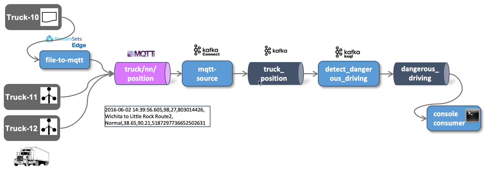

# IoT Data Ingestion and Analytics - Stream Processing using ksqlDB

With the truck data continuously ingested into the `truck_movement` topic, let's now perform some stream processing on the data.
 
There are many possible solutions for performing analytics directly on the event stream. From the Kafka ecosystem, we can either use Kafka Streams or ksqlDB, a SQL abstraction on top of Kafka Streams. For this workshop we will be using KSQL. 



We will first use KSQL to change the format of the messages from CSV to JSON and write it to a new topic. With another KSQL statement we will detect drivers not driving around normally (detecting anomalies). 

## Connect to ksqlDB engine
 
An instance of a ksqlDB server is part of the Data Platform and started as service `ksqldb-server-1`. It can be reached on port 8088. Additionally the ksqlDB CLI is also running as service `ksqldb-cli`. 

Let's use the CLI by doing an `docker exec` into the running docker container

```
docker exec -it ksqldb-cli ksql http://ksqldb-server-1:8088
```

and you should see the ksqlDB "welcome page":

```
                  ===========================================
                  =       _              _ ____  ____       =
                  =      | | _____  __ _| |  _ \| __ )      =
                  =      | |/ / __|/ _` | | | | |  _ \      =
                  =      |   <\__ \ (_| | | |_| | |_) |     =
                  =      |_|\_\___/\__, |_|____/|____/      =
                  =                   |_|                   =
                  =  Event Streaming Database purpose-built =
                  =        for stream processing apps       =
                  ===========================================

Copyright 2017-2020 Confluent Inc.

CLI v0.9.0, Server v0.9.0 located at http://ksqldb-server-1:8088

Having trouble? Type 'help' (case-insensitive) for a rundown of how things work!
```

We can use the show command to show topics as well as streams and tables. We have not yet created streams and tables, therefore we won't see anything (except of the internal `ksql_processing_log` stream):

```
show topics;
show streams;
show tables;
```

Let's bring ksqlDB to action. 

## Working with KSQL in an ad-hoc fashion

KSQL is a SQL like dialect, but instead of reading from static tables, as you know from using it with databases, in KSQL we mostly read from data streams. In the Kafka world, a data stream is available through a Kafka topic. 

ksqlDB can be used for doing ad-hoc queries as well as running continuous queries in the background. Let's first doing some ad-hoc queries to familiarise ourselves with the data on the `truck_position` topic. 

### Give the truck_position topic a structure

Before we can use a KSQL SELECT statement and consume data from a data stream, we have to give the data in the `truck_position` topic a "face", by defining the structure of the data. We do that using the `CREATE STREAM ...` command, as shown below: 

```
DROP STREAM truck_position_csv_s;

CREATE STREAM truck_position_csv_s
  (ts VARCHAR,
   truckId VARCHAR,
   driverId BIGINT,
   routeId BIGINT, 
   eventType VARCHAR,
   latitude DOUBLE,
   longitude DOUBLE,
   correlationId VARCHAR)
  WITH (kafka_topic='truck_position',
        value_format='DELIMITED');
```

We can see from the `value_format` clause that the data in the topic `truck_position` is delimited. 

With the `truck_position_csv_s` Stream in place, we can use the `SELECT` statement to query live messages while they are being sent to the Kafka topic. 

```
SELECT * FROM truck_position_csv_s EMIT CHANGES;
```

`EMIT CHANGES` is necessary as it should be a _push query_ that produces a continuously updating stream of current vehicle position coordinates, not just the current state.

The output we get should be similar as shown below:

```
ksql> select * from truck_position_csv_s emit changes;
+---------------+---------------+---------------+---------------+---------------+---------------+---------------+---------------+---------------+
|ROWKEY         |TS             |TRUCKID        |DRIVERID       |ROUTEID        |EVENTTYPE      |LATITUDE       |LONGITUDE      |CORRELATIONID  |
+---------------+---------------+---------------+---------------+---------------+---------------+---------------+---------------+---------------+
|"truck/30/|�15928902|30             |24             |137128276      |Normal         |40.76          |-88.77         |-18829803938785|
|position0     |08758          |               |               |               |               |               |               |60716          |
|"truck/12/|�15928902|12             |20             |1927624662     |Normal         |42.21          |-88.64         |-18829803938785|
|position0     |08858          |               |               |               |               |               |               |60716          |
|"truck/29/|�15928902|29             |18             |1565885487     |Normal         |39.76          |-90.14         |-18829803938785|
|position0     |08878          |               |               |               |               |               |               |60716          |
|"truck/21/|�15928902|21             |28             |160405074      |Normal         |39.76          |-90.14         |-18829803938785|
|position0     |08938          |               |               |               |               |               |               |60716          |
|"truck/10/|�15928902|10             |12             |160405074      |Normal         |35.1           |-90.07         |-18829803938785|
|position0     |09148          |               |               |               |               |               |               |60716          |
```

As long as we don't stop the query, we get a constant stream of new truck messages.

We can also see that we get a nicely formatted structure back. Compare that to the output of the console consumer or kafkacat. 

```
> kafkacat -b dataplatform -t truck_position -o end
% Auto-selecting Consumer mode (use -P or -C to override)
% Reached end of topic truck_position [0] at offset 16217
% Reached end of topic truck_position [2] at offset 11528
% Reached end of topic truck_position [1] at offset 9134
�1592890510688,29,18,1565885487,Normal,39.77,-93.33,-1882980393878560716
% Reached end of topic truck_position [3] at offset 13149
% Reached end of topic truck_position [6] at offset 14709
�1592890510718,35,16,987179512,Normal,41.72,-91.05,-1882980393878560716
% Reached end of topic truck_position [0] at offset 16218
% Reached end of topic truck_position [5] at offset 8971
% Reached end of topic truck_position [4] at offset 17870
% Reached end of topic truck_position [6] at offset 14710
�1592890510827,22,10,1090292248,Normal,36.25,-95.69,-1882980393878560716
�1592890510870,27,14,1594289134,Normal,34.96,-91.14,-1882980393878560716
% Reached end of topic truck_position [1] at offset 9135
�1592890510912,10,12,160405074,Normal,38.98,-93.2,-1882980393878560716
% Reached end of topic truck_position [4] at offset 17871
�1592890510947,25,23,160779139,Normal,41.56,-90.64,-1882980393878560716
% Reached end of topic truck_position [2] at offset 11529
�1592890510988,33,17,803014426,Normal,39.1,-94.44,-1882980393878560716
% Reached end of topic truck_position [1] at offset 9136
�1592890510992,30,24,137128276,Normal,41.74,-91.47,-1882980393878560716
�1592890511027,14,15,1567254452,Normal,41.71,-91.32,-1882980393878560716
% Reached end of topic truck_position [7] at offset 16060
% Reached end of topic truck_position [6] at offset 14711
�1592890511035,28,31,1594289134,Normal,41.48,-88.07,-1882980393878560716
```

### Transform the data in JSON

With KSQL it is very easy to translate this into Json format. We just have to create a new stream using the `CREATE STREAM ...` statement using the same SQL statement and specify `JSON` as the `value_format`:

```
DROP STREAM IF EXISTS truck_position_json_s DELETE TOPIC;

CREATE STREAM truck_position_json_s
  WITH (kafka_topic='truck_position_json',
        value_format='JSON', 
        partitions=8, replicas=3)
AS 
SELECT * 
FROM truck_position_csv_s
EMIT CHANGES;
```

With the `CREATE STREAM` statement you don't have to create the topic first. It will be created based on the properties specified in the `WITH` clause. 

With the new stream in place, we can now check the new topic `truck_position_json` to see that it contains in fact messages in JSON. 

```
> kafkacat -b dataplatform -t truck_position_json -o end -q
{"TS":"\u0000\u0000\u0000\u0000\u0002�\u00011592891235888","TRUCKID":"21","DRIVERID":28,"ROUTEID":160405074,"EVENTTYPE":"Normal","LATITUDE":35.21,"LONGITUDE":-90.37,"CORRELATIONID":"-1882980393878560716"}
{"TS":"\u0000\u0000\u0000\u0000\u0002�\u00011592891235998","TRUCKID":"22","DRIVERID":10,"ROUTEID":1090292248,"EVENTTYPE":"Normal","LATITUDE":42.25,"LONGITUDE":-88.96,"CORRELATIONID":"-1882980393878560716"}
{"TS":"\u0000\u0000\u0000\u0000\u0002�\u00011592891236038","TRUCKID":"34","DRIVERID":22,"ROUTEID":1384345811,"EVENTTYPE":"Normal","LATITUDE":38.43,"LONGITUDE":-90.35,"CORRELATIONID":"-1882980393878560716"}
{"TS":"\u0000\u0000\u0000\u0000\u0002�\u00011592891236138","TRUCKID":"20","DRIVERID":30,"ROUTEID":1198242881,"EVENTTYPE":"Normal","LATITUDE":41.72,"LONGITUDE":-91.05,"CORRELATIONID":"-1882980393878560716"}
{"TS":"\u0000\u0000\u0000\u0000\u0002�\u00011592891236168","TRUCKID":"24","DRIVERID":32,"ROUTEID":1962261785,"EVENTTYPE":"Normal","LATITUDE":35.37,"LONGITUDE":-94.57,"CORRELATIONID":"-1882980393878560716"}
```

----
**Note:** if you need to drop a STREAM you might get an `Cannot drop XXXX` error message:

```
Cannot drop TRUCK_POSITION_JSON_S.
The following queries read from this source: [].
The following queries write into this source: [CSAS_TRUCK_POSITION_JSON_S_9].
You need to terminate them before dropping TRUCK_POSITION_JSON_S.
```

to solve the problem, just use the `TERMINATE` statement to stop the query(s) mentioned in the error message:

```
TERMINATE CSAS_TRUCK_POSITION_JSON_S_9;
```
---

### Using KSQL to find abnormal driver behaviour

First let's find out abnormal driver behaviour by selecting all the events where the event type is not `Normal`.
        
```
SELECT * FROM truck_position_s EMIT CHANGES;
```

This is not that much different from using the `kafka-console-consumer` or `kafkacat`. But of course with KSQL you can do much more. You have the power of SQL-like language at hand. Stop the statement with `Ctl-C`. 

So let's start using the WHERE clause, so that we only view the events where the event type is not `Normal`. 

```
SELECT * FROM truck_position_s 
WHERE eventType != 'Normal'
EMIT CHANGES;
```

It  will now take much longer until we see a result, as the non-normal behaviour is not occurring so often. So be patient!

This is interesting data, but just seeing it in the KSQL terminal is of limited value. We would like to have that information available as a new Kafka topic, so we can further process it using KSQL or allow other subscriber to work with that information.  

## Using ksqlDB to constantly publish results to a new topic 

For publishing the resulting data to a new Kafka topic, we first have to create the Kafka topic. 

As we have learnt before, connect to one of the broker container instances

```
docker exec -ti kafka-1 bash
```

and perform the following command to create the `dangerous_driving_ksql` topic in Kafka.

```
kafka-topics --zookeeper zookeeper-1:2181 --create --topic dangerous_driving_ksql --partitions 8 --replication-factor 3
```

Now let's publish to that topic from KSQL. For that we can create a new Stream. Instead of creating it on an existing topic as we have done before, we use the `CREATE STREAM ... AS SELECT ...` variant. 

```
DROP STREAM dangerous_driving_s;

CREATE STREAM dangerous_driving_s
  WITH (kafka_topic='dangerous_driving_ksql',
        value_format='DELIMITED', 
        partitions=8)
AS 
SELECT * 
FROM truck_position_s
WHERE eventtype != 'Normal'
EMIT CHANGES;
```

The `SELECT` statement inside is basically the statement we have tested before and we know it will create the right information. 

We can use a `DESCRIBE` command to see metadata of any stream: 

```
DESCRIBE dangerous_driving_s;        
```

which should return an output similar to the one shown below:

```
ksql> DESCRIBE dangerous_driving_s;
Name                 : DANGEROUS_DRIVING_S
 Field         | Type
-------------------------------------------
 ROWTIME       | BIGINT           (system)
 ROWKEY        | VARCHAR(STRING)  (system)
 TS            | VARCHAR(STRING)
 TRUCKID       | VARCHAR(STRING)
 DRIVERID      | BIGINT
 ROUTEID       | BIGINT
 EVENTTYPE     | VARCHAR(STRING)
 LATITUDE      | DOUBLE
 LONGITUDE     | DOUBLE
 CORRELATIONID | VARCHAR(STRING)
-------------------------------------------
For runtime statistics and query details run: DESCRIBE EXTENDED <Stream,Table>;
```

Now it's much easier to get the abnormal behaviour. All we have to do is selecting that new stream `truck_position_s`. 

```
SELECT * FROM dangerous_driving_s
EMIT CHANGES;
```

This stream is backed by the Kafka topic `dangerous_driving_ksql` so we can also use any Kafka consumer to directly get the data from there. Let's see it by either using `kafka-console-consumer` 

```
docker exec -ti kafka-1 bash
```

```
kafka-console-consumer --bootstrap-server broker-1:9092 \
     --topic dangerous_driving_ksql
```

or `kafkacat`

```
docker exec -ti kafkacat kafkacat -b kafka-1 -t dangerous_driving_ksql
```

You should see the same abnormal driving behaviour data as before in the ksqlDB shell.        

## Perform some more advanced analytics on the stream


Let's see how many abnormal events do we get per 20 seconds tumbling window

```
SELECT eventType, count(*) 
FROM dangerous_driving_s 
WINDOW TUMBLING (size 20 seconds)
GROUP BY eventType
EMIT CHANGES;
```

----

[previous part](../05b-iot-data-ingestion-mqtt-to-kafka/README.md)	| 	[top](../05-iot-data-ingestion-and-analytics/README.md) 	| 	[next part](../05d-static-data-ingestion/README.md)
