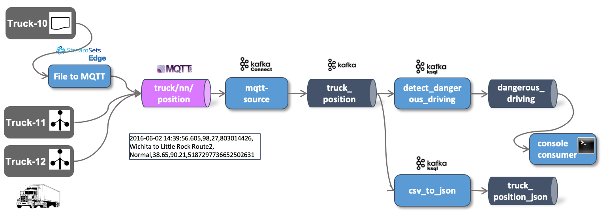

# IoT Data Ingestion and Analytics - Stream Processing using Faust

With the truck data continuously ingested into the `truck_position` topic, let's now perform some stream processing on the data.
 
There are many possible solutions for performing analytics directly on the event stream. [Faust](https://faust.readthedocs.io/en/latest/index.html) is a library for building streaming applications in Python.



We will use the `truck_position_json` topic created in the previous step.

## Optionally: Shortcutting previous steps

If you have not yet done the [previous part](../05b-iot-data-ingestion-mqtt-to-kafka/README.md), or it is no longer available, then you can also configure the IoT Truck Simulator to directly produce to Kafka, by running the following commands:

Create the topic;

```
docker exec -ti kafka-1 kafka-topics --zookeeper zookeeper-1:2181 --create --topic truck_position --partitions 8 --replication-factor 3
```

Run the simulator to directly produce into the Kafka topic

```
docker run --network streaming-platform trivadis/iot-truck-simulator '-s' 'KAFKA' '-h' 'kafka-1' '-p' '19092' '-f' 'CSV'
``` 

Connect to the KSQLdb CLI 

```
docker exec -it ksqldb-cli ksql http://ksqldb-server-1:8088
```

and perform the following KSQL statements:

```
CREATE STREAM truck_position_csv_s
  (ts VARCHAR,
   truckId VARCHAR,
   driverId BIGINT,
   routeId BIGINT, 
   eventType VARCHAR,
   latitude DOUBLE,
   longitude DOUBLE,
   correlationId VARCHAR)
  WITH (kafka_topic='truck_position',
        value_format='DELIMITED');
        
CREATE STREAM truck_position_json_s
  WITH (kafka_topic='truck_position_json',
        value_format='JSON', 
        partitions=8, replicas=3)
AS 
SELECT * 
FROM truck_position_csv_s
EMIT CHANGES;        
```


## Install Faust

You can install Faust either via the Python Package Index (PyPI) or from source.

```
pip install -U faust
```

Faust also defines a group of setuptools extensions that can be used to install Faust and the dependencies for a given feature. Fine more about it [here](https://faust.readthedocs.io/en/latest/userguide/installation.html).

## Create a simple Faust Stream Processor

Create a folder `src` and navigate into the folder

```
mkdir -p src
```

Create a file `src/__main__.py` and add the following code

```python
from src.app import app

app.main()
```

Create a file `src/app.py` and add the following code

```python
import faust

kafka_brokers = ['localhost:29092']

# convenience func for launching the app
def main() -> None:
    app.main()

app = faust.App('truck-pos-app', broker=kafka_brokers)

# GameEvent Schema
class TruckPosition(faust.Record, validation=True, serializer='json'):
    TS: str
    TRUCKID: str
    DRIVERID: int
    ROUTEID: int
    EVENTTYPE: str
    LATITUDE: float
    LONGITUDE: float


rawTruckPosisitonTopic = app.topic('truck_position_json', value_type=TruckPosition)
dangerousDrivingTopic = app.topic('dangerous_driving_faust', value_type=TruckPosition)


@app.agent(rawTruckPosisitonTopic)
async def process(positions):
    async for position in positions:
        print(f'Position for {position.TRUCKID}')
        
        if position.EVENTTYPE != 'Normal': 
            await dangerousDrivingTopic.send( value=position)   
```

Create the new topic `dangerous_driving_faust` where the dangerous drving behaviour will be published to:

```
docker exec -ti kafka-1 kafka-topics --zookeeper zookeeper-1:2181 --create --topic dangerous_driving_faust --partitions 8 --replication-factor 3
```

Run the application


```bash
python3 -m src worker -l info
```

----

[previous part](../05c-stream-processing-using-ksql/README.md)	| 	[top](../05-iot-data-ingestion-and-analytics/README.md) 	| 	[next part](../05e-static-data-ingestion/README.md)
