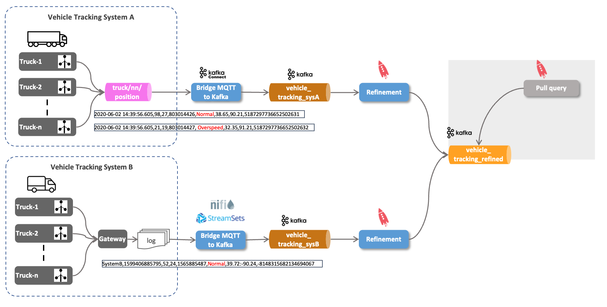

# Ingest IoT Vehicle Data - Using Pull query to get data

So with the vehicle position data from both source systems normalized into the `vehicle_tracking_refined` topic and available in ksqlDB throught the `vehicle_tracking_refined_s` stream object, is it possible to query for the latest position for a given vehicle? 



In ksqlDB suche queries are called *pull queries*, in contrast to the streaming queries we have seen so far, known as *push queries* (using the `EMIT CHANGES` clause). A pull query is a form of query issued by a client that retrieves a result as of "now", like a query against a traditional RDBS. 


[_Source: Confluent_](https://docs.ksqldb.io/en/latest/concepts/queries/pull/)

So let's do a `SELECT` on the stream, restricting on the `vehicleId` without an `EMIT CHANGES`

``` sql
SELECT * FROM vehicle_tracking_refined_s WHERE vehicleId = '42';
```

This query will return all the messages collected so far for vehicle `42`.

```
ksql> SELECT * FROM vehicle_tracking_refined_s WHERE vehicleId = '42'
>;
+---------+---------+---------+---------+---------+---------+---------+---------+---------+---------+
|ROWKEY   |SOURCE   |TIMESTAMP|VEHICLEID|DRIVERID |ROUTEID  |EVENTTYPE|LATITUDE |LONGITUDE|CORRELATI|
|         |         |         |         |         |         |         |         |         |ONID     |
+---------+---------+---------+---------+---------+---------+---------+---------+---------+---------+
|42       |Tracking_|166508600|42       |11       |196226178|Normal   |38.65    |-90.2    |-60501605|
|         |SysA     |2589     |         |         |5        |         |         |         |965346141|
|         |         |         |         |         |         |         |         |         |45       |
|42       |Tracking_|166508600|42       |11       |196226178|Normal   |39.1     |-89.74   |-60501605|
|         |SysA     |5857     |         |         |5        |         |         |         |965346141|
|         |         |         |         |         |         |         |         |         |45       |
|42       |Tracking_|166508600|42       |11       |196226178|Normal   |39.84    |-89.63   |-60501605|
|         |SysA     |9608     |         |         |5        |         |         |         |965346141|
|         |         |         |         |         |         |         |         |         |45       |
|42       |Tracking_|166508601|42       |11       |196226178|Normal   |40.38    |-89.17   |-60501605|
|         |SysA     |3558     |         |         |5        |         |         |         |965346141|
|         |         |         |         |         |         |         |         |         |45       |
|42       |Tracking_|166508601|42       |11       |196226178|Normal   |40.76    |-88.77   |-60501605|
|         |SysA     |6637     |         |         |5        |         |         |         |965346141|
|         |         |         |         |         |         |         |         |         |45       |
|42       |Tracking_|166508601|42       |11       |196226178|Normal   |41.11    |-88.42   |-60501605|
|         |SysA     |9778     |         |         |5        |         |         |         |965346141|
|         |         |         |         |         |         |         |         |         |45       |
|42       |Tracking_|166508602|42       |11       |196226178|Normal   |41.48    |-88.07   |-60501605|
|         |SysA     |2997     |         |         |5        |         |         |         |965346141|
|         |         |         |         |         |         |         |         |         |45       |
|42       |Tracking_|166508602|42       |11       |196226178|Normal   |41.87    |-87.67   |-60501605|
|         |SysA     |6737     |         |         |5        |         |         |         |965346141|
|         |         |         |         |         |         |         |         |         |45       |
|42       |Tracking_|166508603|42       |11       |196226178|Normal   |41.87    |-87.67   |-60501605|
|         |SysA     |0128     |         |         |5        |         |         |         |965346141|
|         |         |         |         |         |         |         |         |         |45       |
Query Completed
Query terminated
```

Note that the query terminates because of it being a pull query (similar to database query, ending at the end of the set). 

Could we also use a query to just return the latest data point per vehicle?

For that we can use a `GROUP BY` on `vehicleId` and using `latest_by_offset` on each field. 


``` sql
DROP TABLE IF EXISTS vehicle_tracking_refined_t DELETE TOPIC;

CREATE TABLE IF NOT EXISTS vehicle_tracking_refined_t
WITH (kafka_topic = 'vehicle_tracking_refined_t')
AS
SELECT vehicleId
       , latest_by_offset(driverId)	   driverId
		, latest_by_offset(source)			source
		, latest_by_offset(eventType)		eventType
		, latest_by_offset(latitude)		latitude
		, latest_by_offset(longitude)		longitude
FROM vehicle_tracking_refined_s
GROUP BY vehicleId
EMIT CHANGES;
```

This table uses the `vehicleId` as the primary key (due to the GROUP BY) and materialises all values as the latest one from the aggregation. 

``` sql
DESCRIBE vehicle_tracking_refined_t;
```

A describe on the table shows that this primary key is of type `STRING`:

```
ksql> DESCRIBE vehicle_tracking_refined_t;

Name                 : VEHICLE_TRACKING_REFINED_T
 Field     | Type
--------------------------------------------
 VEHICLEID | VARCHAR(STRING)  (primary key)
 DRIVERID  | BIGINT
 SOURCE    | VARCHAR(STRING)
 EVENTTYPE | VARCHAR(STRING)
 LATITUDE  | DOUBLE
 LONGITUDE | DOUBLE
--------------------------------------------
```

So to test the pull query, we have to switch to a string, otherwise an error is shown:

``` sql
SELECT * FROM vehicle_tracking_refined_t WHERE vehicleId = '42';
```

But we could also change the `CREATE TABLE` statement to CAST the `vehicleId` into a `BIGINT`:


``` sql
DROP TABLE IF EXISTS vehicle_tracking_refined_t DELETE TOPIC;

CREATE TABLE IF NOT EXISTS vehicle_tracking_refined_t
WITH (kafka_topic = 'vehicle_tracking_refined_t')
AS
SELECT CAST(vehicleId AS BIGINT)			vehicleId
       , latest_by_offset(driverId)	   driverId
		, latest_by_offset(source)			source
		, latest_by_offset(eventType)		eventType
		, latest_by_offset(latitude)		latitude
		, latest_by_offset(longitude)		longitude
FROM vehicle_tracking_refined_s
GROUP BY CAST(vehicleId AS BIGINT)
EMIT CHANGES;
```

Now we can use it with an integer:

``` sql
SELECT * FROM vehicle_tracking_refined_t WHERE vehicleId = 42;
```

----
[previous part](../05d-iot-data-normalization-using-ksqldb/README.md)
| 	[top](../05-iot-data-ingestion-and-transformation/README.md) 
| 	[next part](../05e-iot-queryable-data/README.md)
