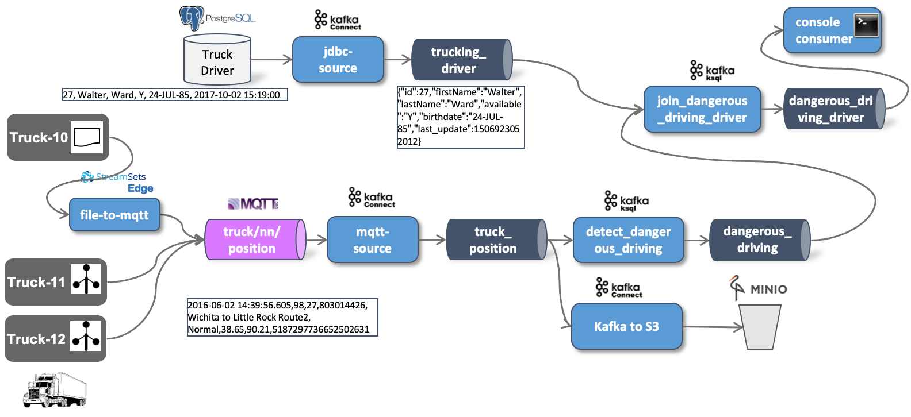

# IoT Data Ingestion - Moving Data from Kafka to Object Storage

In this workshop we will see how we can use Kafka Connect to move data from the Kafka topic with the Raw events (`truck_position`) to Object Storage.  



We will work with [MinIO](https://min.io/) as the Object Storage solution, but [Amazon S3](https://aws.amazon.com/s3/) or any other cloud Object Storage solution would work as well.
MinIO is available as part of the Data Platform. 

A similar approach would also work for moving data to HDFS.

## Configure a Kafka Connector

The connector in Kafka Connect to work with S3 compliant object storage is the [Confluent Kafka Connect S3](https://docs.confluent.io/current/connect/kafka-connect-s3/index.html). 

It is part of the Confluent Platform and pre-loaded with the Kafka cluster. We can easily test that using the REST API 

```
curl -X "GET" "$DOCKER_HOST_IP:8083/connectors" -H "Content-Type: application/json" -H "Accept: application/json"
```

or use the [Kafka Connect UI](http://dataplatform:28103/#/cluster/kafka-connect-1). If you click on **New** then on the page you should see the 

 

You can see the **Amazon S3 connector** ready to be used. 

So all we have to do is create a script with the REST call to setup the connector. 

In the `scripts` folder, create a file `start-s3.sh` and add the code below.  

```
#!/bin/bash

echo "removing MQTT Source Connector"

curl -X "DELETE" "$DOCKER_HOST_IP:8083/connectors/s3-confluent-sink"

echo "creating Confluent S3 Sink Connector"

curl -X "POST" "$DOCKER_HOST_IP:8083/connectors" \
     -H "Content-Type: application/json" \
     --data '{
  "name": "s3-confluent-sink",
  "config": {
      "connector.class": "io.confluent.connect.s3.S3SinkConnector",
      "partition.duration.ms": "3600000",
      "flush.size": "100",
      "topics": "truck_position",
      "tasks.max": "1",
      "timezone": "UTC",
      "locale": "en",
      "partitioner.class": "io.confluent.connect.storage.partitioner.DefaultPartitioner",
      "schema.generator.class": "io.confluent.connect.storage.hive.schema.DefaultSchemaGenerator",
      "storage.class": "io.confluent.connect.s3.storage.S3Storage",
      "format.class": "io.confluent.connect.s3.format.json.JsonFormat",
      "s3.region": "us-east-1",
      "s3.bucket.name": "kafka-logistics",
      "s3.part.size": "5242880",
      "store.url": "http://minio:9000",
      "key.converter": "org.apache.kafka.connect.storage.StringConverter",
      "value.converter": "org.apache.kafka.connect.storage.StringConverter"
  }
}'
```

We configure the connector to read the topic `truck_position` and write messages to the bucket named `kafka-logistics `. 

Also create a separate script `stop-s3.sh` for just stopping the connector and add the following code:

```
#!/bin/bash

echo "removing MQTT Source Connector"

curl -X "DELETE" "$DOCKER_HOST_IP:8083/connectors/s3-confluent-sink"
```

Make sure that the both scripts are executable

```
sudo chmod +x start-s3.sh
sudo chmod +x stop-s3.sh
```

## Create the Bucket in Object Storage

Before we can start the script, we have to make sure that the bucket `kafka-logistics` exists in Object Storage. 

In a browser window, navigate to <http://dataplatform:9000> and you should see login screen. Enter `V42FCGRVMK24JJ8DHUYG` into the **Access Key** and  `bKhWxVF3kQoLY9kFmt91l+tDrEoZjqnWXzY9Eza ` into the **Secret Key** field and click on the **connect** button.  

The MinIO homepage should now appear. Click on the **+** button on the lower right corner and create the bucket.

 

## Start the S3 connector

Finally let's start the connector by running the `start-s3` script.

```
./scripts/start-mqtt.sh
```

You have to make sure that either the ingestion into `truck_position` over MQTT is still working or that you have existing messages in the topic `truck_position`. 

You can also run the simulator to sidetrack the MQTT ingestion pipeline and produce directly to the Kafka topic instead:

```
docker run trivadis/iot-truck-simulator '-s' 'KAFKA' '-h' $PUBLIC_IP '-p' '9092' '-f' 'CSV' "-t" "sec"
```

As soon as the connector picks up messages, they should start to appear in the `kafka-logistics` bucket in MiniIO. 

You should see a new folder `topics` with a sub-folder `truck_position` representing the topic and inside this folder there is another folder per partition. 


In each folder you will find multiple objects, all with some messages from Kafka. 


Let's see the content of one of the objects. We cannot do that directly from the MinIO UI, we have to first download it and then use a local editor. To download an object, select the object and then click on the **Download object** button in the upper right corner.


The content of the object should be similar to the one shown below

```
gus@gusmacbook ~/Downloads> cat truck_position+0+0000000000.json
"1559500996371,18,22,1594289134,Normal,34.81,-91.93,8723575629839349139"
"1559500996494,26,14,160405074,Normal,41.87,-87.67,8723575629839349139"
"1559500996631,62,24,1090292248,Normal,41.66,-90.82,8723575629839349139"
"1559500996648,48,25,160779139,Normal,34.83,-91.38,8723575629839349139"
"1559500996736,18,22,1594289134,Normal,34.89,-91.74,8723575629839349139"
"1559500996830,26,14,160405074,Normal,41.48,-88.07,8723575629839349139"
"1559500997082,62,24,1090292248,Normal,41.67,-91.24,8723575629839349139"
"1559500997097,48,25,160779139,Normal,34.96,-91.14,8723575629839349139"
"1559500997178,18,22,1594289134,Normal,34.83,-91.38,8723575629839349139"
"1559500997367,26,14,160405074,Normal,41.11,-88.42,8723575629839349139"
"1559500997446,48,25,160779139,Normal,35.03,-90.94,8723575629839349139"
"1559500997523,62,24,1090292248,Normal,41.7,-91.59,8723575629839349139"
"1559500997619,18,22,1594289134,Normal,34.96,-91.14,8723575629839349139"
"1559500997740,26,14,160405074,Normal,40.76,-88.77,8723575629839349139"
...
```
----

[previous part](../05d-static-data-ingestion/README.md)	| 	[top](../05-iot-data-ingestion-and-analytics/README.md) 	