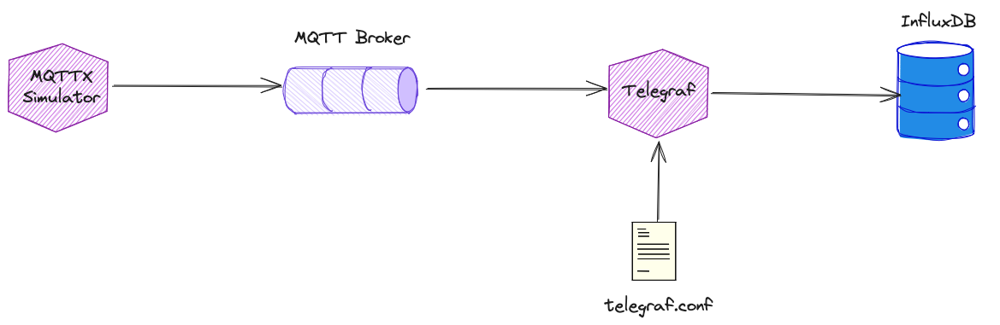

# IoT Smart Home Data — MQTT → Kafka → InfluxDB → Grafana

In this workshop we will build a complete IoT data pipeline that ingests simulated smart-home sensor data, routes it through Apache Kafka, persists it in InfluxDB 3.x, and visualises it in Grafana.

The data originates from the [MQTTX CLI](https://mqttx.app/docs/cli) `smart_home` simulator, which publishes one JSON message per home per interval to an MQTT broker. Kafka Connect bridges MQTT to a Kafka topic, and Telegraf then consumes that topic and writes the data into InfluxDB 3.x.



## Table of Contents

- [What you will learn](#what-you-will-learn)
- [Prerequisites](#prerequisites)
- [Part 1 — Update the Platform Configuration](#part-1--update-the-platform-configuration)
- [Part 2 — Run the MQTT Simulator](#part-2--run-the-mqtt-simulator)
- [Part 3 — View MQTT Messages](#part-3--view-mqtt-messages)
- [Part 4 — Bridge MQTT to Kafka with Kafka Connect](#part-4--bridge-mqtt-to-kafka-with-kafka-connect)
- [Part 5 — Verify Data in Kafka](#part-5--verify-data-in-kafka)
- [Part 6 — Create an InfluxDB Authentication Token](#part-6--create-an-influxdb-authentication-token)
- [Part 7 — Configure Telegraf to Consume from Kafka](#part-7--configure-telegraf-to-consume-from-kafka)
- [Part 8 — Query Data in InfluxDB](#part-8--query-data-in-influxdb)
- [Part 9 — Visualise with Grafana](#part-9--visualise-with-grafana)

## What you will learn

- How to simulate IoT sensor data using the MQTTX CLI `smart_home` scenario
- How to view MQTT messages using a dockerized CLI client and the HiveMQ Web UI
- How to use Kafka Connect (Confluent MQTT source connector) to bridge MQTT topics to a Kafka topic
- How to verify streaming data in Kafka using `kcat`
- How to create an operator authentication token for InfluxDB 3.x
- How to configure Telegraf to consume JSON messages from Kafka and flatten nested arrays
- How to store time-series data from Kafka into InfluxDB 3.x using Telegraf's `influxdb_v3` output plugin
- How to query time-series data using the `influxdb3` CLI with SQL
- How to connect Grafana to InfluxDB 3.x using InfluxQL and build time-series dashboards

## Prerequisites

- The **Data Platform** described in [00-environment](../00-environment) is running and accessible
- `DOCKER_HOST_IP` is set in your shell (e.g. `export DOCKER_HOST_IP=dataplatform` or the IP of your Docker host)

## Part 1 — Update the Platform Configuration

The base platform does not enable InfluxDB 3.x, Telegraf, or Grafana by default. You need to turn on these services and provide a custom Telegraf configuration before regenerating the platform.

### Update `config.yml`

Open `00-environment/docker/config.yml` and apply the following changes (search for each key and set the value):

```yaml
# ===== Influx DB 3.x ========
INFLUXDB3_enable: true
INFLUXDB3_object_store_type: file
INFLUXDB3_database: demo-db
INFLUXDB3_volume_map_data: false
INFLUXDB3_volume_map_plugins: false

# ===== Influx DB 3 Explorer (UI) ========
INFLUXDB3_EXPLORER_enable: true
INFLUXDB3_EXPLORER_mode: 'admin'
INFLUXDB3_EXPLORER_session_secret_key: 3fd4e9d0a3f7307fb5e3285414781fc2cfff1486d9306d0ea10dd5f39d6b0ea5
INFLUXDB3_EXPLORER_volume_map_data: false

# ===== Influx Telegraf ========
INFLUXDB_TELEGRAF_enable: true
INFLUXDB_TELEGRAF_custom_conf_file: 'telegraf-kafka-to-influxdb.conf'

# ===== Grafana ========
GRAFANA_enable: true
GRAFANA_install_plugins: 'grafana-piechart-panel'
```

### Copy the Telegraf configuration

Copy the Telegraf conf file provided in this workshop into the platform's Telegraf conf directory:

```bash
cp ./conf/telegraf-kafka-to-influxdb.conf $DATAPLATFORM_HOME/conf/telegraf/telegraf-kafka-to-influxdb.conf
```

Where `$DATAPLATFORM_HOME` is the `00-environment/docker` folder of this repository.

### Regenerate and restart the platform

Navigate to the platform folder and regenerate the `docker-compose.yml`:

```bash
cd $DATAPLATFORM_HOME
platys gen
docker compose up -d
```

> **What you should see:** `docker compose up -d` completes successfully with `influxdb3`, `telegraf`, and `grafana` containers listed as started.

> **Note:** If you are adding these services to an already-running platform, it is enough to run `docker compose up -d` after `platys gen`. Docker Compose will only start the new containers.

## Part 2 — Run the MQTT Simulator

The MQTTX CLI is available inside the platform as the `mqttx-cli` container.

### List available simulation scenarios

```bash
docker exec -ti mqttx-cli mqttx ls --scenarios
```

You should see output similar to:

```
┌───────────────┬──────────────────────────────────────────────────────────────────────────────────────────────┐
│ Scenario Name │ Description                                                                                  │
├───────────────┼──────────────────────────────────────────────────────────────────────────────────────────────┤
│ IEM           │ Simulation to generate Industrial Energy Monitoring data.                                    │
├───────────────┼──────────────────────────────────────────────────────────────────────────────────────────────┤
│ smart_home    │ Simulation to generate Smart Home data.                                                      │
├───────────────┼──────────────────────────────────────────────────────────────────────────────────────────────┤
│ tesla         │ Simulation to generate Tesla's data.                                                         │
├───────────────┼──────────────────────────────────────────────────────────────────────────────────────────────┤
│ weather       │ Simulation to generate advanced weather station's data.                                      │
└───────────────┴──────────────────────────────────────────────────────────────────────────────────────────────┘
```

> **What you should see:** Four built-in scenarios including `smart_home`.

### Start the simulator

In a terminal window, run the `smart_home` scenario against the Mosquitto broker. The `-c 100` flag simulates 100 homes:

```bash
docker exec -ti mqttx-cli mqttx simulate -sc smart_home -c 100 conn -h 'mosquitto-1' -p 1883
```

> **What you should see:** The simulator runs silently; messages are published to topics matching `mqttx/simulate/#` at regular intervals.

Keep this terminal running throughout the workshop.

### Understanding the message format

Each message is a single-line JSON document. The `smart_home` scenario produces one message per home per interval, containing a `rooms` array with per-room sensor readings:

```json
{
   "home_id": "88a76b99-6e22-4771-90cd-aba57deb1015",
   "owner_name": "Erik O'Connell",
   "address": "518 Ullrich Mall",
   "rooms": [
      { "room_type": "living room", "temperature": 20, "humidity": 47, "lights_on": true, "window_open": false },
      { "room_type": "bedroom",     "temperature": 22, "humidity": 39, "lights_on": true, "window_open": false, "bed_occupancy": false },
      { "room_type": "kitchen",     "temperature": 19, "humidity": 34, "lights_on": true, "window_open": true, "fridge_temperature": 7, "oven_on": true },
      { "room_type": "bathroom",    "temperature": 24, "humidity": 50, "lights_on": true, "window_open": true, "water_tap_running": true, "bath_water_level": 91 }
   ],
   "timestamp": 1714807284732
}
```

> **What just happened?** One JSON message represents all rooms of one home. Later, Telegraf will expand the `rooms` array so each room becomes its own row in InfluxDB.

## Part 3 — View MQTT Messages

Before involving Kafka, confirm that messages are arriving at the MQTT broker.

### Option A — Dockerized MQTT client

In a second terminal window run:

```bash
docker run -it --network streaming-data-platform --rm efrecon/mqtt-client \
    mosquitto_sub -h mosquitto-1 -p 1883 -t mqttx/simulate/#
```

> **What you should see:** A continuous stream of single-line JSON messages, one per home per interval.

### Option B — HiveMQ Web UI

Navigate to [http://dataplatform:28136](http://dataplatform:28136) and connect using:

- **Host**: `dataplatform`
- **Port**: `9101`

Click **Connect**, then click **Add New Topic Subscription** and enter `mqttx/simulate/#`. Click **Subscribe**.

> **What you should see:** Messages flowing in the subscriptions panel in real time.

## Part 4 — Bridge MQTT to Kafka with Kafka Connect

Kafka Connect is already running as part of the platform and the **Confluent MQTT Source Connector** (`confluentinc/kafka-connect-mqtt`) is pre-installed.

### Create the Kafka topic

Create a topic named `smart_home` with 8 partitions:

```bash
docker exec -ti kafka-1 kafka-topics \
  --bootstrap-server kafka-1:19092 \
  --create \
  --topic smart_home \
  --partitions 8 \
  --replication-factor 3
```

Verify it was created:

```bash
docker exec -ti kafka-1 kafka-topics --bootstrap-server kafka-1:19092 --list
```

> **What you should see:** `smart_home` listed among the topics.

### Deploy the MQTT → Kafka connector

Make the scripts executable and run the startup script:

```bash
chmod +x ./scripts/start-mqtt-to-kafka.sh
chmod +x ./scripts/stop-mqtt-to-kafka.sh
./scripts/start-mqtt-to-kafka.sh
```

The script calls the Kafka Connect REST API to register a connector with this configuration:

| Property | Value |
|---|---|
| `connector.class` | `io.confluent.connect.mqtt.MqttSourceConnector` |
| `mqtt.server.uri` | `tcp://mosquitto-1:1883` |
| `mqtt.topics` | `mqttx/simulate/#` |
| `kafka.topic` | `smart_home` |
| `value.converter` | `ByteArrayConverter` (raw bytes → Kafka, preserves JSON) |

> **What you should see:** The REST API responds with the connector configuration JSON confirming creation.

### Monitor the connector

Navigate to the [Kafka Connect UI](http://dataplatform:28103) to confirm the connector status shows **Running**.

You can also check via the REST API:

```bash
curl -s http://dataplatform:8083/connectors/mqtt-source-smart-home/status | python3 -m json.tool
```

> **What you should see:** `"state": "RUNNING"` for both the connector and its task.

> **What just happened?** The MQTT source connector subscribes to all topics matching `mqttx/simulate/#` on the Mosquitto broker. Every incoming MQTT message is forwarded as a Kafka record to the `smart_home` topic, with the MQTT topic path as the key and the raw JSON bytes as the value.

## Part 5 — Verify Data in Kafka

In a new terminal, start a consumer to confirm messages are flowing into the Kafka topic:

```bash
docker exec -ti kcat kcat -b kafka-1:19092 -t smart_home -C -q
```

You should see a continuous stream of JSON objects:

```
{"home_id":"88a76b99-6e22-4771-90cd-aba57deb1015","owner_name":"Erik O'Connell","address":"518 Ullrich Mall","rooms":[{"room_type":"living room","temperature":20,"humidity":47,"lights_on":true,"window_open":false},...]}
{"home_id":"3a9f1c00-1b44-4e28-9e71-3f5a3c2b0f11","owner_name":"Alice Smith","address":"12 Main St","rooms":[...]}
...
```

To also display the Kafka message key (which contains the original MQTT topic path):

```bash
docker exec -ti kcat kcat -b kafka-1:19092 -t smart_home -C -f "Key: %k\nValue: %s\n---\n" -q
```

> **What you should see:** Lines like `Key: mqttx/simulate/smart_home/0` followed by the full JSON payload for each home.

> **What just happened?** The MQTT connector wrote each MQTT message as a Kafka record. The MQTT topic path (`mqttx/simulate/smart_home/0`) is stored as the Kafka message key, and the raw JSON is the value. `kcat` connects directly to the broker and prints records as they arrive — no consumer group overhead.

Press **Ctrl-C** to stop the consumer.

## Part 6 — Create an InfluxDB Authentication Token

Telegraf needs a valid token to write data to InfluxDB 3.x. You create an operator token using the InfluxDB CLI inside the container.

### Create the token

```bash
docker exec -ti influxdb3 influxdb3 create token --admin
```

The output will look similar to:

```
Token: apiv3_FBiA8QmpreTRyfkSwjfnI07NfmbNyEXvbc7tlsTtW2NQMQFm1Fi9MC-Clp7VlYapEeNF030nH8PIlzwyz0O60Q==
```

Copy the token value.

### Export the token as an environment variable

```bash
export INFLUXDB_TOKEN="apiv3_FBiA8QmpreTRyfkSwjfnI07NfmbNyEXvbc7tlsTtW2NQMQFm1Fi9MC-Clp7VlYapEeNF030nH8PIlzwyz0O60Q=="
export INFLUXDB_DATABASE="demo-db"
```

> **Important:** Keep the `INFLUXDB_TOKEN` value safe — it grants full administrative access to InfluxDB 3.x.

## Part 7 — Configure Telegraf to Consume from Kafka

Telegraf is already running but needs to be (re)started with the correct environment variables so it can authenticate to InfluxDB and write to the right database.

### Review the Telegraf configuration

The configuration file provided at `conf/telegraf-kafka-to-influxdb.conf` (which you copied to the platform in Part 1) sets up:

- **Input**: `kafka_consumer` — connects to `kafka-1:19092`, subscribes to the `smart_home` topic, and uses the `json_v2` parser to flatten the nested `rooms` array.
- **Output**: `influxdb_v3` — writes to `http://influxdb3:8181` using the token and database from environment variables.

The `json_v2` parser maps the message as follows:

| Source JSON path | InfluxDB column | Type |
|---|---|---|
| `home_id` | `id` | tag |
| `owner_name` | `owner` | tag |
| `rooms[*].room_type` | `room_type` | tag |
| `rooms[*].temperature` | `temperature` | field |
| `rooms[*].humidity` | `humidity` | field |
| `rooms[*].lights_on` | `lights_on` | field |
| `rooms[*].window_open` | `window_open` | field |
| `timestamp` | `time` | timestamp (unix ms) |

Each element in the `rooms` array becomes **a separate row** in InfluxDB, meaning one MQTT message from a home with 4 rooms produces 4 InfluxDB rows.

### Inject the token into the Telegraf container

Pass the token and database as environment variables when restarting the Telegraf container:

```bash
docker compose -f $DATAPLATFORM_HOME/docker-compose.yml stop telegraf
docker compose -f $DATAPLATFORM_HOME/docker-compose.yml run -d \
  -e INFLUXDB_TOKEN="${INFLUXDB_TOKEN}" \
  -e INFLUXDB_DATABASE="${INFLUXDB_DATABASE}" \
  --name telegraf \
  telegraf
```

Alternatively, if the platform's `.env` file is used, add the variables there and restart:

```bash
echo "INFLUXDB_TOKEN=${INFLUXDB_TOKEN}" >> $DATAPLATFORM_HOME/.env
echo "INFLUXDB_DATABASE=${INFLUXDB_DATABASE}" >> $DATAPLATFORM_HOME/.env
docker compose -f $DATAPLATFORM_HOME/docker-compose.yml restart telegraf
```

### Verify Telegraf is writing to InfluxDB

Watch the Telegraf logs for write confirmations:

```bash
docker logs -f telegraf
```

After a few seconds you should see output like:

```
2026-04-12T12:00:05Z D! [outputs.influxdb_v3] Buffer fullness: 400 / 10000 metrics
2026-04-12T12:00:05Z D! [outputs.influxdb_v3] Successfully wrote batch of 400 metrics
```

> **What you should see:** Repeated lines confirming successful batch writes to InfluxDB. If you see `401 Unauthorized`, the token is missing or incorrect — verify that `INFLUXDB_TOKEN` is set correctly and restart Telegraf.

> **What just happened?** Telegraf polls Kafka for new records in the `smart_home` topic. For each record, the `json_v2` parser expands the `rooms` array into individual metrics and forwards them to InfluxDB 3.x using the Apache Arrow Flight SQL write protocol.

## Part 8 — Query Data in InfluxDB

### Verify the measurement exists

```bash
docker exec -ti influxdb3 influxdb3 query \
  --token $INFLUXDB_TOKEN \
  --database demo-db \
  "SHOW TABLES"
```

> **What you should see:** `smart_home` listed under the `iox` schema:

```
+---------------+------------+------------+------------+
| table_catalog | table_schema | table_name | table_type |
+---------------+------------+------------+------------+
| public        | iox        | smart_home | BASE TABLE |
...
+---------------+------------+------------+------------+
```

> **What just happened?** Telegraf created the `smart_home` measurement automatically when it wrote the first batch. InfluxDB 3.x stores measurements as tables in the `iox` schema; `SHOW TABLES` lists all of them.

### Query the most recent rows

```bash
docker exec -ti influxdb3 influxdb3 query \
  --token $INFLUXDB_TOKEN \
  --database demo-db \
  "SELECT time, id, owner, room_type, temperature, humidity FROM smart_home ORDER BY time DESC LIMIT 10"
```

Example output:

```
+-------------------------+--------------------------------------+----------------------+-------------+-------------+----------+
| time                    | id                                   | owner                | room_type   | temperature | humidity |
+-------------------------+--------------------------------------+----------------------+-------------+-------------+----------+
| 2026-04-12T13:03:12.903 | 94169b47-7c9b-4c4f-832a-d257082fc928 | Tina Collins IV      | kitchen     | 22.0        | 33.0     |
| 2026-04-12T13:03:12.903 | c0f5a3fe-ba16-4fc3-ae63-8cc470648b35 | Shaun Stiedemann V   | living room | 26.0        | 40.0     |
| 2026-04-12T13:03:12.902 | 94944779-1801-4a71-863e-a185c647a44a | Kerry Schaefer       | bedroom     | 21.0        | 32.0     |
| 2026-04-12T13:03:12.902 | db27e579-9f18-49cc-80c3-c063ff954b99 | Lola Thompson        | living room | 24.0        | 44.0     |
...
+-------------------------+--------------------------------------+----------------------+-------------+-------------+----------+
```

> **What you should see:** Rows with one entry per room per home, ordered by most recent timestamp first.

### Filter by room type

```bash
docker exec -ti influxdb3 influxdb3 query \
  --token $INFLUXDB_TOKEN \
  --database demo-db \
  "SELECT time, id, owner, temperature, humidity FROM smart_home WHERE room_type = 'living room' ORDER BY time DESC LIMIT 10"
```

> **What you should see:** Only rows where `room_type = 'living room'`.

### Average temperature by room type

```bash
docker exec -ti influxdb3 influxdb3 query \
  --token $INFLUXDB_TOKEN \
  --database demo-db \
  "SELECT room_type, AVG(temperature) AS avg_temp, AVG(humidity) AS avg_humidity FROM smart_home GROUP BY room_type ORDER BY room_type"
```

Example output:

```
+-------------+--------------------+--------------------+
| room_type   | avg_temp           | avg_humidity       |
+-------------+--------------------+--------------------+
| bathroom    | 21.99              | 40.04              |
| bedroom     | 22.00              | 39.98              |
| kitchen     | 22.01              | 39.99              |
| living room | 21.99              | 39.99              |
+-------------+--------------------+--------------------+
```

> **What you should see:** One row per room type with averaged temperature and humidity across all homes and time.

### Filter by time range

```bash
docker exec -ti influxdb3 influxdb3 query \
  --token $INFLUXDB_TOKEN \
  --database demo-db \
  "SELECT time, id, room_type, temperature, humidity FROM smart_home WHERE time >= now() - interval '5 minutes' ORDER BY time DESC"
```

> **What you should see:** Only rows from the last 5 minutes, sorted most-recent first.

### Count rows ingested via Kafka

Verify data is arriving through the full pipeline (MQTT → Kafka → Telegraf → InfluxDB):

```bash
docker exec -ti influxdb3 influxdb3 query \
  --token $INFLUXDB_TOKEN \
  --database demo-db \
  "SELECT COUNT(*) AS total_rows FROM smart_home"
```

Run this query a second time after 30 seconds — the count should increase, confirming that the end-to-end pipeline is live.

## Part 9 — Visualise with Grafana

### Open Grafana

Navigate to [http://dataplatform:3000](http://dataplatform:3000) and log in with:

- **Username**: `admin`
- **Password**: `admin`

You will be asked to change the password on first login.

### Add an InfluxDB datasource

1. In the left sidebar, click **Connections** → **Data sources** → **Add new data source**.
2. Search for **InfluxDB** and select it.
3. Configure the datasource:

| Field | Value |
|---|---|
| **Query language** | InfluxQL |
| **URL** | `http://influxdb3:8181` |
| **Database** | `demo-db` |
| **Custom HTTP Headers** | Header: `Authorization` / Value: `Token <YOUR_TOKEN>` |

Replace `<YOUR_TOKEN>` with the operator token generated in Part 6.

4. Click **Save & test**.

> **What you should see:** A green banner saying "datasource is working".

> **Note:** InfluxDB 3.x supports InfluxQL through its v1 compatibility API at `/query`. Grafana sends InfluxQL queries to this endpoint, which InfluxDB 3.x translates internally to its SQL engine.

### Create a new dashboard

Click the **+** icon in the sidebar and select **Dashboard** → **Add visualization**.

Select the **InfluxDB** datasource you just created.

#### Panel 1 — Temperature over time by room type

Switch to the **Code** editor in the query panel and enter:

```sql
SELECT mean("temperature") AS "temperature"
FROM "smart_home"
WHERE $timeFilter
GROUP BY time($__interval), "room_type"
fill(none)
```

- Set the **Visualization** type to **Time series**.
- Set the panel title to `Temperature by Room Type`.
- Under **Legend**, set the **Display name** to `${__field.labels.room_type}`.

Click **Apply** to save the panel.

#### Panel 2 — Humidity over time by room type

Add a second panel with the query:

```sql
SELECT mean("humidity") AS "humidity"
FROM "smart_home"
WHERE $timeFilter
GROUP BY time($__interval), "room_type"
fill(none)
```

- Set the **Visualization** type to **Time series**.
- Set the panel title to `Humidity by Room Type`.
- Set the **Unit** (under Standard options) to `Humidity (%H)`.

Click **Apply**.

#### Panel 3 — Latest readings table

Add a third panel to show the most recent reading per home and room:

```sql
SELECT last("temperature") AS "temperature", last("humidity") AS "humidity", "room_type", "owner"
FROM "smart_home"
WHERE $timeFilter
GROUP BY "id", "room_type", "owner"
```

- Set the **Visualization** type to **Table**.
- Set the panel title to `Latest Sensor Readings`.

Click **Apply**.

### Set dashboard time range and auto-refresh

In the dashboard toolbar:

- Set the time range to **Last 15 minutes** using the time picker in the top right.
- Click the **refresh** dropdown and select **5s** to auto-refresh every 5 seconds.

> **What you should see:** The time-series panels update with new data points arriving from the pipeline, and the table shows freshly ingested readings.

### Save the dashboard

Click the save icon (floppy disk) in the top toolbar, name the dashboard `Smart Home IoT`, and click **Save**.

## Summary

You have built a complete end-to-end IoT streaming pipeline:

```
MQTTX CLI (simulator)
      │  smart_home scenario — 100 homes × 4 rooms × JSON per interval
      ▼
Mosquitto (MQTT broker)
      │  topic: mqttx/simulate/#
      ▼
Kafka Connect — Confluent MQTT Source Connector
      │  topic: smart_home  (key = MQTT topic, value = raw JSON bytes)
      ▼
Apache Kafka
      │  topic: smart_home, 8 partitions
      ▼
Telegraf — kafka_consumer input + json_v2 parser
      │  1 MQTT message → 4 InfluxDB rows (one per room)
      ▼
InfluxDB 3.x
      │  measurement: smart_home  (tags: id, owner, room_type)
      ▼
Grafana
      └─ time-series panels + table panel (InfluxQL over v1 compat API)
```

This architecture decouples the MQTT ingestion layer from the storage layer. Kafka acts as a durable buffer and fan-out point — additional consumers (stream analytics engines, other sinks, ML pipelines) can read from the same `smart_home` topic independently without affecting each other or the original MQTT producer.

[back to overview](../README.md)
