# IoT Industrial Energy Monitoring — MQTT → Kafka → Iceberg/S3 → TimescaleDB → Grafana

In this workshop we will build a complete IoT data pipeline that ingests simulated industrial energy monitoring data, routes it through Apache Kafka, persists it in two storage backends — Apache Iceberg tables in S3-compatible object storage and a TimescaleDB time-series database — and visualizes it in Grafana.

The data originates from the [MQTTX CLI](https://mqttx.app/docs/cli) `IEM` simulator, which publishes one JSON message per factory per interval to an MQTT broker. Kafka Connect bridges MQTT to a Kafka topic, NiFi or Python flattens and serializes the nested JSON payload into Avro format, and the Avro records are then written to two sinks in parallel: an Apache Iceberg Sink Connector writes Parquet files into an S3 bucket (backed by RustFS), and a JDBC Sink Connector inserts the records into TimescaleDB. The Iceberg table can be queried interactively with Trino, while the TimescaleDB data is visualized through a Grafana dashboard.

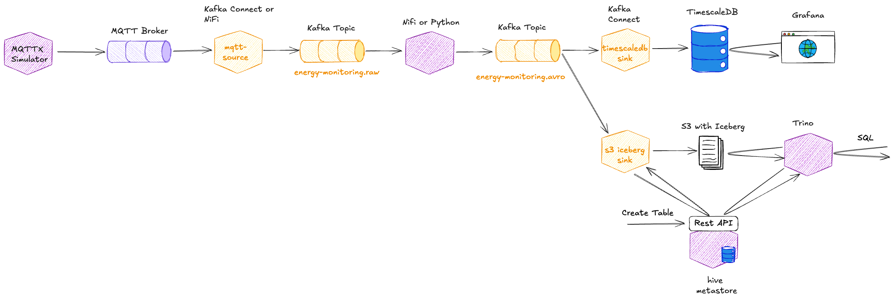

## Table of Contents

- [What you will learn](#what-you-will-learn)
- [Prerequisites](#prerequisites)
- [Running the Simulator and Publishing to MQTT](#running-the-simulator-and-publishing-to-mqtt)
- [Using an MQTT Client to view messages](#using-an-mqtt-client-to-view-messages)
- [Bridge MQTT to Kafka with Kafka Connect](#bridge-mqtt-to-kafka-with-kafka-connect)
- [Create Avro Schema for downstream processing](#create-avro-schema-for-downstream-processing)
- [Stream Processing Pipeline — NiFi or Python](#stream-processing-pipeline--nifi-or-python)
- [Using Apache NiFi to transform from raw to avro message](#using-apache-nifi-to-transform-from-raw-to-avro-message)
- [Using Python to transform from raw to avro message](#using-python-to-transform-from-raw-to-avro-message)
- [Write the Avro formatted messages as Iceberg tables in S3](#write-the-avro-formatted-messages-as-iceberg-tables-in-s3)
- [Query the Iceberg table with Trino](#query-the-iceberg-table-with-trino)
- [Write the Avro formatted messages to TimescaleDB](#write-the-avro-formatted-messages-to-timescaledb)
- [Visualize the TimescaleDB data in Grafana](#visualize-the-timescaledb-data-in-grafana)

## What you will learn

- How to simulate industrial energy monitoring data using the MQTTX CLI `IEM` scenario
- How to view MQTT messages using a dockerized CLI client
- How to use Kafka Connect (Lenses MQTT source connector) to bridge MQTT topics to a Kafka topic
- How to verify streaming data in Kafka using `kcat`
- How to register an Avro schema in the Confluent Schema Registry
- How to flatten nested JSON messages using Apache NiFi (JOLT transformation) or a Python script
- How to write Avro records from Kafka into an Apache Iceberg table in S3 using the Iceberg Sink Connector
- How to verify that Iceberg data files (Parquet) have arrived in S3 using the RustFS console and `mc` CLI
- How to query the Iceberg table interactively using the Trino CLI and DBeaver
- How to write Avro records from Kafka into TimescaleDB using the Kafka Connect JDBC Sink connector
- How to query time-series data in TimescaleDB using SQL
- How to connect Grafana to TimescaleDB and build a time-series dashboard

## Prerequisites

- The **Data Platform** described in [00-environment](../00-environment) is running and accessible

## Running the Simulator and Publishing to MQTT

The MQTT CLI is part of the platform started with Docker Compose. We can use it via the `docker exec` command.

The simulator comes with a few built-in scenarios. To list the available scenarios, in a terminal window execute the following:

```
docker exec -ti mqttx-cli mqttx ls --scenarios
```

and you should see a result similar to

```
~/w/platys-datahub>docker exec -ti mqttx-cli mqttx ls --scenarios                                                               1.303s 23:12
You can use any of the above scenario names as a parameter to run the scenario.
┌───────────────┬──────────────────────────────────────────────────────────────────────────────────────────────┐
│ Scenario Name │ Description                                                                                  │
├───────────────┼──────────────────────────────────────────────────────────────────────────────────────────────┤
│ IEM           │ Simulation to generate Industrial Energy Monitoring data.                                    │
├───────────────┼──────────────────────────────────────────────────────────────────────────────────────────────┤
│ smart_home    │ Simulation to generate Smart Home data.                                                      │
├───────────────┼──────────────────────────────────────────────────────────────────────────────────────────────┤
│ tesla         │ Simulation to generate Tesla's data, reference from https://github.com/adriankumpf/teslamate │
├───────────────┼──────────────────────────────────────────────────────────────────────────────────────────────┤
│ weather       │ Simulation to generate advanced weather station's data.                                      │
└───────────────┴──────────────────────────────────────────────────────────────────────────────────────────────┘
~/w/platys-datahub>
```

> **What you should see:** a table of four built-in scenarios including `IEM`.

We will be using the `IEM` scenario.

To run it, use the `simulate` option and specify with `conn` the MQTT broker to connect to. We are running `mosquitto` as part of the platform and this is the one we are connecting to.

```bash
docker exec -ti mqttx-cli mqttx simulate -sc IEM -c 100 conn  -h 'mosquitto-1' -p 1883
```

> **What you should see:** the simulator runs silently; messages are being published to the `mqttx/simulate/#` topic at regular intervals

## Using an MQTT Client to view messages

For viewing the messages in MQTT, there are many options available.

In this workshop we will use a dockerized MQTT client in the terminal to view the messages.

To start consuming through a command line, run the following Docker command from another terminal window:

```bash
docker run -it --network streaming-data-platform --rm efrecon/mqtt-client mosquitto_sub -h mosquitto-1 -p 1883 -t mqttx/simulate/IEM/#
```

The consumed messages will show up on the terminal window as shown below.

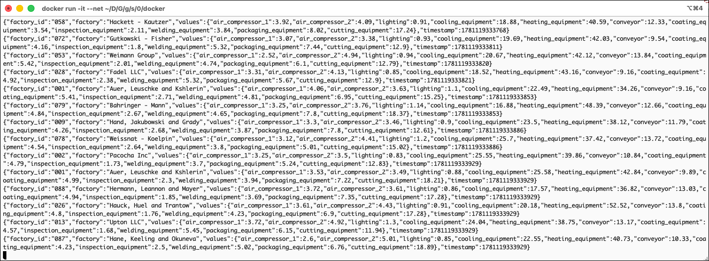

> **What you should see:** a continuous stream of single-line JSON messages appearing in the terminal, one per simulated factory per interval

Alternatively you can also use the [MQTTX Desktop](https://mqttx.app/downloads) version, available for installation on Mac or Windows.

In the subscription pattern we have used `mqttx/simulate/IEM/#`, where the `#` symbol is a wildcard used in topic subscriptions to match multiple levels in the topic hierarchy. It is known as the multi-level wildcard. It is important to note that `#` can only be used as the last character in a topic string, and only one `#` can be used in a single subscription.

If we check one of the messages, we can see that they are in JSON format, although all on one single line:

```json
{"factory_id":"013","factory":"Upton LLC","values":{"air_compressor_1":2.69,"air_compressor_2":5.35,"lighting":1.08,"cooling_equipment":26.85,"heating_equipment":43.97,"conveyor":11.1,"coating_equipment":4.37,"inspection_equipment":2,"welding_equipment":4.47,"packaging_equipment":6.1,"cutting_equipment":19.32},"timestamp":1781119405905}
```

If we "pretty-print" it, it is more readable:

```json
{
  "factory_id": "013",
  "factory": "Upton LLC",
  "values": {
    "air_compressor_1": 2.69,
    "air_compressor_2": 5.35,
    "lighting": 1.08,
    "cooling_equipment": 26.85,
    "heating_equipment": 43.97,
    "conveyor": 11.1,
    "coating_equipment": 4.37,
    "inspection_equipment": 2,
    "welding_equipment": 4.47,
    "packaging_equipment": 6.1,
    "cutting_equipment": 19.32
  },
  "timestamp": 1781119405905
}
```

We can see that one message of the `IEM` simulator contains data for one factory with various sensor values such as `lighting`, `cooling_equipment`, and others.

Let's build a bridge to retrieve them from MQTT and send them to Apache Kafka.

## Bridge MQTT to Kafka with Kafka Connect

For transporting messages from MQTT to Kafka, in this workshop we will be using Kafka Connect. 

There are multiple Kafka Source Connectors available for consuming from MQTT. We can either use the one provided by [Confluent Inc.](https://www.confluent.io/connector/kafka-connect-mqtt/) (which is part of Confluent Enterprise and requires an enterprise license) or the one provided as part of the [Landoop Stream-Reactor Project](https://github.com/Landoop/stream-reactor/tree/master/kafka-connect-mqtt) available on GitHub. We will be using the latter.

### Adding the MQTT Kafka Connector 

Kafka Connect runs as `kafka-connect-1` (and optionally `kafka-connect-2`) as part of the platform.

To add connector plugins without rebuilding the Docker image, both Connect services are configured to load additional plugins from `/etc/kafka-connect/custom-plugins` inside the container. This folder is mapped as a volume to the `plugins/kafka-connect` folder on the Docker host, so it is enough to copy the plugin files there.

Navigate into the `plugins/kafka-connect/connectors` folder (a sub-folder of the `docker` folder that holds the `docker-compose.yml` file):

```
cd $DATAPLATFORM_HOME/plugins/kafka-connect/connectors
```

and download the `11.7.7/kafka-connect-mqtt-11.7.7.zip` file from the [Landoop Stream-Reactor Project](https://github.com/Landoop/stream-reactor/tree/master/kafka-connect-mqtt) project.

```
wget https://github.com/lensesio/stream-reactor/releases/download/11.7.7/kafka-connect-mqtt-11.7.7.zip
```

Once it is successfully downloaded, unzip it and remove the archive:

```
unzip kafka-connect-mqtt-11.7.7.zip
rm kafka-connect-mqtt-11.7.7.zip
```

Now restart Kafka Connect to pick up the new plugin (make sure to navigate back to the docker folder first, either using `cd $DATAPLATFORM_HOME` or `cd ../..`):

```
cd $DATAPLATFORM_HOME
docker compose restart kafka-connect-1
```

The connector plugin should now be available to Kafka Connect. Confirm it by watching the container log:

```
docker compose logs -f kafka-connect-1
```

After a while you should see an output similar to the one below with a message that the MQTT connector was added and later that the connector finished starting ...

```
...
kafka-connect-1             | [2019-06-08 18:01:02,590] INFO Registered loader: PluginClassLoader{pluginLocation=file:/etc/kafka-connect/custom-plugins/kafka-connect-mqtt-1.2.1-2.1.0-all/} (org.apache.kafka.connect.runtime.isolation.DelegatingClassLoader)
kafka-connect-1             | [2019-06-08 18:01:02,591] INFO Added plugin 'com.datamountaineer.streamreactor.connect.mqtt.source.MqttSourceConnector' (org.apache.kafka.connect.runtime.isolation.DelegatingClassLoader)
kafka-connect-1             | [2019-06-08 18:01:02,591] INFO Added plugin 'com.datamountaineer.streamreactor.connect.mqtt.sink.MqttSinkConnector' (org.apache.kafka.connect.runtime.isolation.DelegatingClassLoader)
kafka-connect-1             | [2019-06-08 18:01:02,592] INFO Added plugin 'com.datamountaineer.streamreactor.connect.converters.source.JsonResilientConverter' (org.apache.kafka.connect.runtime.isolation.DelegatingClassLoader)
kafka-connect-1             | [2019-06-08 18:01:02,592] INFO Added plugin 'com.landoop.connect.sql.Transformation' (org.apache.kafka.connect.runtime.isolation.DelegatingClassLoader)
...
kafka-connect-1             | [2019-06-08 18:01:11,520] INFO Starting connectors and tasks using config offset -1 (org.apache.kafka.connect.runtime.distributed.DistributedHerder)
kafka-connect-1             | [2019-06-08 18:01:11,520] INFO Finished starting connectors and tasks (org.apache.kafka.connect.runtime.distributed.DistributedHerder)

```

Before we configure and use the connector, we first need to create the Kafka target topic.

### Create the necessary Kafka topic

The Kafka cluster is configured with `auto.topic.create.enable` set to `false`. Therefore we first have to create all the necessary topics, using the `kafka-topics` command line utility of Apache Kafka. 

Create a topic named `energy-monitoring.raw` with 8 partitions:

```bash
docker exec -ti kafka-1 kafka-topics \
  --bootstrap-server kafka-1:19092 \
  --create \
  --topic energy-monitoring.raw \
  --partitions 8 \
  --replication-factor 3
```

Verify it was created:

```bash
docker exec -ti kafka-1 kafka-topics --bootstrap-server kafka-1:19092 --list
```

> **What you should see:** `energy-monitoring.raw` listed among the topics.

### Configure and start the MQTT Connector

For creating an instance of the connector over the API, you can either use a REST client or the Linux `curl` command line utility, which should be available on the Docker host. Curl is what we are going to use here. 

Remove the connector, should it already exist:

```
curl -X DELETE "http://dataplatform:8083/connectors/mqtt-source"
```

Now create it using this curl command:

```bash
curl -X PUT \
  http://${DOCKER_HOST_IP}:8083/connectors/mqtt-source/config \
  -H 'Content-Type: application/json' \
  -H 'Accept: application/json' \
  -d '{
    "connector.class": "io.lenses.streamreactor.connect.mqtt.source.MqttSourceConnector",
    "connect.mqtt.connection.timeout": "1000",
    "tasks.max": "1",
    "connect.mqtt.kcql": "INSERT INTO energy-monitoring.raw SELECT * FROM mqttx/simulate/IEM/+ WITHCONVERTER=`io.lenses.streamreactor.connect.converters.source.JsonSimpleConverter` WITHKEY(factory_id)",
    "connect.mqtt.connection.clean": "true",
    "connect.mqtt.service.quality": "0",
    "connect.mqtt.connection.keep.alive": "1000",
    "connect.mqtt.client.id": "tm-mqtt-connect-01",
    "connect.mqtt.converter.throw.on.error": "true",
    "connect.mqtt.hosts": "tcp://mosquitto-1:1883",
    "key.converter": "org.apache.kafka.connect.json.JsonConverter",
    "key.converter.schemas.enable": "false",
    "value.converter": "org.apache.kafka.connect.json.JsonConverter",
    "value.converter.schemas.enable": "false"
}'
```

As soon as the connector starts receiving messages from MQTT, they will appear on the console. Use `kcat` to consume from the topic:

```bash
docker exec -ti kcat kcat -b kafka-1:19092 -t energy-monitoring.raw -q
```

```
eadp@eadp-virtual-machine:~$ docker exec -ti kcat kcat -b kafka-1:19092 -t energy-monitoring.raw -q
{"factory_id":"078","factory":"Dickinson - Lind","values":{"air_compressor_1":3.2,"air_compressor_2":4.55,"lighting":1.05,"cooling_equipment":17.2,"heating_equipment":36.82,"conveyor":10.26,"coating_equipment":5.48,"inspection_equipment":2.09,"welding_equipment":4.36,"packaging_equipment":8.01,"cutting_equipment":12.64},"timestamp":1781285306247}
{"factory_id":"078","factory":"Dickinson - Lind","values":{"air_compressor_1":2.72,"air_compressor_2":5.15,"lighting":0.92,"cooling_equipment":23.06,"heating_equipment":34.84,"conveyor":13.74,"coating_equipment":5.34,"inspection_equipment":2.15,"welding_equipment":4.36,"packaging_equipment":5.07,"cutting_equipment":12.4},"timestamp":1781285306249}
{"factory_id":"023","factory":"Schmeler, Stiedemann and Lebsack","values":{"air_compressor_1":2.79,"air_compressor_2":3.65,"lighting":1.35,"cooling_equipment":25.58,"heating_equipment":37.72,"conveyor":11.42,"coating_equipment":4.74,"inspection_equipment":2.56,"welding_equipment":3.61,"packaging_equipment":7.27,"cutting_equipment":17.51},"timestamp":1781285306436}
{"factory_id":"072","factory":"Heller, Parker and Weimann","values":{"air_compressor_1":4,"air_compressor_2":4.45,"lighting":1.13,"cooling_equipment":27.16,"heating_equipment":42.19,"conveyor":10.34,"coating_equipment":4.36,"inspection_equipment":2.11,"welding_equipment":5.02,"packaging_equipment":5.92,"cutting_equipment":17.8},"timestamp":1781285306579}
{"factory_id":"037","factory":"Nicolas - Pouros","values":{"air_compressor_1":3.32,"air_compressor_2":5.01,"lighting":0.98,"cooling_equipment":21.3,"heating_equipment":39.02,"conveyor":11.15,"coating_equipment":4.08,"inspection_equipment":2.24,"welding_equipment":4.46,"packaging_equipment":5.97,"cutting_equipment":16.81},"timestamp":1781285306710}
{"factory_id":"021","factory":"Lesch, Welch and O'Reilly","values":{"air_compressor_1":3.99,"air_compressor_2":4.63,"lighting":1.14,"cooling_equipment":22.47,"heating_equipment":44.75,"conveyor":8.97,"coating_equipment":5.1,"inspection_equipment":1.95,"welding_equipment":5.16,"packaging_equipment":6.98,"cutting_equipment":12.81},"timestamp":1781285306717}
{"factory_id":"096","factory":"Daniel - O'Hara","values":{"air_compressor_1":3.19,"air_compressor_2":4.2,"lighting":1.19,"cooling_equipment":22.04,"heating_equipment":49.17,"conveyor":9.73,"coating_equipment":5.37,"inspection_equipment":1.72,"welding_equipment":5.28,"packaging_equipment":8.2,"cutting_equipment":16.29},"timestamp":1781285306975}
{"factory_id":"094","factory":"Boyle Group","values":{"air_compressor_1":3.11,"air_compressor_2":4,"lighting":1.17,"cooling_equipment":27.53,"heating_equipment":47.04,"conveyor":10.87,"coating_equipment":4.69,"inspection_equipment":2.28,"welding_equipment":3.43,"packaging_equipment":7.37,"cutting_equipment":18.15},"timestamp":1781285306979}
{"factory_id":"076","factory":"Altenwerth, Hodkiewicz and Schoen","values":{"air_compressor_1":4.08,"air_compressor_2":4.03,"lighting":0.95,"cooling_equipment":22.83,"heating_equipment":38.09,"conveyor":10.12,"coating_equipment":5.21,"inspection_equipment":2.47,"welding_equipment":5.16,"packaging_equipment":6.25,"cutting_equipment":14.61},"timestamp":1781285306993}
```

To also display the Kafka message key (which contains the original MQTT topic path):

```bash
docker exec -ti kcat kcat -b kafka-1:19092 -t energy-monitoring.raw -C -f "Key: %k\nValue: %s\n---\n" -q
```

which produces an output like:

```
---
Key: "077"
Value: {"factory_id":"077","factory":"Bode - Feeney","values":{"air_compressor_1":3.74,"air_compressor_2":4.1,"lighting":0.91,"cooling_equipment":25.94,"heating_equipment":40.46,"conveyor":8.96,"coating_equipment":5.24,"inspection_equipment":1.76,"welding_equipment":4.59,"packaging_equipment":5.05,"cutting_equipment":12.06},"timestamp":1781285498451}
---
Key: "017"
Value: {"factory_id":"017","factory":"Pfannerstill Group","values":{"air_compressor_1":3.59,"air_compressor_2":4.7,"lighting":1.11,"cooling_equipment":22.32,"heating_equipment":38.87,"conveyor":12.83,"coating_equipment":4.04,"inspection_equipment":2.53,"welding_equipment":4.28,"packaging_equipment":6.91,"cutting_equipment":14.46},"timestamp":1781285498464}
---
Key: "077"
Value: {"factory_id":"077","factory":"Bode - Feeney","values":{"air_compressor_1":3.75,"air_compressor_2":5.26,"lighting":1.03,"cooling_equipment":19.76,"heating_equipment":50.83,"conveyor":13.71,"coating_equipment":4.1,"inspection_equipment":1.88,"welding_equipment":3.95,"packaging_equipment":7.48,"cutting_equipment":13.59},"timestamp":1781285522496}
---
Key: "077"
Value: {"factory_id":"077","factory":"Bode - Feeney","values":{"air_compressor_1":3.86,"air_compressor_2":3.91,"lighting":1.38,"cooling_equipment":20.94,"heating_equipment":39.06,"conveyor":9.02,"coating_equipment":3.91,"inspection_equipment":2.14,"welding_equipment":5.07,"packaging_equipment":8.04,"cutting_equipment":17.14},"timestamp":1781285522503}
---
```

> **What you should see:** Lines like `Key: "077"` (the factory ID) followed by the full JSON payload for each factory.

> **What just happened?** The MQTT connector wrote each MQTT message as a Kafka record. The `factory_id` value is stored as the Kafka message key, and the raw JSON is the value. `kcat` connects directly to the broker and prints records as they arrive — no consumer group overhead.

Press **Ctrl-C** to stop the consumer.

### Monitor connector in Kafka Connect UI

Navigate to the [Kafka Connect UI](http://dataplatform:28103) to see the connector running.

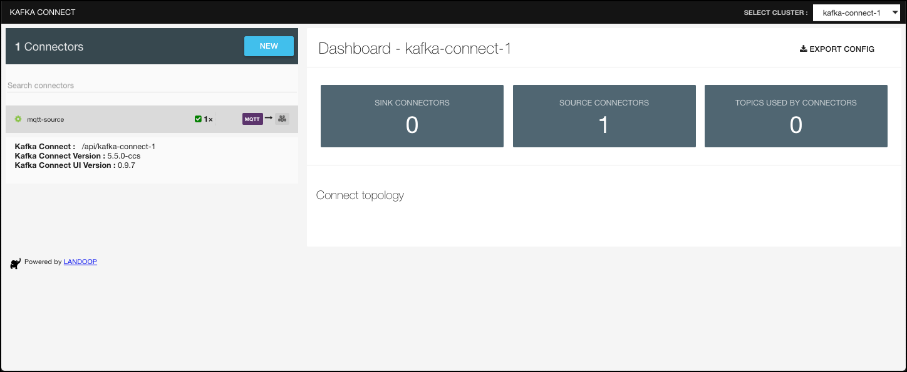

> **What you should see:** `"state": "RUNNING"` for both the connector and its task.

> **What just happened?** The MQTT source connector subscribes to all topics matching `mqttx/simulate/IEM/+` on the Mosquitto broker. Every incoming MQTT message is forwarded as a Kafka record to the `energy-monitoring.raw` topic, with the MQTT topic path as the key and the raw JSON bytes as the value.

## Create Avro Schema for downstream processing

Pre-register the schema by POSTing it to the Schema Registry. Save the Avro schema to a file:

```
cat > energy-monitoring.avsc << 'EOF'
{
  "type": "record",
  "name": "EnergyLog",
  "namespace": "com.energy.monitoring",
  "doc": "Flattened energy consumption record per factory",
  "fields": [
    {
      "name": "factory_id",
      "type": "string",
      "doc": "Unique factory identifier"
    },
    {
      "name": "factory",
      "type": "string",
      "doc": "Factory name"
    },
    {
      "name": "timestamp",
      "type": "long",
      "doc": "Event time in milliseconds since epoch"
    },
    {
      "name": "air_compressor_1",
      "type": "double",
      "doc": "Air compressor 1 energy consumption (kWh)"
    },
    {
      "name": "air_compressor_2",
      "type": "double",
      "doc": "Air compressor 2 energy consumption (kWh)"
    },
    {
      "name": "lighting",
      "type": "double",
      "doc": "Lighting energy consumption (kWh)"
    },
    {
      "name": "cooling_equipment",
      "type": "double",
      "doc": "Cooling equipment energy consumption (kWh)"
    },
    {
      "name": "heating_equipment",
      "type": "double",
      "doc": "Heating equipment energy consumption (kWh)"
    },
    {
      "name": "conveyor",
      "type": "double",
      "doc": "Conveyor energy consumption (kWh)"
    },
    {
      "name": "coating_equipment",
      "type": "double",
      "doc": "Coating equipment energy consumption (kWh)"
    },
    {
      "name": "inspection_equipment",
      "type": "double",
      "doc": "Inspection equipment energy consumption (kWh)"
    },
    {
      "name": "welding_equipment",
      "type": "double",
      "doc": "Welding equipment energy consumption (kWh)"
    },
    {
      "name": "packaging_equipment",
      "type": "double",
      "doc": "Packaging equipment energy consumption (kWh)"
    },
    {
      "name": "cutting_equipment",
      "type": "double",
      "doc": "Cutting equipment energy consumption (kWh)"
    }
  ]
}
EOF
```

Before registering the schema, set the compatibility level for the subject. The default is BACKWARD (new schema can read data written with the previous schema), but you can choose the level that fits your evolution strategy:

```bash
curl -s -X PUT http://dataplatform:8081/config/energy-monitoring.avro-value \
    -H "Content-Type: application/vnd.schemaregistry.v1+json" \
    -d '{"compatibility": "BACKWARD"}'
```

Then register the schema using jq to produce the correctly escaped request body:

```bash
jq -n --arg schema "$(cat energy-monitoring.avsc)" '{"schema": $schema}' | \
  curl -s -X POST http://dataplatform:8081/subjects/energy-monitoring.avro-value/versions \
    -H "Content-Type: application/vnd.schemaregistry.v1+json" \
    -d @-
```    

### Transforming JSON to JSON using JOLT

[JOLT](https://github.com/bazaarvoice/jolt) (JSON to JSON Transformation Library) is a Java library that transforms a JSON document into a new JSON structure using a declarative specification written in JSON itself. Instead of writing imperative code to map fields, you describe the desired output shape and JOLT figures out how to get there. The specification is made up of one or more transformation steps — the most commonly used are `shift` (picks fields from the input and places them at new paths in the output), `default` (adds fields with a constant value when they are absent), and `remove` (drops unwanted fields). 

In our case the raw message coming from the `energy-monitoring.raw` topic has the sensor readings nested inside a `values` object:

```json
{
  "factory_id": "094",
  "factory": "Grady Inc",
  "values": {
    "air_compressor_1": 2.92,
    "air_compressor_2": 4.59,
    "lighting": 1.02,
    "cooling_equipment": 26.49,
    "heating_equipment": 44.12,
    "conveyor": 10.04,
    "coating_equipment": 5.13,
    "inspection_equipment": 2.13,
    "welding_equipment": 3.36,
    "packaging_equipment": 8.26,
    "cutting_equipment": 11.89
  },
  "timestamp": 1781291723724
}
```

The JOLT `shift` spec below promotes every key inside `values` to the top level, producing a flat record that matches the Avro schema registered earlier:

```json
[
  {
    "operation": "shift",
    "spec": {
      "factory_id": "factory_id",
      "factory": "factory",
      "timestamp": "timestamp",
      "values": {
        "*": "&"
      }
    }
  }
]
```

> **Tip — test your spec interactively:** Before pasting a JOLT spec into NiFi or any code, you can validate it in the browser using the [JOLT Transform Demo](https://jolt-demo.appspot.com/#inception). Paste the input JSON in the **Json Input** panel, the spec in the **Jolt Spec** panel, and click **Transform** to see the output immediately. This is the fastest way to iterate on a spec and catch mistakes without restarting any services.

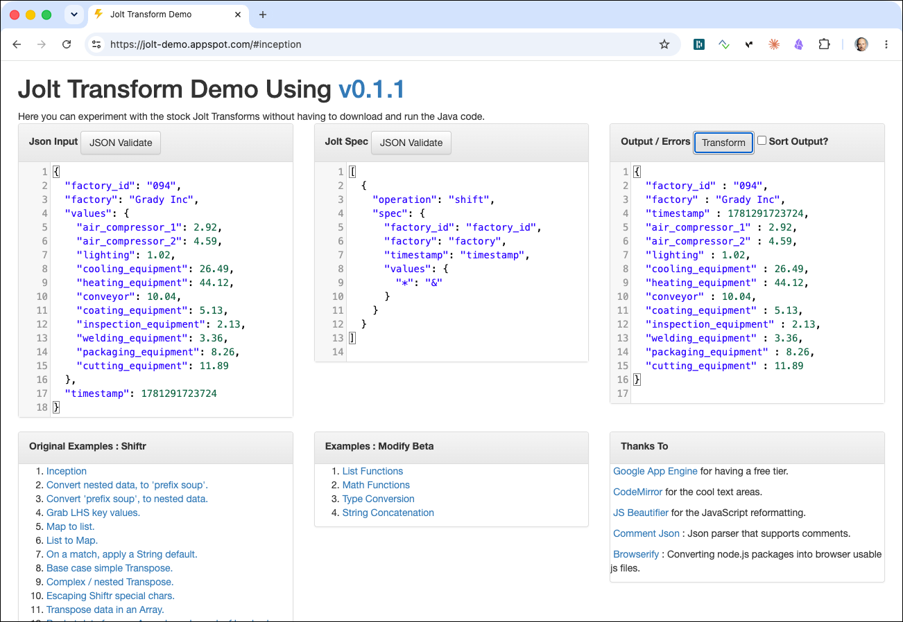

## Stream Processing Pipeline — NiFi or Python

Now that the raw messages are in Kafka and the JOLT transformation spec is defined, the next step is to wire the flattening into a running stream processing pipeline. The pipeline consumes records from `energy-monitoring.raw`, applies the JOLT shift transformation to promote the nested sensor values to the top level, serialises the result as Avro against the Schema Registry, and writes the flattened records to the `energy-monitoring` topic.

Two alternative implementations are provided — pick the one that fits your environment best:

| Approach | When to use |
|----------|-------------|
| **Apache NiFi** | Visual, low-code; easy to monitor throughput and back-pressure; no Python runtime needed |
| **Python script** | Lightweight; easy to run anywhere Python is available; useful for scripting or CI pipelines |

Both approaches produce identical Avro output to the same `energy-monitoring` topic, so you can switch between them.

## Using Apache NiFi to transform from raw to avro message

[Apache NiFi](https://nifi.apache.org) is a visual data flow tool designed for routing, transforming, and mediating data between systems. It is a natural fit here because flattening a nested JSON record — exactly what we need to do — is the kind of stateless per-message transformation NiFi handles without writing any code. NiFi also provides a live monitoring view of throughput and backpressure on every connection, which makes it easy to observe the data flow during the workshop.

In a browser navigate to <https://dataplatform:18083/nifi>. NiFi uses a self-signed certificate, so confirm the browser security warning before proceeding.

Enter `nifi` into the **User** field and `1234567890ACD` into the **Password** field and click **LOG IN**.

> **What you should see:** The NiFi canvas — a workspace where you will build the data flow.

> **Shortcut — import the pre-built flow:** Instead of building the pipeline manually step by step, you can import the complete process group directly. On the NiFi canvas, drag the **Process Group** icon from the toolbar, then click **Browse** in the dialog and select the file `nifi/energy-monitoring-pg.json` from this workshop folder. The fully configured pipeline — ConsumeKafka → JoltTransformRecord → PublishKafka — will appear on the canvas ready to start. To start it right-click on the process group and select **Enable All Controller Services** followed by another right-click and selecting **Start**. You can still follow the sections below to understand what each processor does.

### Add a Process Group first

Drag the **Process Group** icon from the toolbar onto the canvas.

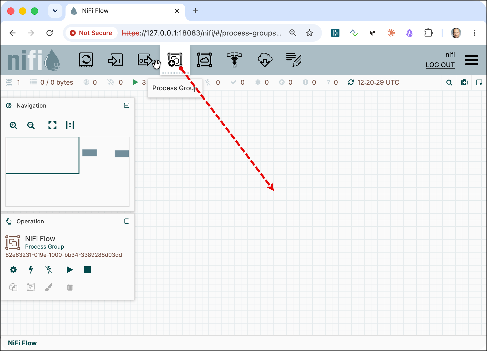

On the **Create Process Group** pop-up window, enter `energy-monitoring-pg` into the **Name** field and click **Add**. 

Double click on the new **energy-monitoring-pg** process group to navigate into the group. 

### Adding a `ConsumeKafka` processor

Drag the **Processor** icon from the toolbar onto the canvas.


The processor chooser dialog opens. Type **ConsumeK** into the filter box and select **ConsumeKafka**, then click **Add**.


> **What you should see:** A `ConsumeKafka` processor on the canvas with a yellow warning marker, indicating it is not yet configured.

Double-click the processor and click the **Properties** tab. Configure the following properties:

- **Kafka Connection Service**: click the three dots, select **+ Create new service**, choose **Kafka3ConnectionService**, and click **Add**. Click the three dots again and select **Go To Service**. In the service list click the three dots and select **Edit**, navigate to **Properties**, and set:
  - **Bootstrap Servers**: `kafka-1:19092`

  Click **Apply**, then enable the service by clicking the three dots and selecting **Enable**. Click **Close** and **Back to Processor**.
- **Group ID**: `energy-monitoring.raw-cg`
- **Topics**: `energy-monitoring.raw`
- **Processing Strategy**: `RECORD`
- **Record Reader**: click the three dots, select **+ Create new service**, choose **JsonTreeReader**, and click **Add**. Click the three dots again and select **Go To Service**. Enable the service via its three-dot menu. Click **Close** and **Back to Processor**.
- **Record Writer**: click the three dots, select **+ Create new service**, choose **JsonRecordSetWriter**, and click **Add**. Click the three dots again and select **Go To Service**. In the service list click the three dots and select **Edit**, navigate to **Properties** and set:
  - **Output Grouping**: `One Line per Object`

  Click **Apply** and enable the service. Click **Close** and **Back to Processor**.

The configured processor should look as shown below:

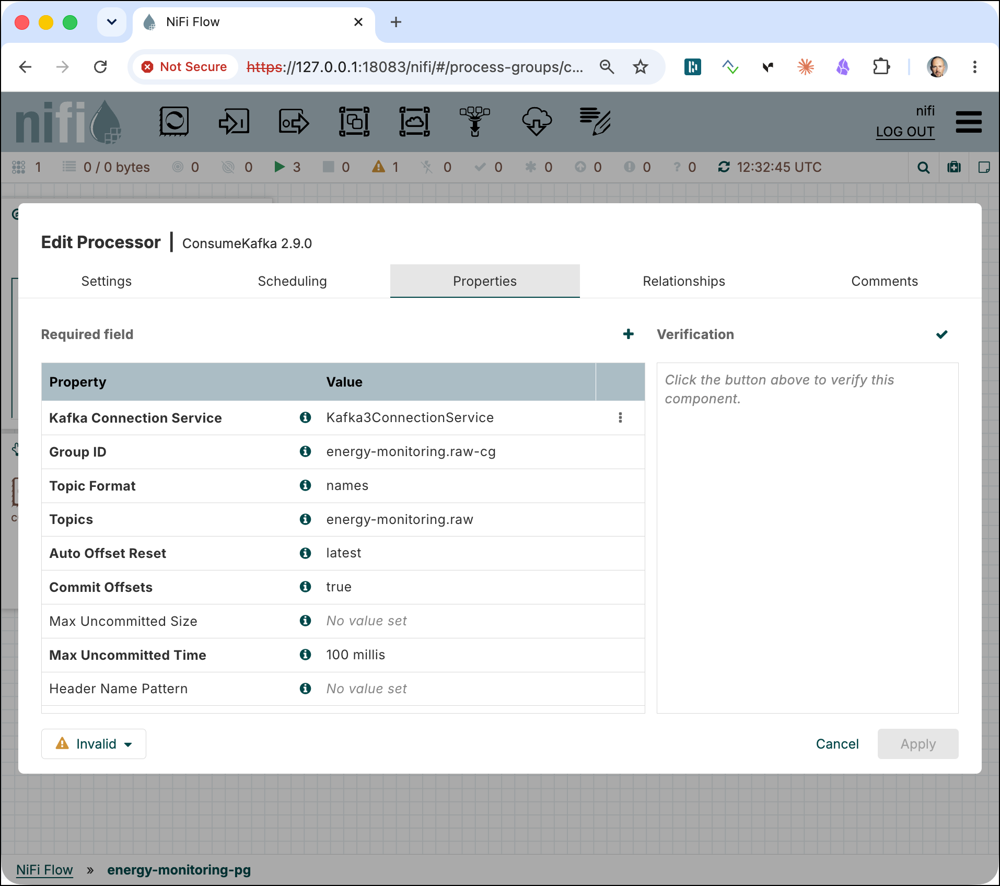

Click **Apply** to close the dialog.

### Flatten raw message using JOLT transformation

In Apache NiFi the **JoltTransformRecord** (or **JoltTransformJSON**) processor applies a JOLT spec to every record that passes through it, making it straightforward to flatten, rename, or restructure JSON messages inline in the data flow without writing any custom code.

The JOLT spec is already described in the [Transforming JSON to JSON using JOLT](#transforming-json-to-json-using-jolt) section above. We will use the same spec here.

As we already get records from the **ConsumeKafka** processor, let's use a **JoltTransformRecord** to transform (flatten) the raw message. Drag a new processor to the canvas and search for the **JoltTransformRecord** processor. Double-click on the new processor to navigate to the **Properties** tab. 

Configure the following properties:

  - **Jolt Transform**: `Chain`
  - **Jolt Specification**: copy the JOLT spec from above

    ```json
    [
      {
        "operation": "shift",
        "spec": {
          "factory_id": "factory_id",
          "factory": "factory",
          "timestamp": "timestamp",
          "values": {
            "*": "&"
          }
        }
      }
    ]
    ```

  - **Record Reader**: select the existing `JsonTreeReader` created before
  - **Record Writer**: select the existing `JsonRecordSetWriter` created before

Click **Apply** to close the dialog for the **JoltTransformRecord** processor.  

### Adding a `ProduceKafka` processor

Drag the **Processor** icon from the toolbar onto the canvas.

Type **PublishK** into the filter box and select **PublishKafka**, then click **Add**.

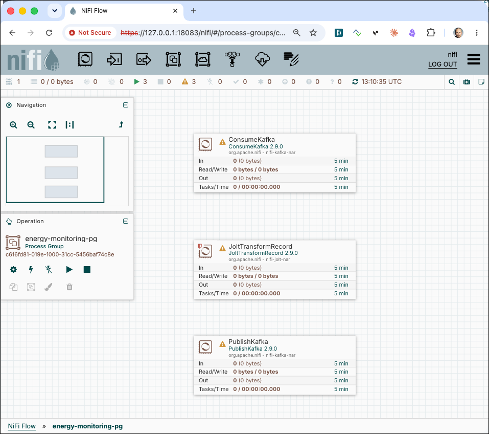

> **What you should see:** A `PublishKafka` processor on the canvas together with the other two processors.

Before we configure the **PublishKafka** processor, let's connect them so we can already run the first two to validate that the flattening worked.

### Connecting the processors

Let's wire up the processors **ConsumeKafka → JoltTransformRecord → PublishKafka** by dragging from the source processor's edge to the destination and select the appropriate relationship in the dialog and terminate unused relationships on each processor:

- **ConsumeKafka**: link `success`, terminate `parse.failure` (by double-clicking **ConsumeKafka** and navigate to tab **Relationships**)
- **JoltTransformRecord** (both): link `success`, terminate `failure` and `original`
- **PublishKafka**: terminate `failure` and `success`

The first two processors should no longer have a warning indicator — only the last one.

### Start the first two processors

Select **ConsumeKafka** and **JoltTransformRecord**, right-click and select **Start**. Wait a few seconds, then stop only the **ConsumeKafka** processor (leave **JoltTransformRecord** running) to limit the number of records processed.

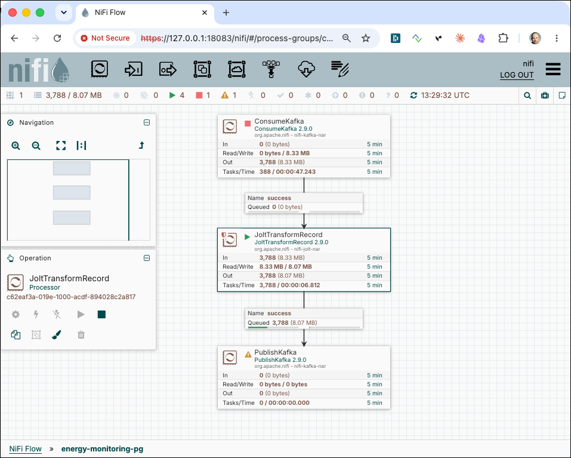

> **What you should see:** some messages should be queued on the **success** connection before the **PublishKafka** processor. 

Right-click on the connection with the queued records and select **List Queue**. On the list of records, click on the 3 dots right to one of the messages and select **View content**

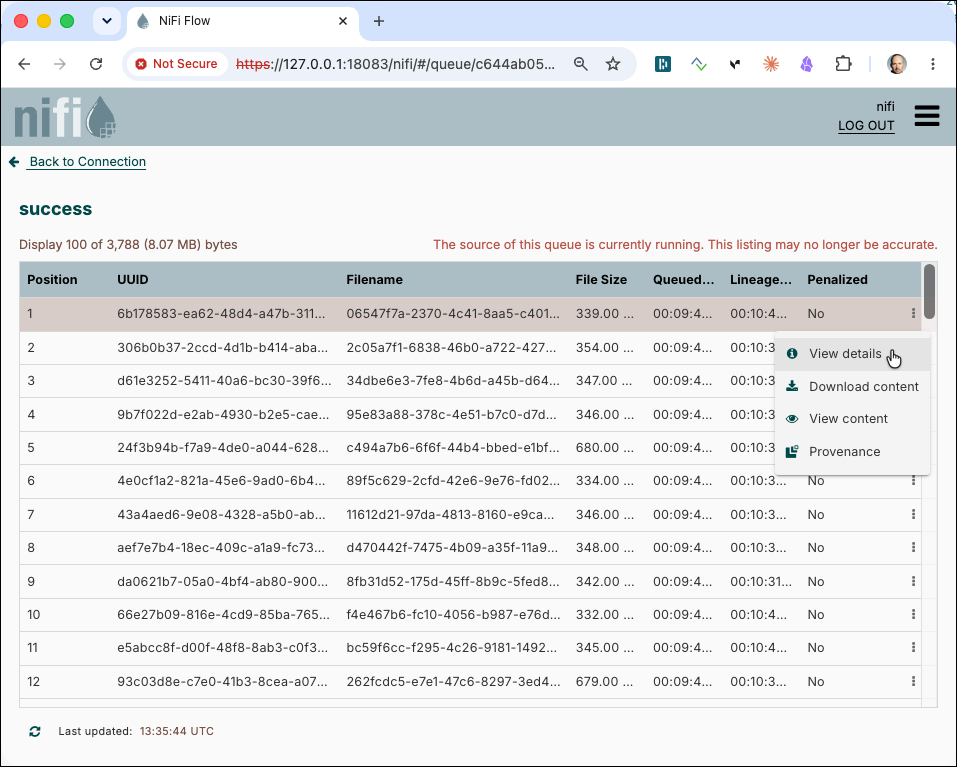

A window in a new browser tab showing the content of the message should appear:

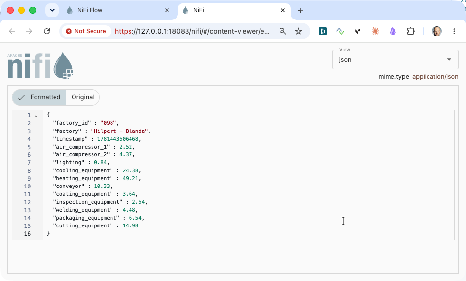

> **What you should see:** the message was successfully flattened by the Jolt transformation.

Close the tab and on the list of records click on **Back to Connection** to navigate back to the canvas.

### Configure the Publish Kafka processor

To finish the pipeline, let's configure the last processor to send the message to the `energy-monitoring.avro` topic.

Double-click on the **PublishKafka** processor and configure the following properties:

- **Kafka Connection Service**: select `Kafka3ConnectionService` from the drop-down
- **Topic Name**: `energy-monitoring.avro`
- **Compression Type**: `zstd`
- **Record Reader**: select existing `JsonTreeReader`
- **Record Writer**: click the three dots, select **+ Create new service**, choose **AvroRecordSetWriter**, and click **Add**. Click the three dots again and select **Go To Service**. In the service list click the three dots and select **Edit**, navigate to **Properties** and set:
  - **Schema Write Strategy**: `Schema Reference Writer`
  - **Schema Reference Writer**: click the three dots, select **+ Create new service**, choose **ConfluentEncodedSchemaReferenceWriter**, and click **Add**. Click the three dots again and select **Go To Service**. Click the three dots again and select **Enable** and click **Enable** and click **Back to Controller Service**.  
  - **Schema Access Strategy**: `Use 'Schema Name' Property`
  - **Schema Name**: `energy-monitoring.avro-value`
  - **Schema Registry**: click the three dots, select **+ Create new service**, choose **ConfluentSchemaRegistry**, and click **Add**. Click the three dots again and select **Go To Service**. In the service list click the three dots and select **Edit**, navigate to **Properties** and set:
    - **Schema Registry URLs**: `http://schema-registry-1:8081`

    Click **Apply** and enable the service. Also enable the **AvroRecordSetWriter**. Click **Back to Controller Service** and click **Close**.

The **PublishKafka** should now be startable as well and no longer show a warning indicator. Before we can actually start it, we have to create the Kafka topic. 

```bash
docker exec -ti kafka-1 kafka-topics --bootstrap-server kafka-1:19092 --create --if-not-exists --topic energy-monitoring.avro     --replication-factor 3 --partitions 8
```

Let's also create a `kcat` consumer to see the messages, as soon as we start the Kafka publisher

```bash
docker exec -ti kcat kcat -b kafka-1:19092 -t energy-monitoring.avro -q -s value=avro -r http://schema-registry-1:8081
```

Now start the **PublishKafka** processor in Apache Nifi and immediately the messages should appear in the terminal where `kcat` runs.

```json
{"factory_id": "058", "factory": "Hansen and Sons", "timestamp": 1781446704970, "air_compressor_1": 3.98, "air_compressor_2": 4.9800000000000004, "lighting": 1.0900000000000001, "cooling_equipment": 27.219999999999999, "heating_equipment": 50.530000000000001, "conveyor": 13.18, "coating_equipment": 3.5499999999999998, "inspection_equipment": 2.3799999999999999, "welding_equipment": 3.6499999999999999, "packaging_equipment": 5.3499999999999996, "cutting_equipment": 16.25}
{"factory_id": "060", "factory": "Langworth Group", "timestamp": 1781446704967, "air_compressor_1": 3.2999999999999998, "air_compressor_2": 4.9000000000000004, "lighting": 1.0800000000000001, "cooling_equipment": 25.23, "heating_equipment": 40.560000000000002, "conveyor": 12.49, "coating_equipment": 3.6499999999999999, "inspection_equipment": 2.5800000000000001, "welding_equipment": 4.0800000000000001, "packaging_equipment": 5.2000000000000002, "cutting_equipment": 17.940000000000001}
{"factory_id": "093", "factory": "Crist Inc", "timestamp": 1781446704970, "air_compressor_1": 3.77, "air_compressor_2": 4.1600000000000001, "lighting": 0.95999999999999996, "cooling_equipment": 27.77, "heating_equipment": 45.299999999999997, "conveyor": 10.32, "coating_equipment": 4.8399999999999999, "inspection_equipment": 2.3900000000000001, "welding_equipment": 5.4800000000000004, "packaging_equipment": 7.0700000000000003, "cutting_equipment": 19.09}
{"factory_id": "049", "factory": "Littel - Kiehn", "timestamp": 1781446705074, "air_compressor_1": 4.1100000000000003, "air_compressor_2": 4.9800000000000004, "lighting": 1.03, "cooling_equipment": 19.059999999999999, "heating_equipment": 38.719999999999999, "conveyor": 12.42, "coating_equipment": 4.6299999999999999, "inspection_equipment": 2.25, "welding_equipment": 4.8499999999999996, "packaging_equipment": 5.6900000000000004, "cutting_equipment": 13.68}
{"factory_id": "053", "factory": "Dooley - Kessler", "timestamp": 1781446705195, "air_compressor_1": 3.1800000000000002, "air_compressor_2": 3.77, "lighting": 0.98999999999999999, "cooling_equipment": 23.809999999999999, "heating_equipment": 43.200000000000003, "conveyor": 11.5, "coating_equipment": 4.5700000000000003, "inspection_equipment": 2.5099999999999998, "welding_equipment": 3.5, "packaging_equipment": 5.5300000000000002, "cutting_equipment": 18.07}
{"factory_id": "075", "factory": "Metz, Stehr and Hyatt", "timestamp": 1781446705219, "air_compressor_1": 3.6200000000000001, "air_compressor_2": 4.5499999999999998, "lighting": 0.91000000000000003, "cooling_equipment": 24.870000000000001, "heating_equipment": 45.159999999999997, "conveyor": 9.2300000000000004, "coating_equipment": 4.6900000000000004, "inspection_equipment": 2.3900000000000001, "welding_equipment": 4.2300000000000004, "packaging_equipment": 7.1699999999999999, "cutting_equipment": 18.620000000000001}
```

> **What you should see:** the messages are shown as JSON even though they are transmitted as Avro. `kcat` deserialises them to JSON because we specified `-s value=avro -r http://schema-registry-1:8081`.


## Using Python to transform from raw to avro message

As an alternative to the NiFi flow, you can run a lightweight Python script that reads raw JSON messages from `energy-monitoring.raw`, flattens them using plain Python dict manipulation, and produces Avro-serialised records to `energy-monitoring.avro`.

> **Note:** JOLT is a Java library and there is no official Python port. Community packages that attempt to replicate JOLT in Python are incomplete and not production-ready. For the Python implementation we therefore apply the same transformation logic directly in code rather than interpreting a JOLT spec.

The script needs to be able to reach the Kafka broker and Schema Registry, which are only accessible inside the Docker Compose network. We could deploy it as a Docker container (a `Dockerfile` is provided in the `python/` folder for that purpose), but for workshop simplicity we will run it directly inside Jupyter, which is already part of the platform.

### Preparation

In a browser window, navigate to <http://dataplatform:28888> and use token `abc123!` to login. 

Create a new notebook and install the only dependency needed:

```bash
pip install confluent-kafka[avro]==2.14.2
```

The script flattens the message with a single dict comprehension (see the `flatten` function in [`python/flatten_plain.py`](python/flatten_plain.py)):

```python
"""
Reads raw JSON energy-monitoring messages from Kafka, flattens the nested
'values' object using plain Python dict manipulation, and produces
Avro-serialised records to the energy-monitoring topic via the Confluent
Schema Registry.

Usage:
    pip install -r requirements.txt
    python flatten_plain.py
"""

import json
import os

from confluent_kafka import Consumer, KafkaException, Producer
from confluent_kafka.schema_registry import SchemaRegistryClient
from confluent_kafka.schema_registry.avro import AvroSerializer
from confluent_kafka.serialization import MessageField, SerializationContext

# ---------------------------------------------------------------------------
# Configuration
# ---------------------------------------------------------------------------

KAFKA_BROKER         = os.environ.get("KAFKA_BROKER",         "kafka-1:19092")
SOURCE_TOPIC         = os.environ.get("SOURCE_TOPIC",         "energy-monitoring.raw")
SINK_TOPIC           = os.environ.get("SINK_TOPIC",           "energy-monitoring.avro")
SCHEMA_REGISTRY_URL  = os.environ.get("SCHEMA_REGISTRY_URL",  "http://schema-registry-1:8081")
SCHEMA_SUBJECT       = os.environ.get("SCHEMA_SUBJECT",       "energy-monitoring.avro-value")
CONSUMER_GROUP       = os.environ.get("CONSUMER_GROUP",       "energy-flatten-plain-cg")

# ---------------------------------------------------------------------------
# Transformation
# ---------------------------------------------------------------------------

def flatten(raw: dict) -> dict:
    """Promote every key inside 'values' to the top level and drop the wrapper."""
    result = {k: v for k, v in raw.items() if k != "values"}
    result.update(raw.get("values", {}))
    return result

# ---------------------------------------------------------------------------
# Main
# ---------------------------------------------------------------------------

def main() -> None:
    schema_registry = SchemaRegistryClient({"url": SCHEMA_REGISTRY_URL})
    schema_str = schema_registry.get_latest_version(SCHEMA_SUBJECT).schema.schema_str
    print(f"Fetched schema '{SCHEMA_SUBJECT}' from registry.")
    avro_serializer = AvroSerializer(schema_registry, schema_str)

    consumer = Consumer({
        "bootstrap.servers": KAFKA_BROKER,
        "group.id": CONSUMER_GROUP,
        "auto.offset.reset": "earliest",
    })
    consumer.subscribe([SOURCE_TOPIC])

    producer = Producer({"bootstrap.servers": KAFKA_BROKER})

    print(f"Consuming '{SOURCE_TOPIC}' → producing Avro to '{SINK_TOPIC}' ...")
    print("Press Ctrl-C to stop.\n")

    try:
        while True:
            msg = consumer.poll(timeout=1.0)
            if msg is None:
                continue
            if msg.error():
                raise KafkaException(msg.error())

            raw = json.loads(msg.value())
            flat = flatten(raw)

            avro_bytes = avro_serializer(
                flat,
                SerializationContext(SINK_TOPIC, MessageField.VALUE),
            )
            producer.produce(
                SINK_TOPIC,
                key=str(flat.get("factory_id", "")),
                value=avro_bytes,
                on_delivery=lambda err, m: print(f"  ERROR: {err}") if err else None,
            )
            producer.poll(0)
            #print(f"  factory_id={flat['factory_id']}  ts={flat['timestamp']}  "
            #      f"heating={flat.get('heating_equipment')} kWh")

    except KeyboardInterrupt:
        print("\nStopping.")
    finally:
        consumer.close()
        producer.flush()


if __name__ == "__main__":
    main()
```

Copy the code into a new cell in Jupyter. Before running it, make sure the output topic exists (create it if you skipped the NiFi path):

```bash
docker exec -ti kafka-1 kafka-topics --bootstrap-server kafka-1:19092 --create --if-not-exists --topic energy-monitoring.avro --replication-factor 3 --partitions 8
```

Open a terminal and start a `kcat` consumer to verify messages appear as soon as the script runs:

```bash
docker exec -ti kcat kcat -b kafka-1:19092 -t energy-monitoring.avro -q -s value=avro -r http://schema-registry-1:8081
```

Now execute the cell.

> **What you should see:** flat JSON lines in the `kcat`output — one per factory record — with all sensor fields promoted to the top level alongside `factory_id`, `factory`, and `timestamp`.

Stop execution of the python script by selecting **Kernel** | **Interrupt Kernel** from the menu bar.

## Write the Avro formatted messages as Iceberg tables in S3

[Apache Iceberg](https://iceberg.apache.org/) is an open table format designed for large analytic datasets stored in object storage such as S3. Unlike writing raw Parquet or ORC files directly, Iceberg adds a metadata layer that gives you ACID transactions, schema evolution, partition evolution, and time-travel queries on top of ordinary files. Every write is atomic and every historical snapshot is queryable, so you get data-warehouse semantics without a data warehouse.

In this section you use the **Iceberg Kafka Connect Sink Connector** to stream records from the `energy-monitoring.avro` Kafka topic into an Iceberg table stored in an S3-compatible bucket (MinIO/RustFS). The connector reads each Avro message, converts it to Parquet, and commits it to the Iceberg table via a REST catalog backed by the Hive Metastore. The result is a durable, queryable table that can be read by any Iceberg-compatible engine such as Trino, Spark, or Flink.

The steps below walk you through creating the catalog namespace, defining the table schema, creating the required control topic, and deploying the connector.

### Create the Iceberg catalog namespace

Create the `energy_db` namespace in the Iceberg REST catalog. A namespace groups related tables the same way a database schema does in a relational system:

```bash
curl -X POST http://localhost:9084/iceberg/v1/namespaces \
  -H "Content-Type: application/json" \
  -d '{"namespace": ["energy_db"]}'
```

### Create the Iceberg table

Define the `energy_log` table inside the `energy_db` namespace. The schema mirrors the flattened Avro record produced by the previous step. The table is configured to write Parquet files with zstd compression, which gives a good balance of compression ratio and read performance for analytic workloads:

```bash
curl -v -X POST http://localhost:9084/iceberg/v1/namespaces/energy_db/tables \
  -H "Content-Type: application/json" \
  -d '{
    "name": "energy_log",
    "schema": {
      "type": "struct",
      "schema-id": 0,
      "fields": [
        {"id": 1,  "name": "factory_id",           "type": "string",    "required": true,  "doc": "Unique factory identifier"},
        {"id": 2,  "name": "factory",               "type": "string",    "required": true,  "doc": "Factory name"},
        {"id": 3,  "name": "timestamp",             "type": "long",      "required": true,  "doc": "Event time in milliseconds since epoch"},
        {"id": 4,  "name": "air_compressor_1",      "type": "double",    "required": true,  "doc": "Air compressor 1 energy consumption (kWh)"},
        {"id": 5,  "name": "air_compressor_2",      "type": "double",    "required": true,  "doc": "Air compressor 2 energy consumption (kWh)"},
        {"id": 6,  "name": "lighting",              "type": "double",    "required": true,  "doc": "Lighting energy consumption (kWh)"},
        {"id": 7,  "name": "cooling_equipment",     "type": "double",    "required": true,  "doc": "Cooling equipment energy consumption (kWh)"},
        {"id": 8,  "name": "heating_equipment",     "type": "double",    "required": true,  "doc": "Heating equipment energy consumption (kWh)"},
        {"id": 9,  "name": "conveyor",              "type": "double",    "required": true,  "doc": "Conveyor energy consumption (kWh)"},
        {"id": 10, "name": "coating_equipment",     "type": "double",    "required": true,  "doc": "Coating equipment energy consumption (kWh)"},
        {"id": 11, "name": "inspection_equipment",  "type": "double",    "required": true,  "doc": "Inspection equipment energy consumption (kWh)"},
        {"id": 12, "name": "welding_equipment",     "type": "double",    "required": true,  "doc": "Welding equipment energy consumption (kWh)"},
        {"id": 13, "name": "packaging_equipment",   "type": "double",    "required": true,  "doc": "Packaging equipment energy consumption (kWh)"},
        {"id": 14, "name": "cutting_equipment",     "type": "double",    "required": true,  "doc": "Cutting equipment energy consumption (kWh)"}
      ]
    },
    "properties": {
      "write.format.default":             "parquet",
      "write.parquet.compression-codec":  "zstd",
      "write.metadata.compression-codec": "gzip",
      "commit.retry.num-retries":         "4"
    }
  }'
``` 

Verify that the table was created successfully:

```bash
curl http://localhost:9084/iceberg/v1/namespaces/energy_db/tables
```

> **What you should see:** A JSON response listing `energy_log` under the `energy_db` namespace.

### Create the connector control topic

The Iceberg Sink Connector uses an internal control topic to coordinate commits across connector tasks. Create it before deploying the connector:

```bash
docker exec -it kafka-1 kafka-topics --bootstrap-server kafka-1:19092 --create --topic control-iceberg --partitions 1 --replication-factor 3
```

### Deploy the Iceberg Sink Connector

Create the Kafka Connect Iceberg Sink Connector. It reads Avro records from the `energy-monitoring.avro` topic, deserializes them using the Schema Registry, and writes Parquet data files into the `energy_db.energy_log` Iceberg table in S3. Commits are batched and flushed every 60 seconds (`iceberg.control.commit.interval-ms`):

```bash
curl -X PUT \
  http://$DATAPLATFORM_IP:8083/connectors/pay-transaction-kafka-to-s3/config \
  -H 'Content-Type: application/json' \
  -H 'Accept: application/json' \
  -d '{
      "connector.class": "org.apache.iceberg.connect.IcebergSinkConnector",
      "tasks.max": "1",
      "topics": "energy-monitoring.avro",
      "iceberg.tables": "energy_db.energy_log",
      "iceberg.tables.dynamic-enabled": "false",
      "write.upsert.enabled": "false",
      "iceberg.control.commit.interval-ms": "60000",
      "consumer.max.poll.records": "5000",
      "iceberg.catalog.type": "rest",
      "iceberg.catalog.uri": "http://hive-metastore:9084/iceberg",
      "iceberg.catalog.warehouse": "s3a://iceberg-bucket/energy_db",      
      "iceberg.catalog.client.region": "us-east-1",
      "iceberg.catalog.s3.endpoint": "http://rustfs-1:9000",
      "iceberg.catalog.s3.path-style-access": "true",
      "iceberg.catalog.s3.access-key-id": "admin",
      "iceberg.catalog.s3.secret-access-key": "abc123abc123!",
      "value.converter": "io.confluent.connect.avro.AvroConverter",
      "value.converter.schema.registry.url": "http://schema-registry-1:8081",
      "key.converter": "org.apache.kafka.connect.storage.StringConverter"
	}'
```

### Verify data arrival in S3 (RustFS)

After the connector has been running for at least one commit interval (60 seconds by default), Iceberg data files start appearing in the `iceberg-bucket` in RustFS. You can verify this using either the RustFS web console or the `mc` CLI that ships with the Data Platform.

#### RustFS Console

Open the RustFS web console at <http://dataplatform:9014> and log in with:

- **Username:** `admin`
- **Password:** `abc123abc123!`

Navigate to **Buckets** → **iceberg-bucket** → **energy_db** → **energy_log**. You should see subdirectories for Iceberg metadata (`metadata/`) and data files (`data/`). The data directory contains Parquet files named with a UUID, one file per committed batch.

> **What you should see:** At least one `.parquet` file under `energy_db/energy_log/data/` and a corresponding `metadata/` directory containing `.json` and `.avro` snapshot and manifest files.

#### `mc` CLI

The Data Platform includes a `rustfs-mc` container pre-configured with the `rustfs-1` alias pointing at the RustFS S3 endpoint.

List the top-level directories in the Iceberg warehouse:

```bash
docker exec -ti rustfs-mc mc ls rustfs-1/iceberg-bucket/energy_db/energy_log/
```

> **What you should see:** Two directories — `data/` and `metadata/`.

List the Parquet data files written so far:

```bash
docker exec -ti rustfs-mc mc ls rustfs-1/iceberg-bucket/energy_db/energy_log/data/
```

> **What you should see:** One or more `.parquet` files. A new file is added with each commit (every 60 seconds while the Kafka topic has new records).

Count the total number of files to track ingestion progress:

```bash
docker exec -ti rustfs-mc mc find rustfs-1/iceberg-bucket/energy_db/energy_log/data/ --name "*.parquet" | wc -l
```

To inspect Iceberg metadata snapshots:

```bash
docker exec -ti rustfs-mc mc ls rustfs-1/iceberg-bucket/energy_db/energy_log/metadata/
```

> **What just happened?** The Iceberg Sink Connector writes records into a staging area and commits them to the Iceberg table at the configured interval. Each commit produces a new Parquet data file and appends a snapshot entry to the Iceberg metadata. The REST catalog (Hive Metastore) tracks all snapshots, so Trino always reads a consistent view of the table regardless of concurrent writes.

## Query the Iceberg table with Trino

[Trino](https://trino.io/) is a distributed SQL query engine designed to query large datasets across heterogeneous data sources at interactive speed. Because Trino has a native Iceberg connector, it can read the Parquet files written by the Kafka Connect Iceberg Sink Connector directly from S3 without any ETL step — the Iceberg metadata layer tells Trino exactly which files to read and which to skip.

In the Data Platform, Trino is pre-configured with an `iceberg_hive_rest` catalog that points to the same REST catalog and S3 bucket used by the connector. The Trino UI is available at <http://dataplatform:28082/ui/preview>.

### Query using the Trino CLI

The Data Platform ships a dedicated `trino-cli` container. Open an interactive Trino session connected to the `iceberg_hive_rest` catalog and the `energy_db` schema:

```bash
docker exec -ti trino-cli trino --server trino-1:8080 \
    --catalog iceberg_hive_rest \
    --schema energy_db
```

> **What you should see:** A `trino:energy_db>` prompt, confirming you are connected.

Verify the table is visible:

```sql
SHOW TABLES;
```

> **What you should see:**
>
> ```
>    Table
> ------------
>  energy_log
> (1 row)
> ```

Inspect the schema:

```sql
DESCRIBE energy_log;
```

Query the most recent records across all factories:

```sql
SELECT factory, timestamp, air_compressor_1, heating_equipment, conveyor
FROM energy_log
ORDER BY timestamp DESC
LIMIT 10;
```

Aggregate total energy consumption per factory:

```sql
SELECT
    factory,
    COUNT(*)                                               AS record_count,
    ROUND(SUM(air_compressor_1 + air_compressor_2
        + lighting + cooling_equipment + heating_equipment
        + conveyor + coating_equipment + inspection_equipment
        + welding_equipment + packaging_equipment + cutting_equipment), 2) AS total_kwh
FROM energy_log
GROUP BY factory
ORDER BY total_kwh DESC;
```

Type `exit` or press **Ctrl-D** to leave the Trino CLI.

### Query using DBeaver

[DBeaver](https://dbeaver.io/) is an open-source database tool that supports Trino via a built-in driver. Use it to browse the Iceberg table structure and run SQL queries from a graphical interface.

**Install the Trino driver** (first time only):

1. Open DBeaver and select **Database** | **Driver Manager**.
2. Search for **Trino** and click **Edit**. If it is not listed, click **New** and enter the Maven coordinates `io.trino:trino-jdbc:481` — DBeaver downloads the driver automatically.
3. Click **OK** to close the Driver Manager.

**Create a new connection:**

1. Select **Database** | **New Database Connection**.
2. Choose **Trino** and click **Next**.
3. Fill in the connection details:
   - **Host:** `dataplatform` (or the IP address of your Docker host)
   - **Port:** `28082`
   - **Username:** `admin` (Trino requires a non-empty username but no password)
   - **Database/Catalog:** `iceberg_hive_rest`
4. Click **Test Connection** to verify, then **Finish**.

**Browse and query the table:**

1. In the **Database Navigator**, expand **iceberg_hive_rest** → **energy_db** → **Tables** → **energy_log**.
2. Double-click the table to open the data viewer, or right-click and select **View Data**.
3. Open a new SQL editor (**SQL Editor** | **New SQL Script**) and run the same queries from the CLI section above.

> **What you should see:** The query results displayed in the DBeaver results grid, with all sensor columns and timestamps populated from the Iceberg Parquet files in S3.

## Write the Avro formatted messages to TimescaleDB

[TimescaleDB](https://www.timescale.com) is an open-source time-series database built as a PostgreSQL extension. It adds automatic partitioning by time (hypertables), time-series specific functions, and compression on top of a standard PostgreSQL engine. Because it is a PostgreSQL extension rather than a separate database engine, you can connect to it with any PostgreSQL client, use standard SQL, and interact with it exactly as you would with a regular PostgreSQL database — including `psql`, JDBC/ODBC drivers, and tools like pgAdmin.

### Connect to TimescaleDB

Open a `psql` session inside the running TimescaleDB container:

```bash
docker exec -ti timescaledb psql -h timescaledb -p 5432 -U timescaledb
```

When prompted for a password enter `abc123!`.

> **What you should see:** a `timescaledb=#` prompt, confirming you are connected to the database.

### Create the target table and hypertable

Once connected, run the following SQL to create the `energy_log` table and turn it into a TimescaleDB hypertable partitioned by time and factory:

```sql
DROP TABLE IF EXISTS energy_log;

CREATE TABLE energy_log (
  factory_id VARCHAR(20),
  factory VARCHAR(255),
  air_compressor_1 DECIMAL(10, 2),
  air_compressor_2 DECIMAL(10, 2),
  lighting DECIMAL(10, 2),
  cooling_equipment DECIMAL(10, 2),
  heating_equipment DECIMAL(10, 2),
  conveyor DECIMAL(10, 2),
  coating_equipment DECIMAL(10, 2),
  inspection_equipment DECIMAL(10, 2),
  welding_equipment DECIMAL(10, 2),
  packaging_equipment DECIMAL(10, 2),
  cutting_equipment DECIMAL(10, 2),
  timestamp TIMESTAMPTZ
);

-- Indexes for common filter and join patterns
CREATE INDEX idx_factory_id ON energy_log(factory_id);
CREATE INDEX idx_timestamp ON energy_log(timestamp);

-- Convert the table into a hypertable partitioned by timestamp with 4 space partitions on factory_id.
-- This gives TimescaleDB efficient pruning for both time-range and per-factory queries.
SELECT create_hypertable('energy_log', 'timestamp', 'factory_id', 4);
```

> **What you should see:** `CREATE TABLE`, two `CREATE INDEX` confirmations, and a `create_hypertable` result row indicating the hypertable was created successfully.

Type `exit` to exit `psql`.

### Configure the Kafka Connect JDBC Sink connector

The Confluent JDBC Sink connector reads Avro records from the `energy-monitoring` Kafka topic and inserts them into `energy_log`. Because the `timestamp` field arrives as a Unix millisecond integer, a `TimestampConverter` Single Message Transform (SMT) is applied to convert it to a proper SQL `TIMESTAMP` before writing.

```bash
curl -X DELETE "http://${DOCKER_HOST_IP}:8083/connectors/timescaledb-sink"
```


```bash
curl -X PUT \
  http://${DOCKER_HOST_IP}:8083/connectors/timescaledb-sink/config \
  -H 'Content-Type: application/json' \
  -H 'Accept: application/json' \
  -d '{
    "connector.class": "io.confluent.connect.jdbc.JdbcSinkConnector",
    "tasks.max": "2",
    "connection.url": "jdbc:postgresql://timescaledb:5432/timescaledb",
    "connection.user": "timescaledb",
    "connection.password": "abc123!",
    "topics": "energy-monitoring.avro",
    "table.name.format": "energy_log",
    "insert.mode": "insert",
    "pk.mode": "none",
    "auto.create": "false",
    "auto.evolve": "false",
    "key.converter": "org.apache.kafka.connect.storage.StringConverter",
    "batch.size": "1000",
    "dialect.name": "PostgreSqlDatabaseDialect",
    "transforms": "tsConvert",
    "transforms.tsConvert.type": "org.apache.kafka.connect.transforms.TimestampConverter$Value",
    "transforms.tsConvert.field": "timestamp",
    "transforms.tsConvert.target.type": "Timestamp",
    "transforms.tsConvert.unix.precision": "milliseconds"
  }'
```

> **What you should see:** a JSON response from the Kafka Connect REST API confirming the connector was created with `"name": "timescaledb-sink"`.

### Verify data is flowing into TimescaleDB

Reconnect to `psql` and query the table to confirm records are arriving:

```bash
docker exec -ti timescaledb psql -h timescaledb -p 5432 -U timescaledb
```

```sql
SELECT factory_id, factory, timestamp, lighting, heating_equipment
FROM energy_log
ORDER BY timestamp DESC
LIMIT 10;
```

> **What you should see:** the ten most recent rows with sensor readings, confirming that the Kafka → TimescaleDB pipeline is working end-to-end.

## Visualize the TimescaleDB data in Grafana

[Grafana](https://grafana.com) is an open-source observability and dashboarding platform that can connect to a wide range of data sources — including PostgreSQL and TimescaleDB — and render time-series data as interactive charts, gauges, and tables. It runs as a web application and requires no client installation beyond a browser. In this workshop Grafana reads directly from TimescaleDB using standard SQL queries and displays the energy sensor readings as live time-series panels.

### Open Grafana

In a browser navigate to <http://dataplatform:3000>. Log in with:

- **User**: `admin`
- **Password**: `abc123!`

> **What you should see:** the Grafana home screen after a successful login.

### Check TimescaleDB data source

TimescaleDB as a PostgreSQL data source is already registered in Grafana as part of the dataplatform. You can check it by clicking **Connections** → **Data sources** in the left side bar and you should see the **timescaledb** data source. Click on the datasource and at the bottom of the page click **Save & test**. 

> **What you should see:** a green **Database Connection OK** banner confirming Grafana can reach TimescaleDB.

### Import the Energy Monitoring dashboard

A pre-built dashboard is provided in the `grafana/` folder of this workshop.

1. In the left sidebar click **Dashboards** → **New** → **Import**.
2. Click **Upload dashboard JSON file** and select the file `grafana/energy-monitoring.json` from this workshop folder.
3. Click **Import**.

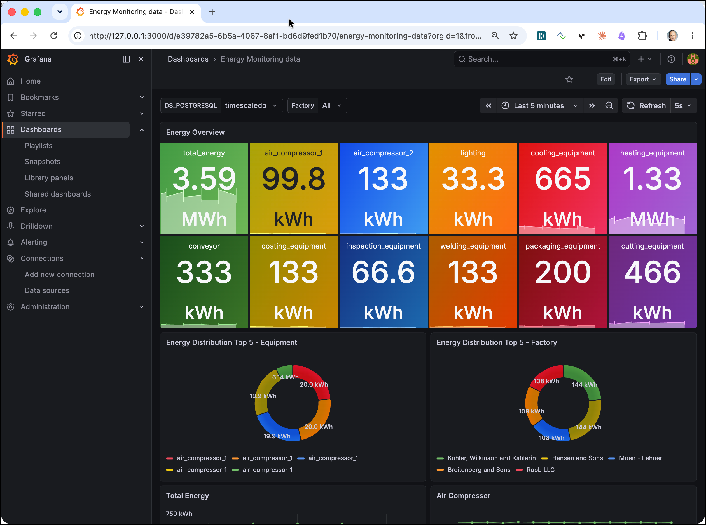

> **What you should see:** the **Energy Monitoring** dashboard opens with time-series panels showing sensor readings (heating, lighting, cooling, etc.) per factory, updating as new messages flow through the pipeline. Use the **Factory** drop-down at the top of the dashboard to filter the panels to a specific factory.
