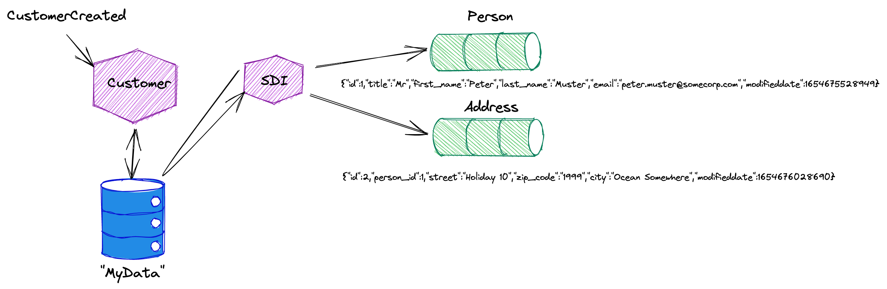
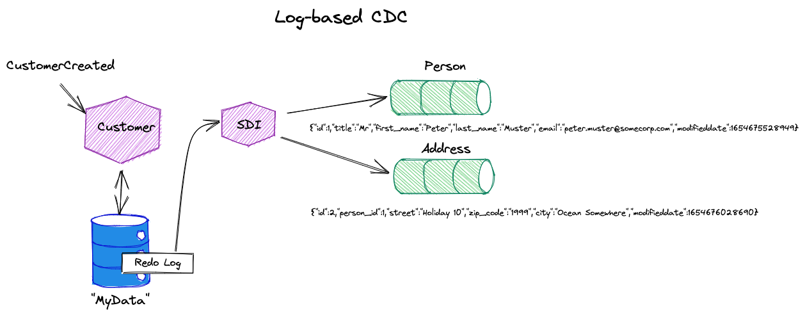
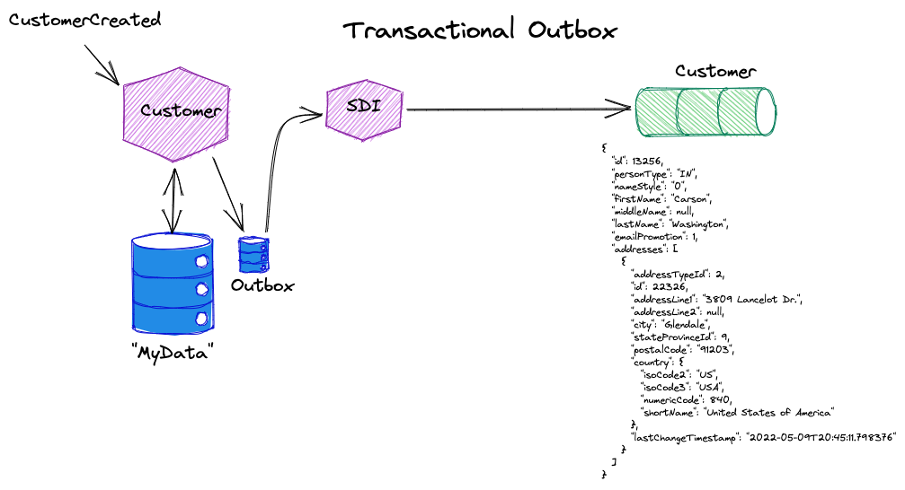

# Working with Kafka Connect and Change Data Capture (CDC)

In this workshop we will see three CDC strategies in action, each building on the same PostgreSQL schema:

1. **Polling-based CDC** — the JDBC Source Connector periodically queries a timestamp column to detect new or updated rows
2. **Log-based CDC** — Debezium reads the PostgreSQL Write-Ahead Log (WAL) to capture every INSERT, UPDATE, and DELETE in real time
3. **Transactional Outbox Pattern** — application code writes events to a dedicated `outbox` table; Debezium captures them and routes each to a type-specific Kafka topic

The table below summarises the key trade-offs so you can choose the right approach for a given situation:

| | Polling-based CDC | Log-based CDC | Transactional Outbox |
|---|---|---|---|
| **Captures deletes** | No | Yes | Yes (if app writes a delete event) |
| **Before image on UPDATE** | No | Yes (with `REPLICA IDENTITY FULL`) | Application-controlled |
| **Latency** | Up to `poll.interval.ms` | Sub-second | Sub-second |
| **Database load** | Extra SELECT queries | Replication slot only | Extra INSERT per event |
| **Schema changes** | Automatic | Automatic | Application-controlled |
| **Requires DB changes** | `modifieddate` column | Replication slot (built-in) | `outbox` table |
| **Event semantics** | Row state | Raw database change | Domain event |

## Table of Contents

- [What you will learn](#what-you-will-learn)
- [Prerequisites](#prerequisites)
- [Setting up the PostgreSQL database](#setting-up-the-postgresql-database)
- [Polling-based CDC using Kafka Connect](#polling-based-cdc-using-kafka-connect)
- [Log-based CDC using Debezium and Kafka Connect](#log-based-cdc-using-debezium-and-kafka-connect)
- [Transactional Outbox Pattern using Debezium and Kafka Connect](#transactional-outbox-pattern-using-debezium-and-kafka-connect)

## What you will learn

- How to create a PostgreSQL schema and tables suitable for CDC
- How polling-based CDC works using the JDBC Source Connector and a timestamp watermark
- How to use Single Message Transforms (SMT) to extract a message key and add a topic suffix
- How log-based CDC works using the Debezium PostgreSQL connector and the WAL
- How Debezium's change record envelope encodes `before`/`after` images and the operation type (`c`, `u`, `d`)
- How PostgreSQL `REPLICA IDENTITY` controls whether before images are captured on UPDATE
- How to rename Debezium topics using the `RegexRouter` SMT
- How the Transactional Outbox Pattern decouples event publishing from application logic, and how to implement it with Debezium

## Prerequisites

- The **Data Platform** described [here](../00-environment/README.md) is running and accessible
- Workshop 1 ([Getting started with Apache Kafka](../01-working-with-kafka-broker/README.md)) completed
- Basic familiarity with SQL and PostgreSQL

## Setting up the PostgreSQL database

All three CDC sections share the same PostgreSQL database and schema. Create the schema and tables once before starting any of the sections.

Connect to the PostgreSQL instance running in the Data Platform:

```bash
docker exec -ti postgresql psql -d postgres -U postgres
```

Create the `cdc_demo` schema and the two tables:

```sql
CREATE SCHEMA IF NOT EXISTS cdc_demo;

SET search_path TO cdc_demo;

DROP TABLE IF EXISTS address;
DROP TABLE IF EXISTS person;

CREATE TABLE "cdc_demo"."person" (
    "id" integer NOT NULL,
    "title" character varying(8),
    "first_name" character varying(50),
    "last_name" character varying(50),
    "email" character varying(50),
    "modifieddate" timestamp DEFAULT now() NOT NULL,
    CONSTRAINT "person_pk" PRIMARY KEY ("id")
);

CREATE TABLE "cdc_demo"."address" (
    "id" integer NOT NULL,
    "person_id" integer NOT NULL,
    "street" character varying(50),
    "zip_code" character varying(10),
    "city" character varying(50),
    "modifieddate" timestamp DEFAULT now() NOT NULL,
    CONSTRAINT "address_pk" PRIMARY KEY ("id")
);

ALTER TABLE ONLY "cdc_demo"."address"
    ADD CONSTRAINT "address_person_fk" FOREIGN KEY (person_id) REFERENCES person(id) NOT DEFERRABLE;
```

> **What just happened?** You created the `cdc_demo` schema with two related tables — `person` and `address`. Both tables include a `modifieddate` timestamp column (defaulting to `now()`), which the JDBC Source Connector will use as a watermark for polling-based CDC. The `address` table has a foreign key to `person`.

## Polling-based CDC using Kafka Connect

In polling-based CDC the connector acts like a scheduled query runner. It periodically issues a `SELECT` statement against the source tables and compares results against a stored watermark — in this case, the `modifieddate` timestamp column. Any row whose timestamp is newer than the watermark is emitted as a Kafka message. After each poll cycle the watermark advances to the highest timestamp seen, so rows are not re-emitted on the next cycle.

This approach requires no special database privileges beyond a read-only connection and works with any JDBC-compatible database. The cost is that it only detects row states, not operations: you cannot tell whether a row was inserted or updated, and deleted rows simply disappear from query results without producing any event.

In this section we use the [JDBC Source Connector](https://www.confluent.io/hub/confluentinc/kafka-connect-jdbc) to detect new and updated rows by periodically querying the `modifieddate` timestamp column.



The JDBC Source Connector is pre-installed in the Data Platform. You can verify this from [Kafka Connect UI](http://dataplatform:28103/#/cluster/kafka-connect-1/select-connector) or with:

```bash
curl -s http://dataplatform:8083/connector-plugins | jq '.[].class' | grep -i jdbc
```

> **What you should see:** `"io.confluent.connect.jdbc.JdbcSourceConnector"` listed among the installed plugins.

### Create the topics

Create a topic for the change records from each table:

```bash
docker exec -ti kafka-1 kafka-topics --bootstrap-server kafka-1:19092 \
    --create --if-not-exists --topic priv.person.cdc.v1 --partitions 8 --replication-factor 3

docker exec -ti kafka-1 kafka-topics --bootstrap-server kafka-1:19092 \
    --create --if-not-exists --topic priv.address.cdc.v1 --partitions 8 --replication-factor 3
```

Open two separate terminal windows and start a consumer on each topic. The `-f` format string prints the partition number, key, and value for every message:

```bash
docker exec -ti kcat kcat -b kafka-1:19092 -t priv.person.cdc.v1 -f "[%p] %k: %s\n" -q
```

```bash
docker exec -ti kcat kcat -b kafka-1:19092 -t priv.address.cdc.v1 -f "[%p] %k: %s\n" -q
```

Leave both consumers running as you work through the rest of this section.

### Create initial data in PostgreSQL

Connect to PostgreSQL and insert a person and an address:

```bash
docker exec -ti postgresql psql -d postgres -U postgres
```

```sql
INSERT INTO cdc_demo.person (id, title, first_name, last_name, email)
VALUES (1, 'Mr', 'Peter', 'Muster', 'peter.muster@somecorp.com');

INSERT INTO cdc_demo.address (id, person_id, street, zip_code, city)
VALUES (1, 1, 'Somestreet 10', '9999', 'Somewhere');
```

The connector is not running yet, so no messages appear in the topics.

### Create the JDBC Source connector

Create and start the JDBC Source connector:

```bash
curl -X "POST" "http://dataplatform:8083/connectors" \
     -H "Content-Type: application/json" \
     -d $'{
  "name": "person.jdbcsrc.cdc",
  "config": {
    "connector.class": "io.confluent.connect.jdbc.JdbcSourceConnector",
    "tasks.max": "1",
    "connection.url": "jdbc:postgresql://postgresql/postgres?user=postgres&password=abc123!",
    "mode": "timestamp",
    "timestamp.column.name": "modifieddate",
    "poll.interval.ms": "10000",
    "table.whitelist": "cdc_demo.person,cdc_demo.address",
    "validate.non.null": "false",
    "topic.prefix": "priv.",
    "key.converter": "org.apache.kafka.connect.storage.StringConverter",
    "key.converter.schemas.enable": "false",
    "value.converter": "org.apache.kafka.connect.json.JsonConverter",
    "value.converter.schemas.enable": "false",
    "transforms": "createKey,extractInt,addSuffix",
    "transforms.createKey.type": "org.apache.kafka.connect.transforms.ValueToKey",
    "transforms.createKey.fields": "id",
    "transforms.extractInt.type": "org.apache.kafka.connect.transforms.ExtractField$Key",
    "transforms.extractInt.field": "id",
    "transforms.addSuffix.type": "org.apache.kafka.connect.transforms.RegexRouter",
    "transforms.addSuffix.regex": ".*",
    "transforms.addSuffix.replacement": "$0.cdc.v1"
  }
}'
```

> **What you should see:** Within 10 seconds (the polling interval), one message appears in each `kcat` consumer terminal — one for the `person` row and one for the `address` row:

```
[3] 1: {"id":1,"title":"Mr","first_name":"Peter","last_name":"Muster","email":"peter.muster@somecorp.com","modifieddate":1654534797865}
```

> **What just happened?** The connector issued a `SELECT * FROM cdc_demo.person WHERE modifieddate > <last_watermark>` query every 10 seconds. On the first run, the watermark was the epoch, so it picked up all existing rows. It then applied three SMTs in sequence: `ValueToKey` copied the `id` field into the message key, `ExtractField` reduced the key to the integer value, and `RegexRouter` appended `.cdc.v1` to the table-derived topic name. You can also monitor the connector status at <http://dataplatform:28103/>.

### Configuration options

The connector uses three chained [Single Message Transforms (SMT)](https://docs.confluent.io/platform/current/connect/transforms/overview.html):

**Setting the message key** — the JDBC connector produces messages without a key by default. `ValueToKey` copies the `id` field from the value into the key as a `Struct`, and `ExtractField` reduces it to a plain integer:

```json
"transforms.createKey.type": "org.apache.kafka.connect.transforms.ValueToKey",
"transforms.createKey.fields": "id",
"transforms.extractInt.type": "org.apache.kafka.connect.transforms.ExtractField$Key",
"transforms.extractInt.field": "id"
```

**Adding a topic suffix** — the `topic.prefix` configuration prepends `priv.` to the table name, giving `priv.cdc_demo.person`. The `RegexRouter` SMT then appends `.cdc.v1` to produce the final topic name `priv.cdc_demo.person.cdc.v1`:

```json
"transforms.addSuffix.type": "org.apache.kafka.connect.transforms.RegexRouter",
"transforms.addSuffix.regex": ".*",
"transforms.addSuffix.replacement": "$0.cdc.v1"
```

Full connector configuration documentation is available [here](https://docs.confluent.io/kafka-connect-jdbc/current/source-connector/source_config_options.html).

### Add more data

Let's add rows and observe how quickly they appear. Connect to PostgreSQL in a new terminal:

```bash
docker exec -ti postgresql psql -d postgres -U postgres
```

Add a second address for person `id=1`:

```sql
INSERT INTO cdc_demo.address (id, person_id, street, zip_code, city)
VALUES (2, 1, 'Holiday 10', '1999', 'Ocean Somewhere');
```

Add a new person without an address:

```sql
INSERT INTO cdc_demo.person (id, title, first_name, last_name, email)
VALUES (2, 'Ms', 'Karen', 'Muster', 'karen.muster@somecorp.com');
```

Then add the address:

```sql
INSERT INTO cdc_demo.address (id, person_id, street, zip_code, city)
VALUES (3, 2, 'Somestreet 10', '9999', 'Somewhere');
```

> **What you should see:** Within 10 seconds of each INSERT, the new row appears in the corresponding `kcat` consumer — without restarting the connector.

> **What just happened?** On each poll cycle the connector runs its watermark query again, this time with the timestamp of the last message it produced. Only rows whose `modifieddate` is newer than that watermark are returned, so already-seen rows are not re-emitted. Note the trade-off of polling-based CDC: changes appear with up to `poll.interval.ms` latency, and deletes are invisible because no row exists to query.

### Limitations of polling-based CDC

Before moving on, it is worth being explicit about what polling-based CDC cannot do:

- **No delete detection** — when a row is deleted from the database, the next poll simply does not return it. There is no tombstone message. Downstream consumers have no way to know the row is gone.
- **No accurate before image** — the connector sees only the current row state at poll time. If a row is updated multiple times between two polls, only the final state is captured; the intermediate states are lost.
- **Clock skew risk** — the watermark relies on the `modifieddate` column being set correctly by the application. If rows are inserted or updated without updating that column (e.g. via a raw SQL script), they will never be picked up.
- **Added database load** — every poll cycle issues a full `SELECT ... WHERE modifieddate > ?` query. On large tables with no index on `modifieddate` this can be expensive. Ensure the column is indexed in production.
- **Fixed latency floor** — changes are never visible faster than `poll.interval.ms`. Reducing the interval increases freshness but also increases database load.

If any of these limitations are a problem for your use case, log-based CDC (the next section) addresses all of them.

### Remove the connector

```bash
curl -X "DELETE" "http://dataplatform:8083/connectors/person.jdbcsrc.cdc"
```

> **What just happened?** Kafka Connect stopped the connector task and removed the connector configuration. The topics and their data are not affected.

## Log-based CDC using Debezium and Kafka Connect

In this section we use [Debezium](https://debezium.io/) and its PostgreSQL connector to stream changes directly from the PostgreSQL Write-Ahead Log (WAL), eliminating the polling delay and capturing deletes.



### How log-based CDC works

Every relational database maintains a transaction log that records every change before it is applied to data files. In PostgreSQL this is the **Write-Ahead Log (WAL)**. Its primary purpose is crash recovery and replication, but it also serves as the foundation for log-based CDC.

PostgreSQL exposes WAL events to external consumers through **logical replication slots**. A replication slot is a named, persistent cursor into the WAL. When Debezium connects, it creates a replication slot (using the `pgoutput` output plugin that ships with PostgreSQL) and begins receiving a decoded stream of row-level changes. The slot guarantees that WAL segments are not discarded until Debezium has acknowledged them, so no events are lost even if the connector restarts.

This gives log-based CDC several advantages over polling:

- **Every operation is captured** — inserts, updates, deletes, and truncates all appear as discrete events
- **Sub-second latency** — events are delivered as soon as the originating transaction commits
- **Before images** — with `REPLICA IDENTITY FULL`, the full old row is included in the WAL for every UPDATE and DELETE
- **Zero extra database load** — reading from a replication slot puts no additional load on the primary beyond what replication itself does
- **No schema requirements** — there is no need for a `modifieddate` column or any other application-level watermark

The one operational consideration is the replication slot itself: if Debezium is stopped for an extended period, PostgreSQL will hold WAL segments in place until the slot is read, which can consume disk space. Always drop the slot when retiring a connector permanently.

The [Debezium PostgreSQL connector](https://www.confluent.io/hub/debezium/debezium-connector-postgresql) is pre-installed in the Data Platform.

### Create initial data in PostgreSQL

Connect to PostgreSQL and reset the tables to a known state:

```bash
docker exec -ti postgresql psql -d postgres -U postgres
```

```sql
TRUNCATE cdc_demo.person CASCADE;

INSERT INTO cdc_demo.person (id, title, first_name, last_name, email)
VALUES (1, 'Mr', 'Peter', 'Muster', 'peter.muster@somecorp.com');

INSERT INTO cdc_demo.address (id, person_id, street, zip_code, city)
VALUES (1, 1, 'Somestreet 10', '9999', 'Somewhere');
```

### Create the Debezium connector

```bash
curl -X PUT \
  "http://dataplatform:8083/connectors/person.dbzsrc.cdc/config" \
  -H 'Content-Type: application/json' \
  -H 'Accept: application/json' \
  -d '{
  "connector.class": "io.debezium.connector.postgresql.PostgresConnector",
  "tasks.max": "1",
  "database.hostname": "postgresql",
  "database.port": "5432",
  "database.user": "postgres",
  "database.password": "abc123!",
  "database.dbname": "postgres",
  "database.server.name": "postgresql",
  "schema.include.list": "cdc_demo",
  "table.include.list": "cdc_demo.person, cdc_demo.address",
  "plugin.name": "pgoutput",
  "topic.prefix": "customer",
  "tombstones.on.delete": "false",
  "topic.creation.default.replication.factor": 3,
  "topic.creation.default.partitions": 8,
  "topic.creation.default.cleanup.policy": "compact"
}'
```

> **What just happened?** Debezium created a PostgreSQL replication slot and started streaming the WAL. On startup it performs a snapshot of the configured tables (emitting one message per existing row), then switches to streaming mode where it captures every subsequent change in real time — with sub-second latency and no polling.

### Check the data in the Kafka topics

Debezium uses the naming convention `<topic.prefix>.<schema>.<table>` for its topics. Start consumers on both topics. Because Debezium uses Avro serialisation by default, pass the `-s avro` flag and the Schema Registry URL:

```bash
docker exec -ti kcat kcat -b kafka-1:19092 \
    -t customer.cdc_demo.person \
    -f "[%p] %k: %s\n" -q \
    -s avro -r http://schema-registry-1:8081
```

```bash
docker exec -ti kcat kcat -b kafka-1:19092 \
    -t customer.cdc_demo.address \
    -f "[%p] %k: %s\n" -q \
    -s avro -r http://schema-registry-1:8081
```

> **What you should see:** One change record per row in each topic, with the key Avro-serialised as `{"id": 1}`.

Use `jq` to pretty-print the value only (remove `-f` to get the raw payload):

```bash
docker exec -ti kcat kcat -b kafka-1:19092 \
    -t customer.cdc_demo.person \
    -f "%s\n" -q \
    -s avro -r http://schema-registry-1:8081 -u | jq
```

> **What you should see:** The Debezium change record envelope, with the row data nested under `after` and the operation `op` set to `"c"` (create):

```json
{
  "before": null,
  "after": {
    "Value": {
      "id": 1,
      "title": { "string": "Mr" },
      "first_name": { "string": "Peter" },
      "last_name": { "string": "Muster" },
      "email": { "string": "peter.muster@somecorp.com" },
      "modifieddate": 1654534797865686
    }
  },
  "source": {
    "version": "1.8.1.Final",
    "connector": "postgresql",
    "name": "postgresql",
    "ts_ms": 1654534797866,
    "snapshot": { "string": "false" },
    "db": "postgres",
    "schema": "cdc_demo",
    "table": "person",
    "txId": { "long": 556 },
    "lsn": { "long": 23426176 },
    "xmin": null
  },
  "op": "c",
  "ts_ms": { "long": 1654534798250 },
  "transaction": null
}
```

> **What just happened?** Debezium wraps every change in an envelope with three key fields: `before` (the row state before the change), `after` (the row state after the change), and `op` — the operation code: `c` for create/insert, `u` for update, `d` for delete, and `r` for snapshot read. The `source` block records exactly where in the WAL this change came from (Log Sequence Number `lsn`, transaction ID `txId`, and wall-clock time `ts_ms`).

Now perform an UPDATE and observe the new change record:

```sql
UPDATE cdc_demo.person SET first_name = UPPER(first_name);
```

> **What you should see:** A new message in the `customer.cdc_demo.person` topic with `"op": "u"`. Notice that `before` is `null` — that is the default PostgreSQL behaviour.

```json
{
  "before": null,
  "after": {
    "Value": {
      "id": 1,
      "first_name": { "string": "PETER" },
      ...
    }
  },
  "op": "u",
  ...
}
```

### Capturing the before image on UPDATE

By default PostgreSQL's [`REPLICA IDENTITY`](https://www.postgresql.org/docs/current/sql-altertable.html#SQL-CREATETABLE-REPLICA-IDENTITY) is `DEFAULT`, which means only the primary key is logged for the before image of an UPDATE. Debezium therefore sets `before` to `null`.

Change the replica identity on the `person` table to `FULL` so the entire old row is logged:

```sql
ALTER TABLE cdc_demo.person REPLICA IDENTITY FULL;
```

Now run another UPDATE:

```sql
UPDATE cdc_demo.person SET first_name = LOWER(first_name);
```

> **What you should see:** A change record where both `before` and `after` are populated — showing the row state both before and after the update:

```json
{
  "before": {
    "Value": {
      "id": 1,
      "first_name": { "string": "PETER" },
      ...
    }
  },
  "after": {
    "Value": {
      "id": 1,
      "first_name": { "string": "peter" },
      ...
    }
  },
  "op": "u",
  ...
}
```

> **What just happened?** With `REPLICA IDENTITY FULL`, PostgreSQL writes the complete old row image to the WAL for every UPDATE and DELETE. Debezium reads that image and populates the `before` field in the change envelope, enabling downstream consumers to see what changed, not just what the new state is.

### Check the CDC latency

Run the following UPDATE while watching the `kcat` consumer in another terminal:

```sql
UPDATE cdc_demo.address SET street = UPPER(street);
```

```bash
docker exec -ti kcat kcat -b kafka-1:19092 \
    -t customer.cdc_demo.address \
    -f "[%p] %k: %s\n" -q \
    -s avro -r http://schema-registry-1:8081
```

> **What you should see:** The change record appears in the topic within milliseconds of the UPDATE — far faster than the 10-second polling interval used in the previous section.

> **What just happened?** Debezium reads directly from the PostgreSQL replication slot, which delivers WAL events as soon as the transaction commits. There is no polling loop, so the end-to-end latency is determined by network round-trips and Kafka batch flushes rather than a fixed interval.

### Rename topics with a RegexRouter SMT

The default Debezium topic name `customer.cdc_demo.person` may not match your organisation's naming conventions. Use the `RegexRouter` SMT to rewrite it.

First remove the current connector and delete the topics it created:

```bash
curl -X "DELETE" "http://dataplatform:8083/connectors/person.dbzsrc.cdc"

docker exec -ti kafka-1 kafka-topics --delete --bootstrap-server kafka-1:19092 --topic customer.cdc_demo.person
docker exec -ti kafka-1 kafka-topics --delete --bootstrap-server kafka-1:19092 --topic customer.cdc_demo.address
```

Recreate the connector with the `RegexRouter` SMT that strips the prefix and schema name, producing topics named `priv.person.cdc.v2` and `priv.address.cdc.v2`:

```bash
curl -X PUT \
  "http://dataplatform:8083/connectors/person.dbzsrc.cdc/config" \
  -H 'Content-Type: application/json' \
  -H 'Accept: application/json' \
  -d '{
  "connector.class": "io.debezium.connector.postgresql.PostgresConnector",
  "tasks.max": "1",
  "database.hostname": "postgresql",
  "database.port": "5432",
  "database.user": "postgres",
  "database.password": "abc123!",
  "database.dbname": "postgres",
  "database.server.name": "postgresql",
  "schema.include.list": "cdc_demo",
  "table.include.list": "cdc_demo.person, cdc_demo.address",
  "plugin.name": "pgoutput",
  "topic.prefix": "customer",
  "tombstones.on.delete": "false",
  "transforms": "dropPrefix",
  "transforms.dropPrefix.type": "org.apache.kafka.connect.transforms.RegexRouter",
  "transforms.dropPrefix.regex": "customer.cdc_demo.(.*)",
  "transforms.dropPrefix.replacement": "priv.$1.cdc.v2",
  "topic.creation.default.replication.factor": 3,
  "topic.creation.default.partitions": 8,
  "topic.creation.default.cleanup.policy": "compact"
}'
```

Trigger a change to verify the new topic name:

```sql
UPDATE cdc_demo.person SET first_name = UPPER(first_name);
```

```bash
docker exec -ti kcat kcat -b kafka-1:19092 \
    -t priv.person.cdc.v2 \
    -f "[%p] %k: %s\n" -q \
    -s avro -r http://schema-registry-1:8081
```

> **What you should see:** The change record for the UPDATE arriving in `priv.person.cdc.v2` instead of `customer.cdc_demo.person`.

> **What just happened?** The `RegexRouter` SMT matched the default Debezium topic name against the regex `customer.cdc_demo.(.*)` and substituted it with `priv.$1.cdc.v2`, where `$1` is the captured table name. This pattern lets you rename topics without changing the connector class or any other configuration.

### Remove the connector

```bash
curl -X "DELETE" "http://dataplatform:8083/connectors/person.dbzsrc.cdc"
```

## Transactional Outbox Pattern using Debezium and Kafka Connect

In this section we implement the [Transactional Outbox Pattern](https://microservices.io/patterns/data/transactional-outbox.html). Instead of emitting events directly to Kafka, the application writes them into a dedicated `outbox` table in the same database transaction as the business data change. Debezium monitors this table and routes each event to a Kafka topic based on the event type.



### The dual-write problem

Before seeing the pattern in action, it is worth understanding the problem it solves.

A common pattern in event-driven systems is to update the database and publish a Kafka event in the same service call:

```
1. UPDATE person SET ...    ← database write
2. producer.send(event)     ← Kafka publish
```

These are two separate I/O operations with no shared transaction. This creates a reliability gap:

- **Step 1 succeeds, step 2 fails** — the database is updated but no event is published. Downstream services never learn about the change.
- **Step 1 fails, step 2 succeeds** — an event is published for a change that was never committed. Downstream services act on data that does not exist.
- **The process crashes between steps 1 and 2** — either outcome above occurs depending on which step completed before the crash.

Distributed transactions (XA/2PC) can coordinate the two writes atomically, but they are expensive, fragile across heterogeneous systems, and rarely used in practice.

### How the Outbox Pattern solves it

The outbox pattern replaces the dual write with a single database transaction:

```
BEGIN;
  UPDATE person SET ...              ← business change
  INSERT INTO outbox (event_type, payload_json, ...) ← event record
COMMIT;
```

Both the business change and the event record are committed atomically. If the transaction is rolled back, neither is persisted. Once committed, Debezium captures the `outbox` INSERT from the WAL and publishes it to Kafka — with the same sub-second latency and at-least-once delivery guarantee as regular log-based CDC. The application never talks to Kafka directly.

This pattern guarantees that events are never lost: if the application commits the database transaction, the outbox row exists and Debezium will eventually capture it. Outbox rows can be deleted after capture to prevent the table from growing unboundedly — Debezium will have already published the event before the DELETE is processed.

### Create the `outbox` table

Connect to PostgreSQL:

```bash
docker exec -ti postgresql psql -d postgres -U postgres
```

Create the outbox table:

```sql
SET search_path TO cdc_demo;

DROP TABLE IF EXISTS "cdc_demo"."outbox";

CREATE TABLE "cdc_demo"."outbox" (
    "id" uuid NOT NULL,
    "aggregate_id" bigint,
    "created_at" timestamp,
    "event_type" character varying(255),
    "payload_json" character varying(5000),
    CONSTRAINT "outbox_pk" PRIMARY KEY ("id")
);
```

> **What just happened?** The outbox table acts as a staging area. Each row represents one domain event: `aggregate_id` is the ID of the entity the event concerns, `event_type` is the event name (e.g. `CustomerCreated`), and `payload_json` holds the event payload. Debezium's `EventRouter` SMT will use `event_type` to determine which Kafka topic to publish to.

### Create the Debezium connector

```bash
curl -X PUT \
  "http://dataplatform:8083/connectors/person.dbzsrc.outbox/config" \
  -H 'Content-Type: application/json' \
  -H 'Accept: application/json' \
  -d '{
  "connector.class": "io.debezium.connector.postgresql.PostgresConnector",
  "tasks.max": "1",
  "database.hostname": "postgresql",
  "database.port": "5432",
  "database.user": "postgres",
  "database.password": "abc123!",
  "database.dbname": "postgres",
  "database.server.name": "postgresql",
  "schema.include.list": "cdc_demo",
  "table.include.list": "cdc_demo.outbox",
  "plugin.name": "pgoutput",
  "topic.prefix": "customer",
  "tombstones.on.delete": "false",
  "transforms": "outbox",
  "transforms.outbox.type": "io.debezium.transforms.outbox.EventRouter",
  "transforms.outbox.table.field.event.id": "id",
  "transforms.outbox.table.field.event.key": "aggregate_id",
  "transforms.outbox.table.field.event.payload": "payload_json",
  "transforms.outbox.table.field.event.timestamp": "created_at",
  "transforms.outbox.route.by.field": "event_type",
  "transforms.outbox.route.topic.replacement": "priv.${routedByValue}.event.v1",
  "topic.creation.default.replication.factor": 3,
  "topic.creation.default.partitions": 8,
  "topic.creation.default.cleanup.policy": "compact"
}'
```

> **What just happened?** The `EventRouter` SMT intercepts the raw CDC event from the `outbox` table and reshapes it: the `aggregate_id` field becomes the Kafka message key, the `payload_json` field becomes the message value, and the topic name is derived from the `event_type` field using the template `priv.${routedByValue}.event.v1`. Outbox rows are consumed and then discarded — they do not accumulate indefinitely.

### Add data to the `outbox` table

Simulate a `CustomerCreated` event by inserting a row into the outbox table:

```sql
INSERT INTO cdc_demo.outbox (id, aggregate_id, created_at, event_type, payload_json)
VALUES (
    gen_random_uuid(),
    13256,
    current_timestamp,
    'CustomerCreated',
    '{"id":13256,"personType":"IN","nameStyle":"0","firstName":"Carson","middleName":null,"lastName":"Washington","emailPromotion":1,"addresses":[{"addressTypeId":2,"id":22326,"addressLine1":"3809 Lancelot Dr.","addressLine2":null,"city":"Glendale","stateProvinceId":9,"postalCode":"91203","country":{"isoCode2":"US","isoCode3":"USA","numericCode":840,"shortName":"United States of America"},"lastChangeTimestamp":"2022-05-09T20:45:11.798376"}],"phones":[{"phoneNumber":"518-555-0192","phoneNumberTypeId":1,"phoneNumberType":"Cell"}],"emailAddresses":[{"id":12451,"emailAddress":"carson12@adventure-works.com"}]}'
);
```

Start a consumer on the newly created topic:

```bash
docker exec -ti kcat kcat -b kafka-1:19092 \
    -t priv.CustomerCreated.event.v1 \
    -f "[%p] %k: %s\n" -q \
    -s avro -r http://schema-registry-1:8081
```

> **What you should see:** The `CustomerCreated` event published to its own dedicated topic, with the `aggregate_id` as the key:

```
[4] {"long": 13256}: {"string": "{\"id\":13256,\"personType\":\"IN\",\"nameStyle\":\"0\",\"firstName\":\"Carson\",...}"}
```

> **What just happened?** Debezium captured the INSERT into the `outbox` table from the WAL. The `EventRouter` SMT read the `event_type` value (`CustomerCreated`), expanded the topic template to `priv.CustomerCreated.event.v1`, used `aggregate_id` as the Kafka key, and published `payload_json` as the message value. A new Kafka topic was created automatically.

Now simulate a `CustomerMoved` event:

```sql
INSERT INTO cdc_demo.outbox (id, aggregate_id, created_at, event_type, payload_json)
VALUES (
    gen_random_uuid(),
    13256,
    current_timestamp,
    'CustomerMoved',
    '{"customerId": 13256, "address": {"addressTypeId":2,"id":22326,"addressLine1":"3809 Lancelot Dr.","addressLine2":null,"city":"Glendale","stateProvinceId":9,"postalCode":"91203","country":{"isoCode2":"US","isoCode3":"USA","numericCode":840,"shortName":"United States of America"},"lastChangeTimestamp":"2022-05-09T20:45:11.798376"}}'
);
```

```bash
docker exec -ti kcat kcat -b kafka-1:19092 \
    -t priv.CustomerMoved.event.v1 \
    -f "[%p] %k: %s\n" -q \
    -s avro -r http://schema-registry-1:8081
```

> **What you should see:** The `CustomerMoved` event in its own separate topic `priv.CustomerMoved.event.v1`, again keyed by `aggregate_id`:

```
[4] {"long": 13256}: {"string": "{\"customerId\": 13256, \"address\": {...}}"}
```

> **What just happened?** Each distinct `event_type` value creates a new Kafka topic automatically. All events for a given `aggregate_id` land on the same partition (because Kafka hashes the key), so a consumer of any one topic sees events for the same entity in order.

### Remove the connector

```bash
curl -X "DELETE" "http://dataplatform:8083/connectors/person.dbzsrc.outbox"
```

## Summary

You have now seen all three CDC strategies working end-to-end against the same PostgreSQL schema. Here is when to use each:

**Use polling-based CDC when:**
- You cannot enable logical replication on the database (e.g. a managed cloud database with restricted privileges)
- The source database already has a reliable `modifieddate`-style column maintained by the application
- Eventual consistency with a known polling lag is acceptable
- Simplicity of setup outweighs the loss of delete detection

**Use log-based CDC when:**
- You need deletes captured as discrete events
- You need sub-second latency
- You need before images (e.g. to compute diffs or drive audit logs)
- You want zero impact on the application schema — no extra columns needed
- The source database supports logical replication (PostgreSQL, MySQL, SQL Server, Oracle, MongoDB)

**Use the Transactional Outbox Pattern when:**
- You need events that carry domain-level semantics rather than raw row changes (e.g. `CustomerCreated` instead of `person INSERT`)
- You need to fan a single business operation out to multiple event types with different schemas
- You need the event payload to contain data that is not in the changed row (e.g. a denormalised aggregate)
- You want the application, not the infrastructure, to decide which events are significant enough to publish
- You need routing to multiple Kafka topics from a single database operation
