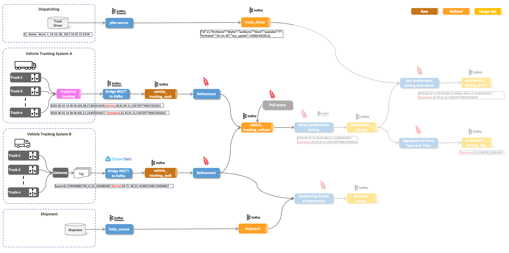

# IoT Vehicle Data

In this workshop we will be ingesting IoT data into a Kafka topic from which it will be use to do analytics using various Stream Analytics components. To make it a bit more realistic, the data is not directly sent to Kafka from the IoT devices (vehicles) but first sent through an MQTT broker (IoT gateway). 

The following diagram shows the setup of the data flow we will be implementing. 
We will be using a fictitious Trucking company with a fleet of trucks constantly providing some data about the moving vehicles. Of course we will not be using real-life data, but have a program simulating trucks and their driving behaviour.

For simulating truck data, we are going to use a Java program (adapted from Hortonworks) and maintained in this [GitHub project](https://github.com/TrivadisBDS/various-bigdata-prototypes/tree/master/streaming-sources/iot-truck-simulator/impl). It can be started either using Maven or Docker. We will be using it as a Docker container.

The simulator can produce data to various data sinks, such as **File**, **MQTT** or event **Kafka**. For our workshop here, we will be using **File** and **MQTT** as the target, but first let's use it in **File** mode. 

We will implement this end-to-end demo case step by step using different technologies. The links to the separate documents can be found as follows:

1. [Ingesting simulated IoT from System A into MQTT](../07a-iot-data-ingestion-sys-a-into-mqtt/README.md)
2. [Moving Data from MQTT into Kafka using Kafka Connect or Apache NiFi](../07b-iot-data-ingestion-mqtt-to-kafka-with-connect/README.md)
3. [Ingesting simulated IoT from System B into Kafka](../07c-iot-data-ingestion-sys-b-into-kafka/README.md)
3. [Refining data into a normalized topic using ksqlDB](../07d-iot-data-normalization-using-ksqldb/README.md)
4. [Using Pull query to get data](../07e-iot-queryable-data/README.md)
4. [Using Kafka Connect to write data to Redis and Minio](../07f-data-egestion-to-redis-and-minio/README.md)
4. [Stream Analytics using ksqlDB](../07g-stream-analytics-using-ksql/README.md)
5. [Ingesting Static Data](../07g-static-data-ingestion/README.md)
