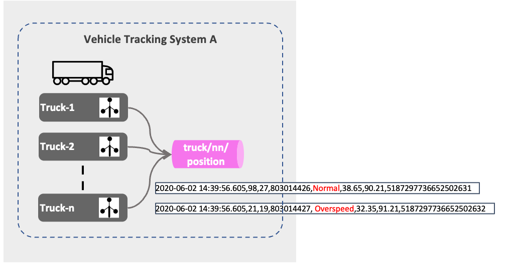
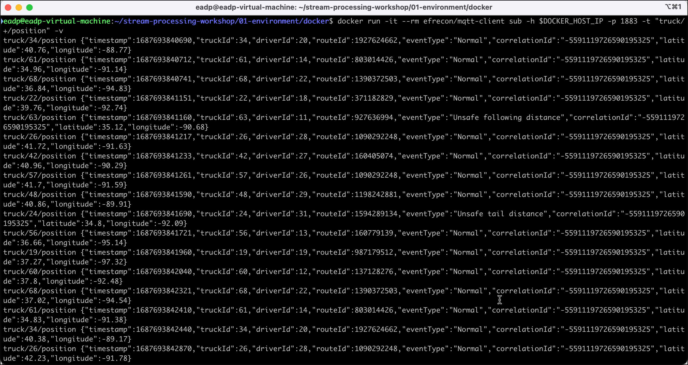
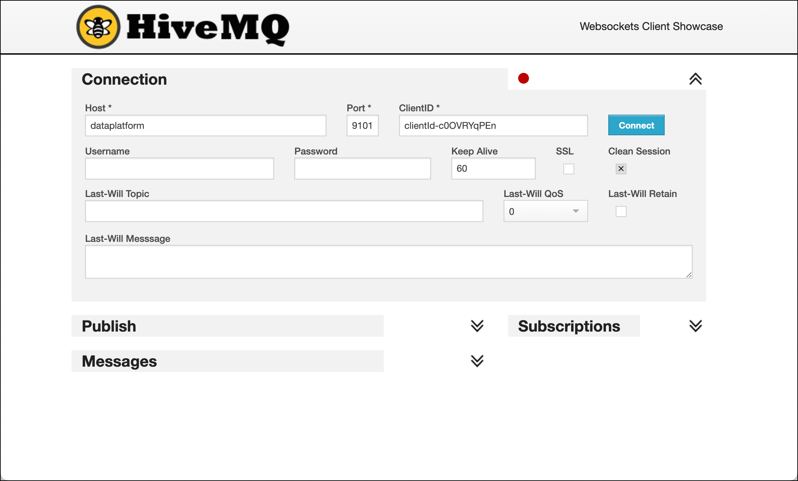
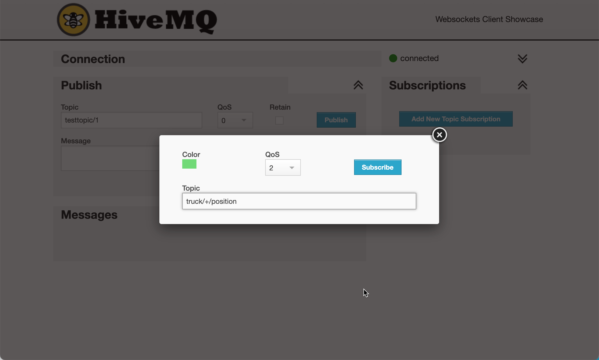
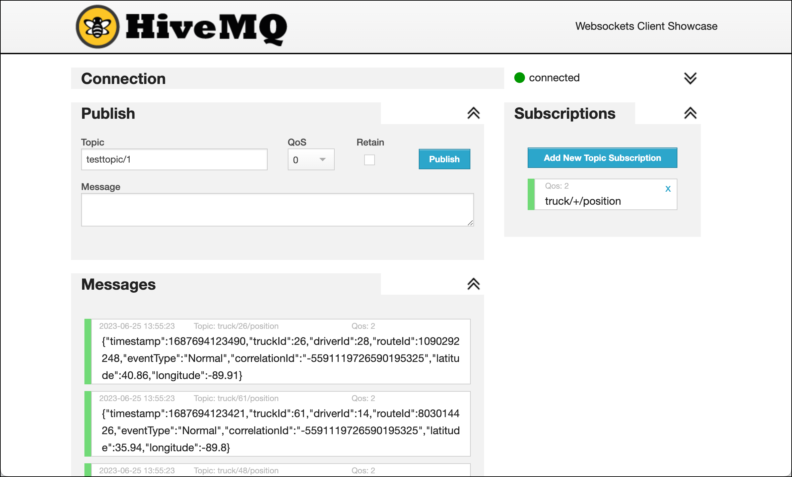

# IoT Vehicle Data - Ingesting simulated IoT from System A into MQTT

In this part we will be ingesting the IoT data stream into MQTT first, so that it can be later consumed and moved to a central Kafka topic. The MQTT brokers would act as IoT Gateways, implemented decentraly, whereas the Kafka Topic later will be a central deployment. This is a scenario which makes a lot of sense in real-live for various reasons such as security, connectivity, more lightweight connections and others. 

The following diagram shows the first part of the data flow we will be implementing. 



As you can see there are Trucks (2 and 3) which sent their data directly to MQTT whereas Truck-1 stores it to a file. We will be using a "local" pipeline on the truck to get the data from the file and send it to MQTT.

## MQTT Broker part of the Data Platform

The data platform we use for our workshop already runs a MQTT service.

We are using [Mosquitto](https://mosquitto.org/), an easy to use MQTT broker, belonging to the Eclipse project. Additionally also a browser-based UI is available, which we see in action later and which allows for consuming messages sent to the MQTT broker.


## Running the Truck Simulator to publish directly to MQTT

Now let's run the simulator for trucks with id 1 - 49. 

The MQTT broker is exposed on port `1883`. So let's run the following docker command in a new terminal window.

```
docker run --network host --rm trivadis/iot-truck-simulator '-s' 'MQTT' '-h' $DOCKER_HOST_IP '-p' '1883' '-f' 'JSON' '-vf' '1-49'
```

We are also producing the data in **JSON** format to the MQTT broker running on the docker host on port 1883. 

You should see an output similar to the one below, signalling that messages are produced to MQTT. 

```
eadp@eadp-virtual-machine:~/stream-processing-workshop/01-environment/docker$ docker run -d trivadis/iot-truck-simulator "-s" "MQTT" "-h" $DOCKER_HOST_IP "-p" "1883" "-f" "JSON" "-d" "2000" "-fs" "25" "-vf" "11-70"
Unable to find image 'trivadis/iot-truck-simulator:latest' locally
latest: Pulling from trivadis/iot-truck-simulator
001c52e26ad5: Already exists
d9d4b9b6e964: Already exists
2068746827ec: Already exists
8510da692cda: Pull complete
b6d84395b34d: Pull complete
bf03fea6c3ad: Pull complete
33299935f553: Pull complete
0c88fc84d5db: Pull complete
52e6b0ca3a33: Pull complete
Digest: sha256:2dc23b03ecb4643fbaec6d05fd68647d0acec076f2727f7501b699dd31a76782
Status: Downloaded newer image for trivadis/iot-truck-simulator:latest
ba729c7785a612d569bac0a7c8359bb527fa6d6515a0c270b1a337f187c993fe
```

## Using an MQTT Client to view messages

For viewing the messages in MQTT, we need something similar to the `kafkacat` and `kafka-console-consumer` utilities. There are multiple options available. 

In this workshop we will present two alternative options for consuming from MQTT
 
 * use dockerized MQTT client in the terminal
 * use browser-based HiveMQ Web UI

### Using dockerized MQTT Client

To start consuming using through a command line, perform the following docker command:

```
docker run -it --rm efrecon/mqtt-client sub -h $DOCKER_HOST_IP -p 1883 -t "truck/+/position" -v
```

The consumed messages will show up on the terminal window as shown below.



### Using HiveMQ Web UI  

To start consuming using the MQTT UI ([HiveMQ Web UI](https://www.hivemq.com/docs/3.4/web-ui/introduction.html)), navigate to <http://dataplatform:28136> and connect using `dataplatform` for the **Host** field, `9101` for the **Port** field 


	
and click on **Connect** to connect to the broker.
	
When successfully connected, click on **Add New Topic Subscription** and enter `truck/+/position` into **Topic** field



and click **Subscribe**:

You should again see the messages as they are being sent to MQTT.



Alternatively you can also use the [MQTT.fx](https://mqttfx.jensd.de/) or the [MQTT Explorer](https://mqtt-explorer.com/) applications to browse for the messages on the MQTT broker. They are both available for installation on Mac or Windows. 

In the subscription pattern of we have used `truck/+/position`, where the `+` sign acts as a placeholder for all the various truck ids. As you can see that for each vehicle there is a separate topic being used in MQTT.

----
[top](../07-iot-data-ingestion-and-transformation/README.md) 	| 	[next part](../07b-iot-data-ingestion-mqtt-to-kafka-with-connect/README.md)
