# IoT Vehicle Data - Ingesting simulated IoT from System B into Kafka

In this part we will be ingesting the vehicle data from system B, which is using a gateway and produces a file with the vehicle data. 

In this part we will show how we can integrate the data from the 2nd vehicle tracking system (System B), where the only integration point available is a set of log files. We can tail these log files and with that get the information as soon as it arrives. We effectively convert the file source into a streaming data source. 

We will be using [Apache Nifi](https://nifi.apache.org/) and [StreamSets Data Collector](https://streamsets.com/products/dataops-platform/data-collector/) for the tail operation, as in real life this data collector would have to run on the Vehicle Tracking System itself or at least on a machine next to it. At the end it needs to be able to access the actual, active file while it is being written to by the application. Both StreamSets and Apache Nifi even have special Edge options which is a down-sized version of the full version and is capable of running on a Rasperry Pi.

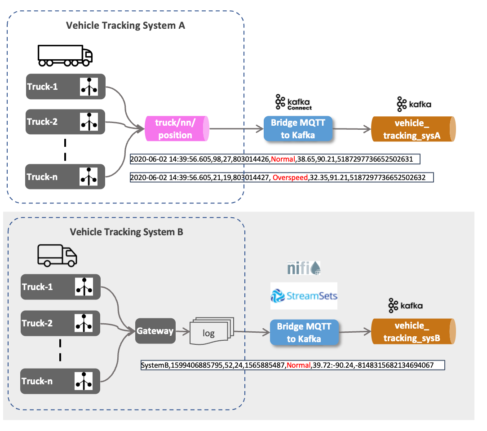

## Simulating Trucks 50 - 100, sending data to a file

First make sure that you are located in the `docker` folder of the dataplatform, where the `docker-compose.yml` can be found. You can easily navigate to the right place by using the `$DATAPLATFORM_HOME` environment variable (if set).

```bash
cd $DATAPLATFORM_HOME
```

Now running the simulator is a simple as starting the `trivadis/iot-truck-simulator` docker image, providing some parameters.

```bash
docker run -v "${PWD}/data-transfer/logs:/out" --rm trivadis/iot-truck-simulator "-s" "FILE" "-f" "CSV" "-d" "1000" "-vf" "50-100" "-es" "2"
```

**Note:** if you are running docker on windows, you have to replace the `${PWD}` by the absolute path to the `data-transfer` folder.  

We only generate data for vehicle with id `50` to `100` into a file in the `/data-transfer/logs` folder using the **CSV** format. The flag `-fpv` specifies to write one file per vehicle. 

You should see an output similar to the one below, signalling that messages are produced into files. 

```
/app/resources/routes/midwest
com.hortonworks.labutils.SensorEventsParam@6acbcfc0
log4j:WARN No appenders could be found for logger (com.hortonworks.simulator.impl.domain.transport.route.TruckRoutesParser).
log4j:WARN Please initialize the log4j system properly.
log4j:WARN See http://logging.apache.org/log4j/1.2/faq.html#noconfig for more info.
Number of Emitters is .....23
akka://EventSimulator/user/eventCollector
```

In another terminal window, navigate once more to the `docker` folder and perform a tail on the file being generated / added to: 

```
tail -f data-transfer/logs/TruckData-50.dat
```

You should see a new record being added every one second. The output should look similar to the one below:

```
eadp@eadp-virtual-machine:~/stream-processing-workshop/01-environment/docker$ tail -f data-transfer/logs/TruckData-50.dat
SystemB,1687696158948,50,32,1325562373,Normal,35.53:-93.92,524791738814054561
SystemB,1687696159848,50,32,1325562373,Normal,35.51:-93.61,524791738814054561
SystemB,1687696160688,50,32,1325562373,Normal,35.4:-93.36,524791738814054561
SystemB,1687696161497,50,32,1325562373,Normal,35.31:-93.12,524791738814054561
SystemB,1687696162337,50,32,1325562373,Normal,35.25:-92.87,524791738814054561
SystemB,1687696163208,50,32,1325562373,Normal,35.15:-92.53,524791738814054561
SystemB,1687696164087,50,32,1325562373,Normal,34.92:-92.25,524791738814054561
SystemB,1687696164917,50,32,1325562373,Normal,34.75:-92.25,524791738814054561
SystemB,1687696165777,50,32,1325562373,Normal,34.75:-92.25,524791738814054561
SystemB,1687696166758,50,32,1325562373,Normal,34.92:-92.25,524791738814054561
SystemB,1687696167758,50,32,1325562373,Normal,35.15:-92.53,524791738814054561
SystemB,1687696168508,50,32,1325562373,Normal,35.25:-92.87,524791738814054561
...
```

As the Kafka cluster is configured with `auto.topic.create.enable` set to `false`, we first have to create all the necessary topics, using the `kafka-topics` command line utility of Apache Kafka. 

From a terminal window, use the `kafka-topics` CLI inside the `kafka-1` docker container to create the `vehicle_tracking_sysA`  topic.

``` bash
docker exec -it kafka-1 kafka-topics --bootstrap-server kafka-1:19092 --create --topic vehicle_tracking_sysB --partitions 8 --replication-factor 3
```

Now let's listen on the new topic

```bash
docker exec -ti kcat kcat -b kafka-1:19092 -t vehicle_tracking_sysB -f "%k - %s" -q
```

## Creating a Apache NiFi pipeline

In a browser navigate to <https://dataplatform:18080/nifi> (make sure to replace `dataplatform` by the IP address of the machine where docker runs on,). We have enabled authentication for NiFi, therefore you have to use https to access it. Due to the use of a self-signed certificate, you have to initially confirm that the page is safe and you want to access the page.

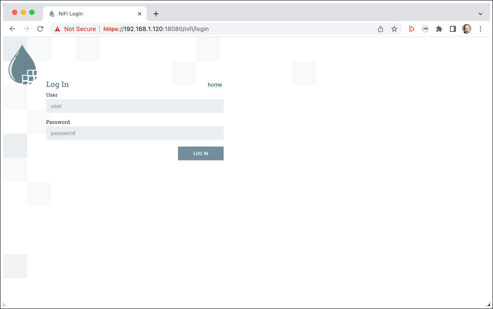

Enter `nifi` into the **User** field and `1234567890ACD` into the **Password** field and click **LOG IN**.

This should bring up the NiFi User Interface, which at this point is a blank canvas for orchestrating a data flow.

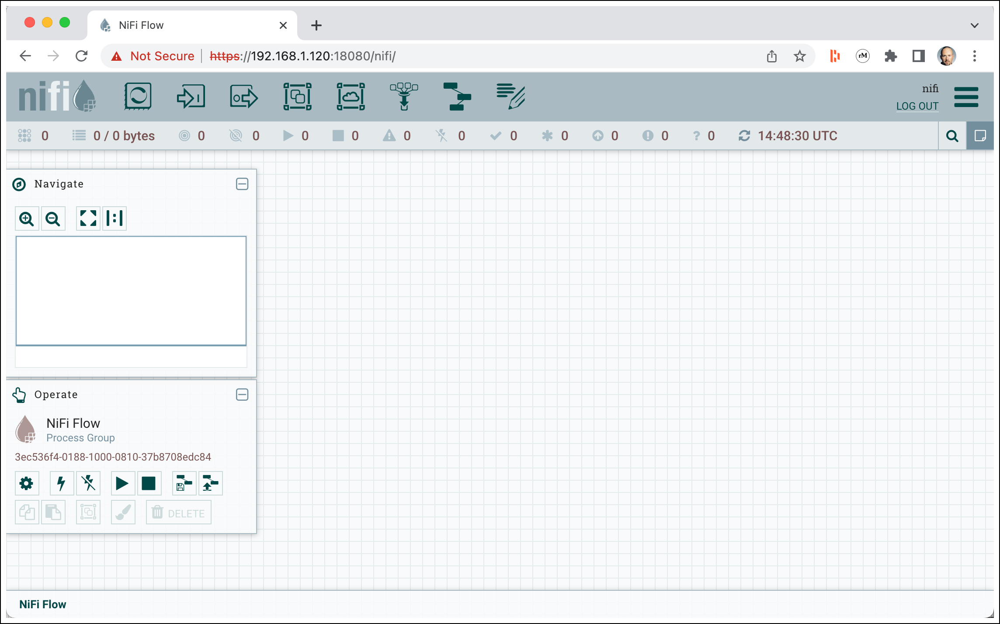

Now you can add **Processor**s to create the pipeline. 

Let's start with the input. 

### Adding a `TailFile` Processor

We can now begin creating our data flow by adding a Processor to our canvas. To do this, drag the Processor icon from the top-left of the screen into the middle of the canvas and drop it there. 

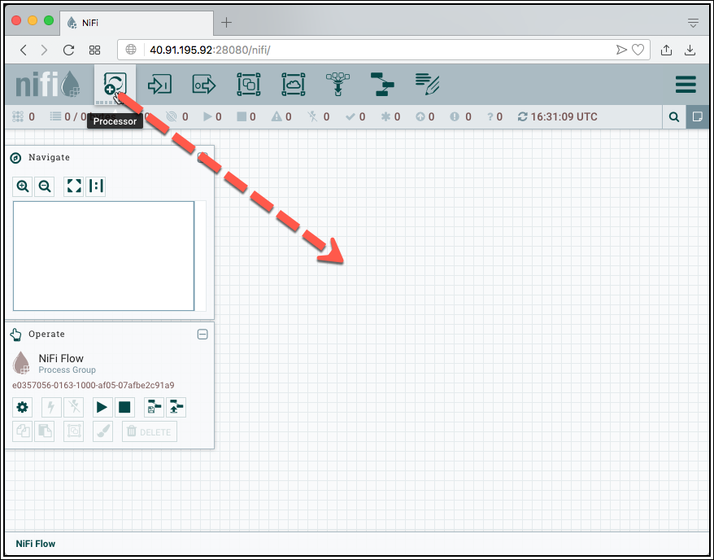

This will give us a dialog that allows us to choose which Processor we want to add. We can see that there are a total of 345 processors currently available. We can browse through the list or use the tag cloud on the left to filter the processors by type.

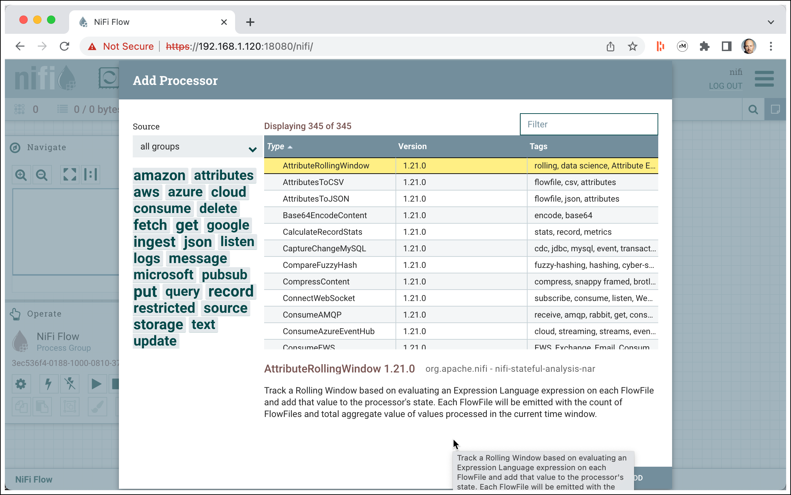

Enter **TailF** into the search field and the list will be reduced to only one processor, the **TailFile** processor. As the name implies it can be used to tail files available locally. Click **ADD** to add the **TailFile** processor to the canvas.

You should now see the canvas with the **TailFile** processor. A yellow marker is shown on the processor, telling that the processor is not yet configured properly. 

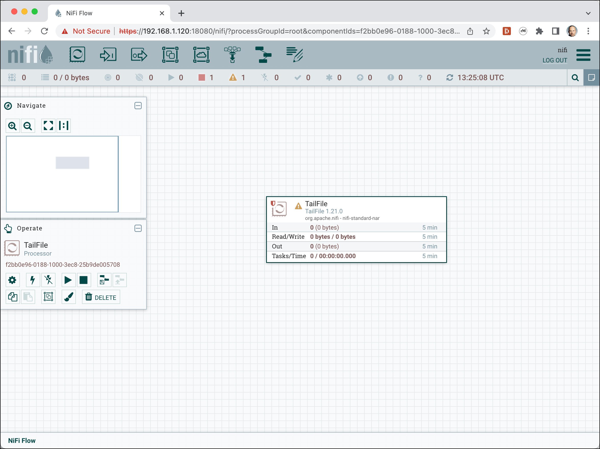

Double-click on the **TailFile** processor and the properties page of the processor appears. Here you can change the name of the processor among other general properties.

Click on **PROPERTIES** tab to switch to the properties page.

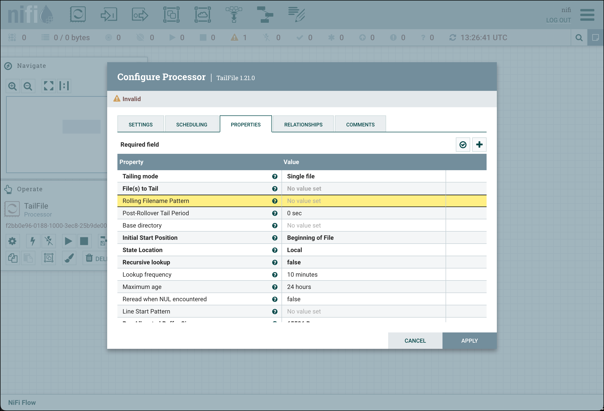

On the properties page, we configure the properties for reading the data from the local file system.  

Set the properties as follows:

  * **File(s) to Tail**: `/data-transfer/logs/TruckData.dat`
  * **Base directory**: `/data-transfer/logs`
  * **Recursive Subdirectories**: `false`
  * **Minimum File Age**: `5 sec`

The **Configure Processor** should look as shown below

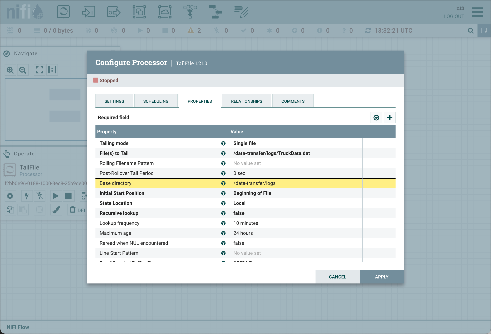

Click on **SCHEDULING** tab to switch to the scheduling page.

Change the **Run Schedule** field to `5 sec` to start it every 5 seconds.

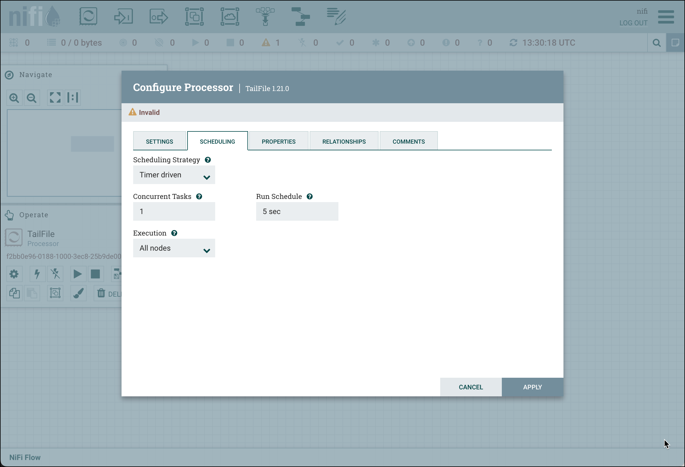

Click **APPLY** to close the window.

The `TailFile` processor still shows the yellow marker, this is because the out-going relationship is neither used nor terminated. Of course we want to use it, but for that we first need another Processor to publish the data to a Kafka topic. 

### Adding a `PublishKafka` Processor

Drag a new Processor onto the Canvas, just below the **PublishKafka** processor. 

Enter **PublishKafka** into the Filter field on top right. Only a single processor, the `PublishKafka` is shown.

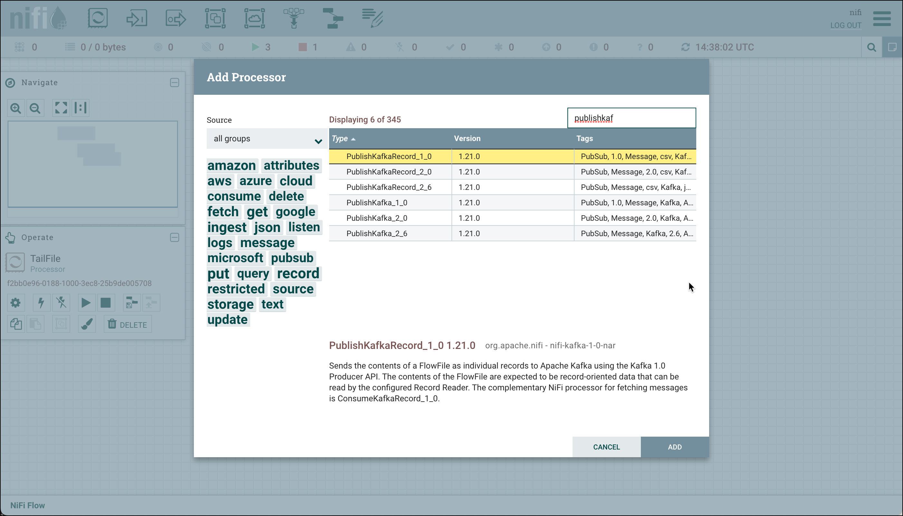

Select the **PublishKafka\_2\_6** and click on **ADD** to add it to the canvas as well. The canvas should now look like shown below. You can drag around the processor to organize them in the right order. It is recommended to organize the in main flow direction, either top-to-bottom or left-to-right. 

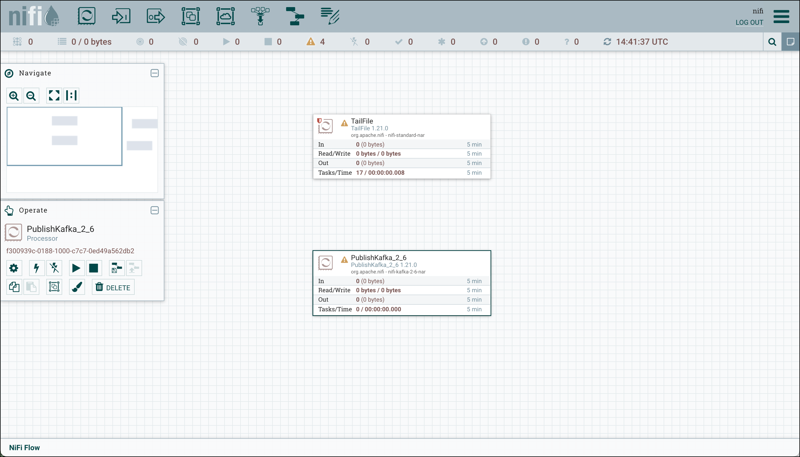

Let's configure the new processor. Double-click on the `PublishKafka_2_6` and navigate to **PROPERTIES**. Configure the properties for publishing to Kafka.

  * **Kafka Brokers**: `kafka-1:19092`
  * **Topic Name**: `vehicle_tracking_sysB`

Click **APPLY** to close the window.

### Connecting the 2 Processors

Drag a connection from the **TailFile** processor to the **PublishKafka\_2\_6** and drop it. 
Make sure that **For Relationship** is enabled for the `success` relationship and click **ADD**. 

The data flow on the canvas should now look as shown below

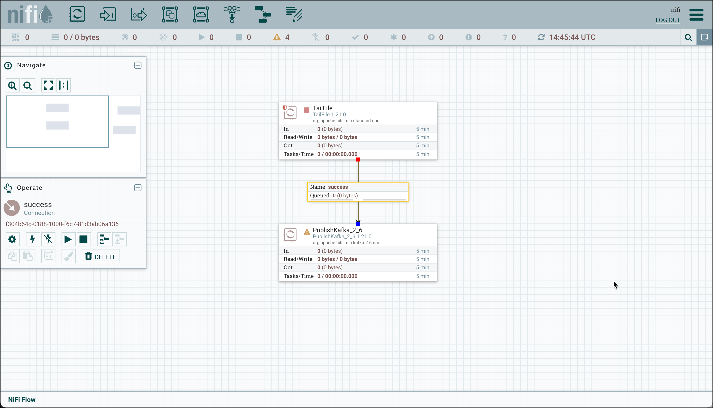

The first processor no longer hold the yellow marker, but now show the red stop marker, meaning that this processors can be started. But what about the last one, the ** PublishKafka\_2\_6** processor?

If you navigate to the marker, a tool-tip will show the errors. 


We can see that the processor has two outgoing relationships, which are not "used". We have to terminate them, if we have no use for it. 
Double-click on the **PublishKafka\_2\_6** processor and navigate to **RELATIONSHIPS** and set the check-boxes for both relationships to **terminate**. 


Click **APPLY** to save the settings.

Now our data flow is ready, so let's run it. 

### Starting the Data Flow 

Select the 2 processor and click on the start arrow to run the data flow. All three processors now show the green "started" or "running" marker. 

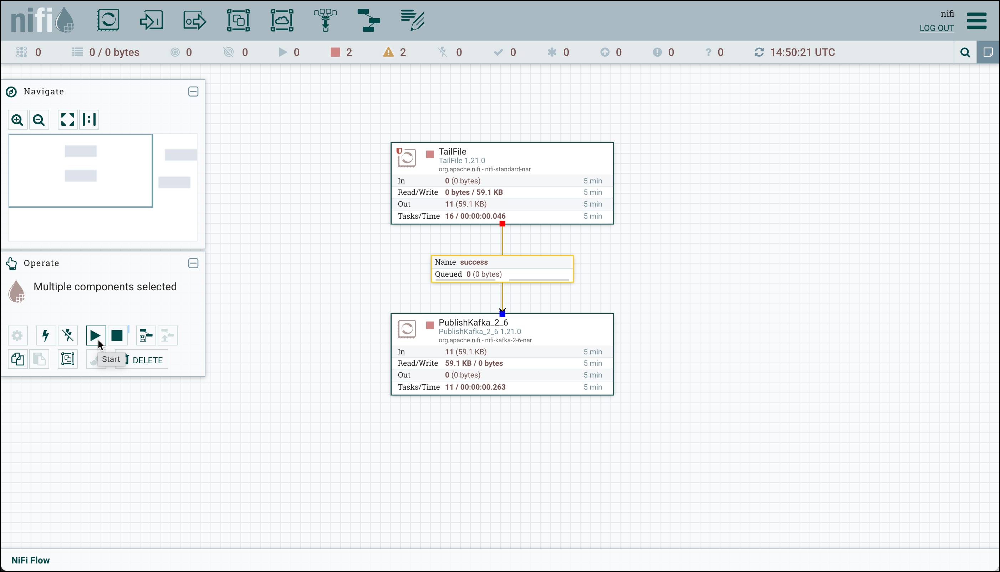

### Checking the data in `kcat`

if you check for the output in `kcat` where we output both the key and the value of the Kafka message

```
docker exec -ti kcat kcat -b kafka-1:19092 -t vehicle_tracking_sysB -f "%k - %s" -q
```

we can see that the key part is empty and that we have more than one message in the value


```bash
 - SystemB,1687704667962,90,20,160779139,Normal,41.7:-91.59,5866413809357759933
SystemB,1687704668091,56,15,160405074,Normal,41.92:-89.03,5866413809357759933
SystemB,1687704668111,50,17,1961634315,Normal,38.98:-92.38,5866413809357759933
SystemB,1687704668121,95,27,803014426,Normal,38.96:-92.22,5866413809357759933
SystemB,1687704668222,99,14,1384345811,Normal,41.85:-89.29,5866413809357759933
SystemB,1687704668251,67,10,1565885487,Normal,37.81:-92.31,5866413809357759933
SystemB,1687704668412,53,19,1927624662,Normal,37.27:-97.32,5866413809357759933
SystemB,1687704668451,98,11,1390372503,Normal,41.11:-88.42,5866413809357759933
SystemB,1687704668551,82,22,1090292248,Normal,35.12:-90.68,5866413809357759933
SystemB,1687704668711,54,29,137128276,Normal,37.27:-97.32,5866413809357759933
SystemB,1687704668791,81,13,1198242881,Normal,41.7:-91.59,5866413809357759933
SystemB,1687704668831,90,20,160779139,Normal,41.71:-91.94,5866413809357759933
SystemB,1687704668841,65,24,1198242881,Normal,40.86:-89.91,5866413809357759933
SystemB,1687704668851,63,32,987179512,Normal,37.16:-94.46,5866413809357759933
SystemB,1687704668941,50,17,1961634315,Normal,38.98:-92.53,5866413809357759933
SystemB,1687704669030,56,15,160405074,Normal,42.25:-88.96,5866413809357759933
SystemB,1687704669110,95,27,803014426,Normal,38.98:-92.38,5866413809357759933
SystemB,1687704669131,67,10,1565885487,Lane Departure,37.81:-92.08,5866413809357759933
SystemB,1687704669211,99,14,1384345811,Normal,41.76:-89.6,5866413809357759933
SystemB,1687704669281,53,19,1927624662,Normal,37.48:-97.32,5866413809357759933
SystemB,1687704669341,98,11,1390372503,Normal,41.48:-88.07,5866413809357759933
SystemB,1687704669381,82,22,1090292248,Normal,35.21:-90.37,5866413809357759933
 - SystemB,1687704734301,56,15,160405074,Normal,41.7:-91.59,5866413809357759933
SystemB,1687704734301,99,14,1384345811,Normal,42.11:-88.41,5866413809357759933
SystemB,1687704734322,53,19,1927624662,Normal,36.17:-95.99,5866413809357759933
SystemB,1687704734342,90,20,160779139,Normal,42.25:-88.96,5866413809357759933
SystemB,1687704734361,67,10,1565885487,Normal,38.46:-90.86,5866413809357759933
SystemB,1687704734371,63,32,987179512,Normal,39.84:-89.63,5866413809357759933
SystemB,1687704734571,54,29,137128276,Normal,36.23:-96.44,5866413809357759933
```

This is of course not what we want!

Let's stop the **PublishKafka\_2\_6** processor and check the data it delivers.

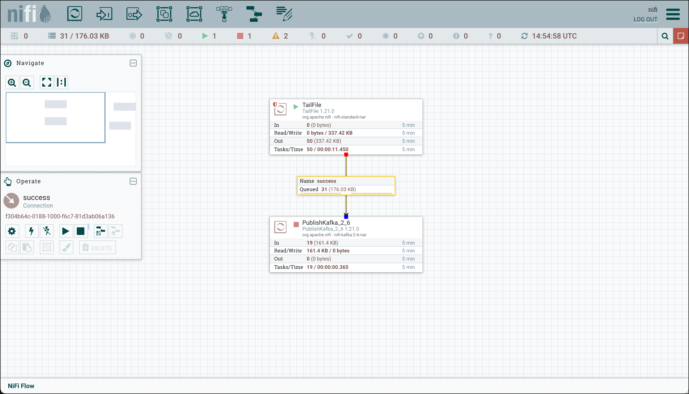

On the queue on the link between the two processors, right-click and select **List Queue**. You will get a list of the flow files currently inside the queue, waiting to be processed.

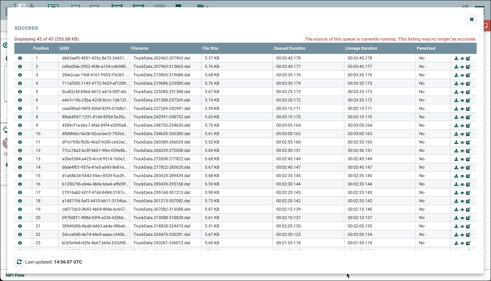

Click on the info icon of one of the rows to see the details

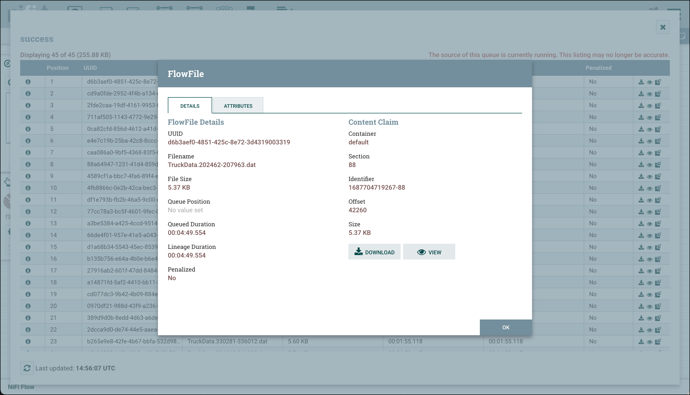

now click on **Details** to see the content of one of the flow files

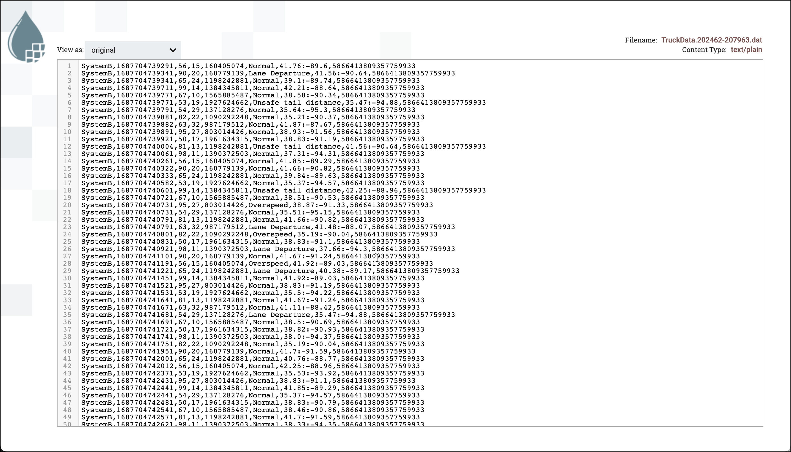

We can see that the **TailFile** processor delivers many rows from the file in one flow file. We need to use a split operation to split these messages into individual flow files and then use the **PublishKafka\_2\_6** processor. 

### Add a `SplitRecord` processor 

Drag a new Processor onto the Canvas, just below the **TailFile** processor. 

Enter **SplitR** into the Filter and select the **SplitRecord** processor and click on **ADD** to add it to the canvas as well. 

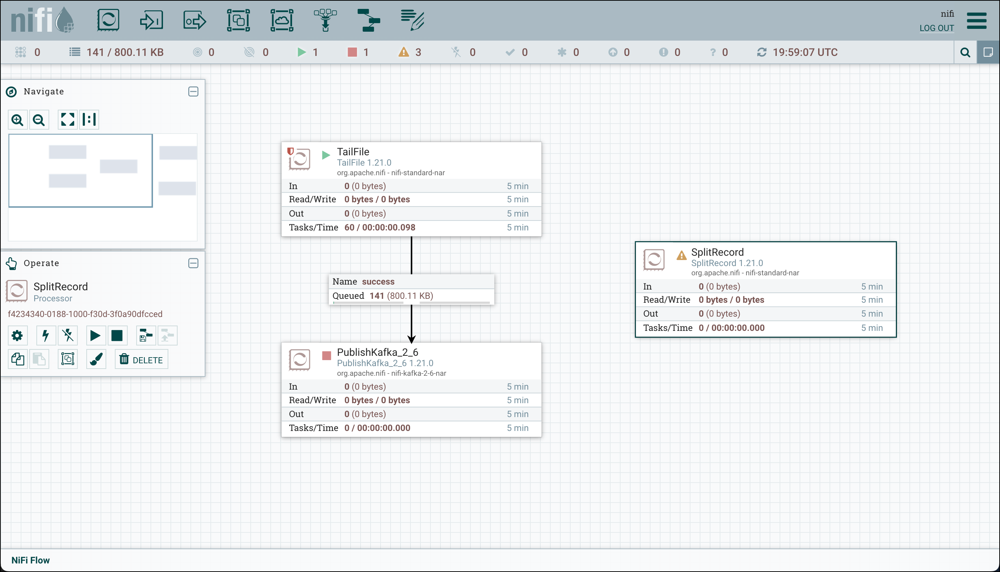

Drag the connection (blue end) away from the **PublishKafka\_2\_6** processor and connect it with the **SplitRecord** processor

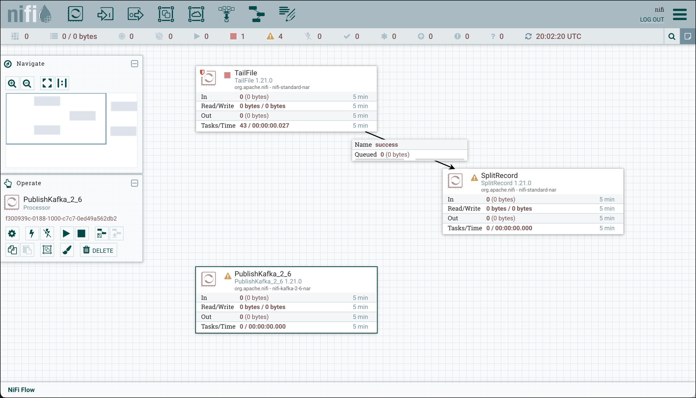

Let's configure the new processor. Double-click on the `SplitRecord ` and navigate to **PROPERTIES**. Configure the properties for publishing to Kafka.

On the **Record Reader** property, click on the empty cell and select **Create New Service**. 

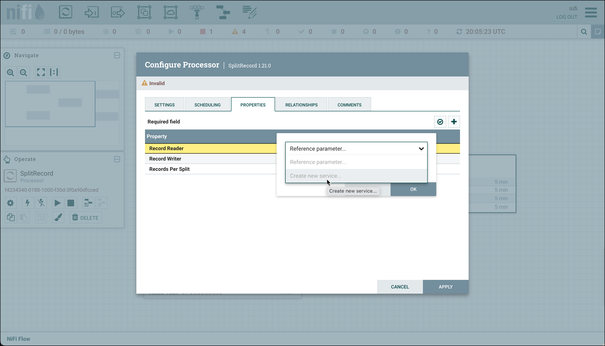

On the **Add Controller Service**, select **CSVReader 1.21.0** and click **CREATE**. 
  
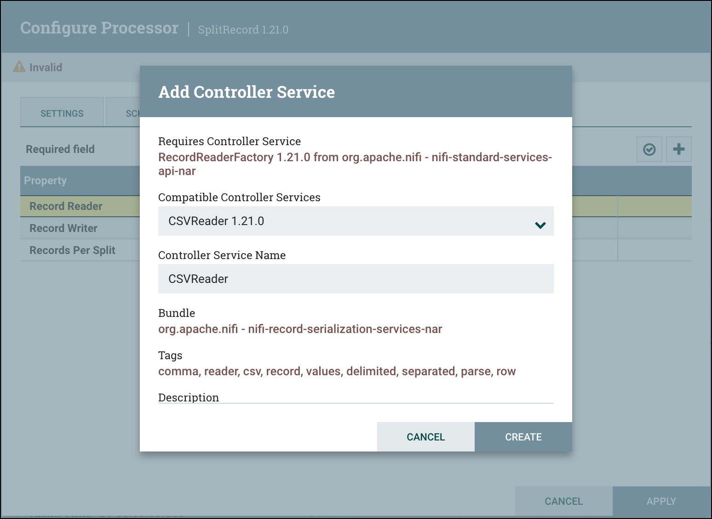

On the **Record Writer** property, click on the empty cell and select **Create New Service**. On the **Add Controller Service**, select **CSVRecordSetWriter 1.21.0** and click **CREATE**. 

on the **Records per Split**, enter `1` to have a flow file for each record. 

The **Configure Processor** should now look as follows:

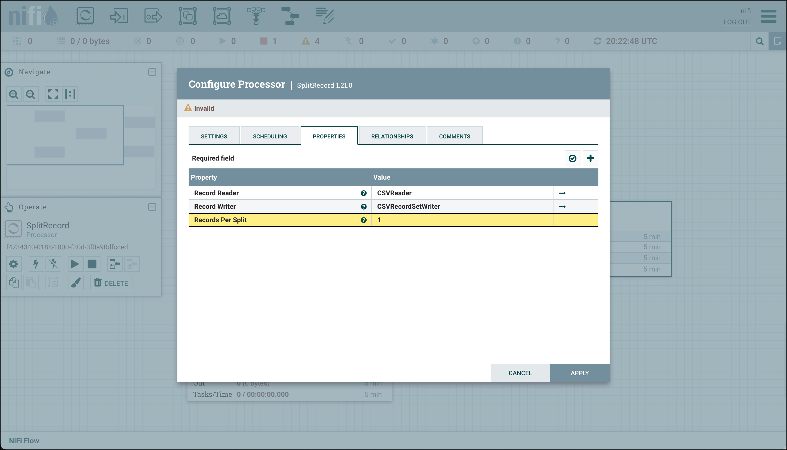

Click on the **->** (Go To) icon to configure the services. First let's configure the **CSVReader**. Click on the **Configure** icon on right hand side


and the **Configure Controller Service** form will appear

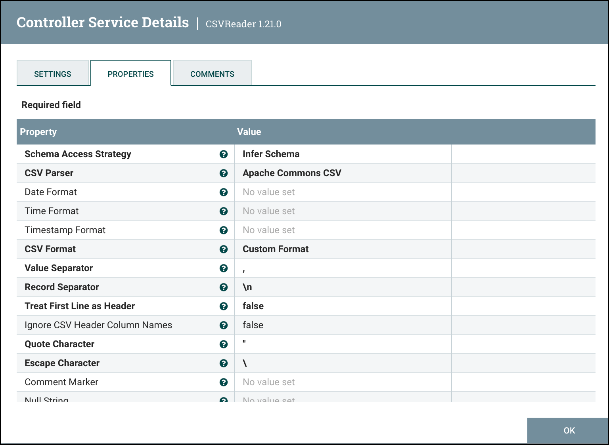

Leave everything to default and click **APPLY**. 

Next let's configure the **CSVRecordSetWriter** by clicking on the **Configure** icon on right hand side.

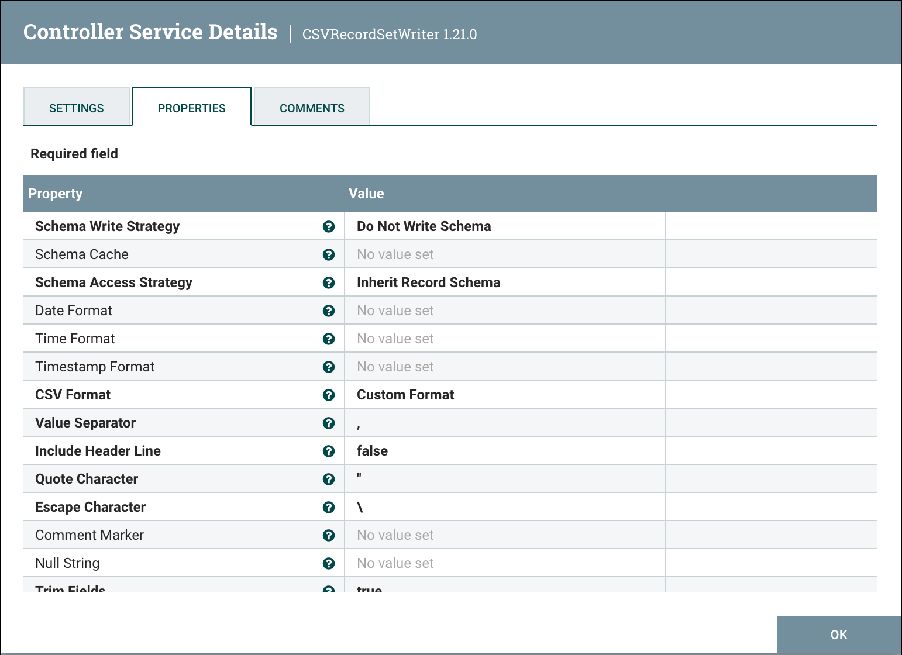

Make sure to change the **Include Header Line** to `false` and click **APPLY**.

Click on **Enable** icon for both of the two services

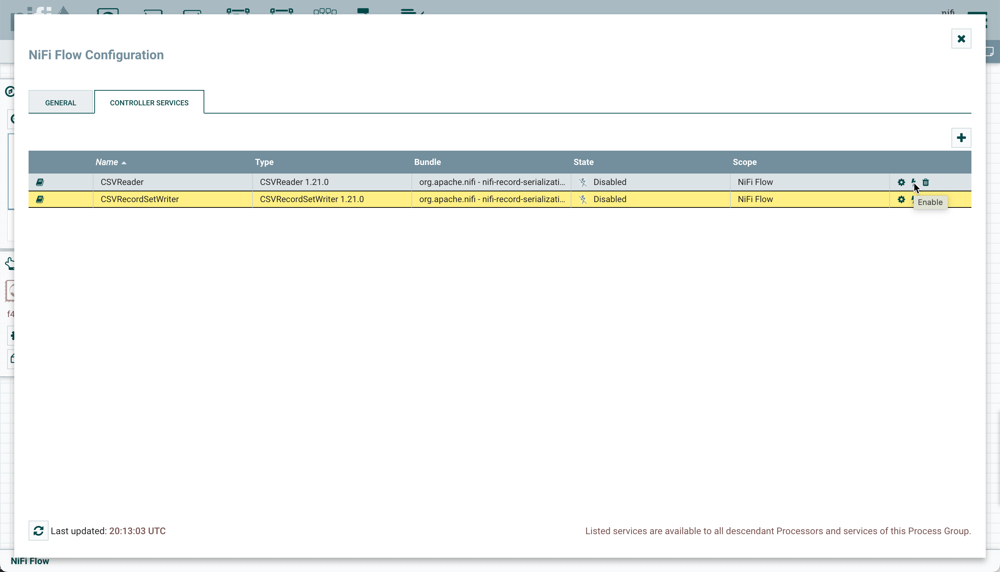

and on the **Enable Controller Service** window, click **ENABLE** and then **CLOSE**. 

The **SplitRecord** processor still shows an error, because the outgoing relationships are not yet used. Drag a connection from **SplitRecord** processor to the **PublishKafka\_2\_6**  processor and select **spits** for the **For Relationships** and click **ADD**.

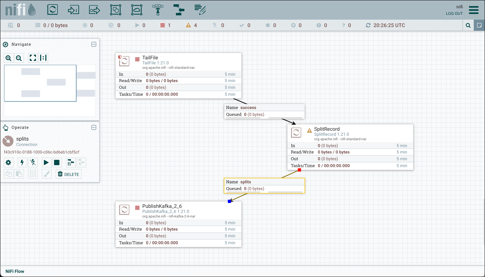

Double-click on **SplitRecord** processor and navigate to **RELATIONSHIPSç** tab and click on **terminate** for **Failure** and **Original** relationship.

### Rerun the pipeline to see the split 

Let's run all 3 processors and use `kcat` to see if the split works:

```
docker exec -ti kcat kcat -b kafka-1:19092 -t vehicle_tracking_sysB -f "%k - %s" -q
```

we can see that the key part is still empty but we now get one Kafka message for each vehicle message.

```bash
 - SystemB,1687725060441,98,31,1962261785,Normal,37.66:-94.3,-3966244693385209281
 - SystemB,1687725060451,66,24,137128276,Normal,38.65:-90.2,-3966244693385209281
 - SystemB,1687725060471,57,20,1594289134,Normal,41.56:-90.64,-3966244693385209281
 - SystemB,1687725060481,61,15,1594289134,Normal,34.8:-92.09,-3966244693385209281
 - SystemB,1687725060561,90,32,160779139,Normal,34.81:-91.93,-3966244693385209281
```

The **PublishKafka\_2\_6** by default uses the attribute `kafka.key` as the kafka key. So we have to set it to the value we want to use for the key, which we can do by extracting the value from the flow file. 

### Add a `ExtractText` processor to extract a value

Stop all running processors and drag a new Processor onto the Canvas, just below the **SplitRecord** processor. 

Enter **ExtractT** into the Filter and select the **ExtractText** processor and click on **ADD** to add it to the canvas as well. 

Drag the connection (blue end) away from the  **PublishKafka\_2\_6** processor and connect it with the **ExtractText** processor

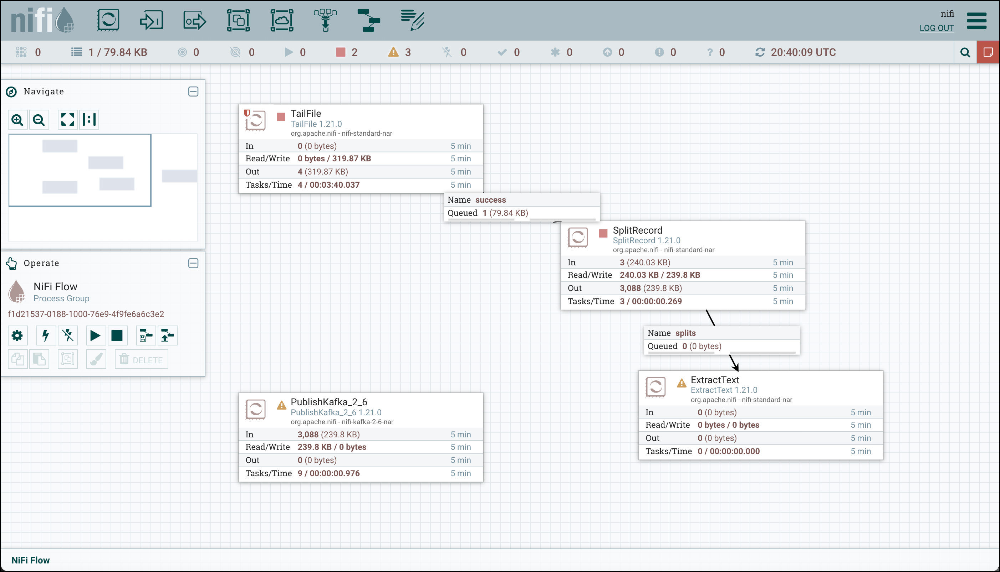

Let's configure the new processor. Double-click on the `ExtractText` and navigate to **PROPERTIES**. Configure the properties for publishing to Kafka.

Add a new property using the **+** sign. Enter `kafka.key` into the **Property Name** field and click **OK**. Enter the following regular expression `,.*?,(.*?),` into the expression field and click **OK**. This will extract the 3rd field of the CSV line (truck id) and use it for the key. 

Drag a connection from **ExtractText** to the **PublishKafka\_2\_6** processor and select the **matched** check box below **For Relationships** and click **ADD**. 

Double-click on **ExtractText** processor and navigate to **RELATIONSHIPS** tab and click on **terminate** for **Unmatched** relationship and click **APPLY**.

Let's realign the 4 processors

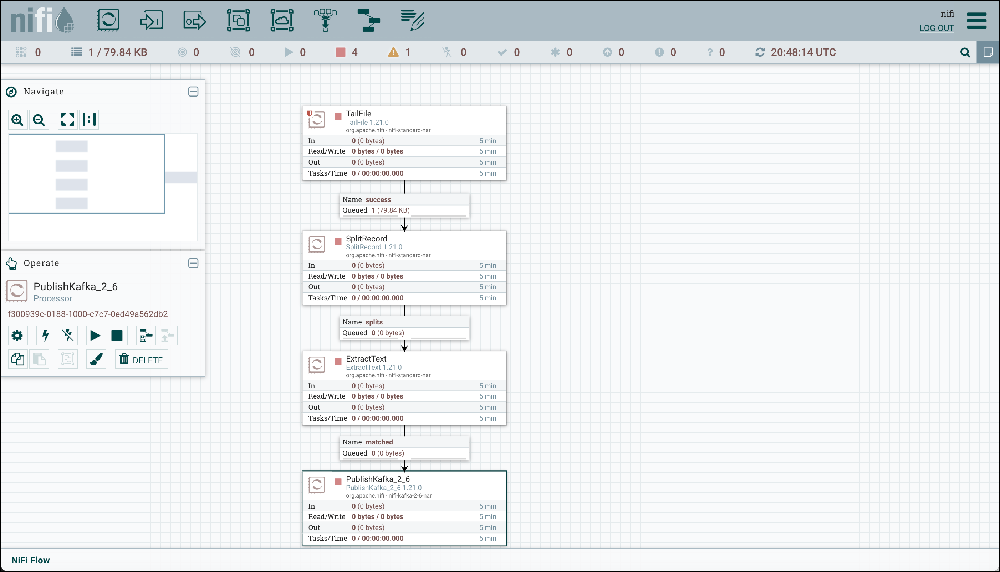

Now let's run all 4 processors and check that the Kafka messages also include a valid key portion. 

```
docker exec -ti kcat kcat -b kafka-1:19092 -t vehicle_tracking_sysB -f "%k - %s" -q
```

we can see that the key part is no longer empty

```bash
59 - SystemB,1687727635817,59,30,160779139,Normal,41.71:-91.32,8517215614002503388
84 - SystemB,1687727636337,84,15,1594289134,Normal,34.8:-92.09,8517215614002503388
57 - SystemB,1687727636337,57,27,1198242881,Unsafe tail distance,36.66:-95.14,8517215614002503388
59 - SystemB,1687727636677,59,30,160779139,Normal,41.72:-91.05,8517215614002503388
57 - SystemB,1687727637147,57,27,1198242881,Normal,36.73:-95.01,8517215614002503388
84 - SystemB,1687727637217,84,15,1594289134,Normal,34.81:-91.93,8517215614002503388
59 - SystemB,1687727637606,59,30,160779139,Normal,41.62:-90.7,8517215614002503388
91 - SystemB,1687727634910,91,18,1567254452,Normal,42.04:-88.02,8517215614002503388
98 - SystemB,1687727635707,98,14,803014426,Unsafe following distance,36.24:-96.97,8517215614002503388
91 - SystemB,1687727635807,91,18,1567254452,Unsafe following distance,42.11:-88.41,8517215614002503388
98 - SystemB,1687727636486,98,14,803014426,Normal,36.2:-96.68,8517215614002503388
91 - SystemB,1687727636687,91,18,1567254452,Normal,42.21:-88.64,8517215614002503388
98 - SystemB,1687727637286,98,14,803014426,Normal,36.23:-96.44,8517215614002503388
91 - SystemB,1687727637617,91,18,1567254452,Normal,42.25:-88.96,8517215614002503388
```

## Creating a StreamSets DataCollector Edge pipeline (to be updated)

Now let's create a StreamSets DataCollector pipeline, which retrieves the data from the File, using a tail operation similar to the one shown from the console and send the data to an MQTT Topic. We will use Streamsets Data Collector Edge, as this pipeline would run directly on the truck, where the file is being created.

In a browser window, navigate to <http://dataplatform:18630/> to open StreamSets Data Collector UI and login using `admin` for both **Username** and **Password**.

Click on **Create New Pipeline** button to create a new empty pipeline. Set the **Title** field to `File_to_MQTT` and select the **Data Collector Edge Pipeline** option. 
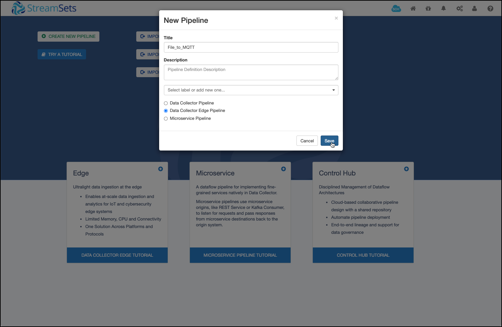

Click on **Save** and an empty Pipeline should appear. 

From the **Select Origin ...** drop-down list select `File Tail` to read from a local file. 

From the **Select Destination to connect...** drop-down list select `MQTT Publisher` to produce the message to the MQTT broker. So far the pipeline should look as shown in the diagram below. 

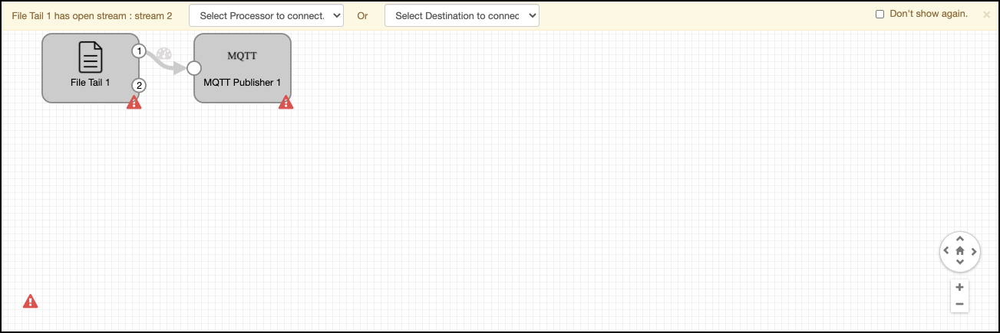

The **File Tail** origin has a second stream, which we have to connect to something as well. This stream is producing meta information on the file being read. Agin select from **Select Destination to connect...** drop-down list and chose **Trash** this time. This will result in the meta-information being discarded. 

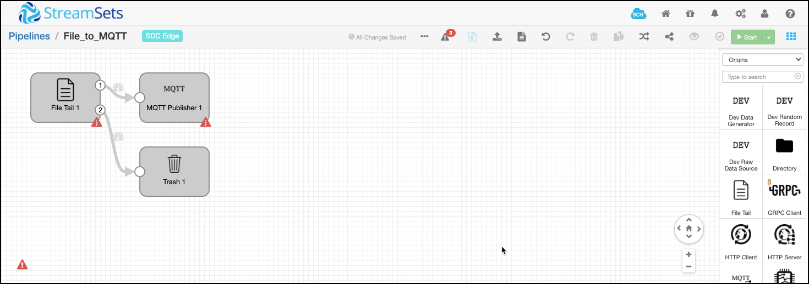

Now click on the error icon on pipeline level (bottom left corner) and on the **Error Records** tab select `Discard (Library: Basic` for the **Error Records** drop-down and the error will disappear. 

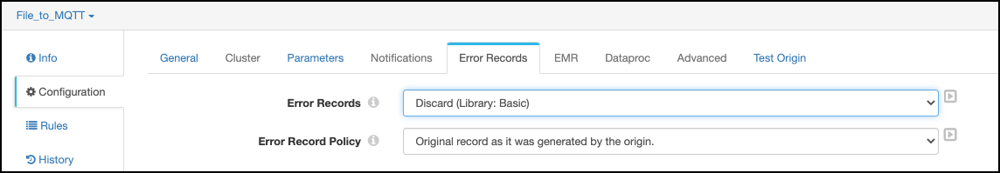

Now last but not least we have to configure the `File Tail 1` origin and the `MQTT Publisher 1` destination.

Let's start with the origin. Click on the `File Tail 1` origin and navigate to the **Files** tab. Set the **Maximum Batch Size** to `1` and in the **File to Tail** section set the **Path** to `/data-transfer/logs/TruckData-10.dat`, the file being generated. 

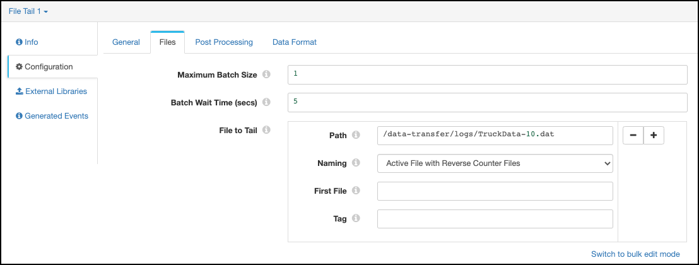

Navigate to the **Data Format** tab and set the **Data Format** to `Text`.

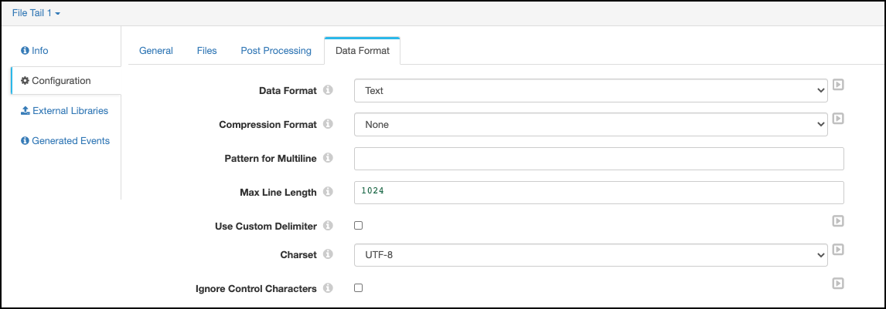

Next let's configure the `MQTT Publisher 1`. Click on the destination and navigate to the **MQTT** tab. Enter `tcp://mosquitto-1:1883` into the **Broker URL** field and `truck/10/position` into the **Topic** field. We are hardcoding the driver id in the Topic hierarchy, in real-life this would have to be taken from either the message or the file name. 

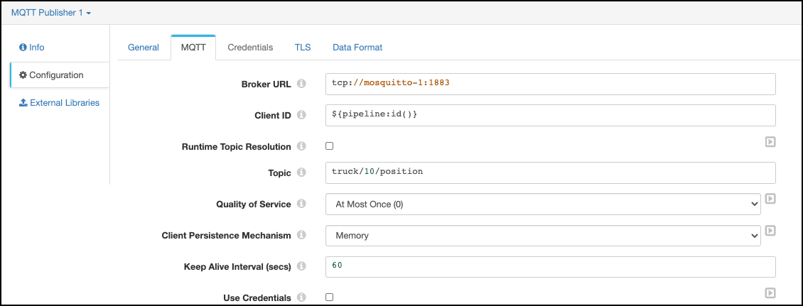

Navigate to the **Data Format** tab and set the **Data Format** to `Text`.

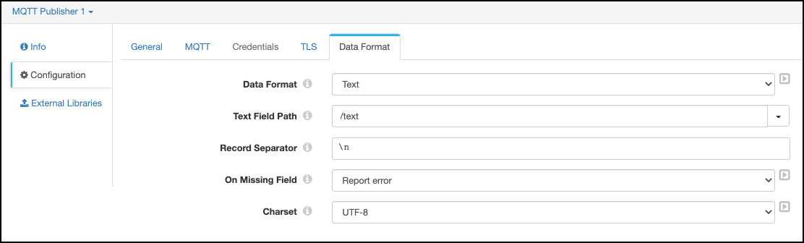

Now the pipeline is ready to be run in preview mode. Because it is an Edge Pipeline, we also have to configure the URL of a StreamSets Data Collector Edge engine. The Data Platform runs one on port `18633`. To configure the Data Collector Edge URL, click on the canvas outside of any of the components to navigate to pipeline level and then select the **General** tab. Enter `http://streamsets-edge-1:18633` into the **Data Collector Edge URL** field. 

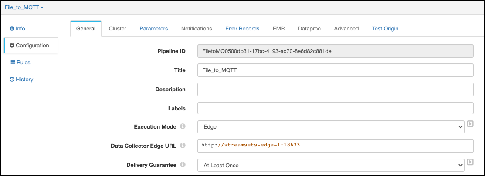

Now let's run the pipeline in preview mode by clicking on the **Preview** icon


On the **Preview Configuration** select the **Show Record/Field Header** option and click **Run Preview**. You should see one record as it has been retrieved from the file. The Record Header shows the **filename** which has been retrieved. From here we could easily get the truck id for the MQTT topic dynamically. 

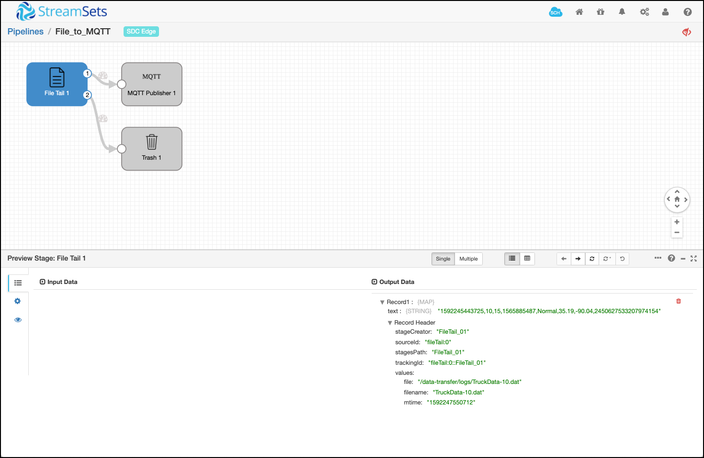

So everything looks good. So let's stop the preview and run the pipeline on the Data Collector Edge by clicking on green **Start** button in the upper right corner. 

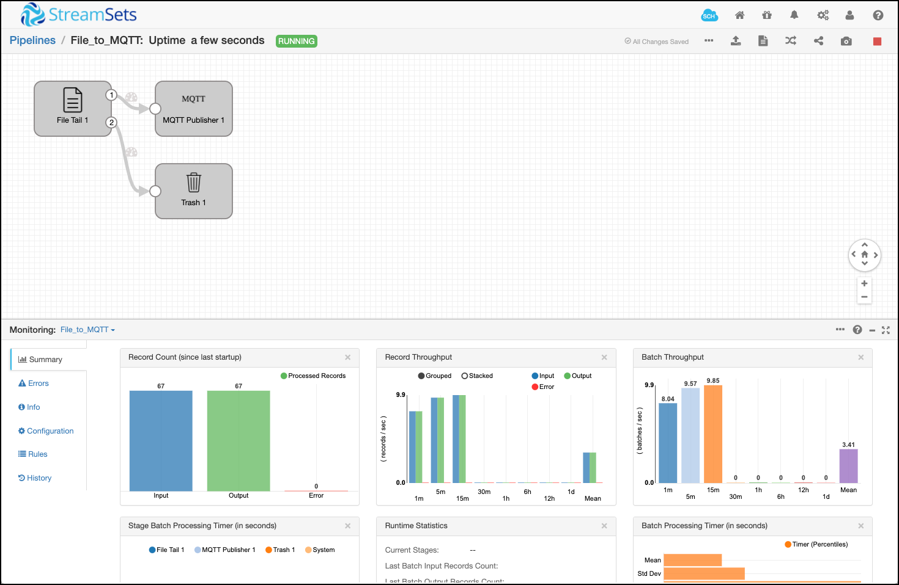

----
[previous part](../07b-iot-data-ingestion-mqtt-to-kafka-with-connect/README.md)
[top](../07-iot-data-ingestion-and-transformation/README.md) 
| 	[next part](../07d-iot-data-normalization-using-ksqldb/README.md)
