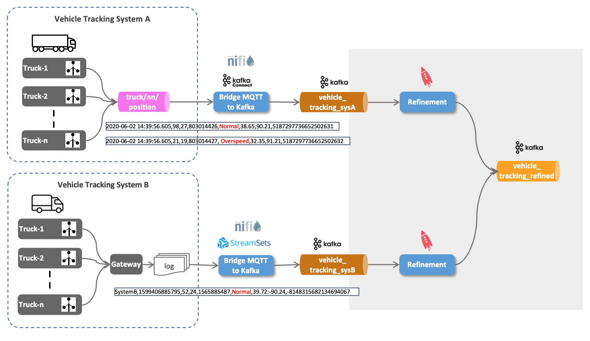

# Ingest IoT Vehicle Data - Refining data into a normalized topic using ksqlDB

In this part we will refine the data and place it in a new topic. The idea here is to have one normalised topic in Avro format, where all the tracking data from both system A and B will be placed, so that further processing can take it from there. 

We will be using [ksqlDB](https://ksqldb.io/) to transform the data from CSV/JSON to a normalised Avro schema.



## Replicate previous steps

create Kafka topics

```bash
docker exec -ti kafka-1 kafka-console-consumer --bootstrap-server kafka-1:19092 --topic vehicle_tracking_sysA
docker exec -ti kafka-1 kafka-console-consumer --bootstrap-server kafka-1:19092 --topic vehicle_tracking_sysB
```

run vehicle simulator for 1 - 49

```bash
docker run --network host --rm trivadis/iot-truck-simulator '-s' 'MQTT' '-h' $DOCKER_HOST_IP '-p' '1883' '-f' 'JSON' '-vf' '1-49'
```

```bash
curl -X PUT \
  http://dataplatform:8083/connectors/mqtt-source/config \
  -H 'Content-Type: application/json' \
  -H 'Accept: application/json' \
  -d '{
    "connector.class": "com.datamountaineer.streamreactor.connect.mqtt.source.MqttSourceConnector",
    "connect.mqtt.connection.timeout": "1000",
    "tasks.max": "1",
    "connect.mqtt.kcql": "INSERT INTO vehicle_tracking_sysA SELECT * FROM truck/+/position",
    "connect.mqtt.connection.clean": "true",
    "connect.mqtt.service.quality": "0",
    "connect.mqtt.connection.keep.alive": "1000",
    "connect.mqtt.client.id": "tm-mqtt-connect-01",
    "connect.mqtt.converter.throw.on.error": "true",
    "connect.mqtt.hosts": "tcp://mosquitto-1:1883"
}
```

load and run this Apache NiFi flow


## Working with ksqlDB

ksqlDB is an event streaming database purpose-built to help developers create stream processing applications on top of Apache Kafka.


[_Source: Confluent_](https://docs.ksqldb.io/en/latest/)

### Connect to ksqlDB engine

Let's connect to the ksqlDB shell

``` bash
docker exec -it ksqldb-cli ksql http://ksqldb-server-1:8088
```

### Use ksqlDB for displaying messages

Show the available Kafka topics

```sql
show topics;
```

Let's consume the data from the `truck_position` topic, assuming the truck simulator and the MQTT connector is still running.

```sql
print 'vehicle_tracking_sysA';
```

You can also add the keyword `from beginning` to start consuming at the beginning of the topic.

```sql
print 'vehicle_tracking_sysA' from beginning;
```

You can also use the show commands for showing the other KSQL objects (which we will now create)

```sql
show streams;
show tables;
show queries;
```

### Create a Stream and SELECT from it

First drop the stream if it already exists:

``` sql
DROP STREAM IF EXISTS vehicle_tracking_sysA_s;
```

Now let's create the ksqlDB Stream

``` sql
CREATE STREAM IF NOT EXISTS vehicle_tracking_sysA_s 
  (mqttTopic VARCHAR KEY,
  timestamp VARCHAR, 
   truckId VARCHAR, 
   driverId BIGINT, 
   routeId BIGINT,
   eventType VARCHAR,
   latitude DOUBLE,
   longitude DOUBLE,
   correlationId VARCHAR)
  WITH (kafka_topic='vehicle_tracking_sysA',
        value_format='JSON');
```

We are using the `JSON` value format, as our stream is a JSON-formatted string. 

Let's see the live data by using a `SELECT` on the Stream with the `EMIT CHANGES` clause:

``` sql
SELECT * FROM vehicle_tracking_sysA_s EMIT CHANGES;
```

This is a so-called *Push Query* (declared by the `EMIT CHANGES` clause). A push query is a form of query issued by a client that subscribes to a result as it changes in real-time.  


[_Source: Confluent_](https://docs.ksqldb.io/en/latest/concepts/queries/push/)

You should see a continuous stream of events as a result of the SELECT statement, similar as shown below:

```
ksql> SELECT * from vehicle_tracking_sysA_s EMIT CHANGES;
+------------------------------+------------------------------+------------------------------+------------------------------+------------------------------+------------------------------+------------------------------+------------------------------+------------------------------+
|MQTTTOPIC                     |TIMESTAMP                     |TRUCKID                       |DRIVERID                      |ROUTEID                       |EVENTTYPE                     |LATITUDE                      |LONGITUDE                     |CORRELATIONID                 |
+------------------------------+------------------------------+------------------------------+------------------------------+------------------------------+------------------------------+------------------------------+------------------------------+------------------------------+
|truck/11/position             |1599398981285                 |11                            |17                            |1594289134                    |Normal                        |38.99                         |-93.45                        |-8240058917944842967          |
|truck/42/position             |1599398981846                 |42                            |22                            |1325562373                    |Normal                        |37.15                         |-97.32                        |-8240058917944842967          |
|truck/10/position             |1599398982135                 |10                            |10                            |1962261785                    |Normal                        |38.09                         |-91.44                        |-8240058917944842967          |
|truck/34/position             |1599398982454                 |34                            |16                            |1198242881                    |Normal                        |39.01                         |-93.85                        |-8240058917944842967          |
```

We have submitted our first simple KSQL statement. Let's now add some analytics to this base statement. 


Get info on the stream using the `DESCRIBE` command

```sql
DESCRIBE vehicle_tracking_sysA_s;
```

or with the additional `EXTENDED` option

```sql
DESCRIBE EXTENDED vehicle_tracking_sysA_s;
```

### Create a new "refined" stream where the data is transformed into Avro

First drop the stream if it already exists:

``` sql
DROP STREAM IF EXISTS vehicle_tracking_refined_s;
```

And now create the refined ksqlDB Stream with a `CREATE STREAM ... AS SELECT ...` statement. We include an additional column `source`, which holds the system the data is coming from.

``` sql
CREATE STREAM IF NOT EXISTS vehicle_tracking_refined_s 
  WITH (kafka_topic='vehicle_tracking_refined',
        value_format='AVRO',
        VALUE_AVRO_SCHEMA_FULL_NAME='com.trivadis.avro.VehicleTrackingRefined')
AS SELECT truckId AS ROWKEY
		, 'Tracking_SysA' AS source
		, timestamp
		, AS_VALUE(truckId) AS vehicleId
		, driverId
		, routeId
		, eventType
		, latitude
		, longitude
		, correlationId
FROM vehicle_tracking_sysA_s
PARTITION BY truckId
EMIT CHANGES;
```

To check that the refined topic does in fact hold Avro formatted data, let's just do a normal kcat on the `truck_position_refined` topic

``` bash
docker exec -ti kcat kcat -b kafka-1 -t vehicle_tracking_refined
```

we can see that it is serialised as Avro 

```
                            Normal���Q�B@ףp=
WX�$343671958179690963
1598125263176886����
                             Normal��Q��C@�p=
דW�$343671958179690963
% Reached end of topic truck_position_refined [0] at offset 367
159812526333671�ߩ�2Unsafe following distance�Q���B@���(\?W�$343671958179690963
% Reached end of topic truck_position_refined [5] at offset 353
% Reached end of topic truck_position_refined [2] at offset 324
1598125263526101����
                              Normal=
ףpE@R����V�$343671958179690963
% Reached end of topic truck_position_refined [7] at offset 355
```

we can use the `-s` and `-r` option to specify the Avro Serde and the URL of the schema registry and the output is readable:

``` bash
docker exec -ti kcat kcat -b kafka-1 -t vehicle_tracking_refined -s value=avro -r http://schema-registry-1:8081
```

You can use the Schema Registry UI on <http://dataplatform:28102> to view the Avro Schema created by ksqlDB.

### Refinement of data from System B

Now let's do the refinement on the raw data from System B and place it into the same topic `vehicle_tracking_refined` as used in step 2.

Firs lets create the Stream on the raw data topic:

```sql
DROP STREAM IF EXISTS vehicle_tracking_sysB_s;
```

```sql
CREATE STREAM IF NOT EXISTS vehicle_tracking_sysB_s 
  (ROWKEY VARCHAR KEY,
   system VARCHAR,
   timestamp VARCHAR, 
   vehicleId VARCHAR, 
   driverId BIGINT, 
   routeId BIGINT,
   eventType VARCHAR,
   latLong VARCHAR,
   correlationId VARCHAR)
  WITH (kafka_topic='vehicle_tracking_sysB',
        value_format='DELIMITED');
```

System B delivers the latitude and longitude in one field as a string, with the two values delimited by a colon character.

```sql
DESCRIBE vehicle_tracking_sysB_s;
DESCRIBE vehicle_tracking_refined_s;
```

Now we can use the `INSERT` statement to write the data into the `vehicle_tracking_refined_s` stream we have created in step 2. We have to make sure that the structure matches (the refinement we perform), which in this case is providing the right value for the `source` column as well as splitting the `latLong` value into a `latitude` and `longitude` value:

``` sql
INSERT INTO vehicle_tracking_refined_s 
SELECT ROWKEY
    , 'Tracking_SysB' AS source
	, timestamp
	, vehicleId
	, driverId
	, routeId
	, eventType
	, CAST(split(latLong,':')[1] as DOUBLE) as latitude
	, CAST(split(latLong,':')[2] AS DOUBLE) as longitude
	, correlationId
FROM vehicle_tracking_sysB_s
EMIT CHANGES;
```


----
[previous part](../07c-iot-data-ingestion-sys-b-into-kafka/README.md)
[top](../07-iot-data-ingestion-and-transformation/README.md) 
| 	[next part](../07b-iot-data-ingestion-mqtt-to-kafka/README.md)

