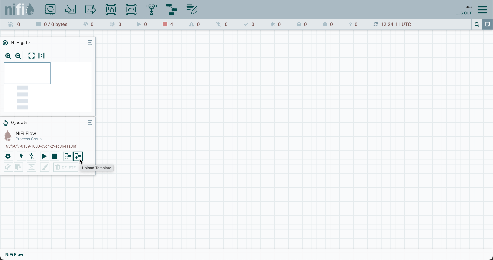
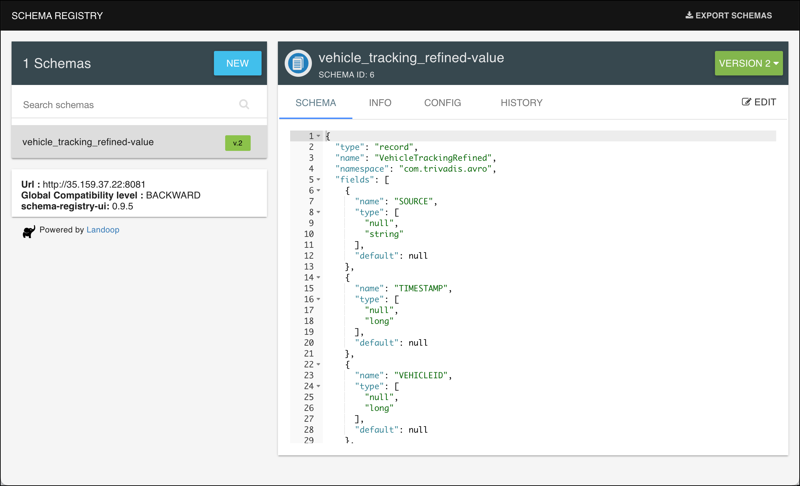

# IoT Vehicle Data - Refining data into a normalized topic using ksqlDB

In this part we will refine the data and place it in a new topic. The idea here is to have one normalised topic in Avro format, where all the tracking data from both system A and B will be placed, so that further processing can take it from there. 

We will be using [ksqlDB](https://ksqldb.io/) to transform the data from CSV/JSON to a normalised Avro schema.


## Replicate previous steps

create Kafka topics

```bash
docker exec -ti kafka-1 kafka-topics --bootstrap-server kafka-1:19092 --create --topic vehicle_tracking_sysA --partitions 8 --replication-factor 3
```

```bash
docker exec -ti kafka-1 kafka-topics --bootstrap-server kafka-1:19092 --create --topic vehicle_tracking_sysB --partitions 8 --replication-factor 3
```

run vehicle simulator for 1 - 49

```bash
docker run --network host --rm trivadis/iot-truck-simulator '-s' 'MQTT' '-h' $DOCKER_HOST_IP '-p' '1883' '-f' 'JSON' '-vf' '1-49'
```

download mqtt connector

```bash
cd $DATAPLATFORM_HOME/plugins/kafka-connect/connectors
sudo wget https://github.com/lensesio/stream-reactor/releases/download/4.2.0/kafka-connect-mqtt-4.2.0.zip
sudo unzip kafka-connect-mqtt-4.2.0.zip
sudo rm kafka-connect-mqtt-4.2.0.zip
```

restart kafka-connect containers

```bash
cd $DATAPLATFORM_HOME
docker compose restart kafka-connect-1 kafka-connect-2
```

and create the bridge from MQTT to Kafka

```bash
curl -X PUT \
  http://${DOCKER_HOST_IP}:8083/connectors/mqtt-source/config \
  -H 'Content-Type: application/json' \
  -H 'Accept: application/json' \
  -d '{
    "connector.class": "com.datamountaineer.streamreactor.connect.mqtt.source.MqttSourceConnector",
    "connect.mqtt.connection.timeout": "1000",
    "tasks.max": "1",
    "connect.mqtt.kcql": "INSERT INTO vehicle_tracking_sysA SELECT * FROM truck/+/position WITHCONVERTER=`com.datamountaineer.streamreactor.connect.converters.source.JsonSimpleConverter` WITHKEY(truckId)",
    "connect.mqtt.connection.clean": "true",
    "connect.mqtt.service.quality": "0",
    "connect.mqtt.connection.keep.alive": "1000",
    "connect.mqtt.client.id": "tm-mqtt-connect-01",
    "connect.mqtt.converter.throw.on.error": "true",
    "connect.mqtt.hosts": "tcp://mosquitto-1:1883",
    "key.converter": "org.apache.kafka.connect.json.JsonConverter",
    "key.converter.schemas.enable": "false",
    "value.converter": "org.apache.kafka.connect.json.JsonConverter",
    "value.converter.schemas.enable": "false"
}'
```

if you want to check and consume the message with `kcat`

```bash
docker exec -ti kcat kcat -b kafka-1 -t vehicle_tracking_sysA -f "%k - %s\n" -q
```

Run the simulator for vehicles 50 - 100


```bash
cd $DATAPLATFORM_HOME
docker run -v "${PWD}/data-transfer/logs:/out" --rm trivadis/iot-truck-simulator "-s" "FILE" "-f" "CSV" "-d" "1000" "-vf" "50-100" "-es" "2"
```

Upload the NiFi Template `07c-iot-data-ingestion-sys-b-into-kafka/nifi/tailfile-to-kafka.xml` into Apache NiFi. 


now import the template into the canvas



After the flow is loaded, enable all controller services by right-clicking on the canvas and select **Enable all controller services**. Now you can start the flow by selecting all processors and clicking the **start** icon. 

To view the messages

```bash
docker exec -ti kcat kcat -b kafka-1 -t vehicle_tracking_sysB -f "%k - %s\n" -q
```

## Working with KSQL in an ad-hoc fashion

ksqlDB is an event streaming database purpose-built to help developers create stream processing applications on top of Apache Kafka.


[_Source: Confluent_](https://docs.ksqldb.io/en/latest/)

ksqlDB offers a SQL like dialect, but instead of reading from static tables, as you know from using it with databases, in KSQL we mostly read from data streams. In the Kafka world, a data stream is available through a Kafka topic. 

ksqlDB can be used for doing ad-hoc queries as well as running continuous queries in the background. Let's first doing some ad-hoc queries to familiarise ourselves with the data on the `truck_position` topic. 

### Connect to ksqlDB engine

An instance of a ksqlDB server is part of the Data Platform and started as service `ksqldb-server-1`. It can be reached on port 8088. Additionally the ksqlDB CLI is also running as service `ksqldb-cli`. 

Let's use the CLI by doing an `docker exec` into the running docker container

```
docker exec -it ksqldb-cli ksql http://ksqldb-server-1:8088
```

and you should see the ksqlDB "welcome page":

```
                  ===========================================
                  =       _              _ ____  ____       =
                  =      | | _____  __ _| |  _ \| __ )      =
                  =      | |/ / __|/ _` | | | | |  _ \      =
                  =      |   <\__ \ (_| | | |_| | |_) |     =
                  =      |_|\_\___/\__, |_|____/|____/      =
                  =                   |_|                   =
                  =  Event Streaming Database purpose-built =
                  =        for stream processing apps       =
                  ===========================================

Copyright 2017-2020 Confluent Inc.

CLI v0.9.0, Server v0.9.0 located at http://ksqldb-server-1:8088

Having trouble? Type 'help' (case-insensitive) for a rundown of how things work!
```

### Use ksqlDB for displaying messages

Show the available Kafka topics

```sql
show topics;
```

Let's consume the data from the `truck_position` topic, assuming the truck simulator and the MQTT connector is still running.

```sql
print 'vehicle_tracking_sysA';
```

You can also add the keyword `from beginning` to start consuming at the beginning of the topic.

```sql
print 'vehicle_tracking_sysA' from beginning;
```

You can also use the show commands for showing the other KSQL objects (which we will now create)

```sql
show streams;
show tables;
show queries;
```

### Create a Stream and SELECT from it

First drop the stream if it already exists:

``` sql
DROP STREAM IF EXISTS vehicle_tracking_sysA_s;
```

Now let's create the ksqlDB Stream

``` sql
CREATE STREAM IF NOT EXISTS vehicle_tracking_sysA_s 
  (key VARCHAR KEY,
  timestamp BIGINT, 
   truckId BIGINT, 
   driverId BIGINT, 
   routeId BIGINT,
   eventType VARCHAR,
   latitude DOUBLE,
   longitude DOUBLE,
   correlationId VARCHAR)
  WITH (kafka_topic='vehicle_tracking_sysA',
        value_format='JSON');
```

We are using the `JSON` value format, as our stream is a JSON-formatted string. 

Let's see the live data by using a `SELECT` on the Stream with the `EMIT CHANGES` clause:

``` sql
SELECT * FROM vehicle_tracking_sysA_s EMIT CHANGES;
```

This is a so-called *Push Query* (declared by the `EMIT CHANGES` clause). A push query is a form of query issued by a client that subscribes to a result as it changes in real-time.  


[_Source: Confluent_](https://docs.ksqldb.io/en/latest/concepts/queries/push/)

You should see a continuous stream of events as a result of the SELECT statement, similar as shown below:

```
ksql> SELECT * from vehicle_tracking_sysA_s EMIT CHANGES;
+---------------+---------------+---------------+---------------+---------------+---------------+---------------+---------------+---------------+
|KEY            |TIMESTAMP      |TRUCKID        |DRIVERID       |ROUTEID        |EVENTTYPE      |LATITUDE       |LONGITUDE      |CORRELATIONID  |
+---------------+---------------+---------------+---------------+---------------+---------------+---------------+---------------+---------------+
|"10"           |1688320285388  |10             |23             |927636994      |Normal         |41.89          |-87.66         |690643977849542|
|               |               |               |               |               |               |               |               |6077           |
|"33"           |1688320285688  |33             |10             |1962261785     |Normal         |36.23          |-96.44         |690643977849542|
|               |               |               |               |               |               |               |               |6077           |
|"11"           |1688320285728  |11             |17             |1567254452     |Normal         |41.71          |-91.94         |690643977849542|
|               |               |               |               |               |               |               |               |6077           |
|"38"           |1688320285788  |38             |15             |987179512      |Normal         |37.16          |-94.46         |690643977849542|
|               |               |               |               |               |               |               |               |6077           |
Press CTL-C to interrupt
```

As long as we don't stop the query, we get a constant stream of new truck messages.
We have submitted our first simple KSQL statement. Let's now add some analytics to this base statement. Stop the statement by entering `CTRL-C`.

We can also state that we get a nicely formatted structure back. Compare that to the output of the console consumer or `kcat`. 

```
ubuntu@ip-172-26-0-185:~$ docker exec -ti kcat kcat -b kafka-1:19092 -t vehicle_tracking_sysA -o end -q
{"timestamp":1688387187891,"truckId":23,"driverId":31,"routeId":137128276,"eventType":"Normal","correlationId":"9221847540415582109","latitude":39.72,"longitude":-90.97}
{"timestamp":1688387187861,"truckId":25,"driverId":26,"routeId":1198242881,"eventType":"Normal","correlationId":"9221847540415582109","latitude":41.71,"longitude":-93.04}
{"timestamp":1688387188001,"truckId":24,"driverId":10,"routeId":803014426,"eventType":"Normal","correlationId":"9221847540415582109","latitude":37.26,"longitude":-93.14}
{"timestamp":1688387188521,"truckId":13,"driverId":23,"routeId":1962261785,"eventType":"Normal","correlationId":"9221847540415582109","latitude":38.93,"longitude":-91.56}
{"timestamp":1688387188781,"truckId":29,"driverId":25,"routeId":160779139,"eventType":"Normal","correlationId":"9221847540415582109","latitude":41.89,"longitude":-87.66}
```

We can get info about the stream object using the `DESCRIBE` command

```sql
DESCRIBE vehicle_tracking_sysA_s;
```

or with the additional `EXTENDED` option

```sql
DESCRIBE vehicle_tracking_sysA_s EXTENDED;
```

```sql
ksql> DESCRIBE vehicle_tracking_sysA_s EXTENDED;

Name                 : VEHICLE_TRACKING_SYSA_S
Type                 : STREAM
Timestamp field      : Not set - using <ROWTIME>
Key format           : KAFKA
Value format         : JSON
Kafka topic          : vehicle_tracking_sysA (partitions: 8, replication: 3)
Statement            : CREATE STREAM IF NOT EXISTS VEHICLE_TRACKING_SYSA_S (KEY STRING KEY, TIMESTAMP BIGINT, TRUCKID BIGINT, DRIVERID BIGINT, ROUTEID BIGINT, EVENTTYPE STRING, LATITUDE DOUBLE, LONGITUDE DOUBLE, CORRELATIONID STRING) WITH (KAFKA_TOPIC='vehicle_tracking_sysA', KEY_FORMAT='KAFKA', VALUE_FORMAT='JSON');

 Field         | Type
----------------------------------------
 KEY           | VARCHAR(STRING)  (key)
 TIMESTAMP     | BIGINT
 TRUCKID       | BIGINT
 DRIVERID      | BIGINT
 ROUTEID       | BIGINT
 EVENTTYPE     | VARCHAR(STRING)
 LATITUDE      | DOUBLE
 LONGITUDE     | DOUBLE
 CORRELATIONID | VARCHAR(STRING)
----------------------------------------

Local runtime statistics
------------------------


(Statistics of the local KSQL server interaction with the Kafka topic vehicle_tracking_sysA)
ksql>
```

### Create a new "refined" stream where the data is transformed into Avro

With KSQL it is very easy to translate this into a new format, Avro in this case. We just have to create a new stream using the `CREATE STREAM ...` statement using the same SQL statement and specify `AVRO` as the `value_format`:

First drop the stream if it already exists:

``` sql
DROP STREAM IF EXISTS vehicle_tracking_refined_s;
```

And now create the refined ksqlDB Stream with a `CREATE STREAM ... AS SELECT ...` statement. We include an additional column `source`, which holds the system the data is coming from.

``` sql
CREATE STREAM IF NOT EXISTS vehicle_tracking_refined_s 
  WITH (kafka_topic='vehicle_tracking_refined',
        value_format='AVRO',
        VALUE_AVRO_SCHEMA_FULL_NAME='com.trivadis.avro.VehicleTrackingRefined')
AS SELECT key AS ROWKEY
		, 'Tracking_SysA' AS source
		, timestamp
		, AS_VALUE(truckId) AS vehicleId
		, driverId
		, routeId
		, eventType
		, latitude
		, longitude
		, correlationId
FROM vehicle_tracking_sysA_s
PARTITION BY key
EMIT CHANGES;
```

To check that the refined topic does in fact hold Avro formatted data, let's just do a normal `kcat` on the `truck_position_refined` topic

``` bash
docker exec -ti kcat kcat -b kafka-1:19092 -t vehicle_tracking_refined
```

we can see that it is serialised as Avro 

```
                            Normal���Q�B@ףp=
WX�$343671958179690963
1598125263176886����
                             Normal��Q��C@�p=
דW�$343671958179690963
% Reached end of topic truck_position_refined [0] at offset 367
159812526333671�ߩ�2Unsafe following distance�Q���B@���(\?W�$343671958179690963
% Reached end of topic truck_position_refined [5] at offset 353
% Reached end of topic truck_position_refined [2] at offset 324
1598125263526101����
                              Normal=
ףpE@R����V�$343671958179690963
% Reached end of topic truck_position_refined [7] at offset 355
```

we can use the `-s` and `-r` option to specify the Avro Serde and the URL of the schema registry and the output is readable:

``` bash
docker exec -ti kcat kcat -b kafka-1:19092 -t vehicle_tracking_refined -s value=avro -r http://schema-registry-1:8081
```

You can use the Schema Registry UI on <http://dataplatform:28102> to view the Avro Schema created by ksqlDB.




----
**Note:** if you need to drop a STREAM you might get an `Cannot drop XXXX` error message:

```
Cannot drop VEHICLE_TRACKING_REFINED_S.
The following queries read from this source: [].
The following queries write into this source: [CSAS_VEHICLE_TRACKING_S_9].
You need to terminate them before dropping VEHICLE_TRACKING_REFINED_S.
```

to solve the problem, just use the `TERMINATE` statement to stop the query(s) mentioned in the error message:

```
TERMINATE CSAS_VEHICLE_TRACKING_S_9;
```
---

### Refinement of data from System B

Now let's do the refinement on the raw data from System B and place it into the same stream `vehicle_tracking_refined_s` as before with the refined data of System A.

Firs lets create the Stream on the raw data topic:

```sql
DROP STREAM IF EXISTS vehicle_tracking_sysB_s;
```

```sql
CREATE STREAM IF NOT EXISTS vehicle_tracking_sysB_s 
  (ROWKEY VARCHAR KEY,
   system VARCHAR,
   timestamp VARCHAR, 
   vehicleId VARCHAR, 
   driverId BIGINT, 
   routeId BIGINT,
   eventType VARCHAR,
   latLong VARCHAR,
   correlationId VARCHAR)
  WITH (kafka_topic='vehicle_tracking_sysB',
        value_format='DELIMITED');
```

System B delivers the latitude and longitude in one field as a string, with the two values delimited by a colon character.

```sql
SELECT * FROM vehicle_tracking_sysB_s EMIT CHANGES;
```

```
ksql> SELECT * FROM vehicle_tracking_sysB_s EMIT CHANGES;
+---------------+---------------+---------------+---------------+---------------+---------------+---------------+---------------+---------------+
|ROWKEY         |SYSTEM         |TIMESTAMP      |VEHICLEID      |DRIVERID       |ROUTEID        |EVENTTYPE      |LATLONG        |CORRELATIONID  |
+---------------+---------------+---------------+---------------+---------------+---------------+---------------+---------------+---------------+
|74             |SystemB        |1688321026323  |74             |18             |1090292248     |Normal         |39.72:-90.97   |582342944428752|
|               |               |               |               |               |               |               |               |3              |
|74             |SystemB        |1688321027213  |74             |18             |1090292248     |Normal         |39.75:-91.2    |582342944428752|
|               |               |               |               |               |               |               |               |3              |
|97             |SystemB        |1688321026243  |97             |25             |371182829      |Normal         |35.35:-90.24   |582342944428752|
|               |               |               |               |               |               |               |               |3              |
|97             |SystemB        |1688321027062  |97             |25             |371182829      |Normal         |35.1:-90.07    |582342944428752|
|               |               |               |               |               |               |               |               |3              |
|85             |SystemB        |1688321026063  |85             |13             |1390372503     |Normal         |41.56:-90.64   |582342944428752|
|               |               |               |               |               |               |               |               |3              |
|85             |SystemB        |1688321026822  |85             |13             |1390372503     |Normal         |41.59:-90.2    |582342944428752|
|               |               |               |               |               |               |               |               |3              |
|85             |SystemB        |1688321027643  |85             |13             |1390372503     |Normal         |41.77:-89.88   |582342944428752|
|               |               |               |               |               |               |               |               |3              |
|53             |SystemB        |1688321026332  |53             |20             |1090292248     |Normal         |41.56:-90.64   |582342944428752|
|               |               |               |               |               |               |               |               |3              |
|53             |SystemB        |1688321027242  |53             |20             |1090292248     |Normal         |41.59:-90.2    |582342944428752|
|               |               |               |               |               |               |               |               |3              |
|51             |SystemB        |1688321026304  |51             |30             |160779139      |Normal         |41.56:-90.64   |582342944428752|
|               |               |               |               |               |               |               |               |3              |
|69             |SystemB        |1688321026902  |69             |29             |803014426      |Normal         |36.23:-96.44   |582342944428752|
Press CTL-C to interrupt
```

Let's view the structure of the source stream `vehicle_tracking_sysB_s` and the target stream `vehicle_tracking_refined_s`

```sql
DESCRIBE vehicle_tracking_sysB_s;
DESCRIBE vehicle_tracking_refined_s;
```

you should see the following output

```
ksql> DESCRIBE vehicle_tracking_sysB_s;

Name                 : VEHICLE_TRACKING_SYSB_S
 Field         | Type
----------------------------------------
 ROWKEY        | VARCHAR(STRING)  (key)
 SYSTEM        | VARCHAR(STRING)
 TIMESTAMP     | VARCHAR(STRING)
 VEHICLEID     | VARCHAR(STRING)
 DRIVERID      | BIGINT
 ROUTEID       | BIGINT
 EVENTTYPE     | VARCHAR(STRING)
 LATLONG       | VARCHAR(STRING)
 CORRELATIONID | VARCHAR(STRING)
----------------------------------------
For runtime statistics and query details run: DESCRIBE <Stream,Table> EXTENDED;
ksql> DESCRIBE vehicle_tracking_refined_s;

Name                 : VEHICLE_TRACKING_REFINED_S
 Field         | Type
----------------------------------------
 ROWKEY        | VARCHAR(STRING)  (key)
 SOURCE        | VARCHAR(STRING)
 TIMESTAMP     | BIGINT
 VEHICLEID     | BIGINT
 DRIVERID      | BIGINT
 ROUTEID       | BIGINT
 EVENTTYPE     | VARCHAR(STRING)
 LATITUDE      | DOUBLE
 LONGITUDE     | DOUBLE
 CORRELATIONID | VARCHAR(STRING)
----------------------------------------
For runtime statistics and query details run: DESCRIBE <Stream,Table> EXTENDED;
ksql>
```

Now we can use the `INSERT` statement to write the data into the `vehicle_tracking_refined_s` stream we have created before. We have to make sure that the structure matches (the refinement we perform), which in this case is providing the right value for the `source` column as well as splitting the `latLong` value into a `latitude` and `longitude` value and cast to the right data types:

``` sql
INSERT INTO vehicle_tracking_refined_s 
SELECT rowkey
    , 'Tracking_SysB' AS source
	, CAST (timestamp AS BIGINT) as timestamp
	, CAST (vehicleId AS BIGINT) as vehicleId
	, driverId
	, routeId
	, eventType
	, CAST(split(latLong,':')[1] as DOUBLE) as latitude
	, CAST(split(latLong,':')[2] AS DOUBLE) as longitude
	, correlationId
FROM vehicle_tracking_sysB_s
EMIT CHANGES;
```

Let's see that the data from System B also arrive in the stream

```sql
select * from vehicle_tracking_refined_s;
```

And you should see an output similar to this

```
ksql> select * from vehicle_tracking_refined_s;
+--------------------+--------------------+--------------------+--------------------+--------------------+--------------------+--------------------+--------------------+--------------------+--------------------+
|ROWKEY              |SOURCE              |TIMESTAMP           |VEHICLEID           |DRIVERID            |ROUTEID             |EVENTTYPE           |LATITUDE            |LONGITUDE           |CORRELATIONID       |
+--------------------+--------------------+--------------------+--------------------+--------------------+--------------------+--------------------+--------------------+--------------------+--------------------+
|"14"                |Tracking_SysA       |1688321371288       |14                  |27                  |1961634315          |Normal              |42.25               |-88.96              |6906439778495426077 |
|"11"                |Tracking_SysA       |1688321371498       |11                  |17                  |1567254452          |Normal              |35.31               |-93.12              |6906439778495426077 |
|"33"                |Tracking_SysA       |1688321371868       |33                  |10                  |1962261785          |Normal              |37.27               |-97.32              |6906439778495426077 |
|"10"                |Tracking_SysA       |1688321371987       |10                  |23                  |927636994           |Normal              |41.72               |-91.05              |6906439778495426077 |
|"25"                |Tracking_SysA       |1688321372108       |25                  |12                  |1325712174          |Normal              |37.31               |-94.31              |6906439778495426077 |
|"18"                |Tracking_SysA       |1688321372488       |18                  |18                  |137128276           |Normal              |34.92               |-92.25              |6906439778495426077 |
|"40"                |Tracking_SysA       |1688321373257       |40                  |21                  |1198242881          |Normal              |41.54               |-90.44              |6906439778495426077 |
|"30"                |Tracking_SysA       |1688321373328       |30                  |26                  |160405074           |Normal              |34.78               |-92.31              |6906439778495426077 |
|"46"                |Tracking_SysA       |1688321373468       |46                  |28                  |24929475            |Normal              |38.98               |-93.2               |6906439778495426077 |
|"38"                |Tracking_SysA       |1688321373718       |38                  |15                  |987179512           |Normal              |41.75               |-92.74              |6906439778495426077 |
|"29"                |Tracking_SysA       |1688321373908       |29                  |19                  |160779139           |Normal              |37.09               |-94.23              |6906439778495426077 |
|"45"                |Tracking_SysA       |1688321374398       |45                  |29                  |371182829           |Normal              |34.89               |-91.74              |6906439778495426077 |
|"14"                |Tracking_SysA       |1688321374538       |14                  |27                  |1961634315          |Normal              |42.21               |-88.64              |6906439778495426077 |
|"11"                |Tracking_SysA       |1688321375008       |11                  |17                  |1567254452          |Normal              |35.25               |-92.87              |6906439778495426077 |
|"25"                |Tracking_SysA       |1688321375207       |25                  |12                  |1325712174          |Normal              |37.66               |-94.3               |6906439778495426077 |
|"33"                |Tracking_SysA       |1688321375258       |33                  |10                  |1962261785          |Normal              |37.15               |-97.32              |6906439778495426077 |
|"10"                |Tracking_SysA       |1688321375578       |10                  |23                  |927636994           |Normal              |41.71               |-91.32              |6906439778495426077 |
|85                  |Tracking_SysB       |1688321367692       |85                  |13                  |1390372503          |Normal              |37.2                |-89.56              |5823429444287523    |
|85                  |Tracking_SysB       |1688321368522       |85                  |13                  |1390372503          |Normal              |37.47               |-89.71              |5823429444287523    |
|85                  |Tracking_SysB       |1688321369462       |85                  |13                  |1390372503          |Normal              |37.72               |-90.0               |5823429444287523    |
|97                  |Tracking_SysB       |1688321366982       |97                  |25                  |371182829           |Normal              |39.84               |-89.63              |5823429444287523    |
|97                  |Tracking_SysB       |1688321367842       |97                  |25                  |371182829           |Normal              |39.1                |-89.74              |5823429444287523    |
|97                  |Tracking_SysB       |1688321368792       |97                  |25                  |371182829           |Normal              |38.65               |-90.2               |5823429444287523    |
|97                  |Tracking_SysB       |1688321369602       |97                  |25                  |371182829           |Normal              |38.65               |-90.2               |5823429444287523    |
|85                  |Tracking_SysB       |1688321370462       |85                  |13                  |1390372503          |Normal              |38.0                |-90.24              |5823429444287523    |
|97                  |Tracking_SysB       |1688321370412       |97                  |25                  |371182829           |Normal              |35.21               |-90.37              |5823429444287523    |
|90                  |Tracking_SysB       |1688321366442       |90                  |16                  |1325712174          |Normal              |38.33               |-94.35              |5823429444287523    |
|60                  |Tracking_SysB       |1688321366612       |60                  |12                  |1594289134          |
Press CTL-C to interrupt
```

----
[previous part](../07c-iot-data-ingestion-sys-b-into-kafka/README.md)
[top](../07-iot-data-ingestion-and-transformation/README.md) 
| 	[next part](../07e-iot-queryable-data/README.md)

