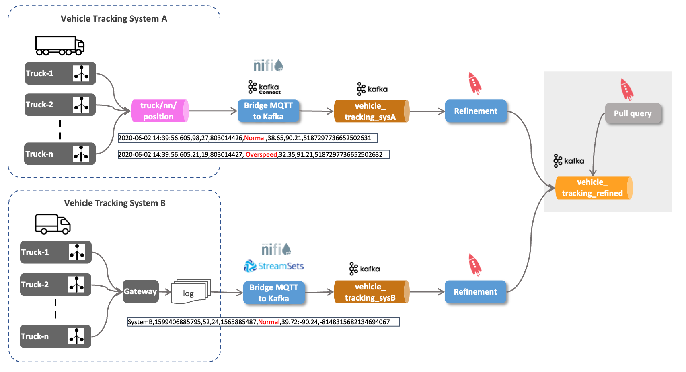

# Ingest IoT Vehicle Data - Using Pull query to get data

So with the vehicle position data from both source systems normalized into the `vehicle_tracking_refined` topic and available in ksqlDB through the `vehicle_tracking_refined_s` stream object, is it possible to query for the latest position for a given vehicle? 



In ksqlDB suche queries are called *pull queries*, in contrast to the streaming queries we have seen so far, known as *push queries* (using the `EMIT CHANGES` clause). A pull query is a form of query issued by a client that retrieves a result as of "now", like a query against a traditional RDBS. 


[_Source: Confluent_](https://docs.ksqldb.io/en/latest/concepts/queries/pull/)

So let's do a `SELECT` on the stream, restricting on the `vehicleId` without an `EMIT CHANGES`

``` sql
SELECT * FROM vehicle_tracking_refined_s WHERE vehicleId = 60;
```

This query will return all the messages collected so far for vehicle 60.

```
ksql> SELECT * FROM vehicle_tracking_refined_s WHERE vehicleId = 60;
+--------------------+--------------------+--------------------+--------------------+--------------------+--------------------+--------------------+--------------------+--------------------+--------------------+
|ROWKEY              |SOURCE              |TIMESTAMP           |VEHICLEID           |DRIVERID            |ROUTEID             |EVENTTYPE           |LATITUDE            |LONGITUDE           |CORRELATIONID       |
+--------------------+--------------------+--------------------+--------------------+--------------------+--------------------+--------------------+--------------------+--------------------+--------------------+
|60                  |Tracking_SysB       |1688321351702       |60                  |12                  |1594289134          |Normal              |42.25               |-88.96              |5823429444287523    |
|60                  |Tracking_SysB       |1688321352532       |60                  |12                  |1594289134          |Normal              |42.21               |-88.64              |5823429444287523    |
|60                  |Tracking_SysB       |1688321353332       |60                  |12                  |1594289134          |Normal              |42.11               |-88.41              |5823429444287523    |
|60                  |Tracking_SysB       |1688321354273       |60                  |12                  |1594289134          |Normal              |42.04               |-88.02              |5823429444287523    |
|60                  |Tracking_SysB       |1688321355152       |60                  |12                  |1594289134          |Normal              |41.89               |-87.66              |5823429444287523    |
|60                  |Tracking_SysB       |1688321356112       |60                  |12                  |1594289134          |Lane Departure      |41.89               |-87.66              |5823429444287523    |
|60                  |Tracking_SysB       |1688321357002       |60                  |12                  |1594289134          |Normal              |42.04               |-88.02              |5823429444287523    |
|60                  |Tracking_SysB       |1688321357982       |60                  |12                  |1594289134          |Normal              |42.11               |-88.41              |5823429444287523    |
|60                  |Tracking_SysB       |1688321358752       |60                  |12                  |1594289134          |Normal              |42.21               |-88.64              |5823429444287523    |
|60                  |Tracking_SysB       |1688321359662       |60                  |12                  |1594289134          |Normal              |42.25               |-88.96              |5823429444287523    |
|60                  |Tracking_SysB       |1688321360512       |60                  |12                  |1594289134          |Normal              |41.92               |-89.03              |5823429444287523    |
Query Completed
Query terminated
```

Note that the query terminates because of it being a pull query (similar to database query, ending at the end of the set). 

Could we also use a query to just return the latest data point per vehicle?

For that we can use a `GROUP BY` on `vehicleId` and using `latest_by_offset` on each field. 


``` sql
DROP TABLE IF EXISTS vehicle_tracking_refined_t DELETE TOPIC;

CREATE TABLE IF NOT EXISTS vehicle_tracking_refined_t
WITH (kafka_topic = 'vehicle_tracking_refined_t')
AS
SELECT vehicleId
       , latest_by_offset(driverId)	   driverId
		, latest_by_offset(source)			source
		, latest_by_offset(eventType)		eventType
		, latest_by_offset(latitude)		latitude
		, latest_by_offset(longitude)		longitude
FROM vehicle_tracking_refined_s
GROUP BY vehicleId
EMIT CHANGES;
```

This table uses the `vehicleId` as the primary key (due to the GROUP BY) and materialises all values as the latest one from the aggregation. 

``` sql
DESCRIBE vehicle_tracking_refined_t;
```

A describe on the table shows that this primary key is of type `STRING`:

```
ksql> DESCRIBE vehicle_tracking_refined_t;

Name                 : VEHICLE_TRACKING_REFINED_T
 Field     | Type
--------------------------------------------
 VEHICLEID | BIGINT           (primary key)
 DRIVERID  | BIGINT
 SOURCE    | VARCHAR(STRING)
 EVENTTYPE | VARCHAR(STRING)
 LATITUDE  | DOUBLE
 LONGITUDE | DOUBLE
--------------------------------------------
For runtime statistics and query details run: DESCRIBE <Stream,Table> EXTENDED;
```

Now to test the pull query from the new table:

``` sql
SELECT * FROM vehicle_tracking_refined_t WHERE vehicleId = 60;
```

if you repeat it multiple times, you will see the changing values for i.e. `latitude` and `longitude`

```ksql
ksql> SELECT * FROM vehicle_tracking_refined_t WHERE vehicleId = 35;
+----------------------------------+----------------------------------+----------------------------------+----------------------------------+----------------------------------+----------------------------------+
|VEHICLEID                         |DRIVERID                          |SOURCE                            |EVENTTYPE                         |LATITUDE                          |LONGITUDE                         |
+----------------------------------+----------------------------------+----------------------------------+----------------------------------+----------------------------------+----------------------------------+
|35                                |28                                |Tracking_SysA                     |Normal                            |34.8                              |-92.09                            |
Query terminated
ksql> SELECT * FROM vehicle_tracking_refined_t WHERE vehicleId = 35;
+----------------------------------+----------------------------------+----------------------------------+----------------------------------+----------------------------------+----------------------------------+
|VEHICLEID                         |DRIVERID                          |SOURCE                            |EVENTTYPE                         |LATITUDE                          |LONGITUDE                         |
+----------------------------------+----------------------------------+----------------------------------+----------------------------------+----------------------------------+----------------------------------+
|35                                |28                                |Tracking_SysA                     |Normal                            |34.81                             |-91.93                            |
Query terminated
ksql> SELECT * FROM vehicle_tracking_refined_t WHERE vehicleId = 35;
+----------------------------------+----------------------------------+----------------------------------+----------------------------------+----------------------------------+----------------------------------+
|VEHICLEID                         |DRIVERID                          |SOURCE                            |EVENTTYPE                         |LATITUDE                          |LONGITUDE                         |
+----------------------------------+----------------------------------+----------------------------------+----------------------------------+----------------------------------+----------------------------------+
|35                                |28                                |Tracking_SysA                     |Normal                            |34.89                             |-91.74                            |
```

Such a pull query can be executed from a client application to get the latest value out of ksqlDB's state store.

Optionally we could also use a NoSQL database, such as Redis, to store the values and then retrieve it from the application. This we will demonstrate in the next part of the workshop.


----
[previous part](../07d-iot-data-normalization-using-ksqldb/README.md)
| 	[top](../07-iot-data-ingestion-and-transformation/README.md) 
| 	[next part](../07e-iot-queryable-data/README.md)
