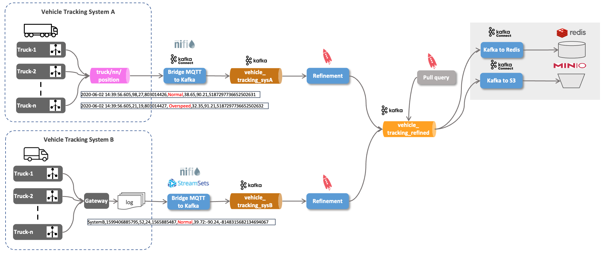
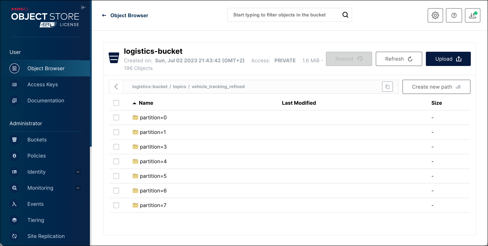
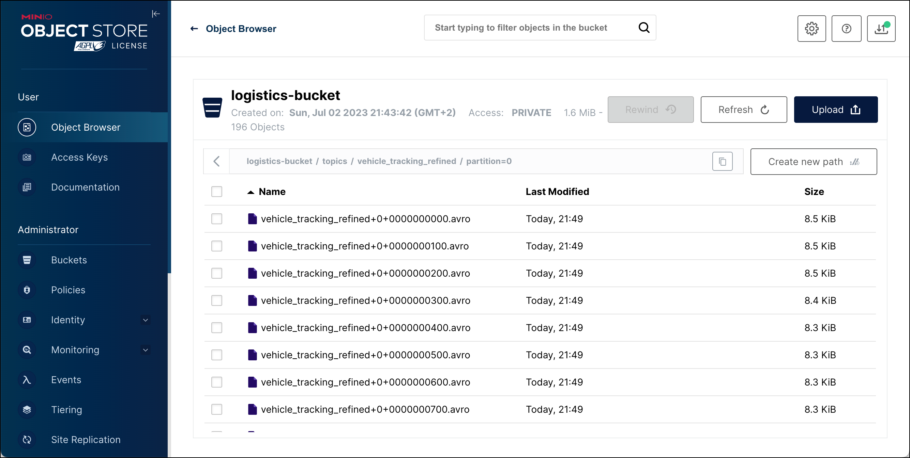

# Ingest IoT Vehicle Data - Using Kafka Connect to write data to Redis and Minio

So with the vehicle position data from both source systems normalized into the `vehicle_tracking_refined` topic we will use Kafka Connect to send the data to external data stores. 



We will first send the data into [Redis](http://redis.io), a very fast key-value store.

Then we will also store the data in [MinIO](https://min.io/), an Object Storage solution, but [Amazon S3](https://aws.amazon.com/s3/) or any other cloud Object Storage solution would work as well.

Both Redis and MinIO are available as part of the Data Platform. 

## Using Kafka Connect to write to Redis

For transporting messages from Reis to Kafka, in this workshop we will be using Kafka Connect. We could also use StreamSets or Apache NiFi to achieve the same result. 

Luckily, there are multiple Kafka Sink Connectors available for writing from Redis. We can either use the one provided by [Confluent Inc.](https://www.confluent.io/hub/jcustenborder/kafka-connect-redis) (which is part of Confluent Enterprise but available as evaluation license on Confluent Hub) or the one provided by Redis Inc., which is free to use [Redis Kafka Connector (Source and Sink) by Redis](https://github.com/redis-field-engineering/redis-kafka-connect) available on GitHub. We will be using the later one here. It is already installed as part of the platform. 


### Configure the Redis Sink Connector

For creating an instance of the connector over the API, you can either use a REST client or the Linux `curl` command line utility, which should be available on the Docker host. Curl is what we are going to use here. 

Create a folder scripts (if it does not yet exist) and navigate into the folder. 


```bash
mkdir scripts
cd scripts
```

In the `scripts` folder, create a file `start-redis.sh` and add the code below.  

```bash
#!/bin/bash

echo "removing Redis Sink Connector"

curl -X "DELETE" "http://dataplatform:8083/connectors/redis-sink"

echo "creating Redis Sink Connector"

curl -X PUT \
  http://${DOCKER_HOST_IP}:8083/connectors/redis-sink/config \
  -H 'Content-Type: application/json' \
  -H 'Accept: application/json' \
  -d '{
    "connector.class": "com.redis.kafka.connect.RedisSinkConnector",
    "tasks.max": "1",
    "redis.uri": "redis://redis-1:6379",
    "redis.insecure": "true",
    "redis.password": "abc123!",
    "redis.command": "HSET",
    "topics": "vehicle_tracking_refined",
    "value.converter": "io.confluent.connect.avro.AvroConverter",
    "value.converter.schema.registry.url": "http://schema-registry-1:8081",
    "key.converter": "org.apache.kafka.connect.storage.StringConverter"
}'
```

The script first removes the Redis connector, if it does exists already and then creates it from scratch. 

Also create a separate script `stop-redis.sh` for stopping the connector with the following script:

```bash
#!/bin/bash

echo "removing Redis Sink Connector"

curl -X "DELETE" "http://${DOCKER_HOST_IP}:8083/connectors/redis-sink"
```

Make sure that the both scripts are executable

```bash
sudo chmod +x start-redis.sh
sudo chmod +x stop-redis.sh
```

### Start the Redis connector

Finally let's start the connector by running the `start-redis` script.

```bash
./scripts/start-redis.sh
```

The connector will receive the messages from the Kafka topic and write it to Redis, using the Kafka key as the key in Redis. We have opted for using the Hash data structure for the value (`"redis.command": "HSET"`). 

Let's see if we have values in Redis by using the Redis CLI


```bash
docker exec -ti redis-1 redis-cli
```

let's authenticate and then use the `KEYS *` command to get all keys

```bash
AUTH abc123!
KEYS *
```

We can see a key for each vehicle.

```bash
127.0.0.1:6379> KEYS *
 1) "vehicle_tracking_refined:\"46\""
 2) "vehicle_tracking_refined:\"18\""
 3) "vehicle_tracking_refined:\"25\""
 4) "vehicle_tracking_refined:80"
 5) "com.redis.kafka.connect.sink.offset.vehicle_tracking_refined.3"
 6) "vehicle_tracking_refined:\"11\""
 7) "vehicle_tracking_refined:\"16\""
 8) "vehicle_tracking_refined:\"29\""
 9) "vehicle_tracking_refined:\"45\""
10) "vehicle_tracking_refined:\"38\""
11) "com.redis.kafka.connect.sink.offset.vehicle_tracking_refined.7"
12) "com.redis.kafka.connect.sink.offset.vehicle_tracking_refined.0"
13) "com.redis.kafka.connect.sink.offset.vehicle_tracking_refined.4"
14) "vehicle_tracking_refined:97"
15) "vehicle_tracking_refined:69"
16) "vehicle_tracking_refined:74"
17) "vehicle_tracking_refined:\"30\""
18) "com.redis.kafka.connect.sink.offset.vehicle_tracking_refined.1"
19) "vehicle_tracking_refined:\"40\""
20) "vehicle_tracking_refined:51"
21) "vehicle_tracking_refined:\"14\""
22) "vehicle_tracking_refined:\"43\""
23) "vehicle_tracking_refined:90"
24) "vehicle_tracking_refined:\"20\""
25) "vehicle_tracking_refined:\"26\""
26) "com.redis.kafka.connect.sink.offset.vehicle_tracking_refined.6"
27) "com.redis.kafka.connect.sink.offset.vehicle_tracking_refined.5"
28) "vehicle_tracking_refined:\"33\""
29) "vehicle_tracking_refined:85"
30) "vehicle_tracking_refined:\"10\""
31) "vehicle_tracking_refined:60"
32) "vehicle_tracking_refined:\"35\""
33) "vehicle_tracking_refined:53"
```

Let's see the content for vehicle `53` using the `HGETALL` command

```bash
127.0.0.1:6379> HGETALL "vehicle_tracking_refined:53"
 1) "SOURCE"
 2) "Tracking_SysB"
 3) "TIMESTAMP"
 4) "1688321889262"
 5) "VEHICLEID"
 6) "53"
 7) "DRIVERID"
 8) "20"
 9) "ROUTEID"
10) "1090292248"
11) "EVENTTYPE"
12) "Unsafe following distance"
13) "LATITUDE"
14) "40.7"
15) "LONGITUDE"
16) "-89.52"
17) "CORRELATIONID"
18) "5823429444287523"
```

## Using Kafka Connect to write to Object Storage (MinIO)

The connector in Kafka Connect to work with S3 compliant object storage is the [Confluent Kafka Connect S3](https://www.confluent.io/hub/confluentinc/kafka-connect-s3). It is part of the data platform.

```
curl -X "GET" "$DOCKER_HOST_IP:8083/connector-plugins" | jq
```

So all we have to do is create another script with the REST call to setup the connector. 

In the `scripts` folder, create a file `start-s3.sh` and add the code below.  

```
#!/bin/bash

echo "removing S3 Sink Connector"

curl -X "DELETE" "$DOCKER_HOST_IP:8083/connectors/s3-sink"

echo "creating Confluent S3 Sink Connector"

curl -X PUT \
  http://${DOCKER_HOST_IP}:8083/connectors/s3-sink/config \
  -H 'Content-Type: application/json' \
  -H 'Accept: application/json' \
  -d '{
      "connector.class": "io.confluent.connect.s3.S3SinkConnector",
      "partition.duration.ms": "3600000",
      "flush.size": "100",
      "topics": "vehicle_tracking_refined",
      "tasks.max": "1",
      "timezone": "UTC",
      "locale": "en",
      "partitioner.class": "io.confluent.connect.storage.partitioner.DefaultPartitioner",
      "schema.generator.class": "io.confluent.connect.storage.hive.schema.DefaultSchemaGenerator",
      "storage.class": "io.confluent.connect.s3.storage.S3Storage",
      "format.class": "io.confluent.connect.s3.format.avro.AvroFormat",
      "s3.region": "us-east-1",
      "s3.bucket.name": "logistics-bucket",
      "s3.part.size": "5242880",
      "store.url": "http://minio-1:9000",
      "value.converter": "io.confluent.connect.avro.AvroConverter",
      "value.converter.schema.registry.url": "http://schema-registry-1:8081",
      "key.converter": "org.apache.kafka.connect.storage.StringConverter"
  }
}'
```

We configure the connector to read the topic `vehicle_tracking_refined` and write messages to the bucket named `logistics-bucket`. 

Also create a separate script `stop-s3.sh` for just stopping the connector and add the following code:

```
#!/bin/bash

echo "removing S3 Sink Connector"

curl -X "DELETE" "$DOCKER_HOST_IP:8083/connectors/s3-sink"
```

Make sure that the both scripts are executable

```
sudo chmod +x start-s3.sh
sudo chmod +x stop-s3.sh
```

## Create the Bucket in Object Storage

Before we can start the script, we have to make sure that the bucket `logistics-bucket` exists in Object Storage. 

```bash
docker exec -ti minio-mc mc mb minio-1/logistics-bucket
```

## Start the S3 connector

Finally let's start the connector by running the `start-s3` script.

```
./scripts/start-s3.sh
```

You have to make sure that either the ingestion into `vehicle_tracking_refined` is still working or that you have existing messages in the topic `vehicle_tracking_refined`. 

As soon as the connector picks up messages, they should start to appear in the `logistics-bucket` bucket in MiniIO. 

You should see a new folder `topics` with a sub-folder `vehicle_tracking_refined` representing the topic and inside this folder there is another folder per partition. 



In each folder you will find multiple objects, all with some messages from Kafka. 



Let's see the content of one of the objects. We cannot do that directly from the MinIO UI, we have to first download it and then use a local editor. To download an object, select the object and then click on the **Download** action to the right.

The content of the object should be similar to the one shown below

```
Downloads % cat vehicle_tracking_refined+0+0000000000.avro
Objavro.schema�
               {"type":"record","name":"VehicleTrackingRefined","namespace":"com.trivadis.avro","fields":[{"name":"SOURCE","type":["null","string"],"default":null},{"name":"TIMESTAMP","type":["null","long"],"default":null},{"name":"VEHICLEID","type":["null","long"],"default":null},{"name":"DRIVERID","type":["null","long"],"default":null},{"name":"ROUTEID","type":["null","long"],"default":null},{"name":"EVENTTYPE","type":["null","string"],"default":null},{"name":"LATITUDE","type":["null","double"],"default":null},{"name":"LONGITUDE","type":["null","double"],"default":null},{"name":"CORRELATIONID","type":["null","string"],"default":null}],"connect.version":2,"connect.name":"com.trivadis.avro.VehicleTrackingRefined"}avro.codenull�O;O��f,Φ/[+���|Tracking_SysA����bP*����
                                                       Normal�G�z�D@{�G�V�&6906439778495426077Tracking_SysA����bP*����
                                                                                                                     Normal�z�GaD@�z�G1V�&6906439778495426077Tracking_SysA����bP*����
Normalq=
ף0D@{�G�JV�&6906439778495426077Tracking_SysA����bP*����
                                                      Normal�Q���C@���QhV�&6906439778495426077Tracking_SysA����bP*����
                                                                                                                     Normal����̌C@���(\oV�&6906439778495426077Tracking_SysA����bP*����
Normal33333SC@����̌V�&6906439778495426077Tracking_SysA���bP*����
ףp�D@�G�zV�&6906439778495426077Tracking_SysA�����bP*����
...
```

----
[previous part](../07e-iot-queryable-data/README.md)
| 	[top](../07-iot-data-ingestion-and-transformation/README.md) 
| 	[next part](../07g-static-data-ingestion/README.md)
