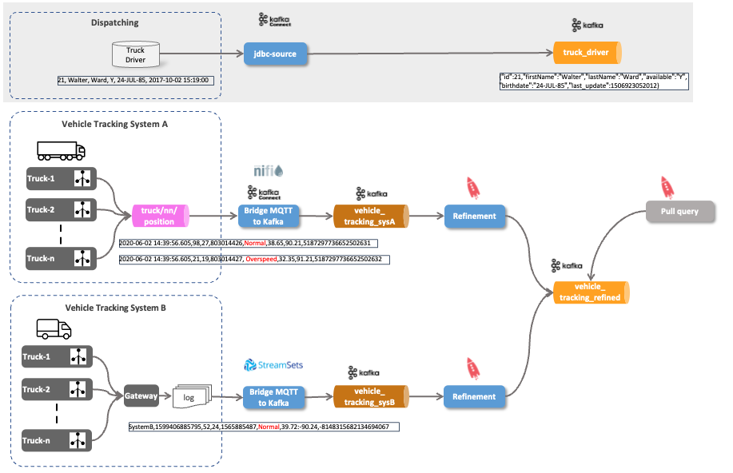

# Ingest IoT Vehicle Data - Ingesting Static Data to Stream

So far we have ingested the truck data from MQTT to Kafka. 

In this part of the workshop we will ingest information about the drivers into another Kafka topic which we will later use to enrich our IoT data stream using ksqlDB. 



## Create the `driver` table and load some data

The Data Platform contains PostgreSQL database service called `postgresql`, which we will use as the data store for the driver information.

Let's run a bash shell inside this docker container

```
docker exec -ti postgresql bash
```

and run the `psql` command line utility to connect to the Postgresql database as user `sample`.

```
psql -d demodb -U demo
```

Now let's first create the table `driver`

```
DROP TABLE driver;

CREATE TABLE driver (id BIGINT, first_name CHARACTER VARYING(45), last_name CHARACTER VARYING(45), available CHARACTER VARYING(1), birthdate DATE, last_update TIMESTAMP);

ALTER TABLE driver ADD CONSTRAINT driver_pk PRIMARY KEY (id);
```

and then add some driver data to the newly created table. 

```
INSERT INTO "driver" ("id", "first_name", "last_name", "available", "birthdate", "last_update") VALUES (10,'Diann', 'Butler', 'Y', '10-JUN-68', CURRENT_TIMESTAMP);
INSERT INTO "driver" ("id", "first_name", "last_name", "available", "birthdate", "last_update") VALUES (11,'Micky', 'Isaacson', 'Y', '31-AUG-72' ,CURRENT_TIMESTAMP);
INSERT INTO "driver" ("id", "first_name", "last_name", "available", "birthdate", "last_update") VALUES (12,'Laurence', 'Lindsey', 'Y', '19-MAY-78' ,CURRENT_TIMESTAMP);
INSERT INTO "driver" ("id", "first_name", "last_name", "available", "birthdate", "last_update") VALUES (13,'Pam', 'Harrington', 'Y','10-JUN-68' ,CURRENT_TIMESTAMP);
INSERT INTO "driver" ("id", "first_name", "last_name", "available", "birthdate", "last_update") VALUES (14,'Brooke', 'Ferguson', 'Y','10-DEC-66' ,CURRENT_TIMESTAMP);
INSERT INTO "driver" ("id", "first_name", "last_name", "available", "birthdate", "last_update") VALUES (15,'Clint','Hudson', 'Y','5-JUN-75' ,CURRENT_TIMESTAMP);
INSERT INTO "driver" ("id", "first_name", "last_name", "available", "birthdate", "last_update") VALUES (16,'Ben','Simpson', 'Y','11-SEP-74' ,CURRENT_TIMESTAMP);
INSERT INTO "driver" ("id", "first_name", "last_name", "available", "birthdate", "last_update") VALUES (17,'Frank','Bishop', 'Y','3-OCT-60' ,CURRENT_TIMESTAMP);
INSERT INTO "driver" ("id", "first_name", "last_name", "available", "birthdate", "last_update") VALUES (18,'Trevor','Hines', 'Y','23-FEB-78' ,CURRENT_TIMESTAMP);
INSERT INTO "driver" ("id", "first_name", "last_name", "available", "birthdate", "last_update") VALUES (19,'Christy','Stephens', 'Y','11-JAN-73' ,CURRENT_TIMESTAMP);
INSERT INTO "driver" ("id", "first_name", "last_name", "available", "birthdate", "last_update") VALUES (20,'Clarence','Lamb', 'Y','15-NOV-77' ,CURRENT_TIMESTAMP);
```

Keep this window open and connected to the datase, we will need it again later.
 
## Create a new Kafka topic truck_driver

Let's create a new topic `truck_driver`, which will hold the latest information for all the drivers. It's a compacted topic, so that only one version (the latest) per key will be kept. 

Perform the `kafka-topics --create` command to create the topic `truck_driver` and configure it to be a **log compacted** topic:

```
docker exec -ti kafka-1 kafka-topics --bootstrap-server kafka-1:19092--create --topic truck_driver --partitions 8 --replication-factor 2 --config cleanup.policy=compact --config segment.ms=100 --config delete.retention.ms=100 --config min.cleanable.dirty.ratio=0.001
```

Now let's create a consumer wich reads the new topic from the beginning. Because we will be producing Avro, we need to use the `kafka-avro-console-consumer` from the `schema-registry`. There is nothing shown so far, as we don't yet have any data available. 

```
docker exec -ti schema-registry-1 kafka-avro-console-consumer --bootstrap-server kafka-1:19092 --topic truck_driver --from-beginning
```

Keep it running, we will come back to it in a minute!

## Create a Kafka JDBC Connector to pull the driver data from PostgreSQL

To populate the `truck_driver` Kafka topic with the driver data, we use a Kafka Connect JDBC connector with Kafka Connect. 

It can be configured to gets all the data from the `driver` table and to publish it to the `truck_driver` topic. It not only gets the complete driver data once, it also gets updates to the driver data, while the connnector is constantly running.

Unlike the MQTT Connector we have used in [IoT Data Ingestion through MQTT into Kafka](../08-iot-data-ingestion-over-mqtt/README.md), the [Kafka Connect JDBC Connector](https://docs.confluent.io/current/connect/kafka-connect-jdbc/index.html) is already part of the Confuent Community Platform and by that part of the Data Platform, so we don't have to provision additional software in order to use it. 

Similar to the way we have configured and created the MQTT or Twitter connector, create a new file `start-jdbc.sh` in the `scripts` folder.
 
```
cd scripts
nano start-jdbc.sh
```

Add the following script logic to the file. 

```
#!/bin/bash

echo "removing JDBC Source Connector"

curl -X "DELETE" "http://dataplatform:28013/connectors/jdbc-source"

echo "creating JDBC Source Connector"

curl -X "POST" "$DOCKER_HOST_IP:8083/connectors" \
     -H "Content-Type: application/json" \
     -d $'{
  "name": "jdbc-driver-source",
  "config": {
    "connector.class": "JdbcSourceConnector",
    "tasks.max": "1",
    "connection.url":"jdbc:postgresql://postgresql/demodb?user=demo&password=abc123!",
    "mode": "timestamp",
    "timestamp.column.name":"last_update",
    "table.whitelist":"driver",
    "validate.non.null":"false",
    "topic.prefix":"truck_",
    "key.converter":"org.apache.kafka.connect.converters.LongConverter",
    "key.converter.schemas.enable": "false",
    "value.converter":"io.confluent.connect.avro.AvroConverter",
    "value.converter.schema.registry.url":"http://schema-registry-1:8081",
    "value.converter.schemas.enable": "false",
    "name": "jdbc-driver-source",
     "transforms":"createKey,extractInt",
     "transforms.createKey.type":"org.apache.kafka.connect.transforms.ValueToKey",
     "transforms.createKey.fields":"id",
     "transforms.extractInt.type":"org.apache.kafka.connect.transforms.ExtractField$Key",
     "transforms.extractInt.field":"id"
  }
}'
```

First make sure that the script is executable and then run it. 

```
sudo chmod +x configure-connect-jdbc.sh
./configure-connect-jdbc.sh
```

After a while you should see each record from the `driver` table appearing as a message on the `kafka-console-consumer` listening on the `truck_driver` topic. 

Go back to the PostgreSQL shell and some additional driver data:

```
INSERT INTO "driver" ("id", "first_name", "last_name", "available", "birthdate", "last_update") VALUES (21,'Lila', 'Page', 'Y', '5-APR-77', CURRENT_TIMESTAMP);
INSERT INTO "driver" ("id", "first_name", "last_name", "available", "birthdate", "last_update") VALUES (22,'Patricia', 'Coleman', 'Y', '11-AUG-80' ,CURRENT_TIMESTAMP);
INSERT INTO "driver" ("id", "first_name", "last_name", "available", "birthdate", "last_update") VALUES (23,'Jeremy', 'Olson', 'Y', '13-JUN-82', CURRENT_TIMESTAMP);
INSERT INTO "driver" ("id", "first_name", "last_name", "available", "birthdate", "last_update") VALUES (24,'Walter', 'Ward', 'Y', '24-JUL-85', CURRENT_TIMESTAMP);
INSERT INTO "driver" ("id", "first_name", "last_name", "available", "birthdate", "last_update") VALUES (25,'Kristen', ' Patterson', 'Y', '14-JUN-73', CURRENT_TIMESTAMP);
INSERT INTO "driver" ("id", "first_name", "last_name", "available", "birthdate", "last_update") VALUES (26,'Jacquelyn', 'Fletcher', 'Y', '24-AUG-85', CURRENT_TIMESTAMP);
INSERT INTO "driver" ("id", "first_name", "last_name", "available", "birthdate", "last_update") VALUES (27,'Walter', '  Leonard', 'Y', '12-SEP-88', CURRENT_TIMESTAMP);
INSERT INTO "driver" ("id", "first_name", "last_name", "available", "birthdate", "last_update") VALUES (28,'Della', ' Mcdonald', 'Y', '24-JUL-79', CURRENT_TIMESTAMP);
INSERT INTO "driver" ("id", "first_name", "last_name", "available", "birthdate", "last_update") VALUES (29,'Leah', 'Sutton', 'Y', '12-JUL-75', CURRENT_TIMESTAMP);
INSERT INTO "driver" ("id", "first_name", "last_name", "available", "birthdate", "last_update") VALUES (30,'Larry', 'Jensen', 'Y', '14-AUG-83', CURRENT_TIMESTAMP);
INSERT INTO "driver" ("id", "first_name", "last_name", "available", "birthdate", "last_update") VALUES (31,'Rosemarie', 'Ruiz', 'Y', '22-SEP-80', CURRENT_TIMESTAMP);
INSERT INTO "driver" ("id", "first_name", "last_name", "available", "birthdate", "last_update") VALUES (32,'Shaun', ' Marshall', 'Y', '22-JAN-85', CURRENT_TIMESTAMP);
```

The new records will also appear with almost no latency as messages in the `truck_driver` topic. 

Now let's see an update on some existing records: 

```
UPDATE "driver" SET "available" = 'N', "last_update" = CURRENT_TIMESTAMP  WHERE "id" = 21;
UPDATE "driver" SET "available" = 'N', "last_update" = CURRENT_TIMESTAMP  WHERE "id" = 14;
```

Again you should see the updates as new messages in the `truck_driver` topic. 

Now let's use the driver data to enrich the `dangerous_driving_s` stream from workshop [Stream Processing using KSQL](../09-stream-processing-using-ksql/README.md). For that we again have to provide some structure to the `truck_driver` topic, so that we can use it in a ksqlDB `SELECT ... JOIN ...` query.

## Create a ksqlDB table

Connect again to the ksqlDB CLI 

```
docker exec -it ksqldb-cli ksql http://ksqldb-server-1:8088
```

and create the table over the `truck_driver` topic. It will hold the latest state of all the drivers:

```
set 'commit.interval.ms'='5000';
set 'cache.max.bytes.buffering'='10000000';
set 'auto.offset.reset'='earliest';

DROP TABLE driver_t;

CREATE TABLE driver_t (id BIGINT PRIMARY KEY,
   first_name VARCHAR,  
   last_name VARCHAR,  
   available VARCHAR, 
   birthdate VARCHAR)  
  WITH (kafka_topic='truck_driver', 
        value_format='AVRO');
```

Let's see the data the table contains by using a SELECT on the table created above:

```
SELECT * FROM driver_t
EMIT CHANGES; 
```

This is also a continous query statement, but there is no data being shown. Why is that, shouldn't there be data in the `truck_topic`, as we have seen in the console consumer. The reason why we don't see any data is because the query starts at the end of the topic, waiting for new data to arrive. If we perform another update on the source (the PostgreSQL table), keeping the ksqldb select running

```
UPDATE "driver" SET "available" = 'N', "last_update" = CURRENT_TIMESTAMP  WHERE "id" = 27;
```

then after a short while we should see the change appear as a result of the SELECT on the table. The reason why there is some latency is the polling interval on the JDBC connector. 

There is also way to force reading from the beginning, by setting the following values before the SELECT itself. 

```
set 'commit.interval.ms'='5000';
set 'cache.max.bytes.buffering'='10000000';
set 'auto.offset.reset'='earliest';

SELECT * FROM driver_t
EMIT CHANGES;
```

The result of that table will only show each driver once, always with the latest information. Cross-check that the available flag is set to "N" for the driver with id 21 (because of the update we did above). 

if you perform another `UPDATE` on the table, setting the `available` flag back to `Y`

```
UPDATE "driver" SET "available" = 'Y', "last_update" = CURRENT_TIMESTAMP  WHERE "id" = 21;
```

then you will see a new message appearing in the result of the KSQL SELECT. This shows that a table contains the current view of information for all the drivers as well as it informs about changes on the driver while the statement is running. 

With that table at hand, let's join it to the data stream we get from the vehicles. 

----

[previous part](../07e-iot-queryable-data/README.md)	| 	[top](../07-iot-data-ingestion-and-analytics/README.md) 
