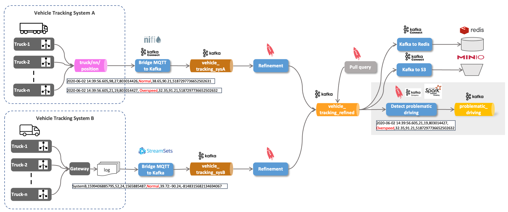

# IoT Vehicle Data - Stream Analytics using ksqlDB

With the truck data continuously ingested into the `truck_position` topic, let's now perform some stream processing on the data.
 
There are many possible solutions for performing analytics directly on the event stream. From the Kafka ecosystem, we can either use Kafka Streams or ksqlDB, a SQL abstraction on top of Kafka Streams. For this workshop we will be using KSQL. 



We will use KSQL to detect drivers not driving around normally (detecting anomalies). 

## Optionally: Shortcutting previous steps (t.b.d - does not work like that)

If you have not yet done the [previous part](../05b-iot-data-ingestion-mqtt-to-kafka/README.md), or it is no longer available, then you can also configure the IoT Truck Simulator to directly produce to Kafka, by running the following command:

```
docker exec -ti kafka-1 kafka-topics --bootstrap-server kafka-1:19092 --create --topic truck_position --partitions 8 --replication-factor 3

docker run --network streaming-platform trivadis/iot-truck-simulator '-s' 'KAFKA' '-h' 'kafka-1' '-p' '19092' '-f' 'CSV'
``` 

## Connect to ksqlDB engine
 
Let's connect to the ksqlDB shell

``` bash
docker exec -it ksqldb-cli ksql http://ksqldb-server-1:8088
```

and you should see the ksqlDB "welcome page":

```
                  ===========================================
                  =       _              _ ____  ____       =
                  =      | | _____  __ _| |  _ \| __ )      =
                  =      | |/ / __|/ _` | | | | |  _ \      =
                  =      |   <\__ \ (_| | | |_| | |_) |     =
                  =      |_|\_\___/\__, |_|____/|____/      =
                  =                   |_|                   =
                  =  Event Streaming Database purpose-built =
                  =        for stream processing apps       =
                  ===========================================

Copyright 2017-2020 Confluent Inc.

CLI v0.9.0, Server v0.9.0 located at http://ksqldb-server-1:8088

Having trouble? Type 'help' (case-insensitive) for a rundown of how things work!
```

## Investigating driver behaviour using ksqlDB

With the data from both system integrated into the `vehicle_tracking_refined` topic and available as the stream `vehicle_tracking_refined_s` , let's work with it!

First let's revist the streaming data on the  `vehicle_tracking_refined_s` stream:

```ksql
ksql> select * from vehicle_tracking_refined_s EMIT CHANGES LIMIT 10;
+-------------+-------------+-------------+-------------+-------------+-------------+-------------+-------------+-------------+-------------+
|ROWKEY       |SOURCE       |TIMESTAMP    |VEHICLEID    |DRIVERID     |ROUTEID      |EVENTTYPE    |LATITUDE     |LONGITUDE    |CORRELATIONID|
+-------------+-------------+-------------+-------------+-------------+-------------+-------------+-------------+-------------+-------------+
|"29"         |Tracking_SysA|1688386456801|29           |25           |160779139    |Normal       |41.11        |-88.42       |9221847540415|
|             |             |             |             |             |             |             |             |             |582109       |
|"23"         |Tracking_SysA|1688386456822|23           |31           |137128276    |Normal       |37.16        |-94.46       |9221847540415|
|             |             |             |             |             |             |             |             |             |582109       |
|"18"         |Tracking_SysA|1688386457242|18           |27           |24929475     |Normal       |38.43        |-90.35       |9221847540415|
|             |             |             |             |             |             |             |             |             |582109       |
|"13"         |Tracking_SysA|1688386457641|13           |23           |1962261785   |Normal       |38.94        |-91.74       |9221847540415|
|             |             |             |             |             |             |             |             |             |582109       |
|"40"         |Tracking_SysA|1688386458501|40           |20           |160779139    |Normal       |41.56        |-90.64       |9221847540415|
|             |             |             |             |             |             |             |             |             |582109       |
|"15"         |Tracking_SysA|1688386458761|15           |21           |1090292248   |Normal       |41.72        |-91.63       |9221847540415|
|             |             |             |             |             |             |             |             |             |582109       |
|"14"         |Tracking_SysA|1688386459402|14           |29           |1567254452   |Normal       |41.72        |-91.63       |9221847540415|
|             |             |             |             |             |             |             |             |             |582109       |
|"32"         |Tracking_SysA|1688386459562|32           |18           |1594289134   |Normal       |39.72        |-90.97       |9221847540415|
|             |             |             |             |             |             |             |             |             |582109       |
|"24"         |Tracking_SysA|1688386459621|24           |10           |803014426    |Normal       |37.99        |-91.69       |9221847540415|
|             |             |             |             |             |             |             |             |             |582109       |
|"11"         |Tracking_SysA|1688386459892|11           |15           |1594289134   |Normal       |34.78        |-92.31       |9221847540415|
|             |             |             |             |             |             |             |             |             |582109       |
Limit Reached
Query terminated
ksql>
```

From this sample, it looks like all the messages have an `eventType` set to `Normal`, which would be good. But is this really the case? 

Using SQL like semantics, we can easily tell ksqlDB, that we are only interested in the messages where the `eventType` is set to a value other than `Normal`:

``` sql
SELECT * FROM vehicle_tracking_refined_s 
WHERE eventType != 'Normal'
EMIT CHANGES;
```

Now we have to wait much longer until we get some data, as we don't have that many anomalies.
But after a while, the first occurrences should show up

```sql
ksql> SELECT * FROM vehicle_tracking_refined_s
>WHERE eventType != 'Normal'
>EMIT CHANGES;
+-------------+-------------+-------------+-------------+-------------+-------------+-------------+-------------+-------------+-------------+
|ROWKEY       |SOURCE       |TIMESTAMP    |VEHICLEID    |DRIVERID     |ROUTEID      |EVENTTYPE    |LATITUDE     |LONGITUDE    |CORRELATIONID|
+-------------+-------------+-------------+-------------+-------------+-------------+-------------+-------------+-------------+-------------+
|"15"         |Tracking_SysA|1688386940991|15           |21           |1090292248   |Lane Departur|40.38        |-89.17       |9221847540415|
|             |             |             |             |             |             |e            |             |             |582109       |
|"23"         |Tracking_SysA|1688386948861|23           |31           |137128276    |Lane Departur|39.72        |-90.24       |9221847540415|
|             |             |             |             |             |             |e            |             |             |582109       |
|"24"         |Tracking_SysA|1688386951972|24           |10           |803014426    |Unsafe follow|37.51        |-92.89       |9221847540415|
|             |             |             |             |             |             |ing distance |             |             |582109       |

Press CTRL-C to interrupt
```

This is interesting data, but just **seeing it in the KSQL terminal** is of **limited value**. We would like to have that information available as a new Kafka topic, so we can further process it using KSQL or allow other subscriber to work with that information.  

## Using ksqlDB to constantly publish results to a new topic 

Let's use ksqlDB to publish the information from above to a new Kafka topic. For that we can create a new Stream. Instead of creating it on an existing topic as we have done before, we use the `CREATE STREAM ... AS SELECT ...` variant. 

```sql
DROP STREAM problematic_driving_s;

CREATE STREAM IF NOT EXISTS problematic_driving_s
  WITH (kafka_topic='problematic_driving',
        value_format='AVRO',
        partitions=8)
AS 
SELECT * 
FROM vehicle_tracking_refined_s
WHERE eventtype != 'Normal';
```

The `SELECT` statement inside is basically the statement we have tested before and we know it will create the right information. 

In this case there is no longer an output shown on ksqlDB. We get a message that a new query has been created, which runs in the background:

```sql
ksql> CREATE STREAM IF NOT EXISTS problematic_driving_s
>  WITH (kafka_topic='problematic_driving',
>        value_format='AVRO',
>        partitions=8)
>AS
>SELECT *
>FROM vehicle_tracking_refined_s
>WHERE eventtype != 'Normal';

 Message
-----------------------------------------------------
 Created query with ID CSAS_PROBLEMATIC_DRIVING_S_39
-----------------------------------------------------
ksql>
```

We can use a `DESCRIBE` command to see metadata of any stream: 

```
DESCRIBE problematic_driving_s;        
```

which should return an output similar to the one shown below:

```
ksql> DESCRIBE problematic_driving_s;

Name                 : PROBLEMATIC_DRIVING_S
 Field         | Type
----------------------------------------
 ROWKEY        | VARCHAR(STRING)  (key)
 SOURCE        | VARCHAR(STRING)
 TIMESTAMP     | BIGINT
 VEHICLEID     | BIGINT
 DRIVERID      | BIGINT
 ROUTEID       | BIGINT
 EVENTTYPE     | VARCHAR(STRING)
 LATITUDE      | DOUBLE
 LONGITUDE     | DOUBLE
 CORRELATIONID | VARCHAR(STRING)
----------------------------------------
For runtime statistics and query details run: DESCRIBE <Stream,Table> EXTENDED;
```

Now it's much easier to get the abnormal behaviour. All we have to do is selecting that new stream `problematic_driving_s`. 

```
SELECT * FROM problematic_driving_s
EMIT CHANGES;
```

This stream is backed by the Kafka topic `problematic_driving ` so we can also use any Kafka consumer to directly get the data from there. Let's see it by either using `kcat`

```
docker exec -ti kcat kcat -b kafka-1:19092 -t problematic_driving -q -s value=avro -r http://schema-registry-1:8081
```

We use the `-s` and `-r` option to make sure that the Avro data is properly displayed.

You should see the same abnormal driving behaviour data as before in the ksqlDB shell.        

----

[previous part](../07f-data-egestion-to-redis-and-minio/README.md)	| 	[top](../07-iot-data-ingestion-and-transformation/README.md) 	| 	[next part](../07h_stream-analytics-using-spark/README.md)
