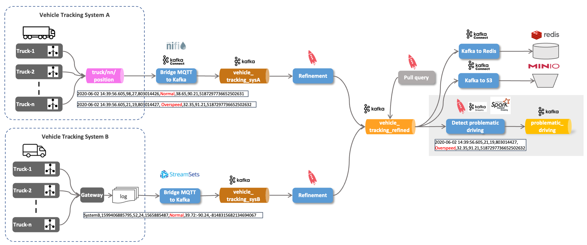
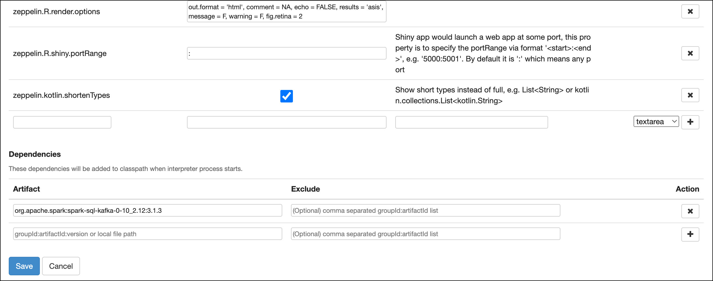

# IoT Vehicle Data - Stream Analytics using Spark Structured Streaming

With the truck data continuously ingested into the `truck_movement` topic, let's now perform some stream processing on the data.
 
There are many possible solutions for performing analytics directly on the event stream. From the Kafka ecosystem, we can either use Kafka Streams or ksqlDB, a SQL abstraction on top of Kafka Streams. For this workshop we will be using KSQL. 



The dataplatform does not contain a standalone Spark cluster. But for this workshop, we can use Spark which is part of Apache Zeppelin. 

## Setup Spark in Apache Zeppelin

Navigate to <http://dataplatform:28080> and login as user `admin` and password `abc123!`.

For Spark Structured Streaming to work with Apache Kafka, we have to [configure an additional dependency](https://spark.apache.org/docs/latest/structured-streaming-kafka-integration.html).

Click on the drop-down menu in the top right corner and select **Interpreter**. Navigate to the **Spark** interpreter and click **Edit**. 
Scroll down to the **Dependencies** and enter `org.apache.spark:spark-sql-kafka-0-10_2.12:3.1.3` into the **Artifact** field.



Click **Save** and confirm the **Do you want to update this interpreter and restart with new settings?** dialog with **OK**. 

## Using Python

Create a new note and select **Spark** as the default interpreter.

### Define Schema for truck_position events/messages

```python
%pyspark
from pyspark.sql.types import *

vehicleTrackingSchema = StructType().add("timestamp", TimestampType()).add("truckId",LongType()).add("driverId", LongType()).add("routeId", LongType()).add("eventType", StringType()).add("latitude", DoubleType()).add("longitude", DoubleType()).add("correlationId", StringType()) 
```

### Kafka Consumer

```python
rawDf = spark
  .readStream
  .format("kafka")
  .option("kafka.bootstrap.servers", "kafka-1:19092,kafka-2:19093")
  .option("subscribe", "vehicle_tracking_sysA")
  .load()
```

### Show the schema of the raw Kafka message

```python
rawDf.printSchema
```

### Map to "vehicle_tracking_sysA" schema and extract event time (trunc to seconds) 

```python
%pyspark
from pyspark.sql.functions import from_json

jsonDf = rawDf.selectExpr("CAST(value AS string)")
jsonDf = jsonDf.select(from_json(jsonDf.value, vehicleTrackingSchema).alias("json")).selectExpr("json.*", "cast(cast (json.timestamp as double) / 1000 as timestamp) as eventTime")
```

### Show schema of data frame

```python
%pyspark
jsonDf.printSchema
```

### Run 1st query into in memory "table"

```python
%pyspark
query1 = jsonDf.writeStream.format("memory").queryName("vehicle_tracking").start()
```

### Using Spark SQL to read from the in-memory "table"

```python
%pyspark
spark.sql ("select * from vehicle_tracking").show()
```

or in Zeppelin using the %sql directive

```sql
%sql
select * from vehicle_tracking

```

### Stop the query

```python
%pyspark
query1.stop()
```

### Filter out normal events

```python
%pyspark
jsonDf.printSchema
jsonFilteredDf = jsonDf.where("json.eventType !='Normal'")
```

### Run 2nd query on filtered data into in memory "table"

```python
%pyspark
query2 = jsonFilteredDf.writeStream.format("memory").queryName("filtered_vehicle_tracking").start()
```

### Use Spark SQL

```python
%pyspark
spark.sql ("select * from filtered_vehicle_tracking").show()  
```

### Stop 2nd query

```python
%pyspark
query2.stop
```

### Run 3rd query - Write non-normal events to Kafka topic

Create a new topic

```
docker exec -ti kafka-1 kafka-topics --create --bootstrap-server kafka-1:19092 --topic problematic_driving_spark --partitions 8 --replication-factor 3
```

```python
%pyspark
query3 = jsonFilteredDf.selectExpr("to_json(struct(*)) AS value").writeStream.format("kafka").option("kafka.bootstrap.servers", "kafka-1:19092").option("topic","problematic_driving_spark").option("checkpointLocation", "/tmp").start()    
```

### Stop 3rd query

```python
query3.stop
```

### Retrieve static driver information

```python
%pyspark
val opts = Map(
  "url" -> "jdbc:postgresql://postgresql/sample?user=sample&password=sample",
  "driver" -> "org.postgresql.Driver",
  "dbtable" -> "driver")
driverRawDf = spark.read.format("jdbc").options(opts).load()  
driverDf = driverRawDf.selectExpr("id as driverId", "first_name as firstName", "last_name as lastName")
```


## Using Scala

### Define the Schema

```scala
import org.apache.spark.sql.types.StructType
import org.apache.spark.sql.types.StringType
import org.apache.spark.sql.types.DoubleType
import org.apache.spark.sql.types.LongType
import org.apache.spark.sql.types.TimestampType

val vehicleTrackingSchema = new StructType() 
  .add("timestamp",  TimestampType) 
  .add("truckId", LongType) 
  .add("driverId", LongType) 
  .add("routeId", LongType) 
  .add("eventType", StringType) 
  .add("latitude", DoubleType) 
  .add("longitude", DoubleType) 
  .add("correlationId", StringType) 
```

```scala
val rawDf = spark
  .readStream
  .format("kafka")
  .option("kafka.bootstrap.servers", "kafka-1:19092,kafka-2:19093")
  .option("subscribe", "vehicle_tracking_sysA")
  .load()
```

----

[previous part](../07g-stream-analytics-using-ksql/README.md)	| 	[top](../07-iot-data-ingestion-and-transformation/README.md) 	| 	[next part](../07i-static-data-ingestion-and-join/README.md)
