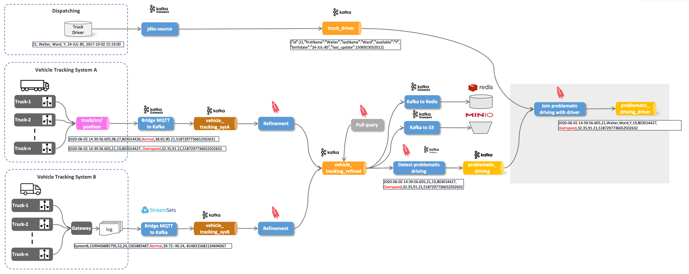

# IoT Vehicle Data - Joining Static Data to Stream

In this part of the workshop, we are integrating the `driver` information from the Dispatching system into a Kafka topic, so it is available for enrichments of data streams. The enrichment will be done using the ksql functionality for joining a stream with a table (static information). 



We will use the Kafka Connect [JDBC Source Connector](https://www.confluent.io/hub/confluentinc/kafka-connect-jdbc) for periodically retrieving the data from the database table and publish it to the Kafka topic `logisticsdb_driver`. The connector is pre-installed as part of the dataplatform.

Instead of configuring the connector through the REST API, as we have seen before with the MQTT connector, we will use the ksqlDB integration with the [CREATE CONNECTOR](https://docs.ksqldb.io/en/latest/developer-guide/ksqldb-reference/create-connector/) command.

## Create the `driver` table and load some data

The Data Platform contains PostgreSQL database service called `postgresql`, which we will use as the data store for the driver information.

Let's run the `psql` command line utility inside the `postgresql` docker container to connect to the Postgresql database as user `sample`.

```
docker exec -ti postgresql psql -d demodb -U demo
```

Now let's first create the table `driver`

```
CREATE SCHEMA IF NOT EXISTS dispatching_db;
SET search_path TO dispatching_db;

DROP TABLE driver;

CREATE TABLE driver (id BIGINT, first_name CHARACTER VARYING(45), last_name CHARACTER VARYING(45), available CHARACTER VARYING(1), birthdate DATE, last_update TIMESTAMP);

ALTER TABLE driver ADD CONSTRAINT driver_pk PRIMARY KEY (id);
```

and then add some driver data to the newly created table. 

```
INSERT INTO "driver" ("id", "first_name", "last_name", "available", "birthdate", "last_update") VALUES (10,'Diann', 'Butler', 'Y', '10-JUN-68', CURRENT_TIMESTAMP);
INSERT INTO "driver" ("id", "first_name", "last_name", "available", "birthdate", "last_update") VALUES (11,'Micky', 'Isaacson', 'Y', '31-AUG-72' ,CURRENT_TIMESTAMP);
INSERT INTO "driver" ("id", "first_name", "last_name", "available", "birthdate", "last_update") VALUES (13,'Pam', 'Harrington', 'Y','10-JUN-68' ,CURRENT_TIMESTAMP);
INSERT INTO "driver" ("id", "first_name", "last_name", "available", "birthdate", "last_update") VALUES (14,'Brooke', 'Ferguson', 'Y','10-DEC-66' ,CURRENT_TIMESTAMP);
INSERT INTO "driver" ("id", "first_name", "last_name", "available", "birthdate", "last_update") VALUES (15,'Clint','Hudson', 'Y','5-JUN-75' ,CURRENT_TIMESTAMP);
INSERT INTO "driver" ("id", "first_name", "last_name", "available", "birthdate", "last_update") VALUES (16,'Ben','Simpson', 'Y','11-SEP-74' ,CURRENT_TIMESTAMP);
INSERT INTO "driver" ("id", "first_name", "last_name", "available", "birthdate", "last_update") VALUES (17,'Frank','Bishop', 'Y','3-OCT-60' ,CURRENT_TIMESTAMP);
INSERT INTO "driver" ("id", "first_name", "last_name", "available", "birthdate", "last_update") VALUES (18,'Trevor','Hines', 'Y','23-FEB-78' ,CURRENT_TIMESTAMP);
INSERT INTO "driver" ("id", "first_name", "last_name", "available", "birthdate", "last_update") VALUES (19,'Christy','Stephens', 'Y','11-JAN-73' ,CURRENT_TIMESTAMP);
INSERT INTO "driver" ("id", "first_name", "last_name", "available", "birthdate", "last_update") VALUES (20,'Clarence','Lamb', 'Y','15-NOV-77' ,CURRENT_TIMESTAMP);
```

Keep this window open and connected to the database, we will need it again later.
 
## Create a new Kafka topic truck_driver

Let's create a new topic `dispatching_driver`, which will hold the latest information for all the drivers. It's a compacted topic, so that only one version (the latest) per key will be kept. 

Perform the `kafka-topics --create` command to create the topic `dispatching_driver` and configure it to be a **log compacted** topic:

First let's create the Kafka topic `dispatching_driver`.

```bash
docker exec -it kafka-1 kafka-topics --bootstrap-server kafka-1:19092 --create --topic dispatching_driver --partitions 8 --replication-factor 3 --config cleanup.policy=compact --config segment.ms=100 --config delete.retention.ms=100 --config min.cleanable.dirty.ratio=0.001
```

Now let's create a consumer wich reads the new topic from the beginning

```bash
docker exec -ti kcat kcat -b kafka-1:19092 -t dispatching_driver -s value=avro -r http://schema-registry-1:8081 -q
```

Keep it running, we will come back to it in a minute!

## Create a Kafka JDBC Connector to pull the driver data from PostgreSQL

To populate the `dispatching_driver` Kafka topic with the driver data, we use a Kafka Connect JDBC connector with Kafka Connect. 

It can be configured to gets all the data from the `driver` table and to publish it to the `truck_driver` topic. It not only gets the complete driver data once, it also gets updates to the driver data, while the connector is constantly running.

Instead of configuring the connector through the REST API, as we have seen before with the MQTT connector, we will use the ksqlDB integration with the [CREATE CONNECTOR](https://docs.ksqldb.io/en/latest/developer-guide/ksqldb-reference/create-connector/) command.

Connect to the ksqlDB CLI 

```
docker exec -it ksqldb-cli ksql http://ksqldb-server-1:8088
```

and perform the [CREATE CONNECTOR](https://docs.ksqldb.io/en/latest/developer-guide/ksqldb-reference/create-connector/) command.

 
``` sql
CREATE SOURCE CONNECTOR jdbc_to_kafka_sc WITH (
    "connector.class"='io.confluent.connect.jdbc.JdbcSourceConnector',
    "tasks.max" = '1',
    "connection.url" = 'jdbc:postgresql://postgresql/demodb?user=demo&password=abc123!',
    "mode" = 'timestamp',
    "timestamp.column.name" = 'last_update',
    "schema.pattern" = 'dispatching_db',
    "table.whitelist" = 'driver',
    "validate.non.null" = 'false',
    "topic.prefix" = 'dispatching_',
    "poll.interval.ms" = '10000',
    "key.converter" = 'org.apache.kafka.connect.converters.LongConverter',
    "key.converter.schemas.enable" = 'false',
    "value.converter" = 'io.confluent.connect.avro.AvroConverter',
    "value.converter.schema.registry.url" = 'http://schema-registry-1:8081',
    "value.converter.schemas.enable" = 'false',
    "transforms" = 'createKey,extractInt',
    "transforms.createKey.type" = 'org.apache.kafka.connect.transforms.ValueToKey',
    "transforms.createKey.fields" = 'id',
    "transforms.extractInt.type" = 'org.apache.kafka.connect.transforms.ExtractField$Key',
    "transforms.extractInt.field" = 'id'
    );
```

After a while you should see each record from the `driver` table appearing as a message on the `kcat` listening on the `dispatching_driver` topic. 

Go back to the PostgreSQL shell and some additional driver data:

```
INSERT INTO "driver" ("id", "first_name", "last_name", "available", "birthdate", "last_update") VALUES (21,'Lila', 'Page', 'Y', '5-APR-77', CURRENT_TIMESTAMP);
INSERT INTO "driver" ("id", "first_name", "last_name", "available", "birthdate", "last_update") VALUES (22,'Patricia', 'Coleman', 'Y', '11-AUG-80' ,CURRENT_TIMESTAMP);
INSERT INTO "driver" ("id", "first_name", "last_name", "available", "birthdate", "last_update") VALUES (23,'Jeremy', 'Olson', 'Y', '13-JUN-82', CURRENT_TIMESTAMP);
INSERT INTO "driver" ("id", "first_name", "last_name", "available", "birthdate", "last_update") VALUES (24,'Walter', 'Ward', 'Y', '24-JUL-85', CURRENT_TIMESTAMP);
INSERT INTO "driver" ("id", "first_name", "last_name", "available", "birthdate", "last_update") VALUES (25,'Kristen', ' Patterson', 'Y', '14-JUN-73', CURRENT_TIMESTAMP);
INSERT INTO "driver" ("id", "first_name", "last_name", "available", "birthdate", "last_update") VALUES (26,'Jacquelyn', 'Fletcher', 'Y', '24-AUG-85', CURRENT_TIMESTAMP);
INSERT INTO "driver" ("id", "first_name", "last_name", "available", "birthdate", "last_update") VALUES (27,'Walter', '  Leonard', 'Y', '12-SEP-88', CURRENT_TIMESTAMP);
INSERT INTO "driver" ("id", "first_name", "last_name", "available", "birthdate", "last_update") VALUES (28,'Della', ' Mcdonald', 'Y', '24-JUL-79', CURRENT_TIMESTAMP);
INSERT INTO "driver" ("id", "first_name", "last_name", "available", "birthdate", "last_update") VALUES (29,'Leah', 'Sutton', 'Y', '12-JUL-75', CURRENT_TIMESTAMP);
INSERT INTO "driver" ("id", "first_name", "last_name", "available", "birthdate", "last_update") VALUES (30,'Larry', 'Jensen', 'Y', '14-AUG-83', CURRENT_TIMESTAMP);
INSERT INTO "driver" ("id", "first_name", "last_name", "available", "birthdate", "last_update") VALUES (31,'Rosemarie', 'Ruiz', 'Y', '22-SEP-80', CURRENT_TIMESTAMP);
INSERT INTO "driver" ("id", "first_name", "last_name", "available", "birthdate", "last_update") VALUES (32,'Shaun', ' Marshall', 'Y', '22-JAN-85', CURRENT_TIMESTAMP);
```

The new records will also appear with almost no latency as messages in the `dispatching_driver` topic. 

Now let's see an update on some existing records: 

```sql
UPDATE "driver" SET "available" = 'N', "last_update" = CURRENT_TIMESTAMP  WHERE "id" = 21;
UPDATE "driver" SET "available" = 'N', "last_update" = CURRENT_TIMESTAMP  WHERE "id" = 14;
```

Again you should see the updates as new messages in the `dispatching_driver` topic. 

Now let's use the driver data to enrich the `problematic_driving_s` stream from workshop [Stream Analytics using KSQL](../07g-stream-analytics-using-ksql/README.md). For that we again have to provide some structure to the `dispatching_driver` topic, so that we can use it in a ksqlDB `SELECT ... JOIN ...` query.

## Create the ksqlDB driver table

Connect again to the ksqlDB CLI 

```bash
docker exec -it ksqldb-cli ksql http://ksqldb-server-1:8088
```

and create the table over the `truck_driver` topic. It will hold the latest state of all the drivers:

```sql
set 'commit.interval.ms'='5000';
set 'cache.max.bytes.buffering'='10000000';
set 'auto.offset.reset'='earliest';

CREATE TABLE driver_t (id BIGINT PRIMARY KEY,
   first_name VARCHAR,  
   last_name VARCHAR,  
   available VARCHAR, 
   birthdate VARCHAR)  
  WITH (kafka_topic='dispatching_driver', 
        value_format='AVRO');
```

Let's see the data the table contains by using a SELECT on the table created above:

```sql
SELECT * FROM driver_t
EMIT CHANGES; 
```

we should get the following output

```
ksql> SELECT * FROM driver_t
>EMIT CHANGES;
+---------------------------+---------------------------+---------------------------+---------------------------+---------------------------+
|ID                         |FIRST_NAME                 |LAST_NAME                  |AVAILABLE                  |BIRTHDATE                  |
+---------------------------+---------------------------+---------------------------+---------------------------+---------------------------+
|20                         |Clarence                   |Lamb                       |Y                          |2875                       |
|17                         |Frank                      |Bishop                     |Y                          |33148                      |
|21                         |Lila                       |Page                       |Y                          |2651                       |
|25                         |Kristen                    | Patterson                 |Y                          |1260                       |
|30                         |Larry                      |Jensen                     |Y                          |4973                       |
|21                         |Lila                       |Page                       |N                          |2651                       |
|28                         |Della                      | Mcdonald                  |Y                          |3491                       |
|31                         |Rosemarie                  |Ruiz                       |Y                          |3917                       |
|24                         |Walter                     |Ward                       |Y                          |5683                       |
|26                         |Jacquelyn                  |Fletcher                   |Y                          |5714                       |
|18                         |Trevor                     |Hines                      |Y                          |2975                       |
|19                         |Christy                    |Stephens                   |Y                          |1106                       |
|11                         |Micky                      |Isaacson                   |Y                          |973                        |
|13                         |Pam                        |Harrington                 |Y                          |35955                      |
|15                         |Clint                      |Hudson                     |Y                          |1981                       |
|10                         |Diann                      |Butler                     |Y                          |35955                      |
|14                         |Brooke                     |Ferguson                   |Y                          |35407                      |
|16                         |Ben                        |Simpson                    |Y                          |1714                       |
|23                         |Jeremy                     |Olson                      |Y                          |4546                       |
|29                         |Leah                       |Sutton                     |Y                          |2018                       |
|27                         |Walter                     |  Leonard                  |Y                          |6829                       |
|32                         |Shaun                      | Marshall                  |Y                          |5500                       |
|14                         |Brooke                     |Ferguson                   |N                          |35407                      |
|22                         |Patricia                   |Coleman                    |Y                          |3875                       |

Press CTRL-C to interrupt
```

While keeping the select running, let's revert the two update we have done before in the Postgresql database. The two drivers are available now:

```sql
UPDATE "driver" SET "available" = 'Y', "last_update" = CURRENT_TIMESTAMP  WHERE "id" = 21;
UPDATE "driver" SET "available" = 'Y', "last_update" = CURRENT_TIMESTAMP  WHERE "id" = 14;
```

You should will see two new message appearing at the end of the result of the KSQL SELECT. This shows that a table contains the current view of information for all the drivers as well as it informs about changes on the driver while the statement is running. 

With that table at hand, let's join it to the data stream we get from the vehicles. 

## Join the vehicle stream with the driver table

Now with the ksqlDB table in place, let's join it with the `problematic_driving_s` ksqlDB stream to enrich it with driver information available in the `driver_t` table (first_name, last_name and availability):

```sql
SELECT pd.driverId, d.first_name, d.last_name, d.available, pd.vehicleId, pd.routeId, pd.eventType 
FROM problematic_driving_s 	pd
LEFT JOIN driver_t 				d
ON pd.driverId  = d.id
EMIT CHANGES;
```

We can see that the join looks like it has been taken from an RDBMS-based system. The enriched stream can be seen appearing in live on the ksqlDB CLI.

```sql
+---------------+---------------+---------------+---------------+---------------+---------------+---------------+
|DRIVERID       |FIRST_NAME     |LAST_NAME      |AVAILABLE      |VEHICLEID      |ROUTEID        |EVENTTYPE      |
+---------------+---------------+---------------+---------------+---------------+---------------+---------------+
|11             |Micky          |Isaacson       |Y              |11             |160405074      |Lane Departure |
|11             |Micky          |Isaacson       |Y              |11             |160405074      |Unsafe followin|
|               |               |               |               |               |               |g distance     |
|10             |Diann          |Butler         |Y              |44             |137128276      |Unsafe tail dis|
|               |               |               |               |               |               |tance          |
|21             |Lila           |Page           |Y             |17             |1594289134     |Unsafe followin|
|               |               |               |               |               |               |g distance     |
|12             |null           |null           |null           |68             |803014426      |Lane Departure |
|11             |Micky          |Isaacson       |N              |11             |160405074      |Lane Departure |
|11             |Micky          |Isaacson       |N              |11             |160405074      |Lane Departure |
Press CTRL-C to interrupt
```

If you get an anomaly for driver with id `12` we will see the left join in action. Because this driver does not exists, we will get a `null` value for `first_name`, `last_name` and `available`. 

Let's add driver `12` to the `driver` table. Postgresql database. 

```
docker exec -ti postgresql psql -d demodb -U demo
```

```sql
SET search_path TO dispatching_db;

INSERT INTO "driver" ("id", "first_name", "last_name", "available", "birthdate", "last_update") VALUES (12,'Laurence', 'Lindsey', 'Y', '19-MAY-78' ,CURRENT_TIMESTAMP);
```

Now the join will also show a value for this driver. You don't have to restart the ksqlDB Streaming query, the table will be updated automatically.


How can we make that enriched dataset (data stream) available in a more permanent fashion? We do that by creating a new Stream based on the SELECT statement just issued. Stop the query by entering `CTRL-C` and execute the following statement:


``` sql
DROP STREAM IF EXISTS problematic_driving_and_driver_s;
```

``` sql
CREATE STREAM IF NOT EXISTS problematic_driving_and_driver_s \
  WITH (kafka_topic='problematic_driving_and_driver', \
        value_format='AVRO', \
        partitions=8) \
AS 
SELECT pd.driverId, d.first_name, d.last_name, d.available, pd.vehicleId, pd.routeId, pd.eventType 
FROM problematic_driving_s 	pd
LEFT JOIN driver_t 				d
ON pd.driverId  = d.id;
```

we can use `kcat` to show the data stream in the newly created Kafka topic `problematic_driving_and_driver ` to show the enrichment in action:

``` bash
docker exec -ti kcat kcat -b kafka-1:19092 -t problematic_driving_and_driver -s value=avro -r http://schema-registry-1:8081
```


We can also see the refresh behaviour if we just generally change the `available` flag for all records in the `driver` table. 

```sql
UPDATE driver SET available = 'N', last_update = CURRENT_TIMESTAMP;
```

You should the effect of the update immediately with the next message produced into the `problematic_driving_and_driver` topic.


----

[previous part](../07h_stream-analytics-using-spark/README.md)	| 	[top](../07-iot-data-ingestion-and-analytics/README.md) 
	| 	[next part](../07j-aggregate-queries-with-ksql/README.md)