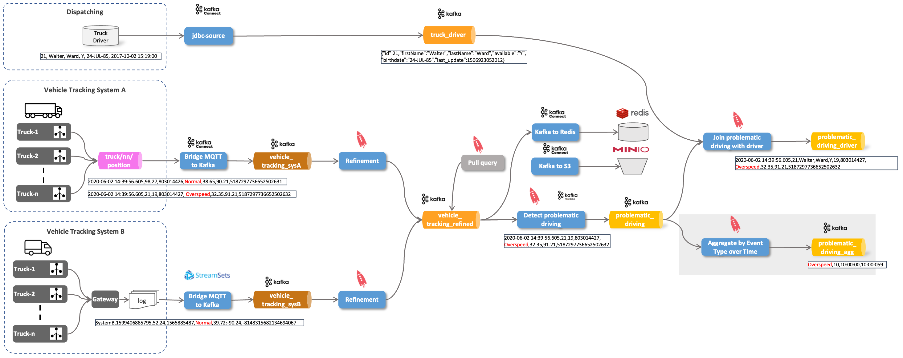

# IoT Vehicle Data - Aggregating over Time Window using ksqlDB

In this part of the workshop, we will show how to use aggregate functions over time windows using ksqlDB. 



## Perform some more advanced analytics on the stream

The first one is a tumbling window of 1 hour

``` sql
CREATE TABLE event_type_by_1hour_tumbl_t AS
SELECT windowstart AS winstart
	, windowend 	AS winend
	, eventType
	, count(*) 	AS nof 
FROM problematic_driving_s 
WINDOW TUMBLING (SIZE 60 minutes)
GROUP BY eventType
EMIT CHANGES;
```

The second one is a tumbling window of 1 hour with a slide of 30 minutes.

``` sql
CREATE TABLE event_type_by_1hour_hopp_t AS
SELECT windowstart AS winstart
	, windowend 	AS winend
	, eventType
	, count(*) 	AS nof 
FROM problematic_driving_s 
WINDOW HOPPING (SIZE 60 minutes, ADVANCE BY 30 minutes)
GROUP BY eventType;
```

If you are doing a select on the table, you can format the time elements of the time window as shown below

```
SELECT TIMESTAMPTOSTRING(WINDOWSTART,'yyyy-MM-dd HH:mm:SS','CET') wsf
, TIMESTAMPTOSTRING(WINDOWEND,'yyyy-MM-dd HH:mm:SS','CET') wef
, WINDOWSTART
, WINDOWEND
, eventType
, nof
FROM event_type_by_1hour_tumbl_t
EMIT CHANGES;
```


----

[previous part](../07i-static-data-ingestion-and-join/README.md)	| 	[top](../07-iot-data-ingestion-and-analytics/README.md) 
