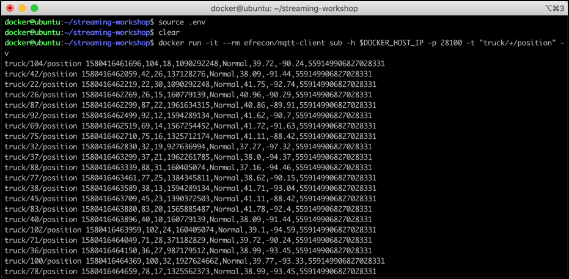

# IoT Data Ingestion through MQTT into Kafka

In this workshop we will be ingesting IoT data into Kakfa, so that it can be consumed using the Kafka console consumer, as a preparation for the next workshop. We will be using a fictitious Trucking company with a fleet of trucks constantly providing some data about the moving vehicles. 

But we will not send the data directly from the simulated vehicles to Kafka, we will sent them through MQTT first. This is a scenario which makes a lot of sense in real-live for various reasons such as security, connectivity, more lightweight connections and others. 

The following diagram shows the setup of the data flow we will be implementing. Of course we will not be using real-life data, but have a program simulating trucks and their driving behviour.


## MQTT broker of the Data Platform

The data platform we use for our workshop already runs a MQTT service.

We are using [Mosquitto](https://mosquitto.org/), an easy to use MQTT broker, belonging to the Eclipse project. Additionally also a browser-based UI is available, which we see in action later and which allows for consuming messages sent to the MQTT broker.

## Running the Truck Simulator to publish to MQTT

For simulating truck data, we are going to use a Java program (adapted from Hortonworks) and maintained in this [GitHub project](https://github.com/TrivadisBDS/various-bigdata-prototypes/tree/master/streaming-sources/iot-truck-simulator/impl). It can be started either using Maven or Docker. We will be using it as a Docker container.

The simulator can produce data to either **Kafka** or **MQTT**. For our workshop where, we will be using **MQTT** as the target. 

The MQTT broker is exposing port 28100. Running the simulator is as simple as running the `trivadis/iot-truck-simulator` docker image, providing some paramteters.

```
docker run trivadis/iot-truck-simulator '-s' 'MQTT' '-h' $DOCKER_HOST_IP '-p' '28100' '-f' 'CSV'
```

We are producing the data in **CSV** format to the broker running on the docker host on prot 281000. 

You should see an output similar to the one below, signaling that messages are produced to MQTT. 

```
Number of Emitters is .....23
akka://EventSimulator/user/eventCollector
Connecting to MQTT broker: tcp://172.16.252.11:28100
```

Let's see these messages using an MQTT client 

## Using an MQTT Client to view messages

For viewing the messages in MQTT, we need something similar to the `kafkacat` and `kafka-console-consumer` utilities. There are multiple options avaiable. 

In this workshop we will present two alternaive options for consuming from MQTT
 
 * use dockerized MQTT client in the terminal
 * use browser-based HiveMQ Web UI

Additionally, you can also use [MQTT.fx](https://mqttfx.jensd.de/), a rich-client MQTT Client written in Java, which can be installed on your local Windows or Mac client. 

### Using dockerized MQTT Client

To start consuming using through a command line, perform the following docker command:

```
docker run -it --rm efrecon/mqtt-client sub -h $DOCKER_HOST_IP -p 28100 -t "truck/+/position" -v
```

The consumed messages will show up on the terminal window as shown below.



### Using HiveMQ Web UI  

To start consuming using the MQTT UI ([HiveMQ Web UI](https://www.hivemq.com/docs/3.4/web-ui/introduction.html)), navigate to <http://dataplatform:28082> and connect using `dataplatform` for the **Host** field, `28024` for the **Port** field and then click on **Connect**: 


	
When successfully connected, click on Add New Topic Subscription and enter `truck/+/position` into **Topic** field and click **Subscribe**:
	

	
Alternatively you can also use the [MQTT.fx](https://mqttfx.jensd.de/) or the [MQTT Explorer](https://mqtt-explorer.com/) applications to browse for the messages on the MQTT broker. They are both available for installation on Mac or Windows. 

You should again see the messagesa as they are being sent to MQTT.


If you pay close attention, you can see that we consume the messages from different topics at once. The vehicle simulator uses a topic per vehicle, adding the truck-id to the topic name, essentially creating a topic hierarchy: `truck/<truck-id>/position`. The reason why we get the topics for all the vehicles is the subscription pattern `truck/+/position`, where the `+` sign acts ass a placeholder. 

With the data sucessfully published into MQTT, the next step is to implement the bridge between MQTT and Apache Kafka. 

## Creating necessary Kafka Topic

The Kafka cluster is configured with `auto.topic.create.enable` set to `false`. Therefore we first have to create all the necessary topics, using the `kafka-topics` command line utility of Apache Kafka. 

We can easily get access to the `kafka-topics` CLI by navigating into one of the containers for the 3 Kafka Brokers. Let's use `kafka-1`

```
docker exec -ti kafka-1 bash
```

As we have learned in a previous workshop, we can list all existing topics using `kafka-topics`. 

```
kafka-topics --zookeeper zookeeper-1:2181 --list
```

Now let's create the `truck_position` topic, which should hold the messages from all the different MQTT topics (remember, there is one MQTT topic by vehicle). 

```
kafka-topics --zookeeper zookeeper-1:2181 --create --topic truck_position --partitions 8 --replication-factor 2
```

Make sure to exit from the container after the topics have been created successfully.

```
exit
```

If you don't want to work with the CLI, you can also create the Kafka topics using the [Kafka Manager GUI](http://dataplatform:29000) browser-based application. 

After successful creation, start a `kafka-console-consumer` 

```
kafka-console-consumer --bootstrap-server kafka-1:9092 --topic truck_position
```

or `kafkacat`  

```
kafkacat -b kafka-1 -t truck_position
```

to start consuming messages from the newly created `truck_position` topic. There is of course nothing to see (consume) yet, as we don't yet produce any messages to that topic. We have to bridge the gap between MQTT and Kafka. 

## Using Kafka Connect to bridge between MQTT and Kafka

For transporting messages from MQTT to Kafka, in this workshop we will be using Kafka Connect. We could also use StreamSets or Apache NiFi to achive the same result. 

Luckily, there are multiple Kafka Source Connectors available for consuming from MQTT. We can either use the one provided by [Confluent Inc.](https://www.confluent.io/connector/kafka-connect-mqtt/) (available as evaluation license on Confluent Hub) or the one provided as part of the [Landoop Stream-Reactor Project](https://github.com/Landoop/stream-reactor/tree/master/kafka-connect-mqtt) available on GitHub. We will be using the later one here. 

Check-out the [IoT Truck Demo Tutorial](https://github.com/gschmutz/iot-truck-demo) to see the Confluent MQTT Connector in Action. 

### Adding the MQTT Kafka Connector 

There are two instances of the Kafka Connect service instance running as part of the Modern Data Platform, `kafka-connect-1` and `kafka-connect-2`. 

To add the connector implementations, without having to copy them into the docker container (or even create a dedicated docker image holding the jar), both connect services are configured to use additional implementations from the local folder `/etc/kafka-connect/custom-plugins` inside the docker container. This folder is mapped as a volume to the `plugins/kafka-connect` folder outside of the container on the docker host. 

Into this folder we have to copy the artefacts of the Kafka connectors we want to use. 

#### Download and deploy the Connector

Navigate into the `plugins/kafka-connect` folder 

```
cd plugins/kafka-connect
```

and download the `kafka-connect-mqtt-1.2.6-2.1.0-all.tar.gz` file from the [Landoop Stream-Reactor Project](https://github.com/Landoop/stream-reactor/tree/master/kafka-connect-mqtt) project.

```
wget https://github.com/Landoop/stream-reactor/releases/download/1.2.6/kafka-connect-mqtt-1.2.6-2.1.0-all.tar.gz
```

Once it is successfully downloaded, uncompress it using this `tar` command and remove the file. 

```
mkdir kafka-connect-mqtt-1.2.6-2.1.0-all && tar xvf kafka-connect-mqtt-1.2.6-2.1.0-all.tar.gz -C kafka-connect-mqtt-1.2.6-2.1.0-all
rm kafka-connect-mqtt-1.2.6-2.1.0-all.tar.gz
```

Now let's restart Kafka connect in order to pick up the new connector. 

```
docker-compose restart kafka-connect-1 kafka-connect-2
```

The connector should now be added to the Kafka cluster. You can confirm that by watching the log file of the two containers

```
docker-compose logs -f kafka-connect-1 kafka-connect-2
```

After a while you should see an output similar to the one below with a message that the MQTT connector was added and later that the connector finished starting ...

```
...
kafka-connect-2             | [2019-06-08 18:01:02,590] INFO Registered loader: PluginClassLoader{pluginLocation=file:/etc/kafka-connect/custom-plugins/kafka-connect-mqtt-1.2.1-2.1.0-all/} (org.apache.kafka.connect.runtime.isolation.DelegatingClassLoader)
kafka-connect-2             | [2019-06-08 18:01:02,591] INFO Added plugin 'com.datamountaineer.streamreactor.connect.mqtt.source.MqttSourceConnector' (org.apache.kafka.connect.runtime.isolation.DelegatingClassLoader)
kafka-connect-2             | [2019-06-08 18:01:02,591] INFO Added plugin 'com.datamountaineer.streamreactor.connect.mqtt.sink.MqttSinkConnector' (org.apache.kafka.connect.runtime.isolation.DelegatingClassLoader)
kafka-connect-2             | [2019-06-08 18:01:02,592] INFO Added plugin 'com.datamountaineer.streamreactor.connect.converters.source.JsonResilientConverter' (org.apache.kafka.connect.runtime.isolation.DelegatingClassLoader)
kafka-connect-2             | [2019-06-08 18:01:02,592] INFO Added plugin 'com.landoop.connect.sql.Transformation' (org.apache.kafka.connect.runtime.isolation.DelegatingClassLoader)
...
kafka-connect-2             | [2019-06-08 18:01:11,520] INFO Starting connectors and tasks using config offset -1 (org.apache.kafka.connect.runtime.distributed.DistributedHerder)
kafka-connect-2             | [2019-06-08 18:01:11,520] INFO Finished starting connectors and tasks (org.apache.kafka.connect.runtime.distributed.DistributedHerder)

```

### Configure the MQTT Connector

For creating an instance of the connector over the API, you can either use a REST client or the Linux `curl` command line utility, which should be available on the Docker host. Curl is what we are going to use here. 

Create a folder scripts (if it does not yet exist) and navigate into the folder. 

```
mkdir scripts
cd scripts
```

In the `scripts` folder, create a file `start-mqtt.sh` and add the code below.  

```
#!/bin/bash

echo "removing MQTT Source Connector"

curl -X "DELETE" "http://dataplatform:28013/connectors/mqtt-source"

echo "creating MQTT Source Connector"

curl -X PUT \
  http://dataplatform:28013/connectors/mqtt-source/config \
  -H 'Content-Type: application/json' \
  -H 'Accept: application/json' \
  -d '{
    "connector.class": "com.datamountaineer.streamreactor.connect.mqtt.source.MqttSourceConnector",
    "connect.mqtt.connection.timeout": "1000",
    "tasks.max": "1",
    "connect.mqtt.kcql": "INSERT INTO truck_position SELECT * FROM truck/+/position",
    "connect.mqtt.connection.clean": "true",
    "connect.mqtt.service.quality": "0",
    "connect.mqtt.connection.keep.alive": "1000",
    "connect.mqtt.client.id": "tm-mqtt-connect-01",
    "connect.mqtt.converter.throw.on.error": "true",
    "connect.mqtt.hosts": "tcp://mosquitto-1:1883"
}'
```

The script first removes the MQTT connector, if it does exists already and then creates it from scratch. 

Also create a separate script `stop-mqtt.sh` for stopping the connector with the following script:

```
#!/bin/bash

echo "removing MQTT Source Connector"

curl -X "DELETE" "http://dataplatform:28013/connectors/mqtt-source"
```

Make sure that the both scripts are executable

```
sudo chmod +x start-mqtt.sh
sudo chmod +x stop-mqtt.sh
```

### Start the MQTT connector

Finally let's start the connector by running the `start-mqtt` script.

```
./scripts/start-mqtt.sh
```

A soon as the connector starts getting the messages from MQTT, they should start appearing on the console where the Kafka consumer is running, either using `kafkacat` or `kafka-console-consumer` 

## Monitor connector in Kafka Connect UI

Navigate to the [Kafka Connect UI](http://dataplatform:28038) to see the connector running.
