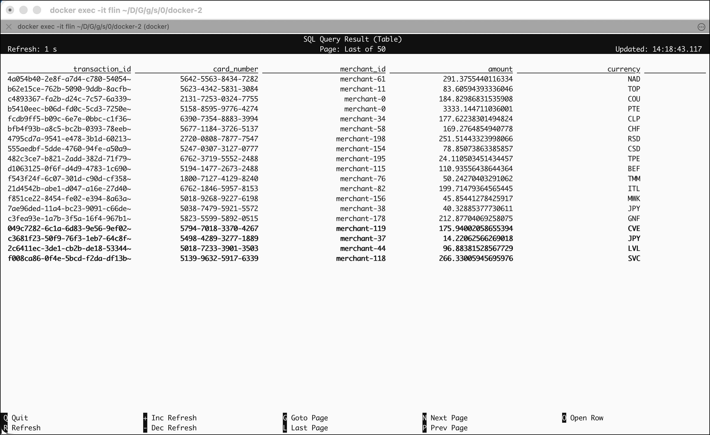
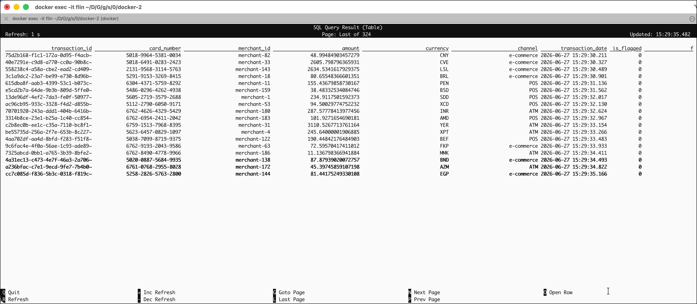
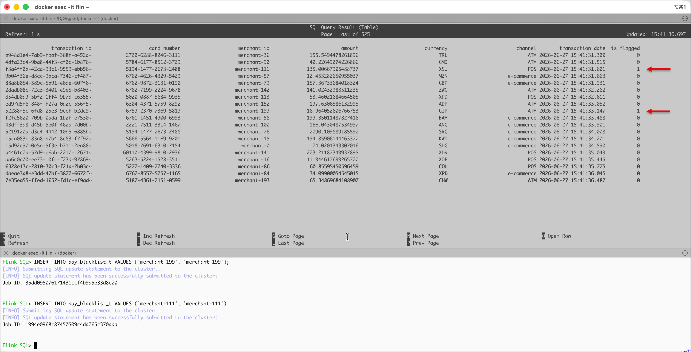

# Stream Processing and Analytics with Flink SQL

In this workshop you will build a streaming fraud detection pipeline for credit card transactions. Synthetic transaction and cardholder data flows through Apache Kafka, where Apache Flink SQL performs real-time stream processing — joining against a merchant blacklist, enriching with reference data, and flagging suspicious transactions. The flagged records are then persisted as Apache Iceberg tables in S3-compatible object storage via Kafka Connect, and the resulting tables are curated and queried analytically using Apache Spark SQL.

## Table of Contents

- [What you will learn](#what-you-will-learn)
- [Prerequisites](#prerequisites)
- [Additional Services](#additional-services)
- [Kafka Topic Setup with Jikkou](#kafka-topic-setup-with-jikkou)
- [Simulator Setup](#simulator-setup)
- [Exploring Streams with the Default In-Memory Catalog](#exploring-streams-with-the-default-in-memory-catalog)
- [Making Definitions Durable with the Hive Metastore Catalog](#making-definitions-durable-with-the-hive-metastore-catalog)
- [Fraud Detection: Blacklist Flagging and Merchant Enrichment](#fraud-detection-blacklist-flagging-and-merchant-enrichment)
- [Advanced Fraud Detection Patterns](#advanced-fraud-detection-patterns)
- [Persisting to Iceberg with Kafka Connect](#persisting-to-iceberg-with-kafka-connect)
- [Validating and Querying with Spark SQL](#validating-and-querying-with-spark-sql)
- [Curating Data with Spark](#curating-data-with-spark)

## What you will learn

- How to declare Kafka topics as code using Jikkou's `KafkaTopicList` resource and apply them idempotently with a single command
- How to configure and start the ShadowTraffic simulator to generate synthetic credit card transaction data
- How to create Flink SQL tables over Kafka topics using the Kafka and upsert-kafka connectors
- How to join a transaction stream against a blacklist table to flag suspicious transactions
- How to enrich a Kafka stream with merchant reference data using a stream-table join
- How to materialize enriched Flink SQL queries into new Kafka topics with `INSERT INTO`
- How to use tumbling window aggregations in Flink SQL to detect unusual transaction patterns
- How to deploy the Iceberg Sink Connector to persist Avro records as Parquet files in S3
- How to create Iceberg tables using Spark SQL
- How to validate data arrival by querying Iceberg tables with Spark SQL
- How to curate raw data by joining Iceberg tables in Spark and writing the result back as a new Iceberg table

## Prerequisites

- The **Data Platform** described in [00-environment](../00-environment) is running and accessible, with Kafka (KRaft, 3 brokers), Schema Registry, Flink (JobManager + TaskManager + SQL Client), Kafka Connect, Spark, Hive Metastore, and S3-compatible object storage (RustFS/MinIO) all healthy
- A [ShadowTraffic](https://shadowtraffic.io/) license — a free trial is available on their website
- Basic familiarity with SQL

## Additional Services

The base Platys platform covers the core infrastructure (Kafka, Schema Registry, Flink, etc.). This workshop adds two more service definitions in `docker-compose.override.yml` that Docker Compose automatically merges with the base stack when you run `docker compose up`.

You can copy the `docker-compose.override.yml` from the workshop folder into `$DATAPLAFORM_HOME`.

```bash
cp docker-compose.override.yml $DATAPLATFORM_HOME
```

It provides one new service, the `lhbank-cardholder-app` application:

### lhbank-cardholder-app

```yaml
  lhbank-cardholder-app:
    image: ghcr.io/gschmutz/lhbank-cardholder:main
    environment:
      SERVER_PORT: 8082
      SPRING_DATASOURCE_URL: jdbc:postgresql://postgresql:5432/customer_db
      SPRING_DATASOURCE_USERNAME: customer
      SPRING_DATASOURCE_PASSWORD: abc123!
      SPRING_KAFKA_PROPERTIES_SCHEMA_REGISTRY_URL: http://schema-registry-1:8081
    ports:
      - "29000:8082"
```

This is a Spring Boot microservice that implements the **transactional outbox pattern** for cardholder data (covered in depth in [07 - Working with Kafka Connect and Change Data Capture (CDC)](../07-kafka-connect-and-cdc)). ShadowTraffic does not write cardholders directly to Kafka — instead it calls this service's REST endpoint (acting as a webhook target). The service then:

1. Persists the cardholder record to the `customer_db` PostgreSQL database
2. Publishes the same record to the `pub.cus.cardHolder.state.v1` Kafka topic as an Avro event, using the Schema Registry for schema management

Writing to the database and publishing to Kafka inside the same transactional boundary ensures cardholder state in PostgreSQL and in Kafka is always consistent. The service waits for both PostgreSQL and Schema Registry to be healthy before starting (`depends_on` with health checks).

### Start the extended stack

Start the platform including these two extensions:

```bash
export DATAPLATFORM_IP=localhost
docker compose up -d
```

Docker Compose automatically reads `docker-compose.override.yml` from the same directory and merges it with the base `docker-compose.yml`, so no extra flags are needed.

Confirm the cardholder service is healthy:

```bash
docker logs lhbank-cardholder-app --tail 20
```

> **What you should see:** Spring Boot startup log lines ending with `Started LhbankCardholderApplication`, indicating the service is ready to receive webhook calls from ShadowTraffic.

## Kafka Topic Setup with Jikkou

[Jikkou](https://www.jikkou.io/) is a GitOps-style command-line tool for managing Kafka resources — topics, ACLs, schema subjects, consumer groups — as versioned, declarative YAML files. Instead of running `kafka-topics.sh` commands by hand, you describe the desired state once in a spec file and let Jikkou reconcile the cluster to match it. Jikkou only changes what differs from the spec, so re-applying the same file is always safe (idempotent).

In this platform Kafka is configured with `auto.create.topics.enable = false`, which means every topic we product to must exist before the simulator starts. Jikkou is the right tool for this: it lets you keep the topic definitions in source control alongside the rest of the workshop and recreate them reliably in any environment.

### The topic spec file

Create a file `card-topic-specs.yml` in folder `$DATAPLATFORM_HOME/scripts/jikkou`. It defines the first few topics needed by the pipeline as a single `KafkaTopicList` resource. We will later add to that file when more topics are needed:

```bash
nano $DATAPLATFORM_HOME/scripts/jikkou/card-topic-specs.yml
```

and add:

```yaml
apiVersion: "kafka.jikkou.io/v1beta2"
kind: "KafkaTopicList"
metadata: {}
items:
  - metadata:
      name: 'priv.pay.transaction.delta.v1'
    spec:
      partitions: 2
      replicas: 3
      configs:
        cleanup.policy: delete
        segment.bytes: 104857600

  - metadata:
      name: 'priv.pay.blacklist.state.v1'
    spec:
      partitions: 2
      replicas: 3
      configs:
        cleanup.policy: compact
        segment.ms: 100
        delete.retention.ms: 100
        min.cleanable.dirty.ratio: 0.001

  - metadata:
      name: 'pub.cus.cardHolder.state.v1'
    spec:
      partitions: 2
      replicas: 3
      configs:
        cleanup.policy: compact
        segment.ms: 100
        delete.retention.ms: 100
        min.cleanable.dirty.ratio: 0.001

  - metadata:
      name: 'pub.ref.merchant.state.v1'
    spec:
      partitions: 2
      replicas: 3
      configs:
        cleanup.policy: compact
        segment.ms: 100
        delete.retention.ms: 100
        min.cleanable.dirty.ratio: 0.001
```

What each topic is for and why the settings differ:

| Topic | `cleanup.policy` | Purpose |
|---|---|---|
| `priv.pay.transaction.delta.v1` | `delete` | Append-only transaction event stream. Records can expire after the retention window — old events do not need to be replayed forever. |
| `priv.pay.blacklist.state.v1` | `compact` | Keyed blacklist state. Log compaction ensures the latest value for every merchant key is always available, regardless of how old it is. |
| `pub.cus.cardHolder.state.v1` | `compact` | Keyed cardholder reference state. Same reasoning as the blacklist — lookups must always return the current record. |
| `pub.ref.merchant.state.v1` | `compact` | Keyed merchant reference state. Flink's upsert-kafka connector reads this as a changelog table. |

The aggressive compaction settings (`segment.ms: 100`, `delete.retention.ms: 100`, `min.cleanable.dirty.ratio: 0.001`) on the compacted topics cause the log cleaner to run almost immediately, so tombstone records are removed quickly and the topic stays lean.

### Preview the changes before applying

Use `jikkou diff` to see exactly what Jikkou would create or modify without touching the cluster:

```bash
docker compose run --rm jikkou diff --files=/jikkou/card-topic-specs.yml
```

> **What you should see:** Five entries, each marked `CREATE`, because the topics do not exist yet. After the first apply, running `diff` again will show no changes — confirming that the cluster already matches the spec.

### Apply the spec

```bash
docker compose run --rm jikkou apply --files=/jikkou/card-topic-specs.yml
```

Jikkou reads the spec, compares it to the live cluster, creates the missing topics, and prints a summary of what was changed.

> **Note:** Just rerunning `docker compose up -d` works as well, whenever you have changed the spec file. 

### Verify the topics exist

You can also use Jikkou to describe the state of all resources of type 'KafkaTopic'.

```bash
docker compose run --rm jikkou get kafkatopics --default-configs=false
```

You should see all five topic names in the output together with the internal topics such as `_scheams`. 

Alternatively, use kcat:

```bash
docker exec -ti kcat kcat -b kafka-1:19092 -L | grep "priv\.\|pub\."
```

and you should get:

```bash
  topic "pub.cus.cardHolder.state.v1" with 2 partitions:
  topic "priv.pay.blacklist.state.v1" with 2 partitions:
  topic "pub.ref.merchant.state.v1" with 2 partitions:
  topic "priv.pay.transaction.delta.v1" with 2 partitions:
```

> **What just happened?** Jikkou connected to the Kafka cluster, compared the `KafkaTopicList` spec to the current topic inventory, and created each topic with the exact partition count, replication factor, and configuration properties specified. Because the spec file is checked in alongside the workshop code, anyone starting this workshop from scratch can recreate the identical topic layout with a single command — no tribal knowledge of `kafka-topics.sh` flags required.

## Simulator Setup

This workshop uses [ShadowTraffic](https://shadowtraffic.io/) to generate realistic synthetic credit card transaction data without requiring a live payment system. ShadowTraffic reads a declarative JSON configuration file and continuously produces records to Kafka topics according to the data shapes and timing rules you define.

### How the simulator works

The configuration file [`card-fraud.json`](./card-fraud.json) defines 3 generators that run in two sequential stages:

**Stage 1 — seed reference data (runs once at startup):**

| Generator | Output topic | What it produces |
|---|---|---|
| `genMerchants` | `pub.ref.merchant.state.v1` | Up to 200 merchants, each with a sequential `merchant-NNN` ID, company name, country code, city, and retail category |
| `genCardHolders` | *(via webhook)* | 300 cardholder records sent to the `lhbank-cardholder` service, which writes them to Kafka via the transactional outbox pattern |

**Stage 2 — continuous streams (run indefinitely after stage 1):**

| Generator | Output topic | What it produces |
|---|---|---|
| `genCardTransactions` | `priv.pay.transaction.delta.v1` | One transaction every 50–500 ms (random), each referencing an existing card number and a randomly picked merchant |
| `genCardHolders` | *(via webhook)* | New cardholder records at a lower frequency, simulating ongoing customer onboarding after the initial seed |

Each transaction record contains:

```json
{
  "transaction_id": "<uuid>",
  "card_number":    "<card number from an existing cardholder>",
  "merchant_id":    "<merchant-NNN, picked from existing merchants>",
  "amount":         "<90% between 1–300, 10% between 1000–5000 (high-value outliers)>",
  "currency":       "USD",
  "channel":        "<online | in-store | mobile>",
  "transaction_date": "<current timestamp>"
}
```

The amount distribution is intentionally skewed: 95 % of transactions fall in the 1–300 range and 5 % are high-value outliers (mean ~3 000). This means a simple high-amount threshold will produce a low false-positive rate — which makes the blacklist-based and cardholder-average-based flagging in Flink SQL more interesting to observe.

All records are serialized as Avro and the schemas are registered automatically in the Confluent Schema Registry on first produce.

Copy the [`card-fraud.json`](./card-fraud.json) file to `$DATAPLATFORM_HOME/scripts/shadowtraffic/card-fraud.json` to make it available in the `dataplatform`.

```bash
cp card-fraud.json $DATAPLATFORM_HOME/scripts/shadowtraffic/card-fraud.json
```

### Configure the ShadowTraffic license

ShadowTraffic requires a license to run. Export the license fields as environment variables before starting the simulator. You receive all six values when you sign up for the free trial at [shadowtraffic.io](https://shadowtraffic.io/).

```bash
export PLATYS_SHADOW_TRAFFIC_LICENSE_ID="02d79a76-6830-4e08-b700-5487eced158b"
export PLATYS_SHADOW_TRAFFIC_LICENSE_EMAIL="michael+examples@shadowtraffic.io"
export PLATYS_SHADOW_TRAFFIC_LICENSE_ORGANIZATION="ShadowTraffic"
export PLATYS_SHADOW_TRAFFIC_LICENSE_EDITION="ShadowTraffic Free Trial"
export PLATYS_SHADOW_TRAFFIC_LICENSE_EXPIRATION="2026-07-22"
export PLATYS_SHADOW_TRAFFIC_LICENSE_SIGNATURE="KjPD4Ox+rAuLmvANNXT/ZTYgcWpyddXaicZ3rNLDgdZ5/rpBD/Rj9x+3FCDrxAh5FtIs4yegxBM3WM08+RT4AkAf54HQYfLV/vs4//A0cs4/+wmTRndpIzQ1GQ4ETbTw7sDoMt6mmI2/7MDF6NikKmzlYqhizivuiFbhcWZ3Rg4efZLGa9aQqTuEuAsW6KSIQJxTzObVEwI9+I/c3ofGAXT+muJ1Ew7Q9C6S2CUdhNKTCSBx27oy1vwvg+ABkCirOP91RAZxqT6CdVUgXI+zUUpJiSnw2Jz7C7xIIpsjCDwbXIcAd3Qcy1xrBQt/2VzyUWVYzPBs3ATPFTKhlhB4aw=="
```

### Start the simulator

The simulator runs as a Docker container defined in the `test` Compose profile. Start it after the base platform is healthy:

```bash
export DATAPLATFORM_IP=localhost
docker compose --profile test up -d
```

> **What you should see:** The `shadowtraffic` container starts and immediately begins producing records. Check its logs to confirm:

```bash
docker logs shadowtraffic --tail 20
```

You should see lines indicating that 4 streams of data are being generated.

```bash
...
The rules are:

none registered

2026-06-27 14:10:49.426 [WARN] [commons-io-FileAlterationMonitor] org.apache.avro.Schema - Ignored the priv.pay.transaction.delta.v1Value.transaction_date.logicalType property ("timestamp-millis"). It should probably be nested inside the "type" for the field.
2026-06-27 14:10:49.499 [INFO] [kafka-producer-network-thread | producer-2] org.apache.kafka.clients.producer.internals.TransactionManager - [Producer clientId=producer-2] ProducerId set to 2000 with epoch 0
✔ Configuration validated

✔ Generating 3 streams of data

✔ Now running

2026-06-27 14:10:52.652 [WARN] [commons-io-FileAlterationMonitor] org.apache.avro.Schema - Ignored the priv.pay.transaction.delta.v1Value.transaction_date.logicalType property ("timestamp-millis"). It should probably be nested inside the "type" for the field.
```

### Verify data is arriving in Kafka

Confirm the merchant reference topic is populated (merchants are produced only once at startup):

```bash
docker exec -ti kcat kcat -b kafka-1:19092 -t pub.ref.merchant.state.v1 -s value=avro -r http://schema-registry-1:8081 -e -q | head -5
```

Confirm transactions are arriving continuously:

```bash
docker exec -ti kcat kcat -b kafka-1:19092 -t priv.pay.transaction.delta.v1 -s value=avro -r http://schema-registry-1:8081 -q -o end
```

> **What you should see:** A stream of single-line JSON records appearing every fraction of a second, each representing one credit card transaction. Press **Ctrl-C** to stop.

> **What just happened?** ShadowTraffic read `card-fraud.json`, registered the Avro schemas with the Schema Registry, and entered stage 1 — producing all merchant records to `pub.ref.merchant.state.v1` (bounded at 200 records) and all cardholder records (bounded at 300). Once stage 1 is complete it entered stage 2 and began the open-ended transaction loop, looking up existing card numbers and merchant IDs to produce referentially consistent transaction records.

## Exploring Streams using Flink SQL with the Default In-Memory Catalog

[Apache Flink](https://flink.apache.org/) is an open-source distributed stream-processing framework designed for stateful computations over bounded and unbounded data streams. Unlike batch systems that process a fixed dataset and exit, Flink runs continuously — ingesting events as they arrive, maintaining state across them, and emitting results with low latency. It is fault-tolerant (via distributed checkpointing), horizontally scalable, and capable of exactly-once processing semantics.

Flink exposes several APIs at different levels of abstraction; in this workshop we use **Flink SQL**, the highest-level interface. Flink SQL lets you write standard ANSI SQL queries — `SELECT`, `JOIN`, `GROUP BY`, window functions, pattern matching — that run as persistent streaming jobs on the cluster. You do not need to write Java or Python code.

Connect to the Flink SQL CLI:

```bash
docker exec -it flink-sql-cli ./bin/sql-client.sh
```

Out of the box, Flink uses the **`default_catalog`** — an in-memory catalog that is session-scoped. Table definitions stored here are available immediately but exist only for the lifetime of the current SQL client session. This makes the default catalog ideal for ad-hoc exploration.

### Declare a virtual table over the transaction topic

In Flink SQL, **every object is a `TABLE`**. A `CREATE TABLE` statement does not move or copy data — it declares how Flink should connect to an external system and how to interpret the records it reads. Whether the table behaves as an append-only stream or a keyed lookup depends on the connector and the presence of a primary key:

- **Kafka connector** (`connector = 'kafka'`) — append-only source or sink; models an unbounded event stream
- **Upsert-Kafka connector** (`connector = 'upsert-kafka'`) — changelog source or sink; holds the latest value per key and is suitable for lookups

Create a table over the raw transaction topic:

```sql
CREATE TABLE pay_transaction_t (
    transaction_id   STRING,
    card_number      STRING,
    merchant_id      STRING,
    amount           DOUBLE,
    currency         STRING,
    channel          STRING,
    transaction_date TIMESTAMP(3),
    WATERMARK FOR transaction_date AS transaction_date - INTERVAL '5' SECOND
) WITH (
    'connector'                    = 'kafka',
    'topic'                        = 'priv.pay.transaction.delta.v1',
    'properties.bootstrap.servers' = 'kafka-1:19092',
    'properties.group.id'          = 'flink-pay-transaction',
    'scan.startup.mode'            = 'earliest-offset',
    'value.format'                 = 'avro-confluent',
    'value.avro-confluent.url'     = 'http://schema-registry-1:8081'
);
```

> **Key properties:**
> - `scan.startup.mode = 'earliest-offset'` — replay the topic from the beginning, so you see all records already produced by ShadowTraffic before you connected
> - `WATERMARK FOR transaction_date AS transaction_date - INTERVAL '5' SECOND` — tells Flink's event-time engine to allow up to 5 seconds of out-of-order arrival before closing a time window; required for window aggregations

Confirm the table appears in the catalog:

```sql
SHOW TABLES;
```

```
Flink SQL> SHOW TABLES;
+-------------------+
|        table name |
+-------------------+
| pay_transaction_t |
+-------------------+
1 row in set
```

### Query the live stream

Query the table to see records arriving in real time:

```sql
SELECT * FROM pay_transaction_t;
```

You should see an output similar to the one below:



> **What just happened?** Unlike a database `SELECT` that returns a fixed result set and exits, this query runs as a continuous streaming job. Every new record produced by ShadowTraffic to the Kafka topic immediately appears as a new row in the terminal output. The query will run indefinitely until you stop it.

Press **Q** or **Ctrl-C** to stop the query.

Set the result display mode to `tableau` so streaming output renders as a continuously updating table in the terminal:

```sql
SET 'sql-client.execution.result-mode' = 'table';
```

And re-execute the same SELECT:

```sql
SELECT * FROM pay_transaction_t;
```

> The default mode (`table`) renders results page by page and requires you to scroll. `tableau` streams rows to the terminal as they arrive, which is much more useful for live queries.

### Incremental aggregation

Flink can maintain running aggregates that update with each new event. This query counts how many transactions each card number has produced so far:

```sql
SELECT card_number, COUNT(*) AS nof
FROM pay_transaction_t
GROUP BY card_number;
```

> **What just happened?** Flink maintains a count in memory for each distinct `card_number`. Each time a new transaction arrives for a card, Flink emits an updated row with the new total — you can watch the counts climb in real time. This is an unbounded aggregation: there is no time window, so Flink accumulates state for every card it has ever seen.

Press **Ctrl-C** to stop.

### Tumbling window aggregation

An unbounded `GROUP BY` accumulates state forever. For fraud detection, what matters is *recent* activity — a burst of transactions within the last few minutes is suspicious even if the card's all-time total is normal. **Tumbling windows** divide the stream into fixed, non-overlapping time buckets and emit one result per bucket once the bucket closes.

```sql
SELECT
    window_start,
    window_end,
    card_number,
    COUNT(*)    AS nof,
    SUM(amount) AS total_amount
FROM TABLE(
    TUMBLE(TABLE pay_transaction_t, DESCRIPTOR(transaction_date), INTERVAL '1' MINUTE)
)
GROUP BY window_start, window_end, card_number;
```

> **What just happened?** `TUMBLE(..., INTERVAL '1' MINUTE)` partitions `pay_transaction_t` into one-minute buckets using `transaction_date` as the event-time clock. When the watermark advances past the end of a bucket (i.e., Flink is confident no more late records can arrive for that minute), the bucket closes and Flink emits one row per card showing the transaction count and total spend for that window.

Add a `HAVING` clause to surface only cards with more than one transaction in a single minute — a simple velocity signal:

```sql
SELECT
    window_start,
    window_end,
    card_number,
    COUNT(*)    AS nof,
    SUM(amount) AS total_amount
FROM TABLE(
    TUMBLE(TABLE pay_transaction_t, DESCRIPTOR(transaction_date), INTERVAL '1' MINUTE)
)
GROUP BY window_start, window_end, card_number
HAVING COUNT(*) > 1;
```

> **What just happened?** Only windows where a single card generated more than one transaction in the same minute are emitted. Because ShadowTraffic produces transactions quickly, most cards will appear here — in production you would tune the threshold and window size to match expected legitimate traffic patterns.

Press **Ctrl-C** to stop any running query. Now demonstrate what in-memory actually means — exit the session

```sql
EXIT;
```

and immediately reconnect:

```bash
docker exec -it flink-sql-cli ./bin/sql-client.sh
```

and show again the tables:

```sql
SHOW TABLES;
```

> **What you should see:** An empty set — no tables. The `pay_transaction_t` definition is gone. The in-memory catalog is session-scoped: every new SQL client session starts with a blank `default_catalog`. The underlying Kafka topic and its data are completely untouched, but Flink has no record of how to read them.

This is a fundamental limitation of the default catalog for anything beyond one-off exploration. Flink ships with [three catalog types](https://nightlies.apache.org/flink/flink-docs-stable/docs/dev/table/catalogs/#catalog-types):

| Catalog type | Persistence | Can create new objects? | Best for |
|---|---|---|---|
| **In-memory** (`default_catalog`) | Session only | Yes | Ad-hoc exploration |
| **Hive Metastore** | Permanent — stored in the Metastore DB | Yes | Production pipelines |
| **JDBC** | Permanent — but read-only view of an existing DB | No | Querying existing tables |

## Making Definitions Durable with the Hive Metastore Catalog

The Hive Metastore stores table DDL — schema, connector properties, partition metadata — in a relational database (PostgreSQL in this platform). Any Flink SQL client that connects to the same Metastore sees the same catalog, so a table defined in one session is immediately available in a fresh session, after a cluster restart, or from a different machine entirely.

Connect again

```bash
docker exec -it flink-sql-cli ./bin/sql-client.sh
```

and from the Flink SQL prompt, create the catalog:

```sql
CREATE CATALOG hive_catalog WITH (
    'type'          = 'hive',
    'hive-conf-dir' = '/opt/hive-conf'
);
```

> **Note on catalog persistence:** This platform is configured with `table.catalog-store.kind: file` (stored in `./conf/catalogs`). When you run `CREATE CATALOG`, Flink writes the catalog definition to that directory, so the catalog registration itself survives session restarts — you only need to run `CREATE CATALOG hive_catalog ...` **once**. On reconnect, Flink loads the definition automatically and the catalog is immediately available. The TABLE definitions inside the catalog are separately stored in the Hive Metastore database, which is also permanent. Both layers of metadata persist independently of the SQL client session.

Set the catalog to the active one:

```sql
USE CATALOG hive_catalog;
```

list all databases withing the hive catalog

```sql
SHOW DATABASES;
```

```bash
Flink SQL> SHOW DATABASES;
+---------------+
| database name |
+---------------+
|       default |
+---------------+
1 row in set
```

Create a new database & use it:

```sql
CREATE DATABASE IF NOT EXISTS fraud_detection;
```

```sql
USE fraud_detection;
```

The `SHOW CURRENT` command is useful to orientate yourself in the session:

To show the active catalog

```sql
SHOW CURRENT CATALOG;
```

```bash
Flink SQL> SHOW CURRENT CATALOG;
+----------------------+
| current catalog name |
+----------------------+
|         hive_catalog |
+--------------------
```

and to show the active database

```sql
SHOW CURRENT DATABASE;
```

```bash
Flink SQL> SHOW CURRENT DATABASE;
+-----------------------+
| current database name |
+-----------------------+
|       fraud_detection |
+-----------------------+
1 row in set
```

> **What you should see:** `hive_catalog` and `fraud_detection`.

## Re-Register the raw transaction source table

With the Hive catalog active, every `CREATE TABLE` statement is written to the Metastore and survives session restarts. Start by registering the raw transaction stream — this is the primary source table used throughout the pipeline:

```sql
USE CATALOG hive_catalog;
USE fraud_detection;

CREATE TABLE IF NOT EXISTS pay_transaction_t (
    transaction_id   STRING,
    card_number      STRING,
    merchant_id      STRING,
    amount           DOUBLE,
    currency         STRING,
    channel          STRING,
    transaction_date TIMESTAMP(3),
    WATERMARK FOR transaction_date AS transaction_date - INTERVAL '5' SECOND
) WITH (
    'connector'                    = 'kafka',
    'topic'                        = 'priv.pay.transaction.delta.v1',
    'properties.bootstrap.servers' = 'kafka-1:19092',
    'properties.group.id'          = 'flink-pay-transaction',
    'scan.startup.mode'            = 'earliest-offset',
    'value.format'                 = 'avro-confluent',
    'value.avro-confluent.url'     = 'http://schema-registry-1:8081'
);
```

Verify the table is registered:

```sql
SHOW TABLES;
```

Now prove the definition persists across sessions:

```sql
EXIT;
```

```bash
docker exec -it flink-sql-cli ./bin/sql-client.sh
```

```sql
USE CATALOG hive_catalog;
USE fraud_detection;
SHOW TABLES;
```

> **What you should see:** `pay_transaction_t` — no `CREATE TABLE` statement needed, and no `CREATE CATALOG` either. Because this platform uses a file-based catalog store, both the catalog registration and the table DDL survived the session restart intact. From this point on, every SQL statement in this workshop assumes the Hive catalog and `fraud_detection` database are active. Additional tables will be registered as each pipeline step is introduced.


## Fraud Detection: Blacklist Flagging and Merchant Enrichment

With all table definitions persisted in the Hive catalog, we can now build the two-stage pipeline. Make sure your SQL client session has the Hive catalog active:

```sql
USE CATALOG hive_catalog;
USE fraud_detection;
```

### Flag transactions against the merchant blacklist

Register the blacklist lookup table. The `upsert-kafka` connector treats the topic as a compacted changelog — Flink maintains an in-memory map of the latest value per key, making it suitable for point-in-time lookups during stream-table joins:

```sql
CREATE TABLE IF NOT EXISTS pay_blacklist_t (
    `key`       STRING,
    merchant_id STRING,
    PRIMARY KEY (`key`) NOT ENFORCED
) WITH (
    'connector'                    = 'upsert-kafka',
    'topic'                        = 'priv.pay.blacklist.state.v1',
    'properties.bootstrap.servers' = 'kafka-1:19092',
    'key.format'                   = 'avro-confluent',
    'key.avro-confluent.url'       = 'http://schema-registry-1:8081',
    'value.format'                 = 'avro-confluent',
    'value.avro-confluent.url'     = 'http://schema-registry-1:8081'
);
```

Join the transaction stream with the blacklist table to see which transactions involve blacklisted merchants:

```sql
SELECT t.*
     , CASE WHEN bl.`key` IS NOT NULL THEN 1 ELSE 0 END           AS is_flagged
     , CASE WHEN bl.`key` IS NOT NULL THEN 'blacklist' ELSE '' END AS flagged_reason
FROM pay_transaction_t t
LEFT JOIN pay_blacklist_t bl 
  ON t.merchant_id = bl.`key`;
```

And you should see an output similar to the one below



Because the blacklist is currently empty (there are no messages in the topic `priv.pay.blacklist.state.v1`), no transaction is flagged. 

We can either publish some messages directly into the topic or use the Flink SQL `INSERT` statement to add a merchant to the `pay_blacklist_t` table. Let's use the 2nd option: 

Open a second terminal, connect a second SQL client session, and add a merchant:

```bash
docker exec -it flink-sql-cli ./bin/sql-client.sh
```

Change to the right catalog and database

```sql
USE CATALOG hive_catalog;
USE fraud_detection;
```

and add `merchant-199` and `merchant-111` to the blacklist:

```sql
INSERT INTO pay_blacklist_t VALUES ('merchant-199', 'merchant-199');
INSERT INTO pay_blacklist_t VALUES ('merchant-111', 'merchant-111');
```

> **What you should see:** Transactions from `merchant-199` and `merchant-111` now appear with `is_flagged=1` and `flagged_reason='blacklist'` in the first terminal window:



Stop the ad-hoc query (**Ctrl-C**) and materialize the join as a persistent Flink job. 

Now let's create the sink table which persists the result of our query — it uses `upsert-kafka` with `transaction_id` as the primary key so each transaction is written once and can be updated if the blacklist changes.

But before registering the sink table, we have to create the backing topic by adding it to the Jikkou spec and apply it. The topic uses `compact` cleanup because `upsert-kafka` writes keyed records and the log must retain the latest value per key:

```yaml
# append to $DATAPLATFORM_HOME/scripts/jikkou/card-topic-specs.yml
  - metadata:
      name: 'priv.pay.transaction-flagged.delta.v1'
    spec:
      partitions: 2
      replicas: 3
      configs:
        cleanup.policy: compact
        segment.ms: 100
        delete.retention.ms: 100
        min.cleanable.dirty.ratio: 0.001
```

and run the apply which restarting the `jikkou` service:

```bash
docker compose up -d jikkou
```

and check that the topic is infact created

```bash
docker exec -ti kcat kcat -b kafka-1:19092 -L | grep "priv\.\|pub\."
```

Now we can finally create the table

```sql
CREATE TABLE IF NOT EXISTS pay_transaction_flagged_s (
    transaction_id   STRING,
    card_number      STRING,
    currency         STRING,
    amount           DOUBLE,
    merchant_id      STRING,
    channel          STRING,
    transaction_date TIMESTAMP(3),
    is_flagged       INT,
    flagged_reason   STRING,
    PRIMARY KEY (transaction_id) NOT ENFORCED
) WITH (
    'connector'                    = 'upsert-kafka',
    'topic'                        = 'priv.pay.transaction-flagged.delta.v1',
    'properties.bootstrap.servers' = 'kafka-1:19092',
    'key.format'                   = 'avro-confluent',
    'key.avro-confluent.url'       = 'http://schema-registry-1:8081',
    'value.format'                 = 'avro-confluent',
    'value.avro-confluent.url'     = 'http://schema-registry-1:8081'
);
```

and then start the continuous insert:

```sql
INSERT INTO pay_transaction_flagged_s
SELECT
    t.transaction_id
  , t.card_number
  , t.currency
  , t.amount
  , t.merchant_id
  , t.channel
  , t.transaction_date
  , CASE WHEN bl.`key` IS NOT NULL THEN 1 ELSE 0 END           AS is_flagged
  , CASE WHEN bl.`key` IS NOT NULL THEN 'blacklist' ELSE '' END AS flagged_reason
FROM pay_transaction_t t
LEFT JOIN pay_blacklist_t bl ON t.merchant_id = bl.`key`;
```

Verify flagged transactions are flowing:

```sql
SELECT * FROM pay_transaction_flagged_s WHERE is_flagged = 1;
```

> **What just happened?** Flink submitted a persistent streaming job that runs on the cluster independently of the SQL client session. Every new record on `priv.pay.transaction.delta.v1` is joined against the current blacklist state and the result is written to `priv.pay.transaction-flagged.delta.v1`. Because `pay_blacklist_t` uses the upsert-kafka connector, Flink maintains an in-memory state of the latest value per merchant key — adding a merchant to the blacklist after the job starts immediately affects subsequent transactions.

### Enrich flagged transactions with merchant details

Register the merchant reference lookup table. Like the blacklist, it uses `upsert-kafka` so Flink always holds the latest merchant record per key:

```sql
CREATE TABLE IF NOT EXISTS ref_merchant_t (
    merchant_id   STRING,
    name          STRING,
    country       STRING,
    city          STRING,
    category_name STRING,
    PRIMARY KEY (merchant_id) NOT ENFORCED
) WITH (
    'connector'                    = 'upsert-kafka',
    'topic'                        = 'pub.ref.merchant.state.v1',
    'properties.bootstrap.servers' = 'kafka-1:19092',
    'key.format'                   = 'raw',
    'value.format'                 = 'avro-confluent',
    'value.avro-confluent.url'     = 'http://schema-registry-1:8081'
);
```

The merchant reference topic contains name, city, country, and category for each merchant. Preview the join:

```sql
SELECT t.* 
     , m.name          AS merchant_name
     , m.country
     , m.city
     , m.category_name
FROM pay_transaction_flagged_s t
LEFT JOIN ref_merchant_t m ON t.merchant_id = m.merchant_id;
```

Use the cursor keys to scroll to the right to see the merchant columns to the right. We can confirm that we now also have the details of each merchant in the result. 
Let's create another sink table where we can persist that result to.

First add the backing topic to the Jikkou spec and apply it:

```yaml
# append to $DATAPLATFORM_HOME/scripts/jikkou/card-topic-specs.yml
  - metadata:
      name: 'priv.pay.transaction-flagged-enriched.delta.v1'
    spec:
      partitions: 2
      replicas: 3
      configs:
        cleanup.policy: compact
        segment.ms: 100
        delete.retention.ms: 100
        min.cleanable.dirty.ratio: 0.001
```

```bash
cd $DATAPLATFORM_HOME
docker compose run --rm jikkou apply --files=/jikkou/card-topic-specs.yml
```

Then register the enriched sink table and materialize as a second persistent job:

```sql
CREATE TABLE IF NOT EXISTS pay_transaction_flagged_enriched_s (
    transaction_id   STRING,
    card_number      STRING,
    currency         STRING,
    amount           DOUBLE,
    channel          STRING,
    transaction_date TIMESTAMP(3),
    is_flagged       INT,
    flagged_reason   STRING,
    merchant_id      STRING,
    merchant_name    STRING,
    country          STRING,
    city             STRING,
    category_name    STRING,
    PRIMARY KEY (transaction_id) NOT ENFORCED
) WITH (
    'connector'                    = 'upsert-kafka',
    'topic'                        = 'priv.pay.transaction-flagged-enriched.delta.v1',
    'properties.bootstrap.servers' = 'kafka-1:19092',
    'key.format'                   = 'avro-confluent',
    'key.avro-confluent.url'       = 'http://schema-registry-1:8081',
    'value.format'                 = 'avro-confluent',
    'value.avro-confluent.url'     = 'http://schema-registry-1:8081'
);

INSERT INTO pay_transaction_flagged_enriched_s
SELECT
    t.transaction_id
  , t.card_number
  , t.currency
  , t.amount
  , t.channel
  , t.transaction_date
  , t.is_flagged
  , t.flagged_reason
  , t.merchant_id
  , m.name          AS merchant_name
  , m.country
  , m.city
  , m.category_name
FROM pay_transaction_flagged_s t
LEFT JOIN ref_merchant_t m ON t.merchant_id = m.merchant_id;
```

Query the enriched flagged transactions:

```sql
SELECT * FROM pay_transaction_flagged_enriched_s WHERE is_flagged = 1;
```

> **What just happened?** Two persistent streaming jobs now run on the Flink cluster in sequence. The first joins raw transactions against the blacklist; the second reads that output and joins with the merchant reference table. Each job writes to its own Kafka topic, forming a pipeline. New merchant records appearing in `pub.ref.merchant.state.v1` are automatically picked up by the upsert-kafka state and applied to subsequent joins.

## Enrich with Credit Card Holder

The blacklist join flags known-bad merchants. A complementary signal is **personalized amount scoring**: instead of a fixed dollar threshold, compare each transaction against that specific cardholder's own average spend. A transaction that is large relative to that card's own history is suspicious — regardless of the absolute amount. This requires joining the enriched flagged stream with cardholder data, held by the `lhbank-cardholder` Spring Boot service in its PostgreSQL database. But joining from Flink with the operational database is not a good idea, it's much better provide them as a Kafka topic, by which it can be efficiently dealt with in Flink. Thankfully the `lhbank-cardholder` service is build using the Transactional Outbox Pattern, so all we have to do is integrate the outbox with our solution. We have already seen the transactional outbox pattern in action in workshop [07 - Working with Kafka Connect and Change Data Capture (CDC)](../07-kafka-connect-and-cdc).

### Enable Transactional Outbox in `lhbank-cardholder`

The transactional outbox pattern is used by the `lhbank-cardholder` Spring Boot service. When a cardholder is onboarded, the service writes to both the business tables and an `outbox` table in the same database transaction — guaranteeing atomicity without a distributed transaction. Debezium then captures the outbox inserts via CDC and routes events to Kafka topics based on the `event_type` column using the `EventRouter` Single Message Transform.


With the `lhbank-cardholder` service running (we started it above using the Docker Compose override), let's create the Debezium Kafka Connect connector instance:

```
curl -X PUT \
  "http://$DATAPLATFORM_IP:8083/connectors/cardHolder.dbzsrc.outbox/config" \
  -H 'Content-Type: application/json' \
  -H 'Accept: application/json' \
  -d '{
  "connector.class": "io.debezium.connector.postgresql.PostgresConnector",
  "tasks.max": "1",
  "slot.name":"dbzoutbox",  
  "database.server.name": "postgresql",
  "database.port": "5432",
  "database.user": "customer",
  "database.password": "abc123!",
  "database.dbname": "customer_db",
  "topic.prefix": "cardHolder",
  "schema.include.list": "public",
  "table.include.list": "public.outbox",
  "plugin.name": "pgoutput",
  "publication.name":"dbzoutbox",
  "slot.name":"debezium",
  "tombstones.on.delete": "false",
  "database.hostname": "postgresql",
  "transforms": "outbox",
  "transforms.outbox.type": "io.debezium.transforms.outbox.EventRouter",
  "transforms.outbox.table.field.event.id": "id",
  "transforms.outbox.table.field.event.key": "event_key",
  "transforms.outbox.table.field.event.payload": "payload_avro",
  "transforms.outbox.route.by.field": "event_type",
  "transforms.outbox.route.topic.replacement": "pub.cus.${routedByValue}.state.v1",
  "value.converter": "io.debezium.converters.BinaryDataConverter",
  "topic.creation.default.replication.factor": 3,
  "topic.creation.default.partitions": 8,
  "key.converter": "org.apache.kafka.connect.storage.StringConverter"
}'
```

if registered successfully, we should immediately see data arriving in the Kafka topic. 

```bash
docker exec -ti kcat kcat -b kafka-1:19092  -t pub.cus.cardHolder.state.v1 -r http://schema-registry-1:8081 -s value=avro -q
```

### Why not sending directly to Kafka?

Writing to both the database and Kafka directly (dual write) is not safe: if the Kafka write succeeds but the database write fails (or vice versa), the two systems become inconsistent. The transactional outbox pattern avoids this by making the outbox write part of the same database transaction as the business write.


### Create the sink topic for holding the transactions enchriched with card holder data

As before, we have to first create the new topic. Add the following definition to the Jikkou spec file:

```yaml
# append to $DATAPLATFORM_HOME/scripts/jikkou/card-topic-specs.yml
  - metadata:
      name: 'priv.pay.transaction-flagged2-enriched.delta.v1'
    spec:
      partitions: 2
      replicas: 3
      configs:
        cleanup.policy: compact
        segment.ms: 100
        delete.retention.ms: 100
        min.cleanable.dirty.ratio: 0.001
```

and apply it against the Kafka cluster:

```bash
cd $DATAPLATFORM_HOME
docker compose run jikkou apply --files=/jikkou/card-topic-specs.yml
```

You should see that a new topic has been created.

### Register the cardholder lookup table

Each record carries the full cardholder profile — including `avg_transaction_amount`, which represents the card's historical average spend. The Avro value uses a nested `card_holder` record; Flink SQL maps this to a `ROW` type accessed with dot notation.

```bash
docker exec -ti flink-sql-cli ./bin/sql-client.sh

use catalog hive_catalog;
use fraud_detection;
```

```sql
DROP TABLE IF EXISTS cus_cardholder_t;

CREATE TABLE cus_cardholder_t (
    id           STRING,
    card_holder  ROW<
        id                      STRING,
        first_name              STRING,
        last_name               STRING,
        email_address           STRING,
        phone_number            STRING,
        preferred_contact       STRING,
        segment                 STRING,
        card                    ROW<
            number       STRING,
            type         STRING,
            expiry_date  STRING
        >,
        avg_transaction_amount  BIGINT,
        addresses               ARRAY<ROW<
            street    STRING,
            zip_code  STRING,
            city      STRING,
            state     STRING
        >>,
        usual_countries         ARRAY<STRING>,
        onboarded_date          TIMESTAMP(3)
    >,
    PRIMARY KEY (id) NOT ENFORCED
) WITH (
    'connector'                    = 'upsert-kafka',
    'topic'                        = 'pub.cus.cardHolder.state.v1',
    'properties.bootstrap.servers' = 'kafka-1:19092',
    'key.format'                   = 'raw',
    'value.format'                 = 'avro-confluent',
    'value.avro-confluent.url'     = 'http://schema-registry-1:8081',
    'value.fields-include'         = 'EXCEPT_KEY'
);
```

Preview the join — for each transaction you can see the card's personal average alongside the transaction amount:

```sql
SELECT
    t.transaction_id
  , t.card_number
  , t.amount
  , ch.card_holder.avg_transaction_amount
  , CASE WHEN t.amount > ch.card_holder.avg_transaction_amount THEN 1 ELSE 0 END AS above_avg
FROM pay_transaction_flagged_enriched_s t
LEFT JOIN cus_cardholder_t ch ON t.card_number = ch.card_holder.card.number;
```

### Materialize as a persistent job

Register the sink table and start the continuous insert. The `is_flagged` counter is incremented and `flagged_reason` is appended when the amount exceeds the cardholder's average:

```sql
CREATE TABLE IF NOT EXISTS pay_transaction_flagged2_enriched_s (
    transaction_id         STRING,
    card_number            STRING,
    currency               STRING,
    amount                 DOUBLE,
    channel                STRING,
    transaction_date       TIMESTAMP(3),
    is_flagged             INT,
    flagged_reason         STRING,
    merchant_id            STRING,
    merchant_name          STRING,
    country                STRING,
    city                   STRING,
    category_name          STRING,
    avg_transaction_amount DOUBLE,
    PRIMARY KEY (transaction_id) NOT ENFORCED
) WITH (
    'connector'                    = 'upsert-kafka',
    'topic'                        = 'priv.pay.transaction-flagged2-enriched.delta.v1',
    'properties.bootstrap.servers' = 'kafka-1:19092',
    'key.format'                   = 'raw',
    'value.format'                 = 'avro-confluent',
    'value.avro-confluent.url'     = 'http://schema-registry-1:8081'
);

INSERT INTO pay_transaction_flagged2_enriched_s
SELECT
    t.transaction_id
  , t.card_number
  , t.currency
  , t.amount
  , t.channel
  , t.transaction_date
  , CASE WHEN ch.card_holder.card.number IS NOT NULL
          AND t.amount > ch.card_holder.avg_transaction_amount
         THEN t.is_flagged + 1
         ELSE t.is_flagged
    END AS is_flagged
  , CASE WHEN ch.card_holder.card.number IS NOT NULL
          AND t.amount > ch.card_holder.avg_transaction_amount
         THEN CONCAT(t.flagged_reason, CASE WHEN t.flagged_reason <> '' THEN ',' ELSE '' END, 'high-amount')
         ELSE t.flagged_reason
    END AS flagged_reason
  , t.merchant_id
  , t.merchant_name
  , t.country
  , t.city
  , t.category_name
  , ch.card_holder.avg_transaction_amount
FROM pay_transaction_flagged_enriched_s t
LEFT JOIN cus_cardholder_t ch ON t.card_number = ch.card_holder.card.number;
```

Query transactions flagged for high amount relative to the cardholder's own average:

```sql
SELECT transaction_id, card_number, amount, avg_transaction_amount, flagged_reason
FROM pay_transaction_flagged2_enriched_s
WHERE flagged_reason LIKE '%high-amount%';
```

> **What just happened?** Flink joins each incoming enriched transaction against the latest cardholder record (maintained in upsert-kafka state). When a transaction's amount exceeds that card's `avg_transaction_amount`, the `is_flagged` counter is incremented and `'high-amount'` is appended to `flagged_reason` — which may already contain `'blacklist'` from the previous stage, producing composite flags like `'blacklist,high-amount'`.

## Advanced Fraud Detection Patterns

This section adds three complementary fraud signals that do not require an external reference list — they derive suspicion entirely from patterns within the transaction stream itself. Each pattern uses a different Flink SQL capability.

| Pattern | Flink SQL feature | Requires previous records? |
|---|---|---|
| Velocity — too many transactions per window | `TUMBLE` window + `HAVING` | No (aggregated per window) |
| Amount anomaly — spike above card's own rolling average | `OVER` window aggregation | **Yes — reads back 24 h of history per card** |
| Card-testing sequence — small probe followed by large transaction | `MATCH_RECOGNIZE` | **Yes — scans across rows of same card** |

Make sure the Hive catalog and database are active in your SQL client session:

```sql
USE CATALOG hive_catalog;
USE fraud_detection;
```

First add the two new output topics to the Jikkou spec and apply:

```yaml
# append to card-topic-specs.yml
  - metadata:
      name: 'priv.pay.fraud.velocity.delta.v1'
    spec:
      partitions: 2
      replicas: 3
      configs:
        cleanup.policy: delete
        segment.bytes: 104857600

  - metadata:
      name: 'priv.pay.fraud.amount-anomaly.delta.v1'
    spec:
      partitions: 2
      replicas: 3
      configs:
        cleanup.policy: delete
        segment.bytes: 104857600
```

```bash
docker cp card-topic-specs.yml jikkou:/tmp/card-topic-specs.yml
docker exec jikkou jikkou apply --files /tmp/card-topic-specs.yml
```

---

### Pattern 1 — Velocity detection

**Signal:** A legitimate cardholder rarely makes more than a handful of purchases within a few minutes. A burst of transactions in a short window is a strong indicator of card abuse or automated fraud.

**How it works:** Group transactions into 10-minute tumbling windows per card. Emit a fraud alert row for every window where the count exceeds the threshold.

Explore first:

```sql
SELECT
    window_start,
    window_end,
    card_number,
    COUNT(*)    AS tx_count,
    SUM(amount) AS total_amount
FROM TABLE(
    TUMBLE(TABLE pay_transaction_t, DESCRIPTOR(transaction_date), INTERVAL '10' MINUTE)
)
GROUP BY window_start, window_end, card_number
HAVING COUNT(*) > 3;
```

Materialize as a persistent fraud alert stream:

```sql
CREATE TABLE IF NOT EXISTS pay_fraud_velocity_s (
    window_start  TIMESTAMP(3),
    window_end    TIMESTAMP(3),
    card_number   STRING,
    tx_count      BIGINT,
    total_amount  DOUBLE,
    flagged_reason STRING
) WITH (
    'connector'                    = 'kafka',
    'topic'                        = 'priv.pay.fraud.velocity.delta.v1',
    'properties.bootstrap.servers' = 'kafka-1:19092',
    'value.format'                 = 'avro-confluent',
    'value.avro-confluent.url'     = 'http://schema-registry-1:8081'
);

INSERT INTO pay_fraud_velocity_s
SELECT
    window_start,
    window_end,
    card_number,
    COUNT(*)    AS tx_count,
    SUM(amount) AS total_amount,
    'velocity'  AS flagged_reason
FROM TABLE(
    TUMBLE(TABLE pay_transaction_t, DESCRIPTOR(transaction_date), INTERVAL '10' MINUTE)
)
GROUP BY window_start, window_end, card_number
HAVING COUNT(*) > 3;
```

> **What you should see:** Because ShadowTraffic generates one transaction per card every ~50–500 ms of simulated time, most cards will breach the threshold quickly. This demonstrates the pattern; in production you would tune the window size and threshold to your expected legitimate traffic volume.

---

### Pattern 2 — Amount anomaly (OVER window)

**Signal:** Each cardholder has their own spending profile. A transaction that is three or more times larger than that card's own recent average — not an absolute dollar threshold — is suspicious regardless of the amount. This avoids the false positive problem of a flat global threshold: a $2 000 transaction is normal for a corporate card but alarming for a card that averages $20.

**Why this requires previous records:** The comparison baseline is the card's own rolling 24-hour average. Flink must keep the history of all amounts seen for each card within the last 24 hours in memory (`OVER` window state) to compute that average for each new incoming transaction.

Explore first — the inner subquery computes the rolling stats, the outer query applies the flag:

```sql
SELECT
    transaction_id,
    card_number,
    merchant_id,
    amount,
    transaction_date,
    ROUND(rolling_avg_24h, 2)               AS rolling_avg_24h,
    ROUND(amount / rolling_avg_24h, 1)      AS amount_ratio,
    tx_count_24h,
    CASE
        WHEN tx_count_24h >= 3
         AND amount > 3.0 * rolling_avg_24h THEN 1
        ELSE 0
    END AS is_flagged
FROM (
    SELECT
        transaction_id,
        card_number,
        merchant_id,
        amount,
        transaction_date,
        AVG(amount) OVER (
            PARTITION BY card_number
            ORDER BY transaction_date
            RANGE BETWEEN INTERVAL '24' HOUR PRECEDING AND CURRENT ROW
        ) AS rolling_avg_24h,
        COUNT(*) OVER (
            PARTITION BY card_number
            ORDER BY transaction_date
            RANGE BETWEEN INTERVAL '24' HOUR PRECEDING AND CURRENT ROW
        ) AS tx_count_24h
    FROM pay_transaction_t
);
```

The `tx_count_24h >= 3` guard prevents the first one or two transactions on a card — where there is not yet enough history to establish a baseline — from being flagged spuriously.

Materialize only the flagged rows as a persistent alert stream:

```sql
CREATE TABLE IF NOT EXISTS pay_fraud_amount_anomaly_s (
    transaction_id  STRING,
    card_number     STRING,
    merchant_id     STRING,
    amount          DOUBLE,
    transaction_date TIMESTAMP(3),
    rolling_avg_24h DOUBLE,
    amount_ratio    DOUBLE,
    flagged_reason  STRING
) WITH (
    'connector'                    = 'kafka',
    'topic'                        = 'priv.pay.fraud.amount-anomaly.delta.v1',
    'properties.bootstrap.servers' = 'kafka-1:19092',
    'value.format'                 = 'avro-confluent',
    'value.avro-confluent.url'     = 'http://schema-registry-1:8081'
);

INSERT INTO pay_fraud_amount_anomaly_s
SELECT
    transaction_id,
    card_number,
    merchant_id,
    amount,
    transaction_date,
    ROUND(rolling_avg_24h, 2)          AS rolling_avg_24h,
    ROUND(amount / rolling_avg_24h, 1) AS amount_ratio,
    'amount_anomaly'                   AS flagged_reason
FROM (
    SELECT
        transaction_id,
        card_number,
        merchant_id,
        amount,
        transaction_date,
        AVG(amount) OVER (
            PARTITION BY card_number
            ORDER BY transaction_date
            RANGE BETWEEN INTERVAL '24' HOUR PRECEDING AND CURRENT ROW
        ) AS rolling_avg_24h,
        COUNT(*) OVER (
            PARTITION BY card_number
            ORDER BY transaction_date
            RANGE BETWEEN INTERVAL '24' HOUR PRECEDING AND CURRENT ROW
        ) AS tx_count_24h
    FROM pay_transaction_t
)
WHERE tx_count_24h >= 3
  AND amount > 3.0 * rolling_avg_24h;
```

Query the anomalies as they arrive:

```sql
SELECT * FROM pay_fraud_amount_anomaly_s;
```

> **What just happened?** Flink maintains per-card state for every transaction seen in the last 24 hours. For each new transaction it recomputes the rolling average and count over that state, then emits a row only if the threshold is exceeded. The `OVER` window is evaluated row-by-row in event-time order, so the comparison is always against the card's history **up to the moment that transaction occurred** — not including future transactions.

---

### Pattern 3 — Card-testing sequence (`MATCH_RECOGNIZE`)

**Signal:** A common attack pattern is to first make a tiny "probe" transaction (under $5) to verify a stolen card is still active, then immediately follow up with a large purchase (over $200) on the same card. The two events are consecutive on the same card and happen within minutes of each other.

**Why this requires previous records:** `MATCH_RECOGNIZE` scans an ordered sequence of rows partitioned by card number, looking for a specific pattern across consecutive events. Flink buffers all unmatched rows for each card in state until the pattern either completes or the match window expires.

This is an ad-hoc exploratory query — run it in the SQL Client to watch matches appear in real time:

```sql
SELECT
    card_number,
    test_tx_id,
    ROUND(test_amount, 2)  AS test_amount,
    large_tx_id,
    ROUND(large_amount, 2) AS large_amount,
    test_time,
    large_time,
    TIMESTAMPDIFF(SECOND, test_time, large_time) AS seconds_between
FROM pay_transaction_t
MATCH_RECOGNIZE (
    PARTITION BY card_number
    ORDER BY transaction_date
    MEASURES
        TEST.transaction_id    AS test_tx_id,
        TEST.amount            AS test_amount,
        BIG.transaction_id     AS large_tx_id,
        BIG.amount             AS large_amount,
        TEST.transaction_date  AS test_time,
        BIG.transaction_date   AS large_time
    ONE ROW PER MATCH
    AFTER MATCH SKIP TO NEXT ROW
    PATTERN (TEST BIG)
    WITHIN INTERVAL '5' MINUTE
    DEFINE
        TEST AS amount < 5.0,
        BIG  AS amount > 200.0
) AS M;
```

> **What you should see:** Whenever ShadowTraffic happens to generate a low-amount transaction immediately followed by a high-amount transaction for the same card within 5 simulated minutes, a match row appears. Because the amount distribution is skewed (5 % of transactions are high-value outliers), matches will occur occasionally but not constantly.

You can tighten or relax the pattern by adjusting the thresholds in `DEFINE` or the `WITHIN` interval. You can also extend the pattern — for example `(TEST+ BIG)` would match one or more probe transactions before the large one.

> **`MATCH_RECOGNIZE` vs `OVER` window:** `OVER` aggregates a metric over a time range and emits one output per input row. `MATCH_RECOGNIZE` looks for a specific multi-row sequence of event types and emits one output per completed match. Use `OVER` when you want a continuously updated statistic; use `MATCH_RECOGNIZE` when you want to detect a specific temporal narrative.
