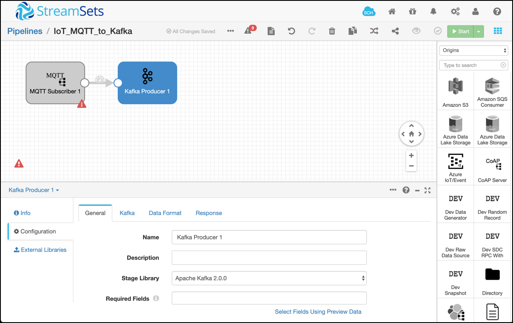
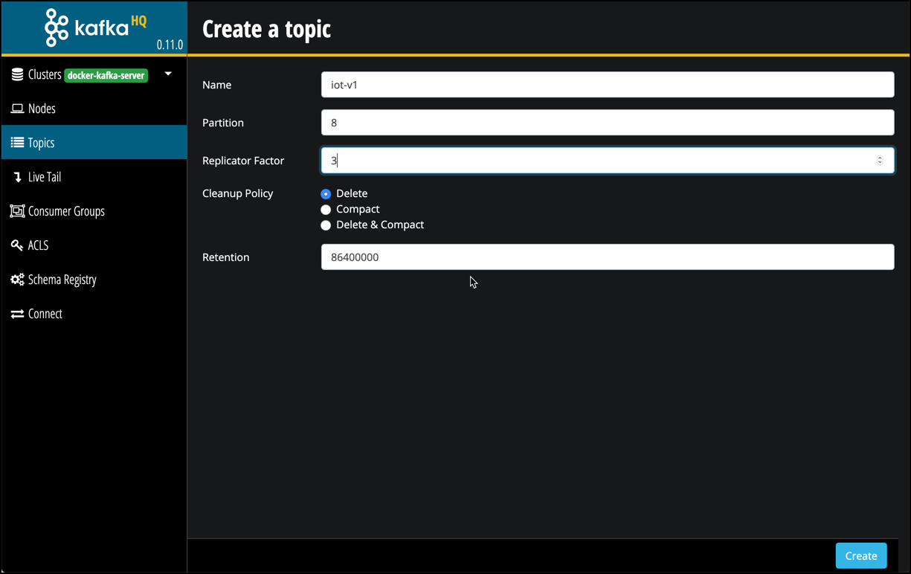
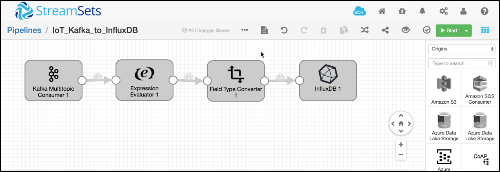
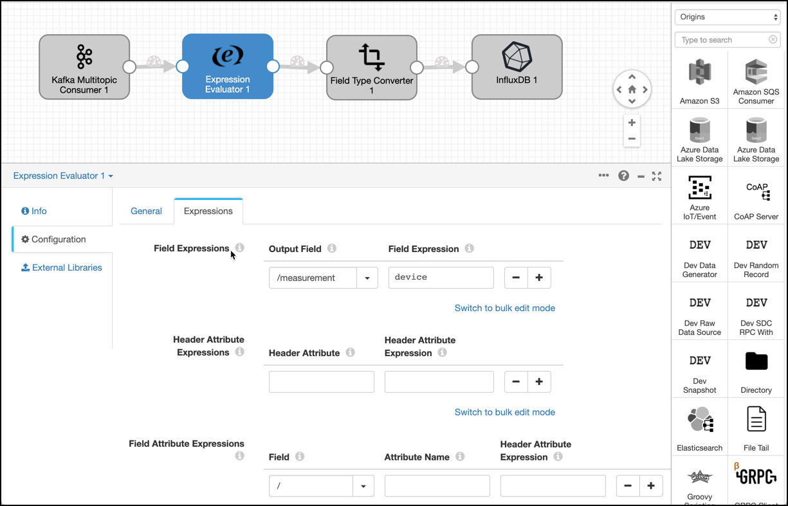
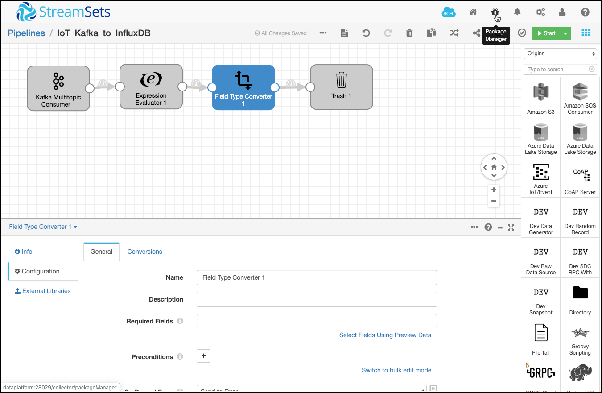

# Streaming Data Integration of Senor Data into Timeseries DB

In this workshop we will be ingesting data from simulated IoT devices into InfluxDB, a popular timeseries database

## Running the IoT Simulator

Before we can run the Simulator, we have to configure the kind of data we want it to generate.

We can do that using a JSON configuration file. Create a new folder `conf` and create a `devices-def.json` file

```
mkdir conf

nano conf/devices-def.json
```

and add the following configuration

```
[
    {
        "type":"simple",
        "uuid":"",
        "topic":"device/{$uuid}",
        "sampling":{"type":"fixed", "interval":1000},
        "copy":10,
        "sensors":[
            {"type":"dev.timestamp",    "name":"ts", "format":"yyyy-MM-dd'T'HH:mm:ss.SSSZ"},
            {"type":"dev.uuid",         "name":"uuid"},
            {"type":"double_walk",   "name":"temp",  "min":-15, "max":3},
            {"type":"double_cycle",  "name":"level", "values": [1.1,3.2,8.3,9.4]},
            {"type":"string",        "name":"level", "random": ["a","b","c","d","e","f","g","h","i","j","k","l","m","n","o"]}
        ]
    }
]
```

now let's run the IoT Simulator with this definition file. 

```
docker run -v $PWD/conf/devices-def.json:/conf/devices-def.json trivadis/iot-simulator -dt MQTT -u tcp://dataplatform:28100 -t iot/ -cf /conf/devices-def.json
```

The data is published to MQTT.  

For viewing the messages in MQTT, we need something similar to the `kafkacat` and `kafka-console-consumer` utilities. As demonstrated in a previous workshop, we can either consume from the command line using a dockerized MQTT client or we can use the browser-based [HiveMQ Web UI](https://www.hivemq.com/docs/3.4/web-ui/introduction.html) client. 

So either from a terminal run

```
docker run -it --rm efrecon/mqtt-client sub -h $DOCKER_HOST_IP -p 28100 -t "iot/device/#" -v
```

or navigate to <http://dataplatform:28082> and connect using `dataplatform` for the **Host** field, `28024` for the **Port** field and then click on **Connect**. Once connected, create a new subscription using the Topic pattern `iot/device/#`


and click **Subscribe** and you should see a viusalization of the messages generated by the simulator while they arrive.


Let's integrate these MQTT topics with Kafka using StreamSets Data Collector. 

## Integrate MQTT with Kafka using StreamSets

Navigate to <http://dataplatform:28029/> and create a new pipeline and name it `IoT_MQTT_to_Kafka`. On the Pipeline canvas, add a `MQTT Subscriber` origin and a `Kafka Producer` destination. 



Configure the **MQTT Subscriber** using the following settings

* **Broker URL**: `tcp://mosquitto-1:1883`
* **Topic Filter**: `iot/device/#`
* **Data Format**: `JSON`

Configure the **Kafka Producer** using the following settings

* **Broker URI**: `kafka-1:9092`
* **Topic**: `iot-v1`
* **Data Format**: `JSON`

On Pipeline level set ** Error Records ** to `Discrd (Library: Basic)`. 

Before we can run the pipeline, we have to create the Kafka topic `iot-v1`, for example using the KafkaHQ service (<http://dataplatform:28042/>):



Now run the StreamSets Pipeline and check that data is published to the Kafka Topic

```
kafkacat -b dataplatform -t iot-v1
```

Next we will Integrate the message from Kafka with InfluxDB. For that we will be using StreamSets Data Collector as well. 

## Integrate Kafka with InfluxDB using StreamSets

Create a new pipeline and name it `IoT_Kafka_to_InfluxDB`. On the Pipeline canvas, add a `Kafka Multitopic Consumer` origin and use a temporary `Trash` for the destination. Later we will replace the Trash destination by the `InfluxDB` destination. 

Configure the **Kafka Multitopic Consumer** using the following settings

* **Broker URI**: `kafka-1:9092`
* **Topic List**: `iot-v1`
* **Data Format**: `JSON`


Add a **Expression Evaluator** and a **Field Type Converter** processor inbetween **Kafka Multitopic Consumer** and **Influx DB**. The pipeline should now look as shown below:



Run the pipeline already once in **Preview Mode** to see if data can be consumed from Kafka and to get StreamSets to know about the fields available. 

With the **Expression Evaluator** procesor we specify the name of the measurement, needed for the **InfluxDB** destination. Configure it using the following settings:

* **Output Field**: `/measurement`
* **Output Field**: `device`



With the **Field Type Converter** procesor we convert the string timestamp to a timestamp, needed for the **InfluxDB** destination. Configure it using the following settings:

* **Fields to Convert**: `/ts`
* **Convert to Type**: `DATETIME`
* **Data Format**: `Other...`
* **Other Data Format**: `yyyy-MM-dd'T'HH:mm:ss.SSSZ`

The filled-out settings for the converter can be seen below


Run the Pipeline once more in Preview mode to see if the date conversion workes as expected.


For InfluxDB we first have to install the InfluxDB Library, as it is not pre-installed with the version of StreamSets which is installed on the Dataplatform. 



In the **Type to search** box enter `Influx` and you should see the `InfluxDB 0.9+` library appear. The version might be different. 

Install it by selecting the item and clicking on the `+` on the top right corner. 

Streamsets will download the library and once finished will tell you to restart StreamSets. You can do that using the following docker command.

```
docker restart streamsets-1
```

Relogin to StreamSets once restarted and navigate back to the `IoT_Kafka_to_InfluxDB` pipeline. Remove the `Trash` destination and replace it by the `InfluxDB` destination, now available from the list of destinations. 

Configure the **InfluxDB** using the following settings

* **URL**: `http://influxdb:8086`
* **Username**: `admin`
* **Password**: `admin`
* **Database Name**: `iot`
* **Auto-create Database**: enabled
* **Record Mapping**: `Custom Mappings`
* **Measurement Field**: `/measurement`
* **Time Field**: `/ts`
* **Time Unit**: `MILLISECONDS`
* **Tag Fields**: `/uuid` and `/level`
* **Value Fields**: `/temp`

Now with all these configurations in place, we can run the pipeline by clicking on **Start**. 

The data is feed into the InfluxDB and avalable for visualization or analytics. 

## Visualize InfluxDB data using Chronograf

One tool for visualization is Chronograf, which is part of the so called [TICK Stack](https://www.influxdata.com/time-series-platform/) (TICK for **T**elegraf, **I**nfluxDB, **C**hronograf and **K**apacitor). 

In a browser window, navigate to <http://dataplatform:28152/> to open the Chronograf homepage. 


