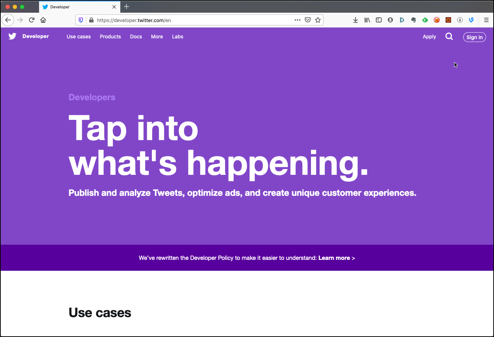
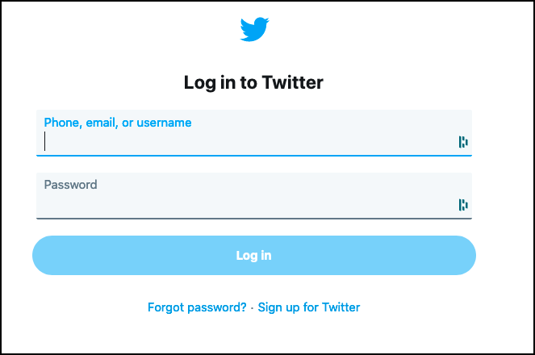
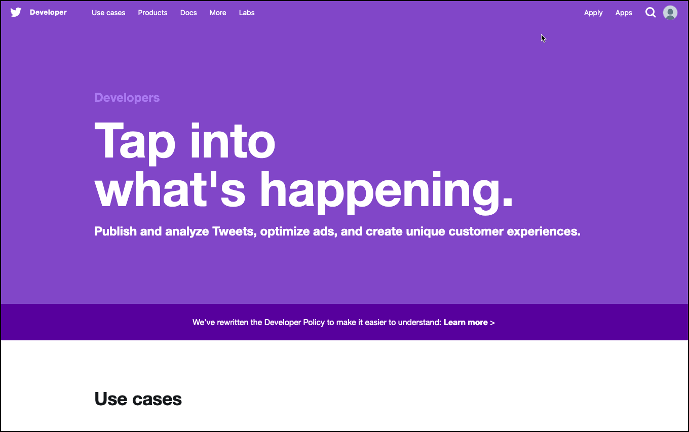
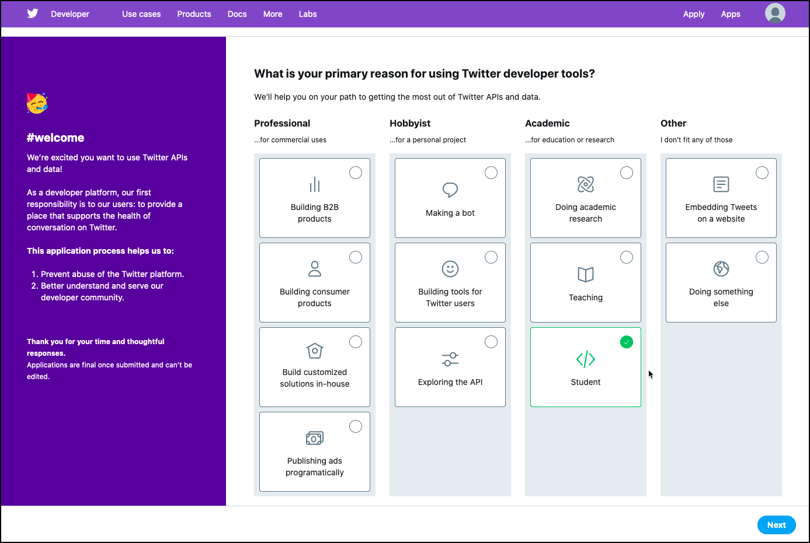
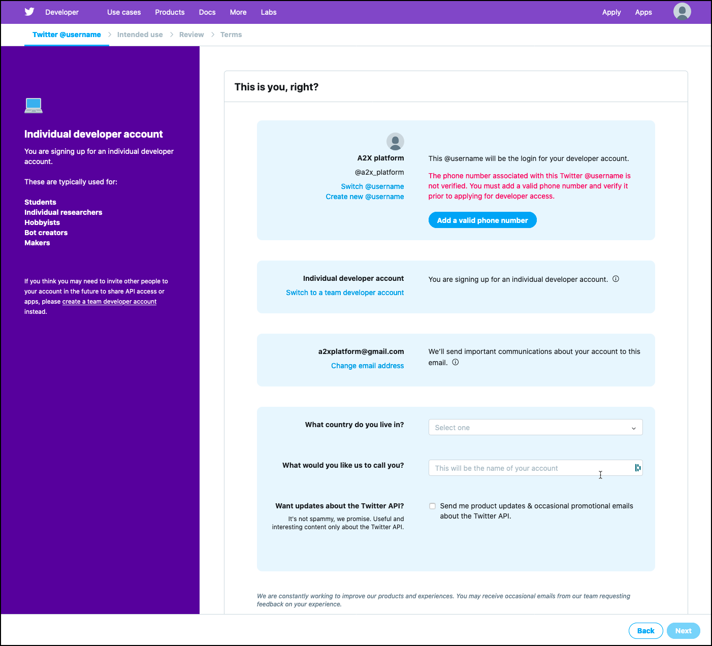
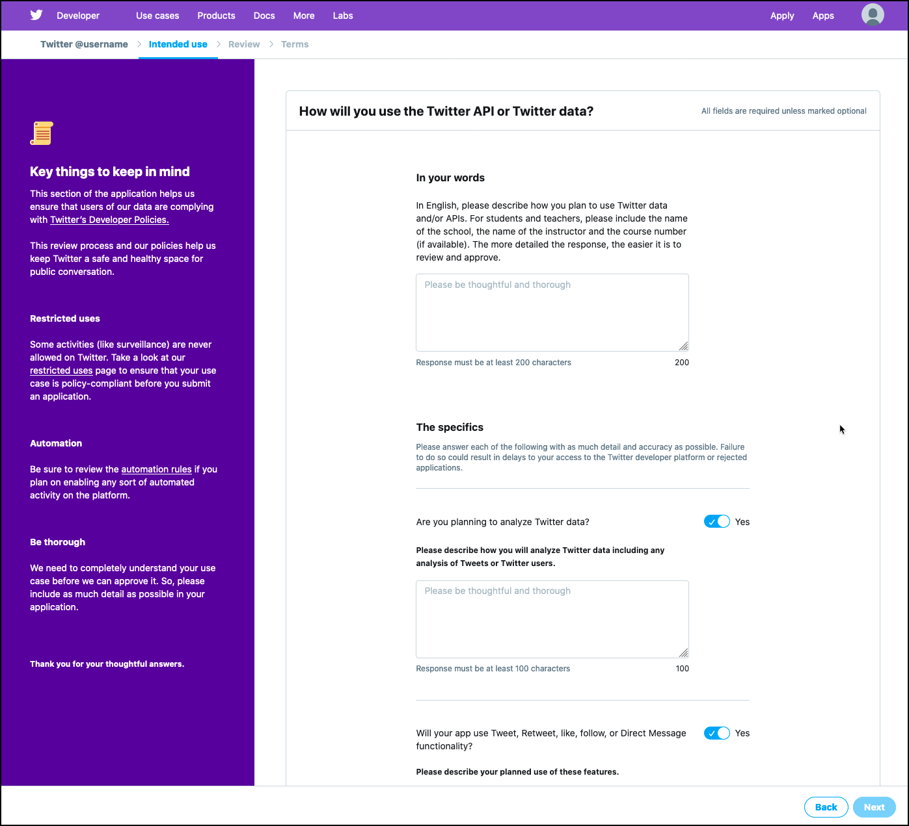
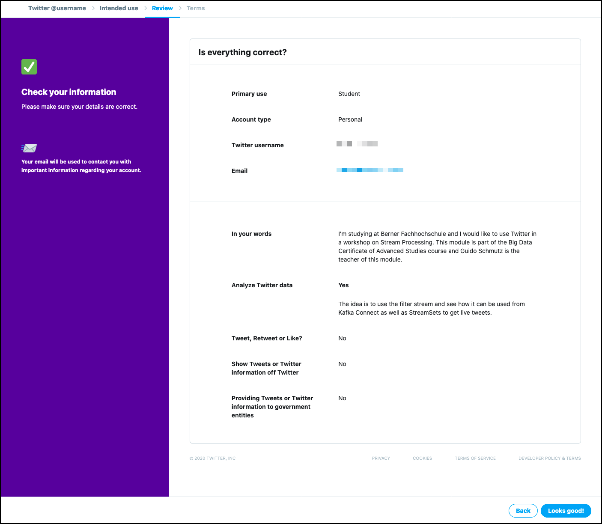
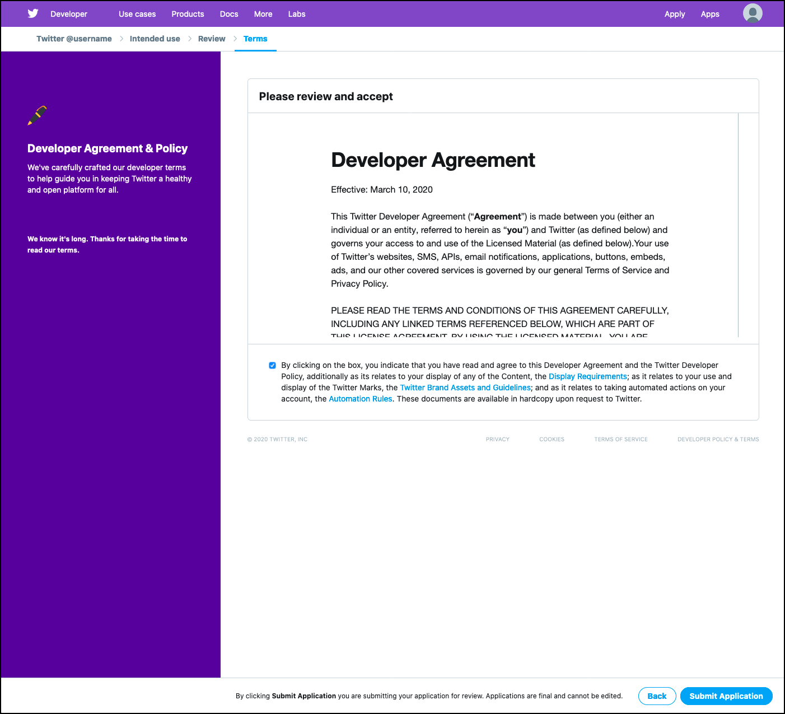
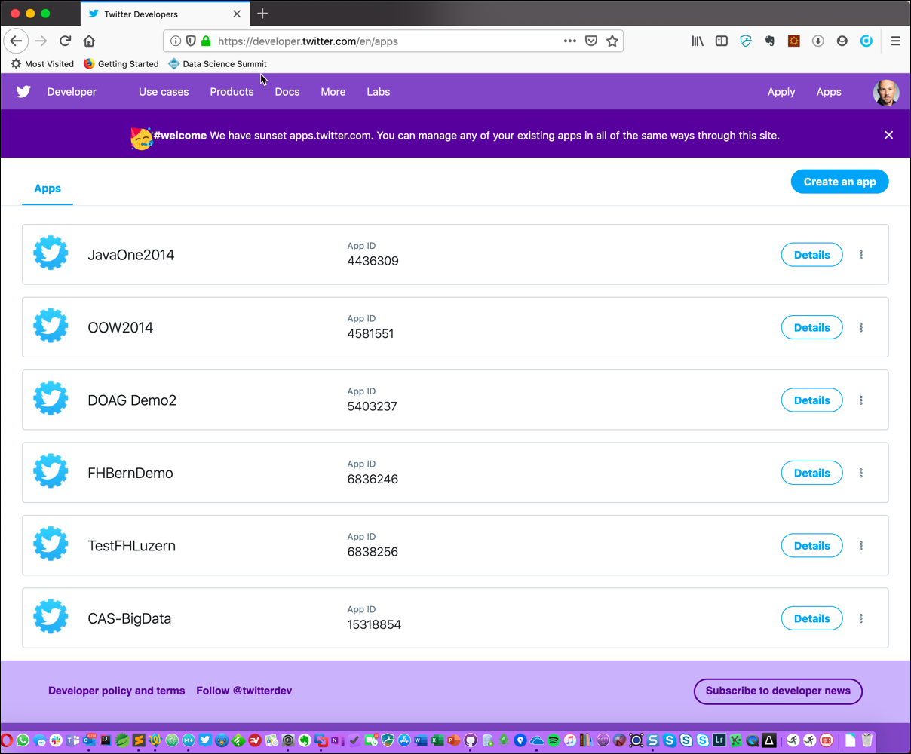

# Creating a Twitter Application

For getting live tweets in this course, we will connect to twitter through the so-called [Filter Stream API](https://developer.twitter.com/en/docs/tweets/filter-realtime/overview.html). 

This allows setting some filter options, which defines the Tweets we are interested in. Filters can be set on Terms, Geographic Location, Language and User. 

In order to use the Twitter [Filter Stream API](https://developer.twitter.com/en/docs/tweets/filter-realtime/overview.html), we have to apply for a Twitter developers account. 

## Apply for a Twitter developers account

If you don't have a Twitter user yet, you also have to create an account, which you can do from the sign in page below. It's free and you can for example use your school email address for it. 

Navigate to <https://developer.twitter.com/en> and click on the **Sign in** button on the top right corner. 

On the **Log into Twitter** screen, under **Phone, email or username** and **Password** enter the details of your existing twitter account and click **Log in**. 

If you don’t yet have a twitter account, then click on the **Sign up for Twitter** link to register for a Twitter account.

After login in you should get forwarded to your Twitter account homepage. Navigate to <https://developer.twitter.com/en> to access the Twitter Developers portal as a signed-in user. 

Now click on the **Apply** link on the top right corner to apply for access.

On the new screen, click on **Apply for developer account** and you should get to first page for registration. Select **Student** and then click **Next**.

On the new screen, add a phone number if your account does not yet have one, as indicated	in the screen below. Refresh the screen once you have added the phone number and the red notification message should disappear. 

Enter the Country, give your account a name and click **Next**.

On the next page mention the course, the name of the instructor and what you are planing to do with the API. 

Also enter a response to the comment for **Are you planning to analyze Twitter data?** and set the other three questions to **No** and click **Next**. 

On the **Is everything correct?** page make sure that everything is correct and then click on **Looks good!**.

On the **Please review and accept** click on the check box and then click on **Submit Application**.

Now twitter will send you a confirmation email to the email address registered with your Twitter account. Confirm it and wait for the confirmation by Twitter. 

Once you got the confirmation from Twitter, you are ready to create your first Twitter application. 

## tbd

Click on **Create an app** in the upper right corner to create a new Twitter application.

Enter **Name**, **Description**, **Website** 

Click on **Create your Twitter application**.

Click on **Keys and Access Tokens** to get the credentials.

Click on **Create my access tokens**

The **Access token pair** gets generated and is available to be used. 

Note that you will need the **Consumer Key**, the **Consumer Secret** the **Access Token** and the **Access Token Secret** when using the Twitter API and connecting with OAuth protocol.

