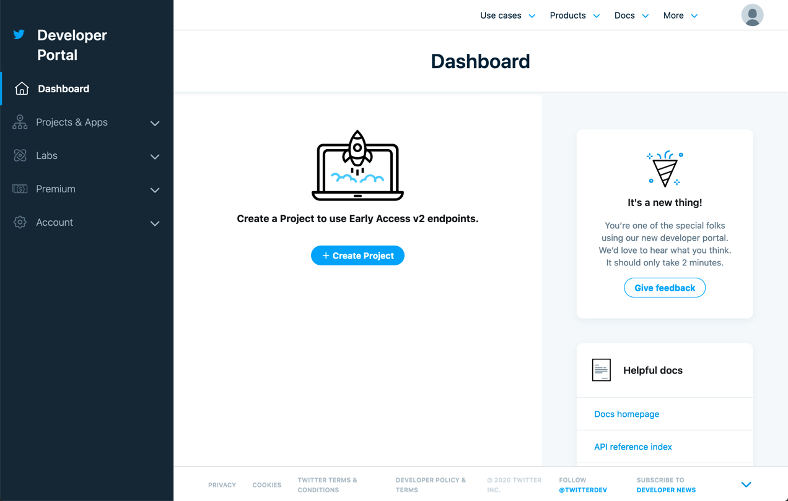
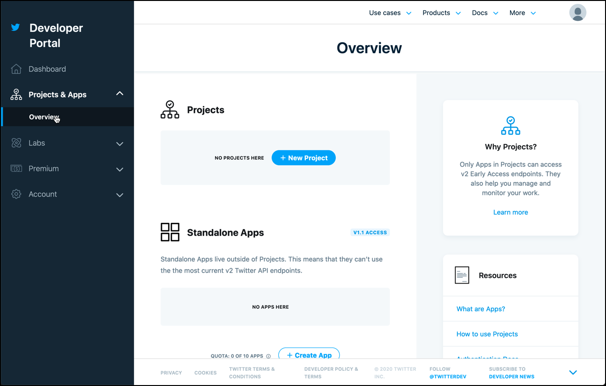
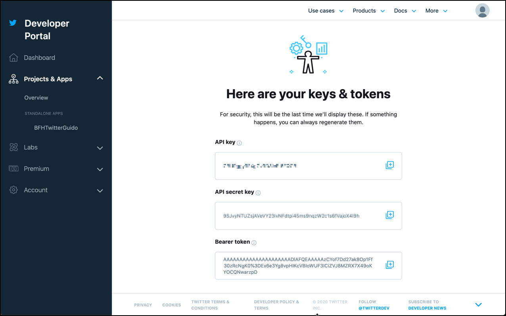
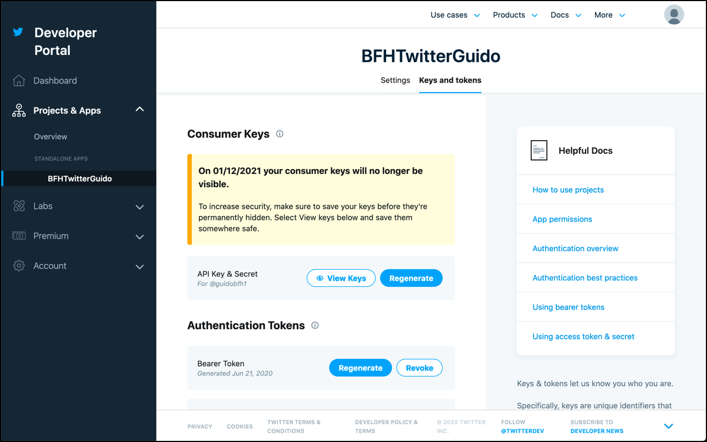
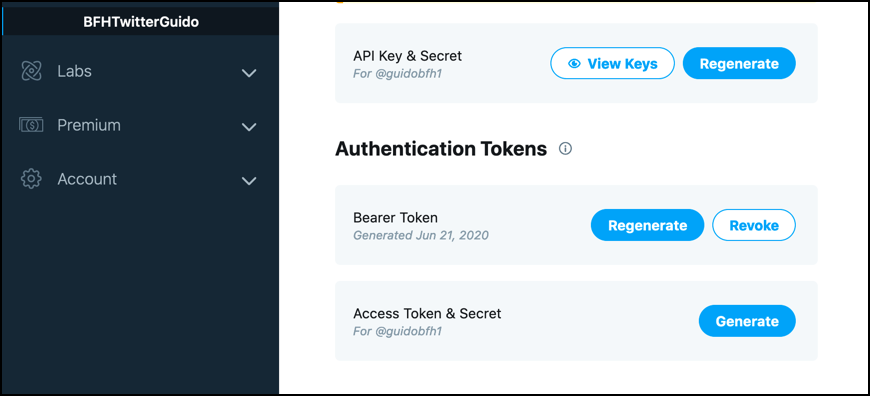
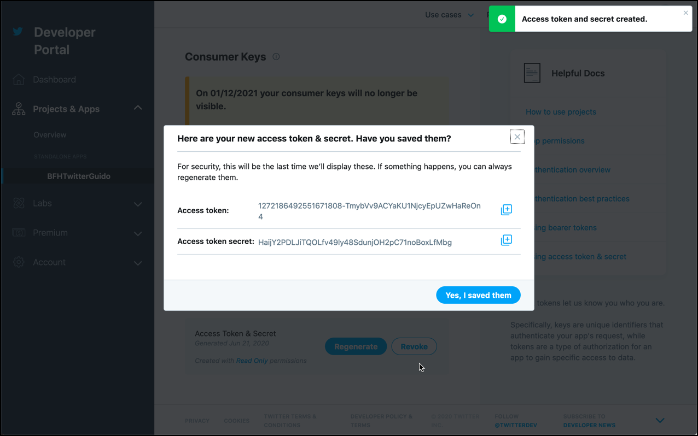

# Creating a Twitter Application

For getting live tweets in this course, we will connect to twitter through the so-called [Filter Stream API](https://developer.twitter.com/en/docs/tweets/filter-realtime/overview.html). 

This allows setting some filter options, which defines the Tweets we are interested in. Filters can be set on Terms, Geographic Location, Language and User. 

In order to use the Twitter [Filter Stream API](https://developer.twitter.com/en/docs/tweets/filter-realtime/overview.html), we have to apply for a Twitter developers account. 

## Apply for a Twitter developers account

If you don't have a Twitter user yet, you also have to create an account, which you can do from the sign in page below. It's free and you can for example use your school email address for it. 

Navigate to <https://developer.twitter.com/en> and click on the **Sign in** button on the top right corner. 

On the **Log into Twitter** screen, under **Phone, email or username** and **Password** enter the details of your existing twitter account and click **Log in**. 

If you don’t yet have a twitter account, then click on the **Sign up for Twitter** link to register for a Twitter account.

After login in you should get forwarded to your Twitter account homepage. Navigate to <https://developer.twitter.com/en> to access the Twitter Developers portal as a signed-in user. 

Now click on the **Apply** link on the top right corner to apply for access.

On the new screen, click on **Apply for developer account** and you should get to first page for registration. Select **Student** and then click **Next**.

On the new screen, add a phone number if your account does not yet have one, as indicated	in the screen below. Refresh the screen once you have added the phone number and the red notification message should disappear. 

Enter the Country, give your account a name and click **Next**.

On the next page mention the course, the name of the instructor and what you are planing to do with the API. 

Also enter a response to the comment for **Are you planning to analyze Twitter data?** and set the other three questions to **No** and click **Next**. 

On the **Is everything correct?** page make sure that everything is correct and then click on **Looks good!**.

On the **Please review and accept** click on the check box and then click on **Submit Application**.

Now twitter will send you a confirmation email to the email address registered with your Twitter account. Confirm it and wait for the confirmation by Twitter. 

Once you got the confirmation from Twitter, you are ready to create your first Twitter application. 

## Create a Twitter Application

In a browser window, navigate to <https://developer.twitter.com/en> and you should get to the developer portal. 

Click on the **Dashboard** link in the upper right corner. 

Click on **Projects & Apps** to expand and click on **Overview**

Click on **+ Create App** at the bottom of the page to create a new Twitter application.

Enter a unique name (something like `BFHTwitter<your name>`) into the **Type app name here** and click **Complete**. 

You have successfully created your first Twitter application. You can create a maximum of 10 applications.

Note that you will need the **API key**, the **API key secret** the **Access Token** and the **Access Token Secret** when using the Twitter API and connecting with OAuth protocol.

To get the **Consumer Key** and **Consumer Secret**, click on the newly created application in the menu to the left and then navigate to the **Keys and Tokens** menu

Click on **View Keys** to get the **API key** and **API key secret**. 

To the **Access Token** and the **Access Token Secret**, scroll down to the **Authentication Tokens** section 

and click on **Generate** right to **Access Token & Scret**. A pop-up window will show up containing the **Access Token** and the **Access Token Secret**.

