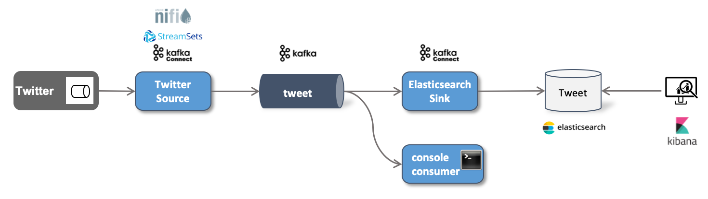

# Twitter Workshop (outdated, as there is no longer a free version of the streaming API)

In this workshop we will implement a streaming pipeline which gets live data from Twitter and sends it through a Kafka topic to an Elasticsearch database for later retrieval. The solution architecture is shown in the diagram below.

We will show the same implementation using different alternative technologies.

In order to work with Twitter, you need a Twitter account, apply for Developer access and then create a Twitter application. Check out [Creating a Twitter Application](../99-misc/99-twitter-app/README.md) to see how this can be done. 

For the Ingestion part we have 3 different solutions:

* [Ingesting Tweets into Kafka using StreamSets Data Collector](../04a-twitter-data-ingestion-with-streamsets/README.md)
* [Ingesting Tweets into Kafka using Apache NiFi](../04b-twitter-data-ingestion-with-apache-nifi/README.md)
* [Ingesting Tweets into Kafka using Kafka Connect](../04c-twitter-data-ingestion-with-kafka-connect/README.md)

For storing the Tweets into Elasticsearch we only have one solution:

* [Storing Tweets into Elasticsearch using Kafka Connect](../04d-stream-data-integration-with-elasticsearch/README.md)
